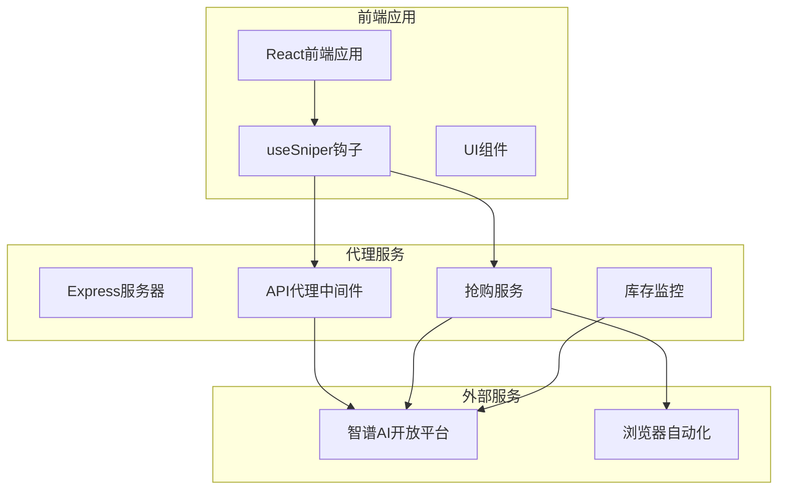
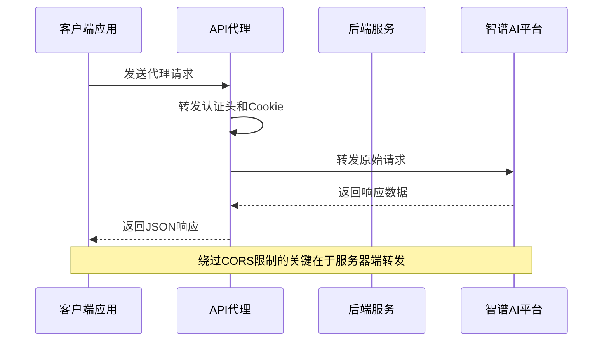
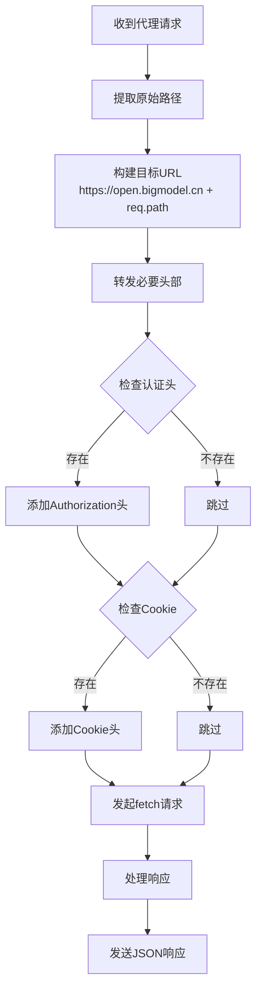
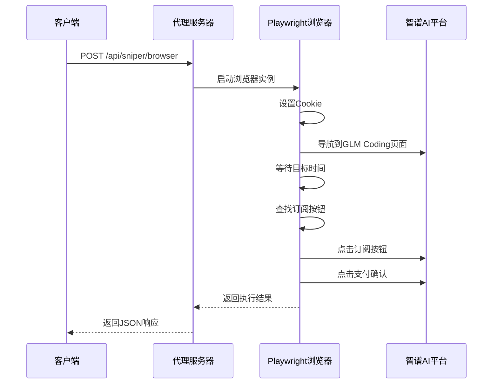
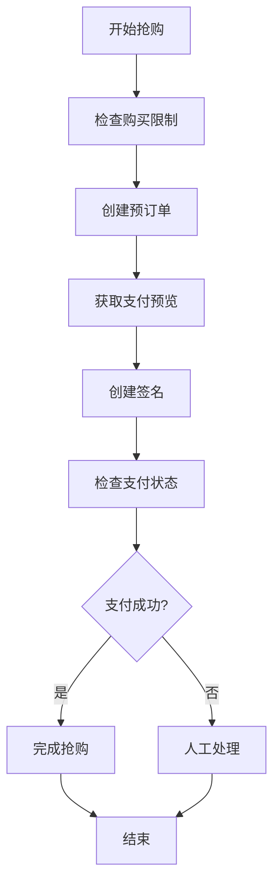
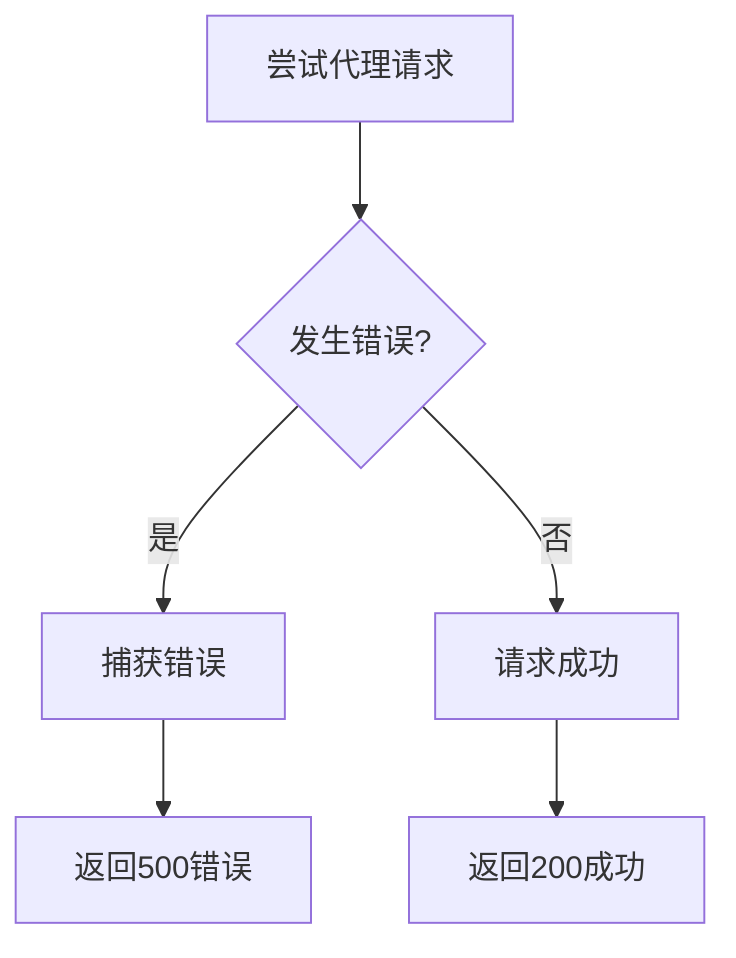

# API代理服务

<cite>
**本文档引用的文件**
- [server/index.ts](file://server/index.ts)
- [src/hooks/useSniper.ts](file://src/hooks/useSniper.ts)
- [src/components/AuthPanel.tsx](file://src/components/AuthPanel.tsx)
- [src/lib/config.ts](file://src/lib/config.ts)
- [package.json](file://package.json)
</cite>

## 目录
1. [简介](#简介)
2. [项目结构](#项目结构)
3. [核心组件](#核心组件)
4. [架构概览](#架构概览)
5. [详细组件分析](#详细组件分析)
6. [依赖关系分析](#依赖关系分析)
7. [性能考量](#性能考量)
8. [故障排除指南](#故障排除指南)
9. [结论](#结论)

## 简介
本项目是一个基于Node.js + Express的API代理服务，专门用于绕过浏览器CORS限制，实现对智谱AI开放平台(open.bigmodel.cn)API的代理访问。该服务提供了以下核心功能：
- CORS绕过代理：通过服务器端转发请求，避免浏览器同源策略限制
- 认证头传递：自动转发Authorization头和Cookie信息
- 多模式抢购支持：提供浏览器自动化模式和API高速模式
- 实时库存监控：监控GLM Coding套餐的库存状态

## 项目结构
项目采用前后端分离架构，主要由以下部分组成：



**图表来源**
- [server/index.ts:1-370](file://server/index.ts#L1-L370)
- [src/hooks/useSniper.ts:1-407](file://src/hooks/useSniper.ts#L1-L407)

**章节来源**
- [server/index.ts:1-370](file://server/index.ts#L1-L370)
- [package.json:1-48](file://package.json#L1-L48)

## 核心组件
本项目的核心组件包括API代理中间件、抢购服务、库存监控和认证管理模块。

### API代理中间件
API代理中间件是整个系统的核心，负责处理所有对open.bigmodel.cn的请求转发。

**章节来源**
- [server/index.ts:10-40](file://server/index.ts#L10-L40)

### 抢购服务
提供两种抢购模式：
- **浏览器自动化模式**：使用Playwright进行页面交互
- **API高速模式**：直接调用API接口，速度更快

**章节来源**
- [server/index.ts:42-159](file://server/index.ts#L42-L159)
- [src/hooks/useSniper.ts:76-248](file://src/hooks/useSniper.ts#L76-L248)

### 库存监控
实时监控GLM Coding套餐的库存状态，支持自动触发抢购。

**章节来源**
- [server/index.ts:252-355](file://server/index.ts#L252-L355)
- [src/hooks/useSniper.ts:318-372](file://src/hooks/useSniper.ts#L318-L372)

## 架构概览
系统采用客户端-服务器架构，通过代理层实现跨域请求转发。



**图表来源**
- [server/index.ts:12-40](file://server/index.ts#L12-L40)
- [src/hooks/useSniper.ts:108-248](file://src/hooks/useSniper.ts#L108-L248)

## 详细组件分析

### API代理中间件详解

#### CORS绕过机制
API代理中间件通过Express的路由中间件实现，监听`/proxy`路径的所有请求。



**图表来源**
- [server/index.ts:12-40](file://server/index.ts#L12-L40)

#### 请求转发逻辑
代理服务实现了完整的请求转发逻辑，包括HTTP方法、头部和请求体的处理。

**章节来源**
- [server/index.ts:12-40](file://server/index.ts#L12-L40)

#### 头部处理机制
代理服务智能处理各种头部信息：

1. **认证头转发**：自动转发Authorization头
2. **Cookie处理**：转发用户会话Cookie
3. **内容类型**：统一设置为application/json
4. **请求体处理**：仅在非GET请求时转发

**章节来源**
- [server/index.ts:15-33](file://server/index.ts#L15-L33)

### 抢购服务组件

#### 浏览器自动化模式
使用Playwright进行完整的浏览器自动化操作：



**图表来源**
- [server/index.ts:43-159](file://server/index.ts#L43-L159)

#### API高速模式
直接调用API接口，实现更高效的抢购流程：



**图表来源**
- [src/hooks/useSniper.ts:111-248](file://src/hooks/useSniper.ts#L111-L248)

**章节来源**
- [server/index.ts:161-250](file://server/index.ts#L161-L250)
- [src/hooks/useSniper.ts:111-248](file://src/hooks/useSniper.ts#L111-L248)

### 库存监控组件

#### 实时库存检查
系统提供实时库存监控功能，支持自动触发抢购：

**章节来源**
- [server/index.ts:252-355](file://server/index.ts#L252-L355)
- [src/hooks/useSniper.ts:318-372](file://src/hooks/useSniper.ts#L318-L372)

## 依赖关系分析

### 外部依赖
项目使用了以下关键依赖：

```mermaid
graph LR
subgraph "核心依赖"
Express[express@^5.2.1]
Cors[cors@^2.8.6]
CookieParse[cookie-parse@^0.4.0]
Playwright[playwright@^1.59.1]
end
subgraph "前端依赖"
React[react@^19.2.5]
ReactDOM[react-dom@^19.2.5]
TailwindCSS[tailwindcss@^3.4.17]
end
subgraph "开发依赖"
Typescript[typescript@~6.0.2]
Vite[vite@^8.0.10]
TSX[tsx@^4.21.0]
end
Express --> Cors
Express --> CookieParse
Playwright --> BrowserAutomation
React --> FrontendApp
```

**图表来源**
- [package.json:14-26](file://package.json#L14-L26)
- [package.json:27-46](file://package.json#L27-L46)

### 内部模块依赖
前端模块之间的依赖关系：

**章节来源**
- [package.json:14-48](file://package.json#L14-L48)

## 性能考量

### 代理性能优化
- **异步处理**：所有代理请求都使用async/await模式
- **流式响应**：使用fetch的流式响应处理大文件
- **连接复用**：利用Node.js内置的HTTP连接池

### 抢购性能优化
- **提前触发**：在目标时间前2秒发起请求以补偿网络延迟
- **重试机制**：智能重试，最多5次重试
- **验证码检测**：自动检测验证码拦截并提示用户

## 故障排除指南

### 常见问题及解决方案

#### 1. CORS错误
**问题描述**：浏览器直接访问open.bigmodel.cn出现CORS错误
**解决方案**：使用代理服务`/proxy`路径转发请求

**章节来源**
- [server/index.ts:11-12](file://server/index.ts#L11-L12)

#### 2. 认证失败
**问题描述**：401 Unauthorized错误
**解决方案**：
- 确保Authorization头正确设置
- 检查Token有效期
- 验证Cookie完整性

**章节来源**
- [src/components/AuthPanel.tsx:18-41](file://src/components/AuthPanel.tsx#L18-L41)
- [src/hooks/useSniper.ts:115-119](file://src/hooks/useSniper.ts#L115-L119)

#### 3. 验证码拦截
**问题描述**：出现验证码或安全验证
**解决方案**：
- 手动完成验证码验证
- 重新获取有效的Cookie
- 稍后再试

**章节来源**
- [src/hooks/useSniper.ts:157-167](file://src/hooks/useSniper.ts#L157-L167)

#### 4. 代理服务不可用
**问题描述**：无法连接到代理服务
**解决方案**：
- 确认服务端口3100正在运行
- 检查防火墙设置
- 验证服务日志

**章节来源**
- [server/index.ts:362-369](file://server/index.ts#L362-L369)

### 错误处理机制

#### 代理服务错误处理
代理服务实现了完善的错误处理机制：



**图表来源**
- [server/index.ts:37-39](file://server/index.ts#L37-L39)

**章节来源**
- [server/index.ts:37-39](file://server/index.ts#L37-L39)

## 结论

本API代理服务为智谱AI开放平台提供了一个完整、可靠的代理解决方案。通过服务器端转发，有效绕过了浏览器的CORS限制，同时提供了多种抢购模式和实用功能：

### 主要优势
- **CORS绕过**：通过服务器端转发完全解决跨域问题
- **多模式支持**：提供浏览器自动化和API高速两种抢购模式
- **智能监控**：实时库存监控和自动触发功能
- **错误处理**：完善的错误处理和重试机制

### 安全考虑
- **认证头保护**：仅转发必要的认证信息
- **请求验证**：对所有请求进行基本验证
- **日志记录**：详细的操作日志便于审计

### 使用建议
1. **优先使用API模式**：在有有效Token的情况下使用API模式获得最佳性能
2. **定期验证认证**：定期验证Token的有效性
3. **合理设置重试**：根据网络状况调整重试策略
4. **监控服务状态**：确保代理服务稳定运行

该服务为用户提供了一个强大而灵活的工具，既满足了技术需求，又保证了使用的便利性和安全性。