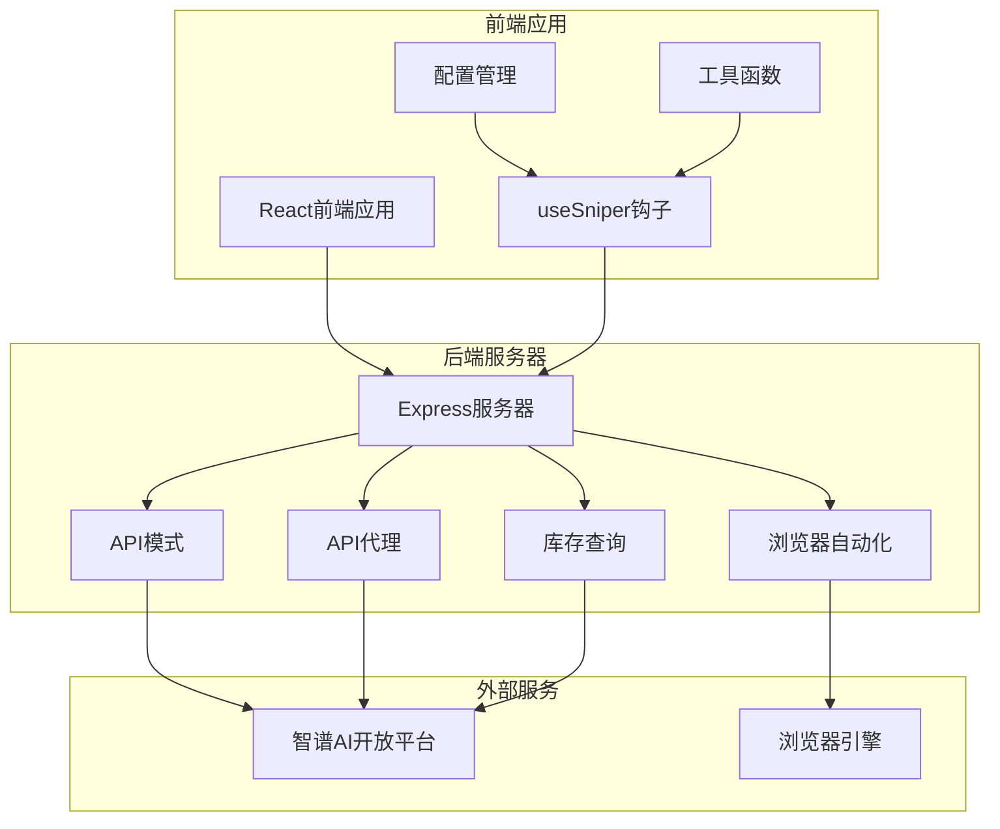
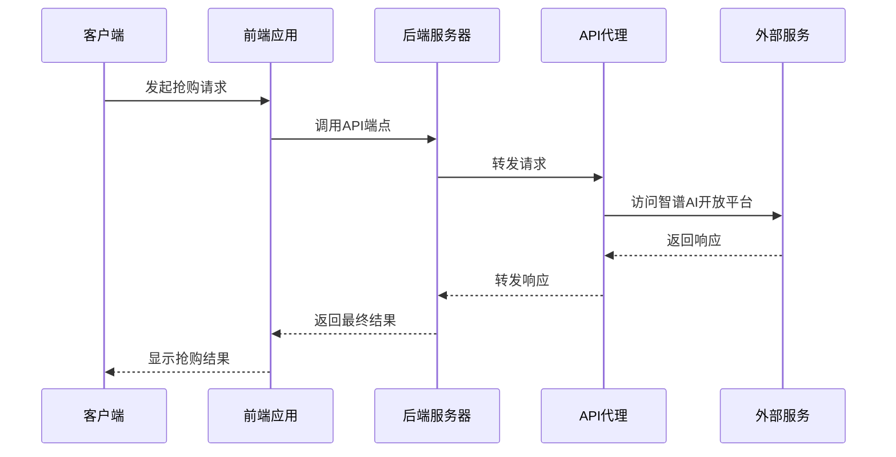
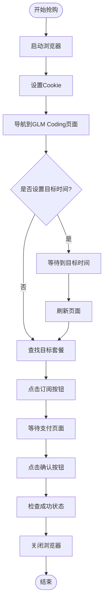
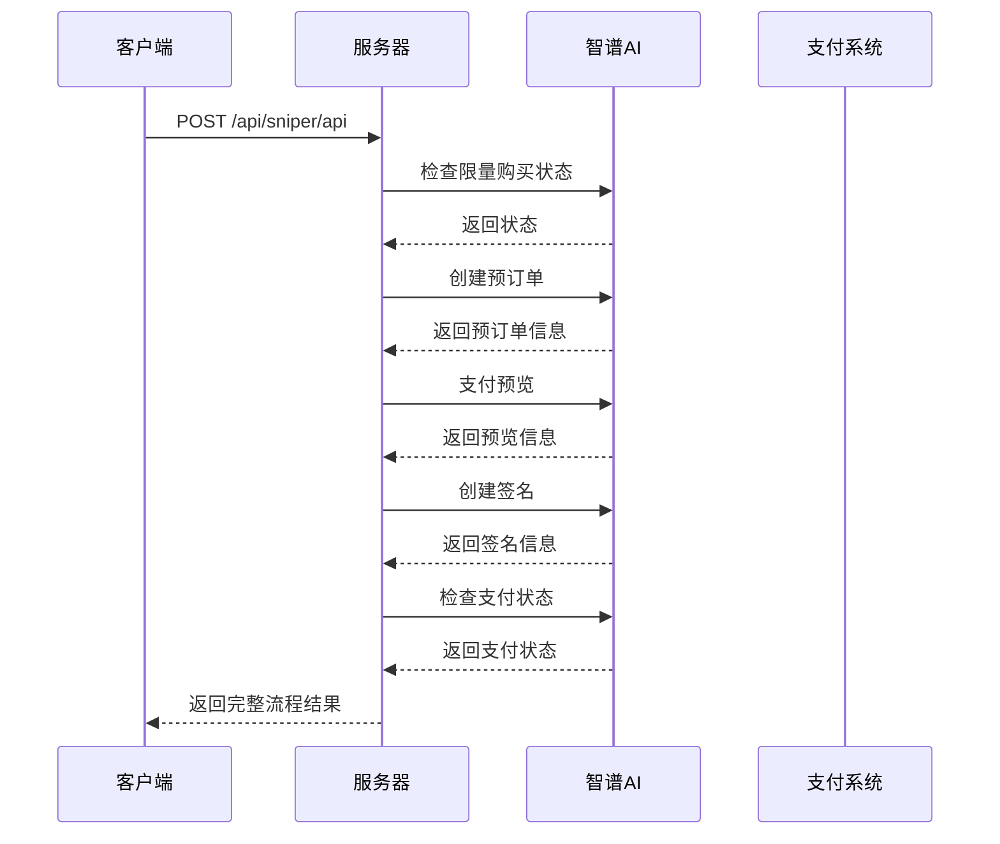
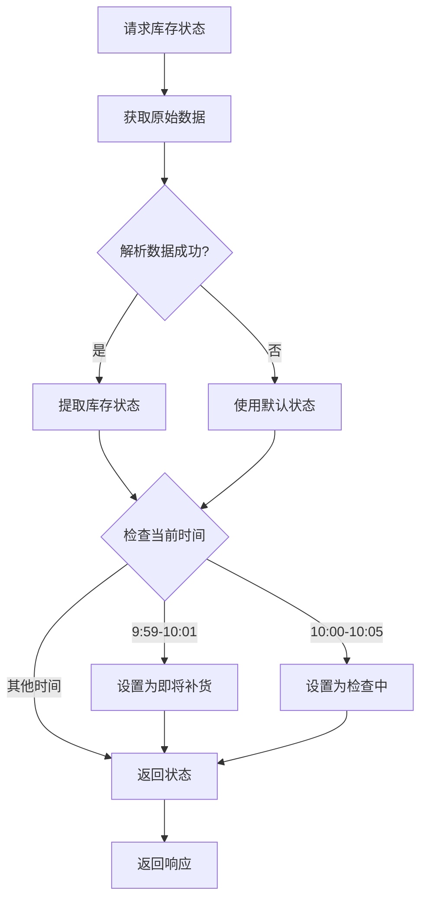
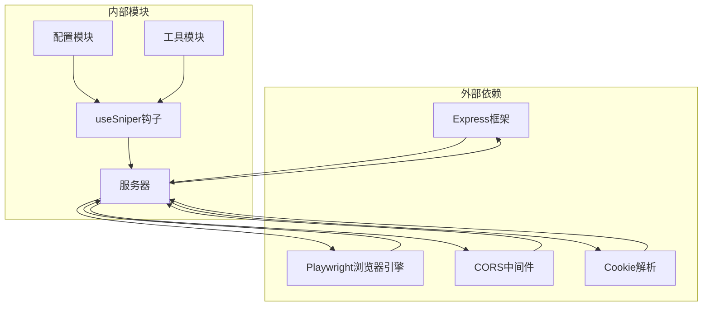
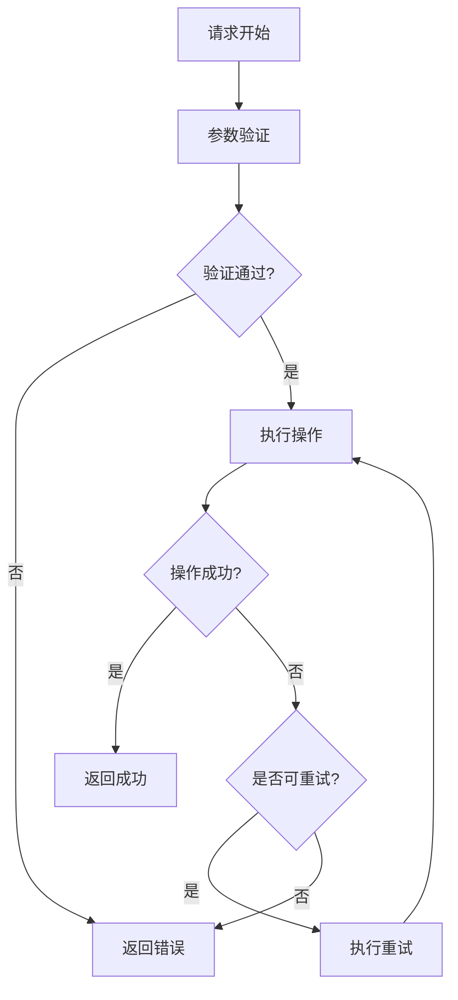
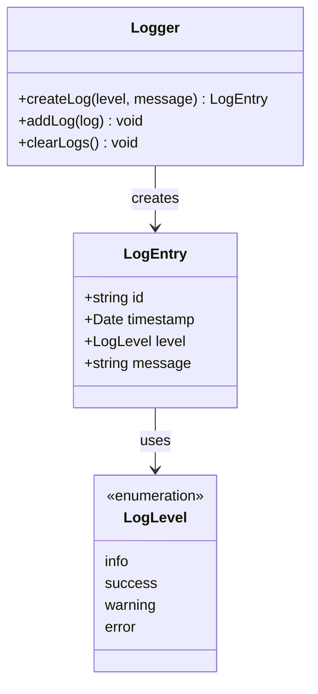

# API参考

<cite>
**本文档引用的文件**
- [server/index.ts](file://server/index.ts)
- [src/lib/config.ts](file://src/lib/config.ts)
- [src/hooks/useSniper.ts](file://src/hooks/useSniper.ts)
- [src/lib/utils.ts](file://src/lib/utils.ts)
- [package.json](file://package.json)
</cite>

## 目录
1. [简介](#简介)
2. [项目结构](#项目结构)
3. [核心组件](#核心组件)
4. [架构概览](#架构概览)
5. [详细组件分析](#详细组件分析)
6. [依赖关系分析](#依赖关系分析)
7. [性能考虑](#性能考虑)
8. [故障排除指南](#故障排除指南)
9. [结论](#结论)

## 简介

GLM Sniper是一个基于React + TypeScript + Vite构建的智能抢购工具，专门用于抢购智谱AI的GLM Coding订阅服务。该工具提供了两种抢购模式：浏览器自动化模式和API高速模式，并集成了库存监控功能。

本API参考文档详细记录了服务器端提供的所有RESTful API端点，包括HTTP方法、URL模式、请求参数、响应格式，以及浏览器自动化API、API模式抢购API、库存查询API的具体接口规范。

## 项目结构

GLM Sniper项目采用前后端分离的架构设计，主要由以下组件构成：



**图表来源**
- [server/index.ts:1-370](file://server/index.ts#L1-L370)
- [src/hooks/useSniper.ts:1-407](file://src/hooks/useSniper.ts#L1-L407)

**章节来源**
- [server/index.ts:1-370](file://server/index.ts#L1-L370)
- [src/lib/config.ts:1-104](file://src/lib/config.ts#L1-L104)

## 核心组件

### 服务器端组件

GLM Sniper服务器端提供了四个主要的API端点，每个都针对特定的功能需求：

1. **API代理服务** (`/proxy/**`) - 用于绕过CORS限制
2. **浏览器自动化抢购** (`/api/sniper/browser`) - 基于Playwright的自动化抢购
3. **API模式抢购** (`/api/sniper/api`) - 高速API抢购流程
4. **库存状态查询** (`/api/stock/status`) - 实时库存状态监控

### 前端集成组件

前端通过自定义Hook `useSniper` 来管理抢购逻辑，该Hook提供了完整的状态管理和异步操作支持。

**章节来源**
- [server/index.ts:10-40](file://server/index.ts#L10-L40)
- [src/hooks/useSniper.ts:46-406](file://src/hooks/useSniper.ts#L46-L406)

## 架构概览

GLM Sniper采用了分层架构设计，确保了良好的可维护性和扩展性：



**图表来源**
- [server/index.ts:12-40](file://server/index.ts#L12-L40)
- [src/hooks/useSniper.ts:82-106](file://src/hooks/useSniper.ts#L82-L106)

## 详细组件分析

### API代理服务

API代理服务是整个系统的核心基础设施，用于解决跨域资源共享(CORS)问题，允许前端直接访问智谱AI的开放平台API。

#### 端点规范

**HTTP方法**: `ALL`
**URL模式**: `/proxy/**`
**请求头**: 自动转发原始请求头
**响应格式**: 直接转发目标URL的响应内容

#### 功能特性

- **CORS绕过**: 允许前端应用访问受CORS限制的API
- **请求转发**: 支持所有HTTP方法的请求转发
- **头部传递**: 自动传递认证头和Cookie信息
- **错误处理**: 统一的错误响应格式

**章节来源**
- [server/index.ts:12-40](file://server/index.ts#L12-L40)

### 浏览器自动化抢购API

浏览器自动化模式提供了最接近真实用户行为的抢购体验，使用Playwright进行页面自动化操作。

#### 端点规范

**HTTP方法**: `POST`
**URL模式**: `/api/sniper/browser`
**请求头**: `Content-Type: application/json`
**认证**: 支持Cookie认证

#### 请求参数

| 参数名 | 类型 | 必需 | 描述 |
|--------|------|------|------|
| plan | string | 是 | 目标套餐类型 (lite/pro/max) |
| cookies | string | 否 | 用户登录Cookie信息 |
| targetTime | string | 否 | 目标抢购时间 (ISO格式) |

#### 响应格式

```json
{
  "success": boolean,
  "message": string,
  "clicked": boolean
}
```

#### 抢购流程



**图表来源**
- [server/index.ts:43-159](file://server/index.ts#L43-L159)

**章节来源**
- [server/index.ts:43-159](file://server/index.ts#L43-L159)

### API模式抢购API

API模式提供了高性能的直接API调用方式，绕过了浏览器自动化开销。

#### 端点规范

**HTTP方法**: `POST`
**URL模式**: `/api/sniper/api`
**请求头**: `Content-Type: application/json`

#### 请求参数

| 参数名 | 类型 | 必需 | 描述 | 默认值 |
|--------|------|------|------|--------|
| plan | string | 是 | 目标套餐类型 | - |
| authToken | string | 是 | 认证令牌 | - |
| targetTime | string | 否 | 目标抢购时间 | - |
| paymentType | string | 否 | 支付方式 | alipay |

#### 响应格式

```json
{
  "success": boolean,
  "steps": {
    "limitCheck": object,
    "preOrder": object,
    "preview": object,
    "sign": object,
    "payStatus": object
  }
}
```

#### 抢购流程



**图表来源**
- [server/index.ts:162-250](file://server/index.ts#L162-L250)

**章节来源**
- [server/index.ts:162-250](file://server/index.ts#L162-L250)

### 库存状态查询API

库存查询API提供了实时的库存状态监控功能，帮助用户了解目标套餐的可用性。

#### 端点规范

**HTTP方法**: `GET`
**URL模式**: `/api/stock/status`

#### 响应格式

```json
{
  "success": boolean,
  "raw": object,
  "parsed": {
    "lite": {
      "available": boolean,
      "message": string
    },
    "pro": {
      "available": boolean,
      "message": string
    },
    "max": {
      "available": boolean,
      "message": string
    },
    "nextRelease": string | null
  },
  "timestamp": string
}
```

#### 库存状态逻辑



**图表来源**
- [server/index.ts:252-355](file://server/index.ts#L252-L355)

**章节来源**
- [server/index.ts:252-355](file://server/index.ts#L252-L355)

### 健康检查API

健康检查API用于监控服务器运行状态。

#### 端点规范

**HTTP方法**: `GET`
**URL模式**: `/api/health`

#### 响应格式

```json
{
  "status": "ok",
  "timestamp": string
}
```

**章节来源**
- [server/index.ts:357-360](file://server/index.ts#L357-L360)

## 依赖关系分析

GLM Sniper的依赖关系体现了清晰的分层架构：



**图表来源**
- [package.json:14-26](file://package.json#L14-L26)
- [server/index.ts:1-8](file://server/index.ts#L1-L8)

### 关键依赖说明

| 依赖包 | 版本 | 用途 |
|--------|------|------|
| express | ^5.2.1 | Web服务器框架 |
| playwright | ^1.59.1 | 浏览器自动化引擎 |
| cors | ^2.8.6 | CORS中间件 |
| cookie-parse | ^0.4.0 | Cookie解析工具 |
| react | ^19.2.5 | 前端UI框架 |
| @types/* | 相关版本 | TypeScript类型定义 |

**章节来源**
- [package.json:14-48](file://package.json#L14-L48)

## 性能考虑

### 并发控制

系统实现了多级并发控制机制：

1. **定时器管理**: 使用ref来管理定时器，防止内存泄漏
2. **重试机制**: 最多重试5次，避免无限循环
3. **监控轮询**: 库存监控默认5秒间隔，可根据需要调整

### 错误处理策略



### 内存管理

- **定时器清理**: 组件卸载时自动清理所有定时器
- **状态管理**: 使用React状态钩子管理组件状态
- **资源释放**: 浏览器实例在使用后及时关闭

## 故障排除指南

### 常见问题及解决方案

#### 1. CORS错误

**症状**: 前端无法访问API代理服务
**原因**: CORS配置问题
**解决方案**: 
- 确保后端服务器正确配置了CORS中间件
- 检查代理服务是否正常运行

#### 2. 认证失败

**症状**: API模式抢购返回认证错误
**原因**: 
- authToken缺失或过期
- Cookie格式不正确

**解决方案**:
- 确保提供有效的认证令牌
- 检查Cookie的domain和path设置

#### 3. 浏览器自动化失败

**症状**: 浏览器模式无法正常工作
**原因**:
- Playwright未正确安装
- 目标页面结构发生变化

**解决方案**:
- 重新安装Playwright依赖
- 检查页面选择器是否仍然有效

#### 4. 库存监控不准确

**症状**: 库存状态显示与实际不符
**原因**: 页面内容解析逻辑
**解决方案**:
- 检查库存查询API的响应格式
- 更新解析逻辑以适应页面变化

### 调试工具和方法

#### 日志记录

系统提供了完整的日志记录机制：



**图表来源**
- [src/lib/utils.ts:7-27](file://src/lib/utils.ts#L7-L27)

#### 健康检查

使用健康检查端点监控服务器状态：

```bash
curl http://localhost:3100/api/health
```

#### API测试

推荐使用Postman或curl进行API测试：

```bash
# 测试库存查询
curl http://localhost:3100/api/stock/status

# 测试浏览器模式
curl -X POST http://localhost:3100/api/sniper/browser \
  -H "Content-Type: application/json" \
  -d '{"plan":"pro","cookies":"","targetTime":"2024-01-01T10:00:00"}'

# 测试API模式
curl -X POST http://localhost:3100/api/sniper/api \
  -H "Content-Type: application/json" \
  -H "Authorization: Bearer YOUR_TOKEN" \
  -d '{"plan":"pro","authToken":"YOUR_TOKEN"}'
```

**章节来源**
- [src/lib/utils.ts:20-27](file://src/lib/utils.ts#L20-L27)
- [server/index.ts:357-360](file://server/index.ts#L357-L360)

## 结论

GLM Sniper提供了一个功能完整、架构清晰的抢购工具解决方案。通过结合浏览器自动化和API直连两种模式，用户可以根据自己的需求选择最适合的抢购方式。

### 主要优势

1. **双模式支持**: 浏览器自动化和API直连两种模式满足不同用户需求
2. **CORS绕过**: 通过代理服务解决跨域问题
3. **库存监控**: 实时监控库存状态，提高抢购成功率
4. **错误处理**: 完善的错误处理和重试机制
5. **易于使用**: 清晰的API接口和详细的文档

### 未来改进方向

1. **增强安全性**: 添加更多的安全验证和防护措施
2. **性能优化**: 进一步优化API响应时间和资源使用
3. **扩展性**: 支持更多的支付方式和套餐类型
4. **监控告警**: 添加更完善的监控和告警功能

该API参考文档为开发者提供了完整的技术规范和使用指南，有助于更好地理解和使用GLM Sniper的各项功能。