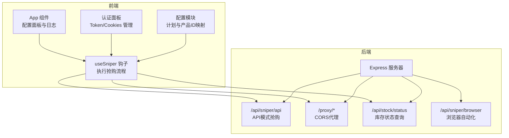
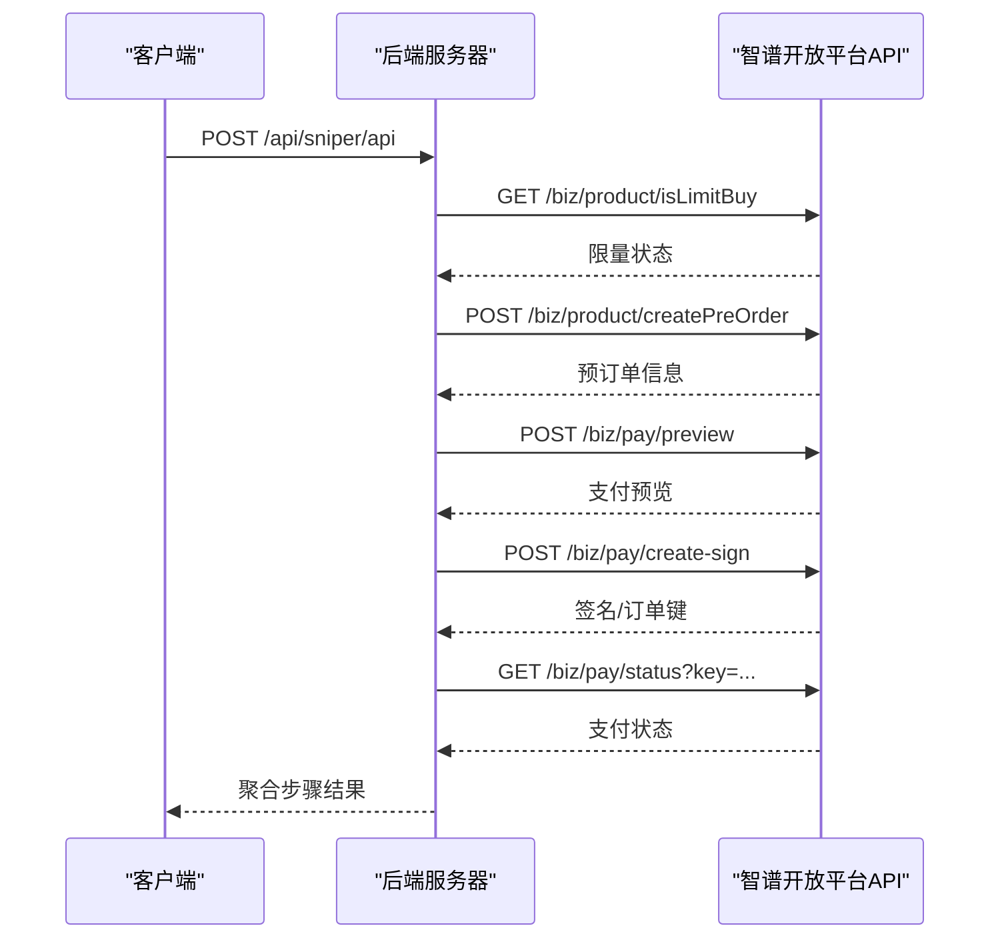
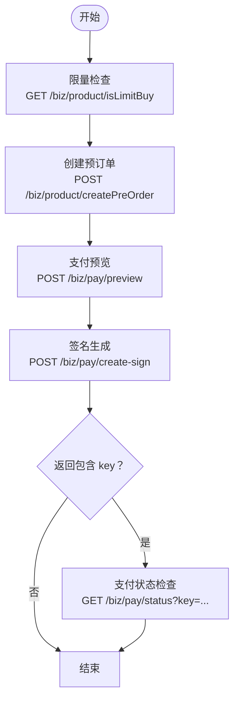
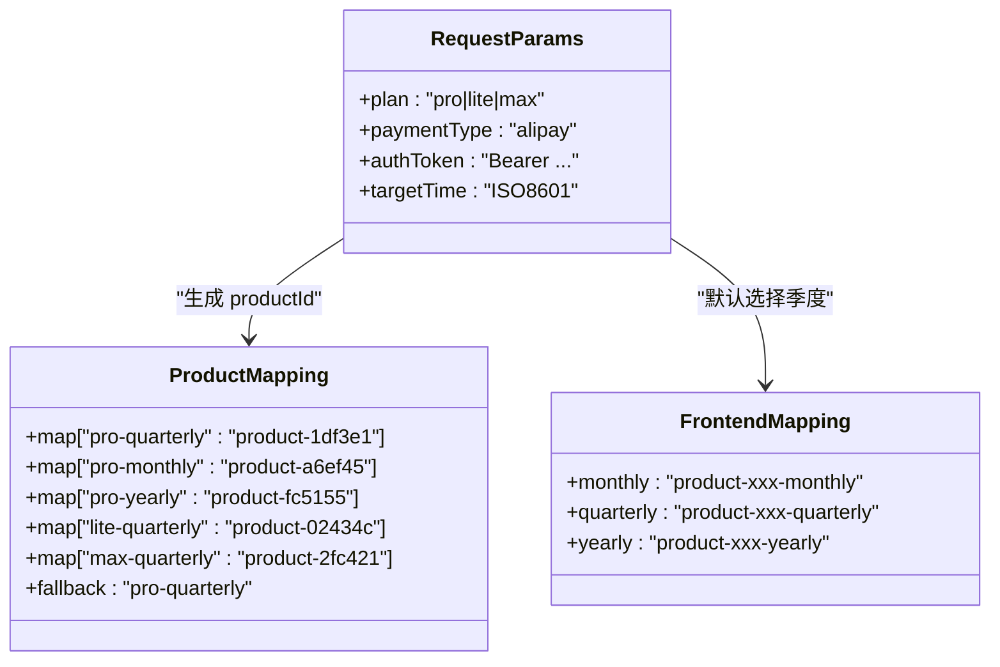
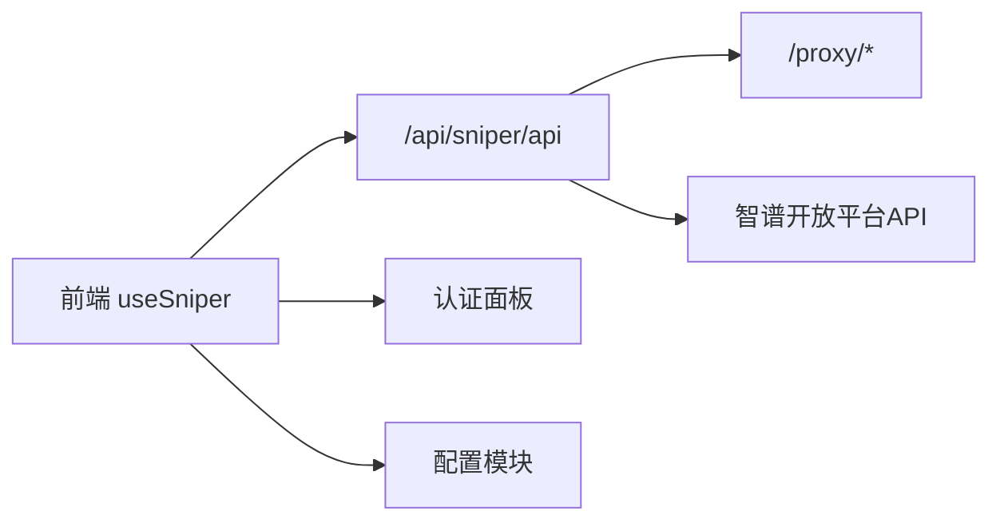

# API模式抢购API

<cite>
**本文档引用的文件**
- [server/index.ts](file://server/index.ts)
- [src/hooks/useSniper.ts](file://src/hooks/useSniper.ts)
- [src/lib/config.ts](file://src/lib/config.ts)
- [src/components/AuthPanel.tsx](file://src/components/AuthPanel.tsx)
- [src/App.tsx](file://src/App.tsx)
</cite>

## 目录
1. [简介](#简介)
2. [项目结构](#项目结构)
3. [核心组件](#核心组件)
4. [架构总览](#架构总览)
5. [详细组件分析](#详细组件分析)
6. [依赖分析](#依赖分析)
7. [性能考虑](#性能考虑)
8. [故障排除指南](#故障排除指南)
9. [结论](#结论)
10. [附录](#附录)

## 简介
本文件为“API模式抢购API”的完整技术文档，聚焦于后端服务中的 POST /api/sniper/api 接口。该接口通过直接调用智谱开放平台的业务接口，实现“限量检查-预订单创建-支付预览-签名生成-支付状态检查”五步抢购流程，无需浏览器自动化即可完成高速抢购。文档详细说明了请求参数、响应结构、错误处理机制、支持的支付方式与套餐映射关系，并提供使用示例与最佳实践建议。

## 项目结构
该项目采用前后端分离架构：
- 前端：React + TypeScript + Vite，负责用户界面与交互逻辑，调用后端提供的API模式接口。
- 后端：Express + Playwright，提供代理服务、库存查询、浏览器自动化模式以及核心的API模式抢购接口。

图表来源
- [server/index.ts:161-250](file://server/index.ts#L161-L250)
- [src/hooks/useSniper.ts:110-248](file://src/hooks/useSniper.ts#L110-L248)
- [src/lib/config.ts:51-101](file://src/lib/config.ts#L51-L101)

章节来源
- [server/index.ts:1-370](file://server/index.ts#L1-L370)
- [src/hooks/useSniper.ts:1-407](file://src/hooks/useSniper.ts#L1-L407)
- [src/lib/config.ts:1-104](file://src/lib/config.ts#L1-L104)

## 核心组件
- 后端服务入口与路由：提供 /api/sniper/api、/proxy/*、/api/stock/status、/api/sniper/browser 等接口。
- API模式抢购流程：封装在 /api/sniper/api 中，按顺序调用平台业务接口。
- 前端钩子 useSniper：负责组装请求参数、执行五步流程、处理错误与重试、记录日志。
- 配置模块 config：定义计划类型、产品ID映射、API端点常量等。

章节来源
- [server/index.ts:161-250](file://server/index.ts#L161-L250)
- [src/hooks/useSniper.ts:110-248](file://src/hooks/useSniper.ts#L110-L248)
- [src/lib/config.ts:51-101](file://src/lib/config.ts#L51-L101)

## 架构总览
API模式抢购的核心流程如下：客户端向后端 /api/sniper/api 发送请求，后端以 Bearer Token 作为授权，依次调用平台业务接口完成限量检查、预订单创建、支付预览、签名生成与支付状态检查，并将各步骤结果汇总返回。

图表来源
- [server/index.ts:161-250](file://server/index.ts#L161-L250)

## 详细组件分析

### 接口规范：POST /api/sniper/api
- 方法与路径：POST /api/sniper/api
- 内容类型：application/json
- 授权方式：请求头 Authorization: Bearer <authToken>
- 请求体参数
  - plan: 字符串，目标套餐标识，支持 "pro"、"lite"、"max"。注意：后端内部会基于 plan 生成产品ID映射（如 "pro-quarterly"），若传入其他值将回退到默认 "pro-quarterly"。
  - authToken: 字符串，必填。用于访问智谱开放平台业务接口的认证令牌。
  - targetTime: 字符串，ISO8601格式的时间字符串（例如 "2025-01-01T10:00:00Z"）。后端会计算与当前时间的差值，提前约2秒触发请求以补偿网络延迟。
  - paymentType: 字符串，支付方式，默认值为 "alipay"。当前前端实现固定使用 "alipay"，但后端接口允许传入该参数。
- 成功响应
  - success: 布尔值，true 表示整体流程成功。
  - steps: 对象，包含以下字段：
    - limitCheck: 限量检查结果
    - preOrder: 预订单创建结果
    - preview: 支付预览结果
    - sign: 签名生成结果
    - payStatus: 支付状态检查结果（当签名返回 key 时才存在）
- 失败响应
  - success: 布尔值，false
  - step: 字符串，指示失败发生在哪个步骤（如 "createPreOrder"）
  - status: 数字，HTTP状态码
  - error: 字符串，错误详情（来自平台接口的原始文本）

章节来源
- [server/index.ts:161-250](file://server/index.ts#L161-L250)

### 五步抢购流程详解
1. 限量检查
   - 调用 GET /biz/product/isLimitBuy
   - 作用：判断是否处于限量购买阶段
2. 预订单创建
   - 调用 POST /biz/product/createPreOrder
   - 参数：productId（由 plan 映射得到）、paymentType
   - 返回：预订单信息
3. 支付预览
   - 调用 POST /biz/pay/preview
   - 参数：productId、paymentType
   - 返回：支付预览信息
4. 签名生成
   - 调用 POST /biz/pay/create-sign
   - 参数：productId、paymentType
   - 返回：包含 key 或订单号的数据
5. 支付状态检查
   - 若签名返回 key，则调用 GET /biz/pay/status?key=<key>
   - 返回：支付状态（如 SUCCESS）

图表来源
- [server/index.ts:172-246](file://server/index.ts#L172-L246)

章节来源
- [server/index.ts:172-246](file://server/index.ts#L172-L246)

### 错误处理机制
- 步骤级错误
  - 预订单创建失败时，返回包含 step、status、error 的结构，便于定位问题。
- 验证码拦截检测
  - 前端在执行 API 模式时，若预订单创建返回包含验证码相关关键词或 403 状态，会记录警告并引导用户前往官网完成验证码。
- 重试策略
  - 前端对预订单创建失败进行最多5次重试，每次间隔1秒；后端未实现自动重试。
- 网络异常
  - 任何步骤抛出异常时，统一返回 500 并包含错误消息。

章节来源
- [server/index.ts:196-204](file://server/index.ts#L196-L204)
- [src/hooks/useSniper.ts:157-177](file://src/hooks/useSniper.ts#L157-L177)
- [src/hooks/useSniper.ts:243-247](file://src/hooks/useSniper.ts#L243-L247)

### 支付方式与套餐映射
- 支付方式
  - paymentType：当前默认 "alipay"，接口允许传入该参数。
- 套餐映射
  - 后端内部使用 productIdMap 将 plan 与产品ID关联，支持 "pro-quarterly"、"lite-quarterly"、"max-quarterly" 等。
  - 若传入的 plan 不在映射表中，将回退到默认 "pro-quarterly"。
- 前端产品ID映射
  - 前端还维护了 PRODUCT_IDS，包含 monthly、quarterly、yearly 三种周期的产品ID映射，用于默认选择“连续包季”。

图表来源
- [server/index.ts:180-189](file://server/index.ts#L180-L189)
- [src/lib/config.ts:52-68](file://src/lib/config.ts#L52-L68)

章节来源
- [server/index.ts:180-189](file://server/index.ts#L180-L189)
- [src/lib/config.ts:52-68](file://src/lib/config.ts#L52-L68)

### 前端集成与最佳实践
- 认证信息管理
  - 前端提供认证面板，支持显示/隐藏 Token，点击“验证 Token”可调用后端代理接口验证有效性。
- 抢购流程控制
  - 前端 useSniper 钩子负责组装请求参数、执行五步流程、记录日志、处理错误与重试。
- 时间控制
  - 前端会在目标时间前约2秒触发请求，以补偿网络延迟。
- 最佳实践
  - 使用 HTTPS 与正确的 Bearer Token。
  - 在限量阶段前准备好认证信息，避免因网络波动导致失败。
  - 若遇到验证码拦截，先在官网完成验证码再重试。

章节来源
- [src/components/AuthPanel.tsx:18-41](file://src/components/AuthPanel.tsx#L18-L41)
- [src/hooks/useSniper.ts:251-293](file://src/hooks/useSniper.ts#L251-L293)
- [src/App.tsx:116-126](file://src/App.tsx#L116-L126)

## 依赖分析
- 后端依赖
  - Express：提供路由与中间件
  - Playwright：用于浏览器自动化模式（非本次API模式）
  - cookie-parse：解析浏览器Cookies（用于浏览器自动化）
- 前端依赖
  - React + Vite：构建与开发环境
  - TailwindCSS：样式框架
  - cors：跨域支持（后端）
- 关键耦合点
  - 前端 useSniper 与后端 /api/sniper/api 强耦合，需保持请求参数一致。
  - 后端 /api/sniper/api 与智谱开放平台业务接口强耦合，需关注接口变更。

图表来源
- [src/hooks/useSniper.ts:110-248](file://src/hooks/useSniper.ts#L110-L248)
- [server/index.ts:161-250](file://server/index.ts#L161-L250)

章节来源
- [src/hooks/useSniper.ts:110-248](file://src/hooks/useSniper.ts#L110-L248)
- [server/index.ts:161-250](file://server/index.ts#L161-L250)

## 性能考虑
- 网络延迟补偿：前端在目标时间前约2秒发起请求，减少因网络抖动导致的错过时机。
- 重试策略：预订单创建失败时进行有限次数重试，提高成功率。
- 代理绕过CORS：后端提供 /proxy/* 代理，避免前端跨域限制，提升稳定性。
- 日志与可观测性：后端与前端均输出详细日志，便于定位问题。

## 故障排除指南
- 预订单创建失败
  - 检查 authToken 是否正确且未过期。
  - 若响应包含验证码相关关键词或 403，先在官网完成验证码后再重试。
  - 可尝试多次重试（前端最多5次）。
- 支付预览/签名失败
  - 确认 paymentType 与平台支持一致（当前默认 "alipay"）。
  - 检查 productId 是否正确映射（plan 与周期组合）。
- 支付状态未更新
  - 若签名返回 key，后端会自动查询支付状态；若长时间未更新，可在平台侧查看订单状态。
- CORS错误
  - 使用后端 /proxy/* 代理转发请求，避免跨域问题。

章节来源
- [src/hooks/useSniper.ts:157-177](file://src/hooks/useSniper.ts#L157-L177)
- [src/hooks/useSniper.ts:212-232](file://src/hooks/useSniper.ts#L212-L232)
- [server/index.ts:196-204](file://server/index.ts#L196-L204)

## 结论
POST /api/sniper/api 提供了高效、稳定的 API 模式抢购能力，通过五步流程与完善的错误处理机制，能够在限时抢购场景下显著提升成功率。配合前端的认证管理、时间控制与日志系统，用户可以更便捷地完成抢购任务。建议在生产环境中持续关注平台接口变更与验证码策略调整，以维持最佳体验。

## 附录

### 使用示例
- 请求示例（不含具体Token与时间）
  - 方法：POST
  - 路径：/api/sniper/api
  - 请求头：Authorization: Bearer <你的认证Token>
  - 请求体：
    - plan: "pro"
    - authToken: "<你的认证Token>"
    - targetTime: "2025-01-01T10:00:00Z"
    - paymentType: "alipay"
- 成功响应示例
  - success: true
  - steps:
    - limitCheck: {...}
    - preOrder: {...}
    - preview: {...}
    - sign: {...}
    - payStatus: {...}

章节来源
- [server/index.ts:161-250](file://server/index.ts#L161-L250)