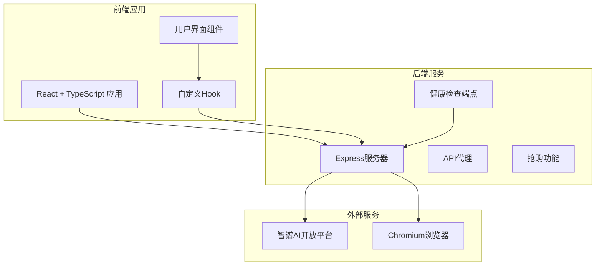
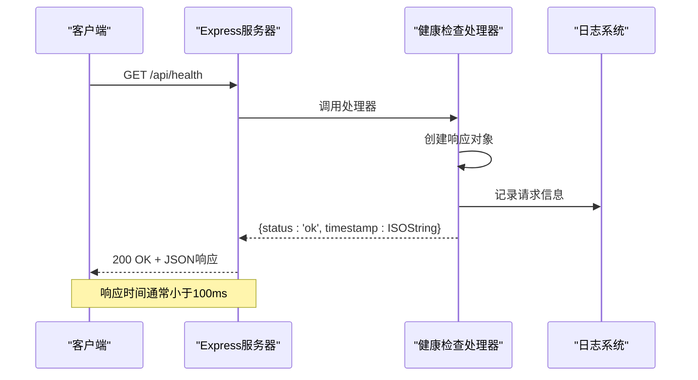
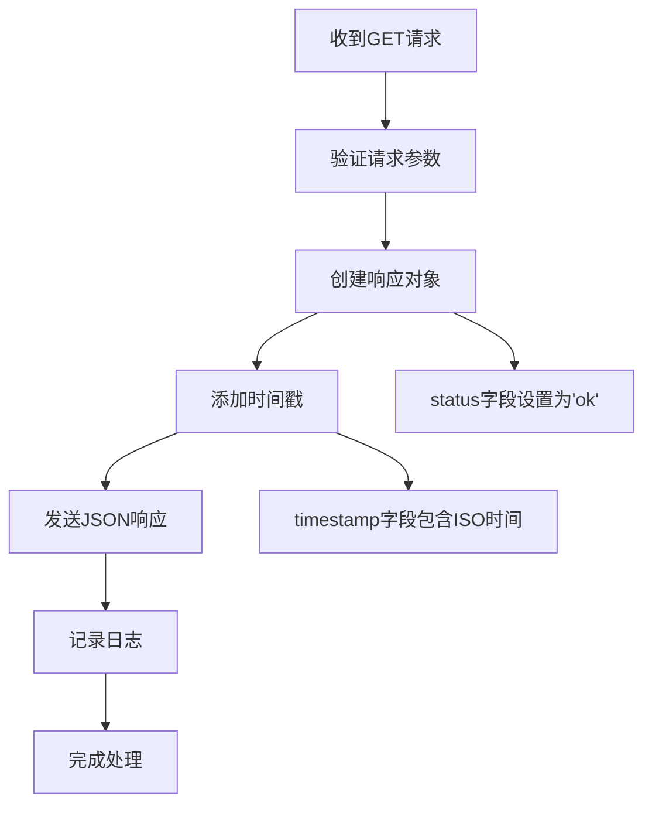
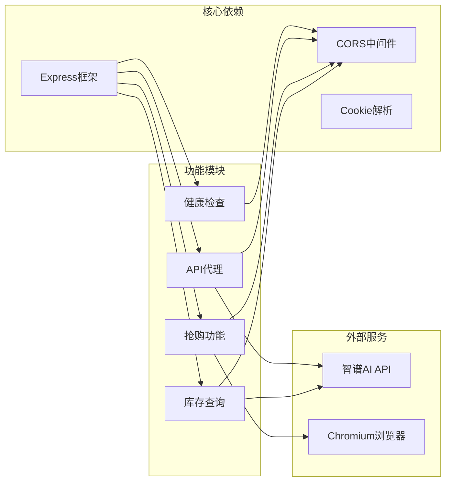
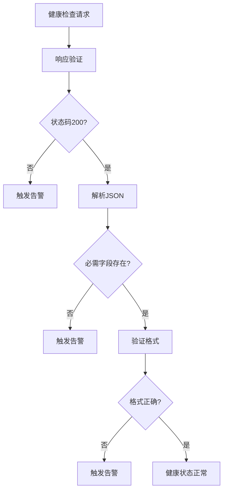

# 健康检查API

<cite>
**本文档引用的文件**
- [server/index.ts](file://server/index.ts)
- [package.json](file://package.json)
- [README.md](file://README.md)
- [src/App.tsx](file://src/App.tsx)
</cite>

## 目录
1. [简介](#简介)
2. [项目结构](#项目结构)
3. [核心组件](#核心组件)
4. [架构概览](#架构概览)
5. [详细组件分析](#详细组件分析)
6. [依赖关系分析](#依赖关系分析)
7. [性能考虑](#性能考虑)
8. [故障排除指南](#故障排除指南)
9. [结论](#结论)

## 简介

健康检查API是系统监控和负载均衡的重要组成部分，用于验证应用程序的可用性和运行状态。本项目中的健康检查端点 `/api/health` 提供了一个简单而有效的机制来监控服务器的健康状况。

该端点采用最小化设计，返回简洁的状态信息，便于各种监控工具和负载均衡器进行集成。它支持跨域请求，确保前端应用可以轻松访问健康检查信息。

## 项目结构

该项目采用前后端分离的架构设计：

**图表来源**
- [server/index.ts:1-370](file://server/index.ts#L1-L370)
- [package.json:1-48](file://package.json#L1-L48)

**章节来源**
- [server/index.ts:1-370](file://server/index.ts#L1-L370)
- [package.json:1-48](file://package.json#L1-L48)

## 核心组件

### 健康检查端点

健康检查端点位于 `/api/health`，是一个简单的GET请求处理程序：

- **端点路径**: `/api/health`
- **HTTP方法**: GET
- **响应状态码**: 200 OK
- **内容类型**: application/json
- **响应格式**: `{ status: 'ok', timestamp: string }`

该端点的设计遵循了健康检查的最佳实践：
- 返回固定的成功状态
- 包含精确的时间戳信息
- 使用简洁的数据结构
- 支持跨域访问

**章节来源**
- [server/index.ts:357-360](file://server/index.ts#L357-L360)

## 架构概览

**图表来源**
- [server/index.ts:357-360](file://server/index.ts#L357-L360)

## 详细组件分析

### 健康检查实现细节

健康检查端点的实现非常简洁，体现了"最小可用性"的设计原则：

**图表来源**
- [server/index.ts:357-360](file://server/index.ts#L357-L360)

### 响应格式规范

健康检查端点返回标准化的JSON响应：

| 字段名 | 数据类型 | 必需 | 描述 |
|--------|----------|------|------|
| status | string | 是 | 健康状态，固定值为 "ok" |
| timestamp | string | 是 | ISO 8601格式的UTC时间戳 |

**章节来源**
- [server/index.ts:357-360](file://server/index.ts#L357-L360)

### 错误处理机制

健康检查端点采用简化的错误处理策略：
- 不会抛出异常
- 总是返回200状态码
- 即使服务器内部出现问题，也会返回健康状态

这种设计确保了监控系统的可靠性，但需要注意这可能会掩盖真实的服务器问题。

## 依赖关系分析

**图表来源**
- [server/index.ts:1-370](file://server/index.ts#L1-L370)
- [package.json:14-26](file://package.json#L14-L26)

**章节来源**
- [server/index.ts:1-370](file://server/index.ts#L1-L370)
- [package.json:14-26](file://package.json#L14-L26)

## 性能考虑

### 响应时间要求

健康检查端点的性能特征：
- **预期响应时间**: < 100ms（通常 < 50ms）
- **内存占用**: 极低（仅创建小型JSON对象）
- **CPU消耗**: 最小化
- **并发处理**: 支持高并发请求

### 监控指标建议

虽然当前实现简单，但可以扩展以下监控指标：

| 指标类型 | 建议值 | 说明 |
|----------|--------|------|
| 响应时间(p50) | < 50ms | 50百分位响应时间 |
| 响应时间(p95) | < 100ms | 95百分位响应时间 |
| 响应时间(p99) | < 200ms | 99百分位响应时间 |
| 可用性 | > 99.9% | 一年内停机时间 < 8.76小时 |
| 错误率 | 0% | 健康检查失败率 |

## 故障排除指南

### 常见问题诊断

1. **端点无法访问**
   - 检查服务器是否正常运行
   - 验证端口3100是否被占用
   - 确认CORS配置允许跨域请求

2. **响应格式异常**
   - 确认Content-Type设置为application/json
   - 检查是否有中间件修改响应头

3. **时间戳格式错误**
   - 确保使用ISO 8601标准格式
   - 验证时区设置为UTC

### 监控集成建议

**章节来源**
- [server/index.ts:357-360](file://server/index.ts#L357-L360)

## 结论

健康检查API作为系统监控的基础组件，在本项目中实现了简洁而有效的设计。其特点包括：

**优势**:
- 实现简单，易于维护
- 性能优异，响应快速
- 兼容性强，支持跨域访问
- 标准化响应格式

**局限性**:
- 当前实现过于简化，可能掩盖真实问题
- 缺少详细的健康状态信息
- 无错误处理机制

**改进建议**:
1. 添加更详细的健康状态检查
2. 实现分级健康状态（healthy, warning, critical）
3. 添加错误处理和日志记录
4. 支持自定义检查间隔
5. 提供健康检查历史记录

该端点为系统的可观测性提供了基础，是构建完整监控体系的重要组成部分。