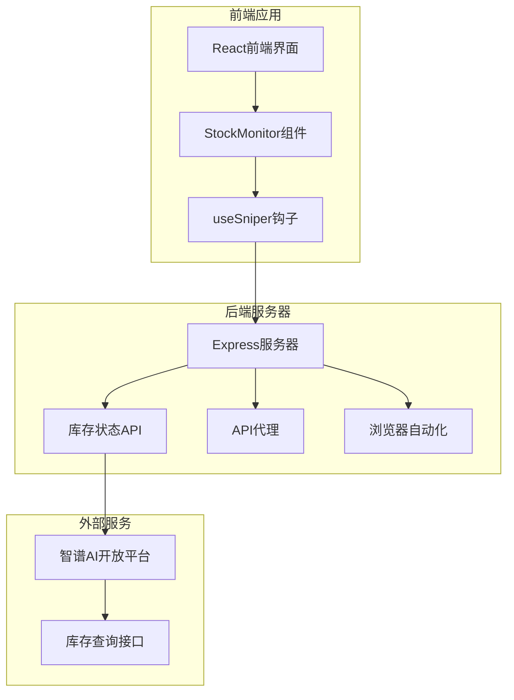
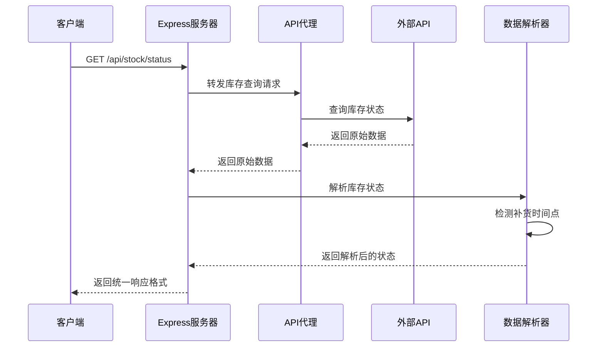
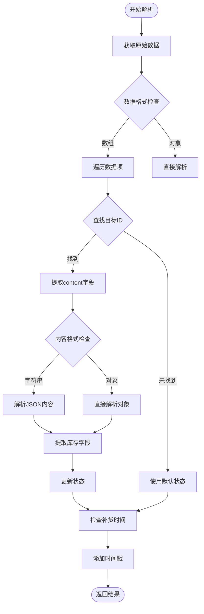
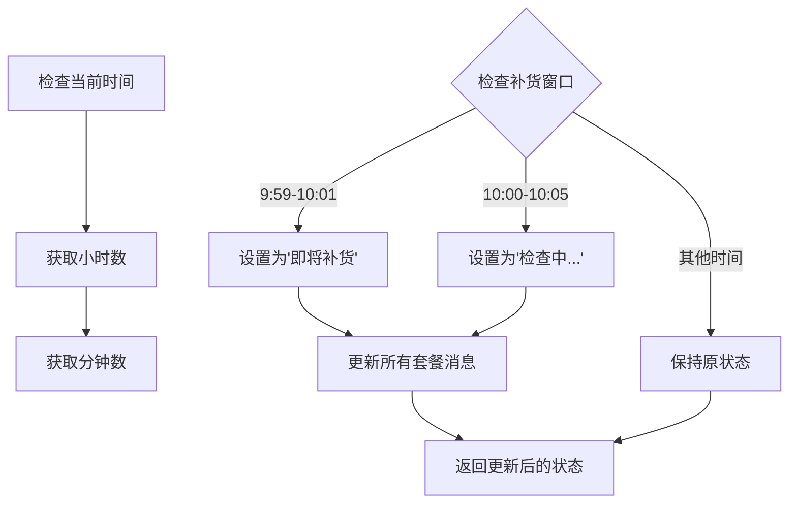
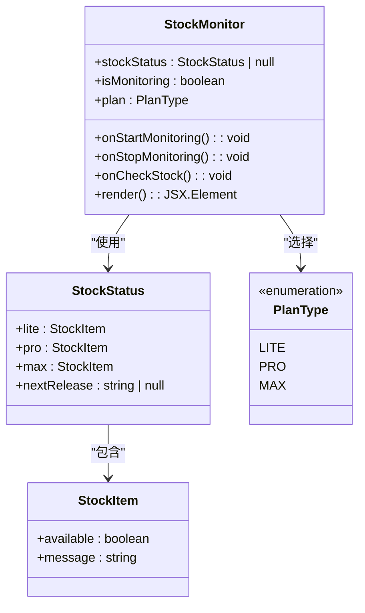
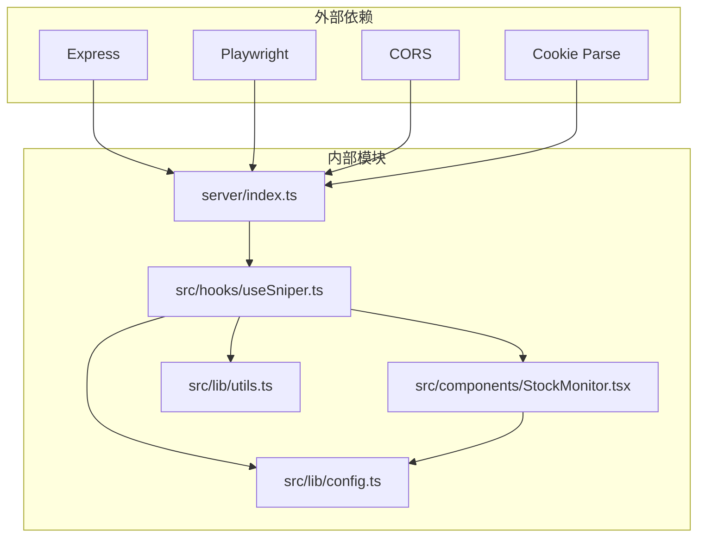

# 库存状态查询API

<cite>
**本文档引用的文件**
- [server/index.ts](file://server/index.ts)
- [src/hooks/useSniper.ts](file://src/hooks/useSniper.ts)
- [src/components/StockMonitor.tsx](file://src/components/StockMonitor.tsx)
- [src/lib/config.ts](file://src/lib/config.ts)
- [src/lib/utils.ts](file://src/lib/utils.ts)
</cite>

## 目录
1. [简介](#简介)
2. [项目结构](#项目结构)
3. [核心组件](#核心组件)
4. [架构概览](#架构概览)
5. [详细组件分析](#详细组件分析)
6. [依赖关系分析](#依赖关系分析)
7. [性能考虑](#性能考虑)
8. [故障排除指南](#故障排除指南)
9. [结论](#结论)

## 简介

库存状态查询API是GLM Sniper项目中的一个关键组件，用于实时监控和查询GLM Coding套餐的库存状态。该API提供了对Lite、Pro、Max三个套餐级别的库存状态检测，并实现了智能的库存补货机制识别，特别是针对每日10:00补货时间点的自动识别功能。

该API通过代理访问智谱AI开放平台的库存查询接口，解析返回的库存状态数据，并提供统一的响应格式，便于前端组件进行展示和后续的自动抢购操作。

## 项目结构

GLM Sniper项目采用前后端分离的架构设计，主要由以下组件构成：



**图表来源**
- [server/index.ts:1-370](file://server/index.ts#L1-L370)
- [src/hooks/useSniper.ts:1-407](file://src/hooks/useSniper.ts#L1-L407)
- [src/components/StockMonitor.tsx:1-140](file://src/components/StockMonitor.tsx#L1-L140)

**章节来源**
- [server/index.ts:1-370](file://server/index.ts#L1-L370)
- [src/hooks/useSniper.ts:1-407](file://src/hooks/useSniper.ts#L1-L407)
- [src/components/StockMonitor.tsx:1-140](file://src/components/StockMonitor.tsx#L1-L140)

## 核心组件

### 库存状态API端点

库存状态查询API的核心端点是`GET /api/stock/status`，该端点负责：

1. **库存状态查询**：向智谱AI开放平台查询指定ID的库存状态
2. **数据解析**：从原始响应中提取和解析库存状态信息
3. **智能补货识别**：识别和标记每日10:00的补货时间点
4. **统一响应格式**：提供标准化的响应数据结构

### 响应数据结构

API返回的数据结构包含以下关键字段：

| 字段名 | 类型 | 描述 | 示例值 |
|--------|------|------|--------|
| success | boolean | 请求是否成功 | true |
| raw | object | 原始API响应数据 | `{data: [...]}` |
| parsed | object | 解析后的库存状态 | `{lite: {...}, pro: {...}, max: {...}}` |
| timestamp | string | 响应生成时间戳 | `"2024-01-15T10:30:00Z"` |

**章节来源**
- [server/index.ts:252-355](file://server/index.ts#L252-L355)

## 架构概览

库存状态查询API的完整工作流程如下：



**图表来源**
- [server/index.ts:252-355](file://server/index.ts#L252-L355)

## 详细组件分析

### 库存状态字段定义

API支持三个主要的套餐级别，每个都包含以下字段：

#### 套餐状态结构
```typescript
interface StockItem {
  available: boolean;    // 是否有库存
  message: string;       // 状态描述信息
}
```

#### 主要套餐类型
| 套餐名称 | 价格 | 产品ID | 特性 |
|----------|------|--------|------|
| Lite | ¥49/月 | product-005 | 基础功能 |
| Pro | ¥149/月 | product-047 | 标准功能 |
| Max | ¥469/月 | product-047 | 高级功能 |

**章节来源**
- [src/lib/config.ts:28-49](file://src/lib/config.ts#L28-L49)

### 库存状态解析逻辑

API实现了多层次的库存状态解析机制：



**图表来源**
- [server/index.ts:276-330](file://server/index.ts#L276-L330)

#### 字段提取规则

API支持多种库存状态字段格式：

| 字段名 | 用途 | 可能值 | 说明 |
|--------|------|--------|------|
| liteStock | Lite套餐库存状态 | `"sold_out"`, `"available"` | 判断Lite套餐是否有库存 |
| proStock | Pro套餐库存状态 | `"sold_out"`, `"available"` | 判断Pro套餐是否有库存 |
| maxStock | Max套餐库存状态 | `"sold_out"`, `"available"` | 判断Max套餐是否有库存 |
| nextReleaseTime | 下次补货时间 | `"YYYY-MM-DD HH:mm:ss"` | 标识下一次补货的具体时间 |
| replenishTime | 补货时间 | `"每日 HH:MM"` | 标识每日固定的补货时间 |

**章节来源**
- [server/index.ts:284-307](file://server/index.ts#L284-L307)

### 自动补货时间识别机制

API实现了智能的补货时间识别功能，特别针对每日10:00的补货机制：



**图表来源**
- [server/index.ts:332-344](file://server/index.ts#L332-L344)

#### 时间识别规则

| 时间范围 | 状态标识 | 套餐消息 | 说明 |
|----------|----------|----------|------|
| 9:59-10:01 | 正常 | 保持原状态 | 即将补货的提示 |
| 10:00-10:05 | 特殊 | "检查中..." | 补货窗口期的特殊状态 |
| 其他时间 | 正常 | 保持原状态 | 标准库存状态显示 |

**章节来源**
- [server/index.ts:336-344](file://server/index.ts#L336-L344)

### 前端集成组件

#### StockMonitor组件

StockMonitor组件负责在用户界面中展示库存状态：



**图表来源**
- [src/components/StockMonitor.tsx:5-25](file://src/components/StockMonitor.tsx#L5-L25)

#### useSniper钩子

useSniper钩子提供了完整的库存监控功能：

| 方法名 | 功能描述 | 参数 | 返回值 |
|--------|----------|------|--------|
| checkStock | 执行库存状态检查 | 无 | Promise<void> |
| startMonitoring | 启动库存监控 | 无 | void |
| stopMonitoring | 停止库存监控 | 无 | void |
| stockStatus | 当前库存状态 | 无 | StockStatus \| null |
| isMonitoring | 监控状态 | 无 | boolean |

**章节来源**
- [src/hooks/useSniper.ts:318-372](file://src/hooks/useSniper.ts#L318-L372)

## 依赖关系分析

### 组件依赖关系



**图表来源**
- [server/index.ts:1-8](file://server/index.ts#L1-L8)
- [src/hooks/useSniper.ts:1-10](file://src/hooks/useSniper.ts#L1-L10)

### 数据流依赖

库存状态API的数据流遵循以下依赖关系：

1. **外部API依赖**：依赖智谱AI开放平台的库存查询接口
2. **解析器依赖**：依赖JSON解析能力处理动态内容
3. **时间处理依赖**：依赖JavaScript Date对象进行时间计算
4. **前端依赖**：依赖React组件进行状态展示

**章节来源**
- [server/index.ts:256-266](file://server/index.ts#L256-L266)
- [src/hooks/useSniper.ts:319-352](file://src/hooks/useSniper.ts#L319-L352)

## 性能考虑

### API调用频率优化

库存状态查询API在前端实现了合理的调用频率控制：

- **默认轮询间隔**：5秒
- **手动查询**：即时响应
- **监控状态**：仅在监控启用时轮询
- **错误重试**：最多5次重试，间隔1秒

### 内存管理

- **定时器清理**：组件卸载时自动清理定时器
- **状态缓存**：避免重复的API调用
- **错误处理**：防止内存泄漏的异常情况

### 网络优化

- **代理转发**：通过后端代理绕过CORS限制
- **超时控制**：合理设置请求超时时间
- **错误恢复**：在网络异常时提供降级方案

## 故障排除指南

### 常见错误及解决方案

| 错误类型 | 错误码 | 可能原因 | 解决方案 |
|----------|--------|----------|----------|
| 网络连接失败 | 500 | 无法连接到外部API | 检查网络连接，重试请求 |
| CORS错误 | 403 | 跨域请求被阻止 | 使用后端代理转发请求 |
| API响应格式错误 | 200但数据格式不正确 | 外部API格式变更 | 更新解析逻辑 |
| 解析JSON失败 | 200但解析异常 | content字段不是有效JSON | 回退到默认状态 |

### 调试建议

1. **检查后端日志**：查看服务器端的错误信息
2. **验证API连通性**：直接测试外部API的可用性
3. **检查时间同步**：确保系统时间准确
4. **监控内存使用**：避免长时间运行导致的内存泄漏

**章节来源**
- [server/index.ts:352-354](file://server/index.ts#L352-L354)
- [src/hooks/useSniper.ts:349-351](file://src/hooks/useSniper.ts#L349-L351)

## 结论

库存状态查询API为GLM Sniper项目提供了可靠的库存监控能力。通过智能的库存状态解析和补货时间识别机制，该API能够：

1. **准确识别库存状态**：支持多种库存状态字段格式
2. **智能补货识别**：特别针对每日10:00补货机制
3. **提供统一接口**：简化前端集成和使用
4. **具备良好的扩展性**：支持未来功能的扩展和改进

该API的设计充分考虑了实际使用场景的需求，在保证功能完整性的同时，也注重了性能和用户体验的平衡。