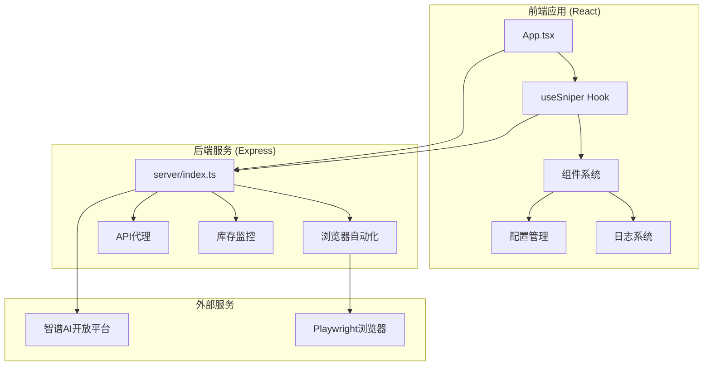
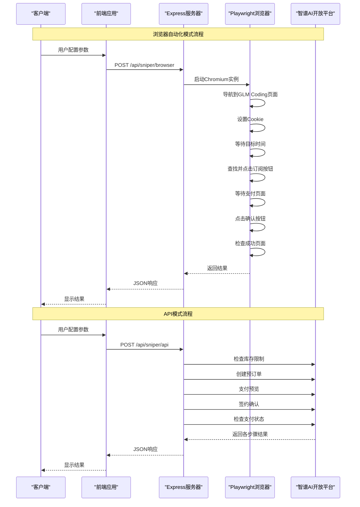
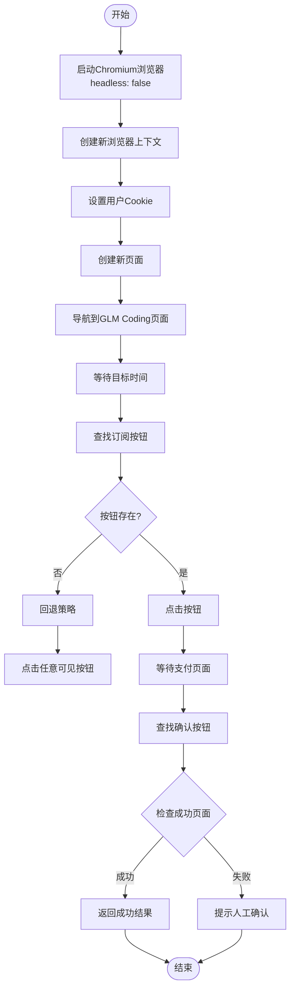
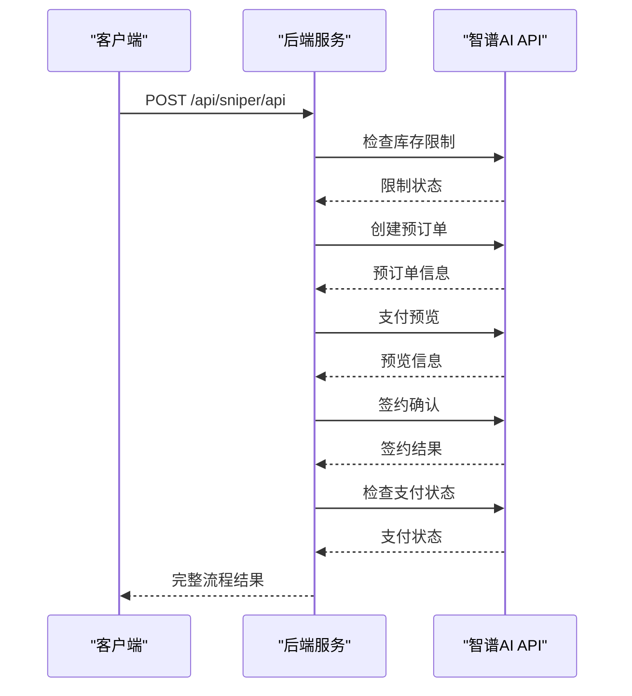
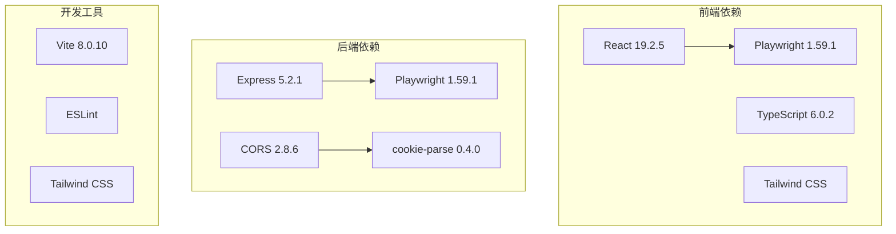

# 浏览器自动化API

<cite>
**本文档引用的文件**
- [server/index.ts](file://server/index.ts)
- [src/hooks/useSniper.ts](file://src/hooks/useSniper.ts)
- [src/lib/config.ts](file://src/lib/config.ts)
- [src/lib/utils.ts](file://src/lib/utils.ts)
- [src/App.tsx](file://src/App.tsx)
- [package.json](file://package.json)
</cite>

## 目录
1. [简介](#简介)
2. [项目结构](#项目结构)
3. [核心组件](#核心组件)
4. [架构概览](#架构概览)
5. [详细组件分析](#详细组件分析)
6. [依赖关系分析](#依赖关系分析)
7. [性能考虑](#性能考虑)
8. [故障排除指南](#故障排除指南)
9. [结论](#结论)

## 简介

GLM Sniper 是一个基于 Playwright 的浏览器自动化工具，专门用于智谱AI GLM Coding Plan的自动抢购。该工具提供了两种工作模式：浏览器自动化模式和API高速模式，旨在帮助用户在限时抢购活动中获得最佳体验。

项目采用React + TypeScript + Vite构建前端界面，配合Express服务器提供RESTful API服务。核心功能包括：
- Playwright浏览器自动化抢购
- 直连API的高速抢购模式
- 实时库存监控
- 多套餐类型支持（Lite、Pro、Max）
- 智能倒计时和重试机制

## 项目结构

该项目采用前后端分离的架构设计，主要分为以下模块：



**图表来源**
- [server/index.ts:1-370](file://server/index.ts#L1-L370)
- [src/App.tsx:1-197](file://src/App.tsx#L1-L197)

**章节来源**
- [server/index.ts:1-370](file://server/index.ts#L1-L370)
- [src/App.tsx:1-197](file://src/App.tsx#L1-L197)

## 核心组件

### API端点规范

#### POST /api/sniper/browser

这是浏览器自动化模式的核心端点，负责通过Playwright控制真实浏览器进行自动抢购。

**请求参数**

| 参数名 | 类型 | 必需 | 描述 | 示例 |
|--------|------|------|------|------|
| plan | string | 是 | 目标套餐类型 | "lite" 或 "pro" 或 "max" |
| cookies | string | 否 | 用户登录态Cookie | "token=abc123; session=xyz789" |
| targetTime | string | 否 | 目标抢购时间 | "2024-01-15T10:00:00" |

**响应格式**

```json
{
  "success": boolean,
  "message": string,
  "clicked": boolean
}
```

**错误处理**
- HTTP 500: 服务器内部错误
- 错误详情包含在message字段中

**章节来源**
- [server/index.ts:43-159](file://server/index.ts#L43-L159)

### API模式端点

#### POST /api/sniper/api

提供直连API的高速抢购模式，绕过浏览器自动化，直接调用智谱AI后端接口。

**请求参数**

| 参数名 | 类型 | 必需 | 描述 | 示例 |
|--------|------|------|------|------|
| plan | string | 是 | 目标套餐类型 | "pro-quarterly" |
| authToken | string | 是 | 用户认证Token | "Bearer ...token..." |
| targetTime | string | 否 | 目标抢购时间 | "2024-01-15T10:00:00" |
| paymentType | string | 否 | 支付方式 | "alipay" |

**响应格式**

```json
{
  "success": boolean,
  "steps": {
    "limitCheck": object,
    "preOrder": object,
    "preview": object,
    "sign": object,
    "payStatus": object
  }
}
```

**章节来源**
- [server/index.ts:161-250](file://server/index.ts#L161-L250)

### 库存状态查询

#### GET /api/stock/status

查询当前各套餐的库存状态。

**响应格式**

```json
{
  "success": boolean,
  "raw": object,
  "parsed": {
    "lite": { "available": boolean, "message": string },
    "pro": { "available": boolean, "message": string },
    "max": { "available": boolean, "message": string },
    "nextRelease": string | null
  },
  "timestamp": string
}
```

**章节来源**
- [server/index.ts:252-355](file://server/index.ts#L252-L355)

## 架构概览



**图表来源**
- [server/index.ts:43-159](file://server/index.ts#L43-L159)
- [server/index.ts:161-250](file://server/index.ts#L161-L250)

## 详细组件分析

### 浏览器自动化工作流程

#### 页面导航和元素定位

浏览器自动化模式通过以下步骤实现完整的抢购流程：



**图表来源**
- [server/index.ts:46-159](file://server/index.ts#L46-L159)

#### 元素定位策略

系统实现了多层元素定位策略以应对页面结构变化：

1. **特惠订阅定位**: `text=特惠订阅 >> nth=${planIndex}`
2. **按钮选择器**: `button:has-text("特惠订阅") >> nth=${planIndex}`
3. **CSS类定位**: `[class*="subscribe-btn"]:nth-child(${planIndex + 1})`

**章节来源**
- [server/index.ts:80-115](file://server/index.ts#L80-L115)

### API模式工作流程

#### 直连API抢购流程



**图表来源**
- [server/index.ts:171-246](file://server/index.ts#L171-L246)

**章节来源**
- [server/index.ts:161-250](file://server/index.ts#L161-L250)

### 套餐类型配置

系统支持三种套餐类型，每种都有对应的配置：

| 套餐类型 | 名称 | 价格 | 产品ID映射 |
|----------|------|------|------------|
| lite | Lite | ¥49/月 | product-005 |
| pro | Pro | ¥149/月 | product-047 |
| max | Max | ¥469/月 | product-047 |

**章节来源**
- [src/lib/config.ts:28-49](file://src/lib/config.ts#L28-L49)

## 依赖关系分析



**图表来源**
- [package.json:14-47](file://package.json#L14-L47)

**章节来源**
- [package.json:14-47](file://package.json#L14-L47)

## 性能考虑

### 浏览器自动化性能优化

1. **无头模式切换**: 可通过修改启动参数调整显示模式
2. **超时控制**: 合理设置元素等待超时时间
3. **内存管理**: 及时关闭浏览器实例释放资源
4. **网络优化**: 预热页面减少首次加载时间

### API模式性能优势

1. **直接通信**: 绕过浏览器层，减少中间环节
2. **并发处理**: 支持多线程并发请求
3. **缓存利用**: 利用HTTP缓存机制
4. **错误重试**: 智能重试机制提高成功率

## 故障排除指南

### 常见问题及解决方案

#### 浏览器模式问题

**问题**: Playwright启动失败
- 检查系统是否安装必要的浏览器依赖
- 确认端口3100未被占用
- 验证Node.js版本兼容性

**问题**: 页面元素无法定位
- 检查网络连接稳定性
- 验证Cookie有效性
- 调整等待时间参数

**问题**: 自动化失败但手动成功
- 检查目标时间设置是否正确
- 验证套餐类型配置
- 确认浏览器版本兼容性

#### API模式问题

**问题**: 认证失败
- 检查Auth Token格式和有效期
- 验证用户权限状态
- 确认API访问频率限制

**问题**: 支付状态查询失败
- 检查网络连接稳定性
- 验证支付订单状态
- 确认回调通知机制

**章节来源**
- [server/index.ts:155-158](file://server/index.ts#L155-L158)
- [src/hooks/useSniper.ts:157-177](file://src/hooks/useSniper.ts#L157-L177)

### 日志和调试

系统提供了完整的日志记录机制，包括：
- 详细的操作步骤记录
- 错误信息追踪
- 性能指标监控
- 用户操作反馈

**章节来源**
- [src/hooks/useSniper.ts:68-106](file://src/hooks/useSniper.ts#L68-L106)

## 结论

GLM Sniper 提供了两种互补的抢购模式，满足不同用户的需求：

**浏览器自动化模式**适合：
- 需要完整用户体验的场景
- 对页面交互有特殊要求
- 学习和测试目的

**API模式**适合：
- 追求最高效率的场景
- 高频次自动化需求
- 企业级集成场景

两种模式都具备智能重试、库存监控、实时日志等高级功能，为用户提供可靠的抢购保障。通过合理的配置和使用，可以显著提高抢购成功率，同时确保系统的稳定性和安全性。