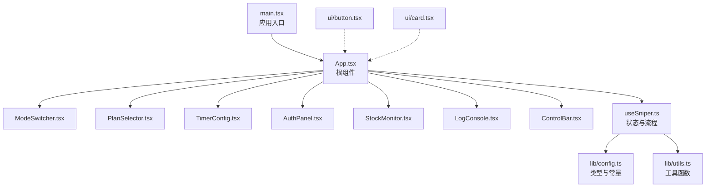
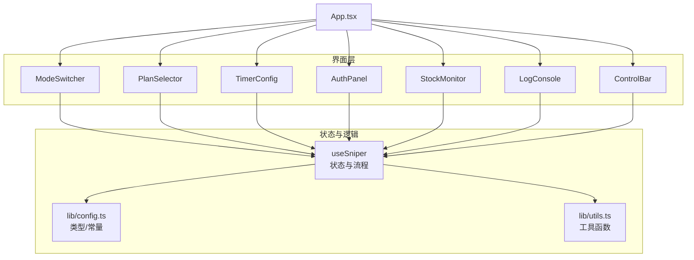
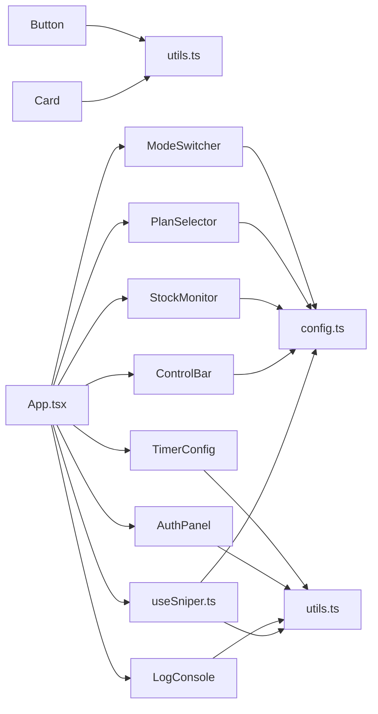
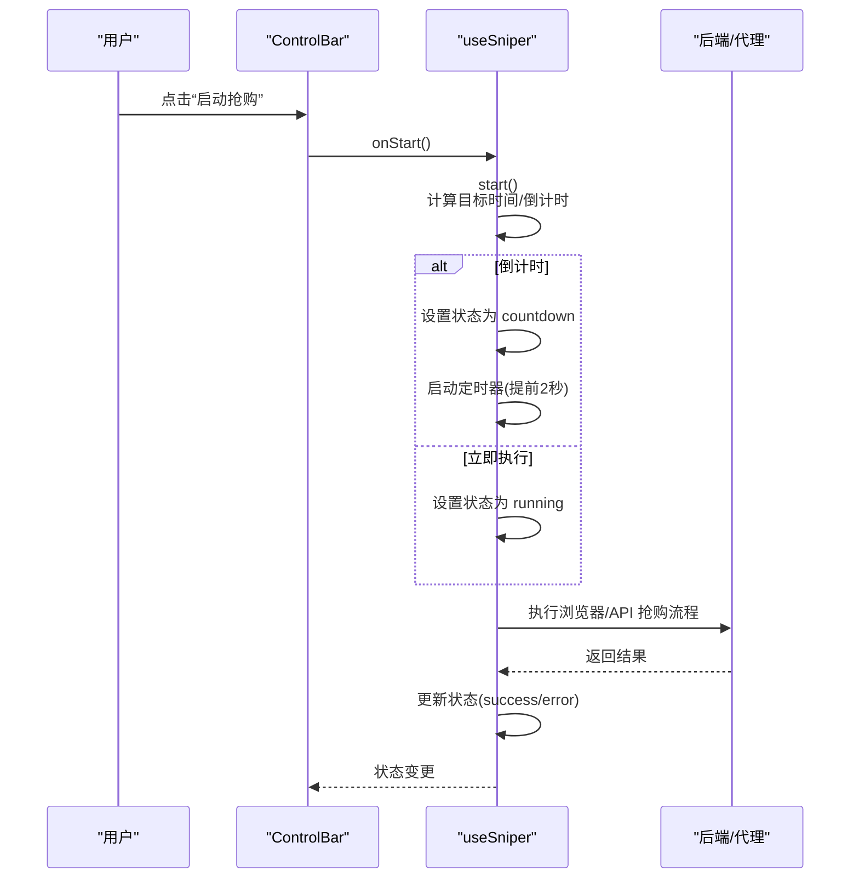

# UI组件

<cite>
**本文引用的文件**
- [src/components/ui/button.tsx](file://src/components/ui/button.tsx)
- [src/components/ui/card.tsx](file://src/components/ui/card.tsx)
- [src/App.tsx](file://src/App.tsx)
- [src/main.tsx](file://src/main.tsx)
- [src/hooks/useSniper.ts](file://src/hooks/useSniper.ts)
- [src/lib/config.ts](file://src/lib/config.ts)
- [src/lib/utils.ts](file://src/lib/utils.ts)
- [src/components/ModeSwitcher.tsx](file://src/components/ModeSwitcher.tsx)
- [src/components/PlanSelector.tsx](file://src/components/PlanSelector.tsx)
- [src/components/TimerConfig.tsx](file://src/components/TimerConfig.tsx)
- [src/components/AuthPanel.tsx](file://src/components/AuthPanel.tsx)
- [src/components/StockMonitor.tsx](file://src/components/StockMonitor.tsx)
- [src/components/LogConsole.tsx](file://src/components/LogConsole.tsx)
- [src/components/ControlBar.tsx](file://src/components/ControlBar.tsx)
- [package.json](file://package.json)
</cite>

## 目录
1. [简介](#简介)
2. [项目结构](#项目结构)
3. [核心组件](#核心组件)
4. [架构总览](#架构总览)
5. [组件详解](#组件详解)
6. [依赖关系分析](#依赖关系分析)
7. [性能与可扩展性](#性能与可扩展性)
8. [故障排查指南](#故障排查指南)
9. [结论](#结论)
10. [附录](#附录)

## 简介
本文件系统化梳理 GLM Sniper 的 UI 组件体系，覆盖基础 UI 组件库（按钮、卡片）与业务面板组件（模式切换、套餐选择、定时配置、认证面板、库存监控、日志控制台、控制条）。文档从“功能职责、属性接口、状态管理、交互行为、视觉样式与主题、响应式与无障碍、协作关系与数据流、可扩展性与自定义”等维度进行深入说明，并提供使用示例与最佳实践。

## 项目结构
应用采用“按功能分层”的组织方式：组件位于 src/components，通用 UI 组件位于 src/components/ui；业务逻辑集中在 hooks/useSniper.ts 中，全局配置与工具函数位于 src/lib。入口文件为 src/main.tsx，根组件为 src/App.tsx。

图表来源
- [src/main.tsx:1-11](file://src/main.tsx#L1-L11)
- [src/App.tsx:12-197](file://src/App.tsx#L12-L197)
- [src/hooks/useSniper.ts:46-407](file://src/hooks/useSniper.ts#L46-L407)
- [src/lib/config.ts:1-104](file://src/lib/config.ts#L1-L104)
- [src/lib/utils.ts:1-51](file://src/lib/utils.ts#L1-L51)
- [src/components/ui/button.tsx:1-49](file://src/components/ui/button.tsx#L1-L49)
- [src/components/ui/card.tsx:1-47](file://src/components/ui/card.tsx#L1-L47)

章节来源
- [src/main.tsx:1-11](file://src/main.tsx#L1-L11)
- [src/App.tsx:12-197](file://src/App.tsx#L12-L197)

## 核心组件
本节聚焦基础 UI 组件库与业务面板组件的职责、接口与使用要点。

- 基础 UI 组件库
  - Button：统一的按钮变体与尺寸，支持多种语义风格与图标尺寸，通过变体与尺寸类组合实现一致的视觉与交互体验。
  - Card：卡片容器及其子组件（头部、标题、描述、内容、底部），用于模块化布局与信息分组。
- 业务面板组件
  - ModeSwitcher：在“浏览器自动化”和“API 高速”两种模式间切换，支持禁用态与高亮态。
  - PlanSelector：在 Lite/Pro/Max 三种套餐间切换，展示价格与徽标，支持禁用态。
  - TimerConfig：设置抢购日期与时间，显示倒计时，支持禁用态与过期态提示。
  - AuthPanel：输入与管理认证 Token 与 Cookies，支持显隐切换与在线验证。
  - StockMonitor：展示各套餐库存状态，支持手动查询与自动监控（5 秒轮询）。
  - LogConsole：实时滚动日志输出，支持清空与自动滚动。
  - ControlBar：控制抢购启停，显示当前状态与运行指示。

章节来源
- [src/components/ui/button.tsx:31-49](file://src/components/ui/button.tsx#L31-L49)
- [src/components/ui/card.tsx:4-47](file://src/components/ui/card.tsx#L4-L47)
- [src/components/ModeSwitcher.tsx:4-62](file://src/components/ModeSwitcher.tsx#L4-L62)
- [src/components/PlanSelector.tsx:5-61](file://src/components/PlanSelector.tsx#L5-L61)
- [src/components/TimerConfig.tsx:5-99](file://src/components/TimerConfig.tsx#L5-L99)
- [src/components/AuthPanel.tsx:5-120](file://src/components/AuthPanel.tsx#L5-L120)
- [src/components/StockMonitor.tsx:17-140](file://src/components/StockMonitor.tsx#L17-L140)
- [src/components/LogConsole.tsx:5-78](file://src/components/LogConsole.tsx#L5-L78)
- [src/components/ControlBar.tsx:4-76](file://src/components/ControlBar.tsx#L4-L76)

## 架构总览
下图展示根组件如何协调各业务面板与状态钩子，形成完整的“配置—监控—抢购—日志—控制”闭环。

图表来源
- [src/App.tsx:74-185](file://src/App.tsx#L74-L185)
- [src/hooks/useSniper.ts:46-407](file://src/hooks/useSniper.ts#L46-L407)
- [src/lib/config.ts:6-26](file://src/lib/config.ts#L6-L26)
- [src/lib/utils.ts:16-51](file://src/lib/utils.ts#L16-L51)

## 组件详解

### Button（基础按钮）
- 功能与特性
  - 支持多种语义变体（默认、破坏性、描边、次要、幽灵、链接）与尺寸（默认、小、大、图标）。
  - 通过类名组合实现焦点可见性、禁用态、悬停与过渡动画。
- Props 接口
  - 继承原生 button 属性，并混入变体与尺寸类型。
- 状态与交互
  - 禁用态禁用交互并降低透明度；聚焦态提供可见的焦点环。
- 视觉与主题
  - 基于 Tailwind 类与主题变量实现颜色与阴影的一致性。
- 使用示例路径
  - 参考按钮在各业务组件中的使用位置（如控制条、库存监控按钮等）。
- 最佳实践
  - 优先使用语义变体表达操作意图；图标按钮需保证可读性与对比度。

章节来源
- [src/components/ui/button.tsx:31-49](file://src/components/ui/button.tsx#L31-L49)

### Card（卡片容器）
- 功能与特性
  - 卡片容器与子组件（头部、标题、描述、内容、底部）统一风格，便于模块化布局。
- Props 接口
  - 继承 div 的 HTML 属性，支持透传 className。
- 视觉与主题
  - 使用卡片背景色与阴影，配合主题变量实现明暗适配。
- 使用示例路径
  - 参考 App.tsx 中多个面板容器的使用。

章节来源
- [src/components/ui/card.tsx:4-47](file://src/components/ui/card.tsx#L4-L47)
- [src/App.tsx:78-127](file://src/App.tsx#L78-L127)

### ModeSwitcher（模式切换）
- 功能与特性
  - 在“浏览器自动化”和“API 高速”之间切换，支持禁用态与高亮态。
- Props 接口
  - mode: 当前模式
  - onModeChange(mode): 切换回调
  - disabled?: 是否禁用
- 状态与交互
  - 选中态高亮，非选中态悬停高亮；禁用态不可交互。
- 视觉与主题
  - 选中态使用主色边框与背景高光，非选中态使用次级边框与文本色。
- 使用示例路径
  - App.tsx 中绑定 useSniper 返回的 mode 与 setMode。

章节来源
- [src/components/ModeSwitcher.tsx:4-62](file://src/components/ModeSwitcher.tsx#L4-L62)
- [src/App.tsx:80-84](file://src/App.tsx#L80-L84)
- [src/hooks/useSniper.ts:51-57](file://src/hooks/useSniper.ts#L51-L57)

### PlanSelector（套餐选择）
- 功能与特性
  - 在 Lite/Pro/Max 三档套餐间切换，展示价格与徽标。
- Props 接口
  - plan: 当前套餐
  - onPlanChange(plan): 切换回调
  - disabled?: 是否禁用
- 状态与交互
  - 选中态高亮并强调文本色；禁用态不可交互。
- 视觉与主题
  - 选中态使用主色高光，徽标使用强调色背景。
- 使用示例路径
  - App.tsx 中绑定 useSniper 返回的 plan 与 setPlan。

章节来源
- [src/components/PlanSelector.tsx:5-61](file://src/components/PlanSelector.tsx#L5-L61)
- [src/App.tsx:85-89](file://src/App.tsx#L85-L89)
- [src/hooks/useSniper.ts:52-56](file://src/hooks/useSniper.ts#L52-L56)

### TimerConfig（定时配置）
- 功能与特性
  - 设置抢购日期与时间，实时显示倒计时；过期态改变样式与提示。
- Props 接口
  - targetDate/targetTime: 当前日期与时间
  - onDateChange/onTimeChange: 修改回调
  - disabled?: 是否禁用
- 状态与交互
  - 内部维护倒计时字符串与过期标记；每秒更新；禁用态不可编辑。
- 视觉与主题
  - 倒计时区域根据是否过期切换边框与背景色。
- 使用示例路径
  - App.tsx 中绑定 useSniper 返回的日期/时间与 setter。

章节来源
- [src/components/TimerConfig.tsx:5-99](file://src/components/TimerConfig.tsx#L5-L99)
- [src/App.tsx:94-100](file://src/App.tsx#L94-L100)
- [src/hooks/useSniper.ts:53-54](file://src/hooks/useSniper.ts#L53-L54)
- [src/lib/utils.ts:29-44](file://src/lib/utils.ts#L29-L44)

### AuthPanel（认证管理）
- 功能与特性
  - 输入与管理认证 Token 与 Cookies；支持显隐切换；在线验证订阅列表。
- Props 接口
  - authToken/onTokenChange
  - cookies/onCookiesChange
  - disabled/onLog
- 状态与交互
  - 内部维护显隐与验证中状态；调用后端接口验证 Token 有效性。
- 视觉与主题
  - 输入区使用次级背景与聚焦高亮；按钮悬停态提升对比度。
- 使用示例路径
  - App.tsx 中绑定 useSniper 返回的认证状态与日志记录。

章节来源
- [src/components/AuthPanel.tsx:5-120](file://src/components/AuthPanel.tsx#L5-L120)
- [src/App.tsx:117-126](file://src/App.tsx#L117-L126)
- [src/hooks/useSniper.ts:55-56](file://src/hooks/useSniper.ts#L55-L56)

### StockMonitor（库存监控）
- 功能与特性
  - 展示各套餐库存状态；支持手动查询与自动监控（5 秒轮询）；命中库存时可自动触发抢购。
- Props 接口
  - stockStatus: 库存状态对象或 null
  - isMonitoring: 是否处于监控中
  - plan: 当前目标套餐
  - onStartMonitoring/onStopMonitoring/onCheckStock: 控制与查询回调
  - disabled?
- 状态与交互
  - 监控中显示脉冲指示；按钮根据状态动态切换；内部维护轮询定时器。
- 视觉与主题
  - 选中套餐高亮；有库存时使用绿色强调；按钮区分主色/警告色。
- 使用示例路径
  - App.tsx 中绑定 useSniper 返回的库存状态与控制函数。

章节来源
- [src/components/StockMonitor.tsx:17-140](file://src/components/StockMonitor.tsx#L17-L140)
- [src/App.tsx:103-114](file://src/App.tsx#L103-L114)
- [src/hooks/useSniper.ts:39-44](file://src/hooks/useSniper.ts#L39-L44)

### LogConsole（日志控制台）
- 功能与特性
  - 实时滚动输出日志；按级别着色；支持清空；自动滚动到底部。
- Props 接口
  - logs: 日志数组
  - onClear: 清空回调
- 状态与交互
  - 挂载后自动滚动至最新日志；清空按钮触发父级清理。
- 视觉与主题
  - 背景色适配深色主题；级别对应不同强调色；闪烁光标模拟终端效果。
- 使用示例路径
  - App.tsx 中绑定 useSniper 返回的日志与清空函数。

章节来源
- [src/components/LogConsole.tsx:5-78](file://src/components/LogConsole.tsx#L5-L78)
- [src/App.tsx:159-166](file://src/App.tsx#L159-L166)
- [src/hooks/useSniper.ts:58-74](file://src/hooks/useSniper.ts#L58-L74)

### ControlBar（控制条）
- 功能与特性
  - 控制抢购启停；显示当前状态与运行指示；成功态与禁用态特殊样式。
- Props 接口
  - status: 当前状态
  - onStart/onStop: 回调
  - disabled?
- 状态与交互
  - 根据状态切换指示灯颜色与文案；运行态显示“停止”，否则显示“启动”。
- 视觉与主题
  - 成功态使用绿色发光阴影；运行态使用主色高光；禁用态使用次级边框与文本。
- 使用示例路径
  - App.tsx 中绑定 useSniper 返回的状态与控制函数。

章节来源
- [src/components/ControlBar.tsx:4-76](file://src/components/ControlBar.tsx#L4-L76)
- [src/App.tsx:170-184](file://src/App.tsx#L170-L184)
- [src/hooks/useSniper.ts:57-58](file://src/hooks/useSniper.ts#L57-L58)

## 依赖关系分析
- 组件耦合
  - App.tsx 将 useSniper 的状态与回调注入到各业务组件，形成单向数据流。
  - 业务组件之间低耦合，仅通过 props 通信。
- 外部依赖
  - class-variance-authority 与 tailwind-merge 用于按钮变体与类名合并。
  - react、react-dom、lucide-react、tailwindcss 等作为运行时与样式基础。
- 潜在循环依赖
  - 通过将控制函数与状态在顶层集中管理，避免了组件间的循环引用。

图表来源
- [src/components/ui/button.tsx:1-49](file://src/components/ui/button.tsx#L1-L49)
- [src/components/ui/card.tsx:1-47](file://src/components/ui/card.tsx#L1-L47)
- [src/components/ModeSwitcher.tsx:1-62](file://src/components/ModeSwitcher.tsx#L1-L62)
- [src/components/PlanSelector.tsx:1-61](file://src/components/PlanSelector.tsx#L1-L61)
- [src/components/TimerConfig.tsx:1-99](file://src/components/TimerConfig.tsx#L1-L99)
- [src/components/AuthPanel.tsx:1-120](file://src/components/AuthPanel.tsx#L1-L120)
- [src/components/StockMonitor.tsx:1-140](file://src/components/StockMonitor.tsx#L1-L140)
- [src/components/LogConsole.tsx:1-78](file://src/components/LogConsole.tsx#L1-L78)
- [src/components/ControlBar.tsx:1-76](file://src/components/ControlBar.tsx#L1-L76)
- [src/App.tsx:12-197](file://src/App.tsx#L12-L197)
- [src/hooks/useSniper.ts:46-407](file://src/hooks/useSniper.ts#L46-L407)
- [src/lib/config.ts:1-104](file://src/lib/config.ts#L1-L104)
- [src/lib/utils.ts:1-51](file://src/lib/utils.ts#L1-L51)

章节来源
- [package.json:14-26](file://package.json#L14-L26)

## 性能与可扩展性
- 性能考量
  - 定时器与轮询：StockMonitor 的 5 秒轮询与 useSniper 的倒计时/定时器均在组件卸载时清理，避免内存泄漏。
  - 日志渲染：LogConsole 使用自动滚动与条件渲染，减少不必要的重排。
- 可扩展性
  - Button 与 Card 通过变体与尺寸扩展新风格；新增组件可复用现有样式体系。
  - 业务组件通过 props 接口与回调扩展，便于接入新的配置项或流程节点。
- 自定义选项
  - 主题变量与 Tailwind 类组合，支持通过覆盖变量或自定义类实现主题定制。
  - 组件内部使用 cn 函数合并类名，便于局部覆盖与扩展。

章节来源
- [src/hooks/useSniper.ts:374-384](file://src/hooks/useSniper.ts#L374-L384)
- [src/components/StockMonitor.tsx:355-372](file://src/components/StockMonitor.tsx#L355-L372)
- [src/components/LogConsole.tsx:17-78](file://src/components/LogConsole.tsx#L17-L78)
- [src/lib/utils.ts:16-18](file://src/lib/utils.ts#L16-L18)

## 故障排查指南
- 抢购失败或异常
  - 检查认证信息：AuthPanel 提供在线验证；若失败，确认 Token/Headers 正确。
  - 查看日志：LogConsole 输出详细步骤与错误码，定位失败环节。
  - 模式选择：API 模式需有效 Token；浏览器模式需正确配置 Cookies。
- 库存监控无效
  - 确认监控已启动且未被禁用；检查后端接口可用性与网络代理配置。
  - 若命中库存未自动抢购，检查 useSniper 的自动触发逻辑与状态机。
- 倒计时异常
  - 确认系统时间与目标时间设置正确；TimerConfig 会在过期时改变样式与提示。
- 控制条不可用
  - 当状态为“运行中/倒计时/成功”时，“启动”按钮会被禁用；“停止”按钮仅在运行态出现。

章节来源
- [src/components/AuthPanel.tsx:18-41](file://src/components/AuthPanel.tsx#L18-L41)
- [src/components/LogConsole.tsx:49-71](file://src/components/LogConsole.tsx#L49-L71)
- [src/hooks/useSniper.ts:115-119](file://src/hooks/useSniper.ts#L115-L119)
- [src/components/StockMonitor.tsx:319-352](file://src/components/StockMonitor.tsx#L319-L352)
- [src/components/TimerConfig.tsx:17-32](file://src/components/TimerConfig.tsx#L17-L32)
- [src/components/ControlBar.tsx:55-72](file://src/components/ControlBar.tsx#L55-L72)

## 结论
本 UI 组件体系以简洁的 props 接口与清晰的状态机为核心，结合统一的样式与主题变量，实现了高度一致的视觉与交互体验。通过 useSniper 钩子集中管理状态与流程，业务组件保持低耦合与高内聚，具备良好的可维护性与可扩展性。建议在后续迭代中进一步完善无障碍能力（如键盘导航、ARIA 标签）与响应式细节（如移动端紧凑布局）。

## 附录

### 组件协作与数据流（序列图）
以下序列图展示“启动抢购”从 UI 到状态与后端的关键调用链。

图表来源
- [src/components/ControlBar.tsx:55-72](file://src/components/ControlBar.tsx#L55-L72)
- [src/hooks/useSniper.ts:250-293](file://src/hooks/useSniper.ts#L250-L293)
- [src/hooks/useSniper.ts:77-106](file://src/hooks/useSniper.ts#L77-L106)
- [src/hooks/useSniper.ts:111-248](file://src/hooks/useSniper.ts#L111-L248)

### 组件属性与事件对照表
- Button
  - 属性：className、variant、size、disabled、onClick 等
  - 事件：onClick
- Card
  - 属性：className
- ModeSwitcher
  - 属性：mode、onModeChange、disabled
  - 事件：点击切换
- PlanSelector
  - 属性：plan、onPlanChange、disabled
  - 事件：点击切换
- TimerConfig
  - 属性：targetDate、targetTime、onDateChange、onTimeChange、disabled
  - 事件：日期/时间变更
- AuthPanel
  - 属性：authToken、onTokenChange、cookies、onCookiesChange、disabled、onLog
  - 事件：点击“验证 Token”
- StockMonitor
  - 属性：stockStatus、isMonitoring、plan、onStartMonitoring、onStopMonitoring、onCheckStock、disabled
  - 事件：点击“手动查询/启动监控/停止监控”
- LogConsole
  - 属性：logs、onClear
  - 事件：点击“清空”
- ControlBar
  - 属性：status、onStart、onStop、disabled
  - 事件：点击“启动/停止”

章节来源
- [src/components/ui/button.tsx:31-49](file://src/components/ui/button.tsx#L31-L49)
- [src/components/ui/card.tsx:4-47](file://src/components/ui/card.tsx#L4-L47)
- [src/components/ModeSwitcher.tsx:4-62](file://src/components/ModeSwitcher.tsx#L4-L62)
- [src/components/PlanSelector.tsx:5-61](file://src/components/PlanSelector.tsx#L5-L61)
- [src/components/TimerConfig.tsx:5-99](file://src/components/TimerConfig.tsx#L5-L99)
- [src/components/AuthPanel.tsx:5-120](file://src/components/AuthPanel.tsx#L5-L120)
- [src/components/StockMonitor.tsx:17-140](file://src/components/StockMonitor.tsx#L17-L140)
- [src/components/LogConsole.tsx:5-78](file://src/components/LogConsole.tsx#L5-L78)
- [src/components/ControlBar.tsx:4-76](file://src/components/ControlBar.tsx#L4-L76)