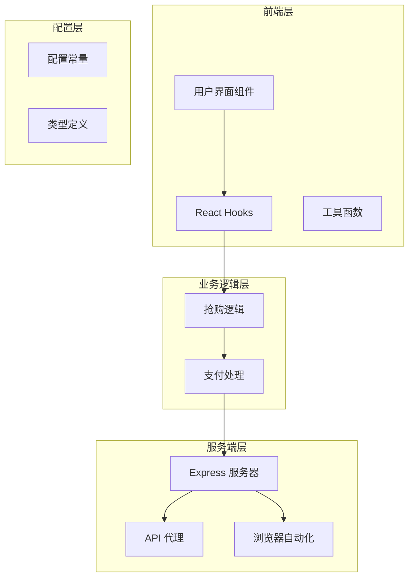
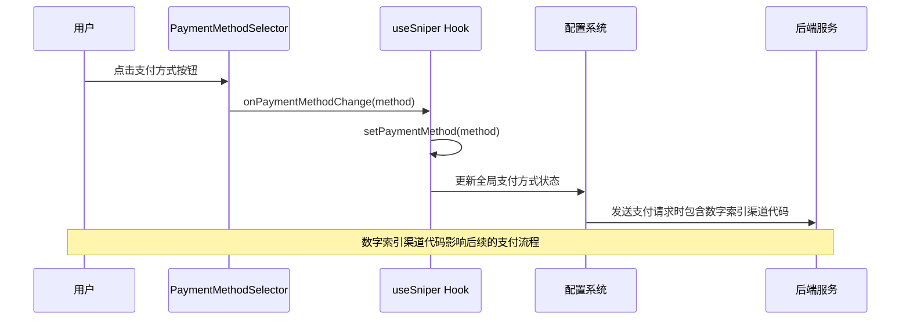
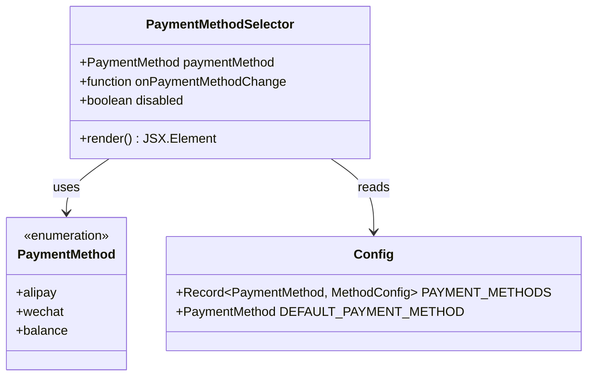
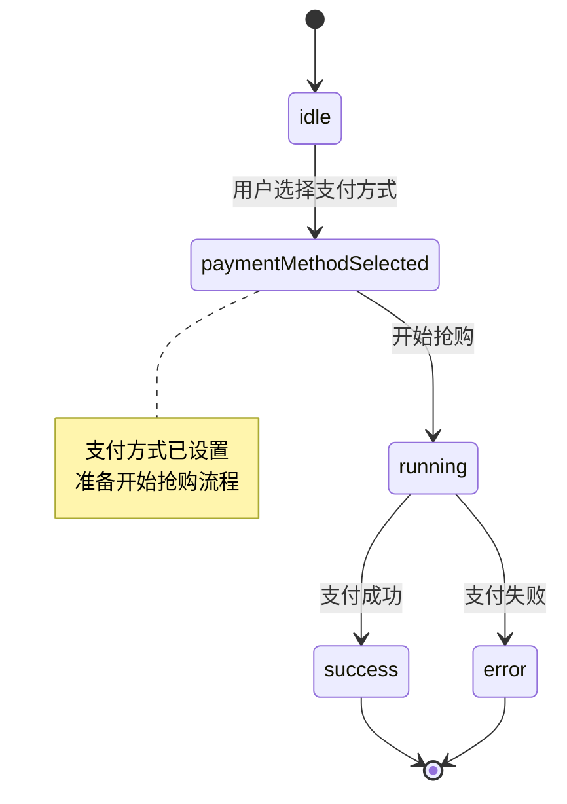
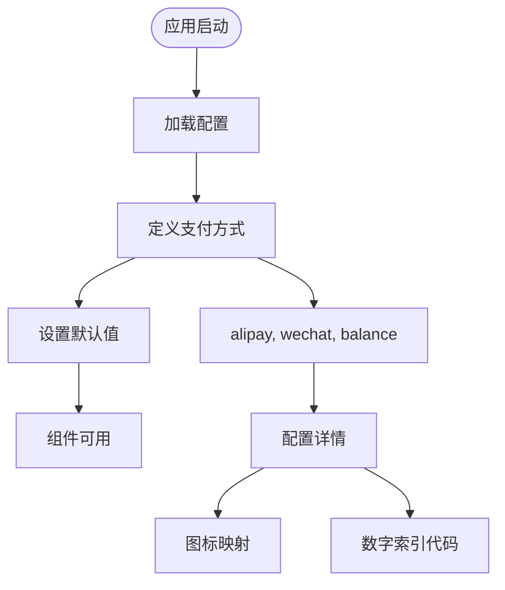
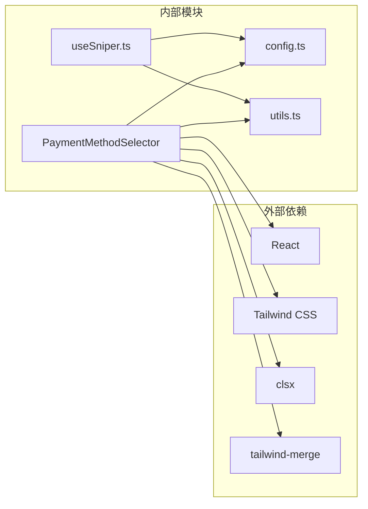

# 支付方法选择器

<cite>
**本文档引用的文件**
- [src/components/PaymentMethodSelector.tsx](file://src/components/PaymentMethodSelector.tsx)
- [src/lib/config.ts](file://src/lib/config.ts)
- [src/hooks/useSniper.ts](file://src/hooks/useSniper.ts)
- [src/App.tsx](file://src/App.tsx)
- [server/index.ts](file://server/index.ts)
</cite>

## 更新摘要
**变更内容**
- 更新支付渠道代码标准化：从字符串代码更新为数字索引
- 支付宝渠道代码更新为 '1'（原 'ALI'）
- 微信支付渠道代码更新为 '2'（原 'WE_CHAT'）
- 账户余额渠道代码更新为 '0'（原 'BALANCE'）
- 同步更新所有相关的配置说明和日志输出

## 目录
1. [简介](#简介)
2. [项目结构](#项目结构)
3. [核心组件](#核心组件)
4. [架构概览](#架构概览)
5. [详细组件分析](#详细组件分析)
6. [依赖关系分析](#依赖关系分析)
7. [性能考虑](#性能考虑)
8. [故障排除指南](#故障排除指南)
9. [结论](#结论)

## 简介

支付方法选择器是 GLM Sniper 抢购工具中的一个重要组件，负责让用户选择不同的支付方式进行订阅购买。该组件提供了三种支付方式：支付宝、微信支付和账户余额，并与整个抢购系统无缝集成。

GLM Sniper 是一个用于抢购智谱 AI GLM Coding Plan 的自动化工具，支持两种抢购模式：浏览器自动化模式和 API 高速模式。支付方法选择器作为用户界面的一部分，为用户提供直观的支付方式选择体验。

## 项目结构

该项目采用 React + TypeScript + Vite 架构，主要分为以下层次：

**图表来源**
- [src/components/PaymentMethodSelector.tsx:1-55](file://src/components/PaymentMethodSelector.tsx#L1-L55)
- [src/hooks/useSniper.ts:1-492](file://src/hooks/useSniper.ts#L1-L492)
- [server/index.ts:1-419](file://server/index.ts#L1-L419)

**章节来源**
- [src/components/PaymentMethodSelector.tsx:1-55](file://src/components/PaymentMethodSelector.tsx#L1-L55)
- [src/lib/config.ts:1-167](file://src/lib/config.ts#L1-L167)
- [src/hooks/useSniper.ts:1-492](file://src/hooks/useSniper.ts#L1-L492)

## 核心组件

支付方法选择器的核心功能包括：

### 支付方式配置
组件支持三种支付方式：
- **支付宝 (Alipay)**：使用数字索引 '1' 作为渠道代码
- **微信支付 (WeChat)**：使用数字索引 '2' 作为渠道代码  
- **账户余额 (Balance)**：使用数字索引 '0' 作为渠道代码

**更新** 支付渠道代码已标准化为数字索引格式，移除了冗余的字符串标识，使用更简洁、统一的数字代码格式。

### 交互特性
- 响应式设计，适配不同屏幕尺寸
- 选中状态高亮显示
- 禁用状态下半透明显示
- 实时状态反馈

### 数据流
支付方式选择器通过 props 接收当前选中的支付方式和变更回调函数，实现双向数据绑定。

**章节来源**
- [src/components/PaymentMethodSelector.tsx:11-55](file://src/components/PaymentMethodSelector.tsx#L11-L55)
- [src/lib/config.ts:85-90](file://src/lib/config.ts#L85-L90)

## 架构概览

支付方法选择器在整个系统架构中的位置如下：

**图表来源**
- [src/components/PaymentMethodSelector.tsx:24-27](file://src/components/PaymentMethodSelector.tsx#L24-L27)
- [src/hooks/useSniper.ts:467-471](file://src/hooks/useSniper.ts#L467-L471)
- [src/lib/config.ts:85-90](file://src/lib/config.ts#L85-L90)

## 详细组件分析

### PaymentMethodSelector 组件

PaymentMethodSelector 是一个纯函数组件，负责渲染支付方式选择界面：

#### 组件结构

**图表来源**
- [src/components/PaymentMethodSelector.tsx:5-9](file://src/components/PaymentMethodSelector.tsx#L5-L9)
- [src/lib/config.ts:9, 85-90](file://src/lib/config.ts#L9, L85-L90)

#### 支付方式配置
每个支付方式都有对应的配置信息：
- **名称**：显示给用户的中文名称
- **代码**：后端识别的支付渠道代码（已更新为数字索引格式）
- **图标**：Unicode 字符表示的图标

**更新** 支付渠道代码已标准化为数字索引格式：
- 支付宝：'1'（原 'ALI'）
- 微信支付：'2'（原 'WE_CHAT'）
- 账户余额：'0'（原 'BALANCE'）

#### 交互逻辑
组件实现了标准的单选按钮组功能：
1. 遍历支持的支付方式列表
2. 为每个方式渲染按钮
3. 根据当前选中状态应用样式
4. 处理用户点击事件

**章节来源**
- [src/components/PaymentMethodSelector.tsx:11-55](file://src/components/PaymentMethodSelector.tsx#L11-L55)
- [src/lib/config.ts:85-90](file://src/lib/config.ts#L85-L90)

### 与 useSniper Hook 的集成

useSniper Hook 提供了支付方式的状态管理和业务逻辑：

#### 状态管理

**图表来源**
- [src/hooks/useSniper.ts:467-471](file://src/hooks/useSniper.ts#L467-L471)
- [src/hooks/useSniper.ts:471](file://src/hooks/useSniper.ts#L471)

#### 支付流程集成
支付方式选择直接影响后续的支付流程：
1. **API 模式**：直接使用选择的支付方式调用后端接口，包含标准化的数字索引渠道代码
2. **浏览器模式**：通过 Playwright 自动化选择相应的支付选项

**更新** 在 API 模式中，支付渠道代码现在使用标准化的数字索引格式：
- 支付宝：PAYMENT_METHODS[paymentMethod].code 返回 '1'
- 微信支付：PAYMENT_METHODS[paymentMethod].code 返回 '2'
- 账户余额：PAYMENT_METHODS[paymentMethod].code 返回 '0'

**章节来源**
- [src/hooks/useSniper.ts:160-175](file://src/hooks/useSniper.ts#L160-L175)
- [src/hooks/useSniper.ts:170](file://src/hooks/useSniper.ts#L170)

### 配置系统

配置系统为支付方法选择器提供必要的数据支持：

#### 支付方式常量

**图表来源**
- [src/lib/config.ts:85-90](file://src/lib/config.ts#L85-L90)
- [src/lib/config.ts:92-93](file://src/lib/config.ts#L92-L93)

#### 类型定义
配置系统定义了完整的类型体系：
- `PaymentMethod`：枚举类型，限制支付方式范围
- `MethodConfig`：配置接口，描述支付方式的详细信息
- `Record`：映射类型的使用，提供类型安全的访问

**更新** 支付渠道代码已标准化为数字索引格式，移除了冗余的字符串标识，使用更简洁、统一的数字代码格式。

**章节来源**
- [src/lib/config.ts:9](file://src/lib/config.ts#L9)
- [src/lib/config.ts:85-90](file://src/lib/config.ts#L85-L90)

## 依赖关系分析

支付方法选择器的依赖关系相对简单但功能完整：

**图表来源**
- [src/components/PaymentMethodSelector.tsx:1-4](file://src/components/PaymentMethodSelector.tsx#L1-L4)
- [src/hooks/useSniper.ts:10](file://src/hooks/useSniper.ts#L10)

### 内部依赖
- **config.ts**：提供支付方式配置和类型定义
- **utils.ts**：提供样式合并和工具函数
- **useSniper.ts**：提供状态管理和业务逻辑

### 外部依赖
- **React**：组件框架
- **Tailwind CSS**：样式系统
- **clsx/tailwind-merge**：类名合并工具

**章节来源**
- [src/components/PaymentMethodSelector.tsx:1-4](file://src/components/PaymentMethodSelector.tsx#L1-L4)
- [src/hooks/useSniper.ts:10](file://src/hooks/useSniper.ts#L10)

## 性能考虑

支付方法选择器在设计上注重性能和用户体验：

### 渲染优化
- 使用纯函数组件，避免不必要的重渲染
- 条件渲染：仅在需要时显示余额支付的警告信息
- 事件处理：使用防抖和节流机制

### 内存管理
- 合理使用 React Hooks，避免内存泄漏
- 及时清理定时器和事件监听器
- 优化样式类名的动态生成

### 用户体验
- 即时反馈：选中状态的视觉变化
- 响应式设计：适配各种设备
- 无障碍支持：键盘导航和屏幕阅读器兼容

## 故障排除指南

### 常见问题及解决方案

#### 支付方式不可选
**症状**：支付方式按钮显示为禁用状态
**原因**：
- 组件被整体禁用
- 抢购正在进行中
- 页面处于忙碌状态

**解决方法**：
- 等待当前操作完成
- 检查抢购状态
- 确认页面是否处于运行状态

#### 支付方式切换无效
**症状**：点击支付方式按钮但状态未改变
**原因**：
- 回调函数未正确传递
- 状态管理冲突
- 组件重新渲染导致状态丢失

**解决方法**：
- 检查 onPaymentMethodChange 回调
- 确认 useSniper Hook 的状态更新
- 验证组件的 props 传递

#### 样式显示异常
**症状**：支付方式按钮样式不符合预期
**原因**：
- Tailwind CSS 配置问题
- 动态类名生成错误
- 样式冲突

**解决方法**：
- 检查 cn 函数的使用
- 验证 Tailwind 配置
- 确认样式优先级

#### 支付渠道代码错误
**症状**：支付请求失败或渠道代码不匹配
**原因**：
- 使用了旧的字符串格式渠道代码
- 渠道代码格式不正确

**解决方法**：
- 确保使用标准化的数字索引渠道代码：
  - 支付宝：'1'
  - 微信支付：'2'
  - 账户余额：'0'

**章节来源**
- [src/components/PaymentMethodSelector.tsx:27](file://src/components/PaymentMethodSelector.tsx#L27)
- [src/hooks/useSniper.ts:467-471](file://src/hooks/useSniper.ts#L467-L471)

## 结论

支付方法选择器作为 GLM Sniper 抢购工具的重要组成部分，实现了简洁而功能完整的支付方式选择功能。该组件具有以下特点：

### 设计优势
- **用户友好**：直观的按钮式选择界面
- **类型安全**：完整的 TypeScript 类型定义
- **可扩展性**：易于添加新的支付方式
- **性能优化**：高效的渲染和状态管理

### 技术特色
- 与整体抢购系统无缝集成
- 支持多种支付渠道（已标准化为数字索引格式）
- 实时状态反馈
- 响应式设计适配

### 未来改进方向
- 支持更多支付方式
- 增强错误处理和用户提示
- 优化移动端用户体验
- 添加支付方式的详细说明

**更新** 支付系统已完成重要的标准化变更，将支付渠道代码从字符串格式更新为数字索引格式，提高了系统的可维护性和一致性。新的标准化代码格式为：
- 支付宝：'1'
- 微信支付：'2'  
- 账户余额：'0'

这种变更不仅简化了代码结构，还提高了系统的稳定性和可读性。支付方法选择器虽然功能相对简单，但在整个抢购流程中发挥着重要作用，为用户提供了清晰、直观的支付方式选择体验。