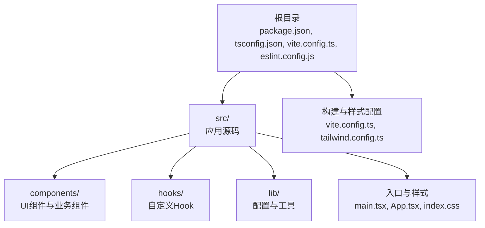
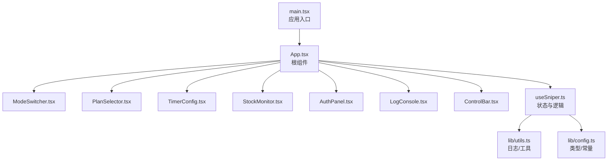
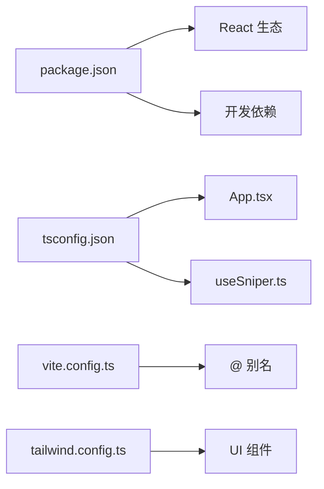

# 代码规范

<cite>
**本文引用的文件**
- [eslint.config.js](file://eslint.config.js)
- [package.json](file://package.json)
- [tsconfig.json](file://tsconfig.json)
- [vite.config.ts](file://vite.config.ts)
- [tailwind.config.ts](file://tailwind.config.ts)
- [src/main.tsx](file://src/main.tsx)
- [src/App.tsx](file://src/App.tsx)
- [src/hooks/useSniper.ts](file://src/hooks/useSniper.ts)
- [src/lib/config.ts](file://src/lib/config.ts)
- [src/lib/utils.ts](file://src/lib/utils.ts)
- [src/components/ui/button.tsx](file://src/components/ui/button.tsx)
- [src/components/ModeSwitcher.tsx](file://src/components/ModeSwitcher.tsx)
- [src/components/PlanSelector.tsx](file://src/components/PlanSelector.tsx)
- [src/components/ControlBar.tsx](file://src/components/ControlBar.tsx)
- [src/components/StockMonitor.tsx](file://src/components/StockMonitor.tsx)
</cite>

## 目录
1. [引言](#引言)
2. [项目结构](#项目结构)
3. [核心组件](#核心组件)
4. [架构总览](#架构总览)
5. [详细组件分析](#详细组件分析)
6. [依赖关系分析](#依赖关系分析)
7. [性能考虑](#性能考虑)
8. [故障排查指南](#故障排查指南)
9. [结论](#结论)
10. [附录](#附录)

## 引言
本指南面向 GLM Sniper 项目，提供 TypeScript 编码标准、ESLint 规则与代码质量检查机制、React 组件开发规范、文件命名与目录组织原则、代码格式化与自动修复工具使用方法、注释与文档编写标准，以及性能优化与内存管理最佳实践。内容基于仓库现有配置与源码进行提炼，旨在帮助开发者统一风格、提升可维护性与稳定性。

## 项目结构
- 根目录包含构建与开发脚本、ESLint 配置、TypeScript 多项目配置、Vite 与 Tailwind 配置等。
- 源码位于 src/，按功能分层组织：
  - components/：UI 组件与页面级容器组件
  - hooks/：自定义 Hook
  - lib/：配置与通用工具
  - 资源与入口：main.tsx、App.tsx、样式入口等

**章节来源**
- [package.json:1-48](file://package.json#L1-L48)
- [tsconfig.json:1-8](file://tsconfig.json#L1-L8)
- [vite.config.ts:1-13](file://vite.config.ts#L1-L13)
- [tailwind.config.ts:1-104](file://tailwind.config.ts#L1-L104)

## 核心组件
- 类型系统与配置
  - 类型别名与接口集中于 lib/config.ts，统一暴露模式、套餐、状态与配置接口，便于跨模块复用。
  - 日志条目与日志级别在 lib/utils.ts 中定义，保证日志结构一致。
- 自定义 Hook useSniper.ts
  - 将抢购主流程、倒计时、库存监控、日志管理等逻辑封装为 Hook 返回值，便于组件复用与测试。
  - 使用 useRef 管理定时器与中断标志，避免闭包陷阱；使用 useCallback 包裹回调，减少子组件重渲染。
- 页面与容器组件
  - App.tsx 作为根组件，组合 ModeSwitcher、PlanSelector、TimerConfig、StockMonitor、AuthPanel、LogConsole、ControlBar 等。
  - 控制台与引导组件通过 props 与状态驱动交互。
- UI 组件
  - components/ui/button.tsx 使用 class-variance-authority 实现变体与尺寸，结合 lib/utils 的 cn 工具合并类名，遵循 Tailwind 变更。

**章节来源**
- [src/lib/config.ts:1-104](file://src/lib/config.ts#L1-L104)
- [src/lib/utils.ts:1-51](file://src/lib/utils.ts#L1-L51)
- [src/hooks/useSniper.ts:1-407](file://src/hooks/useSniper.ts#L1-L407)
- [src/App.tsx:1-197](file://src/App.tsx#L1-L197)
- [src/components/ui/button.tsx:1-49](file://src/components/ui/button.tsx#L1-L49)

## 架构总览
下图展示前端应用从入口到组件与 Hook 的交互关系，以及日志与状态流：

**图表来源**
- [src/main.tsx:1-11](file://src/main.tsx#L1-L11)
- [src/App.tsx:1-197](file://src/App.tsx#L1-L197)
- [src/hooks/useSniper.ts:1-407](file://src/hooks/useSniper.ts#L1-L407)
- [src/lib/utils.ts:1-51](file://src/lib/utils.ts#L1-L51)
- [src/lib/config.ts:1-104](file://src/lib/config.ts#L1-L104)

## 详细组件分析

### TypeScript 编码标准与类型设计
- 类型别名与接口
  - 使用类型别名表达枚举式状态与模式，如 SniperMode、PlanType、SniperStatus，避免字符串魔法数。
  - 使用接口描述复杂对象，如 PlanConfig、SniperConfig、LogEntry，明确字段与职责边界。
- 泛型与工具
  - 在 UI 变体组件中使用 VariantProps<T> 保持类型安全与可扩展性。
  - 在 Hook 返回值中使用接口约束对外暴露的属性与方法，确保调用方契约清晰。
- 命名约定
  - 接口以大写 I 前缀或名词形式（如 PlanConfig），类型别名以名词或形容词（如 SniperMode）。
  - 方法与变量采用动词短语（如 startMonitoring、clearLogs），常量全大写（如 AES_KEY）。

**章节来源**
- [src/lib/config.ts:6-26](file://src/lib/config.ts#L6-L26)
- [src/lib/utils.ts:5-12](file://src/lib/utils.ts#L5-L12)
- [src/components/ui/button.tsx:31-33](file://src/components/ui/button.tsx#L31-L33)

### ESLint 配置与代码质量检查机制
- 配置概览
  - 使用 defineConfig 组织规则，忽略 dist 输出目录。
  - 对 ts/tsx 文件启用推荐规则集：@eslint/js、typescript-eslint、react-hooks、react-refresh。
  - 设置浏览器全局环境，适配 Vite 与 React Refresh。
- 使用方式
  - 通过 npm 脚本执行 lint，可在 CI 中集成以保障提交质量。
- 建议补充
  - 可根据团队风格增加自定义规则（如最大参数数量、函数长度限制）。
  - 结合 Prettier 或编辑器格式化插件，统一缩进与分号策略。

**章节来源**
- [eslint.config.js:1-23](file://eslint.config.js#L1-L23)
- [package.json:9](file://package.json#L9)

### React 组件开发规范
- 函数组件与 Props 设计
  - 所有组件均以函数组件形式实现，Props 使用接口显式声明，避免 any。
  - 使用受控组件模式（传入值与变更回调），如 ModeSwitcher、PlanSelector、ControlBar。
- Hooks 使用
  - 在 useSniper 中使用 useState 管理状态，useCallback 包裹回调，useRef 管理定时器与中断标志，useEffect 清理副作用。
  - 将复杂流程拆分为多个独立的 useCallback 函数，降低耦合度。
- 组件组合与状态提升
  - App.tsx 作为状态容器，将状态与事件通过 props 下发至子组件，保持单向数据流。
- 变体与样式
  - UI 组件通过 class-variance-authority 与 cn 工具实现变体与尺寸，避免重复条件判断。

**章节来源**
- [src/App.tsx:12-197](file://src/App.tsx#L12-L197)
- [src/hooks/useSniper.ts:46-407](file://src/hooks/useSniper.ts#L46-L407)
- [src/components/ModeSwitcher.tsx:10-62](file://src/components/ModeSwitcher.tsx#L10-L62)
- [src/components/PlanSelector.tsx:11-61](file://src/components/PlanSelector.tsx#L11-L61)
- [src/components/ControlBar.tsx:11-76](file://src/components/ControlBar.tsx#L11-L76)
- [src/components/ui/button.tsx:35-49](file://src/components/ui/button.tsx#L35-L49)

### 文件命名约定与目录组织原则
- 目录组织
  - components/：按功能划分 UI 组件与页面级容器组件，ui/ 用于基础变体组件。
  - hooks/：存放自定义 Hook，命名以 use 前缀。
  - lib/：存放配置与工具，按职责拆分文件。
- 文件命名
  - 组件文件：PascalCase.tsx（如 ModeSwitcher.tsx）。
  - 工具与配置：camelCase.ts（如 utils.ts、config.ts）。
  - 样式：index.css 入口，Tailwind 主题在 tailwind.config.ts 中集中配置。
- 路径别名
  - Vite 配置 @ 指向 src，便于统一导入路径，减少相对路径层级。

**章节来源**
- [vite.config.ts:7-11](file://vite.config.ts#L7-L11)
- [src/components/ModeSwitcher.tsx:1](file://src/components/ModeSwitcher.tsx#L1)
- [src/components/PlanSelector.tsx:1](file://src/components/PlanSelector.tsx#L1)
- [src/components/ControlBar.tsx:1](file://src/components/ControlBar.tsx#L1)
- [src/components/ui/button.tsx:1](file://src/components/ui/button.tsx#L1)

### 代码格式化与自动修复工具
- 工具链
  - Vite 与 React 插件负责开发体验与热更新。
  - ESLint 负责静态检查与规则执行。
  - Tailwind CSS 与 PostCSS 用于样式生成与优化。
- 使用建议
  - 在编辑器中启用保存时自动格式化（如 Prettier 或 ESLint Fix）。
  - 在 CI 中执行 npm run lint，阻断不合规代码提交。
  - 通过 npm run build 与 npm run preview 验证产物一致性。

**章节来源**
- [package.json:6-12](file://package.json#L6-L12)
- [vite.config.ts:1-13](file://vite.config.ts#L1-L13)
- [tailwind.config.ts:1-104](file://tailwind.config.ts#L1-L104)

### 注释规范与文档编写标准
- 注释位置
  - 类型接口与复杂函数上方添加简要说明，解释用途与关键行为。
  - 关键分支与易错点添加行内注释，说明原因与边界条件。
- 文档化
  - 组件 Props 与返回值在接口中明确字段含义与类型。
  - 常量与配置在 lib/config.ts 中集中注释，便于查阅与维护。

**章节来源**
- [src/hooks/useSniper.ts:11-44](file://src/hooks/useSniper.ts#L11-L44)
- [src/lib/config.ts:10-26](file://src/lib/config.ts#L10-L26)

### 性能优化与内存管理最佳实践
- 重渲染控制
  - 使用 useCallback 包裹传递给子组件的回调，避免不必要的重渲染。
  - 将稳定的数据结构与函数通过 props 下发，减少闭包捕获。
- 定时器与副作用清理
  - 使用 useRef 管理定时器句柄，在 useEffect 中统一清理，防止内存泄漏。
  - 在手动停止场景设置中断标志，及时清除定时器。
- 网络请求与重试
  - 对外部接口调用进行错误分类与有限重试，避免无限循环。
  - 对验证码拦截等特殊错误给出明确提示，指导用户操作。
- UI 与样式
  - 使用 Tailwind 变体与 cn 合并类名，减少重复计算。
  - 合理使用动画与渐变，避免过度消耗 GPU/CPU。

**章节来源**
- [src/hooks/useSniper.ts:62-384](file://src/hooks/useSniper.ts#L62-L384)
- [src/components/ui/button.tsx:16-18](file://src/components/ui/button.tsx#L16-L18)

## 依赖关系分析
- 模块耦合
  - App.tsx 依赖 useSniper.ts 与各业务组件，形成“容器-展示”分层。
  - 组件间通过 props 通信，避免直接共享状态，降低耦合。
- 外部依赖
  - React 19、Tailwind、class-variance-authority、clsx、tailwind-merge 等。
  - 开发依赖包括 Vite、ESLint、TypeScript、React 插件等。
- 配置与工具
  - tsconfig.json 通过 references 组织多项目配置，避免重复编译。
  - vite.config.ts 配置路径别名与 React 插件，提升开发效率。

**图表来源**
- [package.json:14-46](file://package.json#L14-L46)
- [tsconfig.json:3-6](file://tsconfig.json#L3-L6)
- [vite.config.ts:7-11](file://vite.config.ts#L7-L11)
- [tailwind.config.ts:1-104](file://tailwind.config.ts#L1-L104)

**章节来源**
- [package.json:14-46](file://package.json#L14-L46)
- [tsconfig.json:3-6](file://tsconfig.json#L3-L6)
- [vite.config.ts:7-11](file://vite.config.ts#L7-L11)

## 性能考虑
- 渲染性能
  - 将昂贵计算放入 useMemo 或 useCallback，避免每次渲染都重建。
  - 合理拆分组件，仅在必要时重渲染。
- 网络与 IO
  - 对高频轮询（如库存监控）设置合理间隔，并在组件卸载时清理。
  - 对外部接口调用进行超时与重试策略，避免阻塞主线程。
- 样式与动画
  - 使用 transform 与 opacity 动画，避免触发布局与重绘。
  - Tailwind 变体按需生成，减少未使用样式的体积。

## 故障排查指南
- 常见问题定位
  - 抢购失败：查看日志面板中的错误信息，区分验证码拦截、网络异常、认证缺失等情况。
  - 库存监控无效：确认后端服务已启动，检查定时器是否被清理。
  - 倒计时不准确：核对目标时间与本地时区，注意提前 2 秒补偿逻辑。
- 调试建议
  - 在 useSniper 中逐步打印关键步骤与响应，定位失败节点。
  - 使用浏览器开发者工具观察网络请求与状态变化。
  - 在 App.tsx 中临时输出关键状态，辅助定位问题。

**章节来源**
- [src/hooks/useSniper.ts:77-248](file://src/hooks/useSniper.ts#L77-L248)
- [src/hooks/useSniper.ts:319-372](file://src/hooks/useSniper.ts#L319-L372)
- [src/App.tsx:12-197](file://src/App.tsx#L12-L197)

## 结论
本指南总结了 GLM Sniper 项目的 TypeScript 类型设计、ESLint 规则、React 组件开发规范、文件命名与目录组织、代码格式化与自动修复、注释与文档标准，以及性能优化与内存管理实践。建议在日常开发中严格遵循上述规范，持续通过 lint 与构建脚本保障质量，并在团队内定期回顾与演进。

## 附录
- 快速参考
  - 类型定义：在 lib/config.ts 与 lib/utils.ts 中集中管理。
  - 组件 Props：使用接口显式声明，避免 any。
  - Hook 行为：useCallback 包裹回调，useRef 管理定时器，useEffect 清理副作用。
  - 样式工具：cn + class-variance-authority + Tailwind 变体。
  - 质量保障：npm run lint、npm run build、npm run preview。