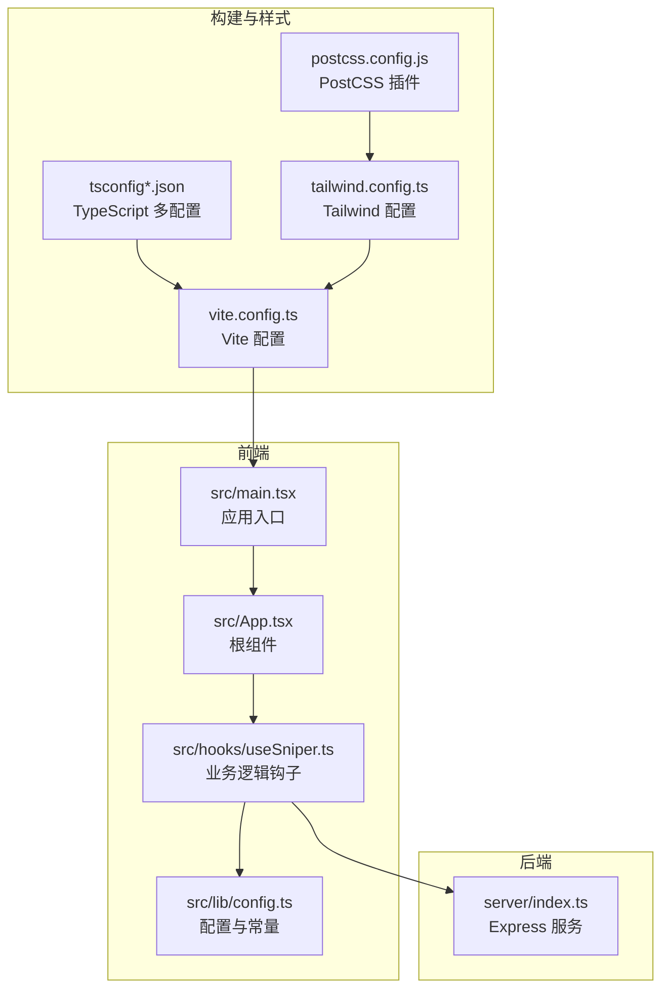
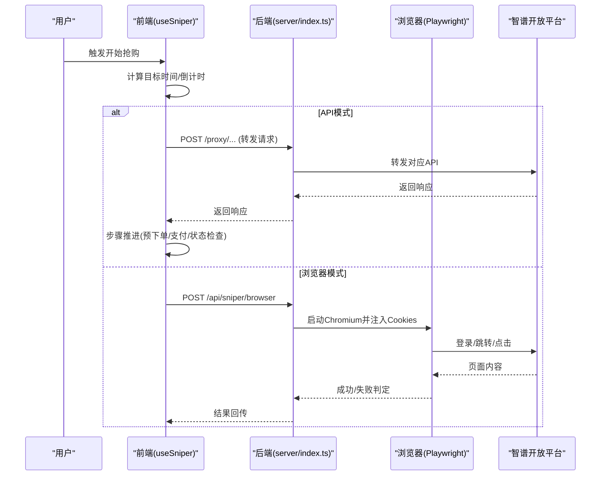
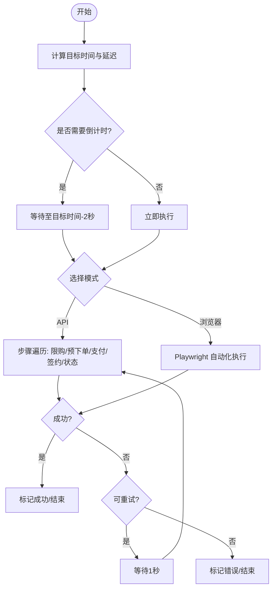
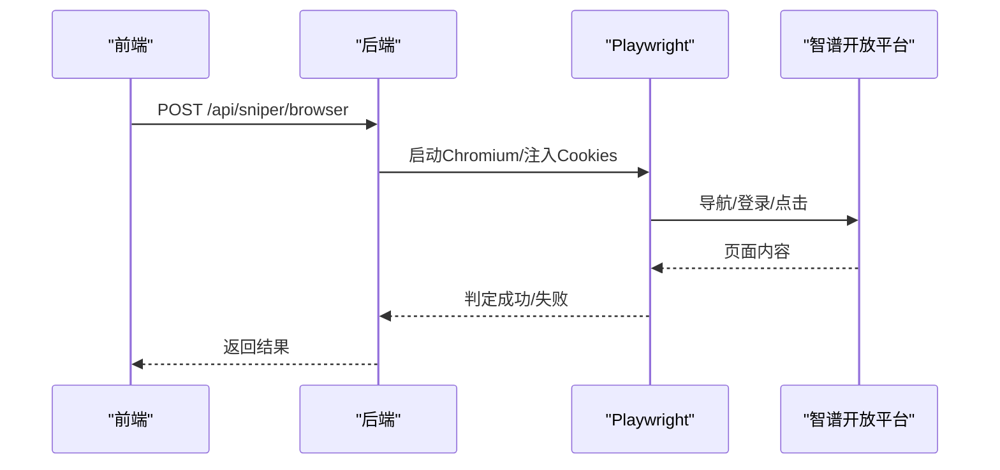
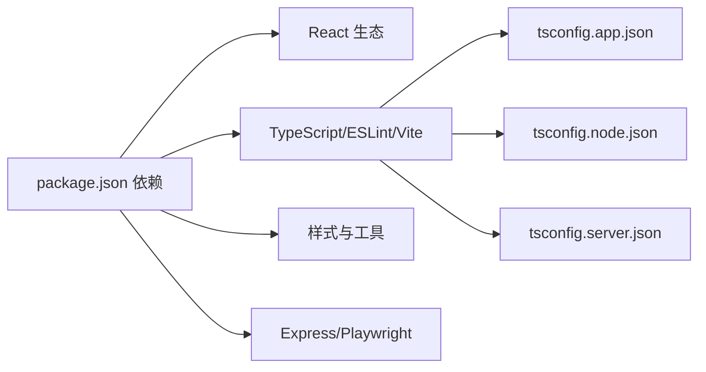

# 开发指南

<cite>
**本文引用的文件**
- [package.json](file://package.json)
- [README.md](file://README.md)
- [eslint.config.js](file://eslint.config.js)
- [vite.config.ts](file://vite.config.ts)
- [tsconfig.json](file://tsconfig.json)
- [tsconfig.app.json](file://tsconfig.app.json)
- [tsconfig.node.json](file://tsconfig.node.json)
- [tsconfig.server.json](file://tsconfig.server.json)
- [tailwind.config.ts](file://tailwind.config.ts)
- [postcss.config.js](file://postcss.config.js)
- [src/main.tsx](file://src/main.tsx)
- [src/App.tsx](file://src/App.tsx)
- [src/lib/config.ts](file://src/lib/config.ts)
- [src/hooks/useSniper.ts](file://src/hooks/useSniper.ts)
- [server/index.ts](file://server/index.ts)
- [start.sh](file://start.sh)
</cite>

## 目录
1. [简介](#简介)
2. [项目结构](#项目结构)
3. [核心组件](#核心组件)
4. [架构总览](#架构总览)
5. [详细组件分析](#详细组件分析)
6. [依赖关系分析](#依赖关系分析)
7. [性能考虑](#性能考虑)
8. [故障排查指南](#故障排查指南)
9. [结论](#结论)
10. [附录](#附录)

## 简介
本开发指南面向 GLM Sniper 项目的开发者与维护者，覆盖开发环境搭建、依赖安装、环境配置、开发服务器启动、代码规范与最佳实践（TypeScript、ESLint）、调试技巧与工具使用、Git 工作流与提交规范、单元与集成测试编写指南，以及持续集成与部署配置建议。内容基于仓库现有配置与源码进行系统化整理，帮助团队快速达成一致的开发体验与质量标准。

## 项目结构
该项目采用前端与后端分离的双入口架构：
- 前端：React + TypeScript + Vite，通过别名 @ 指向 src 目录，构建产物由 Vite 生成。
- 后端：Express 服务，提供 API 代理、浏览器自动化抢购、库存查询等能力，监听本地 3100 端口。
- 样式：Tailwind CSS + PostCSS，支持暗色模式与动画扩展插件。
- 类型检查：多 tsconfig 文件分别服务于应用层与 Node 层，保证严格的类型约束与构建信息隔离。

**图表来源**
- [src/main.tsx:1-11](file://src/main.tsx#L1-L11)
- [src/App.tsx:1-197](file://src/App.tsx#L1-L197)
- [src/hooks/useSniper.ts:1-407](file://src/hooks/useSniper.ts#L1-L407)
- [src/lib/config.ts:1-104](file://src/lib/config.ts#L1-L104)
- [server/index.ts:1-370](file://server/index.ts#L1-L370)
- [vite.config.ts:1-13](file://vite.config.ts#L1-L13)
- [tsconfig.json:1-8](file://tsconfig.json#L1-L8)
- [tsconfig.app.json:1-35](file://tsconfig.app.json#L1-L35)
- [tsconfig.node.json:1-25](file://tsconfig.node.json#L1-L25)
- [tsconfig.server.json:1-15](file://tsconfig.server.json#L1-L15)
- [tailwind.config.ts:1-104](file://tailwind.config.ts#L1-L104)
- [postcss.config.js:1-7](file://postcss.config.js#L1-L7)

**章节来源**
- [package.json:1-49](file://package.json#L1-L49)
- [vite.config.ts:1-13](file://vite.config.ts#L1-L13)
- [tsconfig.json:1-8](file://tsconfig.json#L1-L8)
- [tsconfig.app.json:1-35](file://tsconfig.app.json#L1-L35)
- [tsconfig.node.json:1-25](file://tsconfig.node.json#L1-L25)
- [tsconfig.server.json:1-15](file://tsconfig.server.json#L1-L15)
- [tailwind.config.ts:1-104](file://tailwind.config.ts#L1-L104)
- [postcss.config.js:1-7](file://postcss.config.js#L1-L7)

## 核心组件
- 应用入口与根组件：负责渲染页面骨架、布局与全局背景效果，并协调各功能面板。
- 业务逻辑钩子：集中管理抢购模式切换、套餐选择、目标时间设置、认证信息、日志记录、倒计时与执行流程、库存监控等。
- 配置模块：统一管理套餐类型、计划配置、API 端点、AES 密钥、库存检查 ID 等。
- Express 服务：提供 API 代理、浏览器自动化抢购、库存状态查询与健康检查。

**章节来源**
- [src/main.tsx:1-11](file://src/main.tsx#L1-L11)
- [src/App.tsx:1-197](file://src/App.tsx#L1-L197)
- [src/hooks/useSniper.ts:1-407](file://src/hooks/useSniper.ts#L1-L407)
- [src/lib/config.ts:1-104](file://src/lib/config.ts#L1-L104)
- [server/index.ts:1-370](file://server/index.ts#L1-L370)

## 架构总览
前端通过 useSniper 钩子驱动抢购流程，支持两种模式：
- API 模式：通过本地代理访问智谱开放平台 API，按步骤完成预下单、支付预览、签约与状态检查。
- 浏览器模式：调用本地后端，由 Playwright 控制 Chromium 自动完成页面交互。

**图表来源**
- [src/hooks/useSniper.ts:76-106](file://src/hooks/useSniper.ts#L76-L106)
- [src/hooks/useSniper.ts:110-248](file://src/hooks/useSniper.ts#L110-L248)
- [server/index.ts:42-159](file://server/index.ts#L42-L159)
- [server/index.ts:10-40](file://server/index.ts#L10-L40)

**章节来源**
- [src/hooks/useSniper.ts:1-407](file://src/hooks/useSniper.ts#L1-L407)
- [server/index.ts:1-370](file://server/index.ts#L1-L370)

## 详细组件分析

### 组件一：useSniper 钩子（业务核心）
- 职责：集中管理抢购状态、配置、日志、倒计时与执行流程；封装库存监控与 API/浏览器两种模式。
- 关键流程：
  - 倒计时与提前 2 秒执行补偿，降低网络抖动影响。
  - API 模式按步骤执行：限购检查 → 预下单 → 支付预览 → 签约 → 状态检查。
  - 浏览器模式通过 Playwright 注入 Cookie，自动点击订阅/支付确认按钮。
  - 库存监控：定时轮询后端 /api/stock/status，命中目标套餐有库存时自动触发 API 模式抢购。
- 错误处理：对验证码拦截、网络异常、HTTP 错误进行识别与提示，支持有限次数重试。

**图表来源**
- [src/hooks/useSniper.ts:250-293](file://src/hooks/useSniper.ts#L250-L293)
- [src/hooks/useSniper.ts:110-248](file://src/hooks/useSniper.ts#L110-L248)
- [src/hooks/useSniper.ts:76-106](file://src/hooks/useSniper.ts#L76-L106)

**章节来源**
- [src/hooks/useSniper.ts:1-407](file://src/hooks/useSniper.ts#L1-L407)

### 组件二：后端服务（Express）
- API 代理：将前端请求转发至 https://open.bigmodel.cn，携带 Authorization 与 Cookie，统一返回 JSON。
- 浏览器自动化抢购：启动 Chromium，注入 Cookie，导航至 GLM Coding 页面，在目标时间前 2 秒刷新并自动点击订阅/支付确认按钮。
- API 模式抢购：直接调用平台 API 完成限购检查、预下单、支付预览、签约与状态检查。
- 库存状态查询：抓取 operation/query 接口，解析库存与补货时间，提供标准化输出。
- 健康检查：/api/health 返回服务状态。

**图表来源**
- [server/index.ts:42-159](file://server/index.ts#L42-L159)

**章节来源**
- [server/index.ts:1-370](file://server/index.ts#L1-L370)

### 组件三：配置与常量
- 计划与套餐：定义套餐类型、名称、价格、产品 ID 映射、默认产品 ID 获取方法。
- API 端点：集中管理所有平台 API 的路径，便于统一维护与替换。
- AES 密钥：用于加密场景（如需），保持与后端一致。

**章节来源**
- [src/lib/config.ts:1-104](file://src/lib/config.ts#L1-L104)

### 组件四：应用入口与根组件
- 入口：创建 React 根节点并渲染 App。
- 根组件：组织左侧配置面板（模式/套餐/定时/库存监控/认证）与右侧日志与控制条，展示目标信息与快速指引。

**章节来源**
- [src/main.tsx:1-11](file://src/main.tsx#L1-L11)
- [src/App.tsx:1-197](file://src/App.tsx#L1-L197)

## 依赖关系分析
- 前端依赖：React、React DOM、React Router、Tailwind 相关、Lucide 图标、Playwright（用于浏览器模式）。
- 开发依赖：Vite、React 插件、TypeScript、ESLint 及其插件、Tailwind CSS、PostCSS、tsx（后端执行）。
- 构建与类型：多 tsconfig 分离应用层与 Node 层，确保严格类型检查与 bundler 模式兼容。

**图表来源**
- [package.json:14-46](file://package.json#L14-L46)
- [tsconfig.app.json:1-35](file://tsconfig.app.json#L1-L35)
- [tsconfig.node.json:1-25](file://tsconfig.node.json#L1-L25)
- [tsconfig.server.json:1-15](file://tsconfig.server.json#L1-L15)

**章节来源**
- [package.json:1-49](file://package.json#L1-L49)
- [tsconfig.json:1-8](file://tsconfig.json#L1-L8)

## 性能考虑
- 倒计时补偿：提前 2 秒执行以抵消网络延迟，提升命中率。
- 重试策略：API 模式在特定错误下最多重试有限次数，避免无限占用资源。
- 轮询间隔：库存监控每 5 秒一次，兼顾实时性与资源消耗。
- 构建优化：Vite 快速热更新与按需打包；Tailwind 仅扫描指定目录，减少无关类名扫描。
- 代理与跨域：后端统一代理平台请求，避免浏览器 CORS 限制带来的额外开销。

**章节来源**
- [src/hooks/useSniper.ts:271-283](file://src/hooks/useSniper.ts#L271-L283)
- [src/hooks/useSniper.ts:169-176](file://src/hooks/useSniper.ts#L169-L176)
- [src/hooks/useSniper.ts:364-371](file://src/hooks/useSniper.ts#L364-L371)
- [vite.config.ts:1-13](file://vite.config.ts#L1-L13)
- [tailwind.config.ts:5-8](file://tailwind.config.ts#L5-L8)

## 故障排查指南
- 后端未启动：前端调用后端接口会报错或超时。确认后端监听端口与路由可用。
  - 参考：[server/index.ts:357-370](file://server/index.ts#L357-L370)
- 浏览器模式失败：Playwright 启动失败或页面元素定位不到。检查 Cookies 格式与注入逻辑。
  - 参考：[server/index.ts:42-159](file://server/index.ts#L42-L159)
- API 模式验证码拦截：预下单失败且响应包含验证码相关关键词。建议在官网完成验证码后再重试。
  - 参考：[src/hooks/useSniper.ts:157-167](file://src/hooks/useSniper.ts#L157-L167)
- CORS 或跨域问题：通过后端代理 /proxy 转发请求，确保 Authorization 与 Cookie 正确传递。
  - 参考：[server/index.ts:10-40](file://server/index.ts#L10-L40)
- 库存状态异常：若解析失败则使用默认"已售罄"，并在 10:00 前后自动提示补货窗口。
  - 参考：[server/index.ts:252-355](file://server/index.ts#L252-L355)
- 日志定位：前端日志集中于 useSniper 的 addLog，后端通过 console 输出步骤信息，便于串联前后端问题。
  - 参考：[src/hooks/useSniper.ts:68-74](file://src/hooks/useSniper.ts#L68-L74)
  - 参考：[server/index.ts:171-249](file://server/index.ts#L171-L249)

**章节来源**
- [server/index.ts:1-370](file://server/index.ts#L1-L370)
- [src/hooks/useSniper.ts:1-407](file://src/hooks/useSniper.ts#L1-L407)

## 结论
本指南基于仓库现有配置与源码，提供了从开发环境到运行调试、从代码规范到性能优化的完整参考。建议团队在日常协作中遵循统一的脚本命令、ESLint 规则与 Git 工作流，以保障代码一致性与交付质量。

## 附录

### 开发环境搭建与启动
- 安装依赖
  - 使用包管理器安装依赖，确保 Node 版本满足项目要求。
  - 参考：[package.json:14-46](file://package.json#L14-L46)
- 启动前端开发服务器
  - 使用 Vite 启动本地开发环境，支持热更新与类型检查。
  - 参考：[package.json:6-12](file://package.json#L6-L12)
  - 参考：[vite.config.ts:1-13](file://vite.config.ts#L1-L13)
- 启动后端服务
  - 使用 tsx 运行 server/index.ts，监听本地 3100 端口。
  - 参考：[package.json:11-12](file://package.json#L11-L12)
  - 参考：[server/index.ts:362-370](file://server/index.ts#L362-L370)
- 同时启动前后端
  - 使用复合命令同时启动前端与后端。
  - 参考：[package.json:12-12](file://package.json#L12-L12)
- **一键启动（推荐）**
  - 使用 start.sh 脚本一键启动前后端服务，自动检查端口占用、安装依赖并启动服务。
  - 支持的端口：前端 5173，后端 3100
  - 自动检测并提示端口占用情况
  - 后台启动后端服务，前台启动前端服务
  - 参考：[start.sh:1-50](file://start.sh#L1-L50)

**章节来源**
- [package.json:1-49](file://package.json#L1-L49)
- [vite.config.ts:1-13](file://vite.config.ts#L1-L13)
- [server/index.ts:1-370](file://server/index.ts#L1-L370)
- [start.sh:1-50](file://start.sh#L1-L50)

### 代码规范与最佳实践
- TypeScript 编码标准
  - 多 tsconfig 分离应用层与 Node 层，启用严格模式与 bundler 模式，避免 emit。
  - 参考：[tsconfig.app.json:1-35](file://tsconfig.app.json#L1-L35)
  - 参考：[tsconfig.node.json:1-25](file://tsconfig.node.json#L1-L25)
  - 参考：[tsconfig.server.json:1-15](file://tsconfig.server.json#L1-L15)
- ESLint 配置
  - 推荐启用类型感知规则与 React 相关插件，结合 globals 与推荐配置。
  - 参考：[eslint.config.js:1-23](file://eslint.config.js#L1-L23)
  - 参考：[README.md:14-74](file://README.md#L14-L74)
- 代码风格要求
  - 使用统一的导入别名 @ 指向 src，保持路径一致性。
  - 参考：[vite.config.ts:7-11](file://vite.config.ts#L7-L11)
  - 使用 Tailwind 类命名规范，配合暗色模式与动画扩展。
  - 参考：[tailwind.config.ts:1-104](file://tailwind.config.ts#L1-L104)
- 提交前检查
  - 运行 lint 与 build，确保无类型错误与语法警告。
  - 参考：[package.json:9-10](file://package.json#L9-L10)

**章节来源**
- [eslint.config.js:1-23](file://eslint.config.js#L1-L23)
- [README.md:14-74](file://README.md#L14-L74)
- [vite.config.ts:1-13](file://vite.config.ts#L1-L13)
- [tailwind.config.ts:1-104](file://tailwind.config.ts#L1-L104)
- [tsconfig.app.json:1-35](file://tsconfig.app.json#L1-L35)
- [tsconfig.node.json:1-25](file://tsconfig.node.json#L1-L25)
- [tsconfig.server.json:1-15](file://tsconfig.server.json#L1-L15)
- [package.json:9-10](file://package.json#L9-L10)

### 调试技巧与工具使用
- 日志调试
  - 前端：通过 useSniper 的日志队列查看步骤与错误信息。
  - 后端：通过 console 输出步骤与中间结果，便于定位问题。
  - 参考：[src/hooks/useSniper.ts:68-74](file://src/hooks/useSniper.ts#L68-L74)
  - 参考：[server/index.ts:171-249](file://server/index.ts#L171-L249)
- 错误排查
  - 验证后端路由可用性与代理头传递。
  - 参考：[server/index.ts:10-40](file://server/index.ts#L10-L40)
  - 检查浏览器模式下 Playwright 启动与页面元素定位。
  - 参考：[server/index.ts:42-159](file://server/index.ts#L42-L159)
- 性能分析
  - 使用浏览器性能面板观察前端渲染与网络请求。
  - 后端可通过日志时间戳评估各步骤耗时。
  - 参考：[server/index.ts:171-249](file://server/index.ts#L171-L249)

**章节来源**
- [src/hooks/useSniper.ts:1-407](file://src/hooks/useSniper.ts#L1-L407)
- [server/index.ts:1-370](file://server/index.ts#L1-L370)

### Git 工作流程与提交规范
- 建议采用分支策略
  - 主分支只接受通过 CI 的合并请求。
  - 功能开发在 feature/* 分支，修复在 hotfix/* 分支。
- 提交信息规范
  - 类型: 简要描述（不超过 50 字）
  - 说明变更动机与影响范围，必要时附带截图或日志片段。
- 代码审查
  - 强制通过 ESLint 与类型检查，确保变更不引入新问题。
- 发布与版本
  - 使用语义化版本管理，变更日志记录重大改动。

### 单元测试与集成测试编写指南
- 单元测试
  - 对纯函数与工具函数进行断言，例如日期计算、配置解析、日志格式化等。
  - 使用最小化依赖与模拟外部 API，确保测试稳定。
- 集成测试
  - 使用 Playwright 进行端到端场景验证（浏览器模式）。
  - 使用 Supertest 或内置 fetch 包装进行后端路由测试。
- 覆盖范围
  - 重点覆盖倒计时补偿、重试机制、验证码拦截分支、库存监控触发条件。
- 报告与 CI
  - 生成覆盖率报告并纳入 CI，失败即阻断合并。

### 持续集成与部署
- 构建与预览
  - 使用构建脚本生成生产包，预览服务验证静态资源与路由。
  - 参考：[package.json:8-10](file://package.json#L8-L10)
- 部署建议
  - 前端：部署至静态托管（如 Vercel、Netlify）或 CDN。
  - 后端：容器化部署（Docker）或云函数/容器平台，暴露必要环境变量与端口。
- 监控与日志
  - 前端：接入错误上报（如 Sentry）与性能监控。
  - 后端：集中化日志收集与健康检查端点。
- 回滚策略
  - 采用蓝绿/金丝雀发布，保留上一版本镜像以便快速回滚。