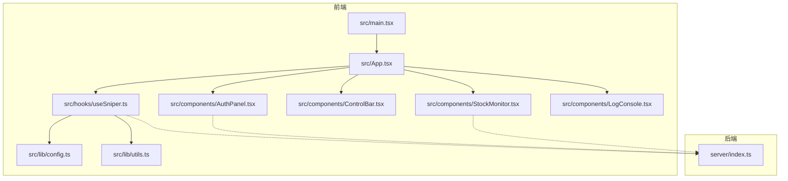
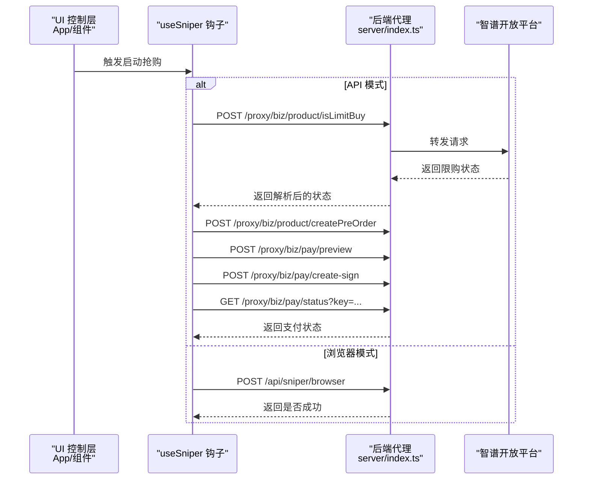
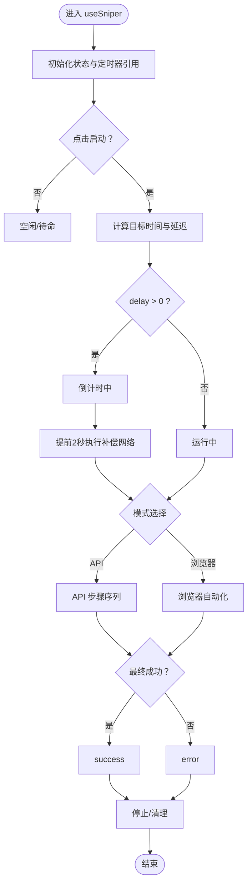
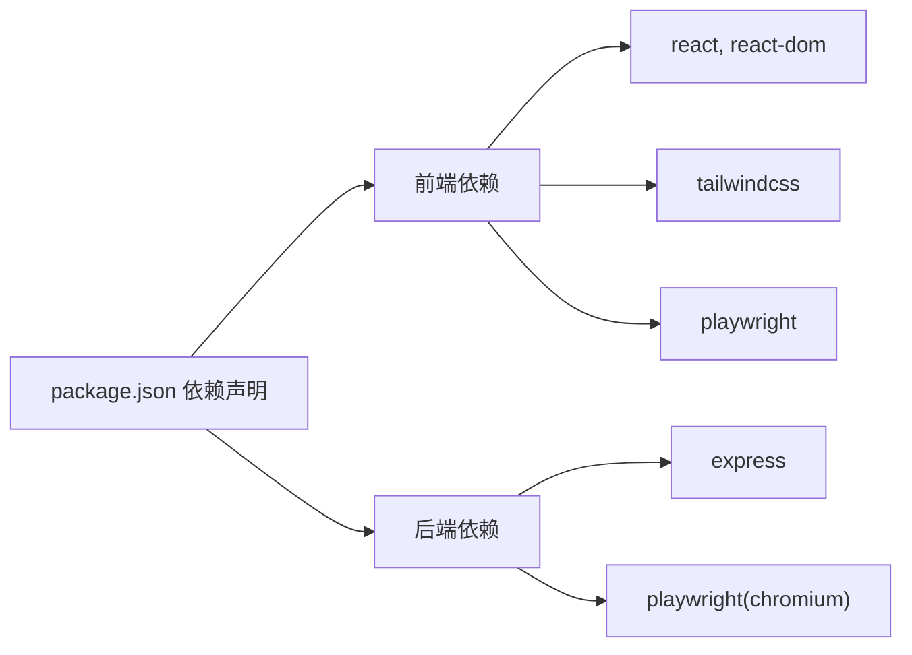

# 测试指南

<cite>
**本文引用的文件**
- [package.json](file://package.json)
- [vite.config.ts](file://vite.config.ts)
- [README.md](file://README.md)
- [src/main.tsx](file://src/main.tsx)
- [src/App.tsx](file://src/App.tsx)
- [src/hooks/useSniper.ts](file://src/hooks/useSniper.ts)
- [src/lib/config.ts](file://src/lib/config.ts)
- [src/lib/utils.ts](file://src/lib/utils.ts)
- [src/components/AuthPanel.tsx](file://src/components/AuthPanel.tsx)
- [src/components/ControlBar.tsx](file://src/components/ControlBar.tsx)
- [src/components/StockMonitor.tsx](file://src/components/StockMonitor.tsx)
- [src/components/LogConsole.tsx](file://src/components/LogConsole.tsx)
- [server/index.ts](file://server/index.ts)
</cite>

## 目录
1. [简介](#简介)
2. [项目结构](#项目结构)
3. [核心组件](#核心组件)
4. [架构总览](#架构总览)
5. [详细组件分析](#详细组件分析)
6. [依赖关系分析](#依赖关系分析)
7. [性能考量](#性能考量)
8. [故障排查指南](#故障排查指南)
9. [结论](#结论)
10. [附录](#附录)

## 简介
本测试指南面向 GLM Sniper 项目，提供从单元测试、组件测试、API/集成测试、端到端测试、Mock 数据、覆盖率与报告、CI/CD 自动化到 TDD 的完整实践方案。内容覆盖前端 React 组件与逻辑钩子、后端 Express 服务、以及跨进程交互场景，帮助团队建立稳定可靠的测试体系。

## 项目结构
- 前端基于 React + TypeScript + Vite，入口为 src/main.tsx，应用根组件为 src/App.tsx。
- 核心业务逻辑集中在 src/hooks/useSniper.ts，负责抢购流程、倒计时、库存监控、日志记录等。
- 配置与工具位于 src/lib/config.ts 和 src/lib/utils.ts，提供计划配置、API 端点、产品 ID 映射、日志格式化等。
- UI 组件位于 src/components/，包含认证面板、控制栏、库存监控、日志控制台等。
- 后端服务位于 server/index.ts，提供 API 代理、浏览器自动化抢购、库存查询等接口。

图表来源
- [src/main.tsx:1-11](file://src/main.tsx#L1-L11)
- [src/App.tsx:1-197](file://src/App.tsx#L1-L197)
- [src/hooks/useSniper.ts:1-407](file://src/hooks/useSniper.ts#L1-L407)
- [src/lib/config.ts:1-104](file://src/lib/config.ts#L1-L104)
- [src/lib/utils.ts:1-51](file://src/lib/utils.ts#L1-L51)
- [src/components/AuthPanel.tsx:1-120](file://src/components/AuthPanel.tsx#L1-L120)
- [src/components/ControlBar.tsx:1-76](file://src/components/ControlBar.tsx#L1-L76)
- [src/components/StockMonitor.tsx:1-140](file://src/components/StockMonitor.tsx#L1-L140)
- [src/components/LogConsole.tsx:1-78](file://src/components/LogConsole.tsx#L1-L78)
- [server/index.ts:1-370](file://server/index.ts#L1-L370)

章节来源
- [src/main.tsx:1-11](file://src/main.tsx#L1-L11)
- [src/App.tsx:1-197](file://src/App.tsx#L1-L197)
- [vite.config.ts:1-13](file://vite.config.ts#L1-L13)
- [README.md:1-74](file://README.md#L1-L74)

## 核心组件
- useSniper 钩子：集中管理抢购状态、倒计时、API 模式与浏览器模式的请求序列、库存监控定时任务、日志收集与清理。
- 配置模块：定义计划类型、套餐配置、产品 ID 映射、API 端点常量等。
- 工具模块：提供日志条目结构、时间格式化、倒计时格式化、目标时间计算等。
- 组件层：认证面板、控制栏、库存监控、日志控制台等，均通过 props 与 useSniper 交互。

章节来源
- [src/hooks/useSniper.ts:1-407](file://src/hooks/useSniper.ts#L1-L407)
- [src/lib/config.ts:1-104](file://src/lib/config.ts#L1-L104)
- [src/lib/utils.ts:1-51](file://src/lib/utils.ts#L1-L51)
- [src/components/AuthPanel.tsx:1-120](file://src/components/AuthPanel.tsx#L1-L120)
- [src/components/ControlBar.tsx:1-76](file://src/components/ControlBar.tsx#L1-L76)
- [src/components/StockMonitor.tsx:1-140](file://src/components/StockMonitor.tsx#L1-L140)
- [src/components/LogConsole.tsx:1-78](file://src/components/LogConsole.tsx#L1-L78)

## 架构总览
前端通过 useSniper 发起两类路径：
- API 模式：通过后端代理访问智谱开放平台接口，完成限购检查、预下单、支付预览、签约与支付状态检查。
- 浏览器模式：由后端启动 Chromium，按目标时间自动导航、选择套餐、点击订阅/支付确认等。

图表来源
- [src/hooks/useSniper.ts:110-248](file://src/hooks/useSniper.ts#L110-L248)
- [server/index.ts:10-40](file://server/index.ts#L10-L40)
- [server/index.ts:252-355](file://server/index.ts#L252-L355)

## 详细组件分析

### useSniper 钩子测试策略
- 单元测试要点
  - 目标时间计算与倒计时逻辑：断言 getTargetDateTime 与倒计时触发时机。
  - 日志系统：断言 createLog 生成的条目结构与顺序。
  - API 模式流程：断言各步骤请求的 URL、方法、头部、参数；断言验证码拦截分支与重试逻辑。
  - 浏览器模式：断言向后端发起请求且返回成功/失败分支。
  - 库存监控：断言轮询间隔、状态更新、自动触发逻辑。
  - 取消与清理：断言 stop/start 对定时器与状态的影响。
- 组件测试要点
  - 使用 React Testing Library 渲染 App 并通过屏幕查询器断言 UI 状态（如“倒计时中”、“抢购中”、“成功/错误”）。
  - 通过事件模拟触发 ControlBar 的启动/停止，断言 useSniper 的状态变化。
  - 断言日志控制台显示最新日志与滚动行为。
- Mock 数据
  - 使用 jest.fn 与 fetch 的全局替换，构造不同响应体（成功/失败、验证码拦截、限流/429）。
  - 为 getTargetDateTime 提供固定时间输入，便于断言倒计时与提前执行补偿。
- 覆盖率
  - 关键分支：验证码检测、重试次数、状态切换、库存可用自动触发。
  - 建议：对 executeApiSniper 的每个步骤设置独立用例，确保每个分支被覆盖。

图表来源
- [src/hooks/useSniper.ts:250-293](file://src/hooks/useSniper.ts#L250-L293)
- [src/hooks/useSniper.ts:110-248](file://src/hooks/useSniper.ts#L110-L248)
- [src/hooks/useSniper.ts:76-106](file://src/hooks/useSniper.ts#L76-L106)

章节来源
- [src/hooks/useSniper.ts:1-407](file://src/hooks/useSniper.ts#L1-L407)
- [src/lib/utils.ts:46-50](file://src/lib/utils.ts#L46-L50)

### 组件测试最佳实践（React Testing Library）
- AuthPanel
  - 断言输入框与可见性切换按钮的行为。
  - 断言验证按钮调用后触发的日志输出。
- ControlBar
  - 断言状态指示器颜色与文案随状态变化。
  - 断言启动/停止按钮在不同状态下的可用性。
- StockMonitor
  - 断言库存卡片高亮与文案。
  - 断言手动查询、启动/停止监控按钮的行为。
- LogConsole
  - 断言日志列表渲染顺序与时间戳格式。
  - 断言清空按钮触发后列表为空。

章节来源
- [src/components/AuthPanel.tsx:1-120](file://src/components/AuthPanel.tsx#L1-L120)
- [src/components/ControlBar.tsx:1-76](file://src/components/ControlBar.tsx#L1-L76)
- [src/components/StockMonitor.tsx:1-140](file://src/components/StockMonitor.tsx#L1-L140)
- [src/components/LogConsole.tsx:1-78](file://src/components/LogConsole.tsx#L1-L78)

### API 测试与集成测试策略
- 后端服务
  - 使用 Express 应用作为被测目标，针对以下路由进行测试：
    - /proxy：断言转发 Authorization/Cookie、正确拼接目标 URL、返回状态码与 JSON。
    - /api/sniper/browser：断言启动 Chromium、设置 Cookie、导航、点击订阅/支付确认、返回成功/失败。
    - /api/sniper/api：断言限购检查、预下单、支付预览、签约、支付状态检查的完整流程。
    - /api/stock/status：断言库存解析逻辑、补货时间推断。
    - /api/health：断言健康检查返回。
- 测试方法
  - 使用 supertest 或原生 fetch 调用后端路由。
  - 使用 playwright 的 chromium 实例进行 E2E 场景验证（见下节）。
  - 对于 /proxy，构造不同上游响应（验证码拦截、限流、正常），断言下游行为。

章节来源
- [server/index.ts:10-40](file://server/index.ts#L10-L40)
- [server/index.ts:42-159](file://server/index.ts#L42-L159)
- [server/index.ts:161-250](file://server/index.ts#L161-L250)
- [server/index.ts:252-355](file://server/index.ts#L252-L355)
- [server/index.ts:357-370](file://server/index.ts#L357-L370)

### 端到端测试（Playwright）
- 配置
  - 在 package.json 中添加脚本以运行 Playwright 测试。
  - 配置浏览器模式，确保 Chromium 可用。
- 执行流程
  - 启动后端服务（npm run server）与前端（npm run dev）。
  - 运行 Playwright 测试，模拟用户操作：登录、配置 Token/Cookies、设置目标时间、启动抢购、观察页面交互与日志。
  - 验证浏览器模式下页面元素点击、支付确认弹窗出现、最终成功/需人工处理的状态。
- 建议
  - 使用稳定的测试账号与环境变量，避免真实交易。
  - 将 Playwright 测试与后端健康检查结合，确保服务可用后再执行。

章节来源
- [package.json:6-12](file://package.json#L6-L12)
- [server/index.ts:42-159](file://server/index.ts#L42-L159)

### Mock 数据的创建与使用
- 前端
  - 使用 jest.spyOn 替换全局 fetch，返回预设的响应体（成功/失败、验证码拦截、限流）。
  - 使用 jest.useFakeTimers 与 advanceTimersByTime 控制定时器，验证倒计时与自动触发。
- 后端
  - 使用代理服务模拟上游接口响应，断言 /proxy 的转发行为。
  - 对库存查询接口，构造多种 content 结构（字符串/对象），断言解析分支。

章节来源
- [src/hooks/useSniper.ts:110-248](file://src/hooks/useSniper.ts#L110-L248)
- [server/index.ts:10-40](file://server/index.ts#L10-L40)
- [server/index.ts:252-355](file://server/index.ts#L252-L355)

### 测试覆盖率要求与报告
- 覆盖率指标建议
  - 行覆盖率：≥80%
  - 分支覆盖率：≥75%
  - 函数覆盖率：≥85%
  - 语句覆盖率：≥80%
- 报告生成
  - 在 Vite/React 测试中结合 Jest 与 Istanbul 生成 HTML/Coverage 报告。
  - 在 CI 中上传覆盖率报告至覆盖率平台（如 Codecov/GitHub Actions）。

章节来源
- [vite.config.ts:1-13](file://vite.config.ts#L1-L13)
- [README.md:1-74](file://README.md#L1-L74)

### CI/CD 中的测试自动化
- 建议流水线步骤
  - 安装依赖与类型检查
  - 运行单元/组件测试与覆盖率统计
  - 启动后端服务（npm run server），运行 API/集成测试
  - 启动前端服务（npm run dev），运行 Playwright 端到端测试
  - 上传覆盖率与测试报告
- 环境变量
  - 设置后端端口、超时、日志级别等，确保测试稳定性。
- 缓存与并发
  - 缓存 node_modules，减少安装时间。
  - 并行执行不依赖共享资源的测试套件。

章节来源
- [package.json:6-12](file://package.json#L6-L12)
- [server/index.ts:362-370](file://server/index.ts#L362-L370)

### 测试驱动开发（TDD）实施建议
- 从最小可行用例开始
  - 先写 UI 组件的渲染与交互断言，再实现对应逻辑。
  - 为 useSniper 的状态机编写状态转换用例，逐步完善 API/浏览器模式分支。
- 驱动设计
  - 通过测试暴露接口设计缺陷，优先保证可测试性（注入依赖、解耦副作用）。
- 回归与演进
  - 每次新增功能或修复缺陷，先补充测试，再提交代码，保持测试驱动的持续反馈。

## 依赖关系分析
- 前端依赖
  - React、React DOM、TailwindCSS、Lucide React、Playwright（用于 E2E）、React Router（用于路由）。
- 后端依赖
  - Express、CORS、Cookie 解析、Playwright（Chromium 启动）。
- 关键耦合点
  - useSniper 与后端服务通过 /proxy 与 /api/sniper/* 接口耦合。
  - 组件与 useSniper 通过 props 与回调耦合，便于测试时注入 mock。

图表来源
- [package.json:14-46](file://package.json#L14-L46)

章节来源
- [package.json:14-46](file://package.json#L14-L46)

## 性能考量
- 测试执行性能
  - 使用并行测试与缓存策略，缩短 CI 时间。
  - 将重型 E2E 测试拆分为多个 Job 并行执行。
- 覆盖率与性能平衡
  - 优先保证关键路径覆盖率，避免过度测试导致成本过高。
- 端到端测试优化
  - 复用浏览器上下文，减少启动/关闭开销。
  - 使用稳定的测试数据与账号，降低失败重试成本。

## 故障排查指南
- 常见问题
  - 后端服务未启动：检查端口占用与健康检查接口。
  - CORS 限制：确认 /proxy 是否正确转发头部与 Cookie。
  - 验证码拦截：识别响应中的验证码关键词，提示用户手动完成。
  - 定时器未清理：确保在组件卸载与停止时清除定时器。
- 调试建议
  - 在日志控制台查看详细步骤与错误信息。
  - 使用浏览器开发者工具检查网络请求与响应。
  - 在 CI 中开启详细日志与覆盖率报告。

章节来源
- [src/hooks/useSniper.ts:157-177](file://src/hooks/useSniper.ts#L157-L177)
- [src/components/LogConsole.tsx:17-78](file://src/components/LogConsole.tsx#L17-L78)
- [server/index.ts:357-370](file://server/index.ts#L357-L370)

## 结论
通过将单元测试、组件测试、API/集成测试与端到端测试相结合，并配合完善的 Mock 数据与覆盖率策略，GLM Sniper 可以在快速迭代的同时保持高质量与稳定性。建议在 CI/CD 中自动化执行所有测试，并以 TDD 方式推动持续改进。

## 附录
- 快速清单
  - 为 useSniper 的每个分支编写单元测试。
  - 为关键组件编写 RTL 测试，覆盖交互与状态。
  - 为后端路由编写集成测试，覆盖 /proxy 与 /api/sniper/*。
  - 使用 Playwright 编写 E2E 测试，验证浏览器模式。
  - 在 CI 中启用覆盖率与报告上传。
  - 采用 TDD，先写测试再实现功能。