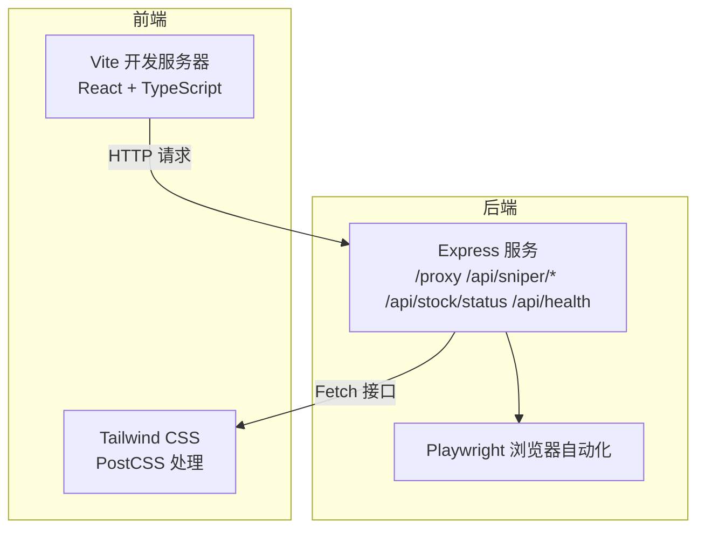
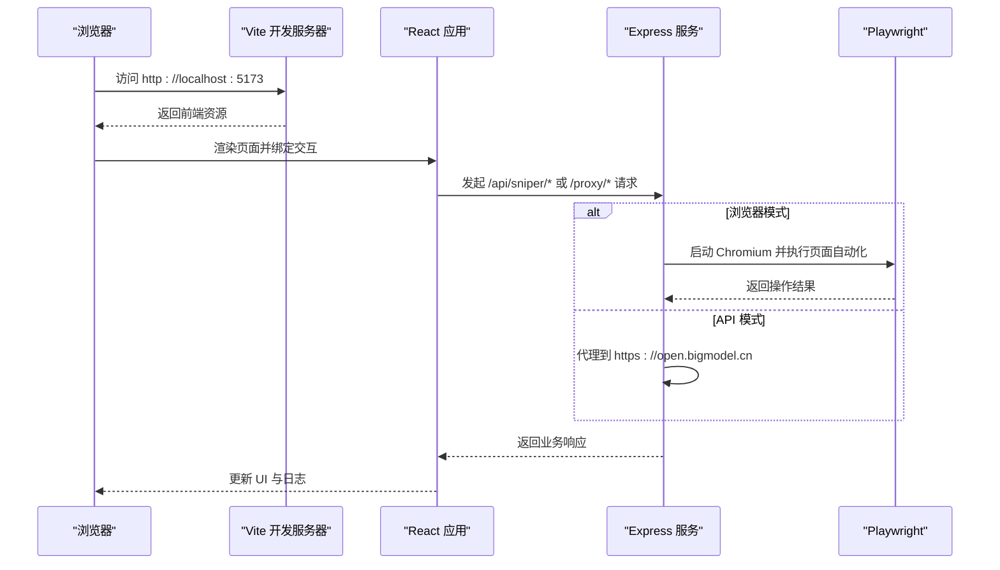
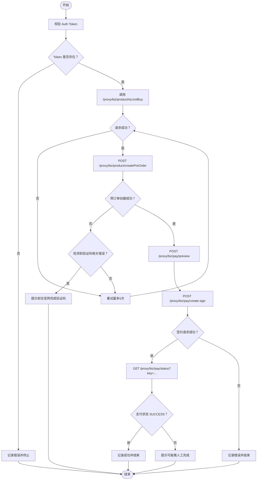

# 环境搭建

<cite>
**本文引用的文件**
- [package.json](file://package.json)
- [vite.config.ts](file://vite.config.ts)
- [tsconfig.json](file://tsconfig.json)
- [tsconfig.app.json](file://tsconfig.app.json)
- [tsconfig.node.json](file://tsconfig.node.json)
- [tsconfig.server.json](file://tsconfig.server.json)
- [tailwind.config.ts](file://tailwind.config.ts)
- [postcss.config.js](file://postcss.config.js)
- [eslint.config.js](file://eslint.config.js)
- [README.md](file://README.md)
- [index.html](file://index.html)
- [src/main.tsx](file://src/main.tsx)
- [src/App.tsx](file://src/App.tsx)
- [src/hooks/useSniper.ts](file://src/hooks/useSniper.ts)
- [src/lib/config.ts](file://src/lib/config.ts)
- [server/index.ts](file://server/index.ts)
</cite>

## 目录
1. [简介](#简介)
2. [项目结构](#项目结构)
3. [核心组件](#核心组件)
4. [架构总览](#架构总览)
5. [详细组件分析](#详细组件分析)
6. [依赖分析](#依赖分析)
7. [性能考虑](#性能考虑)
8. [故障排除指南](#故障排除指南)
9. [结论](#结论)
10. [附录](#附录)

## 简介
本指南面向首次搭建 GLM Sniper 开发环境的开发者，覆盖 Node.js 版本与包管理器选择、依赖安装顺序、Vite 配置作用与关键项、TypeScript 编译与类型定义、Tailwind CSS 样式系统、开发服务器启动步骤与常用命令，并提供常见问题的排查方案。

## 项目结构
该项目采用“前端应用 + 后端代理/自动化服务”的双层架构：
- 前端基于 React + TypeScript + Vite，使用 Tailwind CSS 作为样式基础并结合 PostCSS 自动化处理。
- 后端提供 Express 服务，负责：
  - API 代理以绕过跨域限制；
  - 浏览器自动化模式（Playwright）模拟购买流程；
  - 库存查询与健康检查等辅助接口。

图表来源
- [server/index.ts:1-370](file://server/index.ts#L1-L370)
- [vite.config.ts:1-13](file://vite.config.ts#L1-L13)
- [tailwind.config.ts:1-104](file://tailwind.config.ts#L1-L104)
- [postcss.config.js:1-7](file://postcss.config.js#L1-L7)

章节来源
- [package.json:1-48](file://package.json#L1-L48)
- [index.html:1-13](file://index.html#L1-L13)
- [src/main.tsx:1-11](file://src/main.tsx#L1-L11)
- [src/App.tsx:1-197](file://src/App.tsx#L1-L197)

## 核心组件
- 包管理与脚本
  - 脚本命令涵盖开发、构建、预览、本地服务与一键启动，详见下节“常用命令”。
- 构建与打包
  - 先执行 TypeScript 项目引用构建，再由 Vite 执行前端打包。
- 类型系统
  - 通过多 tsconfig 文件分离应用与 Node 环境编译目标，分别用于浏览器端与服务端。
- 样式系统
  - Tailwind CSS + PostCSS（autoprefixer），支持暗色模式、动画与主题变量。
- 代码质量
  - ESLint 平台化配置，启用推荐规则与 React Hooks/Refresh 插件。

章节来源
- [package.json:6-12](file://package.json#L6-L12)
- [tsconfig.json:1-8](file://tsconfig.json#L1-L8)
- [tsconfig.app.json:1-34](file://tsconfig.app.json#L1-L34)
- [tsconfig.node.json:1-25](file://tsconfig.node.json#L1-L25)
- [tsconfig.server.json:1-15](file://tsconfig.server.json#L1-L15)
- [tailwind.config.ts:1-104](file://tailwind.config.ts#L1-L104)
- [postcss.config.js:1-7](file://postcss.config.js#L1-L7)
- [eslint.config.js:1-23](file://eslint.config.js#L1-L23)

## 架构总览
下图展示开发阶段的典型交互：浏览器访问 Vite 开发服务器，前端通过 fetch 调用本地后端服务；后端服务可转发请求至外部接口或驱动 Playwright 完成自动化操作。

图表来源
- [src/hooks/useSniper.ts:77-106](file://src/hooks/useSniper.ts#L77-L106)
- [src/hooks/useSniper.ts:111-248](file://src/hooks/useSniper.ts#L111-L248)
- [server/index.ts:12-40](file://server/index.ts#L12-L40)
- [server/index.ts:43-159](file://server/index.ts#L43-L159)
- [server/index.ts:162-250](file://server/index.ts#L162-L250)

## 详细组件分析

### Node.js 与包管理器选择
- Node.js 版本
  - TypeScript 目标与模块策略在 tsconfig 中统一指向现代 ES 版本与 bundler 模式，建议使用较新的 LTS 或稳定版本 Node（例如 18.x/20.x/22.x）以获得最佳兼容性与性能。
- 包管理器
  - 推荐使用 npm（与脚本一致）。若偏好 yarn/pnpm，需自行验证依赖解析与插件兼容性，但本仓库未提供相应锁定文件。

章节来源
- [tsconfig.app.json:4-18](file://tsconfig.app.json#L4-L18)
- [tsconfig.node.json:4-15](file://tsconfig.node.json#L4-L15)
- [tsconfig.server.json:3-11](file://tsconfig.server.json#L3-L11)

### 依赖安装顺序与说明
- 安装顺序
  1) 安装生产依赖与开发依赖（按 package.json 的 dependencies 与 devDependencies 字段）。
  2) 若使用 pnpm/yarn，注意其严格模式可能导致部分插件不兼容；建议优先使用 npm。
- 关键依赖说明
  - 前端运行时：react、react-dom、react-router-dom。
  - 构建与开发：@vitejs/plugin-react、vite、typescript、tsx。
  - 样式：tailwindcss、autoprefixer、postcss、tailwindcss-animate。
  - 代码质量：eslint、@typescript-eslint/*、eslint-plugin-react-hooks、eslint-plugin-react-refresh。
  - 后端能力：express、cors、cookie-parse、playwright。
- 安装后验证
  - 执行 npm run dev 与 npm run server，确认前端与后端均正常启动。

章节来源
- [package.json:14-46](file://package.json#L14-L46)

### Vite 配置详解
- 主要作用
  - 集成 React 插件，启用路径别名 @ 指向 src，便于模块导入。
- 关键配置项
  - plugins: 启用 @vitejs/plugin-react。
  - resolve.alias: 将 @ 映射到 ./src，提升导入可读性。
- 影响范围
  - 仅影响开发服务器与构建流程，不影响运行时行为。

章节来源
- [vite.config.ts:1-13](file://vite.config.ts#L1-L13)
- [tsconfig.app.json:25-29](file://tsconfig.app.json#L25-L29)

### TypeScript 编译配置与类型定义
- 多 tsconfig 分离
  - tsconfig.json：聚合引用，指向 tsconfig.app.json 与 tsconfig.node.json。
  - tsconfig.app.json：浏览器端编译目标，启用 JSX、路径别名与严格校验。
  - tsconfig.node.json：Node 环境编译目标，用于 Vite 配置与工具链。
  - tsconfig.server.json：服务端（server/index.ts）编译配置，输出目录与模块解析策略独立。
- 类型定义
  - 浏览器端引入 vite/client 类型，Node 端引入 node 类型。
  - ESLint 使用 tsconfig 引用来进行类型感知规则。

章节来源
- [tsconfig.json:1-8](file://tsconfig.json#L1-L8)
- [tsconfig.app.json:1-34](file://tsconfig.app.json#L1-L34)
- [tsconfig.node.json:1-25](file://tsconfig.node.json#L1-L25)
- [tsconfig.server.json:1-15](file://tsconfig.server.json#L1-L15)
- [eslint.config.js:37-39](file://eslint.config.js#L37-L39)

### Tailwind CSS 配置与样式系统
- 配置要点
  - darkMode: class，支持暗色模式切换。
  - content: 指定扫描文件范围，确保按需生成类名。
  - 主题扩展：颜色、圆角、字体族、动画与关键帧。
  - 插件：tailwindcss-animate。
- PostCSS 集成
  - postcss.config.js 启用 tailwindcss 与 autoprefixer，实现 CSS 自动前缀与按需处理。
- 样式使用
  - 组件中广泛使用 Tailwind 类名与主题变量，如背景、卡片、强调色等。

章节来源
- [tailwind.config.ts:1-104](file://tailwind.config.ts#L1-L104)
- [postcss.config.js:1-7](file://postcss.config.js#L1-L7)
- [src/App.tsx:19-193](file://src/App.tsx#L19-L193)

### 开发服务器启动步骤与常用命令
- 启动步骤
  1) 安装依赖（见上节）。
  2) 启动后端服务：npm run server（监听本地 3100 端口）。
  3) 启动前端开发服务器：npm run dev（默认 5173 端口）。
  4) 可选：一键启动：npm run start（同时启动前端与后端）。
- 常用命令
  - dev：启动 Vite 开发服务器。
  - build：先执行 TypeScript 项目引用构建，再由 Vite 打包。
  - preview：预览打包产物。
  - lint：执行 ESLint 规则检查。
  - server：使用 tsx 启动后端服务。
  - start：并行启动前端与后端服务。

章节来源
- [package.json:6-12](file://package.json#L6-L12)
- [server/index.ts:362-370](file://server/index.ts#L362-L370)

### 代码级流程图：API 模式抢购主流程

图表来源
- [src/hooks/useSniper.ts:111-248](file://src/hooks/useSniper.ts#L111-L248)
- [server/index.ts:162-250](file://server/index.ts#L162-L250)

## 依赖分析
- 前端依赖
  - React 生态：react、react-dom、react-router-dom。
  - 构建与热更新：@vitejs/plugin-react、vite。
  - 类型与工具：typescript、@types/*。
- 样式与工具
  - Tailwind CSS、tailwindcss-animate、autoprefixer、postcss。
- 后端依赖
  - Web 框架：express、cors。
  - Cookie 解析：cookie-parse。
  - 自动化：playwright。
- 开发工具
  - 代码质量：eslint、typescript-eslint、eslint-plugin-react-hooks、eslint-plugin-react-refresh。
  - 运行：tsx。

章节来源
- [package.json:14-46](file://package.json#L14-L46)

## 性能考虑
- 构建性能
  - 使用 Vite 的快速冷启动与按需编译特性；TypeScript 采用项目引用分层构建，减少重复编译。
- 样式体积
  - Tailwind content 扫描范围明确，配合按需生成可降低 CSS 体积。
- 开发体验
  - React 插件与 HMR 提升迭代效率；ESLint 平台化配置减少规则冲突。

## 故障排除指南
- 启动后端失败（端口占用）
  - 现象：后端无法监听 3100 端口。
  - 处理：关闭占用进程或修改端口后重启。
  - 参考：后端监听端口定义位置。
- 前端无法访问后端接口（CORS）
  - 现象：浏览器控制台出现跨域错误。
  - 处理：使用后端提供的 /proxy 前缀转发请求，避免直接跨域访问。
  - 参考：后端代理路由与前端调用点。
- 浏览器模式无法启动自动化
  - 现象：Playwright 启动失败或页面找不到元素。
  - 处理：确保 Chromium 可用；检查页面结构变化导致的选择器失效；必要时调整选择器策略。
  - 参考：浏览器自动化路由与页面交互逻辑。
- API 模式频繁触发验证码
  - 现象：预订单创建失败且响应包含验证码相关关键词。
  - 处理：前往官网完成验证码后重试；适当降低请求频率。
  - 参考：API 模式重试与验证码检测逻辑。
- ESLint 报错或类型检查失败
  - 现象：编辑器或命令行提示类型/规则错误。
  - 处理：确保 tsconfig 引用正确；升级/降级插件版本以匹配 ESLint 平台化配置。
  - 参考：ESLint 配置与 tsconfig 引用。

章节来源
- [server/index.ts:362-370](file://server/index.ts#L362-L370)
- [src/hooks/useSniper.ts:157-177](file://src/hooks/useSniper.ts#L157-L177)
- [src/hooks/useSniper.ts:108-108](file://src/hooks/useSniper.ts#L108-L108)
- [eslint.config.js:1-23](file://eslint.config.js#L1-L23)

## 结论
本指南提供了从零搭建 GLM Sniper 开发环境的完整路径：明确 Node.js 与包管理器选择、规范安装顺序、理解 Vite/Tailwind/TS 配置、掌握常用命令与常见问题处理。遵循上述步骤可快速进入开发与调试阶段。

## 附录
- 快速核对清单
  - 已安装 Node.js（建议 LTS/稳定版）。
  - 已执行 npm ci 或 npm install。
  - 已运行 npm run server 与 npm run dev。
  - 已确认浏览器访问 http://localhost:5173 正常。
  - 已确认后端日志显示健康服务与各接口可用。