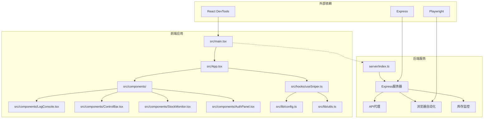
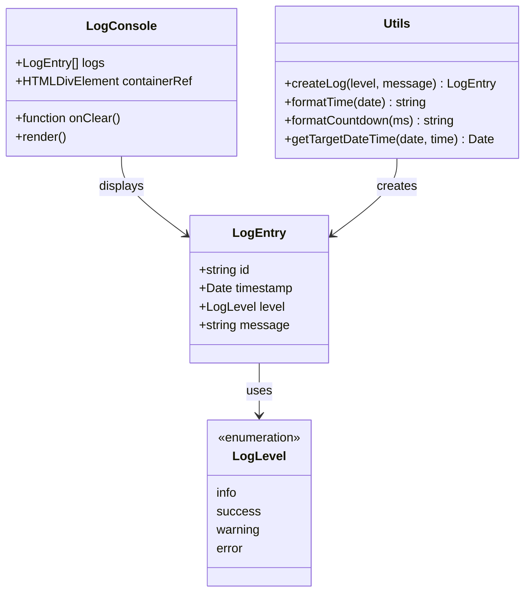
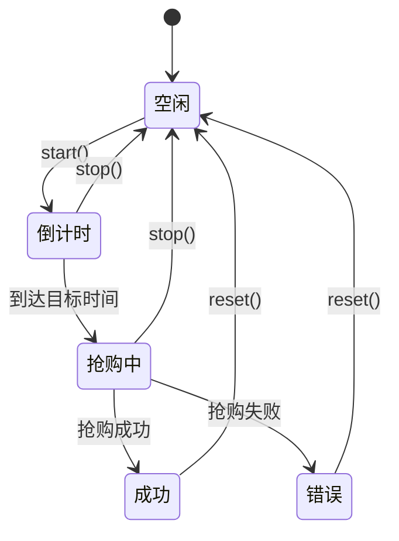
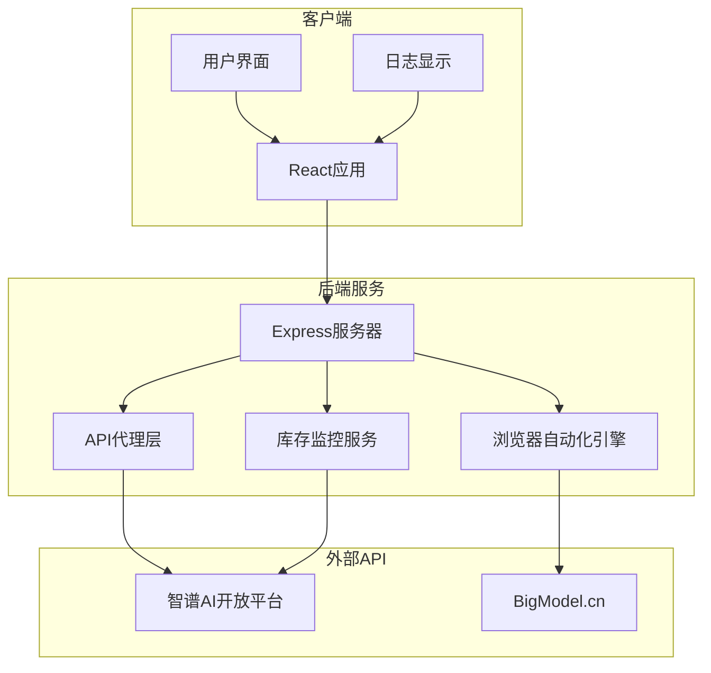
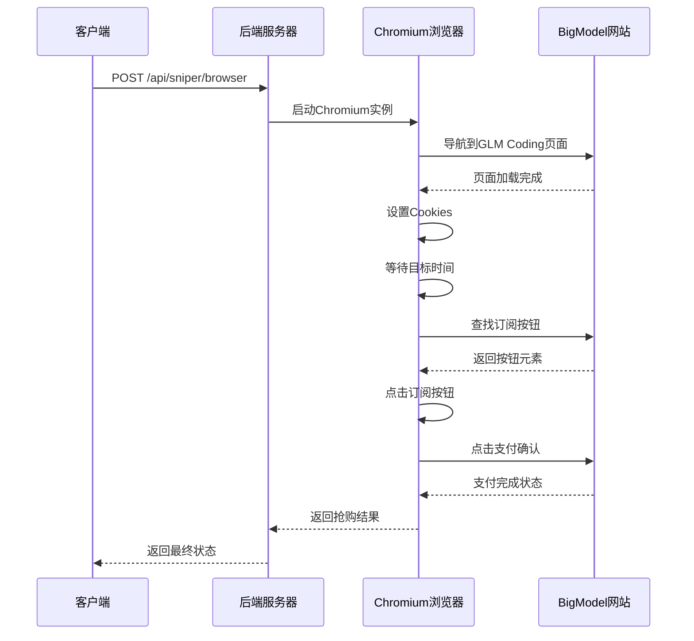
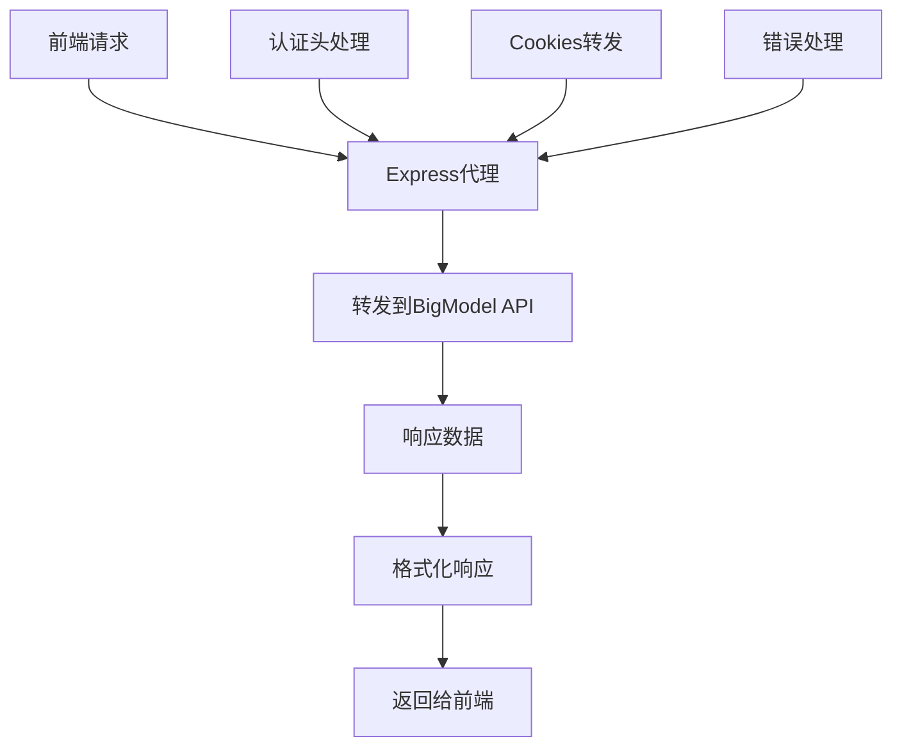
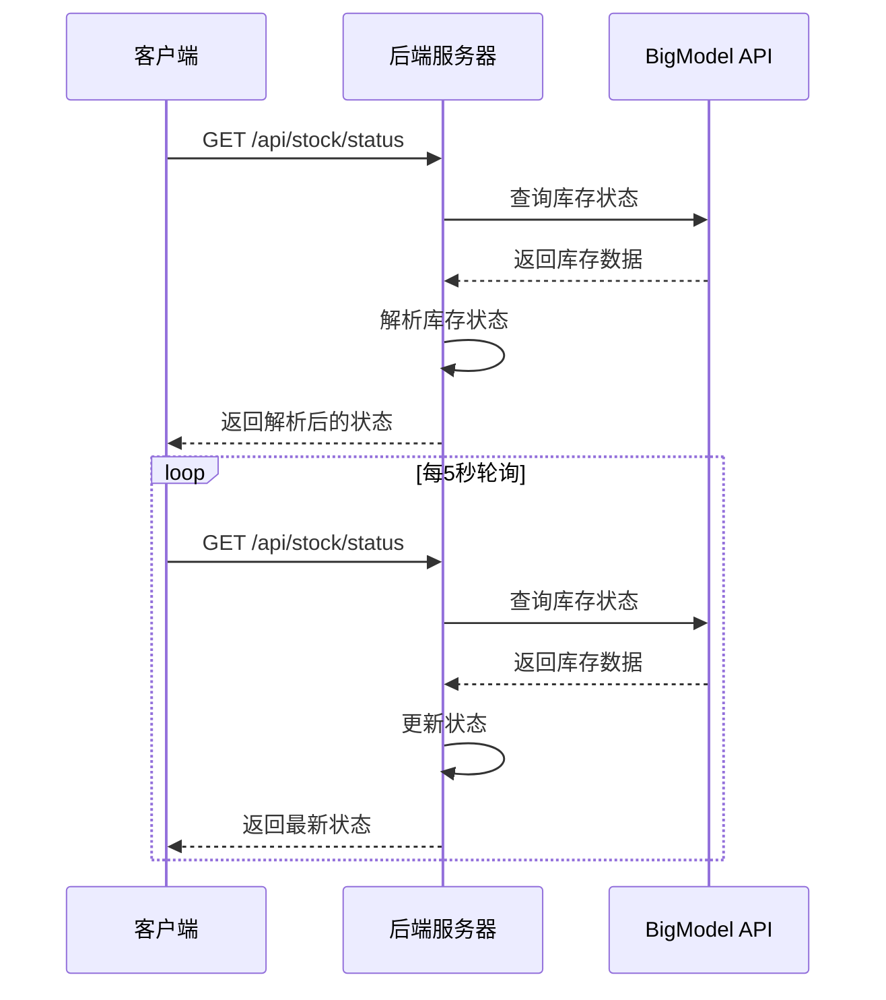
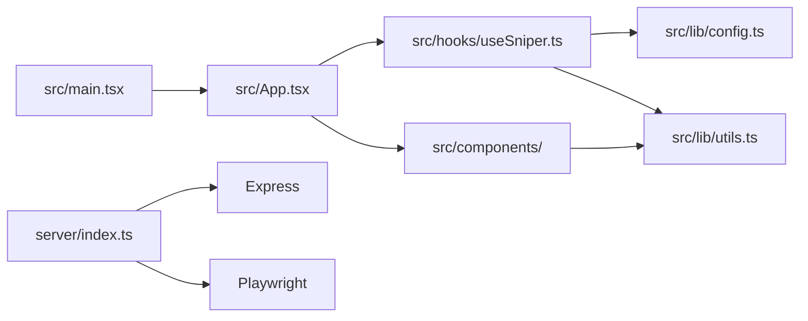
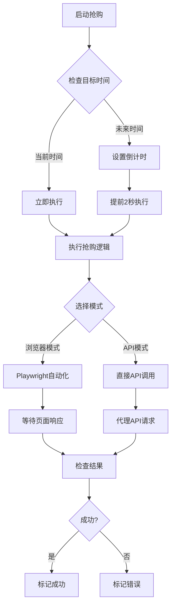

# 调试工具

<cite>
**本文档引用的文件**
- [README.md](file://README.md)
- [package.json](file://package.json)
- [vite.config.ts](file://vite.config.ts)
- [src/main.tsx](file://src/main.tsx)
- [src/App.tsx](file://src/App.tsx)
- [src/hooks/useSniper.ts](file://src/hooks/useSniper.ts)
- [src/lib/config.ts](file://src/lib/config.ts)
- [src/lib/utils.ts](file://src/lib/utils.ts)
- [src/components/LogConsole.tsx](file://src/components/LogConsole.tsx)
- [src/components/ControlBar.tsx](file://src/components/ControlBar.tsx)
- [src/components/StockMonitor.tsx](file://src/components/StockMonitor.tsx)
- [src/components/AuthPanel.tsx](file://src/components/AuthPanel.tsx)
- [server/index.ts](file://server/index.ts)
</cite>

## 目录
1. [简介](#简介)
2. [项目结构](#项目结构)
3. [核心组件](#核心组件)
4. [架构概览](#架构概览)
5. [详细组件分析](#详细组件分析)
6. [依赖关系分析](#依赖关系分析)
7. [性能考虑](#性能考虑)
8. [故障排除指南](#故障排除指南)
9. [结论](#结论)

## 简介

GLM Sniper是一个基于React + TypeScript + Vite构建的智能抢购工具，专为智谱AI的GLM Coding Plan设计。该项目提供了两种抢购模式：浏览器自动化模式和API高速模式，并配备了完整的日志系统和调试功能。

本指南将详细介绍如何使用各种调试工具和技术来诊断和解决GLM Sniper中的问题，包括浏览器开发者工具、React DevTools、Playwright调试功能、日志系统以及性能分析工具。

## 项目结构

GLM Sniper采用模块化的React应用架构，主要分为前端界面层和后端服务层：



**图表来源**
- [src/main.tsx:1-11](file://src/main.tsx#L1-L11)
- [src/App.tsx:1-197](file://src/App.tsx#L1-L197)
- [server/index.ts:1-370](file://server/index.ts#L1-L370)

**章节来源**
- [src/main.tsx:1-11](file://src/main.tsx#L1-L11)
- [src/App.tsx:1-197](file://src/App.tsx#L1-L197)
- [server/index.ts:1-370](file://server/index.ts#L1-L370)

## 核心组件

### 日志系统架构

GLM Sniper实现了完整的日志记录系统，支持四种日志级别：



**图表来源**
- [src/lib/utils.ts:4-51](file://src/lib/utils.ts#L4-L51)
- [src/components/LogConsole.tsx:1-78](file://src/components/LogConsole.tsx#L1-L78)

### 抢购控制器



**图表来源**
- [src/hooks/useSniper.ts:57-293](file://src/hooks/useSniper.ts#L57-L293)

**章节来源**
- [src/lib/utils.ts:4-51](file://src/lib/utils.ts#L4-L51)
- [src/components/LogConsole.tsx:1-78](file://src/components/LogConsole.tsx#L1-L78)
- [src/hooks/useSniper.ts:57-293](file://src/hooks/useSniper.ts#L57-L293)

## 架构概览

GLM Sniper采用前后端分离的架构设计，前端负责用户界面和交互逻辑，后端提供API代理、浏览器自动化和库存监控服务。



**图表来源**
- [server/index.ts:1-370](file://server/index.ts#L1-L370)
- [src/hooks/useSniper.ts:77-106](file://src/hooks/useSniper.ts#L77-L106)

## 详细组件分析

### 浏览器自动化调试

浏览器自动化模式通过Playwright实现，支持无头和有头模式调试：

#### Playwright调试功能



**图表来源**
- [server/index.ts:43-159](file://server/index.ts#L43-L159)

#### 调试要点

1. **浏览器模式切换**：通过`headless: false`参数启用可视化调试
2. **元素定位调试**：使用多种选择器策略确保元素正确识别
3. **页面等待策略**：合理设置等待超时时间避免过早或过晚操作
4. **错误处理**：捕获页面导航和元素查找过程中的异常

**章节来源**
- [server/index.ts:43-159](file://server/index.ts#L43-L159)

### API模式调试

API模式通过Express服务器的代理功能直接调用智谱AI的API：

#### API代理工作流程



**图表来源**
- [server/index.ts:10-40](file://server/index.ts#L10-L40)

**章节来源**
- [server/index.ts:10-40](file://server/index.ts#L10-L40)

### 库存监控调试

库存监控功能提供了实时的库存状态跟踪：

#### 库存监控流程



**图表来源**
- [src/hooks/useSniper.ts:318-372](file://src/hooks/useSniper.ts#L318-L372)
- [server/index.ts:252-355](file://server/index.ts#L252-L355)

**章节来源**
- [src/hooks/useSniper.ts:318-372](file://src/hooks/useSniper.ts#L318-L372)
- [server/index.ts:252-355](file://server/index.ts#L252-L355)

## 依赖关系分析

### 外部依赖关系

```mermaid
graph TB
subgraph "开发依赖"
A[@vitejs/plugin-react]
B[typescript]
C[eslint]
D[tailwindcss]
end
subgraph "运行时依赖"
E[react]
F[react-dom]
G[express]
H[playwright]
I[cors]
J[cookie-parse]
end
subgraph "项目文件"
K[vite.config.ts]
L[package.json]
M[server/index.ts]
end
K --> A
K --> B
L --> E
L --> F
L --> G
L --> H
M --> G
M --> H
```

**图表来源**
- [package.json:14-46](file://package.json#L14-L46)
- [vite.config.ts:1-13](file://vite.config.ts#L1-L13)

### 内部模块依赖



**图表来源**
- [src/main.tsx:1-11](file://src/main.tsx#L1-L11)
- [src/App.tsx:1-10](file://src/App.tsx#L1-L10)
- [src/hooks/useSniper.ts:1-9](file://src/hooks/useSniper.ts#L1-L9)

**章节来源**
- [package.json:14-46](file://package.json#L14-L46)
- [vite.config.ts:1-13](file://vite.config.ts#L1-L13)
- [src/main.tsx:1-11](file://src/main.tsx#L1-L11)

## 性能考虑

### 日志性能优化

GLM Sniper的日志系统经过专门优化以避免性能问题：

1. **自动滚动优化**：只在新日志到达时更新滚动位置
2. **虚拟化渲染**：大量日志时保持UI响应性
3. **内存管理**：及时清理定时器和取消请求

### 抢购性能策略



**图表来源**
- [src/hooks/useSniper.ts:250-293](file://src/hooks/useSniper.ts#L250-L293)

**章节来源**
- [src/hooks/useSniper.ts:250-293](file://src/hooks/useSniper.ts#L250-L293)

## 故障排除指南

### 常见问题诊断流程

#### 1. 后端服务启动问题

**症状**：前端无法连接到后端服务
**诊断步骤**：
1. 检查后端服务是否正常启动
2. 验证端口3100是否被占用
3. 检查CORS配置
4. 验证API代理功能

**解决方案**：
- 确保执行`npm run server`启动后端服务
- 检查防火墙设置
- 验证网络连接

#### 2. 浏览器自动化失败

**症状**：Playwright无法找到页面元素
**诊断步骤**：
1. 检查浏览器实例是否成功启动
2. 验证页面导航是否完成
3. 检查元素选择器的有效性
4. 确认Cookies设置正确

**解决方案**：
- 使用`headless: false`进行可视化调试
- 更新元素选择器策略
- 检查页面结构变化

#### 3. API调用失败

**症状**：代理请求返回错误
**诊断步骤**：
1. 验证认证Token有效性
2. 检查代理头转发
3. 确认目标URL正确性
4. 检查网络连接

**解决方案**：
- 重新获取有效的认证Token
- 检查代理配置
- 验证目标API可用性

#### 4. 库存监控异常

**症状**：库存状态显示不准确
**诊断步骤**：
1. 检查API响应格式
2. 验证库存状态解析逻辑
3. 确认轮询间隔设置
4. 检查时间同步

**解决方案**：
- 更新库存状态解析规则
- 调整轮询频率
- 检查时区设置

### 调试工具使用指南

#### 浏览器开发者工具

**网络面板调试**：
1. 打开开发者工具（F12或右键→检查）
2. 切换到Network标签页
3. 刷新页面观察请求列表
4. 查看请求头、响应体和状态码
5. 使用XHR断点调试异步请求

**控制台调试**：
1. 打开Console标签页
2. 输入调试命令观察输出
3. 使用console.log()输出变量值
4. 使用断点调试JavaScript代码

**性能分析**：
1. 打开Performance标签页
2. 点击Record按钮开始录制
3. 执行目标操作
4. 分析CPU使用情况和内存泄漏
5. 识别性能瓶颈

#### React DevTools

**安装和配置**：
1. 安装React DevTools扩展
2. 在浏览器中启用扩展
3. 打开开发者工具查看Components标签

**组件树查看**：
1. 在Components标签中查看组件层次
2. 选择特定组件查看属性和状态
3. 观察组件的渲染次数
4. 检查props传递路径

**状态检查**：
1. 在Profiler标签中分析组件性能
2. 查看组件的re-render原因
3. 识别不必要的重渲染
4. 优化组件状态管理

#### Playwright调试

**截图功能**：
```javascript
// 在Playwright测试中添加截图
await page.screenshot({ path: 'screenshot.png' })
```

**视频录制**：
```javascript
// 启用视频录制
const browser = await chromium.launch({
  headless: false,
  recordVideo: { dir: 'videos/' }
})
```

**页面元素检查**：
```javascript
// 使用检查器选择元素
await page.pause()
// 或者使用选择器调试
const element = await page.$('button:has-text("订阅")')
```

#### 日志系统调试

**日志级别设置**：
- `info`: 一般信息日志
- `success`: 成功状态日志  
- `warning`: 警告信息日志
- `error`: 错误信息日志

**日志过滤**：
1. 在日志控制台中查看不同级别的日志
2. 使用搜索功能快速定位特定日志
3. 清理历史日志释放内存

**章节来源**
- [src/components/LogConsole.tsx:10-15](file://src/components/LogConsole.tsx#L10-L15)
- [src/lib/utils.ts:20-27](file://src/lib/utils.ts#L20-L27)

### 断点调试技巧

#### 条件断点设置

1. 在代码编辑器中右键点击行号
2. 选择"添加条件断点"
3. 输入断点条件表达式
4. 只有满足条件时才会触发断点

#### 异步代码调试

1. 使用Promise断点调试异步操作
2. 在async/await代码中设置断点
3. 使用Call Stack查看调用链
4. 检查Promise状态变化

#### 性能瓶颈识别

1. 使用Performance面板录制页面操作
2. 分析CPU使用峰值
3. 识别长时间运行的任务
4. 优化重渲染和事件处理

## 结论

GLM Sniper提供了完整的调试工具链，包括浏览器开发者工具、React DevTools、Playwright调试功能、内置日志系统和性能分析工具。通过合理使用这些工具，开发者可以有效地诊断和解决各种技术问题。

关键调试策略包括：
- 利用多层日志系统追踪问题根源
- 使用浏览器开发者工具分析网络请求和性能
- 通过React DevTools理解组件状态变化
- 运用Playwright的可视化调试功能
- 建立系统性的故障排除流程

建议在开发过程中持续监控日志输出，定期使用性能分析工具识别潜在问题，并建立完善的测试和调试环境。