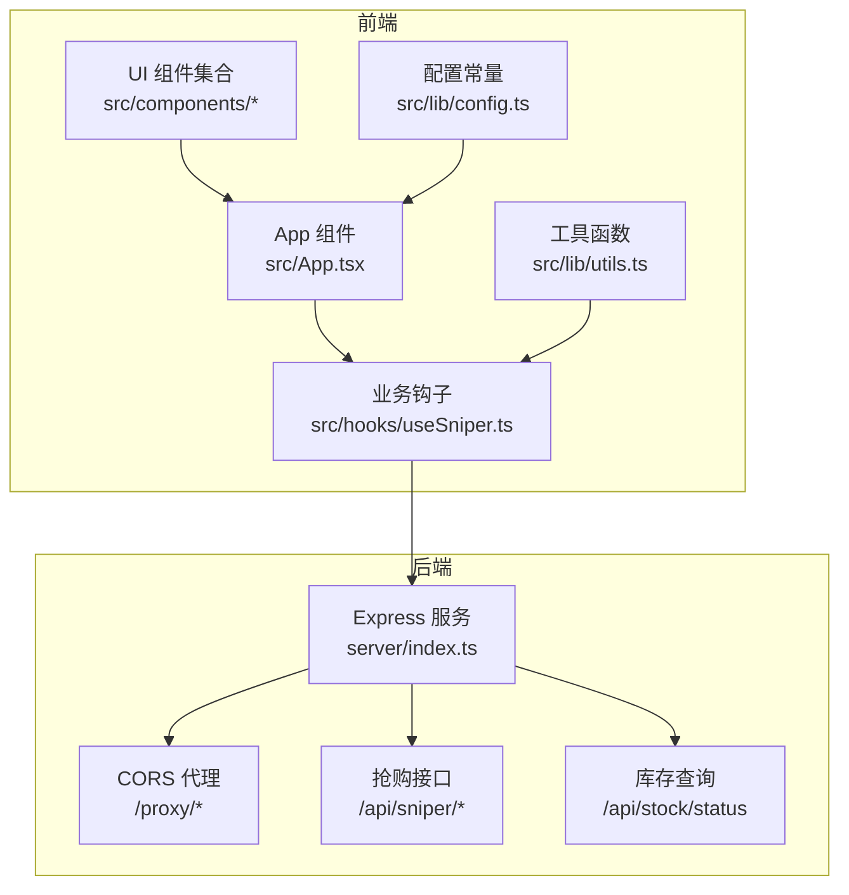
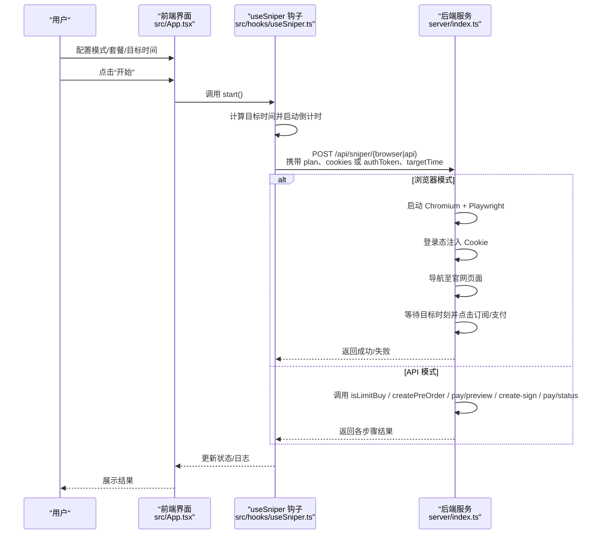
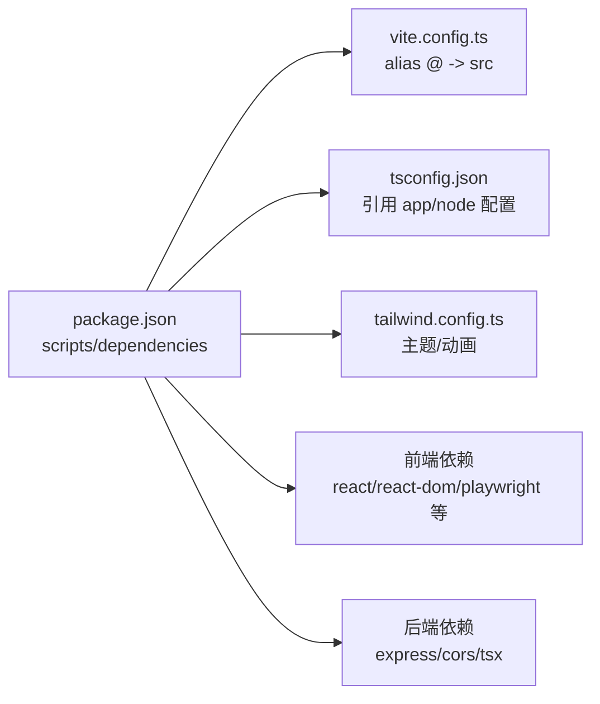

# 快速开始

<cite>
**本文引用的文件**
- [package.json](file://package.json)
- [vite.config.ts](file://vite.config.ts)
- [tsconfig.json](file://tsconfig.json)
- [tailwind.config.ts](file://tailwind.config.ts)
- [server/index.ts](file://server/index.ts)
- [src/lib/config.ts](file://src/lib/config.ts)
- [src/lib/utils.ts](file://src/lib/utils.ts)
- [src/hooks/useSniper.ts](file://src/hooks/useSniper.ts)
- [src/App.tsx](file://src/App.tsx)
- [src/components/AuthPanel.tsx](file://src/components/AuthPanel.tsx)
- [src/components/ModeSwitcher.tsx](file://src/components/ModeSwitcher.tsx)
- [src/components/PlanSelector.tsx](file://src/components/PlanSelector.tsx)
- [src/components/TimerConfig.tsx](file://src/components/TimerConfig.tsx)
- [src/components/StockMonitor.tsx](file://src/components/StockMonitor.tsx)
</cite>

## 目录
1. [简介](#简介)
2. [项目结构](#项目结构)
3. [核心组件](#核心组件)
4. [架构总览](#架构总览)
5. [详细组件分析](#详细组件分析)
6. [依赖关系分析](#依赖关系分析)
7. [性能考虑](#性能考虑)
8. [故障排除指南](#故障排除指南)
9. [结论](#结论)
10. [附录](#附录)

## 简介
本指南面向首次接触 GLM Sniper 的用户，帮助你在约 30 分钟内完成环境准备、项目安装与启动，并掌握基本使用方法（配置认证、选择抢购模式、设置目标时间等）。项目采用前端 React + TypeScript + Vite，后端提供 Express 服务用于代理与自动化，支持两种抢购模式：浏览器自动化模式与 API 高速模式。

## 项目结构
该项目采用“前端应用 + 后端代理/自动化服务”的双层架构：
- 前端：React + TypeScript + Vite，负责用户界面与交互逻辑
- 后端：Express + Playwright，负责代理智谱 AI 接口、库存查询、浏览器自动化抢购

图表来源
- [src/App.tsx:1-197](file://src/App.tsx#L1-L197)
- [src/hooks/useSniper.ts:1-407](file://src/hooks/useSniper.ts#L1-L407)
- [server/index.ts:1-370](file://server/index.ts#L1-L370)
- [src/lib/config.ts:1-104](file://src/lib/config.ts#L1-L104)
- [src/lib/utils.ts:1-51](file://src/lib/utils.ts#L1-L51)

章节来源
- [package.json:1-48](file://package.json#L1-L48)
- [vite.config.ts:1-13](file://vite.config.ts#L1-L13)
- [tsconfig.json:1-8](file://tsconfig.json#L1-L8)
- [tailwind.config.ts:1-104](file://tailwind.config.ts#L1-L104)

## 核心组件
- 配置与常量：集中定义抢购模式、套餐类型、API 端点、默认产品 ID 等
- 工具函数：日志格式化、倒计时计算、目标时间解析等
- 业务钩子：统一管理抢购状态、定时器、重试、日志、库存监控与 API 调用
- UI 组件：模式切换、套餐选择、定时配置、认证面板、库存监控、控制栏、快速指南等

章节来源
- [src/lib/config.ts:1-104](file://src/lib/config.ts#L1-L104)
- [src/lib/utils.ts:1-51](file://src/lib/utils.ts#L1-L51)
- [src/hooks/useSniper.ts:1-407](file://src/hooks/useSniper.ts#L1-L407)
- [src/components/ModeSwitcher.tsx:1-62](file://src/components/ModeSwitcher.tsx#L1-L62)
- [src/components/PlanSelector.tsx:1-61](file://src/components/PlanSelector.tsx#L1-L61)
- [src/components/TimerConfig.tsx:1-99](file://src/components/TimerConfig.tsx#L1-L99)
- [src/components/AuthPanel.tsx:1-120](file://src/components/AuthPanel.tsx#L1-L120)
- [src/components/StockMonitor.tsx:1-140](file://src/components/StockMonitor.tsx#L1-L140)

## 架构总览
下图展示了前端通过 useSniper 钩子与后端交互的关键流程：前端发起启动请求，后端根据模式选择浏览器自动化或 API 路由，最终返回抢购结果与日志。

图表来源
- [src/hooks/useSniper.ts:250-293](file://src/hooks/useSniper.ts#L250-L293)
- [server/index.ts:42-159](file://server/index.ts#L42-L159)
- [server/index.ts:161-250](file://server/index.ts#L161-L250)

## 详细组件分析

### 后端服务（Express + Playwright）
- CORS 代理：转发请求至智谱开放平台，解决浏览器跨域限制
- 抢购接口（浏览器模式）：启动 Chromium，注入 Cookie，导航到官网，等待目标时刻并自动点击订阅/支付
- 抢购接口（API 模式）：直接调用产品/支付相关接口，完成预下单、支付预览、签名、状态查询
- 库存查询：轮询运营接口，解析库存状态与下次补货时间

章节来源
- [server/index.ts:10-40](file://server/index.ts#L10-L40)
- [server/index.ts:42-159](file://server/index.ts#L42-L159)
- [server/index.ts:161-250](file://server/index.ts#L161-L250)
- [server/index.ts:252-355](file://server/index.ts#L252-L355)
- [server/index.ts:357-370](file://server/index.ts#L357-L370)

### 前端业务钩子（useSniper）
- 状态管理：模式、套餐、目标时间、认证信息、日志、库存状态、监控开关
- 启动流程：计算目标时间，提前 2 秒触发，按模式调用后端接口
- 日志系统：统一记录 info/success/warning/error 级别日志
- 库存监控：定时轮询后端库存接口，命中目标套餐自动触发抢购
- 错误处理：检测验证码拦截、网络异常、HTTP 失败并给出提示

章节来源
- [src/hooks/useSniper.ts:46-67](file://src/hooks/useSniper.ts#L46-L67)
- [src/hooks/useSniper.ts:250-293](file://src/hooks/useSniper.ts#L250-L293)
- [src/hooks/useSniper.ts:318-372](file://src/hooks/useSniper.ts#L318-L372)
- [src/hooks/useSniper.ts:386-406](file://src/hooks/useSniper.ts#L386-L406)

### 配置与工具
- 配置常量：定义模式、套餐、默认产品 ID、API 端点、AES 密钥等
- 工具函数：日志条目生成、倒计时格式化、目标时间解析

章节来源
- [src/lib/config.ts:6-26](file://src/lib/config.ts#L6-L26)
- [src/lib/config.ts:70-104](file://src/lib/config.ts#L70-L104)
- [src/lib/utils.ts:20-27](file://src/lib/utils.ts#L20-L27)
- [src/lib/utils.ts:38-50](file://src/lib/utils.ts#L38-L50)

### UI 组件
- 模式切换：选择浏览器自动化或 API 高速模式
- 套餐选择：选择 Lite/Pro/Max 任一套餐
- 定时配置：设置目标日期与时间，显示倒计时
- 认证面板：输入/校验认证 Token 与 Cookies（浏览器模式需要）
- 库存监控：查看各套餐库存状态与下次补货时间，支持手动查询与自动监控

章节来源
- [src/components/ModeSwitcher.tsx:1-62](file://src/components/ModeSwitcher.tsx#L1-L62)
- [src/components/PlanSelector.tsx:1-61](file://src/components/PlanSelector.tsx#L1-L61)
- [src/components/TimerConfig.tsx:1-99](file://src/components/TimerConfig.tsx#L1-L99)
- [src/components/AuthPanel.tsx:1-120](file://src/components/AuthPanel.tsx#L1-L120)
- [src/components/StockMonitor.tsx:1-140](file://src/components/StockMonitor.tsx#L1-L140)

## 依赖关系分析
- 包管理与脚本：使用 npm，提供 dev/build/preview/lint/server/start 等脚本
- 前端构建：Vite + React 插件；路径别名 @ 指向 src
- 类型与样式：TypeScript、TailwindCSS 及动画插件
- 后端依赖：Express、CORS、Playwright（浏览器模式）、Cookie 解析

图表来源
- [package.json:6-12](file://package.json#L6-L12)
- [vite.config.ts:7-11](file://vite.config.ts#L7-L11)
- [tsconfig.json:3-6](file://tsconfig.json#L3-L6)
- [tailwind.config.ts:1-104](file://tailwind.config.ts#L1-L104)

章节来源
- [package.json:1-48](file://package.json#L1-L48)
- [vite.config.ts:1-13](file://vite.config.ts#L1-L13)
- [tsconfig.json:1-8](file://tsconfig.json#L1-L8)
- [tailwind.config.ts:1-104](file://tailwind.config.ts#L1-L104)

## 性能考虑
- 浏览器模式：依赖 Playwright 启动真实浏览器，资源占用较高，适合手动验证或低频场景
- API 模式：直接 HTTP 请求，速度更快，但需处理验证码与风控
- 倒计时补偿：提前 2 秒触发以补偿网络延迟，提升命中率
- 库存轮询：默认 5 秒一次，避免过于频繁导致风控

## 故障排除指南
- 后端服务未启动
  - 现象：前端报连接失败或超时
  - 处理：执行后端启动命令，确认端口 3100 可访问
  - 参考
    - [package.json:11-12](file://package.json#L11-L12)
    - [server/index.ts:362-370](file://server/index.ts#L362-L370)
- 浏览器模式缺少 Cookies
  - 现象：浏览器模式启动失败或登录态无效
  - 处理：在认证面板中粘贴从浏览器复制的 Cookies
  - 参考
    - [src/components/AuthPanel.tsx:83-96](file://src/components/AuthPanel.tsx#L83-L96)
    - [server/index.ts:48-61](file://server/index.ts#L48-L61)
- API 模式缺少认证 Token
  - 现象：API 模式无法发起请求
  - 处理：在认证面板中粘贴有效的 Authorization Token 并点击“验证”
  - 参考
    - [src/components/AuthPanel.tsx:18-41](file://src/components/AuthPanel.tsx#L18-L41)
    - [src/hooks/useSniper.ts:111-124](file://src/hooks/useSniper.ts#L111-L124)
- 验证码拦截
  - 现象：预下单失败且响应包含验证码相关关键词
  - 处理：前往官网手动完成验证码后重试
  - 参考
    - [src/hooks/useSniper.ts:157-167](file://src/hooks/useSniper.ts#L157-L167)
- CORS 代理不可用
  - 现象：代理接口返回错误
  - 处理：确认后端已启动，代理路径正确
  - 参考
    - [server/index.ts:12-40](file://server/index.ts#L12-L40)
- 库存查询异常
  - 现象：库存监控显示失败
  - 处理：稍后重试或手动查询
  - 参考
    - [src/hooks/useSniper.ts:318-352](file://src/hooks/useSniper.ts#L318-L352)

## 结论
通过本指南，你可以在 30 分钟内完成环境准备、安装依赖、启动前后端服务，并掌握基本的抢购配置与操作。建议优先使用 API 模式进行日常抢购，遇到验证码拦截时再切换浏览器模式。如需更深入的功能（如自动重试策略、日志持久化），可在现有架构基础上扩展。

## 附录

### 环境要求与安装步骤
- 环境要求
  - Node.js：推荐使用长期支持版本（LTS），确保与项目依赖兼容
  - 包管理器：npm（本项目使用）
- 克隆与安装
  - 克隆仓库后，在项目根目录安装依赖
  - 参考
    - [package.json:14-26](file://package.json#L14-L26)
- 启动开发服务器
  - 同时启动前端与后端服务
  - 参考
    - [package.json](file://package.json#L12)
- 生产构建与预览
  - 构建前端产物
  - 参考
    - [package.json](file://package.json#L8)
  - 启动后端服务（生产）
  - 参考
    - [package.json](file://package.json#L11)

### 基本使用示例
- 配置认证
  - API 模式：在认证面板粘贴 Authorization Token，并点击“验证”
  - 浏览器模式：在认证面板粘贴 Cookies
  - 参考
    - [src/components/AuthPanel.tsx:18-41](file://src/components/AuthPanel.tsx#L18-L41)
    - [src/components/AuthPanel.tsx:83-96](file://src/components/AuthPanel.tsx#L83-L96)
- 选择抢购模式
  - 在模式切换组件中选择“浏览器自动化”或“API 高速”
  - 参考
    - [src/components/ModeSwitcher.tsx:17-57](file://src/components/ModeSwitcher.tsx#L17-L57)
- 设置目标时间
  - 在定时配置组件中设置日期与时间，查看倒计时
  - 参考
    - [src/components/TimerConfig.tsx:17-32](file://src/components/TimerConfig.tsx#L17-L32)
- 启动抢购
  - 点击“开始”，前端将根据模式调用后端接口
  - 参考
    - [src/hooks/useSniper.ts:250-293](file://src/hooks/useSniper.ts#L250-L293)
- 查看库存
  - 在库存监控组件中手动查询或启动自动监控
  - 参考
    - [src/components/StockMonitor.tsx:88-132](file://src/components/StockMonitor.tsx#L88-L132)
    - [src/hooks/useSniper.ts:318-372](file://src/hooks/useSniper.ts#L318-L372)