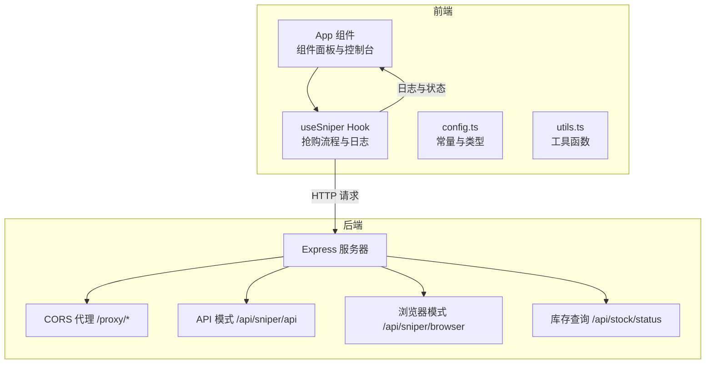
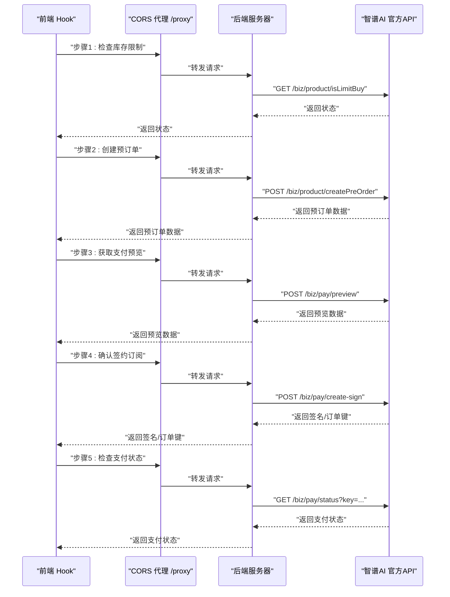
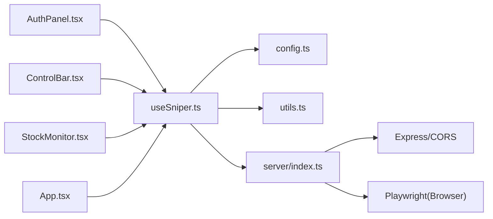

# API模式抢购

<cite>
**本文档引用的文件**
- [server/index.ts](file://server/index.ts)
- [src/hooks/useSniper.ts](file://src/hooks/useSniper.ts)
- [src/lib/config.ts](file://src/lib/config.ts)
- [src/lib/utils.ts](file://src/lib/utils.ts)
- [src/components/AuthPanel.tsx](file://src/components/AuthPanel.tsx)
- [src/components/ControlBar.tsx](file://src/components/ControlBar.tsx)
- [src/components/StockMonitor.tsx](file://src/components/StockMonitor.tsx)
- [src/App.tsx](file://src/App.tsx)
- [package.json](file://package.json)
</cite>

## 目录
1. [简介](#简介)
2. [项目结构](#项目结构)
3. [核心组件](#核心组件)
4. [架构总览](#架构总览)
5. [详细组件分析](#详细组件分析)
6. [依赖关系分析](#依赖关系分析)
7. [性能考量](#性能考量)
8. [故障排查指南](#故障排查指南)
9. [结论](#结论)
10. [附录](#附录)

## 简介
本项目提供两种抢购模式：浏览器自动化模式与API高速模式。API模式通过代理服务器直接调用智谱AI官方API，实现“检查库存限制→创建预订单→获取支付预览→确认签约订阅→检查支付状态”的完整流程。文档将详细说明每个步骤的HTTP请求参数、响应处理与错误处理机制，并解释Bearer Token认证的使用方法与安全注意事项，同时提供CORS代理的作用与实现原理、性能优化建议与最佳实践。

## 项目结构
前端采用React + TypeScript + Vite构建，后端使用Express提供代理与业务接口；核心逻辑集中在自定义Hook中，负责组织API调用序列、日志记录与倒计时控制。

图表来源
- [server/index.ts:10-40](file://server/index.ts#L10-L40)
- [server/index.ts:161-250](file://server/index.ts#L161-L250)
- [server/index.ts:42-159](file://server/index.ts#L42-L159)
- [server/index.ts:252-355](file://server/index.ts#L252-L355)
- [src/hooks/useSniper.ts:110-248](file://src/hooks/useSniper.ts#L110-L248)
- [src/lib/config.ts:83-101](file://src/lib/config.ts#L83-L101)

章节来源
- [package.json:14-13](file://package.json#L14-L13)
- [src/App.tsx:12-197](file://src/App.tsx#L12-L197)

## 核心组件
- 后端代理与业务接口
  - CORS代理：将前端请求转发至智谱AI域名，解决浏览器同源策略限制
  - API模式抢购：封装完整的五步流程，返回各步骤结果
  - 浏览器模式：基于Playwright自动化页面交互
  - 库存查询：解析运营配置，返回各套餐库存状态与下次补货时间
- 前端Hook与组件
  - useSniper：组织抢购流程、倒计时、日志、重试与验证码检测
  - 组件：认证面板、控制栏、库存监控等

章节来源
- [server/index.ts:10-40](file://server/index.ts#L10-L40)
- [server/index.ts:161-250](file://server/index.ts#L161-L250)
- [server/index.ts:42-159](file://server/index.ts#L42-L159)
- [server/index.ts:252-355](file://server/index.ts#L252-L355)
- [src/hooks/useSniper.ts:110-248](file://src/hooks/useSniper.ts#L110-L248)
- [src/components/AuthPanel.tsx:18-41](file://src/components/AuthPanel.tsx#L18-L41)

## 架构总览
API模式的核心流程由前端Hook驱动，通过CORS代理访问后端API，后端再向智谱AI官方API发起请求。整个流程具备完善的日志记录、错误检测与重试机制。

图表来源
- [src/hooks/useSniper.ts:127-241](file://src/hooks/useSniper.ts#L127-L241)
- [server/index.ts:172-235](file://server/index.ts#L172-L235)

## 详细组件分析

### 后端代理与API模式
- CORS代理
  - 路径：/proxy/*
  - 功能：将前端请求转发到智谱AI域名，保留Authorization与Cookie头部，统一设置Content-Type为application/json
  - 错误处理：捕获异常并返回500错误
- API模式抢购
  - 路径：/api/sniper/api
  - 步骤：
    1) 检查库存限制：GET /biz/product/isLimitBuy
    2) 创建预订单：POST /biz/product/createPreOrder（productId, paymentType）
    3) 支付预览：POST /biz/pay/preview（productId, paymentType）
    4) 确认签约订阅：POST /biz/pay/create-sign（productId, paymentType）
    5) 检查支付状态：GET /biz/pay/status?key=...
  - 返回：success与各步骤数据；若预订单创建失败，返回错误码与错误文本
- 浏览器模式
  - 路径：/api/sniper/browser
  - 功能：使用Playwright模拟登录、等待目标时间、点击订阅按钮、确认支付并检测结果
- 库存查询
  - 路径：/api/stock/status
  - 功能：查询运营配置，解析库存状态与下次补货时间

章节来源
- [server/index.ts:10-40](file://server/index.ts#L10-L40)
- [server/index.ts:161-250](file://server/index.ts#L161-L250)
- [server/index.ts:42-159](file://server/index.ts#L42-L159)
- [server/index.ts:252-355](file://server/index.ts#L252-L355)

### 前端Hook与流程控制
- useSniper
  - 模式选择：browser或api
  - 目标时间：支持提前2秒发起请求以补偿网络延迟
  - API模式流程：
    - 步骤1：检查库存限制（通过代理）
    - 步骤2：创建预订单（productId来自配置映射，默认季付）
    - 步骤3：支付预览
    - 步骤4：确认签约订阅（create-sign），提取key或payOrderNo
    - 步骤5：检查支付状态（status?key=...）
  - 错误处理：
    - 预订单创建失败且包含验证码关键词时，提示前往官网完成验证码
    - 多次重试（最多5次，间隔1秒）
    - 其他异常记录日志并设置错误状态
  - 日志系统：统一格式化输出，包含时间戳与级别
  - 库存监控：每5秒轮询库存，目标套餐有库存时自动触发抢购

章节来源
- [src/hooks/useSniper.ts:110-248](file://src/hooks/useSniper.ts#L110-L248)
- [src/hooks/useSniper.ts:318-372](file://src/hooks/useSniper.ts#L318-L372)
- [src/lib/utils.ts:20-27](file://src/lib/utils.ts#L20-L27)

### 认证与安全
- Bearer Token使用
  - 前端：Authorization: Bearer <token>
  - 后端：直接透传Authorization与Cookie到智谱AI
  - 认证验证：AuthPanel组件调用订阅列表接口验证Token有效性
- 安全建议
  - Token仅在本地存储，避免泄露
  - 仅通过代理访问官方API，避免在前端暴露真实URL
  - 定期更换Token，避免长期使用同一凭证

章节来源
- [src/hooks/useSniper.ts:121-124](file://src/hooks/useSniper.ts#L121-L124)
- [src/components/AuthPanel.tsx:23-38](file://src/components/AuthPanel.tsx#L23-38)
- [server/index.ts:19-27](file://server/index.ts#L19-L27)

### CORS代理的作用与实现原理
- 作用：绕过浏览器同源策略，允许前端直接调用智谱AI官方API
- 实现：后端接收前端请求，构造目标URL（open.bigmodel.cn），转发请求并回传响应
- 关键点：保留Authorization与Cookie，统一Content-Type为application/json

章节来源
- [server/index.ts:10-40](file://server/index.ts#L10-L40)

### 数据模型与配置
- 套餐配置与产品ID映射
  - PLANS：套餐名称、价格、productId
  - PRODUCT_IDS：按套餐类型与支付周期映射产品ID
  - getDefaultProductId：返回默认季付产品ID
- API端点
  - 基础路径：https://open.bigmodel.cn/api
  - 关键端点：isLimitBuy、createPreOrder、payPreview、createSign、payStatus、subscriptionList等

章节来源
- [src/lib/config.ts:28-49](file://src/lib/config.ts#L28-L49)
- [src/lib/config.ts:52-68](file://src/lib/config.ts#L52-L68)
- [src/lib/config.ts:70-73](file://src/lib/config.ts#L70-L73)
- [src/lib/config.ts:83-101](file://src/lib/config.ts#L83-L101)

## 依赖关系分析

图表来源
- [src/hooks/useSniper.ts:1-10](file://src/hooks/useSniper.ts#L1-L10)
- [src/App.tsx:1-11](file://src/App.tsx#L1-L11)
- [server/index.ts:1-9](file://server/index.ts#L1-L9)

章节来源
- [src/hooks/useSniper.ts:1-10](file://src/hooks/useSniper.ts#L1-L10)
- [src/App.tsx:1-11](file://src/App.tsx#L1-L11)
- [server/index.ts:1-9](file://server/index.ts#L1-L9)

## 性能考量
- 网络延迟补偿
  - 前端在目标时间前2秒发起请求，减少网络往返带来的误差
- 重试策略
  - 预订单创建失败时自动重试（最多5次，间隔1秒），降低瞬时失败概率
- 轮询优化
  - 库存监控每5秒一次，避免频繁请求导致风控
- 代理转发
  - 后端统一处理跨域与头部透传，减少前端复杂度与错误率

章节来源
- [src/hooks/useSniper.ts:271-283](file://src/hooks/useSniper.ts#L271-L283)
- [src/hooks/useSniper.ts:169-177](file://src/hooks/useSniper.ts#L169-L177)
- [src/hooks/useSniper.ts:364-371](file://src/hooks/useSniper.ts#L364-L371)

## 故障排查指南
- Token无效或过期
  - 现象：订阅列表接口返回错误码
  - 处理：重新获取Bearer Token并在认证面板验证
- 验证码拦截
  - 现象：预订单创建返回包含验证码关键词的错误
  - 处理：前往官网完成验证码后重试
- 网络异常
  - 现象：代理转发失败或响应超时
  - 处理：检查后端服务是否启动，确认代理路径正确
- 支付状态未更新
  - 现象：create-sign成功但status仍显示未支付
  - 处理：稍后手动检查智谱AI平台订阅状态

章节来源
- [src/components/AuthPanel.tsx:30-38](file://src/components/AuthPanel.tsx#L30-L38)
- [src/hooks/useSniper.ts:157-167](file://src/hooks/useSniper.ts#L157-L167)
- [src/hooks/useSniper.ts:243-247](file://src/hooks/useSniper.ts#L243-L247)

## 结论
API模式通过CORS代理与后端直连智谱AI官方API，实现了高效率、可重试、可观测的抢购流程。配合前端日志与库存监控，能够在目标时间前自动发起请求并处理常见异常。建议在生产环境中加强Token安全管理与网络稳定性保障，以提升成功率与用户体验。

## 附录

### API模式完整流程与参数说明
- 步骤1：检查库存限制
  - 方法：GET
  - 路径：/proxy/biz/product/isLimitBuy
  - 头部：Authorization: Bearer <token>, Content-Type: application/json
  - 响应：库存限制状态
- 步骤2：创建预订单
  - 方法：POST
  - 路径：/proxy/biz/product/createPreOrder
  - 参数：productId（默认季付）、paymentType（如alipay）
  - 响应：预订单数据
- 步骤3：支付预览
  - 方法：POST
  - 路径：/proxy/biz/pay/preview
  - 参数：productId、paymentType
  - 响应：支付预览数据
- 步骤4：确认签约订阅
  - 方法：POST
  - 路径：/proxy/biz/pay/create-sign
  - 参数：productId、paymentType
  - 响应：包含key或payOrderNo的数据
- 步骤5：检查支付状态
  - 方法：GET
  - 路径：/proxy/biz/pay/status?key=<key或payOrderNo>
  - 响应：支付状态（如SUCCESS）

章节来源
- [src/hooks/useSniper.ts:127-241](file://src/hooks/useSniper.ts#L127-L241)
- [server/index.ts:172-235](file://server/index.ts#L172-L235)