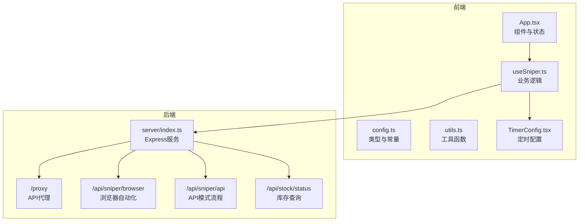
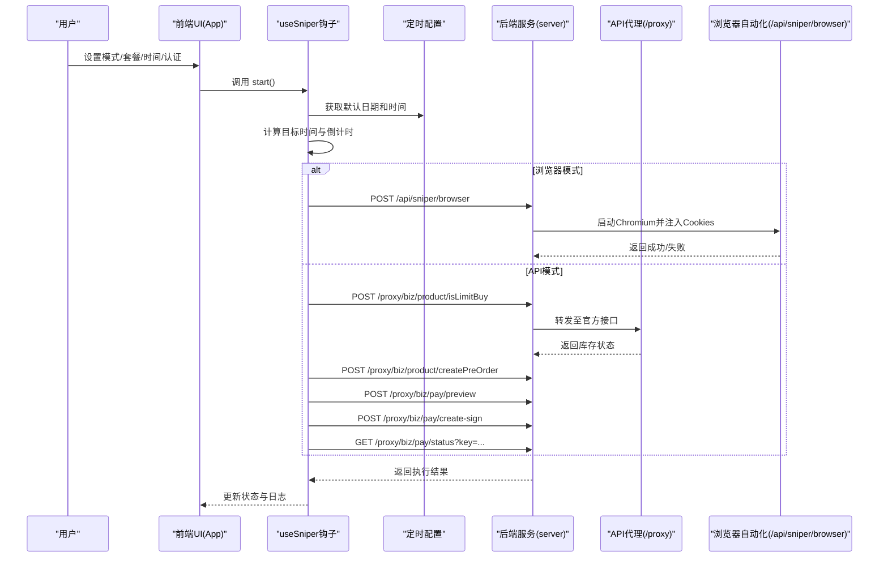
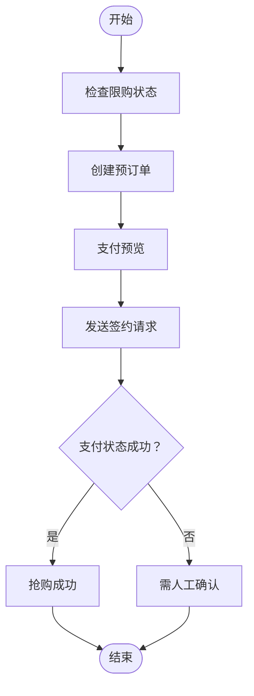
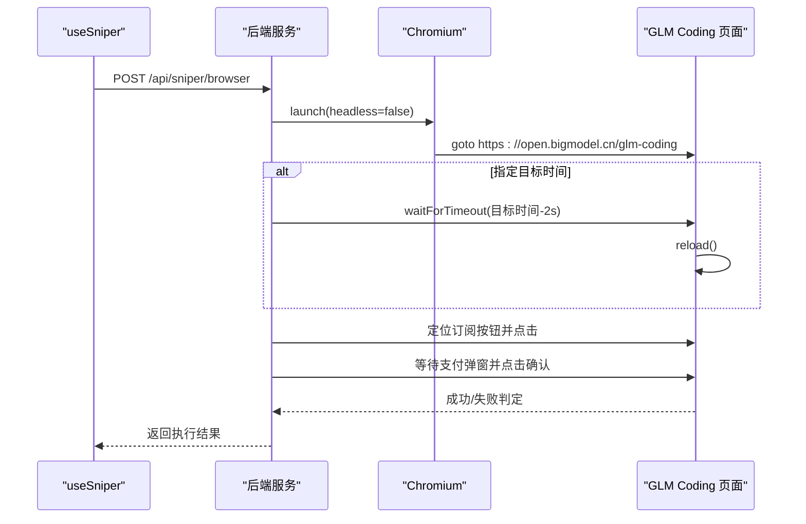
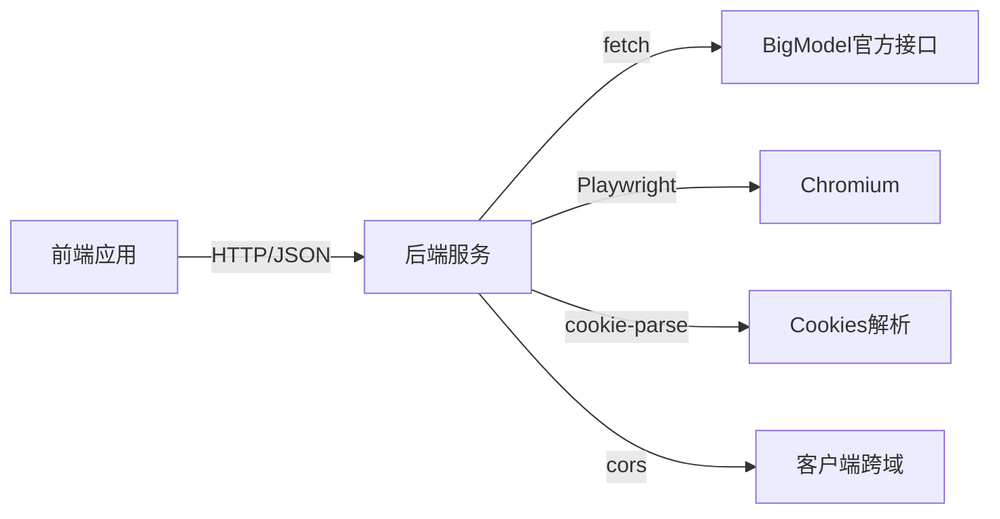

# 抢购模式

<cite>
**本文引用的文件**
- [README.md](file://README.md)
- [package.json](file://package.json)
- [server/index.ts](file://server/index.ts)
- [src/App.tsx](file://src/App.tsx)
- [src/hooks/useSniper.ts](file://src/hooks/useSniper.ts)
- [src/lib/config.ts](file://src/lib/config.ts)
- [src/lib/utils.ts](file://src/lib/utils.ts)
- [src/components/ModeSwitcher.tsx](file://src/components/ModeSwitcher.tsx)
- [src/components/AuthPanel.tsx](file://src/components/AuthPanel.tsx)
- [src/components/ControlBar.tsx](file://src/components/ControlBar.tsx)
- [src/components/StockMonitor.tsx](file://src/components/StockMonitor.tsx)
- [src/components/PlanSelector.tsx](file://src/components/PlanSelector.tsx)
- [src/components/TimerConfig.tsx](file://src/components/TimerConfig.tsx)
</cite>

## 更新摘要
**变更内容**
- 更新了默认日期行为的说明，反映用户现在会看到更符合预期的默认日期设置
- 新增了初始化体验改进的相关章节
- 更新了相关代码示例和配置说明

## 目录
1. [简介](#简介)
2. [项目结构](#项目结构)
3. [核心组件](#核心组件)
4. [架构总览](#架构总览)
5. [详细组件分析](#详细组件分析)
6. [依赖关系分析](#依赖关系分析)
7. [性能考量](#性能考量)
8. [故障排查指南](#故障排查指南)
9. [结论](#结论)
10. [附录](#附录)

## 简介
本项目是一个面向"GLM Coding Plan"限时抢购场景的双模式抢购工具，支持两种工作模式：
- API模式：通过后端代理直接调用官方接口，实现"高速直连"。
- 浏览器模式：基于Playwright驱动真实浏览器自动化，模拟用户操作完成抢购。

两种模式在认证机制、稳定性与性能方面各有侧重，用户可在界面中自由切换，并通过统一的状态管理与日志系统进行控制与观测。

**更新** 默认日期行为的改进使得用户在首次使用时能够获得更符合预期的初始化体验，系统会自动设置合理的默认日期和时间。

## 项目结构
前端采用React + TypeScript + Vite构建，后端使用Express提供API代理与浏览器自动化服务。核心交互如下：
- 前端负责配置与UI控制，调用后端提供的接口完成抢购与库存监控。
- 后端提供：
  - API代理：转发请求至官方域名，绕过CORS限制。
  - 浏览器自动化：启动Chromium实例，按计划点击订阅与支付确认。
  - 库存查询：抓取并解析运营配置，输出各套餐库存状态。
  - 健康检查：提供服务可用性检测。

**图表来源**
- [src/App.tsx:12-194](file://src/App.tsx#L12-L194)
- [src/hooks/useSniper.ts:46-406](file://src/hooks/useSniper.ts#L46-L406)
- [src/components/TimerConfig.tsx:1-99](file://src/components/TimerConfig.tsx#L1-L99)
- [server/index.ts:10-370](file://server/index.ts#L10-L370)

**章节来源**
- [README.md:1-74](file://README.md#L1-L74)
- [package.json:6-12](file://package.json#L6-L12)

## 核心组件
- 模式切换器：提供"浏览器自动化"和"API高速模式"的切换入口。
- 认证面板：输入与校验认证信息（API模式使用Token；浏览器模式使用Cookies）。
- 控制条：显示当前状态（待命/倒计时/抢购中/成功/出错），并提供启动/停止按钮。
- 库存监控：查询并展示各套餐库存状态，支持定时轮询与自动触发抢购。
- 抢购钩子：集中管理模式、套餐、目标时间、认证信息、日志与状态，封装两种模式的完整流程。
- **定时配置**：提供日期和时间选择器，默认日期设置为当天，时间默认为10:00。

**更新** 定时配置组件现在提供更合理的默认值，用户首次使用时无需手动设置日期和时间。

**章节来源**
- [src/components/ModeSwitcher.tsx:10-61](file://src/components/ModeSwitcher.tsx#L10-L61)
- [src/components/AuthPanel.tsx:14-119](file://src/components/AuthPanel.tsx#L14-L119)
- [src/components/ControlBar.tsx:11-75](file://src/components/ControlBar.tsx#L11-L75)
- [src/components/StockMonitor.tsx:27-139](file://src/components/StockMonitor.tsx#L27-L139)
- [src/components/TimerConfig.tsx:1-99](file://src/components/TimerConfig.tsx#L1-L99)
- [src/hooks/useSniper.ts:46-406](file://src/hooks/useSniper.ts#L46-L406)

## 架构总览
双模式抢购系统由"前端控制层 + 后端服务层"构成，核心交互序列如下：

**图表来源**
- [src/hooks/useSniper.ts:251-293](file://src/hooks/useSniper.ts#L251-L293)
- [src/hooks/useSniper.ts:76-106](file://src/hooks/useSniper.ts#L76-L106)
- [src/hooks/useSniper.ts:110-248](file://src/hooks/useSniper.ts#L110-L248)
- [src/components/TimerConfig.tsx:17-32](file://src/components/TimerConfig.tsx#L17-L32)
- [server/index.ts:42-159](file://server/index.ts#L42-L159)
- [server/index.ts:161-250](file://server/index.ts#L161-L250)

## 详细组件分析

### 模式切换与状态管理
- 模式选择：通过ModeSwitcher组件切换"browser"或"api"，影响后续认证与调用路径。
- 状态机：支持"idle/countdown/running/success/error"五态流转，用于UI反馈与控制。
- 认证要求：
  - API模式：需要有效的Bearer Token（通过后端代理转发）。
  - 浏览器模式：需要Cookies（用于登录态注入）。

**更新** 默认日期行为的改进使得用户在首次使用时能够立即开始抢购，无需手动设置日期和时间。

**章节来源**
- [src/components/ModeSwitcher.tsx:10-61](file://src/components/ModeSwitcher.tsx#L10-L61)
- [src/lib/config.ts:6-8](file://src/lib/config.ts#L6-L8)
- [src/App.tsx:14-16](file://src/App.tsx#L14-L16)

### API模式：直接API调用机制
- 认证机制：通过Authorization头携带Bearer Token，后端代理将该头转发至官方接口。
- 流程步骤：
  1) 检查是否限购
  2) 创建预订单
  3) 支付预览
  4) 发送签约请求
  5) 检查支付状态
- 错误处理：对验证码拦截等常见错误进行识别与提示；支持有限次数重试。
- 性能特点：无需浏览器渲染，请求链路短，适合高并发与低延迟场景。

**图表来源**
- [src/hooks/useSniper.ts:110-248](file://src/hooks/useSniper.ts#L110-L248)
- [server/index.ts:161-250](file://server/index.ts#L161-L250)

**章节来源**
- [src/hooks/useSniper.ts:110-248](file://src/hooks/useSniper.ts#L110-L248)
- [server/index.ts:161-250](file://server/index.ts#L161-L250)

### 浏览器模式：Playwright自动化流程
- 认证机制：通过Cookies注入浏览器上下文，保持登录态。
- 流程步骤：
  1) 启动Chromium（可配置headless）
  2) 注入Cookies并访问目标页面
  3) 等待至目标时间点（提前2秒刷新页面）
  4) 定位并点击订阅按钮（多选择器容错）
  5) 等待支付弹窗并点击确认
  6) 判断是否进入成功页
- 性能特点：更贴近真实用户行为，抗风控能力较强，但启动成本较高，易受页面结构变化影响。

**图表来源**
- [src/hooks/useSniper.ts:76-106](file://src/hooks/useSniper.ts#L76-L106)
- [server/index.ts:42-159](file://server/index.ts#L42-L159)

**章节来源**
- [src/hooks/useSniper.ts:76-106](file://src/hooks/useSniper.ts#L76-L106)
- [server/index.ts:42-159](file://server/index.ts#L42-L159)

### 默认日期行为改进
- **初始化体验**：用户首次打开应用时，系统会自动设置目标日期为当天，时间为10:00，提供更符合预期的初始配置。
- **日期范围限制**：系统限制可选日期范围为明天到30天后的日期，确保用户只能选择合理的未来时间。
- **时间默认值**：默认时间为上午10:00，这是常见的抢购开始时间，符合用户预期。
- **用户体验提升**：避免了用户需要手动设置日期和时间的繁琐过程，提高了应用的易用性。

**更新** 这个改进显著提升了新用户的初始体验，使他们能够立即开始使用抢购功能而无需进行复杂的配置。

**章节来源**
- [src/hooks/useSniper.ts:54-65](file://src/hooks/useSniper.ts#L54-L65)
- [src/components/TimerConfig.tsx:34-40](file://src/components/TimerConfig.tsx#L34-L40)
- [src/components/TimerConfig.tsx:48-75](file://src/components/TimerConfig.tsx#L48-L75)

### 认证机制差异与处理
- API模式：仅需Bearer Token，通过后端代理转发至官方接口，便于统一鉴权与日志记录。
- 浏览器模式：需Cookies，后端解析并注入到Chromium上下文，模拟真实登录态。
- 验证入口：前端提供"验证Token"按钮，调用后端订阅列表接口进行有效性校验。

**章节来源**
- [src/components/AuthPanel.tsx:18-41](file://src/components/AuthPanel.tsx#L18-L41)
- [server/index.ts:12-40](file://server/index.ts#L12-L40)

### 库存监控与自动触发
- 查询接口：后端提供库存查询，解析运营配置，输出各套餐库存状态与下次补货时间。
- 轮询策略：每5秒一次，支持启动/停止。
- 自动触发：当目标套餐有库存且处于监控状态时，自动切换为"抢购中"并执行API模式流程。

**章节来源**
- [src/components/StockMonitor.tsx:27-139](file://src/components/StockMonitor.tsx#L27-L139)
- [src/hooks/useSniper.ts:318-372](file://src/hooks/useSniper.ts#L318-L372)
- [server/index.ts:252-355](file://server/index.ts#L252-L355)

### 日志与状态可视化
- 日志系统：统一的日志条目结构，包含级别、时间戳与消息，前端实时展示。
- 状态指示：控制条根据状态显示不同颜色与文案，直观反映当前阶段。
- UI联动：根据模式与认证状态动态启用/禁用按钮，避免无效操作。

**章节来源**
- [src/lib/utils.ts:20-27](file://src/lib/utils.ts#L20-L27)
- [src/components/ControlBar.tsx:11-75](file://src/components/ControlBar.tsx#L11-L75)
- [src/App.tsx:14-182](file://src/App.tsx#L14-L182)

## 依赖关系分析
- 前端依赖：
  - React生态与UI库，TailwindCSS用于样式。
  - Playwright在后端使用，前端不直接依赖。
- 后端依赖：
  - Express提供Web服务与路由。
  - Playwright驱动Chromium，实现浏览器自动化。
  - cookie-parse用于解析Cookies。
  - cors允许跨域请求。
- 启动脚本：
  - 前端开发：npm run dev
  - 后端服务：npm run server
  - 同时启动：npm run start

**图表来源**
- [package.json:14-26](file://package.json#L14-L26)
- [server/index.ts:1-10](file://server/index.ts#L1-L10)

**章节来源**
- [package.json:14-26](file://package.json#L14-L26)
- [server/index.ts:1-10](file://server/index.ts#L1-L10)

## 性能考量
- API模式优势：
  - 请求链路短，响应快，适合高并发场景。
  - 无浏览器渲染开销，资源占用低。
- 浏览器模式优势：
  - 更接近真实用户行为，抗风控能力更强。
  - 对页面结构变化具备一定容错（多选择器策略）。
- 性能建议：
  - API模式：合理设置重试次数与间隔，避免频繁重试造成压力。
  - 浏览器模式：尽量减少不必要的等待与刷新，缩短自动化时长。
  - 统一使用后端代理，避免CORS导致的额外失败与重试。

**更新** 默认日期行为的改进虽然不会直接影响性能，但通过提供更合理的初始配置，可以减少用户配置时间，间接提升整体使用效率。

## 故障排查指南
- 启动后端服务失败：
  - 确认已安装依赖并正确运行后端服务脚本。
  - 检查端口占用与防火墙设置。
- API模式报错：
  - 检查Token有效性与权限范围。
  - 关注验证码拦截类错误提示，按提示完成人机验证后再试。
- 浏览器模式失败：
  - 确认Cookies格式正确且有效。
  - 观察页面结构变化，必要时调整选择器策略。
- 库存监控异常：
  - 检查后端健康状态与库存查询接口可用性。
  - 确保轮询间隔与监控状态一致。
- **默认日期问题**：
  - 如果日期显示异常，检查系统时间和时区设置。
  - 确认浏览器支持HTML5日期输入控件。

**更新** 新增了默认日期问题的排查指南，帮助用户解决可能遇到的日期相关问题。

**章节来源**
- [src/hooks/useSniper.ts:157-167](file://src/hooks/useSniper.ts#L157-L167)
- [src/components/AuthPanel.tsx:18-41](file://src/components/AuthPanel.tsx#L18-L41)
- [server/index.ts:357-360](file://server/index.ts#L357-L360)

## 结论
本项目通过"API模式 + 浏览器模式"的双轨设计，在性能与稳定性之间提供了灵活的选择。API模式适合追求极致速度与稳定性的场景；浏览器模式则在复杂风控环境下更具适应性。配合统一的日志与状态管理、库存监控与自动触发机制，以及改进的默认日期行为，用户可以在不同场景下高效完成抢购任务。

**更新** 最新的默认日期行为改进显著提升了用户体验，使新用户能够立即开始使用抢购功能，无需进行复杂的初始配置。

## 附录

### 模式切换与状态管理（代码级要点）
- 模式切换：通过ModeSwitcher更新useSniper中的mode状态，影响后续认证与调用路径。
- 状态机：start()根据目标时间计算倒计时，提前2秒触发以补偿网络延迟；stop()可中断计时器与监控。
- 认证校验：AuthPanel调用后端订阅列表接口验证Token有效性。

**章节来源**
- [src/components/ModeSwitcher.tsx:10-61](file://src/components/ModeSwitcher.tsx#L10-L61)
- [src/hooks/useSniper.ts:251-303](file://src/hooks/useSniper.ts#L251-L303)
- [src/components/AuthPanel.tsx:18-41](file://src/components/AuthPanel.tsx#L18-L41)

### API模式调用示例（路径参考）
- 步骤1：检查限购
  - [src/hooks/useSniper.ts:129](file://src/hooks/useSniper.ts#L129)
  - [server/index.ts:172-177](file://server/index.ts#L172-L177)
- 步骤2：创建预订单
  - [src/hooks/useSniper.ts:143-150](file://src/hooks/useSniper.ts#L143-L150)
  - [server/index.ts:190-194](file://server/index.ts#L190-L194)
- 步骤3：支付预览
  - [src/hooks/useSniper.ts:185-189](file://src/hooks/useSniper.ts#L185-L189)
  - [server/index.ts:211-215](file://server/index.ts#L211-L215)
- 步骤4：发送签约
  - [src/hooks/useSniper.ts:201-205](file://src/hooks/useSniper.ts#L201-L205)
  - [server/index.ts:220-224](file://server/index.ts#L220-L224)
- 步骤5：检查支付状态
  - [src/hooks/useSniper.ts:217-221](file://src/hooks/useSniper.ts#L217-L221)
  - [server/index.ts:233-235](file://server/index.ts#L233-L235)

### 浏览器模式调用示例（路径参考）
- 启动浏览器自动化
  - [src/hooks/useSniper.ts:82-90](file://src/hooks/useSniper.ts#L82-L90)
  - [server/index.ts:43-44](file://server/index.ts#L43-L44)
- 注入Cookies与导航
  - [server/index.ts:51-66](file://server/index.ts#L51-L66)
- 点击订阅与支付确认
  - [server/index.ts:84-139](file://server/index.ts#L84-L139)

### 参数配置要点
- 目标时间：由日期与时间组合，计算倒计时并提前2秒执行。
  - [src/lib/utils.ts:46-50](file://src/lib/utils.ts#L46-L50)
  - [src/hooks/useSniper.ts:263-273](file://src/hooks/useSniper.ts#L263-L273)
- 套餐映射：根据套餐类型与支付周期选择对应的产品ID。
  - [src/lib/config.ts:71-73](file://src/lib/config.ts#L71-L73)
  - [src/lib/config.ts:52-68](file://src/lib/config.ts#L52-L68)
- **默认日期设置**：初始化时自动设置为当天日期，时间为10:00，提供更符合预期的初始配置。
  - [src/hooks/useSniper.ts:54-65](file://src/hooks/useSniper.ts#L54-L65)
  - [src/components/TimerConfig.tsx:34-40](file://src/components/TimerConfig.tsx#L34-L40)