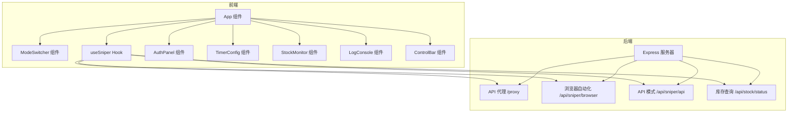
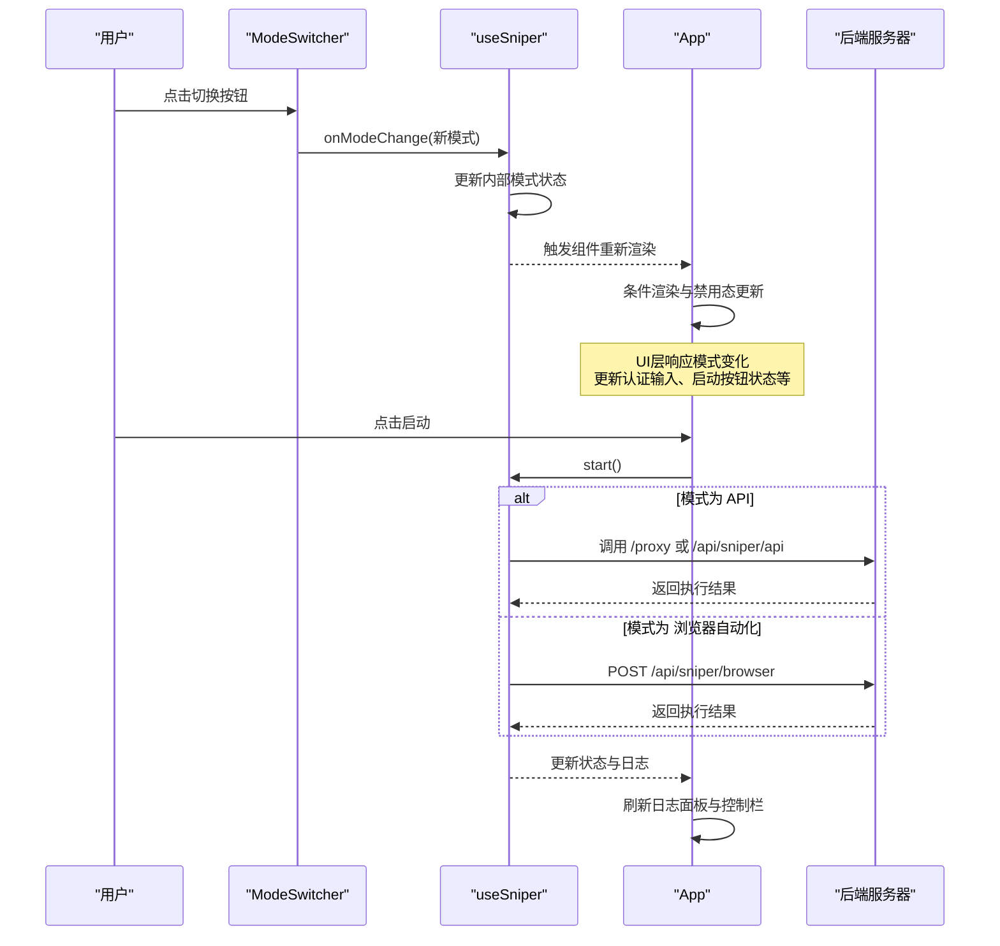
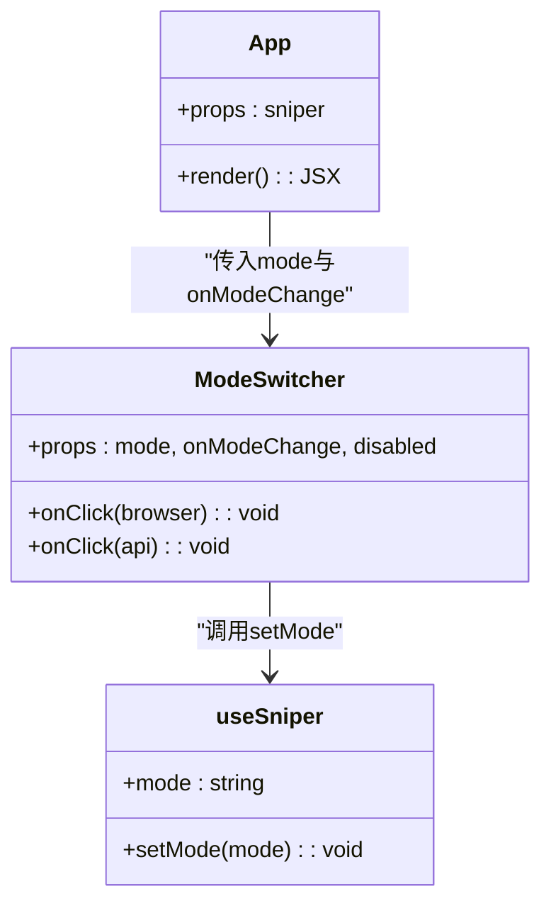
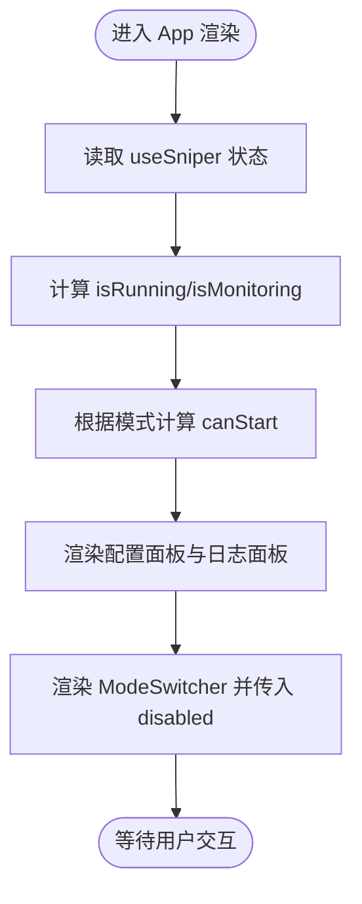
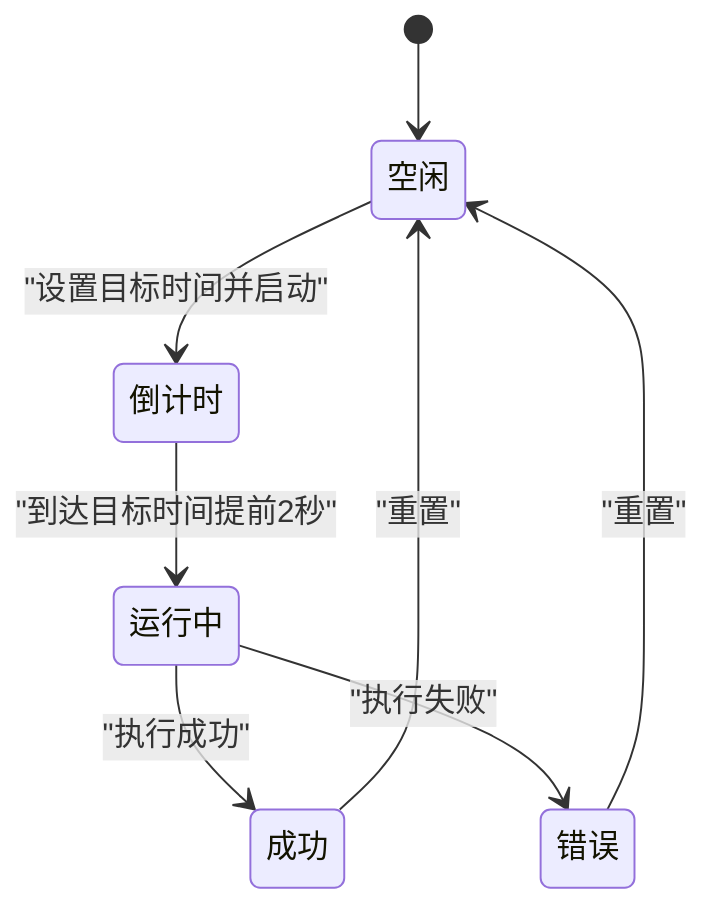
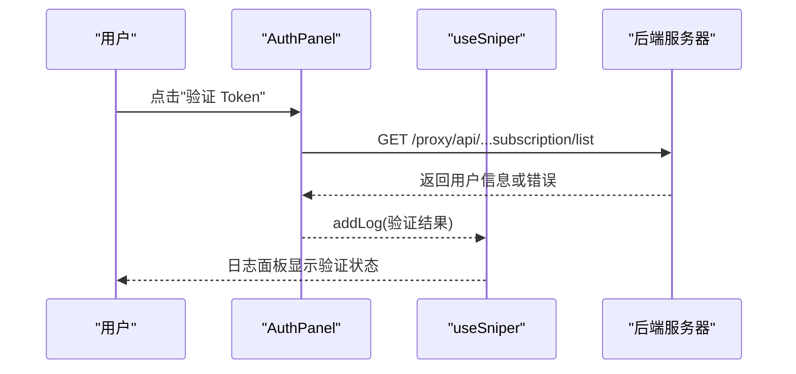
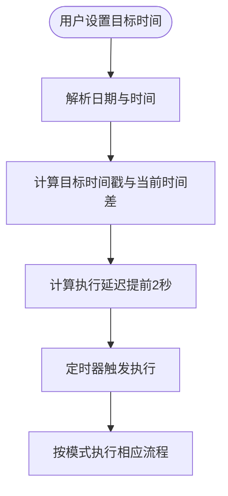
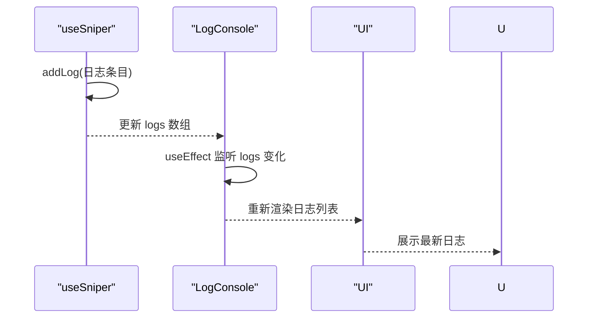
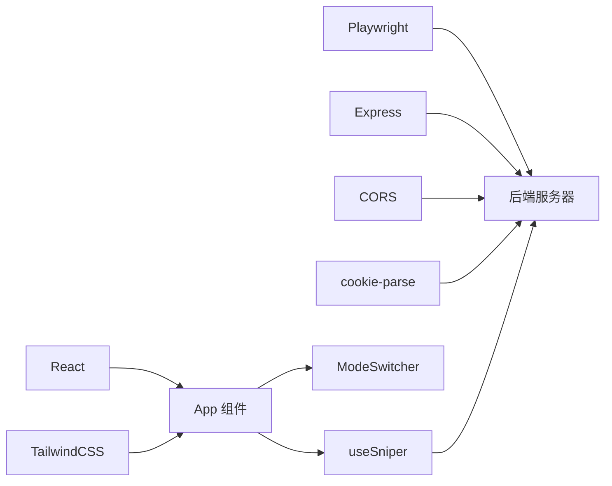

# 模式切换机制

<cite>
**本文档引用的文件**
- [src/components/ModeSwitcher.tsx](file://src/components/ModeSwitcher.tsx)
- [src/App.tsx](file://src/App.tsx)
- [src/hooks/useSniper.ts](file://src/hooks/useSniper.ts)
- [src/lib/config.ts](file://src/lib/config.ts)
- [src/lib/utils.ts](file://src/lib/utils.ts)
- [src/components/AuthPanel.tsx](file://src/components/AuthPanel.tsx)
- [src/components/ControlBar.tsx](file://src/components/ControlBar.tsx)
- [src/components/LogConsole.tsx](file://src/components/LogConsole.tsx)
- [src/components/StockMonitor.tsx](file://src/components/StockMonitor.tsx)
- [src/components/TimerConfig.tsx](file://src/components/TimerConfig.tsx)
- [src/components/PlanSelector.tsx](file://src/components/PlanSelector.tsx)
- [src/components/QuickGuide.tsx](file://src/components/QuickGuide.tsx)
- [server/index.ts](file://server/index.ts)
- [package.json](file://package.json)
</cite>

## 目录
1. [简介](#简介)
2. [项目结构](#项目结构)
3. [核心组件](#核心组件)
4. [架构总览](#架构总览)
5. [详细组件分析](#详细组件分析)
6. [依赖关系分析](#依赖关系分析)
7. [性能考虑](#性能考虑)
8. [故障排除指南](#故障排除指南)
9. [结论](#结论)
10. [附录](#附录)

## 简介
本文件系统性阐述“模式切换机制”的实现与影响，涵盖在“API模式”与“浏览器模式”之间的切换流程、状态管理、配置传递、UI更新机制，以及对认证信息、目标时间同步、日志系统等其他组件的影响。同时给出模式切换的时机选择建议、最佳实践与常见问题解决方案，并通过图示展示状态更新与组件重新渲染过程。

## 项目结构
该应用采用React + TypeScript + Vite构建，前端通过自定义Hook集中管理状态，后端以Express提供API代理与浏览器自动化服务。模式切换的核心在于前端状态驱动，后端提供两种执行路径（API直连或浏览器自动化），并通过统一的日志系统输出执行过程。

**图表来源**
- [src/App.tsx:12-197](file://src/App.tsx#L12-L197)
- [src/components/ModeSwitcher.tsx:10-61](file://src/components/ModeSwitcher.tsx#L10-L61)
- [src/hooks/useSniper.ts:46-406](file://src/hooks/useSniper.ts#L46-L406)
- [server/index.ts:10-370](file://server/index.ts#L10-L370)

**章节来源**
- [src/App.tsx:12-197](file://src/App.tsx#L12-L197)
- [src/components/ModeSwitcher.tsx:10-61](file://src/components/ModeSwitcher.tsx#L10-L61)
- [src/hooks/useSniper.ts:46-406](file://src/hooks/useSniper.ts#L46-L406)
- [server/index.ts:10-370](file://server/index.ts#L10-L370)

## 核心组件
- ModeSwitcher：提供“浏览器自动化”和“API高速模式”的切换入口，接收当前模式与变更回调，禁用状态下阻止切换。
- useSniper：集中管理模式、套餐、目标时间、认证信息、日志、库存状态与监控状态；提供启动/停止、库存检查、日志增删等方法。
- App：组装各子组件，将useSniper的状态与回调注入到各个面板，负责UI层的条件渲染与禁用态控制。
- 后端服务：提供API代理、浏览器自动化、库存查询等接口，支撑两种模式的执行。

**章节来源**
- [src/components/ModeSwitcher.tsx:10-61](file://src/components/ModeSwitcher.tsx#L10-L61)
- [src/hooks/useSniper.ts:46-406](file://src/hooks/useSniper.ts#L46-L406)
- [src/App.tsx:12-197](file://src/App.tsx#L12-L197)
- [server/index.ts:10-370](file://server/index.ts#L10-L370)

## 架构总览
模式切换的控制流由前端状态驱动，后端提供两种执行路径。UI层通过ModeSwitcher触发状态变更，useSniper根据新模式选择不同的执行策略，并通过统一的日志系统输出执行过程。

**图表来源**
- [src/components/ModeSwitcher.tsx:17-57](file://src/components/ModeSwitcher.tsx#L17-L57)
- [src/hooks/useSniper.ts:250-293](file://src/hooks/useSniper.ts#L250-L293)
- [server/index.ts:42-159](file://server/index.ts#L42-L159)
- [server/index.ts:161-250](file://server/index.ts#L161-L250)

## 详细组件分析

### ModeSwitcher 组件
- 功能：提供两个模式按钮，高亮当前模式，支持禁用态；点击回调通知父组件更新模式。
- 关键点：
  - 接收当前模式与变更回调，禁用时样式与交互均被禁用。
  - 通过类名动态切换高亮态，区分浏览器自动化与API模式。
  - 作为UI入口，直接影响App层的可用性与提示文案。

**图表来源**
- [src/components/ModeSwitcher.tsx:10-61](file://src/components/ModeSwitcher.tsx#L10-L61)
- [src/App.tsx:80-84](file://src/App.tsx#L80-L84)
- [src/hooks/useSniper.ts:386-388](file://src/hooks/useSniper.ts#L386-L388)

**章节来源**
- [src/components/ModeSwitcher.tsx:10-61](file://src/components/ModeSwitcher.tsx#L10-L61)
- [src/App.tsx:80-84](file://src/App.tsx#L80-L84)
- [src/hooks/useSniper.ts:386-388](file://src/hooks/useSniper.ts#L386-L388)

### App 组件中的模式集成
- 将ModeSwitcher与useSniper绑定，禁用态基于运行状态与监控状态计算。
- 根据模式动态显示认证输入（API模式需要Token，浏览器模式需要Cookies）。
- 控制栏按钮的可用性与文案随模式变化而变化。

**图表来源**
- [src/App.tsx:12-197](file://src/App.tsx#L12-L197)
- [src/hooks/useSniper.ts:19-44](file://src/hooks/useSniper.ts#L19-L44)

**章节来源**
- [src/App.tsx:12-197](file://src/App.tsx#L12-L197)
- [src/hooks/useSniper.ts:19-44](file://src/hooks/useSniper.ts#L19-L44)

### useSniper 中的模式状态管理
- 内部状态：mode、plan、targetDate、targetTime、authToken、cookies、status、logs、stockStatus、isMonitoring。
- 模式切换影响：
  - 启动时根据mode选择执行路径（浏览器自动化或API直连）。
  - API模式需校验authToken，否则禁止启动。
  - 浏览器模式需cookies，且通过后端Playwright执行。
- 日志统一：通过addLog统一写入，LogConsole自动滚动至最新日志。

**图表来源**
- [src/hooks/useSniper.ts:250-293](file://src/hooks/useSniper.ts#L250-L293)
- [src/hooks/useSniper.ts:76-106](file://src/hooks/useSniper.ts#L76-L106)
- [src/hooks/useSniper.ts:110-248](file://src/hooks/useSniper.ts#L110-L248)

**章节来源**
- [src/hooks/useSniper.ts:46-406](file://src/hooks/useSniper.ts#L46-L406)

### 认证信息处理差异
- API模式：需要有效的Bearer Token，用于后端代理转发到官方接口。
- 浏览器模式：需要Cookies，后端使用Playwright注入Cookies并模拟登录状态。
- 认证验证：AuthPanel提供验证按钮，调用后端订阅列表接口验证Token有效性。

**图表来源**
- [src/components/AuthPanel.tsx:18-41](file://src/components/AuthPanel.tsx#L18-L41)
- [server/index.ts:12-40](file://server/index.ts#L12-L40)

**章节来源**
- [src/components/AuthPanel.tsx:18-41](file://src/components/AuthPanel.tsx#L18-L41)
- [src/hooks/useSniper.ts:115-119](file://src/hooks/useSniper.ts#L115-L119)

### 目标时间同步
- TimerConfig实时计算距离目标时间的倒计时，支持日期与时间选择。
- useSniper在启动时将目标时间转换为具体Date对象，计算延迟并提前2秒执行，补偿网络延迟。

**图表来源**
- [src/components/TimerConfig.tsx:17-32](file://src/components/TimerConfig.tsx#L17-L32)
- [src/lib/utils.ts:46-50](file://src/lib/utils.ts#L46-L50)
- [src/hooks/useSniper.ts:263-292](file://src/hooks/useSniper.ts#L263-L292)

**章节来源**
- [src/components/TimerConfig.tsx:17-32](file://src/components/TimerConfig.tsx#L17-L32)
- [src/lib/utils.ts:46-50](file://src/lib/utils.ts#L46-L50)
- [src/hooks/useSniper.ts:263-292](file://src/hooks/useSniper.ts#L263-L292)

### 日志系统的统一管理
- LogConsole自动滚动到最新日志，按级别着色显示。
- useSniper通过createLog生成带唯一ID与时间戳的日志条目，统一写入logs数组。

**图表来源**
- [src/lib/utils.ts:20-27](file://src/lib/utils.ts#L20-L27)
- [src/components/LogConsole.tsx:20-24](file://src/components/LogConsole.tsx#L20-L24)

**章节来源**
- [src/lib/utils.ts:20-27](file://src/lib/utils.ts#L20-L27)
- [src/components/LogConsole.tsx:20-24](file://src/components/LogConsole.tsx#L20-L24)

### 模式切换对其他组件的影响
- 认证面板：API模式显示Token输入，浏览器模式显示Cookies输入。
- 控制栏：根据模式与canStart动态启用/禁用启动按钮。
- 快速指南：根据模式显示不同的操作步骤。
- 库存监控：仅在API模式下有效，浏览器模式不适用。

**章节来源**
- [src/App.tsx:116-126](file://src/App.tsx#L116-L126)
- [src/App.tsx:170-183](file://src/App.tsx#L170-L183)
- [src/components/QuickGuide.tsx:22-39](file://src/components/QuickGuide.tsx#L22-L39)
- [src/components/StockMonitor.tsx:87-132](file://src/components/StockMonitor.tsx#L87-L132)

## 依赖关系分析
- 前端依赖：React、TailwindCSS、Playwright（用于浏览器自动化）、Express（后端服务）。
- 前端模块间耦合：ModeSwitcher与App通过props耦合，App与useSniper通过Hook耦合；useSniper与后端通过HTTP通信。
- 后端依赖：CORS、Express、Playwright、cookie-parse。

**图表来源**
- [package.json:14-26](file://package.json#L14-L26)
- [server/index.ts:1-8](file://server/index.ts#L1-L8)

**章节来源**
- [package.json:14-26](file://package.json#L14-L26)
- [server/index.ts:1-8](file://server/index.ts#L1-L8)

## 性能考虑
- 模式切换本身为UI层轻量操作，主要性能开销来自后端执行路径：
  - API模式：网络请求次数较多，建议在目标时间前5分钟内保持Token有效，减少重试。
  - 浏览器模式：Playwright启动与页面加载耗时较长，建议保持浏览器窗口可见以便处理验证码。
- 日志渲染：大量日志可能导致UI卡顿，可通过分页或限制日志数量优化。
- 倒计时补偿：提前2秒执行可降低网络抖动影响，但需确保目标时间设置合理。

[本节为通用指导，无需特定文件引用]

## 故障排除指南
- 启动按钮不可用：
  - API模式：检查Token是否填写；若无效，使用AuthPanel验证。
  - 浏览器模式：检查Cookies是否正确复制。
- 执行失败：
  - API模式：关注验证码拦截提示，建议在官网完成验证后再试。
  - 浏览器模式：注意弹窗暂停，手动完成拼图验证。
- 后端服务未启动：
  - 确保后端服务监听端口正常，查看健康检查接口。
- 库存监控无效：
  - 仅在API模式下生效，浏览器模式不支持。

**章节来源**
- [src/App.tsx:178-182](file://src/App.tsx#L178-L182)
- [src/components/AuthPanel.tsx:30-40](file://src/components/AuthPanel.tsx#L30-L40)
- [src/hooks/useSniper.ts:157-167](file://src/hooks/useSniper.ts#L157-L167)
- [server/index.ts:357-360](file://server/index.ts#L357-L360)

## 结论
模式切换机制通过前端状态与后端双通道协同实现：UI层负责直观切换，状态层统一调度执行路径，日志系统贯穿始终。API模式适合追求稳定与可控的场景，浏览器模式适合绕过复杂认证的快速执行。合理选择模式并结合网络与设备能力，可显著提升成功率。

[本节为总结性内容，无需特定文件引用]

## 附录

### 模式切换时机选择建议
- 网络环境：API模式在网络波动较大时更易受验证码与限流影响，建议在信号稳定时段使用。
- 设备能力：浏览器模式需要稳定的桌面环境与可见窗口，移动端不建议使用。
- 成功率：若验证码频繁出现，优先尝试API模式并在官网完成验证后重试。

[本节为通用指导，无需特定文件引用]

### 最佳实践
- 在目标时间前5分钟启动，确保Token/Cookies有效。
- 使用库存监控（API模式）在补货窗口期自动触发。
- 启动前先验证认证信息，避免无效重试。
- 启动后保持日志面板开启，便于定位问题。

[本节为通用指导，无需特定文件引用]