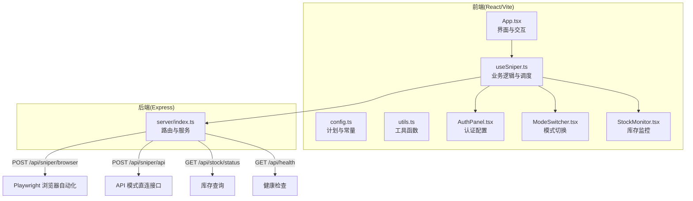
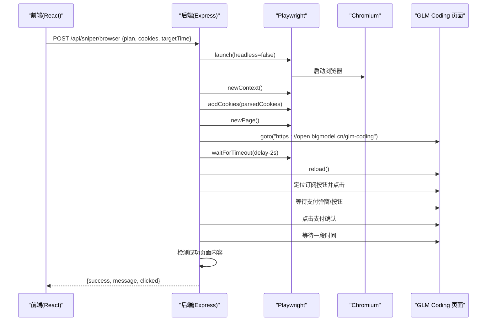
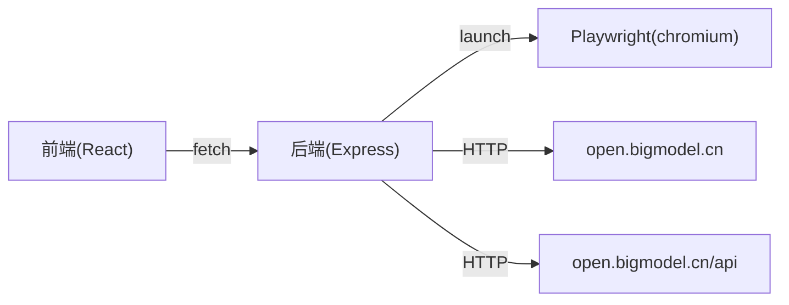

# 浏览器模式抢购

<cite>
**本文引用的文件列表**
- [server/index.ts](file://server/index.ts)
- [src/hooks/useSniper.ts](file://src/hooks/useSniper.ts)
- [src/lib/config.ts](file://src/lib/config.ts)
- [src/lib/utils.ts](file://src/lib/utils.ts)
- [src/components/AuthPanel.tsx](file://src/components/AuthPanel.tsx)
- [src/components/ModeSwitcher.tsx](file://src/components/ModeSwitcher.tsx)
- [src/components/StockMonitor.tsx](file://src/components/StockMonitor.tsx)
- [src/App.tsx](file://src/App.tsx)
- [package.json](file://package.json)
</cite>

## 目录
1. [简介](#简介)
2. [项目结构](#项目结构)
3. [核心组件](#核心组件)
4. [架构总览](#架构总览)
5. [详细组件分析](#详细组件分析)
6. [依赖关系分析](#依赖关系分析)
7. [性能考量](#性能考量)
8. [故障排除指南](#故障排除指南)
9. [结论](#结论)
10. [附录](#附录)

## 简介
本文件面向“浏览器模式抢购”的完整技术文档，聚焦于通过 Playwright 自动化驱动真实浏览器，模拟用户登录、页面导航、元素交互、表单填写与按钮点击等操作，从而在目标时刻自动完成订阅流程。文档同时对比“API 模式”与“浏览器模式”的差异与优劣，并提供调试与排障建议。

## 项目结构
该项目采用前端 React/Vite + 后端 Express 的双端架构：
- 前端负责用户界面、参数配置、日志展示与触发后端自动化或 API 调用。
- 后端提供代理服务、浏览器自动化抢购、API 模式抢购、库存状态查询等能力。

图表来源
- [src/App.tsx:12-197](file://src/App.tsx#L12-L197)
- [src/hooks/useSniper.ts:46-407](file://src/hooks/useSniper.ts#L46-L407)
- [server/index.ts:1-370](file://server/index.ts#L1-L370)

章节来源
- [src/App.tsx:12-197](file://src/App.tsx#L12-L197)
- [src/hooks/useSniper.ts:46-407](file://src/hooks/useSniper.ts#L46-L407)
- [server/index.ts:1-370](file://server/index.ts#L1-L370)

## 核心组件
- 浏览器自动化后端服务：接收前端请求，启动 Chromium，注入 Cookie，导航至目标页面，在指定时间点自动点击订阅与支付确认按钮，检测成功页面并返回结果。
- 前端钩子 useSniper：封装抢购主流程，支持两种模式（浏览器/ API），统一日志记录、倒计时与重试策略，以及库存监控联动。
- 配置与工具：定义套餐、产品 ID、API 端点、日期时间计算与日志格式化等。
- 认证面板：提供 Auth Token 与 Cookies 的输入与校验入口；浏览器模式需提供 Cookies，API 模式需提供 Auth Token。
- 模式切换器：在浏览器自动化与 API 高速模式间切换。
- 库存监控：定时轮询库存状态，命中目标套餐有库存时自动触发 API 模式抢购。

章节来源
- [server/index.ts:42-159](file://server/index.ts#L42-L159)
- [src/hooks/useSniper.ts:46-407](file://src/hooks/useSniper.ts#L46-L407)
- [src/lib/config.ts:10-104](file://src/lib/config.ts#L10-L104)
- [src/lib/utils.ts:14-51](file://src/lib/utils.ts#L14-L51)
- [src/components/AuthPanel.tsx:14-119](file://src/components/AuthPanel.tsx#L14-L119)
- [src/components/ModeSwitcher.tsx:32-61](file://src/components/ModeSwitcher.tsx#L32-L61)
- [src/components/StockMonitor.tsx:54-101](file://src/components/StockMonitor.tsx#L54-L101)

## 架构总览
浏览器模式的完整工作流如下：
- 前端收集目标套餐、目标时间、Cookies 等参数。
- 前端在目标时间点前 2 秒触发后端 /api/sniper/browser 接口。
- 后端启动 Chromium，设置上下文 Cookie，打开 GLM Coding 页面，等待至目标时间并刷新，定位订阅按钮并点击，再尝试点击支付确认，等待一段时间后检测是否进入成功页面，最终返回结果。

图表来源
- [server/index.ts:42-159](file://server/index.ts#L42-L159)
- [src/hooks/useSniper.ts:76-106](file://src/hooks/useSniper.ts#L76-L106)

## 详细组件分析

### 浏览器自动化后端服务
- 启动与上下文
  - 使用 Chromium 启动浏览器，设置为非无头模式以便观察。
  - 新建浏览器上下文，注入 Cookies，域名为 .bigmodel.cn，路径为 /。
- 导航与等待
  - 打开 GLM Coding 页面，等待 networkidle。
  - 若设置了目标时间，则提前 2 秒唤醒并刷新页面以获取最新状态。
- 元素交互与点击
  - 多选择器策略定位“特惠订阅”按钮，按索引选择目标套餐。
  - 若未找到，回退到“订阅”按钮集合，按顺序点击。
  - 等待 3 秒后尝试点击“确认/支付/立即”等支付确认按钮。
- 结果判定
  - 等待 5 秒后读取页面内容，若包含“成功/订阅”字样则视为成功。
  - 返回 success、message、clicked 等字段。

章节来源
- [server/index.ts:42-159](file://server/index.ts#L42-L159)

### 前端 useSniper 钩子
- 模式与参数
  - mode: 'browser' | 'api'
  - plan: 'lite' | 'pro' | 'max'
  - targetDate/targetTime: 目标抢购时间
  - authToken: API 模式所需认证
  - cookies: 浏览器模式所需 Cookie 字符串
- 浏览器模式执行流程
  - 组装请求体（plan、cookies、targetTime），向后端 /api/sniper/browser 发起 POST。
  - 根据响应 success 决定状态为 success 或 error，并写入日志。
- API 模式执行流程
  - 依次调用 isLimitBuy、createPreOrder、payPreview、createSign、payStatus 等接口。
  - 对验证码拦截等错误进行识别与提示。
- 倒计时与提前执行
  - 计算目标时间与当前时间差，提前 2 秒触发执行，补偿网络延迟。
- 日志与状态
  - 统一的日志结构，包含级别、时间戳与消息。
  - 状态机：idle/countdown/running/success/error。

章节来源
- [src/hooks/useSniper.ts:46-407](file://src/hooks/useSniper.ts#L46-L407)
- [src/lib/config.ts:10-104](file://src/lib/config.ts#L10-L104)
- [src/lib/utils.ts:14-51](file://src/lib/utils.ts#L14-L51)

### 认证面板与模式切换
- 认证面板
  - 提供 Auth Token 输入与验证按钮，验证请求转发至后端代理接口。
  - 提供 Cookies 文本域，浏览器模式下用于注入登录态。
- 模式切换器
  - 展示“浏览器自动化”与“API 高速模式”，并标注简要说明。

章节来源
- [src/components/AuthPanel.tsx:14-119](file://src/components/AuthPanel.tsx#L14-L119)
- [src/components/ModeSwitcher.tsx:32-61](file://src/components/ModeSwitcher.tsx#L32-L61)

### 库存监控
- 定时轮询 /api/stock/status，解析返回的库存状态与下次补货时间。
- 当目标套餐有库存时，若处于监控状态且具备 API 模式所需凭据，自动停止监控并触发 API 模式抢购。

章节来源
- [src/hooks/useSniper.ts:305-372](file://src/hooks/useSniper.ts#L305-L372)
- [src/components/StockMonitor.tsx:54-101](file://src/components/StockMonitor.tsx#L54-L101)

### 前端应用入口
- 整合所有组件：模式切换、套餐选择、定时器、库存监控、认证面板、日志控制台与快速指南。
- 控制条启用条件：浏览器模式需 cookies，API 模式需 authToken。

章节来源
- [src/App.tsx:12-197](file://src/App.tsx#L12-L197)

## 依赖关系分析
- 前端依赖
  - React、React Router、TailwindCSS、Lucide Icons 等。
  - Playwright 仅在后端使用，前端不直接依赖。
- 后端依赖
  - Express、CORS、cookie-parse、Playwright(chromium)。
- 关键外部服务
  - open.bigmodel.cn：GLM Coding 页面与相关 API。

图表来源
- [package.json:14-26](file://package.json#L14-L26)
- [server/index.ts:1-40](file://server/index.ts#L1-L40)

章节来源
- [package.json:14-26](file://package.json#L14-L26)
- [server/index.ts:1-40](file://server/index.ts#L1-L40)

## 性能考量
- 浏览器模式
  - 非无头模式会占用更多系统资源，建议在稳定环境运行。
  - 等待策略与超时设置影响成功率与耗时，可根据页面加载情况调整。
- API 模式
  - 直连接口，速度更快，但易受验证码与风控影响。
- 通用优化
  - 前端倒计时提前 2 秒触发，减少网络抖动带来的偏差。
  - 后端多选择器点击策略提升鲁棒性。

[本节为通用指导，无需特定文件引用]

## 故障排除指南
- 后端服务未启动
  - 现象：前端报连接失败。
  - 处理：确保后端服务已启动（npm run server），监听端口 3100。
- 浏览器模式失败
  - 现象：页面未正确登录或按钮不可见。
  - 处理：确认 cookies 正确粘贴，域名为 .bigmodel.cn，路径为 /；必要时手动登录后重试。
- API 模式验证码拦截
  - 现象：createPreOrder 返回验证码相关错误。
  - 处理：前往官网手动完成验证码，再重试；前端会自动识别并提示。
- 时间偏差
  - 现象：抢购未在目标时间点发生。
  - 处理：前端已提前 2 秒触发，若仍偏差较大，检查本地时钟与网络延迟。
- 库存状态异常
  - 现象：库存查询失败或解析异常。
  - 处理：检查后端 /api/stock/status 是否可达，关注返回结构变化。

章节来源
- [src/hooks/useSniper.ts:110-248](file://src/hooks/useSniper.ts#L110-L248)
- [src/hooks/useSniper.ts:318-352](file://src/hooks/useSniper.ts#L318-L352)
- [server/index.ts:42-159](file://server/index.ts#L42-L159)

## 结论
浏览器模式通过 Playwright 驱动真实浏览器，能够较好地绕过部分验证码与风控策略，适合复杂页面场景；API 模式则更高效，但对验证码与风控更敏感。结合前端倒计时与后端多选择器点击策略，可在目标时刻自动完成订阅流程。建议在稳定环境下优先使用浏览器模式，遇到验证码或风控时再切换 API 模式并配合手动验证。

[本节为总结，无需特定文件引用]

## 附录

### 浏览器模式核心实现与配置要点
- 后端启动 Chromium 并设置上下文 Cookie
  - 参考路径：[server/index.ts:48-61](file://server/index.ts#L48-L61)
- 导航与等待
  - 参考路径：[server/index.ts:66-78](file://server/index.ts#L66-L78)
- 订阅按钮定位与点击
  - 参考路径：[server/index.ts:81-115](file://server/index.ts#L81-L115)
- 支付确认按钮定位与点击
  - 参考路径：[server/index.ts:120-139](file://server/index.ts#L120-L139)
- 成功页面检测
  - 参考路径：[server/index.ts:144-154](file://server/index.ts#L144-L154)

### API 模式与浏览器模式对比
- API 模式
  - 优点：速度快、稳定性高。
  - 缺点：易受验证码与风控影响。
  - 适用：页面结构稳定、验证码较少的场景。
- 浏览器模式
  - 优点：可处理复杂页面与验证码，更贴近真实用户行为。
  - 缺点：资源占用较高，调试成本略高。
  - 适用：验证码频繁、页面交互复杂的场景。

[本节为概念性对比，无需特定文件引用]

### 与 API 模式的区别与各自优缺点
- 区别
  - API 模式：直接调用 open.bigmodel.cn/api 的接口，完成预订单、支付预览、签约与状态查询。
  - 浏览器模式：通过 Playwright 控制真实浏览器，模拟用户操作完成订阅与支付。
- 优缺点
  - API 模式：快、稳；易被验证码/风控拦截。
  - 浏览器模式：更灵活、抗风控；资源消耗更大。

章节来源
- [server/index.ts:161-250](file://server/index.ts#L161-L250)
- [server/index.ts:42-159](file://server/index.ts#L42-L159)