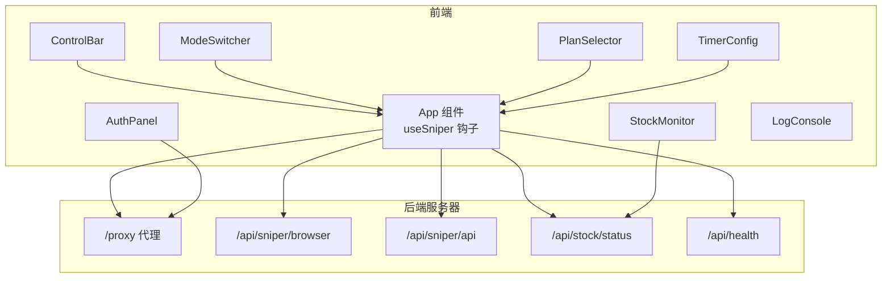
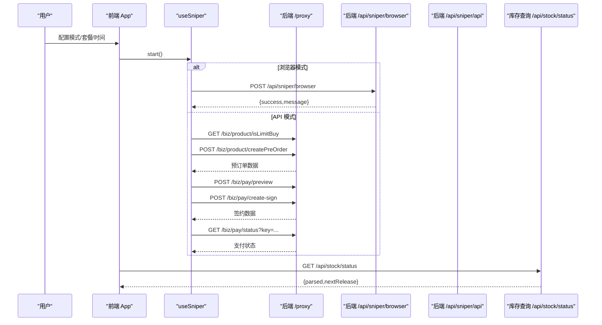
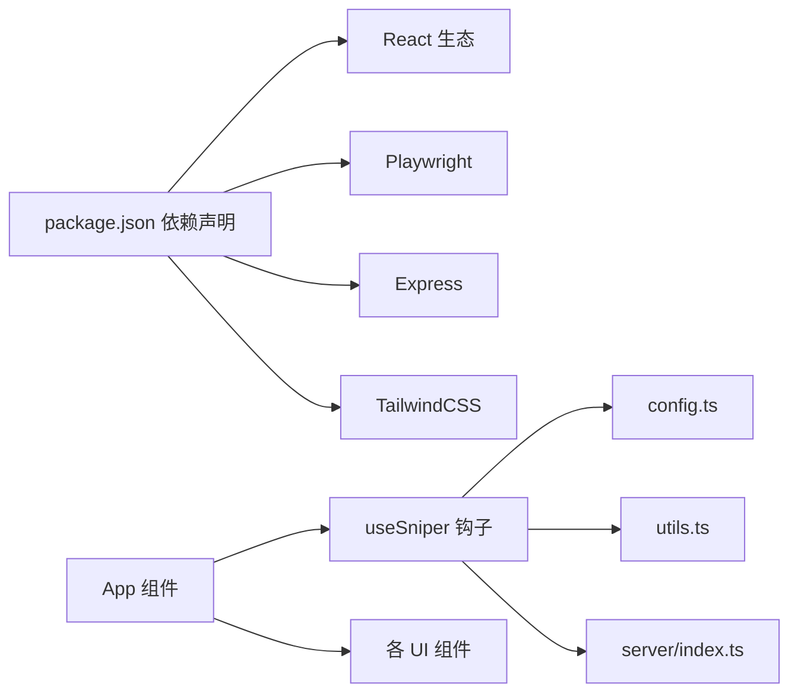

# 故障排除

<cite>
**本文引用的文件**
- [README.md](file://README.md)
- [package.json](file://package.json)
- [src/App.tsx](file://src/App.tsx)
- [src/hooks/useSniper.ts](file://src/hooks/useSniper.ts)
- [src/lib/config.ts](file://src/lib/config.ts)
- [src/lib/utils.ts](file://src/lib/utils.ts)
- [src/components/AuthPanel.tsx](file://src/components/AuthPanel.tsx)
- [src/components/StockMonitor.tsx](file://src/components/StockMonitor.tsx)
- [src/components/LogConsole.tsx](file://src/components/LogConsole.tsx)
- [src/components/ControlBar.tsx](file://src/components/ControlBar.tsx)
- [src/components/ModeSwitcher.tsx](file://src/components/ModeSwitcher.tsx)
- [src/components/PlanSelector.tsx](file://src/components/PlanSelector.tsx)
- [src/components/TimerConfig.tsx](file://src/components/TimerConfig.tsx)
- [src/components/QuickGuide.tsx](file://src/components/QuickGuide.tsx)
- [server/index.ts](file://server/index.ts)
</cite>

## 目录
1. [简介](#简介)
2. [项目结构](#项目结构)
3. [核心组件](#核心组件)
4. [架构总览](#架构总览)
5. [详细组件分析与排障](#详细组件分析与排障)
6. [依赖关系分析](#依赖关系分析)
7. [性能考虑与优化建议](#性能考虑与优化建议)
8. [故障排除指南](#故障排除指南)
9. [结论](#结论)
10. [附录](#附录)

## 简介
本指南面向使用 GLM Sniper 的用户，系统化梳理常见问题与解决方案，覆盖认证失败、网络连接问题、浏览器自动化错误、库存监控异常、性能问题排查与优化、日志分析方法、关键指标监控以及社区支持与应急处理。文档基于仓库中的前端应用与后端代理/自动化服务的实际实现进行分析，并提供可操作的诊断流程与调试步骤。

## 项目结构
GLM Sniper 由前端 React 应用与 Node/Express 后端组成：
- 前端通过 useSniper 钩子协调“浏览器自动化”和“API 高速”两种模式，负责定时、日志、库存监控与用户交互。
- 后端提供：
  - CORS 代理：转发智谱开放平台 API 请求，携带 Authorization/Cookie。
  - 浏览器自动化抢购：基于 Playwright 控制 Chromium，模拟点击订阅与支付确认。
  - 库存状态查询：抓取运营配置并解析库存状态。
  - 健康检查：/api/health。

图表来源
- [src/App.tsx:12-194](file://src/App.tsx#L12-L194)
- [src/hooks/useSniper.ts:250-293](file://src/hooks/useSniper.ts#L250-L293)
- [server/index.ts:10-40](file://server/index.ts#L10-L40)
- [server/index.ts:42-159](file://server/index.ts#L42-L159)
- [server/index.ts:161-250](file://server/index.ts#L161-L250)
- [server/index.ts:252-355](file://server/index.ts#L252-L355)
- [server/index.ts:357-370](file://server/index.ts#L357-L370)

章节来源
- [src/App.tsx:12-194](file://src/App.tsx#L12-L194)
- [server/index.ts:10-40](file://server/index.ts#L10-L40)
- [server/index.ts:42-159](file://server/index.ts#L42-L159)
- [server/index.ts:161-250](file://server/index.ts#L161-L250)
- [server/index.ts:252-355](file://server/index.ts#L252-L355)
- [server/index.ts:357-370](file://server/index.ts#L357-L370)

## 核心组件
- useSniper 钩子：统一管理模式、套餐、目标时间、认证信息、状态、日志、库存监控与启动/停止逻辑；封装浏览器模式与 API 模式的执行流程。
- 配置与常量：模式、套餐、API 端点、产品 ID 映射、库存检查键等。
- 日志系统：统一的日志条目格式与时间戳，前端自动滚动至最新日志。
- 后端代理与自动化：CORS 代理、浏览器自动化、API 模式、库存查询、健康检查。

章节来源
- [src/hooks/useSniper.ts:46-406](file://src/hooks/useSniper.ts#L46-L406)
- [src/lib/config.ts:18-104](file://src/lib/config.ts#L18-L104)
- [src/lib/utils.ts:20-50](file://src/lib/utils.ts#L20-L50)
- [server/index.ts:10-40](file://server/index.ts#L10-L40)
- [server/index.ts:42-159](file://server/index.ts#L42-L159)
- [server/index.ts:161-250](file://server/index.ts#L161-L250)
- [server/index.ts:252-355](file://server/index.ts#L252-L355)

## 架构总览
下图展示前端与后端的关键交互路径，包括认证、库存查询、浏览器自动化与 API 模式下单流程。

图表来源
- [src/hooks/useSniper.ts:76-106](file://src/hooks/useSniper.ts#L76-L106)
- [src/hooks/useSniper.ts:110-248](file://src/hooks/useSniper.ts#L110-L248)
- [src/hooks/useSniper.ts:318-352](file://src/hooks/useSniper.ts#L318-L352)
- [server/index.ts:10-40](file://server/index.ts#L10-L40)
- [server/index.ts:42-159](file://server/index.ts#L42-L159)
- [server/index.ts:161-250](file://server/index.ts#L161-L250)
- [server/index.ts:252-355](file://server/index.ts#L252-L355)

## 详细组件分析与排障

### 认证失败（API 模式）
- 现象
  - 日志出现“认证失效”或“缺少认证 Token”提示。
  - 验证接口返回非 2xx。
- 可能原因
  - Token 为空或格式不正确。
  - 后端代理未转发 Authorization 头。
  - 账户权限不足或令牌过期。
- 排查步骤
  - 在认证面板点击“验证 Token”，查看日志输出。
  - 确认 Authorization 头是否随请求转发至后端代理。
  - 在浏览器 DevTools 中复制正确的 Bearer Token。
- 相关实现
  - 认证验证调用后端代理订阅列表接口。
  - useSniper 在 API 模式下对预订单创建失败时检测验证码关键词并给出提示。

章节来源
- [src/components/AuthPanel.tsx:18-41](file://src/components/AuthPanel.tsx#L18-L41)
- [src/hooks/useSniper.ts:115-119](file://src/hooks/useSniper.ts#L115-L119)
- [src/hooks/useSniper.ts:157-167](file://src/hooks/useSniper.ts#L157-L167)
- [server/index.ts:10-40](file://server/index.ts#L10-L40)

### 网络连接问题
- 现象
  - “连接后端失败”、“无法验证认证（可能需要配置代理）”等提示。
  - HTTP 错误码、超时或响应体为空。
- 可能原因
  - 后端服务未启动或端口被占用。
  - CORS 代理未正确转发 Cookie 或 Authorization。
  - 目标域名不可达或防火墙阻断。
- 排查步骤
  - 启动后端服务并确认端口 3100 正常监听。
  - 使用 curl 验证 /api/health 是否返回正常。
  - 检查 /proxy 路由是否转发 Authorization 与 Cookie。
- 相关实现
  - 前端在浏览器模式下调用后端 /api/sniper/browser。
  - API 模式通过 /proxy 转发智谱开放平台 API。

章节来源
- [src/hooks/useSniper.ts:101-105](file://src/hooks/useSniper.ts#L101-L105)
- [src/components/AuthPanel.tsx:36-40](file://src/components/AuthPanel.tsx#L36-L40)
- [server/index.ts:357-370](file://server/index.ts#L357-L370)
- [server/index.ts:10-40](file://server/index.ts#L10-L40)

### 浏览器自动化错误
- 现象
  - 浏览器启动失败、页面元素未找到、验证码弹窗导致暂停。
  - 返回消息提示“支付可能需要人工完成”。
- 可能原因
  - Playwright 未安装或 Chromium 不可用。
  - 页面结构变化导致选择器失效。
  - 验证码拦截导致流程中断。
- 排查步骤
  - 确认后端已安装 playwright 与 chromium。
  - 手动在浏览器中登录 open.bigmodel.cn 并完成验证码。
  - 检查 Cookies 是否正确注入。
  - 观察日志中选择器匹配与点击尝试记录。
- 相关实现
  - 后端启动 Chromium，注入 Cookies，导航到页面并等待目标时间后点击订阅按钮。
  - 对多个选择器进行回退尝试，最终等待支付确认并检测成功页内容。

章节来源
- [server/index.ts:3-4](file://server/index.ts#L3-L4)
- [server/index.ts:42-159](file://server/index.ts#L42-L159)
- [src/QuickGuide.tsx:43-51](file://src/QuickGuide.tsx#L43-L51)

### 库存监控异常
- 现象
  - 库存查询失败、返回非 2xx、解析不到库存字段。
  - 监控显示“检查中”或“无库存”，但实际已补货。
- 可能原因
  - 运营查询接口返回格式变化或内容为字符串而非对象。
  - 10:00 前后的时间窗口逻辑影响显示。
- 排查步骤
  - 直接访问 /api/stock/status 查看原始与解析后的数据。
  - 关注 nextRelease 字段与各套餐的 available/message。
  - 在补货窗口内观察“检查中”的提示是否合理。
- 相关实现
  - 后端解析返回内容，优先尝试 JSON.parse，若失败则使用默认“已售罄”。
  - 在特定时间段内动态调整提示语句。

章节来源
- [server/index.ts:252-355](file://server/index.ts#L252-L355)
- [src/hooks/useSniper.ts:318-352](file://src/hooks/useSniper.ts#L318-L352)

### API 模式下单流程与验证码拦截
- 现象
  - 预订单创建失败且响应体包含验证码关键词。
  - 支付状态检查失败或需人工确认。
- 可能原因
  - 网站启用验证码防护，需要人工完成验证。
- 排查步骤
  - 预订单创建失败时，前端会检测验证码相关关键词并提示前往官网完成验证。
  - 建议在官网完成验证后立即重试。
- 相关实现
  - 预订单创建失败时检测包含“验证码/验证/verify/security/Tencent/403”等关键词。
  - 前端记录警告日志并引导用户重试。

章节来源
- [src/hooks/useSniper.ts:157-167](file://src/hooks/useSniper.ts#L157-L167)
- [src/QuickGuide.tsx:43-48](file://src/QuickGuide.tsx#L43-L48)

## 依赖关系分析
- 前端依赖
  - React、React Router、TailwindCSS、Playwright（用于浏览器模式）、Express/CORS（后端服务）。
- 关键依赖
  - useSniper 依赖配置与工具函数，调用后端代理与自动化接口。
  - 组件间通过 props 传递状态与回调，形成清晰的单向数据流。

图表来源
- [package.json:14-26](file://package.json#L14-L26)
- [src/hooks/useSniper.ts:8-9](file://src/hooks/useSniper.ts#L8-L9)
- [src/lib/config.ts:1-4](file://src/lib/config.ts#L1-L4)
- [src/lib/utils.ts:1-3](file://src/lib/utils.ts#L1-L3)
- [server/index.ts:1-8](file://server/index.ts#L1-L8)

章节来源
- [package.json:14-26](file://package.json#L14-L26)
- [src/hooks/useSniper.ts:8-9](file://src/hooks/useSniper.ts#L8-L9)
- [src/lib/config.ts:1-4](file://src/lib/config.ts#L1-L4)
- [src/lib/utils.ts:1-3](file://src/lib/utils.ts#L1-L3)
- [server/index.ts:1-8](file://server/index.ts#L1-L8)

## 性能考虑与优化建议
- 网络与延迟补偿
  - 前端在目标时间前 2 秒提前发起请求以补偿网络延迟。
- 轮询策略
  - 库存监控默认 5 秒轮询一次，可根据需求调整频率。
- 日志渲染
  - 日志容器自动滚动至最新条目，避免大量日志导致的渲染压力。
- 浏览器模式
  - 使用 headless:false 便于调试，生产环境可考虑 headless:true 降低资源消耗。
- 代理与并发
  - /proxy 仅转发单个请求，避免高并发场景下的队列堆积；如需高并发可在后端增加队列与限流。

章节来源
- [src/hooks/useSniper.ts:271-273](file://src/hooks/useSniper.ts#L271-L273)
- [src/hooks/useSniper.ts:364-371](file://src/hooks/useSniper.ts#L364-L371)
- [src/components/LogConsole.tsx:20-24](file://src/components/LogConsole.tsx#L20-L24)
- [server/index.ts:48](file://server/index.ts#L48)

## 故障排除指南

### 一、认证失败
- 症状
  - “认证失效 - HTTP ...”或“缺少认证 Token”。
- 快速检查
  - 在认证面板点击“验证 Token”，确认返回 2xx。
  - 检查 Authorization 头是否随 /proxy 请求转发。
- 常见原因
  - Token 为空或格式错误。
  - 未启动后端服务或代理未生效。
- 处理建议
  - 重新复制 Bearer Token 并粘贴到输入框。
  - 确保后端服务已启动且端口 3100 可访问。

章节来源
- [src/components/AuthPanel.tsx:18-41](file://src/components/AuthPanel.tsx#L18-L41)
- [server/index.ts:10-40](file://server/index.ts#L10-L40)

### 二、网络连接问题
- 症状
  - “连接后端失败”、“无法验证认证（可能需要配置代理）”。
- 快速检查
  - curl http://localhost:3100/api/health，确认返回正常。
  - 检查 /proxy 是否转发 Authorization 与 Cookie。
- 常见原因
  - 后端未启动、端口冲突、CORS 限制。
- 处理建议
  - 启动后端服务：npm run server。
  - 确认防火墙放行 3100 端口。

章节来源
- [src/hooks/useSniper.ts:101-105](file://src/hooks/useSniper.ts#L101-L105)
- [src/components/AuthPanel.tsx:36-40](file://src/components/AuthPanel.tsx#L36-L40)
- [server/index.ts:357-370](file://server/index.ts#L357-L370)

### 三、浏览器自动化错误
- 症状
  - 页面元素未找到、验证码弹窗、返回“支付可能需要人工完成”。
- 快速检查
  - 确认后端已安装 playwright 与 chromium。
  - 手动登录 open.bigmodel.cn 并完成验证码。
- 常见原因
  - 页面结构变化、Cookies 注入失败、验证码拦截。
- 处理建议
  - 在浏览器中登录并复制 Cookies 至输入框。
  - 保持浏览器窗口可见以便处理验证码。

章节来源
- [server/index.ts:3-4](file://server/index.ts#L3-L4)
- [server/index.ts:42-159](file://server/index.ts#L42-L159)
- [src/QuickGuide.tsx:43-51](file://src/QuickGuide.tsx#L43-L51)

### 四、库存监控异常
- 症状
  - 库存查询失败、解析不到库存字段、显示“检查中”。
- 快速检查
  - 直接访问 http://localhost:3100/api/stock/status，核对 parsed 字段。
- 常见原因
  - 接口返回格式变化、特定时间段逻辑影响。
- 处理建议
  - 在补货窗口内耐心等待，观察 nextRelease 提示。
  - 若长期无更新，检查网络与后端日志。

章节来源
- [server/index.ts:252-355](file://server/index.ts#L252-L355)
- [src/hooks/useSniper.ts:318-352](file://src/hooks/useSniper.ts#L318-L352)

### 五、API 模式下单失败（验证码拦截）
- 症状
  - 预订单创建失败且响应体包含验证码关键词。
- 快速检查
  - 前端日志提示“检测到验证码拦截！”。
- 常见原因
  - 网站启用验证码防护。
- 处理建议
  - 前往官网完成验证码后重试。
  - 建议提前 5 分钟启动，保持浏览器可见。

章节来源
- [src/hooks/useSniper.ts:157-167](file://src/hooks/useSniper.ts#L157-L167)
- [src/QuickGuide.tsx:43-48](file://src/QuickGuide.tsx#L43-L48)

### 六、日志分析与关键指标监控
- 日志分析
  - 使用“实时日志”面板查看 INFO/SUCCESS/WARNING/ERROR 级别日志。
  - 关注“验证 Token”“库存检查”“预订单创建”“支付状态”等关键步骤。
- 关键指标
  - 认证成功率、库存查询成功率、下单成功率、验证码拦截次数。
  - 建议在后端日志中记录每次请求的响应码与耗时。

章节来源
- [src/components/LogConsole.tsx:10-77](file://src/components/LogConsole.tsx#L10-L77)
- [src/hooks/useSniper.ts:250-293](file://src/hooks/useSniper.ts#L250-L293)

### 七、性能问题排查与优化
- 网络延迟补偿
  - 目标时间前 2 秒提前执行，减少网络抖动影响。
- 轮询频率
  - 库存监控默认 5 秒一次，可根据实际情况调整。
- 日志渲染
  - 自动滚动至最新日志，避免长列表渲染压力。
- 浏览器模式
  - 生产环境可改为 headless:true 降低资源消耗。

章节来源
- [src/hooks/useSniper.ts:271-273](file://src/hooks/useSniper.ts#L271-L273)
- [src/hooks/useSniper.ts:364-371](file://src/hooks/useSniper.ts#L364-L371)
- [src/components/LogConsole.tsx:20-24](file://src/components/LogConsole.tsx#L20-L24)
- [server/index.ts:48](file://server/index.ts#L48)

### 八、社区支持与问题反馈
- 建议渠道
  - 在项目根目录 README.md 中提及的官方链接与社区入口进行咨询。
  - 提交问题时附带：
    - 操作系统与浏览器版本
    - 前端与后端日志片段
    - 目标套餐与时间
    - 是否使用浏览器/API 模式
- 注意事项
  - 遵守服务条款，避免频繁请求导致风控。

章节来源
- [README.md:60-74](file://README.md#L60-L74)

### 九、应急处理方案
- 立即停止
  - 使用“停止”按钮终止当前任务，清空日志并重置状态。
- 切换模式
  - 若 API 模式频繁触发验证码，切换为浏览器模式并手动处理验证码。
- 重试机制
  - 预订单创建失败时，前端会自动最多重试 5 次，间隔 1 秒。
- 后端重启
  - 若后端异常，停止并重启服务：npm run server。

章节来源
- [src/components/ControlBar.tsx:44-53](file://src/components/ControlBar.tsx#L44-L53)
- [src/hooks/useSniper.ts:169-174](file://src/hooks/useSniper.ts#L169-L174)
- [server/index.ts:357-370](file://server/index.ts#L357-L370)

## 结论
本指南基于前端 useSniper 钩子与后端代理/自动化服务的实际实现，提供了系统化的故障排除流程与优化建议。建议在日常使用中结合日志与健康检查接口进行监控，并在遇到验证码拦截等风控场景时采用“手动验证+快速重试”的策略，以提升成功率与稳定性。

## 附录

### A. 常用命令与端点
- 启动后端服务：npm run server
- 健康检查：GET http://localhost:3100/api/health
- 库存查询：GET http://localhost:3100/api/stock/status
- 浏览器模式：POST http://localhost:3100/api/sniper/browser
- API 模式：POST http://localhost:3100/api/sniper/api
- CORS 代理：/proxy 下转发智谱开放平台 API

章节来源
- [package.json:11-12](file://package.json#L11-L12)
- [server/index.ts:357-370](file://server/index.ts#L357-L370)