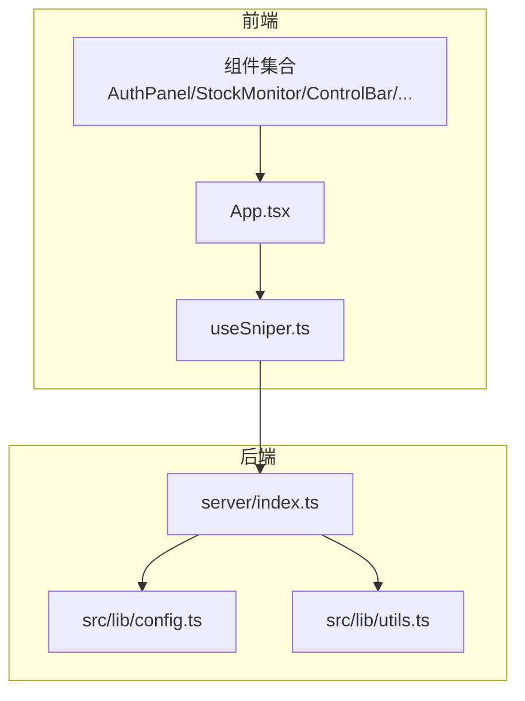
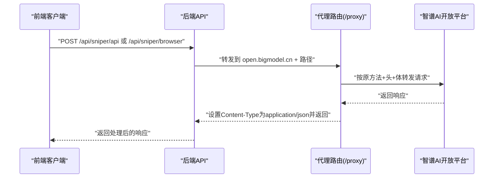
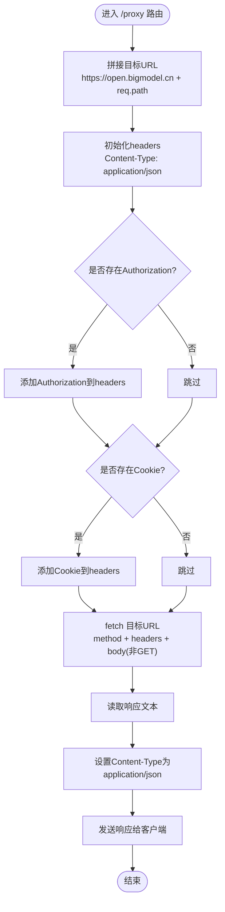
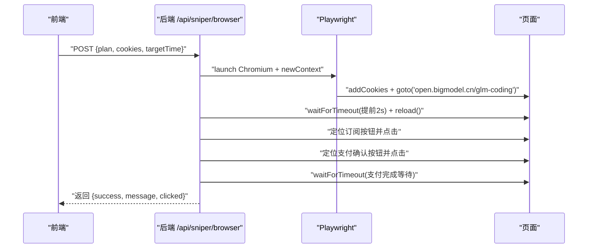
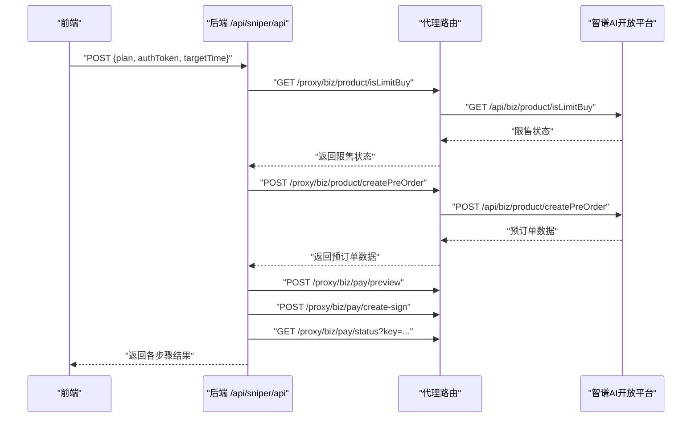
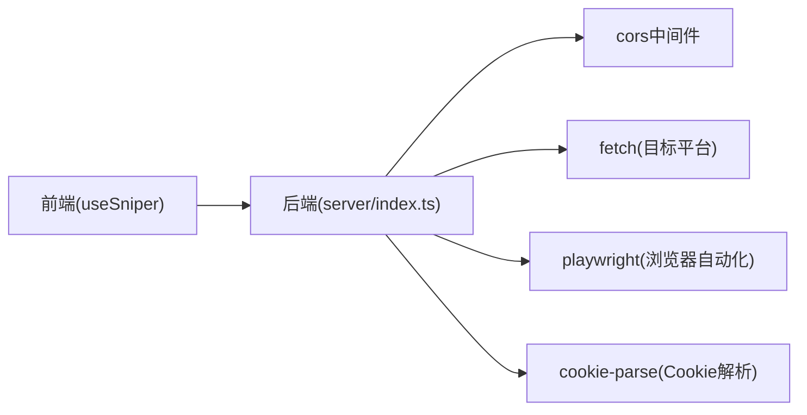

# API代理服务

<cite>
**本文档引用的文件**
- [server/index.ts](file://server/index.ts)
- [package.json](file://package.json)
- [src/lib/config.ts](file://src/lib/config.ts)
- [src/lib/utils.ts](file://src/lib/utils.ts)
- [src/hooks/useSniper.ts](file://src/hooks/useSniper.ts)
- [src/App.tsx](file://src/App.tsx)
- [src/components/AuthPanel.tsx](file://src/components/AuthPanel.tsx)
- [src/components/StockMonitor.tsx](file://src/components/StockMonitor.tsx)
- [src/components/ControlBar.tsx](file://src/components/ControlBar.tsx)
- [src/components/ModeSwitcher.tsx](file://src/components/ModeSwitcher.tsx)
- [src/components/PlanSelector.tsx](file://src/components/PlanSelector.tsx)
- [src/components/TimerConfig.tsx](file://src/components/TimerConfig.tsx)
</cite>

## 目录
1. [简介](#简介)
2. [项目结构](#项目结构)
3. [核心组件](#核心组件)
4. [架构总览](#架构总览)
5. [详细组件分析](#详细组件分析)
6. [依赖关系分析](#依赖关系分析)
7. [性能考虑](#性能考虑)
8. [故障排查指南](#故障排查指南)
9. [结论](#结论)
10. [附录](#附录)

## 简介
本项目是一个基于React + TypeScript + Vite的前端应用，配合Node.js + Express的后端服务，提供GLM Coding Plan的“抢购”辅助工具。后端服务的核心功能之一是通过代理路由绕过浏览器CORS限制，将前端请求转发至智谱AI开放平台（open.bigmodel.cn），并支持请求头转发、Cookie处理以及响应处理。同时，后端还提供浏览器自动化模式和API模式两种“抢购”策略，并内置库存监控与日志记录能力。

## 项目结构
项目采用前后端分离的组织方式：
- 前端位于src目录，包含组件、Hooks、样式与入口文件
- 后端位于server目录，Express服务器提供代理与业务接口
- 根目录包含构建脚本、依赖声明与配置文件

图表来源
- [server/index.ts:1-370](file://server/index.ts#L1-L370)
- [src/App.tsx:1-197](file://src/App.tsx#L1-L197)
- [src/hooks/useSniper.ts:1-407](file://src/hooks/useSniper.ts#L1-L407)

章节来源
- [server/index.ts:1-370](file://server/index.ts#L1-L370)
- [package.json:1-48](file://package.json#L1-L48)

## 核心组件
- 代理路由（/proxy）：用于转发请求到智谱AI开放平台，实现CORS绕过
- 浏览器自动化模式（/api/sniper/browser）：使用Playwright模拟用户操作
- API模式（/api/sniper/api）：直接调用智谱AI开放平台API
- 库存状态查询（/api/stock/status）：查询并解析库存状态
- 健康检查（/api/health）：服务健康状态检查
- 前端Hook（useSniper.ts）：封装抢购逻辑、定时器、重试与日志
- 前端组件：认证面板、库存监控、控制条、模式切换、套餐选择、定时器等

章节来源
- [server/index.ts:10-40](file://server/index.ts#L10-L40)
- [server/index.ts:42-159](file://server/index.ts#L42-L159)
- [server/index.ts:161-250](file://server/index.ts#L161-L250)
- [server/index.ts:252-355](file://server/index.ts#L252-L355)
- [server/index.ts:357-370](file://server/index.ts#L357-L370)
- [src/hooks/useSniper.ts:108-248](file://src/hooks/useSniper.ts#L108-L248)

## 架构总览
后端服务通过Express提供REST接口，前端通过fetch调用后端接口，后端再将请求转发到智谱AI开放平台。代理路由负责CORS绕过、请求头与Cookie转发、请求体处理与响应回传。

图表来源
- [server/index.ts:12-40](file://server/index.ts#L12-L40)
- [server/index.ts:161-250](file://server/index.ts#L161-L250)
- [src/hooks/useSniper.ts:108-248](file://src/hooks/useSniper.ts#L108-L248)

## 详细组件分析

### 代理路由设计与CORS绕过机制
- 路由前缀：/proxy
- 目标域名：https://open.bigmodel.cn
- 请求头转发：Authorization与Cookie头按需转发
- 请求体处理：非GET请求进行JSON序列化
- 响应处理：统一设置Content-Type为application/json并返回原始文本

图表来源
- [server/index.ts:12-40](file://server/index.ts#L12-L40)

章节来源
- [server/index.ts:12-40](file://server/index.ts#L12-L40)

### 请求转发流程与URL重写规则
- URL重写规则：/proxy/xxx -> https://open.bigmodel.cn/xxx
- HTTP方法映射：直接透传请求方法
- 请求体处理：仅对非GET请求进行JSON.stringify
- 错误拦截：捕获异常并返回500与错误信息

章节来源
- [server/index.ts:14](file://server/index.ts#L14)
- [server/index.ts:32](file://server/index.ts#L32)
- [server/index.ts:37-39](file://server/index.ts#L37-L39)

### Cookie处理机制
- 浏览器自动化模式：后端接收cookies字符串，解析为键值对并注入到浏览器上下文
- 代理模式：前端通过Authorization头与Cookie头直接转发至后端，后端再转发至目标平台

章节来源
- [server/index.ts:52-61](file://server/index.ts#L52-L61)
- [server/index.ts:24-27](file://server/index.ts#L24-L27)

### 与智谱AI开放平台的API集成
- 基础地址：https://open.bigmodel.cn/api
- 关键端点：
  - 产品相关：/biz/product/isLimitBuy、/biz/product/createPreOrder
  - 支付相关：/biz/pay/preview、/biz/pay/create-sign、/biz/pay/status
  - 用户相关：/biz/subscription/list、/biz/customer/getCustomerInfo
- 前端通过代理路由访问上述端点，实现CORS绕过

章节来源
- [src/lib/config.ts:83-101](file://src/lib/config.ts#L83-L101)
- [src/hooks/useSniper.ts:129](file://src/hooks/useSniper.ts#L129)
- [src/hooks/useSniper.ts:143](file://src/hooks/useSniper.ts#L143)
- [src/hooks/useSniper.ts:185](file://src/hooks/useSniper.ts#L185)
- [src/hooks/useSniper.ts:201](file://src/hooks/useSniper.ts#L201)
- [src/hooks/useSniper.ts:217](file://src/hooks/useSniper.ts#L217)

### 浏览器自动化模式
- 使用Playwright启动Chromium，设置Cookies，导航到GLM Coding页面
- 在目标时间前2秒刷新页面，随后尝试定位并点击“特惠订阅/订阅”按钮
- 点击支付确认按钮，等待一段时间后检查页面内容判断是否成功

图表来源
- [server/index.ts:43-159](file://server/index.ts#L43-L159)

章节来源
- [server/index.ts:43-159](file://server/index.ts#L43-L159)

### API模式（高速模式）
- 步骤1：检查限售状态（/biz/product/isLimitBuy）
- 步骤2：创建预订单（/biz/product/createPreOrder）
- 步骤3：支付预览（/biz/pay/preview）
- 步骤4：创建签名（/biz/pay/create-sign）
- 步骤5：检查支付状态（/biz/pay/status）

图表来源
- [server/index.ts:161-250](file://server/index.ts#L161-L250)
- [src/hooks/useSniper.ts:129-248](file://src/hooks/useSniper.ts#L129-L248)

章节来源
- [server/index.ts:161-250](file://server/index.ts#L161-L250)
- [src/hooks/useSniper.ts:129-248](file://src/hooks/useSniper.ts#L129-L248)

### 库存状态查询与监控
- 查询端点：/api/stock/status
- 数据解析：从返回的operationId=1111的数据中提取lite/pro/max库存状态与下次补货时间
- 监控策略：每5秒轮询一次，命中目标套餐有库存时自动触发API模式抢购

章节来源
- [server/index.ts:252-355](file://server/index.ts#L252-L355)
- [src/hooks/useSniper.ts:318-372](file://src/hooks/useSniper.ts#L318-L372)

### 前端交互与日志系统
- useSniper：集中管理模式、套餐、目标时间、认证信息、状态与日志；封装倒计时、重试、错误处理
- 组件层：认证面板（Token/Cookies输入与验证）、库存监控（手动查询/启动监控/停止监控）、控制条（启动/停止）、模式切换、套餐选择、定时器

章节来源
- [src/hooks/useSniper.ts:46-406](file://src/hooks/useSniper.ts#L46-L406)
- [src/components/AuthPanel.tsx:18-41](file://src/components/AuthPanel.tsx#L18-L41)
- [src/components/StockMonitor.tsx:88-132](file://src/components/StockMonitor.tsx#L88-L132)
- [src/components/ControlBar.tsx:11-75](file://src/components/ControlBar.tsx#L11-L75)
- [src/components/ModeSwitcher.tsx:10-61](file://src/components/ModeSwitcher.tsx#L10-L61)
- [src/components/PlanSelector.tsx:11-60](file://src/components/PlanSelector.tsx#L11-L60)
- [src/components/TimerConfig.tsx:13-98](file://src/components/TimerConfig.tsx#L13-L98)

## 依赖关系分析
- 后端依赖：express、cors、cookie-parse、playwright
- 前端依赖：react、react-dom、react-router-dom、tailwindcss等
- 前端通过useSniper与后端交互，后端通过代理路由访问智谱AI开放平台

图表来源
- [server/index.ts:1-8](file://server/index.ts#L1-L8)
- [package.json:14-26](file://package.json#L14-L26)

章节来源
- [package.json:14-26](file://package.json#L14-L26)
- [server/index.ts:1-8](file://server/index.ts#L1-L8)

## 性能考虑
- 代理路由最小化处理：仅转发必要头与体，避免额外编码/解码开销
- 浏览器自动化模式：headless=false仅在调试时使用，生产环境建议改为headless=true以减少资源消耗
- 库存监控：5秒轮询频率适中，可根据网络状况调整
- 错误重试：API模式对预订单创建失败进行最多5次重试，每次间隔1秒，避免频繁请求导致目标平台压力过大
- 时间补偿：API模式在目标时间前2秒发起请求，减少网络延迟影响

章节来源
- [server/index.ts:48](file://server/index.ts#L48)
- [src/hooks/useSniper.ts:169-176](file://src/hooks/useSniper.ts#L169-L176)
- [src/hooks/useSniper.ts:271-272](file://src/hooks/useSniper.ts#L271-L272)

## 故障排查指南
- 后端服务未启动
  - 现象：前端连接失败或超时
  - 处理：执行后端启动命令，确认端口3100可用
- CORS相关错误
  - 现象：浏览器报跨域错误
  - 处理：使用代理路由（/proxy）转发请求，确保目标路径正确
- 认证失败
  - 现象：/proxy/api/biz/subscription/list返回401/403
  - 处理：检查Authorization头是否正确，必要时在浏览器中手动完成验证码
- 验证码拦截
  - 现象：预订单创建失败且响应包含验证码关键词
  - 处理：前往官网手动完成验证码后重试
- 浏览器自动化失败
  - 现象：页面元素定位失败或点击无效
  - 处理：检查Cookies有效性，确认页面结构变化；适当增加等待时间
- 库存监控无响应
  - 现象：库存状态不更新
  - 处理：检查后端健康状态与网络连通性

章节来源
- [src/components/AuthPanel.tsx:18-41](file://src/components/AuthPanel.tsx#L18-L41)
- [src/hooks/useSniper.ts:157-167](file://src/hooks/useSniper.ts#L157-L167)
- [server/index.ts:357-370](file://server/index.ts#L357-L370)

## 结论
本项目通过Express代理路由实现了对智谱AI开放平台的CORS绕过，结合浏览器自动化与API模式两种策略，为用户提供灵活高效的“抢购”体验。前端通过useSniper集中管理抢购流程、日志与监控，后端提供健康检查、库存查询与代理转发能力。建议在生产环境中启用headless模式、合理设置重试策略与监控频率，并确保认证信息与Cookies的有效性。

## 附录
- 启动命令
  - 后端：npm run server
  - 前端：npm run dev
  - 同时启动：npm run start
- 重要端点
  - 代理：/proxy/...
  - API模式：/api/sniper/api
  - 浏览器模式：/api/sniper/browser
  - 库存状态：/api/stock/status
  - 健康检查：/api/health

章节来源
- [package.json:6-12](file://package.json#L6-L12)
- [server/index.ts:357-370](file://server/index.ts#L357-L370)