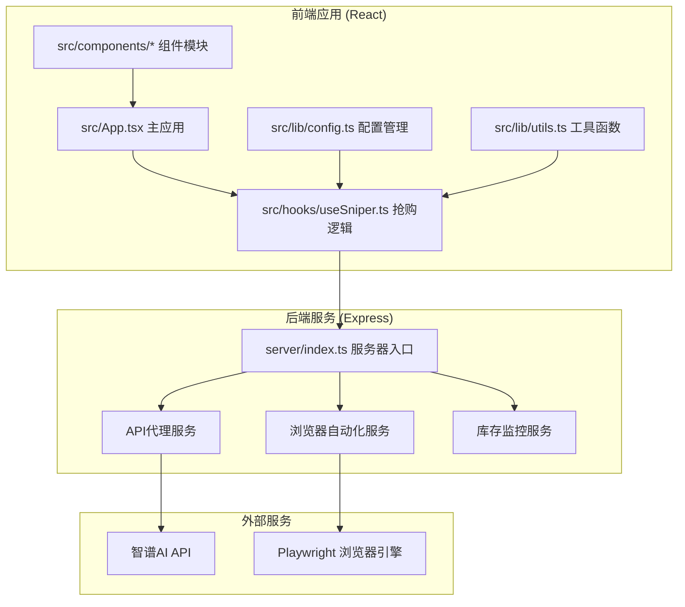
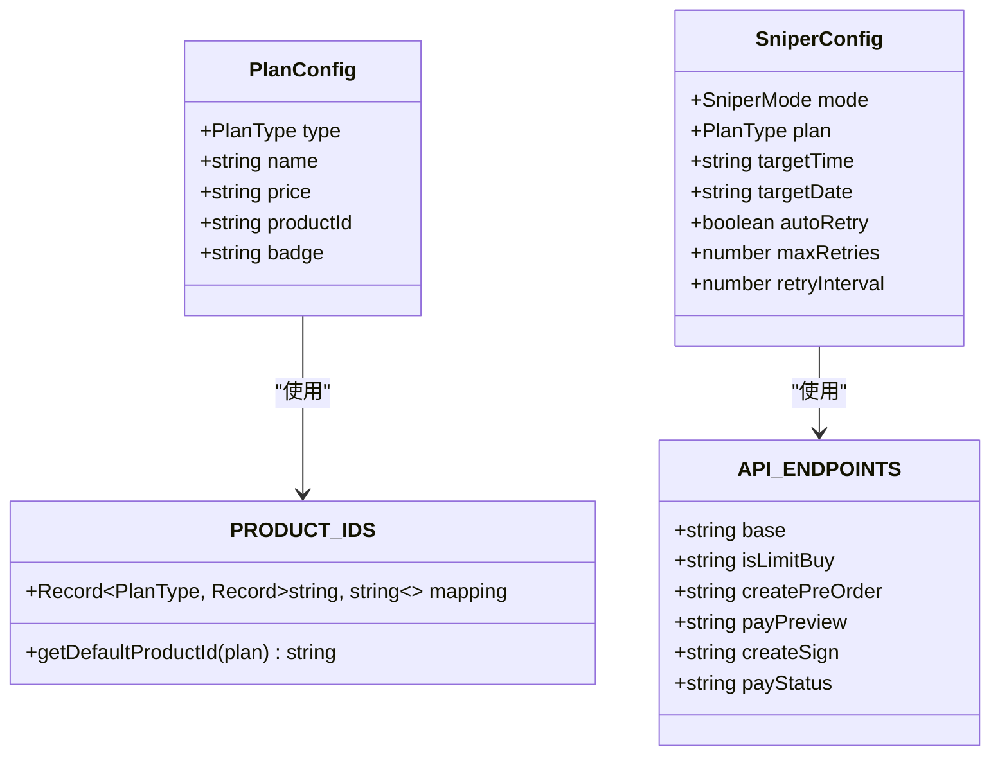
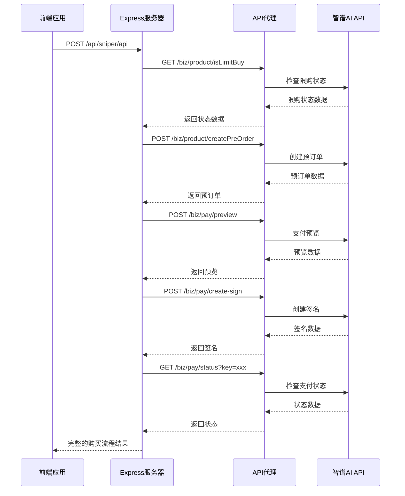
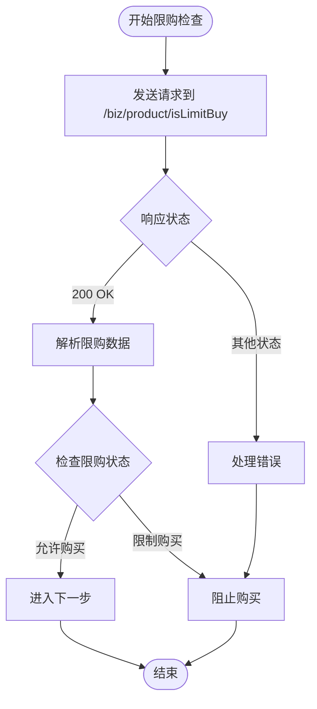
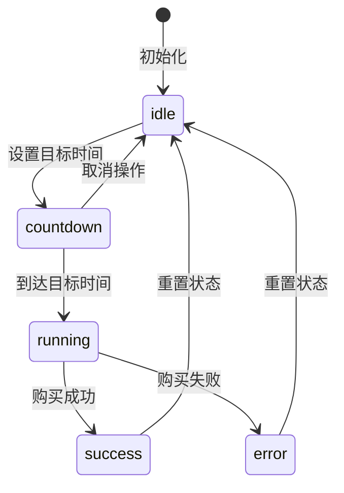
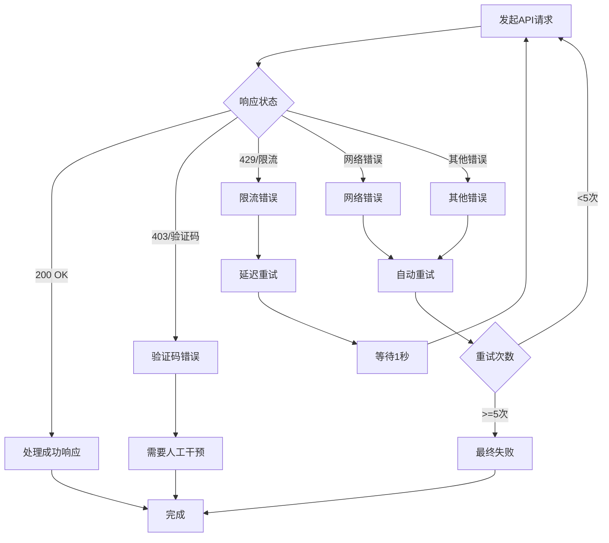
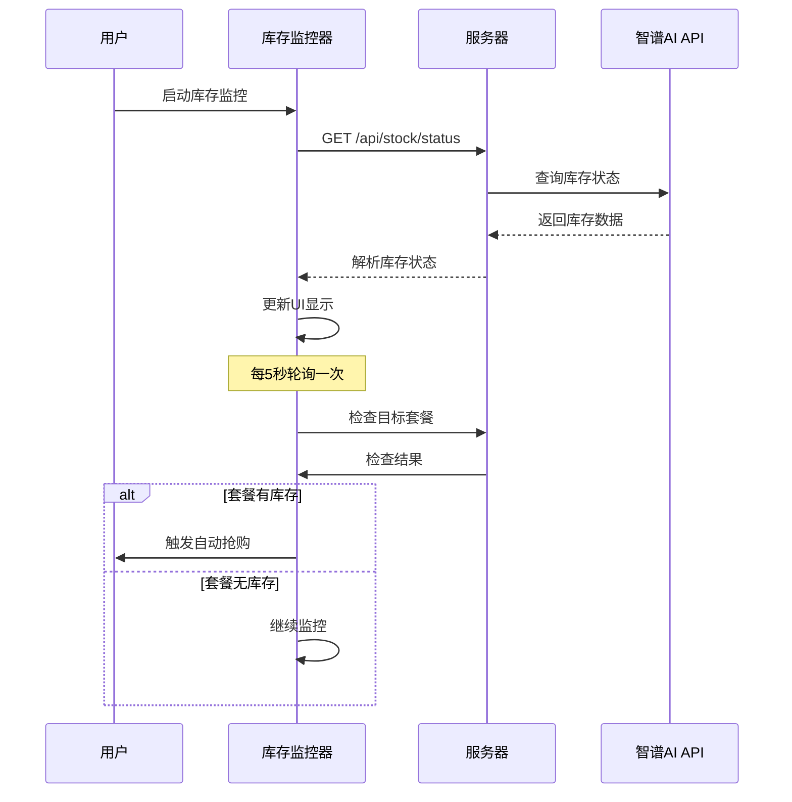

# API模式服务

<cite>
**本文档引用的文件**
- [server/index.ts](file://server/index.ts)
- [src/hooks/useSniper.ts](file://src/hooks/useSniper.ts)
- [src/lib/config.ts](file://src/lib/config.ts)
- [src/lib/utils.ts](file://src/lib/utils.ts)
- [src/components/AuthPanel.tsx](file://src/components/AuthPanel.tsx)
- [src/components/StockMonitor.tsx](file://src/components/StockMonitor.tsx)
- [src/App.tsx](file://src/App.tsx)
- [package.json](file://package.json)
</cite>

## 目录
1. [简介](#简介)
2. [项目结构](#项目结构)
3. [核心组件](#核心组件)
4. [架构概览](#架构概览)
5. [详细组件分析](#详细组件分析)
6. [依赖关系分析](#依赖关系分析)
7. [性能考虑](#性能考虑)
8. [故障排除指南](#故障排除指南)
9. [结论](#结论)

## 简介

GLM Sniper是一个基于React + TypeScript + Vite构建的智谱AI GLM Coding Plan抢购工具。该项目提供了两种抢购模式：浏览器自动化模式和API高速模式。API模式服务通过直接HTTP请求与智谱AI API进行交互，实现了完整的购买流程自动化，包括限购检查、预订单创建、支付预览和签名生成等步骤。

该工具旨在帮助用户在智谱AI官方限时优惠期间自动完成GLM Coding Plan的订阅流程，支持多种套餐类型和支付方式，并提供了完善的错误处理和监控机制。

## 项目结构

项目采用前后端分离的架构设计，主要分为以下模块：



**图表来源**
- [server/index.ts:1-370](file://server/index.ts#L1-L370)
- [src/App.tsx:1-197](file://src/App.tsx#L1-L197)

**章节来源**
- [server/index.ts:1-370](file://server/index.ts#L1-L370)
- [src/App.tsx:1-197](file://src/App.tsx#L1-L197)

## 核心组件

### API模式核心流程

API模式服务实现了完整的购买自动化流程，通过五个主要步骤完成整个购买过程：

1. **限购检查** - 验证用户是否符合购买条件
2. **预订单创建** - 生成临时订单用于后续支付
3. **支付预览** - 获取支付详情和费用信息
4. **签名生成** - 创建支付签名以确认订阅
5. **支付状态检查** - 验证支付是否成功

### 配置管理系统

系统提供了完善的配置管理机制，包括套餐类型、产品ID映射和API端点配置：



**图表来源**
- [src/lib/config.ts:10-101](file://src/lib/config.ts#L10-L101)

**章节来源**
- [src/lib/config.ts:1-104](file://src/lib/config.ts#L1-L104)

## 架构概览

API模式服务采用客户端-服务器架构，通过Express服务器提供REST API接口，前端React应用通过HTTP请求与后端交互。



**图表来源**
- [server/index.ts:161-250](file://server/index.ts#L161-L250)
- [src/hooks/useSniper.ts:110-248](file://src/hooks/useSniper.ts#L110-L248)

## 详细组件分析

### API模式服务实现

API模式服务的核心实现在后端Express服务器中，提供了完整的购买流程自动化：

#### 限购检查流程



**图表来源**
- [server/index.ts:172-177](file://server/index.ts#L172-L177)

#### 预订单创建流程

预订单创建是购买流程的关键步骤，系统支持多种套餐类型的productId映射：

| 套餐类型 | 月付产品ID | 季付产品ID | 年付产品ID |
|---------|-----------|-----------|-----------|
| Lite | product-lite-monthly | product-lite-quarterly | product-lite-yearly |
| Pro | product-a6ef45 | product-1df3e1 | product-fc5155 |
| Max | product-max-monthly | product-2fc421 | product-max-yearly |

#### 支付预览和签名生成

支付预览和签名生成是确保购买流程完整性的两个重要步骤，系统支持支付宝作为默认支付方式。

**章节来源**
- [server/index.ts:161-250](file://server/index.ts#L161-L250)
- [src/lib/config.ts:51-68](file://src/lib/config.ts#L51-L68)

### 前端集成组件

前端应用通过useSniper Hook实现了完整的用户交互和状态管理：

#### 抢购状态管理



**图表来源**
- [src/hooks/useSniper.ts:57-58](file://src/hooks/useSniper.ts#L57-L58)

#### 错误处理和重试机制

前端实现了智能的错误检测和自动重试机制：



**图表来源**
- [src/hooks/useSniper.ts:157-177](file://src/hooks/useSniper.ts#L157-L177)

**章节来源**
- [src/hooks/useSniper.ts:1-407](file://src/hooks/useSniper.ts#L1-L407)

### 库存监控系统

系统提供了实时库存监控功能，帮助用户及时了解套餐的可用状态：

#### 库存状态检查流程



**图表来源**
- [src/hooks/useSniper.ts:318-352](file://src/hooks/useSniper.ts#L318-L352)

**章节来源**
- [src/hooks/useSniper.ts:305-372](file://src/hooks/useSniper.ts#L305-L372)

## 依赖关系分析

项目的主要依赖关系如下：

```mermaid
graph TB
subgraph "前端依赖"
A[react@^19.2.5]
B[react-dom@^19.2.5]
C[tailwindcss@^3.4.17]
D[typescript@~6.0.2]
end
subgraph "后端依赖"
E[express@^5.2.1]
F[cors@^2.8.6]
G[cookie-parse@^0.4.0]
H[playwright@^1.59.1]
I[tsx@^4.21.0]
end
subgraph "开发依赖"
J[@vitejs/plugin-react@^6.0.1]
K[eslint@^10.2.1]
L[tailwindcss-animate@^1.0.7]
end
A --> D
E --> F
E --> G
H --> I
```

**图表来源**
- [package.json:14-46](file://package.json#L14-L46)

**章节来源**
- [package.json:1-48](file://package.json#L1-48)

## 性能考虑

### API调用优化策略

1. **请求合并** - 将多个API调用合并为单个请求，减少网络往返
2. **缓存机制** - 对频繁访问的数据进行缓存，避免重复请求
3. **连接复用** - 使用持久连接减少TCP握手开销
4. **超时控制** - 设置合理的超时时间，避免长时间阻塞

### 内存管理

1. **定时器清理** - 及时清理定时器和监听器，防止内存泄漏
2. **日志管理** - 限制日志数量，避免内存占用过大
3. **资源释放** - 及时释放浏览器实例和网络连接

### 监控指标

建议监控以下关键指标：
- API响应时间分布
- 请求成功率和失败率
- 内存使用情况
- CPU使用率
- 网络带宽使用

## 故障排除指南

### 常见错误类型及解决方案

#### 认证错误 (401/403)

**症状**: 抢购失败，返回认证相关错误
**原因**: 
- Token过期或无效
- 权限不足
- IP被限制

**解决方案**:
1. 重新获取有效的认证Token
2. 检查Token权限范围
3. 确认IP地址白名单设置

#### 验证码拦截 (403/包含验证码关键词)

**症状**: 预订单创建失败，响应包含验证码相关文本
**原因**: 系统检测到异常请求行为
**解决方案**:
1. 手动完成网页版验证码
2. 稍后再试
3. 减少请求频率

#### 网络超时

**症状**: API请求超时，无法获得响应
**原因**:
- 网络连接不稳定
- 服务器负载过高
- 防火墙阻拦

**解决方案**:
1. 检查网络连接
2. 重试请求
3. 调整超时参数

#### 库存不足

**症状**: 限购检查显示库存不足
**原因**: 目标套餐已被售完
**解决方案**:
1. 启动库存监控
2. 等待补货
3. 考虑其他套餐类型

### 调试技巧

1. **启用详细日志** - 查看完整的请求和响应数据
2. **使用开发者工具** - 分析网络请求和响应
3. **模拟环境测试** - 在测试环境中验证功能
4. **逐步排查** - 逐个检查每个API调用的结果

**章节来源**
- [src/hooks/useSniper.ts:157-177](file://src/hooks/useSniper.ts#L157-L177)
- [src/components/AuthPanel.tsx:18-41](file://src/components/AuthPanel.tsx#L18-L41)

## 结论

GLM Sniper的API模式服务提供了一个完整、可靠的智谱AI GLM Coding Plan抢购解决方案。通过精心设计的架构和完善的错误处理机制，该系统能够在保证稳定性的同时提供高效的抢购体验。

主要优势包括：
- **完整的购买流程自动化** - 从限购检查到支付确认的全流程自动化
- **智能错误处理** - 自动检测和处理各种异常情况
- **实时库存监控** - 帮助用户及时了解购买时机
- **灵活的配置管理** - 支持多种套餐类型和支付方式
- **完善的日志系统** - 提供详细的执行过程记录

建议在使用过程中：
1. 确保网络连接稳定
2. 及时更新认证信息
3. 合理设置抢购时间
4. 关注库存变化
5. 遵守服务条款和法律法规

通过合理使用这些功能，用户可以大大提高抢购成功的概率，同时享受流畅的使用体验。