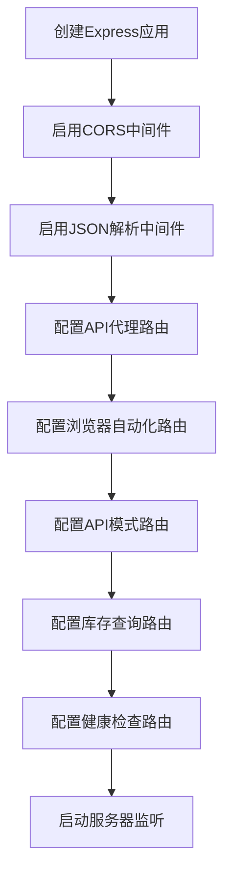
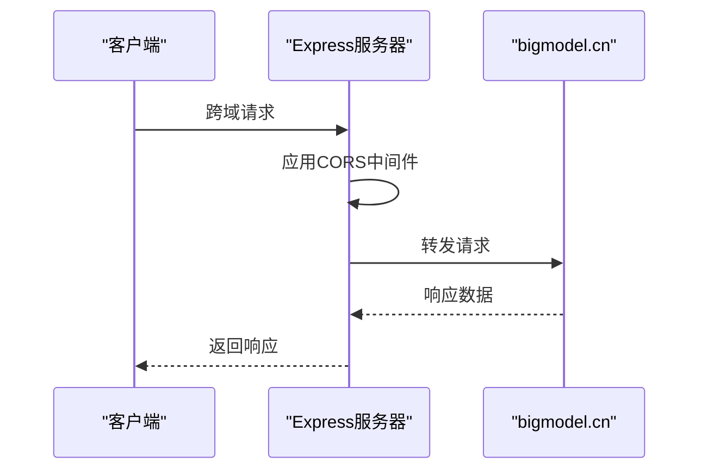
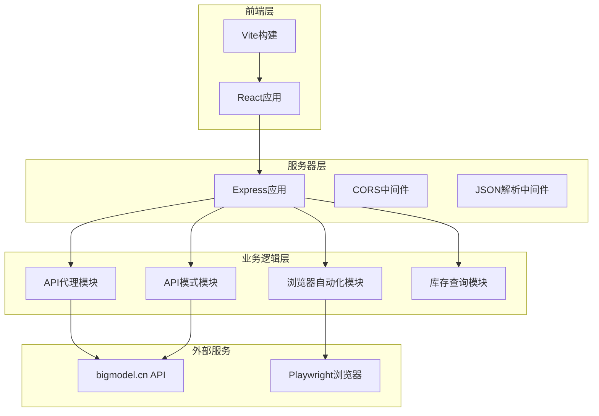
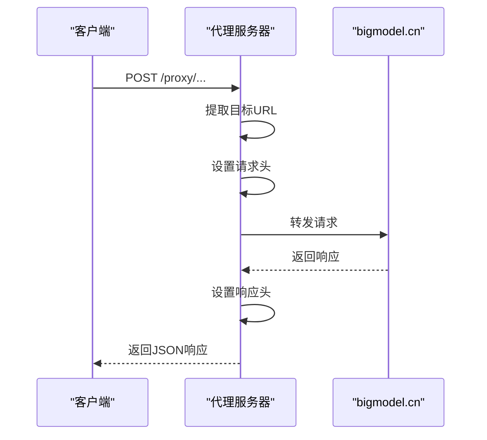
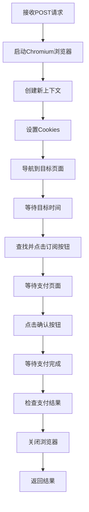
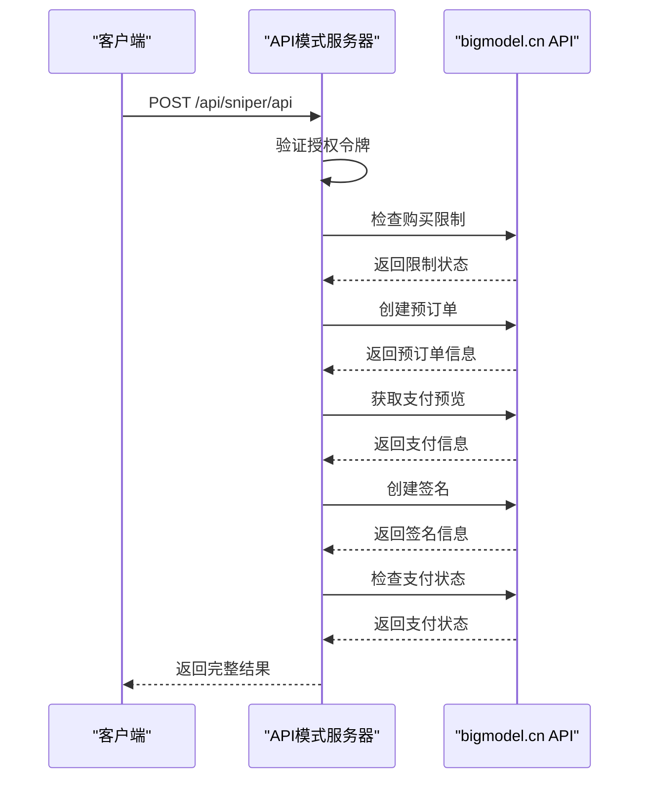
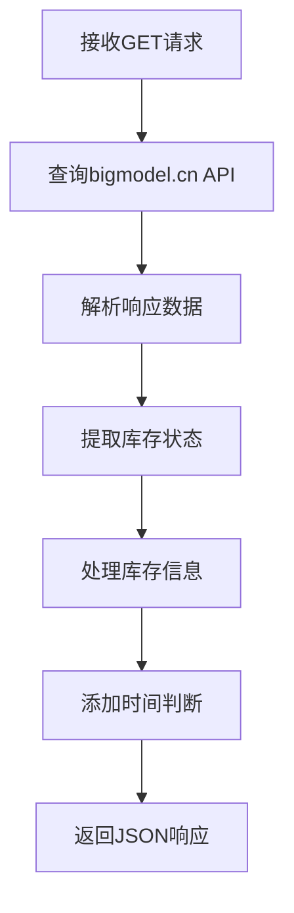
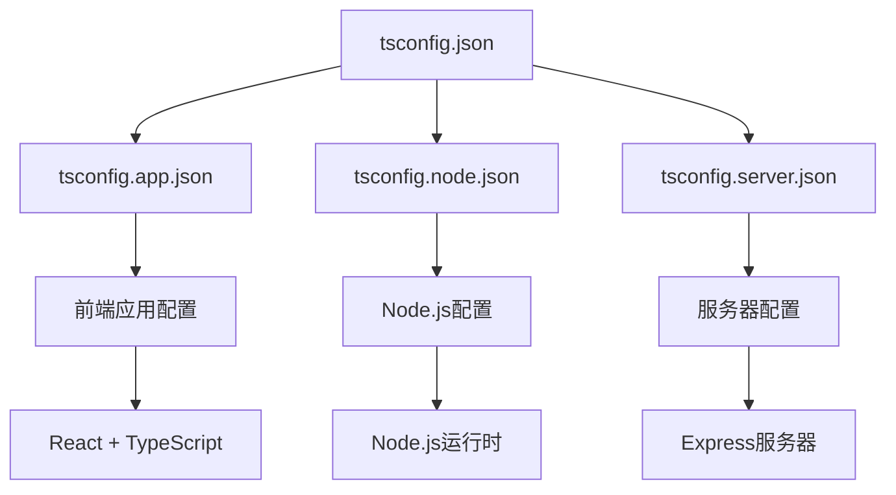

# Express服务器配置

<cite>
**本文档引用的文件**
- [server/index.ts](file://server/index.ts)
- [package.json](file://package.json)
- [vite.config.ts](file://vite.config.ts)
- [tsconfig.server.json](file://tsconfig.server.json)
- [tsconfig.json](file://tsconfig.json)
- [tsconfig.app.json](file://tsconfig.app.json)
- [tsconfig.node.json](file://tsconfig.node.json)
- [src/lib/config.ts](file://src/lib/config.ts)
- [src/lib/utils.ts](file://src/lib/utils.ts)
- [src/App.tsx](file://src/App.tsx)
- [src/main.tsx](file://src/main.tsx)
- [README.md](file://README.md)
</cite>

## 目录
1. [简介](#简介)
2. [项目结构](#项目结构)
3. [核心组件](#核心组件)
4. [架构概览](#架构概览)
5. [详细组件分析](#详细组件分析)
6. [依赖关系分析](#依赖关系分析)
7. [性能考虑](#性能考虑)
8. [故障排除指南](#故障排除指南)
9. [结论](#结论)

## 简介

GLM Sniper Express服务器是一个基于Node.js和Express的后端服务，主要用于GLM Coding计划的抢购辅助工具。该服务器提供了多种功能，包括API代理、浏览器自动化抢购、API模式抢购、库存状态查询等。服务器采用TypeScript编写，使用Vite进行构建，并集成了Playwright进行浏览器自动化。

## 项目结构

该项目采用前后端分离的架构设计，主要包含以下目录结构：

```mermaid
graph TB
subgraph "项目根目录"
A[server/] -- 服务器代码
B[src/] -- 前端源码
C[public/] -- 静态资源
D[*.json] -- 配置文件
end
subgraph "server/"
E[index.ts] -- 主服务器入口
end
subgraph "src/"
F[components/] -- React组件
G[hooks/] -- 自定义Hook
H[lib/] -- 工具库
I[App.tsx] -- 主应用组件
J[main.tsx] -- 应用入口
end
subgraph "配置文件"
K[tsconfig.*.json] -- TypeScript配置
L[vite.config.ts] -- Vite配置
M[package.json] -- 依赖管理
end
```

**图表来源**
- [server/index.ts:1-370](file://server/index.ts#L1-L370)
- [package.json:1-48](file://package.json#L1-L48)

**章节来源**
- [server/index.ts:1-370](file://server/index.ts#L1-L370)
- [package.json:1-48](file://package.json#L1-L48)

## 核心组件

### Express应用实例创建

服务器使用Express框架创建应用实例，并配置了基本的中间件：



**图表来源**
- [server/index.ts:6-7](file://server/index.ts#L6-L7)
- [server/index.ts:12-40](file://server/index.ts#L12-L40)
- [server/index.ts:43-159](file://server/index.ts#L43-L159)
- [server/index.ts:162-250](file://server/index.ts#L162-L250)
- [server/index.ts:253-355](file://server/index.ts#L253-L355)
- [server/index.ts:358-370](file://server/index.ts#L358-L370)

### 中间件配置

服务器配置了以下中间件：

1. **CORS中间件**：允许跨域请求
2. **JSON解析中间件**：解析JSON请求体
3. **API代理中间件**：转发到bigmodel.cn API

**章节来源**
- [server/index.ts:6-8](file://server/index.ts#L6-L8)

### CORS设置

服务器使用默认的CORS配置，允许所有来源的跨域请求：



**图表来源**
- [server/index.ts:7-8](file://server/index.ts#L7-L8)

**章节来源**
- [server/index.ts:7-8](file://server/index.ts#L7-L8)

## 架构概览

服务器采用模块化的架构设计，主要包含以下模块：



**图表来源**
- [server/index.ts:1-370](file://server/index.ts#L1-L370)
- [src/App.tsx:1-197](file://src/App.tsx#L1-L197)

## 详细组件分析

### API代理模块

API代理模块用于绕过CORS限制，将请求转发到bigmodel.cn：



**图表来源**
- [server/index.ts:12-40](file://server/index.ts#L12-L40)

**章节来源**
- [server/index.ts:12-40](file://server/index.ts#L12-L40)

### 浏览器自动化模块

浏览器自动化模块使用Playwright进行自动化操作：



**图表来源**
- [server/index.ts:43-159](file://server/index.ts#L43-L159)

**章节来源**
- [server/index.ts:43-159](file://server/index.ts#L43-L159)

### API模式模块

API模式模块直接调用bigmodel.cn的API：



**图表来源**
- [server/index.ts:162-250](file://server/index.ts#L162-L250)

**章节来源**
- [server/index.ts:162-250](file://server/index.ts#L162-L250)

### 库存查询模块

库存查询模块用于查询GLM Coding计划的库存状态：



**图表来源**
- [server/index.ts:253-355](file://server/index.ts#L253-L355)

**章节来源**
- [server/index.ts:253-355](file://server/index.ts#L253-L355)

### 健康检查模块

健康检查模块提供简单的健康检查接口：

**章节来源**
- [server/index.ts:358-360](file://server/index.ts#L358-L360)

## 依赖关系分析

### TypeScript配置分析

项目使用多配置文件的TypeScript配置策略：



**图表来源**
- [tsconfig.json:1-8](file://tsconfig.json#L1-L8)
- [tsconfig.app.json:1-34](file://tsconfig.app.json#L1-L34)
- [tsconfig.node.json:1-25](file://tsconfig.node.json#L1-L25)
- [tsconfig.server.json:1-15](file://tsconfig.server.json#L1-L15)

### 依赖管理

项目的主要依赖包括：

**后端依赖**：
- express: Web框架
- cors: CORS中间件
- playwright: 浏览器自动化
- cookie-parse: Cookie解析

**前端依赖**：
- react, react-dom: React框架
- @vitejs/plugin-react: Vite React插件
- tailwindcss: CSS框架

**开发依赖**：
- typescript: TypeScript编译器
- vite: 构建工具
- tsx: TypeScript执行器

**章节来源**
- [package.json:14-46](file://package.json#L14-L46)

## 性能考虑

### 服务器性能优化建议

1. **连接池管理**：对于API代理，建议实现连接池以复用HTTP连接
2. **缓存策略**：库存查询结果可以添加适当的缓存机制
3. **并发控制**：浏览器自动化操作应该限制并发数量
4. **内存管理**：定期清理Playwright进程和浏览器实例
5. **超时设置**：为外部API调用设置合理的超时时间

### 前端性能优化

1. **代码分割**：利用Vite的动态导入实现代码分割
2. **懒加载**：对大型组件使用懒加载
3. **优化构建**：使用生产环境构建配置
4. **资源压缩**：启用CSS和JavaScript压缩

## 故障排除指南

### 常见配置问题

1. **端口占用问题**
   - 检查端口是否被其他程序占用
   - 修改服务器端口配置

2. **CORS错误**
   - 确认CORS中间件正确配置
   - 检查代理请求的头部设置

3. **Playwright启动失败**
   - 确认系统已安装必要的依赖
   - 检查浏览器二进制文件路径

4. **TypeScript编译错误**
   - 检查tsconfig配置文件
   - 确认依赖版本兼容性

### 调试技巧

1. **启用详细日志**：在开发环境中启用更详细的日志输出
2. **使用调试器**：利用Node.js调试器进行断点调试
3. **监控资源使用**：监控内存和CPU使用情况
4. **测试API端点**：使用curl或Postman测试各个API端点

**章节来源**
- [server/index.ts:362-370](file://server/index.ts#L362-L370)

## 结论

GLM Sniper Express服务器提供了一个功能完整的后端服务，支持多种抢购模式和自动化操作。通过模块化的架构设计和合理的配置管理，该服务器能够有效地处理各种业务需求。

主要特点包括：
- 多种抢购模式支持（浏览器自动化和API模式）
- 完善的错误处理和日志记录
- 灵活的配置选项
- 良好的扩展性设计

建议在生产环境中进一步完善监控、日志管理和安全配置，以确保系统的稳定性和安全性。