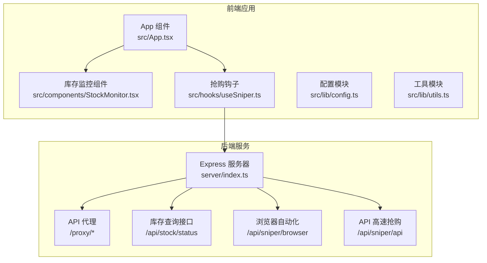
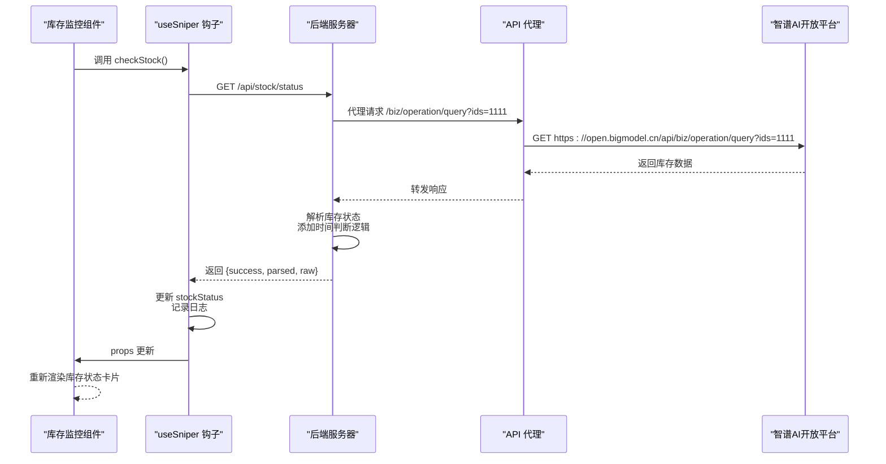
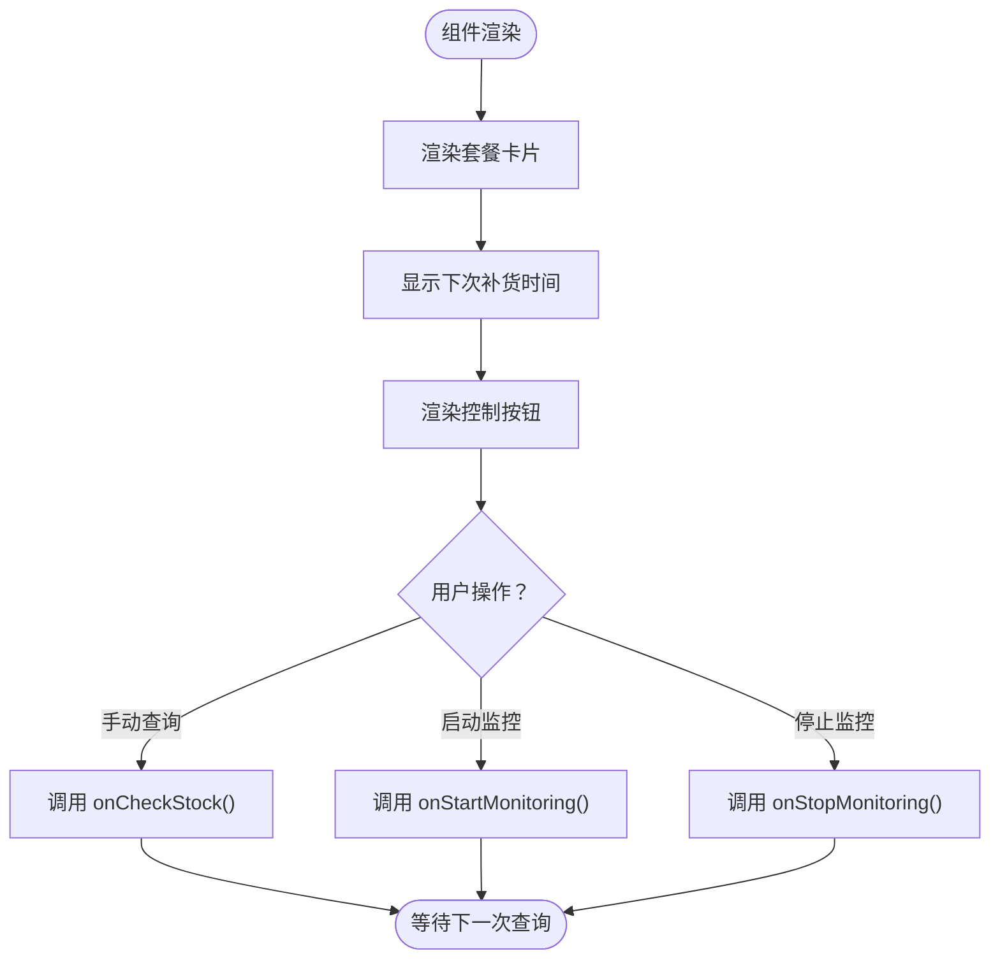
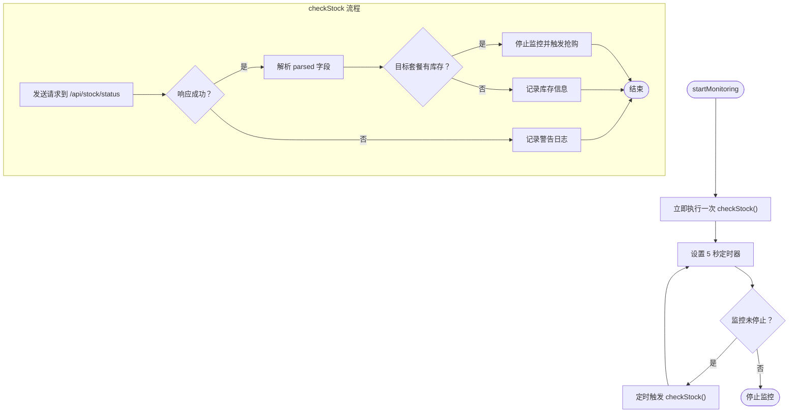
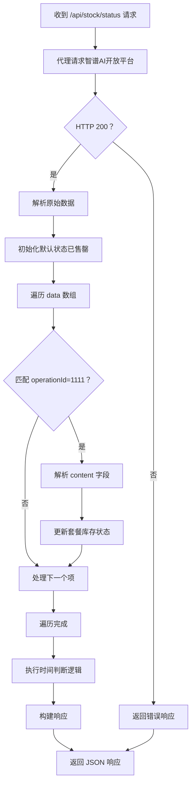
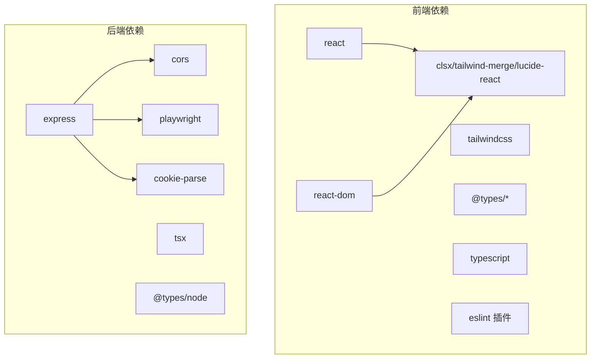

# 库存监控服务

<cite>
**本文档引用的文件**
- [README.md](file://README.md)
- [package.json](file://package.json)
- [server/index.ts](file://server/index.ts)
- [src/App.tsx](file://src/App.tsx)
- [src/components/StockMonitor.tsx](file://src/components/StockMonitor.tsx)
- [src/hooks/useSniper.ts](file://src/hooks/useSniper.ts)
- [src/lib/config.ts](file://src/lib/config.ts)
- [src/lib/utils.ts](file://src/lib/utils.ts)
</cite>

## 目录
1. [简介](#简介)
2. [项目结构](#项目结构)
3. [核心组件](#核心组件)
4. [架构总览](#架构总览)
5. [详细组件分析](#详细组件分析)
6. [依赖关系分析](#依赖关系分析)
7. [性能考虑](#性能考虑)
8. [故障排除指南](#故障排除指南)
9. [结论](#结论)

## 简介
本项目是一个基于 React + TypeScript + Vite 的前端应用，配合 Node.js Express 后端服务，提供 GLM Coding Plan 的库存监控与抢购辅助功能。库存监控服务通过后端代理访问智谱AI开放平台的库存查询接口，解析返回的库存状态并以可视化界面展示，同时支持定时轮询与手动查询两种模式。

## 项目结构
项目采用前后端分离架构：
- 前端：React + TypeScript + Vite，负责用户界面与交互逻辑
- 后端：Express 服务，提供 API 代理、库存状态查询、浏览器自动化抢购等能力
- 核心模块：库存监控、配置管理、工具函数、钩子封装

**图表来源**
- [src/App.tsx:12-197](file://src/App.tsx#L12-L197)
- [src/components/StockMonitor.tsx:1-140](file://src/components/StockMonitor.tsx#L1-L140)
- [src/hooks/useSniper.ts:46-407](file://src/hooks/useSniper.ts#L46-L407)
- [server/index.ts:10-370](file://server/index.ts#L10-L370)

**章节来源**
- [src/App.tsx:12-197](file://src/App.tsx#L12-L197)
- [server/index.ts:10-370](file://server/index.ts#L10-L370)

## 核心组件
- 库存监控组件：负责渲染库存状态卡片、显示下次补货时间、提供手动查询与监控启停按钮。
- 抢购钩子：封装库存查询、监控轮询、日志记录、状态管理等逻辑。
- 配置模块：定义套餐类型、API 端点、产品 ID 映射、库存检查配置等。
- 工具模块：提供日志格式化、时间计算、类名合并等通用工具。

**章节来源**
- [src/components/StockMonitor.tsx:1-140](file://src/components/StockMonitor.tsx#L1-L140)
- [src/hooks/useSniper.ts:46-407](file://src/hooks/useSniper.ts#L46-L407)
- [src/lib/config.ts:1-104](file://src/lib/config.ts#L1-L104)
- [src/lib/utils.ts:1-51](file://src/lib/utils.ts#L1-L51)

## 架构总览
前端通过 useSniper 钩子向后端发送库存查询请求，后端代理访问智谱AI开放平台的库存查询接口，解析响应并返回统一格式的数据。前端接收数据后更新库存状态与日志，并在检测到目标套餐有库存时自动触发抢购流程。

**图表来源**
- [src/hooks/useSniper.ts:318-352](file://src/hooks/useSniper.ts#L318-L352)
- [server/index.ts:252-355](file://server/index.ts#L252-L355)

## 详细组件分析

### 库存监控组件（StockMonitor）
- 功能职责
  - 渲染三个套餐的库存状态卡片（Lite/Pro/Max）
  - 显示“下次补货”时间提示
  - 提供手动查询与监控启停按钮
  - 根据监控状态显示指示灯
- 数据绑定
  - 接收 stockStatus、isMonitoring、plan 等 props
  - 通过回调函数触发 onCheckStock、onStartMonitoring、onStopMonitoring
- 视觉反馈
  - 当目标套餐有库存时，对应卡片边框与背景高亮
  - 监控中状态显示脉冲指示灯

**图表来源**
- [src/components/StockMonitor.tsx:27-140](file://src/components/StockMonitor.tsx#L27-L140)

**章节来源**
- [src/components/StockMonitor.tsx:1-140](file://src/components/StockMonitor.tsx#L1-L140)

### 抢购钩子（useSniper）
- 库存查询流程
  - 发送 GET 请求到后端 /api/stock/status
  - 解析响应中的 parsed 字段，包含每个套餐的 available 与 message
  - 若目标套餐有库存且处于监控状态，自动停止监控并触发抢购
  - 记录日志并显示下次补货时间
- 监控轮询
  - 启动监控后立即执行一次查询
  - 每 5 秒轮询一次库存状态
  - 支持停止监控并清理定时器
- 错误处理
  - 对 HTTP 错误与异常进行捕获与日志记录
  - 提供重试机制与验证码拦截检测

**图表来源**
- [src/hooks/useSniper.ts:318-372](file://src/hooks/useSniper.ts#L318-L372)

**章节来源**
- [src/hooks/useSniper.ts:46-407](file://src/hooks/useSniper.ts#L46-L407)

### 后端库存查询服务（server/index.ts）
- 接口定义
  - GET /api/stock/status：查询库存状态并返回统一格式
- 数据解析逻辑
  - 从智谱AI开放平台获取原始数据
  - 尝试解析 content 字段中的 JSON 内容
  - 支持多种库存状态字段（如 stockStatus、liteStock、proStock、maxStock）
  - 若解析失败，使用默认“已售罄”状态
- 时间判断逻辑
  - 在 9:59-10:01 期间提示“即将补货（约 10:00）”
  - 在 10:00-10:05 期间将所有套餐状态标记为“检查中...”
  - 支持 nextReleaseTime 或 replenishTime 字段作为下次补货时间
- 响应格式
  - 返回 success、raw、parsed、timestamp 等字段
  - parsed 包含每个套餐的 available 与 message，以及 nextRelease

**图表来源**
- [server/index.ts:252-355](file://server/index.ts#L252-L355)

**章节来源**
- [server/index.ts:252-355](file://server/index.ts#L252-L355)

### 配置与工具模块
- 配置模块（config.ts）
  - 定义套餐类型、计划配置、产品 ID 映射
  - 提供 API 端点常量与库存检查 ID
  - 导出类型供其他模块使用
- 工具模块（utils.ts）
  - 日志条目结构与创建函数
  - 时间格式化与倒计时格式化
  - 目标时间计算工具

**章节来源**
- [src/lib/config.ts:1-104](file://src/lib/config.ts#L1-L104)
- [src/lib/utils.ts:1-51](file://src/lib/utils.ts#L1-L51)

## 依赖关系分析
- 前端依赖
  - React 生态：react、react-dom、react-router-dom
  - 样式与工具：tailwindcss、clsx、tailwind-merge、lucide-react
  - 类型与开发：@types/*、typescript、eslint 插件
- 后端依赖
  - Web 框架：express
  - 跨域支持：cors
  - 浏览器自动化：playwright
  - Cookie 解析：cookie-parse
  - 开发工具：tsx、@types/node

**图表来源**
- [package.json:14-48](file://package.json#L14-L48)

**章节来源**
- [package.json:14-48](file://package.json#L14-L48)

## 性能考虑
- 轮询频率控制
  - 监控轮询间隔为 5 秒，平衡实时性与请求压力
  - 支持停止监控以释放资源
- 响应解析优化
  - 仅解析 operationId=1111 的内容，减少不必要的处理
  - 对解析失败的情况快速回退到默认状态
- 时间判断逻辑
  - 仅在特定时间段内进行额外的状态提示，避免频繁状态变更
- 前端渲染
  - 使用条件渲染与类名合并，减少不必要的 DOM 更新

## 故障排除指南
- 库存查询失败
  - 检查后端服务是否正常运行（端口 3100）
  - 查看日志中是否有 HTTP 错误码或异常信息
  - 确认网络连接与跨域代理配置
- 验证码拦截
  - 当预订单创建失败且响应包含验证码相关关键词时，系统会提示验证码拦截
  - 建议前往官网手动完成验证码后重试
- 抢购失败
  - 检查认证 Token 或 Cookies 是否正确配置
  - 查看日志中的详细错误信息与步骤状态
- 替代方案
  - 使用浏览器自动化模式（需要安装 Playwright 浏览器）
  - 手动查询库存状态，避免自动轮询
  - 调整监控频率或停止监控以减少请求压力

**章节来源**
- [src/hooks/useSniper.ts:157-177](file://src/hooks/useSniper.ts#L157-L177)
- [src/hooks/useSniper.ts:346-351](file://src/hooks/useSniper.ts#L346-L351)

## 结论
本库存监控服务通过前后端协作，实现了对 GLM Coding Plan 套餐库存状态的实时监控与可视化展示。后端服务负责代理请求与状态解析，前端负责交互与日志展示。系统具备完善的错误处理与时间判断逻辑，能够有效提升库存查询的准确性与用户体验。建议在生产环境中合理设置轮询频率，并关注验证码拦截等异常情况，以确保服务稳定运行。