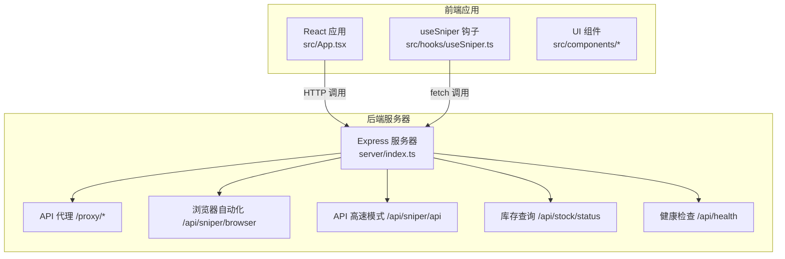
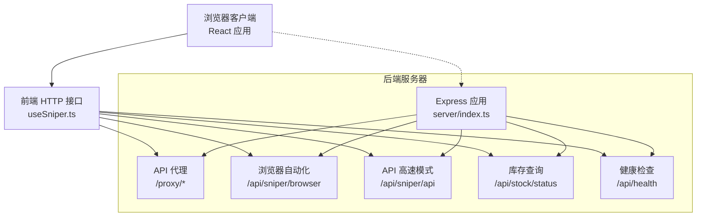
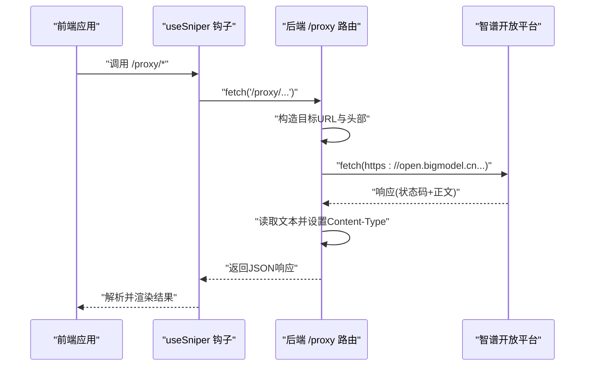
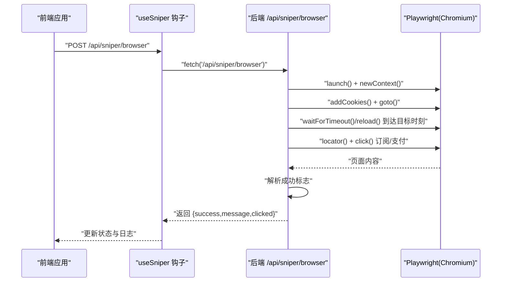
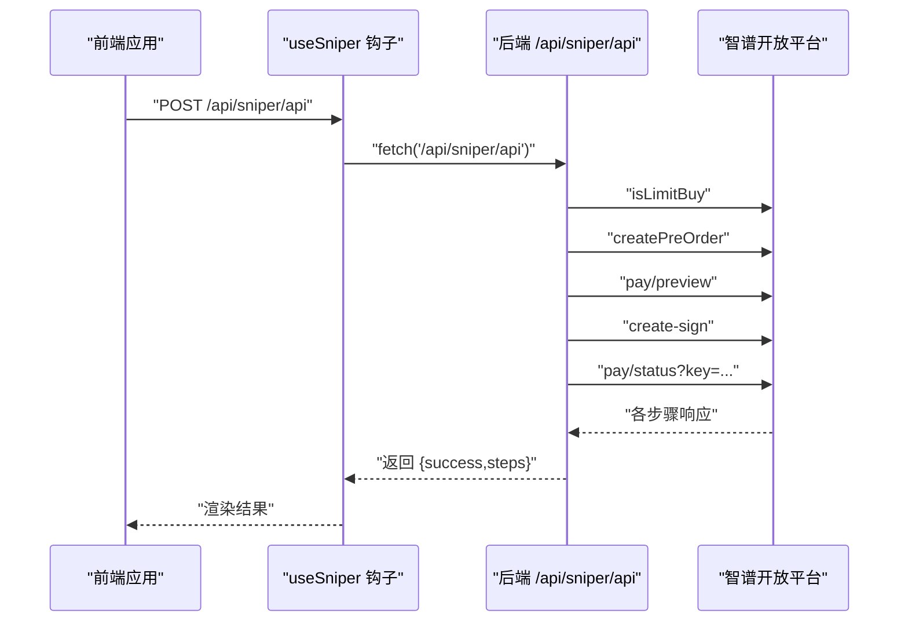
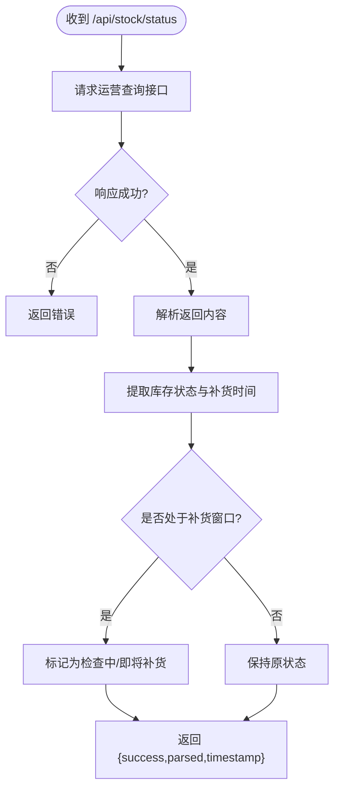
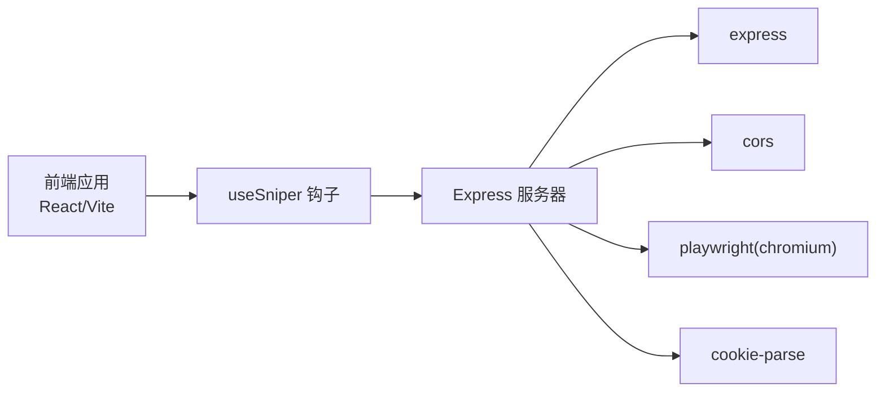

# 服务器架构

<cite>
**本文引用的文件**
- [server/index.ts](file://server/index.ts)
- [package.json](file://package.json)
- [src/lib/config.ts](file://src/lib/config.ts)
- [src/hooks/useSniper.ts](file://src/hooks/useSniper.ts)
- [src/lib/utils.ts](file://src/lib/utils.ts)
- [vite.config.ts](file://vite.config.ts)
- [tsconfig.server.json](file://tsconfig.server.json)
- [src/App.tsx](file://src/App.tsx)
- [src/components/ControlBar.tsx](file://src/components/ControlBar.tsx)
- [src/components/StockMonitor.tsx](file://src/components/StockMonitor.tsx)
- [src/components/AuthPanel.tsx](file://src/components/AuthPanel.tsx)
- [src/components/LogConsole.tsx](file://src/components/LogConsole.tsx)
- [index.html](file://index.html)
</cite>

## 目录
1. [简介](#简介)
2. [项目结构](#项目结构)
3. [核心组件](#核心组件)
4. [架构总览](#架构总览)
5. [详细组件分析](#详细组件分析)
6. [依赖关系分析](#依赖关系分析)
7. [性能考虑](#性能考虑)
8. [故障排查指南](#故障排查指南)
9. [结论](#结论)
10. [附录](#附录)

## 简介
本文件系统性梳理 GLM Sniper 的服务器架构与实现，重点覆盖以下方面：
- Express.js 服务器的配置与实现：路由设计、中间件设置、CORS 处理机制
- API 代理服务：请求转发、响应处理、错误拦截
- Playwright 浏览器自动化服务：集成方式与管理机制
- 安全配置、性能优化与监控策略
- 部署与运维最佳实践
- 常见问题排查与性能调优指南

该系统由前端 React/Vite 应用与后端 Express 服务器组成，二者通过本地 HTTP 接口通信；后端提供 API 代理、库存查询、浏览器自动化与 API 高速模式等能力。

## 项目结构
项目采用“前端应用 + 后端服务器”的双层结构：
- 前端：React + TypeScript + Vite，位于 src/ 目录，构建产物由 Vite 管理
- 后端：Express 服务器，位于 server/ 目录，独立编译与运行
- 共享配置：src/lib/config.ts 提供计划、产品 ID、API 端点等共享常量
- 构建与开发：package.json 中定义了 dev、server、start 等脚本；vite.config.ts 提供路径别名；tsconfig.server.json 限定后端编译范围

图表来源
- [server/index.ts:1-370](file://server/index.ts#L1-L370)
- [src/App.tsx:1-197](file://src/App.tsx#L1-L197)
- [src/hooks/useSniper.ts:1-407](file://src/hooks/useSniper.ts#L1-L407)

章节来源
- [package.json:1-48](file://package.json#L1-L48)
- [vite.config.ts:1-13](file://vite.config.ts#L1-L13)
- [tsconfig.server.json:1-15](file://tsconfig.server.json#L1-L15)

## 核心组件
- Express 服务器与中间件
  - CORS：全局启用 CORS，允许跨域访问
  - JSON 解析：统一处理 JSON 请求体
- API 代理服务
  - 路由：/proxy/* 作为代理入口，转发至 open.bigmodel.cn
  - 头部透传：Authorization 与 Cookie
  - 错误拦截：捕获异常并返回统一格式
- 浏览器自动化服务
  - 路由：/api/sniper/browser
  - 功能：启动 Chromium、注入 Cookie、导航、等待目标时刻、点击订阅/支付按钮、检测成功页面
  - 异常处理：关闭浏览器、返回错误信息
- API 高速模式
  - 路由：/api/sniper/api
  - 步骤：限购检查、创建预订单、支付预览、签名生成、支付状态轮询
  - 结果：返回各步骤数据或错误
- 库存查询服务
  - 路由：/api/stock/status
  - 功能：查询运营配置中的库存状态，解析并返回 Lite/Pro/Max 可用性与下次补货时间
- 健康检查
  - 路由：/api/health
  - 返回服务状态与时间戳

章节来源
- [server/index.ts:1-370](file://server/index.ts#L1-L370)
- [src/lib/config.ts:1-104](file://src/lib/config.ts#L1-L104)

## 架构总览
下图展示前端与后端的交互关系及后端内部模块划分：

图表来源
- [server/index.ts:1-370](file://server/index.ts#L1-L370)
- [src/hooks/useSniper.ts:1-407](file://src/hooks/useSniper.ts#L1-L407)

## 详细组件分析

### Express.js 服务器与中间件
- 中间件
  - CORS：允许任意来源访问，便于前端直接调用
  - JSON 解析：统一解析 application/json 请求体
- 路由组织
  - /proxy：代理智谱开放平台 API，透传授权与 Cookie
  - /api/sniper/browser：浏览器自动化模式
  - /api/sniper/api：API 高速模式
  - /api/stock/status：库存状态查询
  - /api/health：健康检查
- 日志与启动
  - 启动时打印服务地址与各路由说明，便于调试

章节来源
- [server/index.ts:1-370](file://server/index.ts#L1-L370)

### API 代理服务
- 设计要点
  - 以 /proxy 为前缀，将请求路径拼接到 open.bigmodel.cn
  - 透传 Authorization 与 Cookie，保证鉴权与会话一致性
  - GET/非 GET 区分处理请求体
  - 统一设置 Content-Type 为 application/json，并将响应体转换为文本再发送
- 错误处理
  - 捕获异常并返回 500 与错误消息
- 使用场景
  - 前端在 API 模式下通过 /proxy 间接调用智谱 API，绕过浏览器 CORS 限制

图表来源
- [server/index.ts:10-40](file://server/index.ts#L10-L40)
- [src/hooks/useSniper.ts:108-248](file://src/hooks/useSniper.ts#L108-L248)

章节来源
- [server/index.ts:10-40](file://server/index.ts#L10-L40)
- [src/hooks/useSniper.ts:108-248](file://src/hooks/useSniper.ts#L108-L248)

### Playwright 浏览器自动化服务
- 路由与参数
  - POST /api/sniper/browser
  - 参数：plan、cookies、targetTime
- 执行流程
  - 启动 Chromium（非无头），新建上下文并注入 Cookie
  - 导航到 GLM Coding 页面，等待至目标时刻（提前 2 秒唤醒并刷新）
  - 定位订阅按钮（多选择器回退策略），点击后等待支付弹窗出现
  - 点击支付确认按钮，等待一段时间后检查页面内容是否包含“成功/订阅”字样
  - 关闭浏览器并返回结果（success/message/clicked）
- 错误处理
  - 捕获异常并关闭浏览器，返回错误信息

图表来源
- [server/index.ts:42-159](file://server/index.ts#L42-L159)
- [src/hooks/useSniper.ts:76-106](file://src/hooks/useSniper.ts#L76-L106)

章节来源
- [server/index.ts:42-159](file://server/index.ts#L42-L159)
- [src/hooks/useSniper.ts:76-106](file://src/hooks/useSniper.ts#L76-L106)

### API 高速模式
- 路由与参数
  - POST /api/sniper/api
  - 参数：plan、authToken、targetTime、paymentType
- 执行步骤
  - 限购检查：/biz/product/isLimitBuy
  - 创建预订单：/biz/product/createPreOrder
  - 支付预览：/biz/pay/preview
  - 签约请求：/biz/pay/create-sign
  - 支付状态轮询：/biz/pay/status?key=...
- 结果
  - 成功时返回各步骤数据；失败时返回错误与状态码

图表来源
- [server/index.ts:161-250](file://server/index.ts#L161-L250)
- [src/hooks/useSniper.ts:110-248](file://src/hooks/useSniper.ts#L110-L248)

章节来源
- [server/index.ts:161-250](file://server/index.ts#L161-L250)
- [src/hooks/useSniper.ts:110-248](file://src/hooks/useSniper.ts#L110-L248)

### 库存查询服务
- 路由：/api/stock/status
- 功能
  - 请求 open.bigmodel.cn/api/biz/operation/query?ids=1111
  - 解析返回内容，提取 Lite/Pro/Max 库存状态与下次补货时间
  - 在特定时间窗口内给出“即将补货/检查中”提示
- 返回
  - success、raw、parsed、timestamp

图表来源
- [server/index.ts:252-355](file://server/index.ts#L252-L355)

章节来源
- [server/index.ts:252-355](file://server/index.ts#L252-L355)

### 健康检查与日志
- /api/health：返回服务状态与时间戳
- 日志：后端启动时输出服务地址与路由说明，便于快速定位

章节来源
- [server/index.ts:357-370](file://server/index.ts#L357-L370)

## 依赖关系分析
- 前端依赖后端提供的 HTTP 接口，主要通过 useSniper 钩子封装调用
- 后端依赖：
  - Express：Web 服务器与路由
  - Playwright：浏览器自动化
  - cookie-parse：解析 Cookie 字符串
  - cors：跨域支持
- 构建与运行
  - 前端：Vite + React + TypeScript
  - 后端：独立 TS 编译配置，使用 tsx 或 ts-node 运行

图表来源
- [package.json:14-26](file://package.json#L14-L26)
- [server/index.ts:1-6](file://server/index.ts#L1-L6)

章节来源
- [package.json:14-26](file://package.json#L14-L26)
- [vite.config.ts:1-13](file://vite.config.ts#L1-L13)
- [tsconfig.server.json:1-15](file://tsconfig.server.json#L1-L15)

## 性能考虑
- 浏览器自动化
  - 非无头模式便于观察，但资源占用较高；如需更高吞吐，可考虑无头模式并减少截图/日志输出
  - 等待策略：使用 waitForTimeout 与 reload 确保页面最新状态，注意避免过度等待
- API 模式
  - 通过 /proxy 透传请求，减少浏览器开销；对网络抖动进行重试（前端钩子中已有基础重试逻辑）
  - 支付状态轮询建议设置最大次数与退避策略，避免长时间占用连接
- 代理服务
  - 统一设置 Content-Type 为 application/json，避免不必要的 MIME 类型协商
  - 对响应体统一读取为文本再发送，简化处理逻辑
- 前端
  - 使用 React Hook 管理状态与定时器，及时清理定时器避免内存泄漏
  - 日志滚动自动跟随最新条目，提升可观测性

[本节为通用性能建议，不直接分析具体文件]

## 故障排查指南
- 后端未启动
  - 现象：前端报连接失败
  - 处理：执行后端启动命令，确认端口 3100 可用，查看启动日志
- CORS 相关错误
  - 现象：浏览器控制台报跨域错误
  - 处理：确认后端已启用 CORS；若仍失败，检查代理路径与 Origin
- 认证无效
  - 现象：/proxy/* 或 /api/sniper/api 返回 401/403
  - 处理：在前端验证 Token，确保 Authorization 头正确；必要时配置代理
- 验证码拦截
  - 现象：预订单创建失败且包含验证码相关关键词
  - 处理：在官网手动完成验证码后重试；前端已内置提示逻辑
- 浏览器自动化失败
  - 现象：页面元素不可见或点击失败
  - 处理：检查 cookies 注入是否正确；调整等待时间与选择器；确认目标时刻设置合理
- 库存状态异常
  - 现象：解析失败或状态显示异常
  - 处理：检查运营查询接口返回格式；关注补货窗口期的特殊提示

章节来源
- [src/hooks/useSniper.ts:157-177](file://src/hooks/useSniper.ts#L157-L177)
- [src/components/AuthPanel.tsx:18-41](file://src/components/AuthPanel.tsx#L18-L41)
- [server/index.ts:196-204](file://server/index.ts#L196-L204)

## 结论
本架构以 Express 为核心，结合 Playwright 与直连 API 两种模式，满足不同场景下的抢购需求。通过 /proxy 统一代理、Cookie/Token 透传与多级等待策略，系统在可用性与稳定性上取得平衡。建议在生产环境中进一步完善超时控制、重试与熔断策略，并加强日志与监控体系，以提升整体可靠性与可观测性。

[本节为总结性内容，不直接分析具体文件]

## 附录

### 路由与端点一览
- /proxy/*：代理智谱开放平台 API
- /api/sniper/browser：浏览器自动化模式
- /api/sniper/api：API 高速模式
- /api/stock/status：库存状态查询
- /api/health：健康检查

章节来源
- [server/index.ts:10-370](file://server/index.ts#L10-L370)

### 前端组件与交互
- App.tsx：主界面布局与状态容器
- useSniper.ts：核心业务逻辑与 HTTP 调用封装
- ControlBar.tsx：控制栏（启动/停止）
- StockMonitor.tsx：库存监控面板
- AuthPanel.tsx：认证信息输入与验证
- LogConsole.tsx：实时日志展示

章节来源
- [src/App.tsx:1-197](file://src/App.tsx#L1-L197)
- [src/hooks/useSniper.ts:1-407](file://src/hooks/useSniper.ts#L1-L407)
- [src/components/ControlBar.tsx:1-76](file://src/components/ControlBar.tsx#L1-L76)
- [src/components/StockMonitor.tsx:1-140](file://src/components/StockMonitor.tsx#L1-L140)
- [src/components/AuthPanel.tsx:1-120](file://src/components/AuthPanel.tsx#L1-L120)
- [src/components/LogConsole.tsx:1-78](file://src/components/LogConsole.tsx#L1-L78)

### 构建与运行
- 前端：Vite + React + TypeScript
- 后端：独立 TS 配置，支持 tsx 运行
- 启动脚本：dev、server、start

章节来源
- [package.json:6-12](file://package.json#L6-L12)
- [vite.config.ts:1-13](file://vite.config.ts#L1-L13)
- [tsconfig.server.json:1-15](file://tsconfig.server.json#L1-L15)