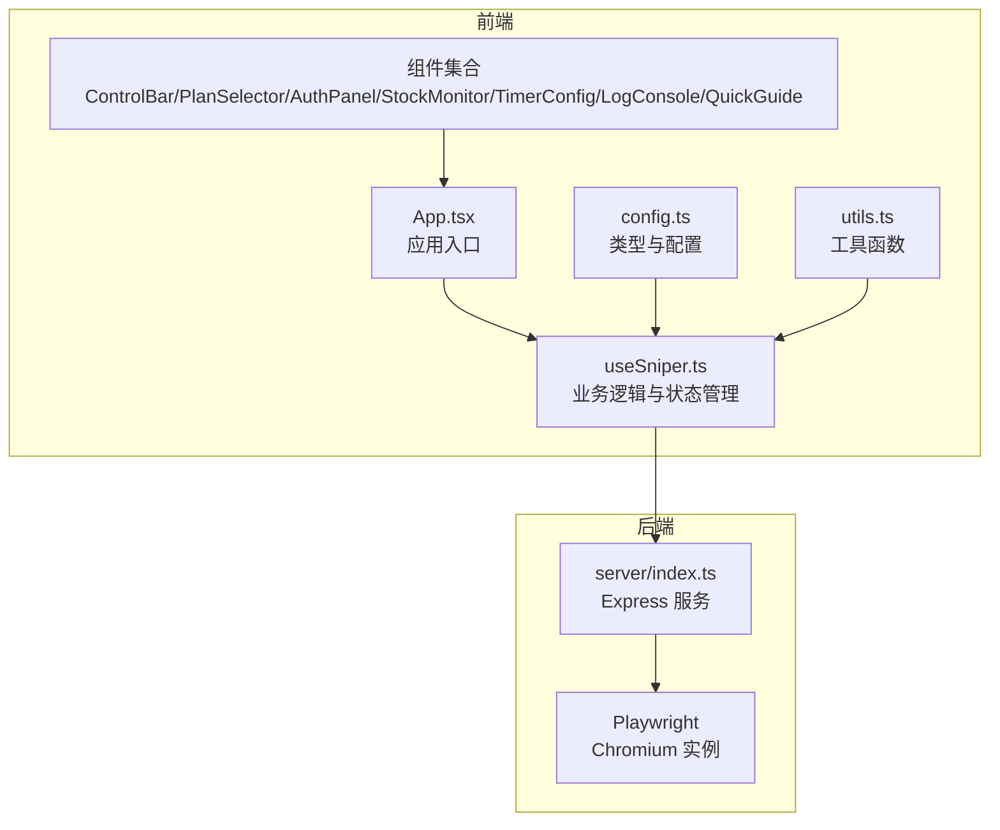
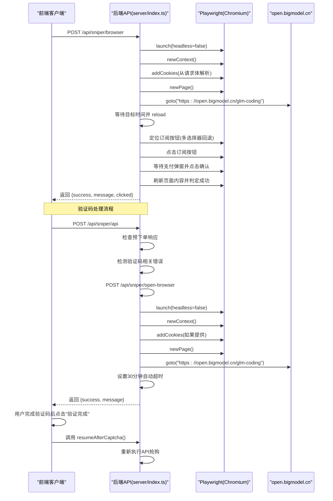
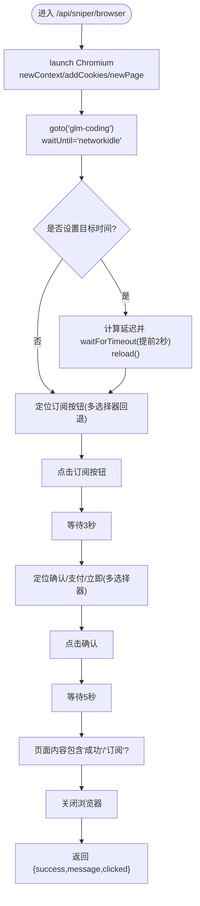
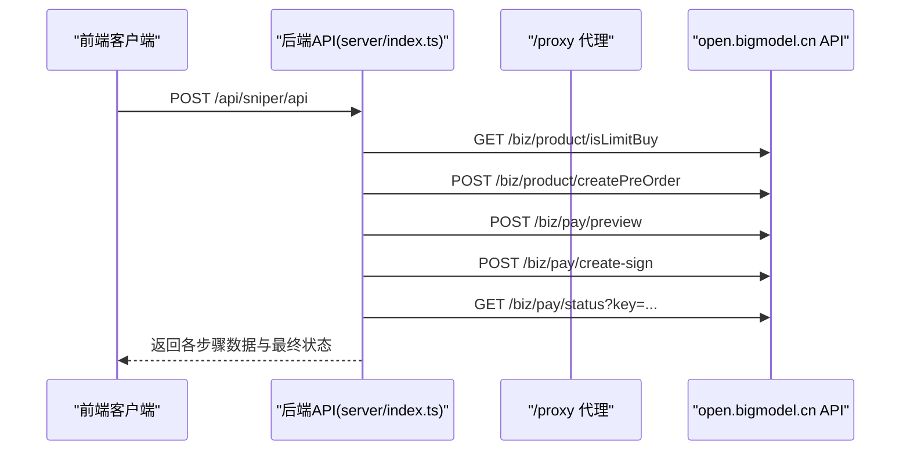
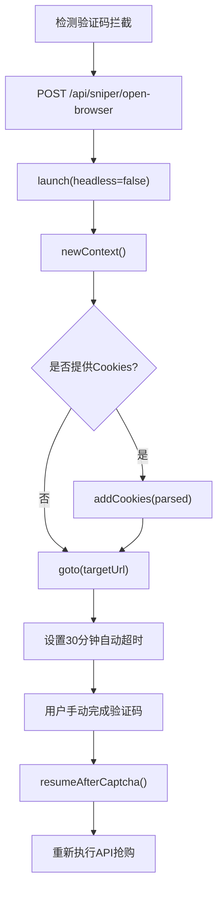
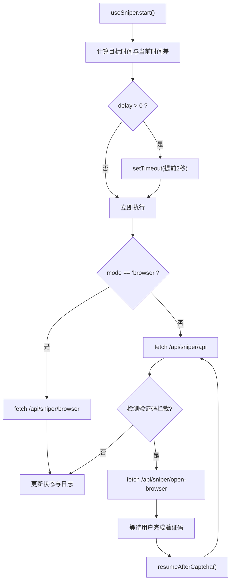
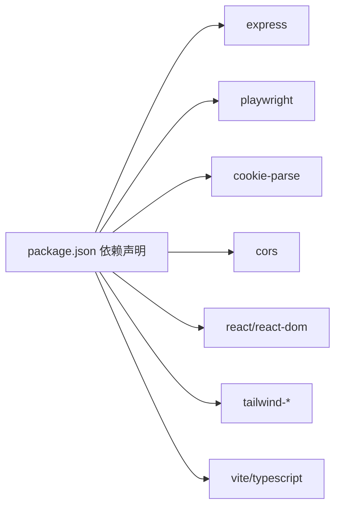

# 浏览器自动化服务

<cite>
**本文引用的文件**
- [server/index.ts](file://server/index.ts)
- [src/hooks/useSniper.ts](file://src/hooks/useSniper.ts)
- [src/lib/config.ts](file://src/lib/config.ts)
- [src/lib/utils.ts](file://src/lib/utils.ts)
- [src/App.tsx](file://src/App.tsx)
- [src/components/ControlBar.tsx](file://src/components/ControlBar.tsx)
- [src/components/PlanSelector.tsx](file://src/components/PlanSelector.tsx)
- [src/components/AuthPanel.tsx](file://src/components/AuthPanel.tsx)
- [src/components/StockMonitor.tsx](file://src/components/StockMonitor.tsx)
- [src/components/TimerConfig.tsx](file://src/components/TimerConfig.tsx)
- [src/components/LogConsole.tsx](file://src/components/LogConsole.tsx)
- [src/components/QuickGuide.tsx](file://src/components/QuickGuide.tsx)
- [package.json](file://package.json)
- [README.md](file://README.md)
</cite>

## 目录
1. [简介](#简介)
2. [项目结构](#项目结构)
3. [核心组件](#核心组件)
4. [架构总览](#架构总览)
5. [详细组件分析](#详细组件分析)
6. [依赖关系分析](#依赖关系分析)
7. [性能与稳定性](#性能与稳定性)
8. [故障排查指南](#故障排查指南)
9. [结论](#结论)
10. [附录](#附录)

## 简介
本项目为"GLM Sniper"浏览器自动化服务，提供两种抢购模式：
- 浏览器自动化模式：基于 Playwright 的 Chromium 实例，模拟真实用户操作，完成页面导航、Cookie 注入、元素定位与点击、支付确认等全流程。
- API 高速模式：通过代理直连智谱开放平台接口，完成限购校验、预下单、支付预览、签约与支付状态查询。

**新增功能**：自动验证码处理系统，包含验证码拦截检测和用户验证控制，支持腾讯验证码和数美验证码双重防护。

服务端采用 Express 提供 REST API，前端使用 React + TypeScript + Vite 构建交互界面，支持定时抢购、库存监控、实时日志与模式切换。

## 项目结构
整体采用前后端分离架构：
- 服务端：Express + Playwright，负责浏览器自动化与 API 代理。
- 前端：React 组件 + 自定义 Hook，负责配置输入、UI 控制与日志展示。

图表来源
- [server/index.ts:1-419](file://server/index.ts#L1-L419)
- [src/hooks/useSniper.ts:1-473](file://src/hooks/useSniper.ts#L1-L473)
- [src/App.tsx:1-218](file://src/App.tsx#L1-L218)
- [src/lib/config.ts:1-136](file://src/lib/config.ts#L1-L136)
- [src/lib/utils.ts:1-51](file://src/lib/utils.ts#L1-L51)

章节来源
- [server/index.ts:1-419](file://server/index.ts#L1-L419)
- [src/hooks/useSniper.ts:1-473](file://src/hooks/useSniper.ts#L1-L473)
- [src/App.tsx:1-218](file://src/App.tsx#L1-L218)
- [src/lib/config.ts:1-136](file://src/lib/config.ts#L1-L136)
- [src/lib/utils.ts:1-51](file://src/lib/utils.ts#L1-L51)

## 核心组件
- 服务端 API
  - /api/sniper/browser：浏览器自动化模式，支持 Cookie 注入、目标时间等待、套餐选择与支付确认。
  - /api/sniper/api：API 高速模式，直连平台接口完成限购校验、预下单、支付预览、签约与状态查询。
  - /api/sniper/open-browser：验证码处理专用 API，打开浏览器窗口供用户手动处理验证码。
  - /proxy：CORS 代理，转发 open.bigmodel.cn 请求并携带认证与 Cookie。
  - /api/stock/status：库存状态查询与解析。
  - /api/health：健康检查。
- 前端 Hook useSniper
  - 管理模式、套餐、目标时间、认证信息与日志。
  - 负责倒计时、提前 2 秒触发、重试与验证码检测。
  - 提供库存监控与手动查询。
  - **新增**：验证码处理状态管理与用户交互控制。
- 配置与工具
  - config.ts：计划类型、产品 ID 映射、API 端点与常量，包含验证码处理状态类型。
  - utils.ts：日志格式化、倒计时格式化、目标时间计算。

章节来源
- [server/index.ts:43-159](file://server/index.ts#L43-L159)
- [server/index.ts:162-208](file://server/index.ts#L162-L208)
- [server/index.ts:210-299](file://server/index.ts#L210-L299)
- [server/index.ts:12-40](file://server/index.ts#L12-L40)
- [server/index.ts:301-404](file://server/index.ts#L301-L404)
- [src/hooks/useSniper.ts:76-106](file://src/hooks/useSniper.ts#L76-L106)
- [src/hooks/useSniper.ts:111-248](file://src/hooks/useSniper.ts#L111-L248)
- [src/hooks/useSniper.ts:318-352](file://src/hooks/useSniper.ts#L318-L352)
- [src/hooks/useSniper.ts:421-435](file://src/hooks/useSniper.ts#L421-L435)
- [src/lib/config.ts:28-101](file://src/lib/config.ts#L28-L101)
- [src/lib/utils.ts:20-50](file://src/lib/utils.ts#L20-L50)

## 架构总览
服务端以 Express 为核心，提供三类自动化路径：
- 浏览器自动化：启动 Chromium，注入 Cookie，导航至 GLM Coding 页面，按目标时间等待并刷新，定位订阅按钮，点击后等待支付弹窗并尝试点击确认，最后判定成功与否。
- API 高速：通过代理访问平台接口，依次执行限购校验、预下单、支付预览、签约与状态查询，兼容验证码拦截与重试。
- **新增**：验证码处理：当检测到验证码拦截时，自动打开浏览器窗口供用户手动处理，支持 30 分钟自动超时关闭。

图表来源
- [server/index.ts:43-159](file://server/index.ts#L43-L159)
- [server/index.ts:162-208](file://server/index.ts#L162-L208)
- [src/hooks/useSniper.ts:181-213](file://src/hooks/useSniper.ts#L181-L213)
- [src/hooks/useSniper.ts:421-435](file://src/hooks/useSniper.ts#L421-L435)

章节来源
- [server/index.ts:43-159](file://server/index.ts#L43-L159)
- [server/index.ts:162-208](file://server/index.ts#L162-L208)
- [src/hooks/useSniper.ts:181-213](file://src/hooks/useSniper.ts#L181-L213)
- [src/hooks/useSniper.ts:421-435](file://src/hooks/useSniper.ts#L421-L435)

## 详细组件分析

### 浏览器自动化流程（/api/sniper/browser）
- 浏览器实例与上下文
  - 启动 Chromium（非无头），创建新上下文，注入 Cookie（域为 .bigmodel.cn，路径 /）。
- 导航与等待
  - 访问 GLM Coding 页面，等待 networkidle；若指定目标时间，则提前 2 秒唤醒并刷新页面。
- 套餐选择与点击
  - 通过多级选择器尝试定位"特惠订阅"按钮，按 plan 参数映射索引（lite/pro/max）选择对应卡片。
  - 若首选选择器不可见或失败，回退到"订阅"按钮并按索引点击。
- 支付确认
  - 等待 3 秒后尝试点击"确认/支付/立即"，并等待 5 秒观察页面是否出现"成功/订阅"字样作为成功依据。
- 结果判定
  - 关闭浏览器并返回 success/message/clicked。

图表来源
- [server/index.ts:48-159](file://server/index.ts#L48-L159)

章节来源
- [server/index.ts:48-159](file://server/index.ts#L48-L159)

### API 高速流程（/api/sniper/api）
- 步骤说明
  - 限购校验：调用 isLimitBuy。
  - 预下单：根据 plan 选择 productId（季付），调用 createPreOrder。
  - 支付预览：调用 pay/preview。
  - 签约：调用 biz/pay/create-sign。
  - 支付状态：根据返回 key 或订单号查询 biz/pay/status。
- 错误与重试
  - 预下单失败时检测验证码相关关键词，输出指引并终止；否则最多重试 5 次，间隔 1 秒。
- 代理绕过 CORS
  - /proxy 前缀转发请求，保留 Authorization 与 Cookie。

图表来源
- [server/index.ts:210-299](file://server/index.ts#L210-L299)

章节来源
- [server/index.ts:210-299](file://server/index.ts#L210-L299)

### 验证码处理系统（/api/sniper/open-browser）
**新增功能**：自动验证码处理系统，包含验证码拦截检测和用户验证控制。

- 流程说明
  - 当 API 模式检测到验证码拦截时，自动调用 /api/sniper/open-browser。
  - 启动 Chromium 浏览器（非无头），注入提供的 Cookie（如果存在）。
  - 导航至目标 URL（默认 GLM Coding 页面），保持浏览器打开状态。
  - 设置 30 分钟自动超时关闭，防止资源泄漏。
  - 前端显示验证码处理界面，用户完成验证后点击"验证完成"按钮。
  - 调用 resumeAfterCaptcha() 重新执行 API 抢购流程。

图表来源
- [server/index.ts:162-208](file://server/index.ts#L162-L208)
- [src/hooks/useSniper.ts:181-213](file://src/hooks/useSniper.ts#L181-L213)
- [src/hooks/useSniper.ts:421-435](file://src/hooks/useSniper.ts#L421-L435)

章节来源
- [server/index.ts:162-208](file://server/index.ts#L162-L208)
- [src/hooks/useSniper.ts:181-213](file://src/hooks/useSniper.ts#L181-L213)
- [src/hooks/useSniper.ts:421-435](file://src/hooks/useSniper.ts#L421-L435)

### 前端自动化编排（useSniper）
- 倒计时与提前触发
  - 计算目标时间与当前时间差，若大于 0 则提前 2 秒触发，补偿网络延迟。
- 模式切换
  - 浏览器模式：向 /api/sniper/browser 发送 plan、cookies、targetTime。
  - API 模式：向 /api/sniper/api 发送 plan、authToken、targetTime、paymentType。
- 日志与状态
  - 统一的日志系统，支持 info/success/warning/error 四级日志；状态机包括 idle/countdown/running/success/error/captcha_pending。
  - **新增**：captcha_pending 状态用于验证码处理流程。
- 库存监控
  - 每 5 秒查询 /api/stock/status，若目标套餐有库存则自动触发 API 模式抢购。
- **新增**：验证码处理
  - 检测验证码相关错误（包含 'captcha'、'验证'、'verify'、'Tencent'、'安全验证'、'security' 等关键词）。
  - 自动打开浏览器窗口供用户处理验证码。
  - 提供 resumeAfterCaptcha() 方法重新执行抢购流程。

图表来源
- [src/hooks/useSniper.ts:251-293](file://src/hooks/useSniper.ts#L251-L293)
- [src/hooks/useSniper.ts:76-106](file://src/hooks/useSniper.ts#L76-L106)
- [src/hooks/useSniper.ts:111-248](file://src/hooks/useSniper.ts#L111-L248)
- [src/hooks/useSniper.ts:181-213](file://src/hooks/useSniper.ts#L181-L213)
- [src/hooks/useSniper.ts:421-435](file://src/hooks/useSniper.ts#L421-L435)

章节来源
- [src/hooks/useSniper.ts:251-293](file://src/hooks/useSniper.ts#L251-L293)
- [src/hooks/useSniper.ts:76-106](file://src/hooks/useSniper.ts#L76-L106)
- [src/hooks/useSniper.ts:111-248](file://src/hooks/useSniper.ts#L111-L248)
- [src/hooks/useSniper.ts:181-213](file://src/hooks/useSniper.ts#L181-L213)
- [src/hooks/useSniper.ts:421-435](file://src/hooks/useSniper.ts#L421-L435)

### Cookie 注入机制
- 请求体接收 cookies 字符串，服务端解析为键值对数组，构造 domain/path 后注入上下文。
- 适用于浏览器模式，确保登录态可用。

章节来源
- [server/index.ts:51-61](file://server/index.ts#L51-L61)

### 页面导航与元素定位策略
- 导航
  - goto('https://open.bigmodel.cn/glm-coding')，waitUntil: 'networkidle'。
- 定位与点击
  - 订阅按钮：优先 text=特惠订阅 >> nth=索引，其次 button:has-text("特惠订阅") >> nth=索引，再其次 [class*="subscribe-btn"]:nth-child(索引+1)。
  - 回退策略：找不到首选时遍历 button:has-text("订阅")，按索引点击。
  - 支付确认：button:has-text("确认")/button:has-text("支付")/button:has-text("立即")/[class*="pay"] button。
- 容错机制
  - 可见性超时 2 秒，不可见则继续下一个选择器。
  - 成功判定：页面内容包含"成功"或"订阅"。

章节来源
- [server/index.ts:66](file://server/index.ts#L66)
- [server/index.ts:86-115](file://server/index.ts#L86-L115)
- [server/index.ts:121-139](file://server/index.ts#L121-L139)
- [server/index.ts:145-147](file://server/index.ts#L145-L147)

### 库存状态查询与解析
- 接口：/api/stock/status
- 解析逻辑：尝试解析 operationId=1111 的 content，提取 lite/pro/max 的 stockStatus 或 liteStock/proStock/maxStock 字段；若为空则默认 sold_out。
- 时间感知：在 9:59-10:01 期间提示"即将补货（约 10:00）"，10:00 前后显示"检查中..."。

章节来源
- [server/index.ts:301-404](file://server/index.ts#L301-L404)

### 前端组件与交互
- App.tsx：布局与状态绑定，渲染模式切换、套餐选择、定时配置、库存监控、认证面板、日志与快速指南。
- ModeSwitcher：切换 browser/api 模式。
- PlanSelector：选择 lite/pro/max。
- TimerConfig：日期与时间输入，实时倒计时。
- AuthPanel：输入 Authorization Token 与 Cookies，支持验证。
- StockMonitor：显示库存状态与下次补货时间，支持手动查询与启动/停止监控。
- LogConsole：滚动日志展示。
- ControlBar：启动/停止控制与状态指示。
- QuickGuide：使用指南与注意事项。
- **新增**：验证码处理界面，在 captcha_pending 状态下显示"验证完成，继续抢购"按钮。

章节来源
- [src/App.tsx:12-218](file://src/App.tsx#L12-L218)
- [src/components/ModeSwitcher.tsx:1-62](file://src/components/ModeSwitcher.tsx#L1-L62)
- [src/components/PlanSelector.tsx:1-61](file://src/components/PlanSelector.tsx#L1-L61)
- [src/components/TimerConfig.tsx:1-99](file://src/components/TimerConfig.tsx#L1-L99)
- [src/components/AuthPanel.tsx:1-120](file://src/components/AuthPanel.tsx#L1-L120)
- [src/components/StockMonitor.tsx:1-140](file://src/components/StockMonitor.tsx#L1-L140)
- [src/components/LogConsole.tsx:1-78](file://src/components/LogConsole.tsx#L1-L78)
- [src/components/ControlBar.tsx:1-76](file://src/components/ControlBar.tsx#L1-L76)
- [src/components/QuickGuide.tsx:1-56](file://src/components/QuickGuide.tsx#L1-L56)

## 依赖关系分析
- 服务端依赖
  - Express：提供 REST API。
  - Playwright：驱动 Chromium，执行自动化。
  - cookie-parse：解析 Cookie 字符串。
  - cors：跨域支持。
- 前端依赖
  - React 生态：React、React DOM、React Router。
  - UI 与样式：Tailwind、Lucide Icons。
  - 类型与工具：TypeScript、ESLint、Vite。

图表来源
- [package.json:14-26](file://package.json#L14-L26)
- [package.json:27-46](file://package.json#L27-L46)

章节来源
- [package.json:14-46](file://package.json#L14-L46)

## 性能与稳定性
- 浏览器模式
  - 非无头模式便于调试，但资源占用较高；建议在稳定后再切换为 headless 模式。
  - 等待策略：使用 networkidle 与显式 waitForTimeout 组合，减少页面未加载完成导致的点击失败。
  - 选择器回退：多级选择器降低页面结构变化带来的脆弱性。
- API 模式
  - 通过代理直连接口，速度更快；对验证码拦截具备检测与提示能力。
  - 预下单失败时自动重试（最多 5 次，间隔 1 秒），提升成功率。
- **新增**：验证码处理系统
  - 智能检测验证码拦截，自动打开浏览器窗口供用户处理。
  - 30 分钟自动超时关闭，防止资源泄漏。
  - 用户完成验证后可一键继续抢购，无需重启应用。
- 前端体验
  - 倒计时提前 2 秒触发，补偿网络与浏览器启动延迟。
  - 日志分级与滚动展示，便于问题定位。
  - 库存监控每 5 秒轮询，兼顾实时性与服务器压力。

章节来源
- [server/index.ts:48-159](file://server/index.ts#L48-L159)
- [server/index.ts:162-208](file://server/index.ts#L162-L208)
- [server/index.ts:210-299](file://server/index.ts#L210-L299)
- [src/hooks/useSniper.ts:267-293](file://src/hooks/useSniper.ts#L267-L293)
- [src/hooks/useSniper.ts:169-177](file://src/hooks/useSniper.ts#L169-L177)
- [src/hooks/useSniper.ts:181-213](file://src/hooks/useSniper.ts#L181-L213)
- [src/hooks/useSniper.ts:421-435](file://src/hooks/useSniper.ts#L421-L435)

## 故障排查指南
- 浏览器模式
  - 无响应或点击失败：检查选择器是否正确，页面结构是否变化；确认 cookies 是否正确注入且域名匹配。
  - 目标时间未生效：确认 targetTime 传入格式与本地时区一致；注意提前 2 秒触发逻辑。
  - 页面卡在验证码：浏览器模式会暂停，需手动完成拼图验证。
- API 模式
  - 预下单失败且包含验证码关键词：需在官网完成验证码后重试。
  - 支付状态未成功：检查返回 key/payerOrderNo 是否存在，必要时在平台确认订单状态。
- **新增**：验证码处理
  - 验证码检测失败：检查错误消息中是否包含 'captcha'、'验证'、'verify'、'Tencent'、'安全验证'、'security' 等关键词。
  - 浏览器打开失败：检查 Playwright 安装和 Chromium 可用性；确认网络连接正常。
  - 验证码超时：浏览器会在 30 分钟后自动关闭，需重新触发验证码处理流程。
  - 继续抢购无效：确认用户已完成浏览器中的验证码验证，然后点击"验证完成，继续抢购"按钮。
- 通用问题
  - CORS 错误：使用 /proxy 前缀转发请求，保留 Authorization 与 Cookie。
  - 服务未启动：确认后端服务监听端口与健康检查接口正常。

章节来源
- [server/index.ts:12-40](file://server/index.ts#L12-L40)
- [src/hooks/useSniper.ts:157-167](file://src/hooks/useSniper.ts#L157-L167)
- [src/hooks/useSniper.ts:212-232](file://src/hooks/useSniper.ts#L212-L232)
- [src/hooks/useSniper.ts:181-213](file://src/hooks/useSniper.ts#L181-L213)
- [src/hooks/useSniper.ts:421-435](file://src/hooks/useSniper.ts#L421-L435)

## 结论
本项目通过浏览器自动化与 API 高速两种路径，为 GLM Coding 套餐抢购提供了高可用方案。**新增的自动验证码处理系统**显著提升了系统的鲁棒性和用户体验，能够智能检测腾讯验证码和数美验证码拦截，并提供完整的用户交互流程。

服务端以 Playwright 与 Express 为核心，前端以 React 组件与自定义 Hook 实现良好的交互与可观测性。通过多级选择器回退、验证码检测、库存监控与重试机制，系统在复杂页面与防护环境下仍具备较高成功率。

**建议在生产环境中启用 headless 模式、优化选择器与等待策略，并结合日志与监控持续迭代。验证码处理系统为用户提供了无缝的体验，减少了人工干预的需求。**

## 附录
- 快速启动
  - 启动后端服务：npm run server
  - 启动前端开发：npm run dev
  - 同时启动：npm run start
- 端口与路由
  - 服务端端口：3100
  - /api/sniper/browser：浏览器自动化
  - /api/sniper/api：API 高速
  - /api/sniper/open-browser：验证码处理
  - /proxy：CORS 代理
  - /api/stock/status：库存状态
  - /api/health：健康检查

章节来源
- [server/index.ts:406-419](file://server/index.ts#L406-L419)
- [README.md:1-74](file://README.md#L1-L74)