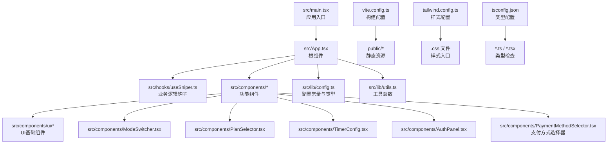
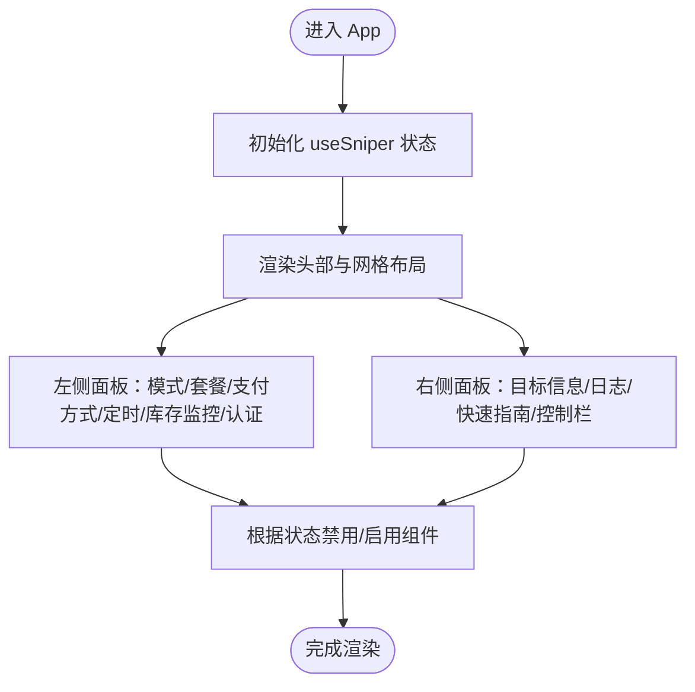
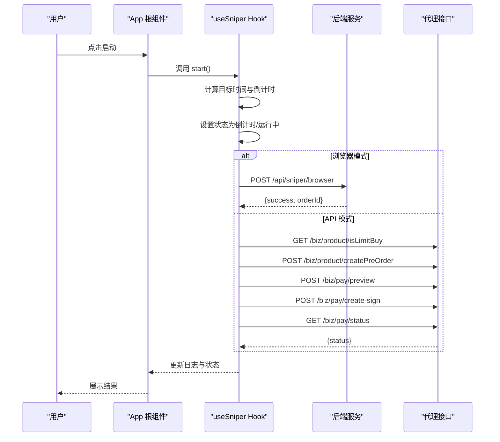
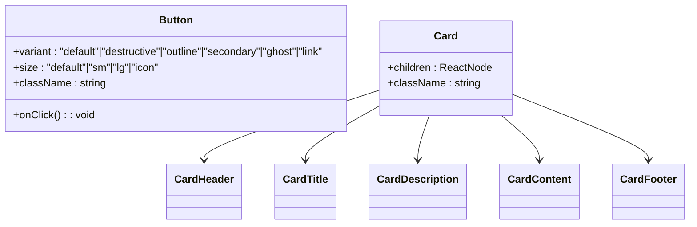
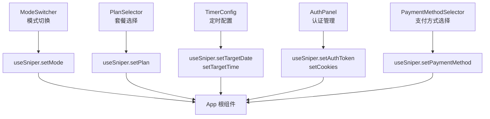
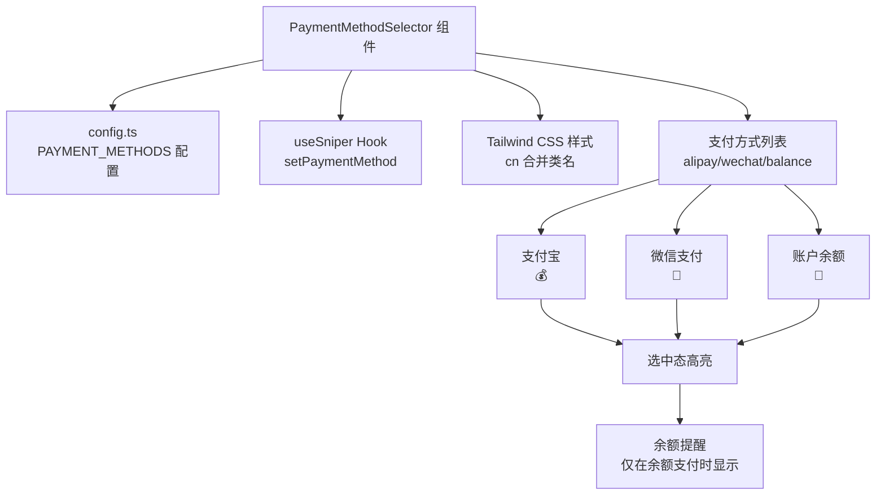
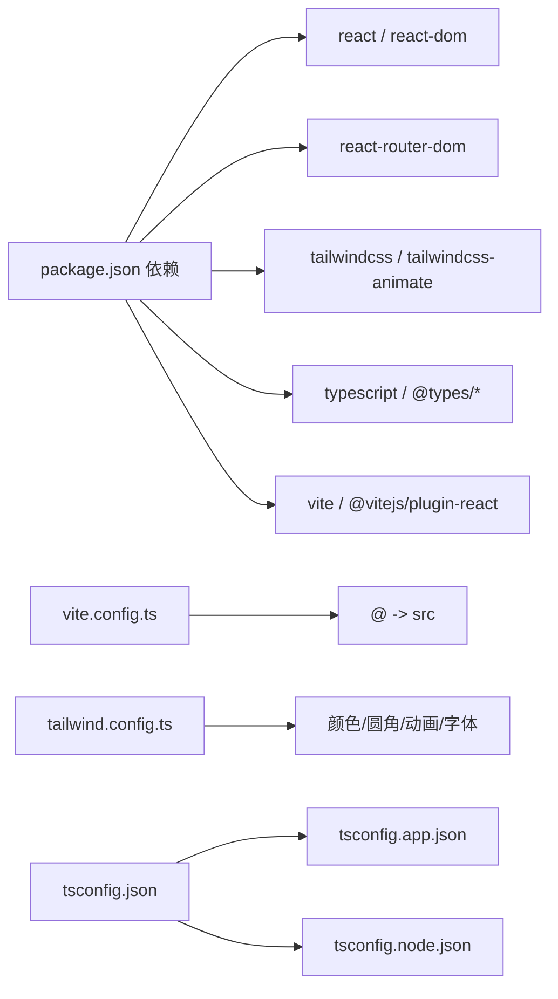

# 前端架构设计

<cite>
**本文档引用的文件**
- [package.json](file://package.json)
- [vite.config.ts](file://vite.config.ts)
- [tailwind.config.ts](file://tailwind.config.ts)
- [tsconfig.json](file://tsconfig.json)
- [src/main.tsx](file://src/main.tsx)
- [src/App.tsx](file://src/App.tsx)
- [src/hooks/useSniper.ts](file://src/hooks/useSniper.ts)
- [src/lib/config.ts](file://src/lib/config.ts)
- [src/lib/utils.ts](file://src/lib/utils.ts)
- [src/components/ui/button.tsx](file://src/components/ui/button.tsx)
- [src/components/ui/card.tsx](file://src/components/ui/card.tsx)
- [src/components/ModeSwitcher.tsx](file://src/components/ModeSwitcher.tsx)
- [src/components/PlanSelector.tsx](file://src/components/PlanSelector.tsx)
- [src/components/TimerConfig.tsx](file://src/components/TimerConfig.tsx)
- [src/components/AuthPanel.tsx](file://src/components/AuthPanel.tsx)
- [src/components/PaymentMethodSelector.tsx](file://src/components/PaymentMethodSelector.tsx)
</cite>

## 目录
1. [简介](#简介)
2. [项目结构](#项目结构)
3. [核心组件](#核心组件)
4. [架构总览](#架构总览)
5. [详细组件分析](#详细组件分析)
6. [依赖关系分析](#依赖关系分析)
7. [性能考虑](#性能考虑)
8. [故障排除指南](#故障排除指南)
9. [结论](#结论)

## 简介
本项目是一个基于 React 19 + TypeScript + Vite 的现代化前端应用，采用 Tailwind CSS 作为样式系统，提供 GLM Coding Plan 的抢购辅助工具。应用通过自定义 Hook 管理核心业务逻辑，组件化架构清晰，状态管理集中在单一 Hook 中，配合 Tailwind 实现高度一致的视觉与交互体验。

## 项目结构
项目采用按功能模块划分的目录组织方式，核心入口位于 src 目录，包含应用入口、根组件、组件库、Hook、工具函数与配置文件。构建系统由 Vite 提供，样式系统基于 Tailwind CSS，类型系统由 TypeScript 统一约束。



**图表来源**
- [src/main.tsx:1-11](file://src/main.tsx#L1-L11)
- [src/App.tsx:1-224](file://src/App.tsx#L1-L224)
- [vite.config.ts:1-13](file://vite.config.ts#L1-L13)
- [tailwind.config.ts:1-104](file://tailwind.config.ts#L1-L104)
- [tsconfig.json:1-8](file://tsconfig.json#L1-L8)

**章节来源**
- [package.json:1-48](file://package.json#L1-L48)
- [src/main.tsx:1-11](file://src/main.tsx#L1-L11)
- [vite.config.ts:1-13](file://vite.config.ts#L1-L13)
- [tailwind.config.ts:1-104](file://tailwind.config.ts#L1-L104)
- [tsconfig.json:1-8](file://tsconfig.json#L1-L8)

## 核心组件
- 根组件 App：负责整体布局、响应式网格系统、组件组合与状态传递；通过 useSniper 提供的状态与方法驱动各子组件。
- 自定义 Hook useSniper：集中管理抢购模式、套餐选择、支付周期、支付方式、定时配置、认证信息、日志记录、库存监控与启动/停止流程。
- UI 组件库：提供 Button、Card 等基础 UI 组件，统一风格与交互行为。
- 功能组件：ModeSwitcher、PlanSelector、TimerConfig、AuthPanel、PaymentMethodSelector 等，分别处理模式切换、套餐选择、定时配置、认证管理和支付方式选择。

**章节来源**
- [src/App.tsx:12-224](file://src/App.tsx#L12-L224)
- [src/hooks/useSniper.ts:46-478](file://src/hooks/useSniper.ts#L46-L478)
- [src/components/ui/button.tsx:1-49](file://src/components/ui/button.tsx#L1-L49)
- [src/components/ui/card.tsx:1-47](file://src/components/ui/card.tsx#L1-L47)
- [src/components/ModeSwitcher.tsx:1-62](file://src/components/ModeSwitcher.tsx#L1-L62)
- [src/components/PlanSelector.tsx:1-61](file://src/components/PlanSelector.tsx#L1-L61)
- [src/components/TimerConfig.tsx:1-99](file://src/components/TimerConfig.tsx#L1-L99)
- [src/components/AuthPanel.tsx:1-120](file://src/components/AuthPanel.tsx#L1-L120)
- [src/components/PaymentMethodSelector.tsx:1-55](file://src/components/PaymentMethodSelector.tsx#L1-L55)

## 架构总览
应用采用"根组件 + 自定义 Hook + 组件库"的分层架构。根组件负责布局与状态传递，Hook 负责业务逻辑与副作用，组件库提供可复用的基础 UI，功能组件围绕业务场景进行组合与封装。

```mermaid
graph TB
subgraph "视图层"
APP["App 根组件"]
UI["UI 组件库<br/>Button/Card"]
FEAT["功能组件<br/>ModeSwitcher/PlanSelector/TimerConfig/AuthPanel/PaymentMethodSelector"]
end
subgraph "状态与逻辑层"
HOOK["useSniper Hook<br/>状态/副作用/业务流程"]
CFG["配置与类型<br/>config.ts"]
UTIL["工具函数<br/>utils.ts"]
END
subgraph "基础设施"
VITE["Vite 构建与开发服务器"]
TAIL["Tailwind CSS 样式系统"]
TS["TypeScript 类型系统"]
end
APP --> HOOK
APP --> FEAT
FEAT --> UI
FEAT --> HOOK
HOOK --> CFG
HOOK --> UTIL
VITE --> APP
TAIL --> APP
TS --> APP
TS --> HOOK
TS --> FEAT
```

**图表来源**
- [src/App.tsx:12-224](file://src/App.tsx#L12-L224)
- [src/hooks/useSniper.ts:46-478](file://src/hooks/useSniper.ts#L46-L478)
- [src/lib/config.ts:1-147](file://src/lib/config.ts#L1-L147)
- [src/lib/utils.ts:1-51](file://src/lib/utils.ts#L1-L51)
- [vite.config.ts:1-13](file://vite.config.ts#L1-L13)
- [tailwind.config.ts:1-104](file://tailwind.config.ts#L1-L104)
- [tsconfig.json:1-8](file://tsconfig.json#L1-L8)

## 详细组件分析

### 根组件 App 的职责与布局
- 布局设计：采用相对定位的主容器，固定背景装饰元素与径向渐变光晕，确保视觉层次与品牌感。
- 响应式网格系统：使用 Tailwind 的栅格系统实现两列布局（左侧配置区，右侧日志与引导），在小屏设备上自动折叠为单列。
- 组件组合模式：通过条件渲染与类名控制运行态状态（如运行中/倒计时/待命），结合卡片与模糊背景提升可读性与沉浸感。
- 状态驱动：通过 useSniper 返回的状态与方法控制组件可用性与交互反馈。



**图表来源**
- [src/App.tsx:18-220](file://src/App.tsx#L18-L220)
- [src/hooks/useSniper.ts:57-60](file://src/hooks/useSniper.ts#L57-L60)

**章节来源**
- [src/App.tsx:12-224](file://src/App.tsx#L12-L224)

### 自定义 Hook useSniper 的状态管理与业务流程
- 状态管理：集中管理抢购模式、套餐类型、支付周期、支付方式、目标日期/时间、认证令牌/Cookies、日志列表、库存状态与监控开关等。
- 业务流程：
  - 倒计时与启动：计算目标时间与当前时间差，提前 2 秒触发执行，补偿网络延迟。
  - 浏览器模式：通过后端 API 发送 Playwright 控制指令，返回成功/失败日志。
  - API 模式：通过代理接口执行完整下单流程（预订单、支付预览、签约、状态查询），并内置验证码检测与重试机制。
  - 库存监控：轮询库存状态，命中目标套餐有货时自动触发抢购。
- 清理与健壮性：在组件卸载或停止时清理定时器，避免内存泄漏与重复执行。



**图表来源**
- [src/hooks/useSniper.ts:251-293](file://src/hooks/useSniper.ts#L251-L293)
- [src/hooks/useSniper.ts:77-106](file://src/hooks/useSniper.ts#L77-L106)
- [src/hooks/useSniper.ts:111-248](file://src/hooks/useSniper.ts#L111-L248)

**章节来源**
- [src/hooks/useSniper.ts:46-478](file://src/hooks/useSniper.ts#L46-L478)

### UI 组件库：Button 与 Card
- Button：基于 class-variance-authority 定义变体与尺寸，结合 cn 合并类名，支持多种语义与尺寸。
- Card：提供卡片容器与标题/描述/内容/页脚的标准结构，便于统一布局与样式。



**图表来源**
- [src/components/ui/button.tsx:5-49](file://src/components/ui/button.tsx#L5-L49)
- [src/components/ui/card.tsx:4-47](file://src/components/ui/card.tsx#L4-L47)

**章节来源**
- [src/components/ui/button.tsx:1-49](file://src/components/ui/button.tsx#L1-L49)
- [src/components/ui/card.tsx:1-47](file://src/components/ui/card.tsx#L1-L47)

### 功能组件：模式切换、套餐选择、定时配置、认证面板与支付方式选择器
- ModeSwitcher：在"浏览器自动化"与"API 高速模式"之间切换，高亮当前模式并提供禁用态控制。
- PlanSelector：展示 Lite/Pro/Max 三种套餐，支持徽标显示与选中态高亮，包含支付周期选择。
- TimerConfig：设置目标日期与时间，实时显示倒计时，并在过期时提示。
- AuthPanel：输入与管理认证 Token 与 Cookies，支持明文/密文切换与在线验证。
- PaymentMethodSelector：**新增** 支持支付宝、微信支付、账户余额三种支付方式的选择，提供图标与名称显示，支持选中态高亮与禁用控制。



**图表来源**
- [src/components/ModeSwitcher.tsx:10-61](file://src/components/ModeSwitcher.tsx#L10-L61)
- [src/components/PlanSelector.tsx:11-60](file://src/components/PlanSelector.tsx#L11-L60)
- [src/components/PaymentMethodSelector.tsx:11-55](file://src/components/PaymentMethodSelector.tsx#L11-L55)
- [src/components/TimerConfig.tsx:13-98](file://src/components/TimerConfig.tsx#L13-L98)
- [src/components/AuthPanel.tsx:14-119](file://src/components/AuthPanel.tsx#L14-L119)
- [src/hooks/useSniper.ts:51-58](file://src/hooks/useSniper.ts#L51-L58)

**章节来源**
- [src/components/ModeSwitcher.tsx:1-62](file://src/components/ModeSwitcher.tsx#L1-L62)
- [src/components/PlanSelector.tsx:1-61](file://src/components/PlanSelector.tsx#L1-L61)
- [src/components/PaymentMethodSelector.tsx:1-55](file://src/components/PaymentMethodSelector.tsx#L1-L55)
- [src/components/TimerConfig.tsx:1-99](file://src/components/TimerConfig.tsx#L1-L99)
- [src/components/AuthPanel.tsx:1-120](file://src/components/AuthPanel.tsx#L1-L120)

### 支付方式选择器组件架构设计
**新增** PaymentMethodSelector 是一个专门用于支付方式选择的功能组件，具有以下架构特点：

- **类型安全设计**：使用 TypeScript 接口定义 props 类型，确保 paymentMethod 和 onPaymentMethodChange 的类型正确性。
- **配置驱动**：从 config.ts 中导入 PAYMENT_METHODS 配置对象，支持动态添加新的支付方式。
- **状态管理集成**：通过 useSniper 钩子的状态管理，实现支付方式的实时更新与持久化。
- **响应式交互**：提供选中态高亮、禁用态控制、悬停效果等完整的用户交互反馈。
- **条件渲染**：当选择账户余额支付时，显示余额充足性提醒信息。



**图表来源**
- [src/components/PaymentMethodSelector.tsx:11-55](file://src/components/PaymentMethodSelector.tsx#L11-L55)
- [src/lib/config.ts:85-90](file://src/lib/config.ts#L85-L90)
- [src/hooks/useSniper.ts:28-29](file://src/hooks/useSniper.ts#L28-L29)

**章节来源**
- [src/components/PaymentMethodSelector.tsx:1-55](file://src/components/PaymentMethodSelector.tsx#L1-L55)
- [src/lib/config.ts:85-90](file://src/lib/config.ts#L85-L90)

## 依赖关系分析
- 构建与开发：Vite 提供开发服务器与热更新，路径别名 @ 指向 src 目录，简化导入路径。
- 样式系统：Tailwind CSS 通过配置文件扩展颜色、圆角、字体与动画，插件 tailwindcss-animate 提供开箱即用的动画能力。
- 类型系统：多份 tsconfig 引用，分别覆盖应用与 Node 环境，确保严格类型检查与模块解析。



**图表来源**
- [package.json:14-46](file://package.json#L14-L46)
- [vite.config.ts:7-12](file://vite.config.ts#L7-L12)
- [tailwind.config.ts:10-101](file://tailwind.config.ts#L10-L101)
- [tsconfig.json:2-7](file://tsconfig.json#L2-L7)

**章节来源**
- [package.json:1-48](file://package.json#L1-L48)
- [vite.config.ts:1-13](file://vite.config.ts#L1-L13)
- [tailwind.config.ts:1-104](file://tailwind.config.ts#L1-L104)
- [tsconfig.json:1-8](file://tsconfig.json#L1-L8)

## 性能考虑
- 构建优化：Vite 默认启用模块热替换与按需打包，减少开发时等待时间；生产构建通过 Rollup 进行代码分割与压缩。
- 样式体积：Tailwind 仅在指定内容范围内扫描，避免无用样式的引入；通过 twMerge 合并类名，减少冗余样式。
- 逻辑优化：useSniper 内部使用 useCallback 与 useRef，降低重渲染与闭包开销；定时器在组件卸载时清理，避免内存泄漏。
- 网络请求：API 模式通过代理接口绕过跨域限制，减少额外中间层；浏览器模式通过后端统一调度，降低前端复杂度。

## 故障排除指南
- 后端服务未启动：浏览器模式与库存监控均依赖本地后端服务，若出现连接失败，请确认后端服务已启动。
- 认证无效：API 模式需要有效的 Authorization Token，可通过验证按钮检查有效性；若返回 401/403，请重新获取。
- 验证码拦截：当预订单创建失败且响应包含验证码相关关键词时，系统会提示验证码拦截，建议前往官网完成验证后再重试。
- 定时器异常：若倒计时不准确或无法启动，请检查目标时间是否已过期，以及网络延迟补偿逻辑是否生效。
- 日志查看：通过日志控制台查看详细流程与错误信息，便于定位问题。
- 支付方式问题：若支付方式选择异常，检查 PAYMENT_METHODS 配置是否正确，以及组件 props 传入是否符合预期。

**章节来源**
- [src/hooks/useSniper.ts:101-106](file://src/hooks/useSniper.ts#L101-L106)
- [src/hooks/useSniper.ts:157-167](file://src/hooks/useSniper.ts#L157-L167)
- [src/components/AuthPanel.tsx:18-41](file://src/components/AuthPanel.tsx#L18-L41)
- [src/components/PaymentMethodSelector.tsx:48-52](file://src/components/PaymentMethodSelector.tsx#L48-L52)

## 结论
本项目以 React 19 + TypeScript + Vite 为基础，结合 Tailwind CSS 实现了高内聚、低耦合的前端架构。根组件 App 通过 useSniper 钩子集中管理业务逻辑，组件库与功能组件形成清晰的分层结构。新增的 PaymentMethodSelector 组件进一步完善了支付流程的用户体验，通过配置驱动的方式支持多种支付方式的灵活选择。

构建系统与样式系统配置简洁高效，类型系统保障了代码质量与可维护性。整体架构适合在类似场景下复用与扩展，支付方式选择器的加入使得应用在功能完整性方面得到了显著提升。