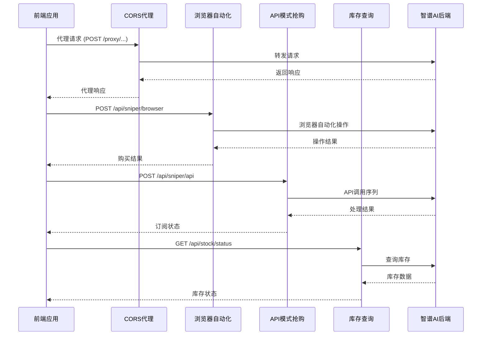
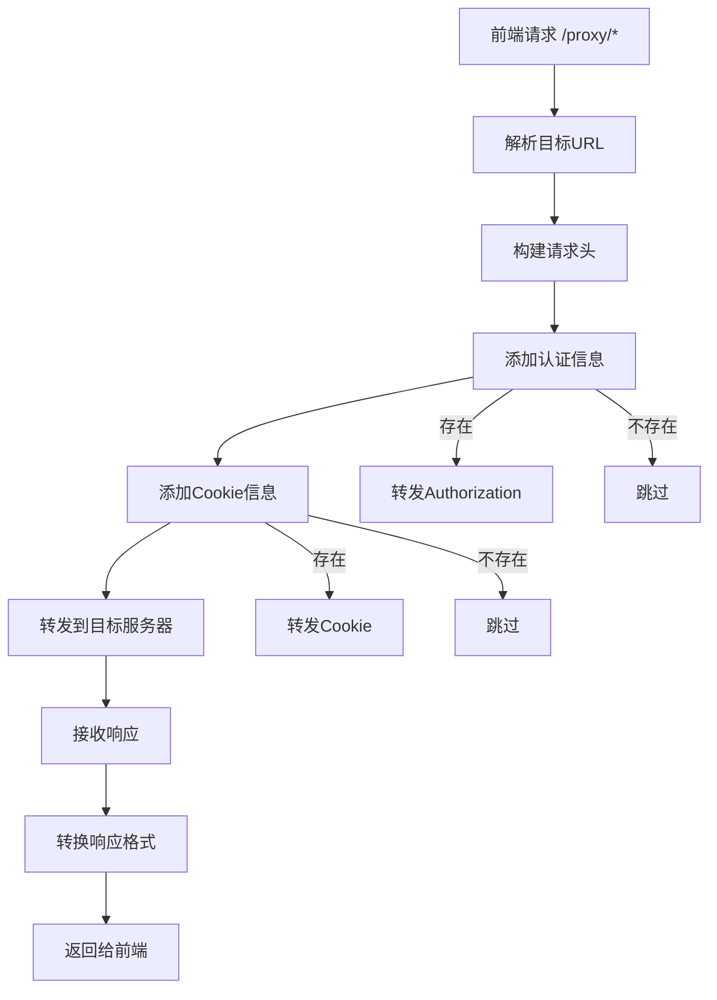
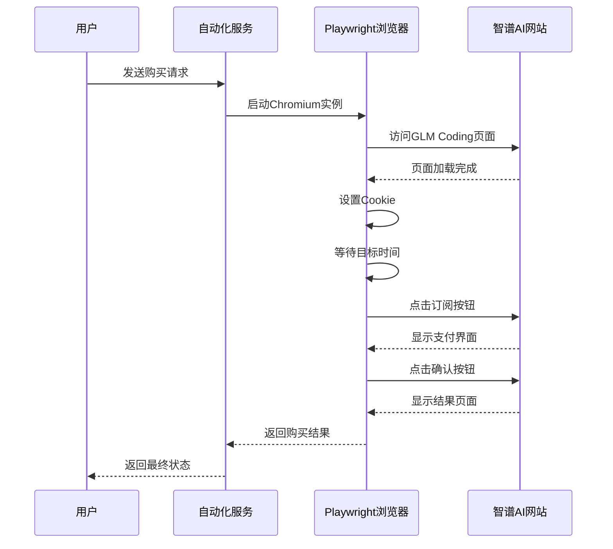
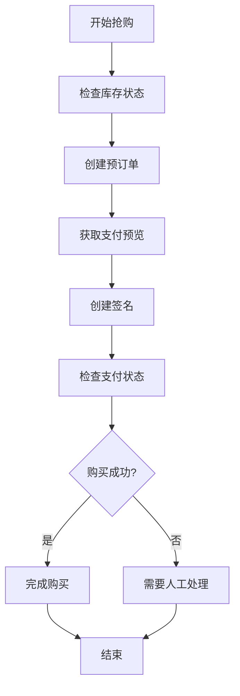
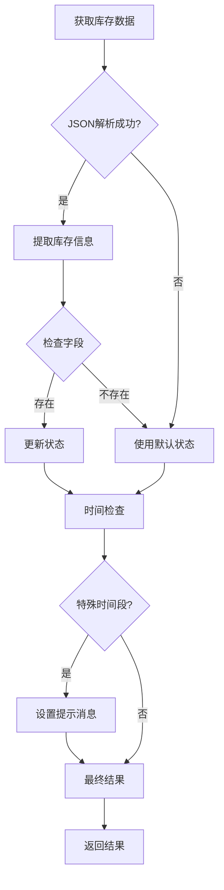

# 后端架构设计

<cite>
**本文档引用的文件**
- [server/index.ts](file://server/index.ts)
- [package.json](file://package.json)
- [src/lib/config.ts](file://src/lib/config.ts)
- [src/lib/utils.ts](file://src/lib/utils.ts)
- [src/hooks/useSniper.ts](file://src/hooks/useSniper.ts)
- [src/components/AuthPanel.tsx](file://src/components/AuthPanel.tsx)
- [src/components/StockMonitor.tsx](file://src/components/StockMonitor.tsx)
- [src/App.tsx](file://src/App.tsx)
- [tsconfig.server.json](file://tsconfig.server.json)
- [vite.config.ts](file://vite.config.ts)
</cite>

## 目录
1. [简介](#简介)
2. [项目结构](#项目结构)
3. [核心组件](#核心组件)
4. [架构总览](#架构总览)
5. [详细组件分析](#详细组件分析)
6. [依赖关系分析](#依赖关系分析)
7. [性能考虑](#性能考虑)
8. [故障排除指南](#故障排除指南)
9. [结论](#结论)

## 简介
本项目是一个基于 Express.js 的 GLM Sniper 后端服务，提供以下核心能力：
- CORS 代理服务：绕过浏览器同源策略限制，代理访问智谱AI开放平台接口
- 浏览器自动化服务：通过 Playwright 实现智能体套餐的自动化购买流程
- 库存查询服务：实时查询智谱AI套餐库存状态，支持定时监控
- RESTful API 设计：清晰的接口规范，便于前端调用
- 安全考虑：认证机制、请求验证、防护措施

该服务采用 TypeScript 编写，使用 Express 5.2.1 构建，配合 Playwright 实现浏览器自动化，为前端提供稳定可靠的后端支撑。

## 项目结构
项目采用前后端分离的架构设计，主要目录结构如下：

```mermaid
graph TB
subgraph "项目根目录"
A[server/] -- 后端服务代码
B[src/] -- 前端代码
C[public/] -- 静态资源
D[*.json] -- 配置文件
end
subgraph "server/"
A1[index.ts] -- 主入口文件
end
subgraph "src/"
B1[lib/] -- 配置和工具库
B2[components/] -- React 组件
B3[hooks/] -- 自定义 Hook
B4[assets/] -- 资源文件
end
subgraph "src/lib/"
B11[config.ts] -- 配置常量
B12[utils.ts] -- 工具函数
end
subgraph "src/components/"
B21[ui/] -- UI 组件
B22[AuthPanel.tsx] -- 认证面板
B23[StockMonitor.tsx] -- 库存监控
B24[useSniper.ts] -- 核心逻辑 Hook
end
```

**图表来源**
- [server/index.ts:1-370](file://server/index.ts#L1-L370)
- [src/lib/config.ts:1-104](file://src/lib/config.ts#L1-L104)
- [src/lib/utils.ts:1-51](file://src/lib/utils.ts#L1-L51)

**章节来源**
- [server/index.ts:1-370](file://server/index.ts#L1-L370)
- [package.json:1-48](file://package.json#L1-L48)

## 核心组件
后端服务包含四个主要组件，每个组件都有明确的职责划分：

### 1. CORS 代理服务
- **职责**：绕过浏览器同源策略限制，代理访问智谱AI开放平台接口
- **实现**：基于 Express 中间件，统一处理所有以 `/proxy` 开头的请求
- **特点**：自动转发授权头和 Cookie，支持所有 HTTP 方法

### 2. 浏览器自动化服务
- **职责**：通过 Playwright 实现智能体套餐的完整购买流程
- **实现**：启动 Chromium 浏览器，模拟用户操作完成订阅
- **特点**：支持自定义目标时间和 Cookie 注入，具备容错机制

### 3. API 模式抢购服务
- **职责**：直接通过 API 接口完成套餐订阅，无需浏览器参与
- **实现**：按步骤执行库存检查、预订单创建、支付预览、签名确认等操作
- **特点**：完整的业务流程封装，包含错误处理和重试机制

### 4. 库存查询服务
- **职责**：实时查询智谱AI套餐的库存状态
- **实现**：定期轮询库存接口，解析返回数据并提供友好的状态展示
- **特点**：支持定时监控，自动检测补货时机

**章节来源**
- [server/index.ts:10-355](file://server/index.ts#L10-L355)
- [src/lib/config.ts:18-101](file://src/lib/config.ts#L18-L101)

## 架构总览
系统采用分层架构设计，从前端到后端的交互流程如下：



**图表来源**
- [server/index.ts:12-355](file://server/index.ts#L12-L355)
- [src/hooks/useSniper.ts:77-248](file://src/hooks/useSniper.ts#L77-L248)

## 详细组件分析

### CORS 代理机制详解
CORS 代理是整个系统的核心组件，负责解决浏览器同源策略限制问题。

#### 实现原理


**图表来源**
- [server/index.ts:12-40](file://server/index.ts#L12-L40)

#### 关键特性
- **动态目标地址**：将 `/proxy` 路径自动转换为 `https://open.bigmodel.cn` 的对应路径
- **请求头转发**：自动转发 `Authorization` 和 `Cookie` 头部信息
- **方法兼容**：支持所有 HTTP 方法，包括 GET、POST、PUT、DELETE
- **错误处理**：统一的错误捕获和响应格式化

**章节来源**
- [server/index.ts:12-40](file://server/index.ts#L12-L40)

### 浏览器自动化服务
浏览器自动化服务通过 Playwright 实现完整的购买流程，模拟真实用户操作。

#### 自动化流程


**图表来源**
- [server/index.ts:43-159](file://server/index.ts#L43-L159)

#### 核心功能
- **目标时间等待**：支持精确到毫秒的时间同步，提前2秒唤醒确保网络延迟
- **多选择器策略**：针对不同的页面布局，提供多种元素定位策略
- **Cookie 注入**：支持从浏览器复制的 Cookie 直接注入到自动化会话
- **状态检测**：通过页面内容检测判断购买是否成功

**章节来源**
- [server/index.ts:43-159](file://server/index.ts#L43-L159)

### API 模式抢购服务
API 模式通过直接调用智谱AI的内部 API 完成购买，具有更高的效率和稳定性。

#### 业务流程


**图表来源**
- [server/index.ts:162-250](file://server/index.ts#L162-L250)

#### 步骤详解
1. **库存检查**：调用 `isLimitBuy` 接口检查是否可以购买
2. **预订单创建**：调用 `createPreOrder` 接口创建购买订单
3. **支付预览**：调用 `preview` 接口获取支付详情
4. **签名确认**：调用 `create-sign` 接口确认购买
5. **状态查询**：轮询 `status` 接口检查支付结果

**章节来源**
- [server/index.ts:162-250](file://server/index.ts#L162-L250)

### 库存查询服务
库存查询服务提供实时的套餐库存状态监控，支持定时轮询和手动查询。

#### 数据解析逻辑


**图表来源**
- [server/index.ts:253-355](file://server/index.ts#L253-L355)

#### 特殊时间处理
- **9:55-10:01**：显示"即将补货（约 10:00）"提示
- **10:00-10:05**：库存状态显示为"检查中..."

**章节来源**
- [server/index.ts:253-355](file://server/index.ts#L253-L355)

## 依赖关系分析

### 依赖层次结构
```mermaid
graph TB
subgraph "外部依赖"
A[Express 5.2.1] -- Web框架
B[CORS] -- 跨域支持
C[Playwright] -- 浏览器自动化
D[Cookie-parse] -- Cookie解析
end
subgraph "内部模块"
E[server/index.ts] -- 主服务
F[src/lib/config.ts] -- 配置常量
G[src/lib/utils.ts] -- 工具函数
H[src/hooks/useSniper.ts] -- 核心逻辑
end
subgraph "前端组件"
I[AuthPanel] -- 认证管理
J[StockMonitor] -- 库存监控
K[useSniper] -- 业务逻辑
end
A --> E
C --> E
F --> E
G --> E
H --> E
I --> H
J --> H
K --> H
```

**图表来源**
- [package.json:14-26](file://package.json#L14-L26)
- [server/index.ts:1-6](file://server/index.ts#L1-L6)

### 模块耦合度分析
- **低耦合**：各服务模块相对独立，通过明确的 API 接口交互
- **高内聚**：每个服务专注于单一职责，功能完整且自包含
- **依赖方向**：前端 -> 后端服务 -> 智谱AI后端

**章节来源**
- [package.json:14-26](file://package.json#L14-L26)
- [server/index.ts:1-370](file://server/index.ts#L1-L370)

## 性能考虑
基于对代码的分析，系统在性能方面有以下特点：

### 1. 内存管理
- **浏览器实例管理**：Playwright 浏览器实例在使用后及时关闭，避免内存泄漏
- **定时器清理**：所有定时器在组件卸载时正确清理

### 2. 网络优化
- **代理缓存**：CORS 代理直接转发响应，减少不必要的数据处理
- **批量请求**：API 模式下按步骤顺序执行，避免并发冲突

### 3. 错误恢复
- **自动重试**：API 模式下对预订单创建失败进行最多5次重试
- **超时处理**：Playwright 元素查找设置合理超时时间

## 故障排除指南

### 常见问题及解决方案

#### 1. CORS 代理错误
**症状**：前端调用 `/proxy` 接口返回跨域错误
**原因**：代理服务未正确配置或网络连接问题
**解决方案**：
- 确认后端服务已启动 (`npm run server`)
- 检查代理目标 URL 是否正确
- 验证网络连接和防火墙设置

#### 2. 浏览器自动化失败
**症状**：`/api/sniper/browser` 接口返回错误
**原因**：Playwright 依赖缺失或浏览器启动失败
**解决方案**：
- 安装 Playwright 依赖：`npx playwright install`
- 检查 Chromium 可执行文件路径
- 验证 Cookie 格式是否正确

#### 3. API 模式购买失败
**症状**：`/api/sniper/api` 接口返回购买失败
**原因**：认证令牌无效或验证码拦截
**解决方案**：
- 重新获取有效的认证令牌
- 手动完成验证码验证
- 检查账户余额和支付方式

#### 4. 库存查询异常
**症状**：`/api/stock/status` 接口返回错误
**原因**：智谱AI后端接口变更或网络问题
**解决方案**：
- 检查智谱AI服务状态
- 稍后重试查询
- 更新 API 端点配置

**章节来源**
- [server/index.ts:37-40](file://server/index.ts#L37-L40)
- [src/hooks/useSniper.ts:157-177](file://src/hooks/useSniper.ts#L157-L177)

## 结论
GLM Sniper 后端架构设计合理，实现了以下关键目标：

### 架构优势
- **模块化设计**：四个核心服务职责清晰，便于维护和扩展
- **安全性考虑**：通过代理层隐藏真实 API，提供基础的安全保护
- **用户体验**：提供两种抢购模式，满足不同用户需求
- **错误处理**：完善的错误捕获和用户反馈机制

### 技术亮点
- **CORS 代理机制**：优雅解决跨域问题，保持 API 的透明性
- **浏览器自动化**：实现完整的用户操作模拟，提高成功率
- **库存监控**：智能化的库存状态检测和提醒机制
- **类型安全**：完整的 TypeScript 类型定义，提升开发体验

### 改进建议
- **配置管理**：引入环境变量配置，支持生产环境部署
- **日志系统**：集成结构化日志记录，便于问题排查
- **监控告警**：添加健康检查和性能监控
- **测试覆盖**：增加单元测试和集成测试

该架构为前端提供了稳定可靠的服务支撑，通过合理的模块划分和错误处理机制，确保了系统的可用性和用户体验。