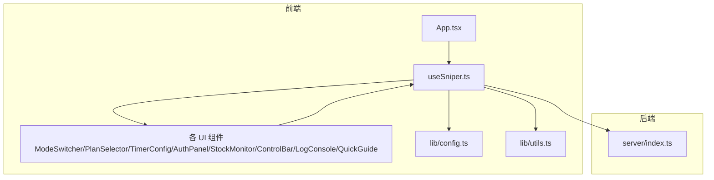
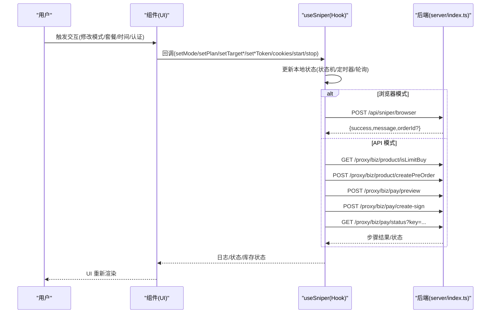
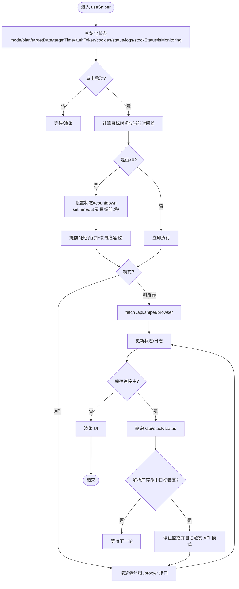
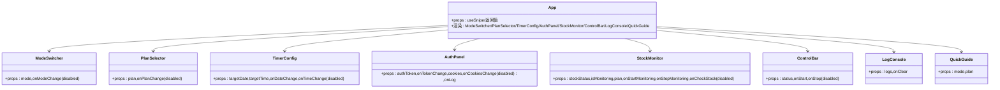
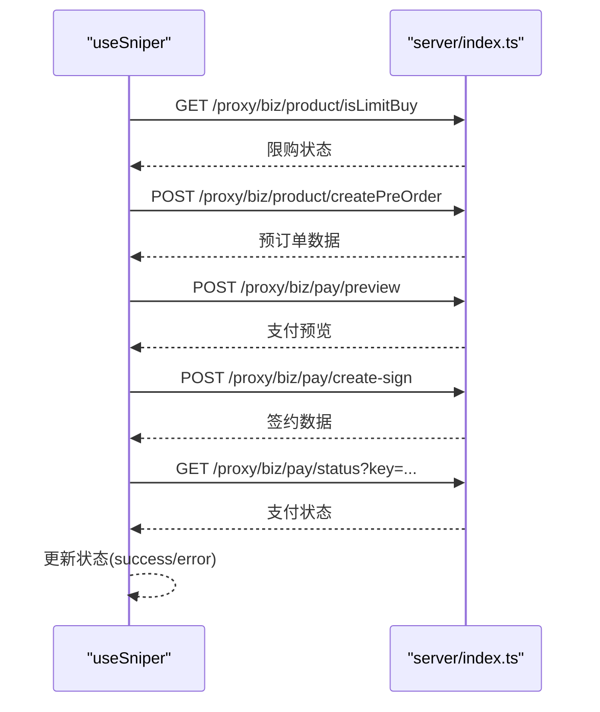
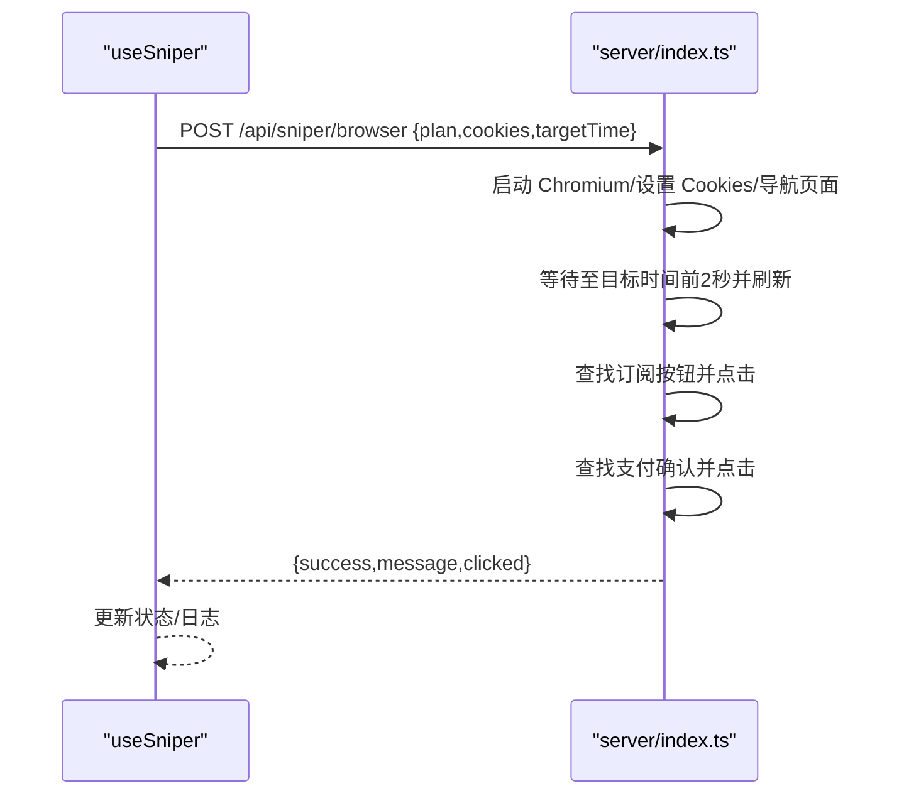
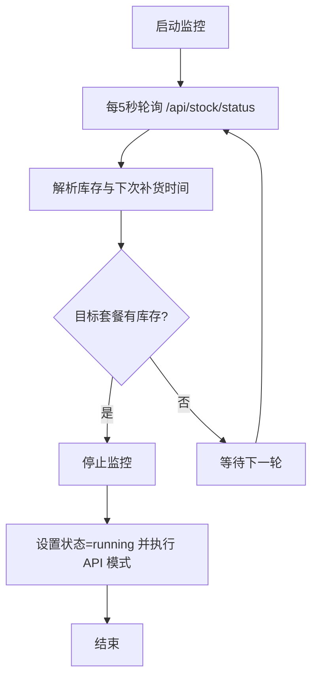
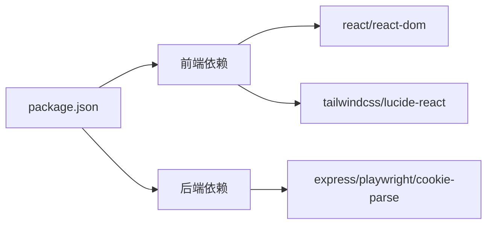

# 数据流设计

<cite>
**本文引用的文件**
- [README.md](file://README.md)
- [package.json](file://package.json)
- [src/App.tsx](file://src/App.tsx)
- [src/hooks/useSniper.ts](file://src/hooks/useSniper.ts)
- [src/lib/config.ts](file://src/lib/config.ts)
- [src/lib/utils.ts](file://src/lib/utils.ts)
- [src/components/ControlBar.tsx](file://src/components/ControlBar.tsx)
- [src/components/StockMonitor.tsx](file://src/components/StockMonitor.tsx)
- [src/components/AuthPanel.tsx](file://src/components/AuthPanel.tsx)
- [src/components/LogConsole.tsx](file://src/components/LogConsole.tsx)
- [src/components/ModeSwitcher.tsx](file://src/components/ModeSwitcher.tsx)
- [src/components/PlanSelector.tsx](file://src/components/PlanSelector.tsx)
- [src/components/TimerConfig.tsx](file://src/components/TimerConfig.tsx)
- [src/components/QuickGuide.tsx](file://src/components/QuickGuide.tsx)
- [server/index.ts](file://server/index.ts)
</cite>

## 目录
1. [简介](#简介)
2. [项目结构](#项目结构)
3. [核心组件](#核心组件)
4. [架构总览](#架构总览)
5. [详细组件分析](#详细组件分析)
6. [依赖关系分析](#依赖关系分析)
7. [性能考量](#性能考量)
8. [故障排查指南](#故障排查指南)
9. [结论](#结论)
10. [附录](#附录)

## 简介
本文件系统性梳理 GLM Sniper 的数据流设计与处理机制，覆盖从用户交互到最终 UI 更新的完整链路，包括事件捕获、状态变更、副作用执行、UI 重新渲染；解释本地状态、远程 API、浏览器存储、服务器推送等多源数据的处理方式；文档化输入验证、数据格式化与错误处理；并给出缓存策略、性能优化（批量更新、防抖节流、内存管理）建议。

## 项目结构
- 前端采用 React + TypeScript + Vite 架构，核心逻辑集中在自定义 Hook useSniper 中，UI 组件通过 props 与回调与 Hook 交互。
- 后端基于 Express 提供 API 代理、浏览器自动化、库存查询等能力，前端通过本地 3100 端口访问。
- 关键数据模型与常量集中于 lib/config.ts，通用工具函数位于 lib/utils.ts。

图表来源
- [src/App.tsx:12-194](file://src/App.tsx#L12-L194)
- [src/hooks/useSniper.ts:46-406](file://src/hooks/useSniper.ts#L46-L406)
- [src/lib/config.ts:1-104](file://src/lib/config.ts#L1-L104)
- [src/lib/utils.ts:1-51](file://src/lib/utils.ts#L1-L51)
- [server/index.ts:1-370](file://server/index.ts#L1-L370)

章节来源
- [README.md:1-74](file://README.md#L1-L74)
- [package.json:1-48](file://package.json#L1-L48)

## 核心组件
- useSniper：集中管理抢购模式、套餐、定时目标、认证信息、日志、库存状态、运行状态与各类副作用（定时器、轮询、API 调用）。提供 start/stop、库存监控、日志增删等方法。
- App：作为根容器，将 useSniper 返回的状态与回调注入到各个子组件，驱动 UI 渲染与交互。
- 各 UI 组件：ModeSwitcher、PlanSelector、TimerConfig、AuthPanel、StockMonitor、ControlBar、LogConsole、QuickGuide，负责用户输入、展示状态与触发动作。
- server：提供 /proxy、/api/sniper/browser、/api/sniper/api、/api/stock/status 等接口，支撑前端数据与业务流程。

章节来源
- [src/hooks/useSniper.ts:46-406](file://src/hooks/useSniper.ts#L46-L406)
- [src/App.tsx:12-194](file://src/App.tsx#L12-L194)
- [server/index.ts:10-370](file://server/index.ts#L10-L370)

## 架构总览
前端通过 useSniper 统一调度，按模式（浏览器自动化或 API 高速）执行不同流程；后端提供代理与自动化能力，前端仅需关注状态与 UI。

图表来源
- [src/hooks/useSniper.ts:76-248](file://src/hooks/useSniper.ts#L76-L248)
- [server/index.ts:42-159](file://server/index.ts#L42-L159)
- [server/index.ts:161-250](file://server/index.ts#L161-L250)

## 详细组件分析

### useSniper 数据流与状态机
- 状态模型
  - 模式：browser | api
  - 套餐：lite | pro | max
  - 时间：targetDate/targetTime
  - 认证：authToken | cookies
  - 状态：idle | countdown | running | success | error
  - 日志：LogEntry[]
  - 库存：StockStatus | null
  - 监控：isMonitoring + 轮询定时器
- 关键流程
  - 启动(start)：计算目标时间与当前时间差，若>0则倒计时至目标时间前2秒执行；否则立即执行。根据模式调用浏览器自动化或 API 高速流程。
  - 停止(stop)：设置中断标志，清理定时器，置 idle。
  - API 高速：按步骤检查限购、创建预订单、支付预览、创建签约、轮询支付状态；对验证码/403等进行识别与重试控制。
  - 浏览器自动化：通过 Playwright 登录态 + Cookies，自动点击订阅与支付确认。
  - 库存监控：轮询 /api/stock/status，解析库存与下次补货时间；命中目标套餐且处于监控时，自动触发 API 模式抢购。
  - 日志：统一 createLog 生成带时间戳的日志条目，追加到 logs 并自动滚动到底部。
- 数据来源与去向
  - 本地状态：useState 管理的 UI 状态与状态机。
  - 远程 API：/proxy/*、/api/sniper/browser、/api/sniper/api、/api/stock/status。
  - 浏览器存储：Cookies（浏览器模式）。
  - 服务器推送：无实时推送，库存监控为轮询。
- 输入验证与转换
  - 时间校验：日期范围限制(最小明天，最大30天后)，时间格式 HH:mm。
  - 认证校验：AuthPanel 调用 /proxy/api/biz/subscription/list 验证 Token 有效性。
  - 错误处理：对验证码关键字检测、HTTP 状态码分支、异常捕获与重试上限。
- 缓存策略
  - 状态缓存：useSniper 内部状态即缓存，组件通过 props 读取。
  - API 缓存：未实现客户端缓存；可通过后端代理层增加缓存策略。
  - 本地存储：未见持久化存储；可在需要时引入 localStorage/sessionStorage。
- 性能优化
  - 批量更新：日志追加使用不可变更新，避免不必要的深层拷贝。
  - 防抖/节流：库存轮询固定 5 秒；倒计时定时器在 start/stop 中清理。
  - 内存管理：cleanup 清理定时器；stop 设置中断标志避免后续副作用继续执行。

图表来源
- [src/hooks/useSniper.ts:250-384](file://src/hooks/useSniper.ts#L250-L384)
- [src/hooks/useSniper.ts:318-372](file://src/hooks/useSniper.ts#L318-L372)
- [server/index.ts:252-355](file://server/index.ts#L252-L355)

章节来源
- [src/hooks/useSniper.ts:46-406](file://src/hooks/useSniper.ts#L46-L406)
- [src/lib/config.ts:6-26](file://src/lib/config.ts#L6-L26)
- [src/lib/utils.ts:20-27](file://src/lib/utils.ts#L20-L27)

### App 与组件数据绑定
- App 将 useSniper 的状态与回调注入到 ModeSwitcher、PlanSelector、TimerConfig、AuthPanel、StockMonitor、ControlBar、LogConsole、QuickGuide。
- 控制栏根据 status 动态显示“就绪/倒计时中/抢购中/抢购成功/出错”，并启用/禁用启动/停止按钮。
- 日志面板自动滚动到底部，保证最新日志可见。

图表来源
- [src/App.tsx:75-184](file://src/App.tsx#L75-L184)
- [src/components/ModeSwitcher.tsx:10-61](file://src/components/ModeSwitcher.tsx#L10-L61)
- [src/components/PlanSelector.tsx:11-60](file://src/components/PlanSelector.tsx#L11-L60)
- [src/components/TimerConfig.tsx:13-98](file://src/components/TimerConfig.tsx#L13-L98)
- [src/components/AuthPanel.tsx:14-119](file://src/components/AuthPanel.tsx#L14-L119)
- [src/components/StockMonitor.tsx:27-139](file://src/components/StockMonitor.tsx#L27-L139)
- [src/components/ControlBar.tsx:11-75](file://src/components/ControlBar.tsx#L11-L75)
- [src/components/LogConsole.tsx:17-77](file://src/components/LogConsole.tsx#L17-L77)
- [src/components/QuickGuide.tsx:8-55](file://src/components/QuickGuide.tsx#L8-L55)

章节来源
- [src/App.tsx:12-194](file://src/App.tsx#L12-L194)

### API 调用序列（API 模式）

图表来源
- [src/hooks/useSniper.ts:110-248](file://src/hooks/useSniper.ts#L110-L248)
- [server/index.ts:10-40](file://server/index.ts#L10-L40)

### 浏览器自动化序列（浏览器模式）

图表来源
- [src/hooks/useSniper.ts:76-106](file://src/hooks/useSniper.ts#L76-L106)
- [server/index.ts:42-159](file://server/index.ts#L42-L159)

### 库存监控流程

图表来源
- [src/hooks/useSniper.ts:318-372](file://src/hooks/useSniper.ts#L318-L372)
- [server/index.ts:252-355](file://server/index.ts#L252-L355)

## 依赖关系分析
- 前端依赖
  - React、React DOM、TailwindCSS、Lucide React 等运行时依赖。
  - 开发依赖包含 TypeScript、ESLint、Vite、Tailwind 等构建与开发工具。
- 后端依赖
  - Express、CORS、Playwright、cookie-parse 等。
- 脚本
  - dev/build/lint/preview/server/start 等脚本用于开发与联调。

图表来源
- [package.json:14-46](file://package.json#L14-L46)

章节来源
- [package.json:1-48](file://package.json#L1-L48)

## 性能考量
- 批量更新
  - 日志追加使用不可变数组拼接，避免深层拷贝；如日志量较大，可考虑分页或尾部截断。
- 防抖/节流
  - 库存轮询固定 5 秒；倒计时定时器在 start/stop 中清理，避免重复任务。
- 内存管理
  - cleanup 中清理主定时器与监控定时器；stop 设置中断标志，防止后续副作用继续执行。
- 网络与延迟
  - API 模式在目标时间前 2 秒提前执行以补偿网络延迟；浏览器模式同样在目标前 2 秒唤醒并刷新页面。
- 可扩展优化
  - 引入重试退避策略与指数退避；
  - 对高频 UI 组件使用 memo 化；
  - 对日志面板做虚拟滚动；
  - 对库存轮询增加并发控制与去抖。

## 故障排查指南
- 启动后端服务
  - 使用脚本启动后端：npm run server；确认端口 3100 正常监听。
- 认证失败
  - 在 AuthPanel 中验证 Token；若失败，检查 Authorization 头是否正确传递到 /proxy/*。
- 验证码拦截
  - API 模式：检测到验证码相关关键字时，提示前往官网手动完成验证后再重试。
  - 浏览器模式：Playwright 会暂停等待人工完成拼图验证。
- 库存监控无效
  - 确认 /api/stock/status 可正常访问；检查解析逻辑是否匹配实际返回结构。
- 页面空白或样式异常
  - 检查 Tailwind 配置与构建产物；确认静态资源路径正确。

章节来源
- [src/hooks/useSniper.ts:157-177](file://src/hooks/useSniper.ts#L157-L177)
- [src/components/AuthPanel.tsx:18-41](file://src/components/AuthPanel.tsx#L18-L41)
- [server/index.ts:252-355](file://server/index.ts#L252-L355)

## 结论
本项目通过 useSniper 将复杂的抢购流程抽象为清晰的状态机与副作用编排，结合 UI 组件完成从用户输入到最终 UI 更新的闭环。后端提供代理与自动化能力，满足跨域与高并发场景。建议在现有基础上引入更完善的缓存与重试策略、日志虚拟化与 UI 组件 memo 化，进一步提升稳定性与性能。

## 附录
- 数据模型与常量
  - 类型：SniperMode、PlanType、SniperStatus、LogEntry
  - 配置：PLANS、PRODUCT_IDS、getDefaultProductId、API_ENDPOINTS、STOCK_CHECK_IDS
  - 工具：createLog、formatTime、formatCountdown、getTargetDateTime
- 组件清单
  - ModeSwitcher、PlanSelector、TimerConfig、AuthPanel、StockMonitor、ControlBar、LogConsole、QuickGuide

章节来源
- [src/lib/config.ts:6-104](file://src/lib/config.ts#L6-L104)
- [src/lib/utils.ts:5-51](file://src/lib/utils.ts#L5-L51)