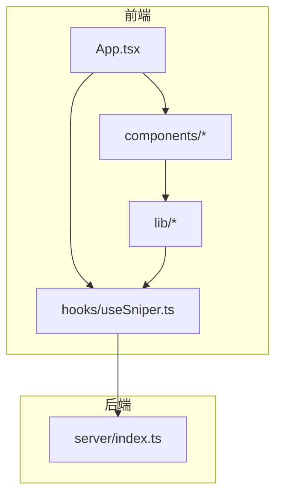
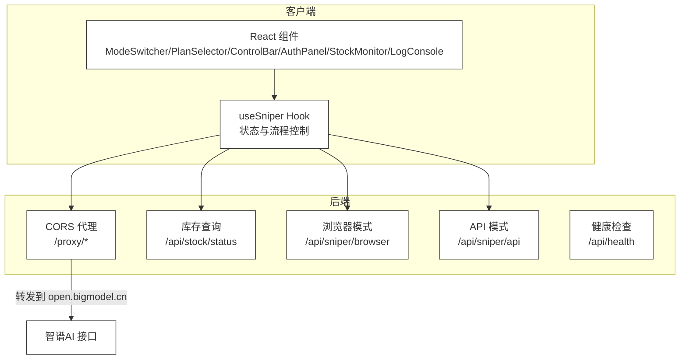
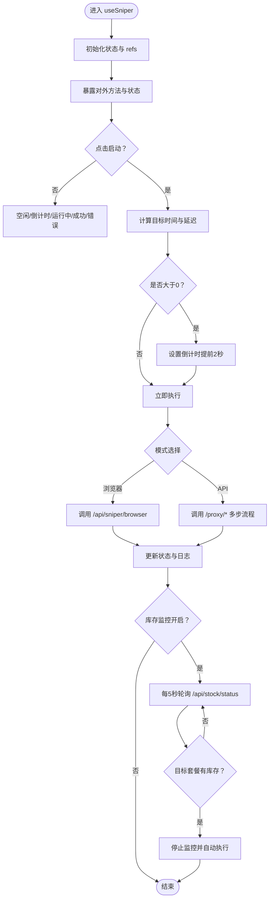
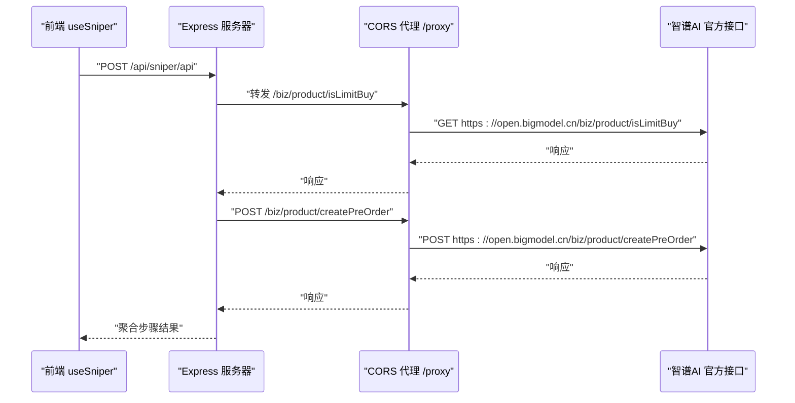
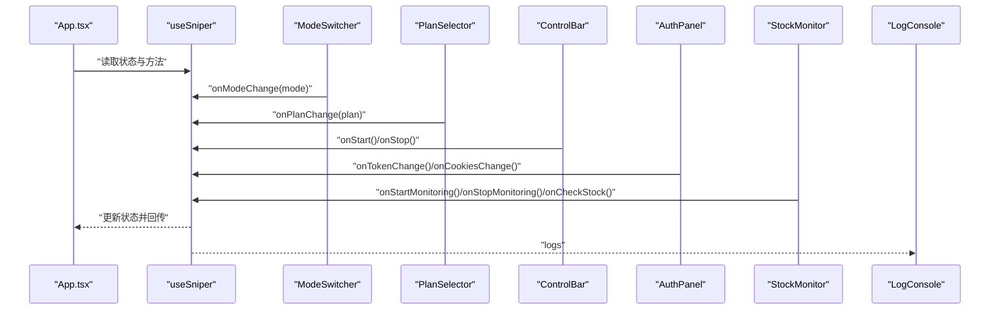
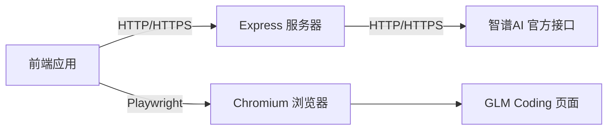

# 核心架构

<cite>
**本文引用的文件**
- [README.md](file://README.md)
- [package.json](file://package.json)
- [vite.config.ts](file://vite.config.ts)
- [tsconfig.json](file://tsconfig.json)
- [server/index.ts](file://server/index.ts)
- [src/App.tsx](file://src/App.tsx)
- [src/hooks/useSniper.ts](file://src/hooks/useSniper.ts)
- [src/lib/config.ts](file://src/lib/config.ts)
- [src/lib/utils.ts](file://src/lib/utils.ts)
- [src/components/ModeSwitcher.tsx](file://src/components/ModeSwitcher.tsx)
- [src/components/PlanSelector.tsx](file://src/components/PlanSelector.tsx)
- [src/components/ControlBar.tsx](file://src/components/ControlBar.tsx)
- [src/components/AuthPanel.tsx](file://src/components/AuthPanel.tsx)
- [src/components/StockMonitor.tsx](file://src/components/StockMonitor.tsx)
- [src/components/LogConsole.tsx](file://src/components/LogConsole.tsx)
</cite>

## 目录
1. [简介](#简介)
2. [项目结构](#项目结构)
3. [核心组件](#核心组件)
4. [架构总览](#架构总览)
5. [详细组件分析](#详细组件分析)
6. [依赖分析](#依赖分析)
7. [性能考量](#性能考量)
8. [故障排查指南](#故障排查指南)
9. [结论](#结论)
10. [附录](#附录)

## 简介
本项目为“GLM Sniper”抢购工具，采用前端与后端分离的三层架构设计：
- 前端UI层：基于 React + TypeScript + Vite 构建，通过自定义 React Hooks 统一管理状态与业务流程。
- 业务逻辑层：由自定义 Hook useSniper 负责协调抢购流程、倒计时、日志记录、库存监控与错误处理。
- 数据访问层：Express.js 服务器提供两类能力——CORS 代理与业务接口（库存查询、浏览器自动化、API 模式抢购）。

该架构通过 Hook 的集中式状态管理与后端代理机制，实现了跨域请求的透明化与高可靠性的抢购流程。

## 项目结构
项目采用按层与按功能混合的组织方式：
- server：后端 Express 服务，包含路由、中间件与业务接口。
- src：前端源码，包含组件、Hooks、配置与工具函数。
- 配置文件：package.json、vite.config.ts、tsconfig.json 等。

图表来源
- [src/App.tsx:1-197](file://src/App.tsx#L1-L197)
- [src/hooks/useSniper.ts:1-407](file://src/hooks/useSniper.ts#L1-L407)
- [server/index.ts:1-370](file://server/index.ts#L1-L370)

章节来源
- [package.json:1-48](file://package.json#L1-L48)
- [vite.config.ts:1-13](file://vite.config.ts#L1-L13)
- [tsconfig.json:1-8](file://tsconfig.json#L1-L8)

## 核心组件
- useSniper Hook：统一管理抢购模式、套餐、目标时间、认证信息、状态、日志、库存监控等，并封装浏览器自动化与 API 模式的执行流程。
- Express 服务器：提供 CORS 代理、库存查询、浏览器自动化与 API 模式抢购接口。
- 前端组件：ModeSwitcher、PlanSelector、ControlBar、AuthPanel、StockMonitor、LogConsole 等，负责输入与展示。

章节来源
- [src/hooks/useSniper.ts:46-406](file://src/hooks/useSniper.ts#L46-L406)
- [server/index.ts:10-370](file://server/index.ts#L10-L370)
- [src/components/ModeSwitcher.tsx:10-61](file://src/components/ModeSwitcher.tsx#L10-L61)
- [src/components/PlanSelector.tsx:11-60](file://src/components/PlanSelector.tsx#L11-L60)
- [src/components/ControlBar.tsx:11-75](file://src/components/ControlBar.tsx#L11-L75)
- [src/components/AuthPanel.tsx:14-119](file://src/components/AuthPanel.tsx#L14-L119)
- [src/components/StockMonitor.tsx:27-139](file://src/components/StockMonitor.tsx#L27-L139)
- [src/components/LogConsole.tsx:17-77](file://src/components/LogConsole.tsx#L17-L77)

## 架构总览
系统边界与交互关系如下：

图表来源
- [src/hooks/useSniper.ts:108-248](file://src/hooks/useSniper.ts#L108-L248)
- [server/index.ts:10-40](file://server/index.ts#L10-L40)
- [server/index.ts:252-355](file://server/index.ts#L252-L355)
- [server/index.ts:42-159](file://server/index.ts#L42-L159)
- [server/index.ts:161-250](file://server/index.ts#L161-L250)

## 详细组件分析

### useSniper Hook 设计与实现
- 设计理念
  - 单一职责：集中管理抢购相关的所有状态与流程，避免组件间分散逻辑。
  - 可测试性：通过 useCallback 包裹方法，便于单元测试；内部通过 ref 控制定时器与中断。
  - 可扩展性：通过配置模块与工具模块解耦业务常量与通用逻辑。
- 关键职责
  - 状态管理：模式、套餐、目标时间、认证信息、日志、库存状态、监控状态。
  - 流程编排：倒计时、启动/停止、浏览器自动化执行、API 模式多步骤请求、库存轮询。
  - 错误处理：验证码检测、重试策略、中断控制、日志输出。
- 数据结构与复杂度
  - 日志数组为 O(n) 追加；库存轮询为 O(1) 每周期；API 步骤为固定序列。
- 依赖链
  - 依赖配置模块（计划、产品 ID、API 端点）、工具模块（日志、格式化、时间计算）。
  - 依赖后端接口：浏览器模式、API 模式、库存查询、CORS 代理。
- 性能与优化
  - 使用 useCallback 避免不必要的重渲染；定时器通过 ref 管理，卸载时清理。
  - 提前 2 秒触发以补偿网络延迟，减少超时风险。

图表来源
- [src/hooks/useSniper.ts:250-293](file://src/hooks/useSniper.ts#L250-L293)
- [src/hooks/useSniper.ts:76-106](file://src/hooks/useSniper.ts#L76-L106)
- [src/hooks/useSniper.ts:110-248](file://src/hooks/useSniper.ts#L110-L248)
- [src/hooks/useSniper.ts:318-372](file://src/hooks/useSniper.ts#L318-L372)

章节来源
- [src/hooks/useSniper.ts:46-406](file://src/hooks/useSniper.ts#L46-L406)
- [src/lib/config.ts:6-26](file://src/lib/config.ts#L6-L26)
- [src/lib/utils.ts:20-27](file://src/lib/utils.ts#L20-L27)

### Express.js 服务器架构
- 中间件设计
  - CORS：允许跨域请求。
  - JSON 解析：统一处理请求体。
- 路由组织
  - /proxy：CORS 代理，转发到智谱 AI 官方域名，保留授权头与 Cookie。
  - /api/sniper/browser：浏览器自动化模式，使用 Playwright 完成页面交互。
  - /api/sniper/api：API 模式，通过代理调用官方接口完成预下单、支付预览、签名与状态检查。
  - /api/stock/status：查询库存状态，解析并返回各套餐可用性与下次补货时间。
  - /api/health：健康检查。
- CORS 代理机制
  - 将前端请求转发至 open.bigmodel.cn，自动携带 Authorization 与 Cookie，解决浏览器同源限制。
  - 对响应进行透传，保持状态码与内容类型一致。

图表来源
- [server/index.ts:10-40](file://server/index.ts#L10-L40)
- [server/index.ts:161-250](file://server/index.ts#L161-L250)
- [src/hooks/useSniper.ts:129-248](file://src/hooks/useSniper.ts#L129-L248)

章节来源
- [server/index.ts:1-370](file://server/index.ts#L1-L370)

### 组件交互与数据流
- App 作为根容器，注入 useSniper 返回的状态与方法，驱动各子组件渲染与交互。
- ModeSwitcher/PlanSelector/ControlBar/AuthPanel/StockMonitor/LogConsole 通过受控属性与回调与 Hook 同步状态。
- 日志通过 Hook 维护并在 LogConsole 展示，支持自动滚动与清空。
- 库存监控通过定时器轮询，命中目标套餐时自动触发抢购。

图表来源
- [src/App.tsx:12-194](file://src/App.tsx#L12-L194)
- [src/hooks/useSniper.ts:386-406](file://src/hooks/useSniper.ts#L386-L406)
- [src/components/ModeSwitcher.tsx:10-61](file://src/components/ModeSwitcher.tsx#L10-L61)
- [src/components/PlanSelector.tsx:11-60](file://src/components/PlanSelector.tsx#L11-L60)
- [src/components/ControlBar.tsx:11-75](file://src/components/ControlBar.tsx#L11-L75)
- [src/components/AuthPanel.tsx:14-119](file://src/components/AuthPanel.tsx#L14-L119)
- [src/components/StockMonitor.tsx:27-139](file://src/components/StockMonitor.tsx#L27-L139)
- [src/components/LogConsole.tsx:17-77](file://src/components/LogConsole.tsx#L17-L77)

## 依赖分析
- 前端依赖
  - React、React DOM、React Router、TailwindCSS 生态用于界面与样式。
  - Vite 与 TypeScript 提供构建与类型安全。
- 后端依赖
  - Express、CORS、cookie-parse、Playwright 用于服务端逻辑与浏览器自动化。
- 关键耦合点
  - 前端通过固定端口与路径调用后端接口，耦合在配置模块中集中管理。
  - 后端代理与官方接口耦合，需关注接口变更与稳定性。

图表来源
- [package.json:14-26](file://package.json#L14-L26)
- [server/index.ts:1-9](file://server/index.ts#L1-L9)
- [src/hooks/useSniper.ts:76-106](file://src/hooks/useSniper.ts#L76-L106)

章节来源
- [package.json:1-48](file://package.json#L1-L48)
- [server/index.ts:1-9](file://server/index.ts#L1-L9)

## 性能考量
- 前端
  - 使用 useCallback 与合理的状态拆分，降低重渲染成本。
  - 日志列表自动滚动，避免阻塞主线程。
- 后端
  - 代理仅做简单转发与头部透传，避免额外编码开销。
  - 浏览器自动化模式在非无头模式下会消耗较多资源，建议在生产环境使用无头模式或限制并发。
- 网络
  - 倒计时提前 2 秒触发，减少网络抖动影响。
  - 库存轮询间隔 5 秒，平衡实时性与请求压力。

## 故障排查指南
- 启动顺序
  - 先启动后端服务，再启动前端开发服务器；脚本已在 package.json 中提供。
- 常见问题
  - CORS 错误：确认后端已启用 CORS 且代理路径正确。
  - 认证失败：检查 Token 是否有效，必要时通过代理接口验证。
  - 验证码拦截：API 模式遇到验证码时会记录警告，需在官网完成验证后重试。
  - 浏览器模式失败：检查 Playwright 依赖与 Chromium 可用性。
- 日志定位
  - 使用日志面板查看详细步骤与错误信息，结合后端控制台输出定位问题。

章节来源
- [package.json:6-12](file://package.json#L6-L12)
- [src/hooks/useSniper.ts:157-177](file://src/hooks/useSniper.ts#L157-L177)
- [server/index.ts:357-370](file://server/index.ts#L357-L370)

## 结论
本项目通过清晰的分层架构与自定义 Hook 的集中式状态管理，实现了稳定高效的抢购流程。后端代理机制有效规避了浏览器同源限制，同时保留了浏览器自动化与 API 模式的灵活性。建议在生产环境中进一步增强错误恢复、限流与监控能力，并持续关注官方接口的稳定性与兼容性。

## 附录
- 技术栈选择与权衡
  - 前端：React + TypeScript + Vite 提供快速迭代与强类型保障；TailwindCSS 简化样式开发。
  - 后端：Express 简洁高效，配合 Playwright 实现浏览器自动化；CORS 代理满足跨域需求。
  - 配置：多 tsconfig 引用与 Vite 别名提升工程化体验。