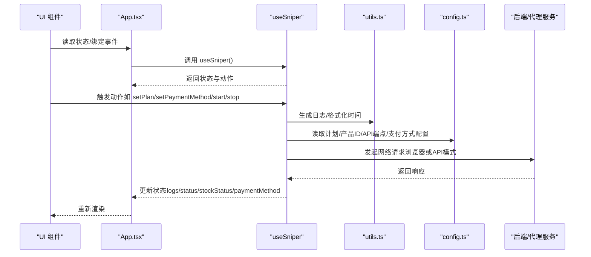
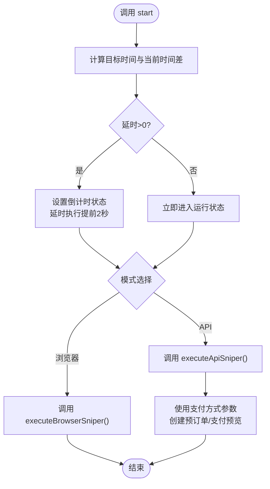
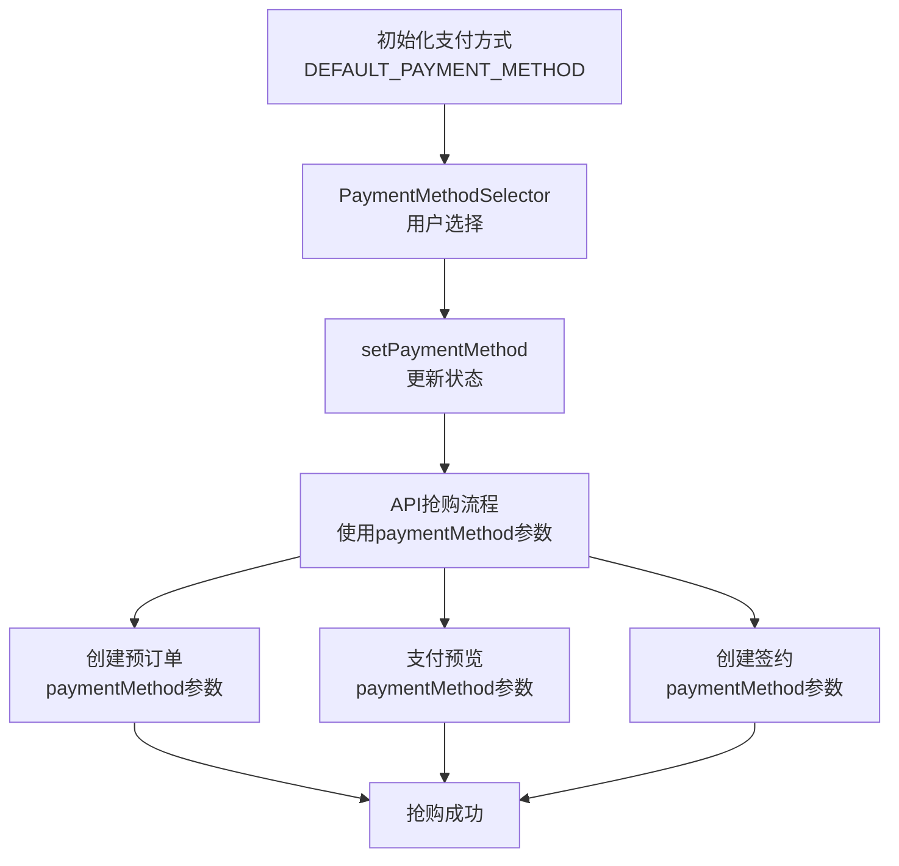
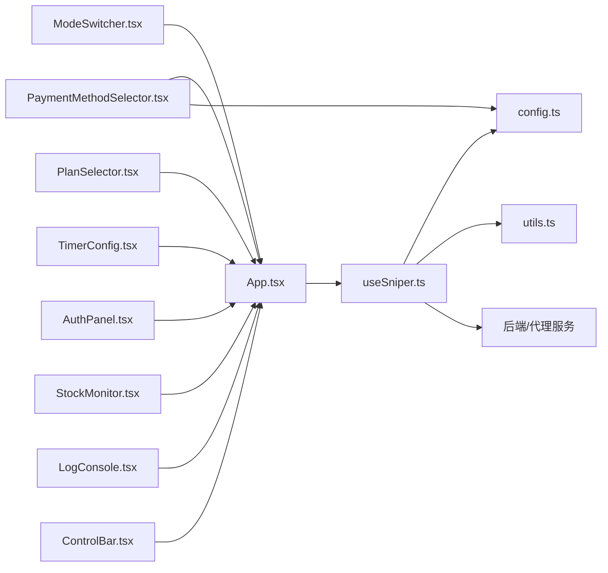

# 状态管理架构

<cite>
**本文引用的文件**
- [useSniper.ts](file://src/hooks/useSniper.ts)
- [config.ts](file://src/lib/config.ts)
- [utils.ts](file://src/lib/utils.ts)
- [App.tsx](file://src/App.tsx)
- [ModeSwitcher.tsx](file://src/components/ModeSwitcher.tsx)
- [PlanSelector.tsx](file://src/components/PlanSelector.tsx)
- [PaymentMethodSelector.tsx](file://src/components/PaymentMethodSelector.tsx)
- [TimerConfig.tsx](file://src/components/TimerConfig.tsx)
- [AuthPanel.tsx](file://src/components/AuthPanel.tsx)
- [StockMonitor.tsx](file://src/components/StockMonitor.tsx)
- [LogConsole.tsx](file://src/components/LogConsole.tsx)
- [ControlBar.tsx](file://src/components/ControlBar.tsx)
- [package.json](file://package.json)
</cite>

## 更新摘要
**变更内容**
- 新增支付方式状态管理（paymentMethod/setPaymentMethod）
- 在useSniper Hook中集成支付方式状态
- 添加PaymentMethodSelector组件用于支付方式选择
- 更新配置管理以支持多种支付方式
- 在API抢购流程中使用支付方式参数

## 目录
1. [简介](#简介)
2. [项目结构](#项目结构)
3. [核心组件](#核心组件)
4. [架构总览](#架构总览)
5. [详细组件分析](#详细组件分析)
6. [依赖关系分析](#依赖关系分析)
7. [性能考量](#性能考量)
8. [故障排查指南](#故障排查指南)
9. [结论](#结论)
10. [附录](#附录)

## 简介
本文件系统性阐述 GLM Sniper 的状态管理架构，围绕 React Hooks 模式的 useSniper Hook 设计理念与实现细节展开，覆盖状态初始化、状态更新、状态同步机制；同时文档化全局配置管理（config.ts）与工具函数库（utils.ts）的作用，解释状态管理与 UI 组件的交互模式（状态传递、事件处理、副作用管理），并给出性能优化策略与最佳实践。

**更新** 本次更新增加了对支付方式状态管理的支持，包括新增的paymentMethod和setPaymentMethod状态，以及在API抢购流程中的集成使用。

## 项目结构
本项目采用"按职责分层 + 功能模块化"的组织方式：
- hooks 层：集中存放自定义 Hook，当前核心为 useSniper
- lib 层：集中存放全局配置与通用工具函数
- components 层：按功能拆分 UI 组件，负责接收状态并触发动作
- 根组件 App.tsx 聚合 useSniper 返回的状态与动作，驱动各子组件

```mermaid
graph TB
subgraph "应用层"
APP["App.tsx"]
END
subgraph "Hook 层"
US["useSniper.ts"]
END
subgraph "配置与工具"
CFG["config.ts"]
UTL["utils.ts"]
END
subgraph "UI 组件"
MODE["ModeSwitcher.tsx"]
PLAN["PlanSelector.tsx"]
PAYMENT["PaymentMethodSelector.tsx"]
TIMER["TimerConfig.tsx"]
AUTH["AuthPanel.tsx"]
STOCK["StockMonitor.tsx"]
LOG["LogConsole.tsx"]
CTRL["ControlBar.tsx"]
END
APP --> US
US --> CFG
US --> UTL
APP --> MODE
APP --> PLAN
APP --> PAYMENT
APP --> TIMER
APP --> AUTH
APP --> STOCK
APP --> LOG
APP --> CTRL
MODE --> US
PLAN --> US
PAYMENT --> US
TIMER --> US
AUTH --> US
STOCK --> US
LOG --> US
CTRL --> US
```

**图表来源**
- [App.tsx:12-224](file://src/App.tsx#L12-L224)
- [useSniper.ts:46-478](file://src/hooks/useSniper.ts#L46-L478)
- [config.ts:1-147](file://src/lib/config.ts#L1-L147)
- [utils.ts:1-51](file://src/lib/utils.ts#L1-L51)

**章节来源**
- [App.tsx:12-224](file://src/App.tsx#L12-L224)
- [useSniper.ts:46-478](file://src/hooks/useSniper.ts#L46-L478)
- [config.ts:1-147](file://src/lib/config.ts#L1-L147)
- [utils.ts:1-51](file://src/lib/utils.ts#L1-L51)

## 核心组件
- useSniper Hook：统一管理抢购模式、套餐选择、支付周期、支付方式、目标时间、认证信息、日志、库存状态、监控开关与抢购生命周期，提供启动/停止、日志增删、库存检查与轮询等能力。
- 全局配置 config.ts：定义类型、套餐配置、产品 ID 映射、API 端点、库存检查标识、支付方式配置等，作为跨模块共享的"事实来源"。
- 工具函数库 utils.ts：提供日志条目生成、时间格式化、倒计时格式化、目标时间计算等通用方法，支撑 UI 与业务逻辑。

**更新** 新增支付方式状态管理，包括支付方式类型定义、默认支付方式配置和支付方式映射。

**章节来源**
- [useSniper.ts:46-478](file://src/hooks/useSniper.ts#L46-L478)
- [config.ts:85-94](file://src/lib/config.ts#L85-L94)
- [utils.ts:20-50](file://src/lib/utils.ts#L20-L50)

## 架构总览
useSniper 将"状态 + 动作 + 副作用"封装为单一 Hook，App.tsx 通过 useSniper 获取状态与动作，再将状态与动作分别注入到各个 UI 组件。UI 组件只负责展示与事件回调，不直接管理状态，从而实现清晰的单向数据流与低耦合。



**图表来源**
- [App.tsx:12-224](file://src/App.tsx#L12-L224)
- [useSniper.ts:46-478](file://src/hooks/useSniper.ts#L46-L478)
- [utils.ts:20-50](file://src/lib/utils.ts#L20-L50)
- [config.ts:85-94](file://src/lib/config.ts#L85-L94)

## 详细组件分析

### useSniper Hook 设计与实现
- 状态初始化
  - 通过 useState 初始化模式、套餐、支付周期、支付方式、目标日期/时间、认证令牌、Cookies、状态、日志、库存状态与监控开关。
  - 通过 useRef 维护定时器句柄、重试计数与中断标记，避免闭包捕获旧值导致的竞态。
- 动作与副作用
  - 日志管理：addLog/clearLogs 使用 useCallback 包裹，确保在 App.tsx 中传入的回调稳定，减少子组件重渲染。
  - 抢购流程：start 根据目标时间计算延时，提前 2 秒触发，补偿网络延迟；根据模式选择浏览器自动化或 API 高速模式。
  - API 模式：按步骤检查限制、创建预订单、支付预览、创建签约、轮询支付状态；对验证码拦截进行识别与提示。**新增** 支付方式参数在创建预订单和支付预览阶段使用。
  - 浏览器模式：向后端服务发送命令，由后端 Playwright 自动化执行。
  - 库存监控：startMonitoring 定时轮询（5 秒），检查目标套餐是否可购买，若可购买且满足条件则自动触发抢购。
  - 清理：组件卸载时清理所有定时器，防止内存泄漏。
- 数据流与同步
  - 状态更新通过 setState 逐项推进，日志通过不可变数组追加，库存状态整体替换。
  - 通过 useRef 与 abort 标记保证并发安全与可中断性。



**图表来源**
- [useSniper.ts:301-344](file://src/hooks/useSniper.ts#L301-L344)
- [useSniper.ts:87-116](file://src/hooks/useSniper.ts#L87-L116)
- [useSniper.ts:121-298](file://src/hooks/useSniper.ts#L121-L298)

**章节来源**
- [useSniper.ts:46-478](file://src/hooks/useSniper.ts#L46-L478)

### 全局配置管理（config.ts）
- 类型与常量
  - 定义模式、套餐、支付周期、支付方式等核心类型，确保跨模块一致。
  - 定义套餐配置（名称、价格、产品ID）、产品ID映射（按套餐与支付周期）、默认产品ID获取方法。
  - 定义库存检查标识与 API 端点集合，统一后端接口路径。
  - **新增** 定义支付方式配置（支付宝、微信支付、账户余额），包括名称、代码和图标。
  - **新增** 定义默认支付方式为支付宝。
- 作用
  - 作为"事实来源"，被 useSniper 与 UI 组件共同引用，避免分散硬编码。
  - 便于扩展新套餐、调整端点或产品ID映射。

**章节来源**
- [config.ts:6-11](file://src/lib/config.ts#L6-L11)
- [config.ts:85-94](file://src/lib/config.ts#L85-L94)
- [config.ts:115-120](file://src/lib/config.ts#L115-L120)

### 工具函数库（utils.ts）
- 日志与时间
  - createLog 生成带唯一 id 与时间戳的日志条目。
  - formatTime/formatCountdown 提供 UI 展示所需的时间格式化。
  - getTargetDateTime 将日期与时间字符串解析为 Date，用于倒计时计算。
- 样式合并
  - cn 基于 clsx/tailwind-merge 合并样式类名，避免冲突。
- 作用
  - 为 UI 组件与 Hook 提供通用工具，降低重复代码与样式耦合。

**章节来源**
- [utils.ts:20-50](file://src/lib/utils.ts#L20-L50)

### UI 组件与状态交互模式
- 状态传递
  - App.tsx 通过 useSniper 获取状态与动作，并将状态与动作分别注入到 ModeSwitcher、PlanSelector、PaymentMethodSelector、TimerConfig、AuthPanel、StockMonitor、LogConsole、ControlBar。
- 事件处理
  - 组件内部通过 props.onXxx 回调触发 useSniper 的 setter 或动作函数，例如 onModeChange -> setMode、onPlanChange -> setPlan、onPaymentMethodChange -> setPaymentMethod、onStart -> start。
- 副作用管理
  - TimerConfig 内部维护本地倒计时状态，但依赖外部目标时间变化；LogConsole 通过滚动条自动滚动至底部。
  - useSniper 内部通过 useRef 管理定时器与中断，避免闭包陷阱。

```mermaid
classDiagram
class App {
+useSniper()
+渲染各子组件
}
class ModeSwitcher {
+props : mode, onModeChange, disabled
}
class PlanSelector {
+props : plan, onPlanChange, paymentCycle, onPaymentCycleChange, disabled
}
class PaymentMethodSelector {
+props : paymentMethod, onPaymentMethodChange, disabled
}
class TimerConfig {
+props : targetDate, targetTime, onDateChange, onTimeChange, disabled
}
class AuthPanel {
+props : authToken, onTokenChange, cookies, onCookiesChange, disabled, onLog
}
class StockMonitor {
+props : stockStatus, isMonitoring, plan, onStartMonitoring, onStopMonitoring, onCheckStock, disabled
}
class LogConsole {
+props : logs, onClear
}
class ControlBar {
+props : status, onStart, onStop, disabled
}
class useSniper {
+状态 : mode, plan, paymentCycle, paymentMethod, target*, auth*, cookies, status, logs, stockStatus, isMonitoring
+动作 : setXxx, start, stop, addLog, clearLogs, checkStock, startMonitoring, stopMonitoring
}
App --> useSniper : "调用"
ModeSwitcher --> useSniper : "setMode"
PlanSelector --> useSniper : "setPlan/setPaymentCycle"
PaymentMethodSelector --> useSniper : "setPaymentMethod"
TimerConfig --> useSniper : "setTarget*"
AuthPanel --> useSniper : "setAuth/Cookies"
StockMonitor --> useSniper : "start/stop/check"
LogConsole --> useSniper : "clearLogs"
ControlBar --> useSniper : "start/stop"
```



**图表来源**
- [App.tsx:12-224](file://src/App.tsx#L12-L224)
- [ModeSwitcher.tsx:10-61](file://src/components/ModeSwitcher.tsx#L10-L61)
- [PlanSelector.tsx:11-112](file://src/components/PlanSelector.tsx#L11-L112)
- [PaymentMethodSelector.tsx:5-55](file://src/components/PaymentMethodSelector.tsx#L5-L55)
- [TimerConfig.tsx:13-98](file://src/components/TimerConfig.tsx#L13-L98)
- [AuthPanel.tsx:14-119](file://src/components/AuthPanel.tsx#L14-L119)
- [StockMonitor.tsx:27-139](file://src/components/StockMonitor.tsx#L27-L139)
- [LogConsole.tsx:17-77](file://src/components/LogConsole.tsx#L17-L77)
- [ControlBar.tsx:11-75](file://src/components/ControlBar.tsx#L11-L75)
- [useSniper.ts:46-478](file://src/hooks/useSniper.ts#L46-L478)

**章节来源**
- [App.tsx:12-224](file://src/App.tsx#L12-L224)
- [ModeSwitcher.tsx:10-61](file://src/components/ModeSwitcher.tsx#L10-L61)
- [PlanSelector.tsx:11-112](file://src/components/PlanSelector.tsx#L11-L112)
- [PaymentMethodSelector.tsx:5-55](file://src/components/PaymentMethodSelector.tsx#L5-L55)
- [TimerConfig.tsx:13-98](file://src/components/TimerConfig.tsx#L13-L98)
- [AuthPanel.tsx:14-119](file://src/components/AuthPanel.tsx#L14-L119)
- [StockMonitor.tsx:27-139](file://src/components/StockMonitor.tsx#L27-L139)
- [LogConsole.tsx:17-77](file://src/components/LogConsole.tsx#L17-L77)
- [ControlBar.tsx:11-75](file://src/components/ControlBar.tsx#L11-L75)

### 支付方式状态管理（新增）
- 状态定义与初始化
  - 在 useSniper Hook 中新增 paymentMethod 和 setPaymentMethod 状态，使用 DEFAULT_PAYMENT_METHOD 作为初始值。
  - 在 UseSniperReturn 接口中定义支付方式相关的类型和动作。
- API 抢购流程中的应用
  - 在创建预订单阶段使用 paymentMethod 参数传递给后端接口。
  - 在支付预览阶段同样使用 paymentMethod 参数。
  - 在创建签约阶段也使用 paymentMethod 参数。
- UI 组件集成
  - PaymentMethodSelector 组件提供三种支付方式的选择界面：支付宝、微信支付、账户余额。
  - 组件根据选中的支付方式进行视觉反馈，包括图标、名称和选中状态的样式。
  - 对于账户余额支付提供额外的使用提示。



**图表来源**
- [useSniper.ts:62](file://src/hooks/useSniper.ts#L62)
- [useSniper.ts:457](file://src/hooks/useSniper.ts#L457)
- [useSniper.ts:168-175](file://src/hooks/useSniper.ts#L168-L175)
- [useSniper.ts:238](file://src/hooks/useSniper.ts#L238)
- [useSniper.ts:254](file://src/hooks/useSniper.ts#L254)
- [PaymentMethodSelector.tsx:11-55](file://src/components/PaymentMethodSelector.tsx#L11-L55)

**章节来源**
- [useSniper.ts:62](file://src/hooks/useSniper.ts#L62)
- [useSniper.ts:457](file://src/hooks/useSniper.ts#L457)
- [useSniper.ts:168-175](file://src/hooks/useSniper.ts#L168-L175)
- [useSniper.ts:238](file://src/hooks/useSniper.ts#L238)
- [useSniper.ts:254](file://src/hooks/useSniper.ts#L254)
- [PaymentMethodSelector.tsx:11-55](file://src/components/PaymentMethodSelector.tsx#L11-L55)

## 依赖关系分析
- 组件与 Hook 的依赖
  - App.tsx 依赖 useSniper，useSniper 依赖 config.ts 与 utils.ts。
  - 各 UI 组件依赖 App.tsx 注入的状态与动作，形成单向数据流。
  - **新增** PaymentMethodSelector 依赖 config.ts 中的 PAYMENT_METHODS 配置。
- 外部依赖
  - 后端服务与代理：API 模式通过代理访问后端接口，浏览器模式通过后端命令驱动 Playwright。
  - 第三方库：React、TailwindCSS、Playwright、Express 等。



**图表来源**
- [App.tsx:12-224](file://src/App.tsx#L12-L224)
- [useSniper.ts:46-478](file://src/hooks/useSniper.ts#L46-L478)
- [config.ts:1-147](file://src/lib/config.ts#L1-L147)
- [utils.ts:1-51](file://src/lib/utils.ts#L1-L51)
- [package.json:14-26](file://package.json#L14-L26)

**章节来源**
- [package.json:14-26](file://package.json#L14-L26)

## 性能考量
- 状态分割与局部化
  - 将"库存状态"、"日志"和"支付方式"独立为 separate 状态，避免无关状态变更引发的重渲染。
- 记忆化与稳定回调
  - 使用 useCallback 包裹 addLog/clearLogs 与各动作函数，确保在 App.tsx 中传入的回调引用稳定，减少子组件重渲染。
- 副作用隔离
  - 定时器与轮询通过 useRef 管理，避免在 effect 中重复创建；在卸载时统一清理，防止内存泄漏。
- 重试与节流
  - API 模式下对验证码拦截进行识别与提示，避免无效重试；库存监控固定轮询间隔（5 秒），避免频繁请求。
- UI 优化
  - LogConsole 自动滚动到底部，提升可观测性；TimerConfig 内部维护本地倒计时，减少外部状态压力。
  - **新增** PaymentMethodSelector 使用 cn 函数进行样式合并，避免样式冲突。

**章节来源**
- [useSniper.ts:78-84](file://src/hooks/useSniper.ts#L78-L84)
- [useSniper.ts:457](file://src/hooks/useSniper.ts#L457)
- [LogConsole.tsx:20-24](file://src/components/LogConsole.tsx#L20-L24)
- [TimerConfig.tsx:17-32](file://src/components/TimerConfig.tsx#L17-L32)
- [PaymentMethodSelector.tsx:3](file://src/components/PaymentMethodSelector.tsx#L3)

## 故障排查指南
- 抢购失败或异常
  - 检查后端服务是否启动（脚本包含 server 与 start）。
  - API 模式缺少认证 Token 时会直接报错；浏览器模式连接后端失败会提示启动后端服务。
  - 对验证码拦截（包含特定关键词）进行识别与提示，建议手动完成验证码后再重试。
- 库存监控无结果
  - 确认后端库存接口可用；检查目标套餐是否在库存状态中。
  - 若已可购买且满足条件，库存监控会自动触发抢购。
- 日志为空或未滚动
  - 日志为空属正常；日志新增时 LogConsole 会自动滚动到底部。
- 时间设置过期
  - TimerConfig 会在目标时间过期时显示"已过目标时间"，此时会立即进入运行状态。
- **新增** 支付方式相关问题
  - 如果支付方式选择为账户余额且余额不足，可能导致支付预览失败。
  - 确保支付方式与账户状态匹配，避免因支付方式不兼容导致的抢购失败。

**章节来源**
- [package.json:6-12](file://package.json#L6-L12)
- [useSniper.ts:126-130](file://src/hooks/useSniper.ts#L126-L130)
- [useSniper.ts:187-217](file://src/hooks/useSniper.ts#L187-L217)
- [useSniper.ts:267-282](file://src/hooks/useSniper.ts#L267-L282)
- [LogConsole.tsx:20-24](file://src/components/LogConsole.tsx#L20-L24)
- [TimerConfig.tsx:21-27](file://src/components/TimerConfig.tsx#L21-L27)

## 结论
useSniper Hook 将复杂的抢购流程与状态管理抽象为统一的 Hook，配合 config.ts 与 utils.ts 形成清晰的"配置-工具-业务"三层结构。通过稳定的回调、受控的副作用与明确的数据流，实现了高内聚、低耦合的状态管理方案。

**更新** 新增的支付方式状态管理进一步完善了状态管理体系，使用户能够灵活选择不同的支付方式参与抢购。通过在API抢购流程中正确传递支付方式参数，确保了支付环节的完整性和准确性。

建议在后续迭代中进一步拆分动作粒度、引入状态持久化与更细粒度的重渲染控制，以提升复杂场景下的可维护性与性能表现。

## 附录
- 关键实现参考路径
  - [useSniper.ts:46-478](file://src/hooks/useSniper.ts#L46-L478)
  - [config.ts:85-94](file://src/lib/config.ts#L85-L94)
  - [utils.ts:20-50](file://src/lib/utils.ts#L20-L50)
  - [App.tsx:12-224](file://src/App.tsx#L12-L224)
  - [PaymentMethodSelector.tsx:11-55](file://src/components/PaymentMethodSelector.tsx#L11-L55)