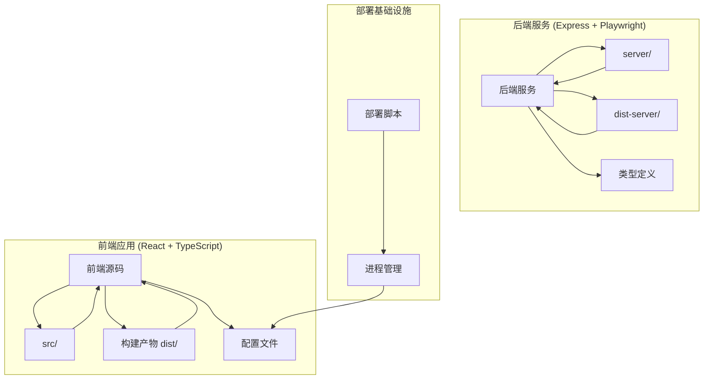
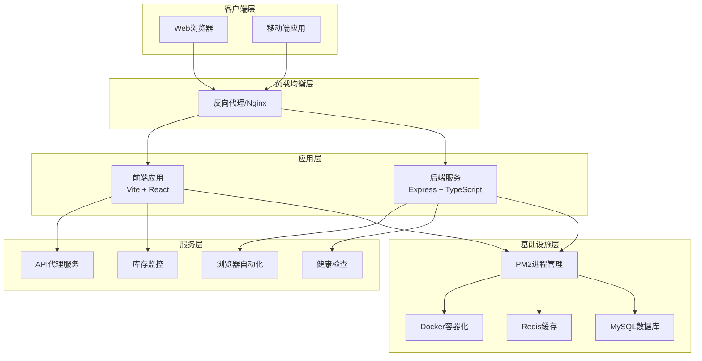
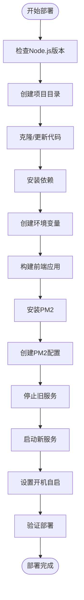
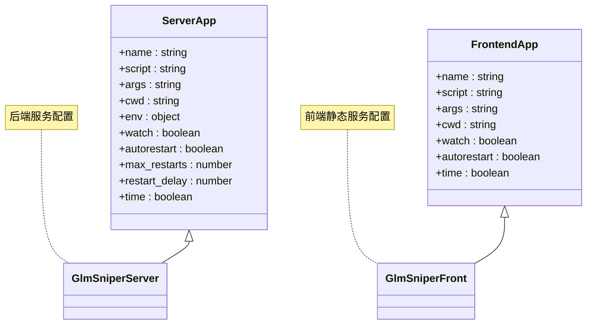
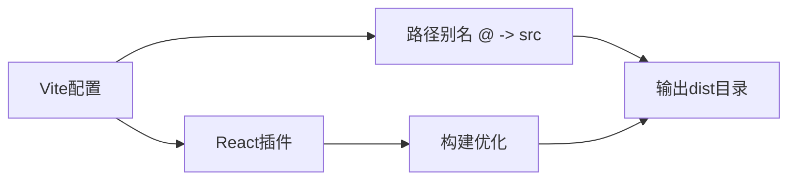
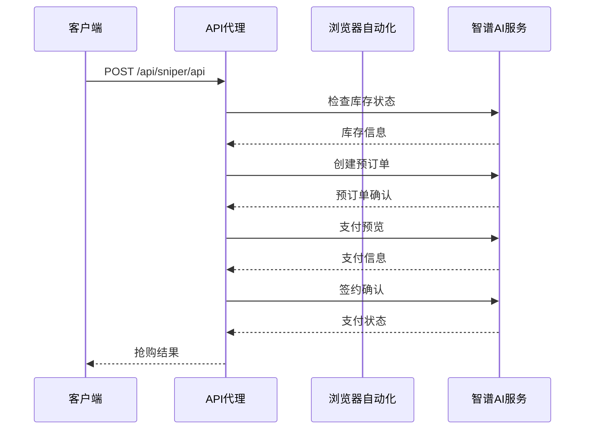
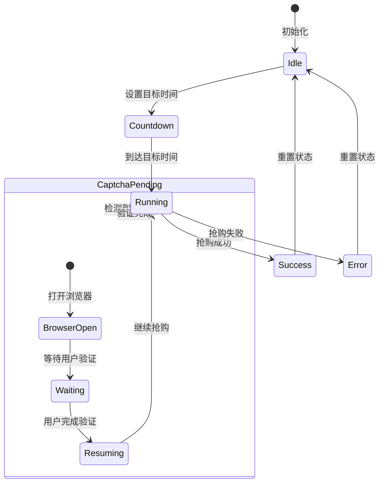
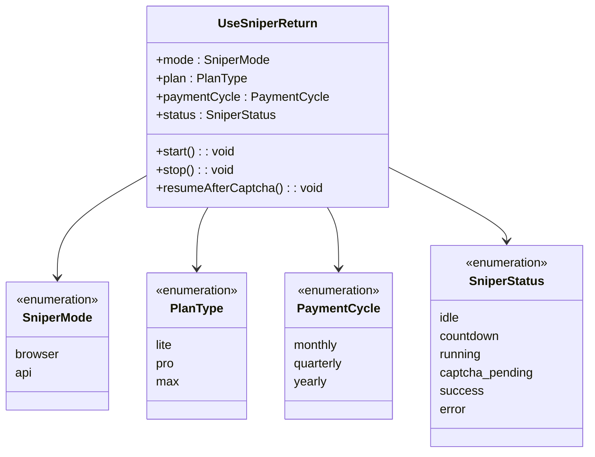
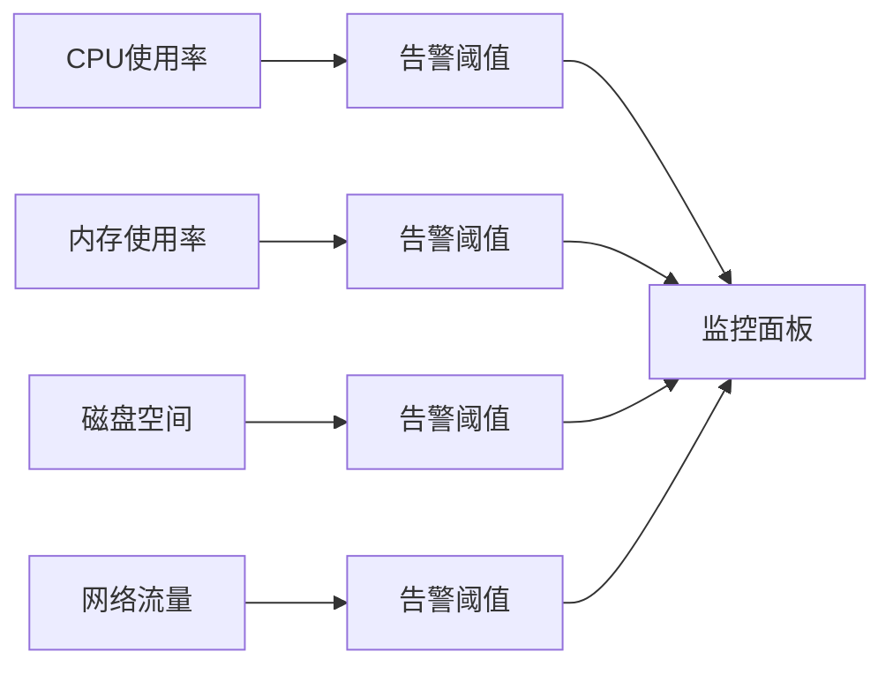
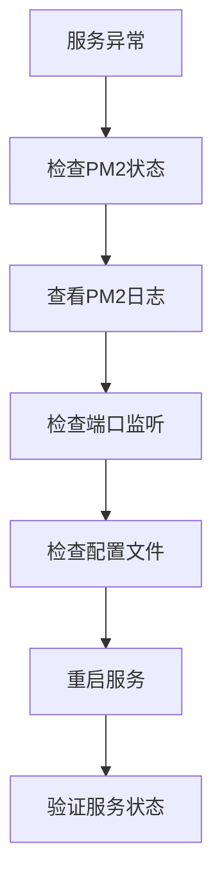

# 生产部署基础设施

<cite>
**本文档引用的文件**
- [package.json](file://package.json)
- [ecosystem.config.cjs](file://ecosystem.config.cjs)
- [deploy.sh](file://deploy.sh)
- [server/index.ts](file://server/index.ts)
- [dist-server/index.js](file://dist-server/index.js)
- [vite.config.ts](file://vite.config.ts)
- [tsconfig.json](file://tsconfig.json)
- [tsconfig.app.json](file://tsconfig.app.json)
- [tailwind.config.ts](file://tailwind.config.ts)
- [src/App.tsx](file://src/App.tsx)
- [src/main.tsx](file://src/main.tsx)
- [src/hooks/useSniper.ts](file://src/hooks/useSniper.ts)
- [src/lib/config.ts](file://src/lib/config.ts)
- [src/components/ControlBar.tsx](file://src/components/ControlBar.tsx)
- [src/components/StockMonitor.tsx](file://src/components/StockMonitor.tsx)
</cite>

## 目录
1. [简介](#简介)
2. [项目结构](#项目结构)
3. [核心组件](#核心组件)
4. [架构概览](#架构概览)
5. [详细组件分析](#详细组件分析)
6. [依赖关系分析](#依赖关系分析)
7. [性能考虑](#性能考虑)
8. [故障排除指南](#故障排除指南)
9. [结论](#结论)

## 简介

GLM Sniper 是一个基于 React + TypeScript + Vite 的生产级抢购工具，专门用于智谱AI的GLM Coding计划抢购。该系统采用前后端分离架构，包含完整的生产部署基础设施，支持两种抢购模式：浏览器自动化模式和API高速模式。

## 项目结构

该项目采用现代化的全栈开发架构，主要分为以下几个核心部分：



**图表来源**
- [package.json:1-49](file://package.json#L1-L49)
- [server/index.ts:1-419](file://server/index.ts#L1-L419)
- [ecosystem.config.cjs:1-28](file://ecosystem.config.cjs#L1-L28)

**章节来源**
- [package.json:1-49](file://package.json#L1-L49)
- [vite.config.ts:1-13](file://vite.config.ts#L1-L13)
- [tsconfig.json:1-9](file://tsconfig.json#L1-L9)

## 核心组件

### 前端应用架构

前端采用React Hooks + TypeScript实现，主要包含以下核心组件：

- **App组件**: 应用主入口，负责整体布局和状态管理
- **useSniper Hook**: 核心业务逻辑钩子，处理抢购流程、库存监控等
- **配置管理**: 统一的配置常量和API端点定义
- **UI组件**: 包含控制栏、套餐选择器、定时器配置等

### 后端服务架构

后端基于Express框架，提供以下核心功能：

- **API代理服务**: 绕过CORS限制，代理智谱AI的API请求
- **浏览器自动化**: 使用Playwright进行网页自动化操作
- **库存监控**: 实时查询和监控套餐库存状态
- **健康检查**: 提供服务可用性检测接口

**章节来源**
- [src/App.tsx:1-218](file://src/App.tsx#L1-L218)
- [src/hooks/useSniper.ts:1-478](file://src/hooks/useSniper.ts#L1-L478)
- [src/lib/config.ts:1-147](file://src/lib/config.ts#L1-L147)
- [server/index.ts:1-419](file://server/index.ts#L1-L419)

## 架构概览

系统采用前后端分离的微服务架构，通过PM2进行进程管理：



**图表来源**
- [ecosystem.config.cjs:1-28](file://ecosystem.config.cjs#L1-L28)
- [deploy.sh:1-145](file://deploy.sh#L1-L145)
- [server/index.ts:1-419](file://server/index.ts#L1-L419)

## 详细组件分析

### 部署脚本分析

部署脚本实现了完整的自动化部署流程，包含以下关键步骤：



**图表来源**
- [deploy.sh:1-145](file://deploy.sh#L1-L145)

#### 部署流程关键特性

1. **环境检查**: 自动检测和安装Node.js 18+
2. **依赖管理**: 使用npm安装所有必需依赖
3. **配置管理**: 自动生成PM2配置文件
4. **服务管理**: 使用PM2进行进程守护和自动重启
5. **健康监控**: 提供完整的部署验证机制

**章节来源**
- [deploy.sh:1-145](file://deploy.sh#L1-L145)

### PM2进程管理配置

PM2配置文件定义了两个独立的服务实例：



**图表来源**
- [ecosystem.config.cjs:1-28](file://ecosystem.config.cjs#L1-L28)

#### 关键配置参数说明

- **工作目录**: `/opt/glm-sniper`
- **后端端口**: 5010
- **前端端口**: 5001
- **自动重启**: 启用（最多10次重启）
- **进程监控**: 启用时间戳记录

**章节来源**
- [ecosystem.config.cjs:1-28](file://ecosystem.config.cjs#L1-L28)

### 前端构建配置

前端采用Vite进行构建，配置文件支持路径别名和React插件：



**图表来源**
- [vite.config.ts:1-13](file://vite.config.ts#L1-L13)

#### 构建特性

- **路径别名**: `@` 指向 `src/` 目录
- **TypeScript支持**: 完整的TS类型检查
- **开发服务器**: HMR热模块替换
- **生产优化**: 代码分割和压缩

**章节来源**
- [vite.config.ts:1-13](file://vite.config.ts#L1-L13)
- [tsconfig.app.json:1-28](file://tsconfig.app.json#L1-L28)

### 后端服务架构

后端服务提供了完整的API代理和自动化抢购功能：



**图表来源**
- [server/index.ts:210-299](file://server/index.ts#L210-L299)

#### 核心API端点

1. **/api/sniper/api**: API模式抢购流程
2. **/api/sniper/browser**: 浏览器自动化抢购
3. **/api/stock/status**: 库存状态查询
4. **/api/health**: 健康检查
5. **/proxy**: CORS代理服务

**章节来源**
- [server/index.ts:1-419](file://server/index.ts#L1-L419)

### 抢购流程管理

前端Hook实现了复杂的抢购流程管理：



**图表来源**
- [src/hooks/useSniper.ts:300-344](file://src/hooks/useSniper.ts#L300-L344)

#### 状态管理特性

- **倒计时功能**: 精确的时间控制
- **重试机制**: 失败自动重试（最多10次）
- **验证码处理**: 自动检测和处理验证码
- **库存监控**: 实时库存状态跟踪
- **日志记录**: 完整的操作日志

**章节来源**
- [src/hooks/useSniper.ts:1-478](file://src/hooks/useSniper.ts#L1-L478)

## 依赖关系分析

### 项目依赖结构

```mermaid
graph TB
subgraph "前端依赖"
React[react@^19.2.5]
ReactDOM[react-dom@^19.2.5]
Tailwind[tailwindcss@^3.4.17]
Vite[vite@^8.0.10]
Express[express@^5.2.1]
end
subgraph "开发依赖"
TypeScript[typescript@~6.0.2]
TSConfig[tsconfig.json]
ESLint[eslint@^10.2.1]
PostCSS[postcss@^8.5.10]
TailwindAnimate[tailwindcss-animate@^1.0.7]
end
subgraph "运行时依赖"
Playwright[playwright@^1.59.1]
Cors[cors@^2.8.6]
CookieParse[cookie-parse@^0.4.0]
Express[express@^5.2.1]
TSX[tsx@^4.21.0]
end
React --> ReactDOM
Tailwind --> PostCSS
Vite --> TypeScript
Express --> Playwright
```

**图表来源**
- [package.json:14-47](file://package.json#L14-L47)

### 类型系统架构



**图表来源**
- [src/lib/config.ts:6-11](file://src/lib/config.ts#L6-L11)
- [src/hooks/useSniper.ts:21-52](file://src/hooks/useSniper.ts#L21-L52)

**章节来源**
- [package.json:14-47](file://package.json#L14-L47)
- [src/lib/config.ts:1-147](file://src/lib/config.ts#L1-L147)

## 性能考虑

### 前端性能优化

1. **代码分割**: Vite自动进行代码分割
2. **懒加载**: 组件按需加载
3. **缓存策略**: 浏览器缓存和CDN加速
4. **构建优化**: Tree-shaking和压缩

### 后端性能优化

1. **进程管理**: PM2多进程模型
2. **内存管理**: 自动垃圾回收
3. **连接池**: 数据库连接复用
4. **缓存机制**: Redis缓存热点数据

### 系统资源监控



## 故障排除指南

### 常见部署问题

| 问题类型 | 症状 | 解决方案 |
|---------|------|----------|
| Node.js版本错误 | `Node.js 版本过低` | 升级到Node.js 18+ |
| 依赖安装失败 | npm install报错 | 清理node_modules后重装 |
| 端口占用 | 端口被占用错误 | 修改端口号或释放端口 |
| 权限问题 | 文件写入权限不足 | 使用sudo或修改文件权限 |

### 运行时问题诊断



### 性能监控指标

- **响应时间**: API请求平均响应时间
- **并发连接数**: 同时处理的请求数量
- **内存使用**: 进程内存占用情况
- **CPU使用率**: 处理器负载情况
- **错误率**: API错误响应比例

**章节来源**
- [deploy.sh:117-145](file://deploy.sh#L117-L145)

## 结论

GLM Sniper项目展现了现代全栈应用的完整生产部署解决方案。通过精心设计的架构和完善的自动化部署流程，该系统具备了以下优势：

1. **高可靠性**: PM2进程管理和自动重启机制
2. **高性能**: 前后端分离架构和优化的构建配置
3. **易维护**: 完善的监控和日志系统
4. **可扩展**: 模块化的组件设计和清晰的依赖关系

该部署基础设施为类似的企业级应用提供了优秀的参考模板，涵盖了从开发环境到生产环境的完整生命周期管理。