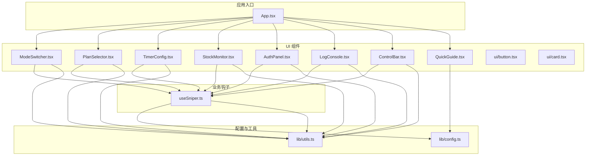
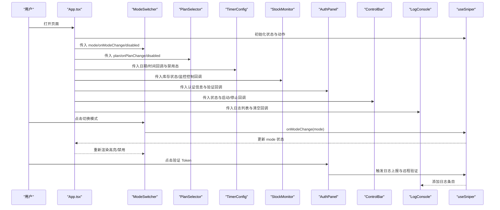
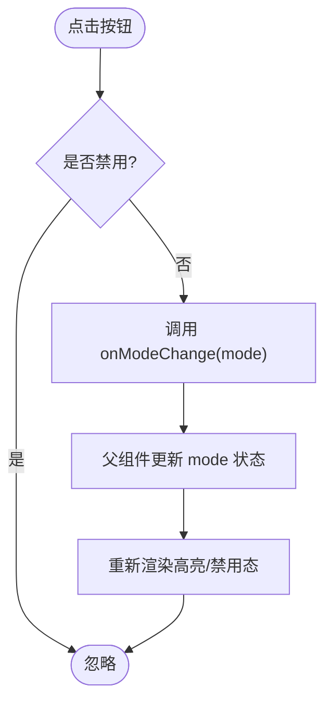
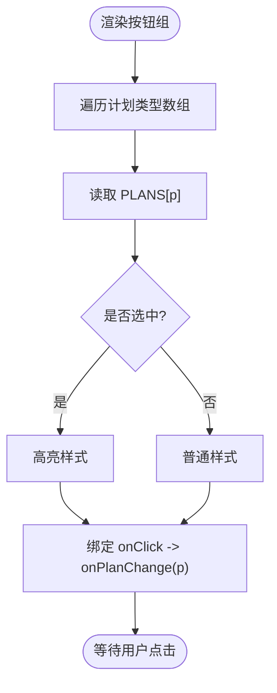
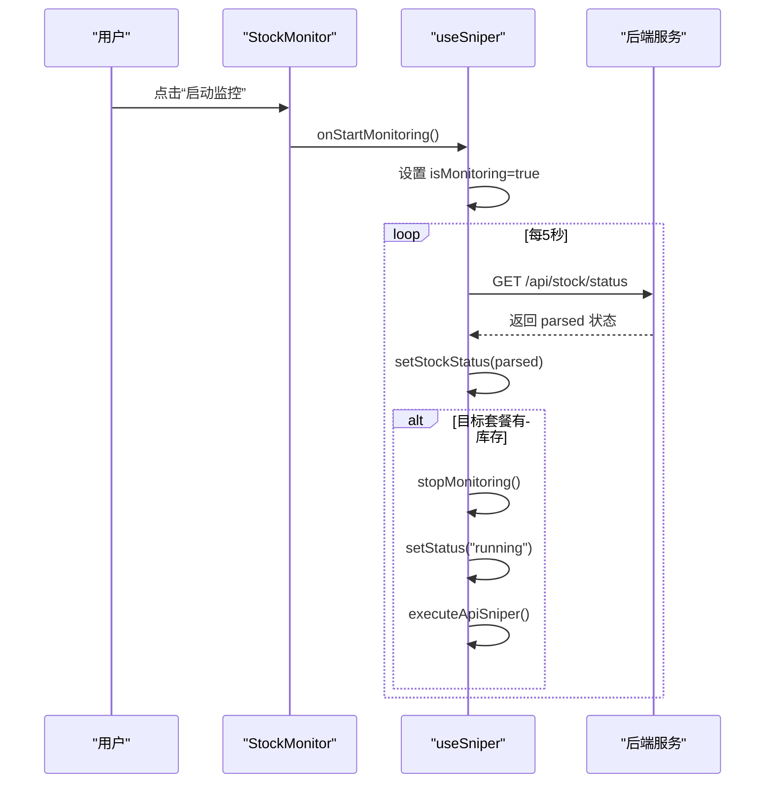
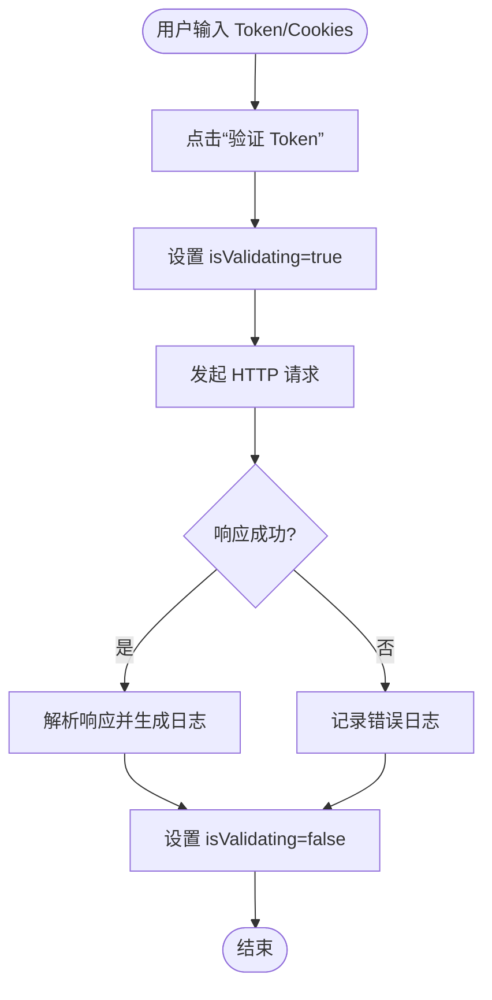
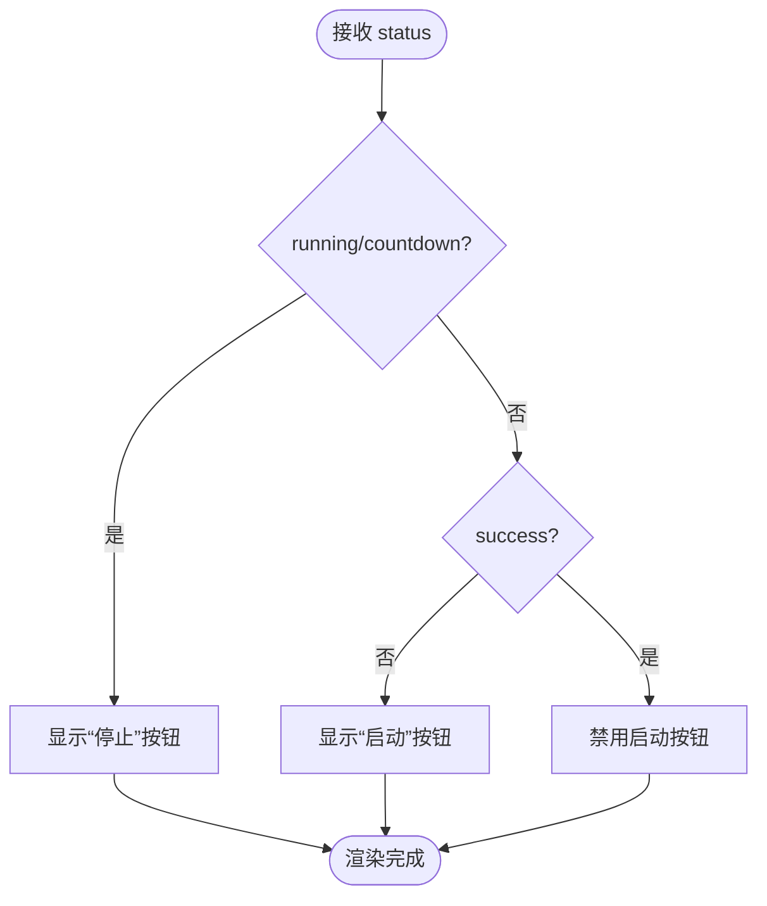
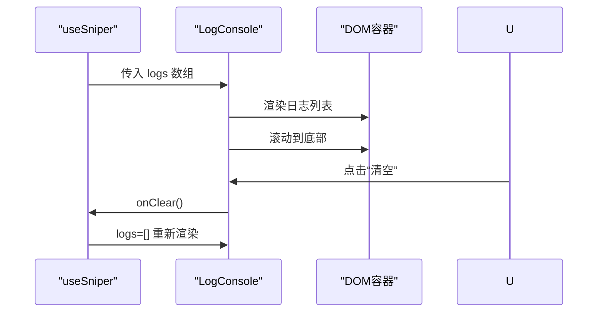
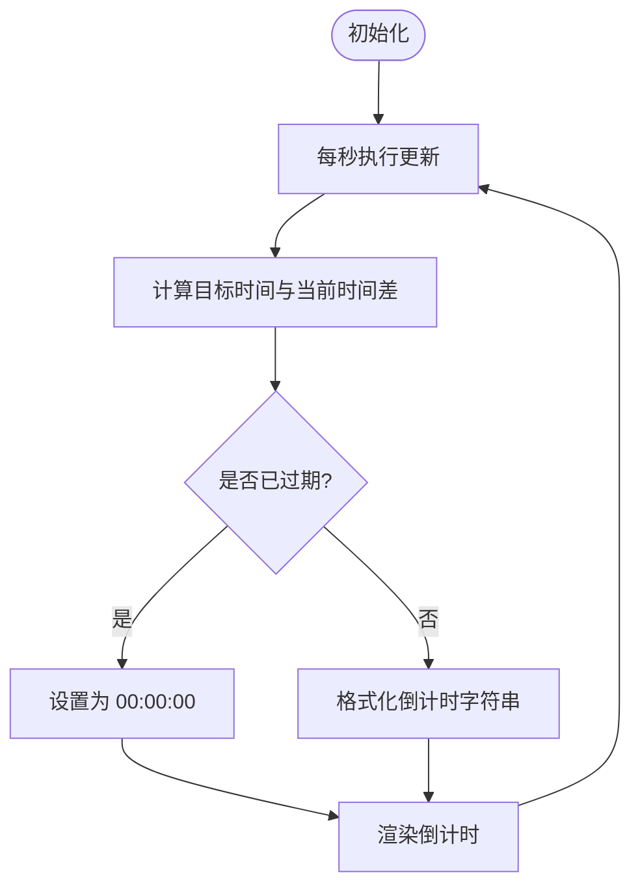
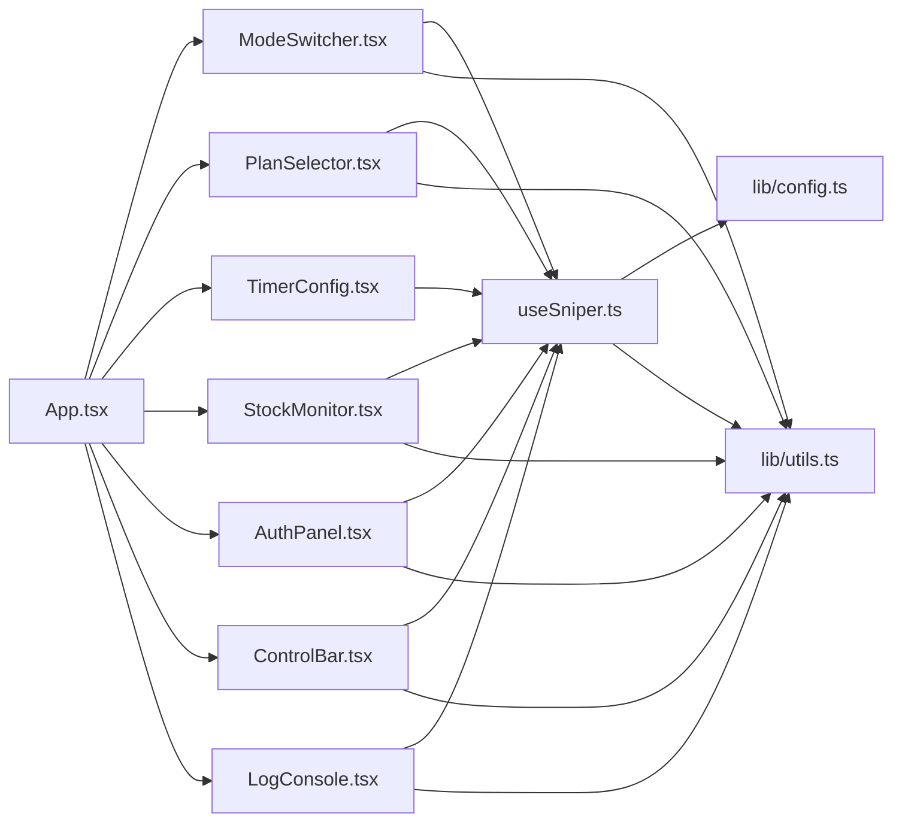

# 组件设计模式

<cite>
**本文引用的文件**
- [src/App.tsx](file://src/App.tsx)
- [src/hooks/useSniper.ts](file://src/hooks/useSniper.ts)
- [src/components/ModeSwitcher.tsx](file://src/components/ModeSwitcher.tsx)
- [src/components/PlanSelector.tsx](file://src/components/PlanSelector.tsx)
- [src/components/StockMonitor.tsx](file://src/components/StockMonitor.tsx)
- [src/components/AuthPanel.tsx](file://src/components/AuthPanel.tsx)
- [src/components/ControlBar.tsx](file://src/components/ControlBar.tsx)
- [src/components/LogConsole.tsx](file://src/components/LogConsole.tsx)
- [src/components/TimerConfig.tsx](file://src/components/TimerConfig.tsx)
- [src/components/QuickGuide.tsx](file://src/components/QuickGuide.tsx)
- [src/components/ui/button.tsx](file://src/components/ui/button.tsx)
- [src/components/ui/card.tsx](file://src/components/ui/card.tsx)
- [src/lib/config.ts](file://src/lib/config.ts)
- [src/lib/utils.ts](file://src/lib/utils.ts)
</cite>

## 目录
1. [引言](#引言)
2. [项目结构](#项目结构)
3. [核心组件](#核心组件)
4. [架构总览](#架构总览)
5. [详细组件分析](#详细组件分析)
6. [依赖关系分析](#依赖关系分析)
7. [性能考虑](#性能考虑)
8. [故障排查指南](#故障排查指南)
9. [结论](#结论)
10. [附录](#附录)

## 引言
本文件系统性梳理 GLM Sniper 的组件设计模式与架构实践，围绕基于 React 的组件化设计展开，重点覆盖以下方面：
- 组件分类与职责边界：模式切换、套餐选择、库存监控、认证管理、控制栏、日志控制台、定时配置、快速指南等。
- 设计原则与复用策略：单一职责、可组合、可配置、可测试；通过 props 传递、事件回调、状态共享实现组件间解耦。
- 生命周期管理：初始化、更新、销毁阶段的处理与资源清理。
- 性能优化：懒加载、虚拟化、缓存与定时器管理策略。
- 通信模式：父子组件通信、状态提升与回调驱动。

## 项目结构
项目采用“按功能域分层”的组织方式，核心逻辑集中在 hooks/useSniper.ts 中，UI 组件位于 src/components 下，通用样式与工具位于 src/lib 与 src/components/ui。

图表来源
- [src/App.tsx:12-197](file://src/App.tsx#L12-L197)
- [src/hooks/useSniper.ts:46-407](file://src/hooks/useSniper.ts#L46-L407)
- [src/lib/config.ts:1-104](file://src/lib/config.ts#L1-L104)
- [src/lib/utils.ts:1-51](file://src/lib/utils.ts#L1-L51)

章节来源
- [src/App.tsx:12-197](file://src/App.tsx#L12-L197)
- [src/hooks/useSniper.ts:46-407](file://src/hooks/useSniper.ts#L46-L407)
- [src/lib/config.ts:1-104](file://src/lib/config.ts#L1-L104)
- [src/lib/utils.ts:1-51](file://src/lib/utils.ts#L1-L51)

## 核心组件
本节对关键组件进行职责与实现要点的归纳，突出其设计原则与复用策略。

- ModeSwitcher（模式切换）
  - 职责：提供“浏览器自动化”与“API 高速”两种模式的切换入口，支持禁用态与视觉高亮。
  - 设计要点：受控组件 + 事件回调；通过 cn 组合类名实现主题态切换；禁用态统一处理。
  - 复用策略：可独立于业务钩子使用，仅依赖 mode 与 onModeChange。

- PlanSelector（套餐选择）
  - 职责：在 lite/pro/max 三档套餐间切换，展示名称、价格与徽标。
  - 设计要点：枚举渲染 + 选中态高亮；与全局配置 PLANS 解耦，通过配置对象读取显示信息。
  - 复用策略：可替换配置源，适配不同套餐体系。

- StockMonitor（库存监控）
  - 职责：展示各套餐库存状态、下次补货时间，并提供手动查询、启动/停止监控能力。
  - 设计要点：状态驱动渲染（isMonitoring、stockStatus、plan），按钮级联控制；监控轮询与取消。
  - 复用策略：可注入任意监控数据结构与控制函数，便于对接不同后端。

- AuthPanel（认证管理）
  - 职责：输入与校验认证 Token 与 Cookies，支持显隐切换与远程验证。
  - 设计要点：内部状态管理（显隐、验证中），通过回调上抛日志；与后端代理接口交互。
  - 复用策略：可替换验证接口与提示文案，适配不同鉴权方案。

- ControlBar（控制栏）
  - 职责：集中控制启动/停止，展示当前状态与视觉指示。
  - 设计要点：状态机驱动（idle/countdown/running/success/error），条件渲染与禁用态。
  - 复用策略：可替换状态枚举与行为回调，适配不同工作流。

- LogConsole（日志控制台）
  - 职责：滚动展示日志，支持清空与自动滚动。
  - 设计要点：列表渲染 + 自动滚动；日志条目结构化，带时间戳与级别。
  - 复用策略：可替换日志格式与滚动行为，适配不同日志系统。

- TimerConfig（定时配置）
  - 职责：设置目标日期与时间，计算倒计时并提示是否已过期。
  - 设计要点：副作用管理（定时器）与依赖更新；日期范围限制。
  - 复用策略：可替换日期格式化与倒计时算法。

- QuickGuide（快速指南）
  - 职责：根据当前模式与套餐生成简明操作指引。
  - 设计要点：条件渲染 + 文案内联；强调验证码与注意事项。
  - 复用策略：可替换文案模板与提示策略。

章节来源
- [src/components/ModeSwitcher.tsx:1-62](file://src/components/ModeSwitcher.tsx#L1-L62)
- [src/components/PlanSelector.tsx:1-61](file://src/components/PlanSelector.tsx#L1-L61)
- [src/components/StockMonitor.tsx:1-140](file://src/components/StockMonitor.tsx#L1-L140)
- [src/components/AuthPanel.tsx:1-120](file://src/components/AuthPanel.tsx#L1-L120)
- [src/components/ControlBar.tsx:1-76](file://src/components/ControlBar.tsx#L1-L76)
- [src/components/LogConsole.tsx:1-78](file://src/components/LogConsole.tsx#L1-L78)
- [src/components/TimerConfig.tsx:1-99](file://src/components/TimerConfig.tsx#L1-L99)
- [src/components/QuickGuide.tsx:1-56](file://src/components/QuickGuide.tsx#L1-L56)

## 架构总览
GLM Sniper 采用“状态提升 + 回调驱动”的组件通信范式：
- App 作为根容器，通过 useSniper 提供统一的状态与动作集合。
- 各功能组件通过 props 接收状态与回调，完成渲染与交互。
- 业务钩子负责副作用管理（定时器、轮询、HTTP 请求）与状态收敛。

图表来源
- [src/App.tsx:78-126](file://src/App.tsx#L78-L126)
- [src/hooks/useSniper.ts:46-407](file://src/hooks/useSniper.ts#L46-L407)
- [src/components/ModeSwitcher.tsx:10-61](file://src/components/ModeSwitcher.tsx#L10-L61)
- [src/components/AuthPanel.tsx:18-41](file://src/components/AuthPanel.tsx#L18-L41)
- [src/components/LogConsole.tsx:17-77](file://src/components/LogConsole.tsx#L17-L77)

## 详细组件分析

### ModeSwitcher（模式切换）
- 设计模式：受控组件 + 事件回调
- 关键点：
  - 受控渲染：根据 mode 切换高亮态与禁用态。
  - 回调驱动：点击事件触发 onModeChange，由父组件更新状态。
  - 可复用性：通过 cn 组合样式，支持主题定制；禁用态统一处理。

图表来源
- [src/components/ModeSwitcher.tsx:10-61](file://src/components/ModeSwitcher.tsx#L10-L61)

章节来源
- [src/components/ModeSwitcher.tsx:1-62](file://src/components/ModeSwitcher.tsx#L1-L62)

### PlanSelector（套餐选择）
- 设计模式：枚举渲染 + 选中态高亮
- 关键点：
  - 数据驱动：从 PLANS 读取套餐配置，动态渲染按钮组。
  - 事件回调：onPlanChange 将用户选择回传给父组件。
  - 可复用性：通过配置对象抽象套餐元信息，便于扩展新套餐。

图表来源
- [src/components/PlanSelector.tsx:11-60](file://src/components/PlanSelector.tsx#L11-L60)
- [src/lib/config.ts:28-49](file://src/lib/config.ts#L28-L49)

章节来源
- [src/components/PlanSelector.tsx:1-61](file://src/components/PlanSelector.tsx#L1-L61)
- [src/lib/config.ts:1-104](file://src/lib/config.ts#L1-L104)

### StockMonitor（库存监控）
- 设计模式：状态驱动 + 轮询调度
- 关键点：
  - 状态渲染：根据 stockStatus 与 isMonitoring 控制 UI 状态与按钮行为。
  - 轮询控制：startMonitoring/stopMonitoring/checkStock 形成监控闭环。
  - 自动触发：检测到目标套餐有库存时，自动停止监控并触发抢购。

图表来源
- [src/components/StockMonitor.tsx:27-140](file://src/components/StockMonitor.tsx#L27-L140)
- [src/hooks/useSniper.ts:307-372](file://src/hooks/useSniper.ts#L307-L372)
- [src/hooks/useSniper.ts:318-352](file://src/hooks/useSniper.ts#L318-L352)

章节来源
- [src/components/StockMonitor.tsx:1-140](file://src/components/StockMonitor.tsx#L1-L140)
- [src/hooks/useSniper.ts:307-372](file://src/hooks/useSniper.ts#L307-L372)

### AuthPanel（认证管理）
- 设计模式：内部状态 + 外部回调
- 关键点：
  - 内部状态：显隐切换、验证中状态。
  - 远程验证：调用后端代理接口，根据响应上抛日志。
  - 可复用性：onTokenChange/onCookiesChange/onLog 三个回调解耦输入与日志。

图表来源
- [src/components/AuthPanel.tsx:14-120](file://src/components/AuthPanel.tsx#L14-L120)
- [src/components/AuthPanel.tsx:18-41](file://src/components/AuthPanel.tsx#L18-L41)

章节来源
- [src/components/AuthPanel.tsx:1-120](file://src/components/AuthPanel.tsx#L1-L120)

### ControlBar（控制栏）
- 设计模式：状态机驱动 + 条件渲染
- 关键点：
  - 状态映射：根据 status 渲染不同颜色与文案。
  - 行为控制：运行中显示“停止”，非运行中显示“启动”。
  - 成功态特殊处理：禁用启动按钮并显示完成态。

图表来源
- [src/components/ControlBar.tsx:11-76](file://src/components/ControlBar.tsx#L11-L76)

章节来源
- [src/components/ControlBar.tsx:1-76](file://src/components/ControlBar.tsx#L1-L76)

### LogConsole（日志控制台）
- 设计模式：列表渲染 + 自动滚动
- 关键点：
  - 自动滚动：每次新增日志后滚动到底部。
  - 清空日志：通过回调清空列表。
  - 可复用性：日志条目结构化，便于接入不同日志系统。

图表来源
- [src/components/LogConsole.tsx:17-77](file://src/components/LogConsole.tsx#L17-L77)
- [src/hooks/useSniper.ts:68-74](file://src/hooks/useSniper.ts#L68-L74)

章节来源
- [src/components/LogConsole.tsx:1-78](file://src/components/LogConsole.tsx#L1-L78)
- [src/hooks/useSniper.ts:68-74](file://src/hooks/useSniper.ts#L68-L74)

### TimerConfig（定时配置）
- 设计模式：副作用 + 依赖更新
- 关键点：
  - 倒计时：每秒计算目标时间与当前时间差，更新显示。
  - 日期范围：限定最小/最大日期，防止无效输入。
  - 可复用性：暴露 onDateChange/onTimeChange 回调，供上层状态管理。

图表来源
- [src/components/TimerConfig.tsx:13-99](file://src/components/TimerConfig.tsx#L13-L99)
- [src/lib/utils.ts:38-44](file://src/lib/utils.ts#L38-L44)

章节来源
- [src/components/TimerConfig.tsx:1-99](file://src/components/TimerConfig.tsx#L1-L99)
- [src/lib/utils.ts:38-44](file://src/lib/utils.ts#L38-L44)

### QuickGuide（快速指南）
- 设计模式：条件渲染 + 文案模板
- 关键点：
  - 模式分支：浏览器模式与 API 模式分别给出操作步骤。
  - 套餐提示：高亮当前选择的套餐名称。
  - 可复用性：文案可替换，便于国际化或版本迭代。

章节来源
- [src/components/QuickGuide.tsx:1-56](file://src/components/QuickGuide.tsx#L1-L56)

### UI 基础组件（button、card）
- 设计模式：变体与尺寸的可组合设计
- 关键点：
  - button：通过变体与尺寸组合，形成统一的按钮风格。
  - card：卡片容器与内容区分离，便于复用布局。

章节来源
- [src/components/ui/button.tsx:1-49](file://src/components/ui/button.tsx#L1-L49)
- [src/components/ui/card.tsx:1-47](file://src/components/ui/card.tsx#L1-L47)

## 依赖关系分析
- 组件间依赖：
  - App 作为根容器，聚合所有功能组件并通过 useSniper 提供的状态与动作驱动渲染。
  - 功能组件之间无直接依赖，均通过 props 与回调通信。
- 外部依赖：
  - useSniper 依赖 lib/config.ts 与 lib/utils.ts 提供类型、配置与工具方法。
  - AuthPanel 依赖后端代理接口；StockMonitor 依赖库存查询接口。
- 循环依赖规避：
  - stopMonitoring 在 useSniper 内部提前声明，避免回调链中的循环引用。

图表来源
- [src/App.tsx:78-126](file://src/App.tsx#L78-L126)
- [src/hooks/useSniper.ts:46-407](file://src/hooks/useSniper.ts#L46-L407)
- [src/lib/config.ts:1-104](file://src/lib/config.ts#L1-L104)
- [src/lib/utils.ts:1-51](file://src/lib/utils.ts#L1-L51)

章节来源
- [src/App.tsx:78-126](file://src/App.tsx#L78-L126)
- [src/hooks/useSniper.ts:46-407](file://src/hooks/useSniper.ts#L46-L407)
- [src/lib/config.ts:1-104](file://src/lib/config.ts#L1-L104)
- [src/lib/utils.ts:1-51](file://src/lib/utils.ts#L1-L51)

## 性能考虑
- 懒加载与按需渲染
  - 非关键路径组件（如 QuickGuide）可在首次交互时再渲染，减少首屏压力。
- 虚拟化
  - 日志列表较长时，可引入虚拟列表组件（如 react-window）降低 DOM 节点数量。
- 缓存机制
  - 对静态配置（如 PLANS）与常量（如 API_ENDPOINTS）进行模块级缓存，避免重复计算。
- 定时器与轮询
  - 使用 useRef 存储定时器句柄，在组件卸载时统一清理，避免内存泄漏与悬挂回调。
  - 轮询间隔合理设置（如 5 秒），并在监控停止时及时清除定时器。
- 事件与回调
  - 使用 useCallback 包裹回调，减少子组件不必要重渲染。
- 样式与主题
  - 通过 cn/twMerge 合并类名，避免重复样式导致的重绘。

## 故障排查指南
- 认证失败
  - 现象：验证 Token 时返回错误或警告。
  - 排查：确认 Authorization 头格式正确；检查代理服务是否可用；查看日志面板输出。
- 抢购失败
  - 现象：API 模式出现验证码拦截或支付状态异常。
  - 排查：按 QuickGuide 指引完成验证码；检查网络与代理；关注日志中的重试与错误提示。
- 库存监控无响应
  - 现象：点击“启动监控”后无更新。
  - 排查：确认后端库存接口可用；检查 isMonitoring 状态；观察轮询是否被停止。
- 定时器异常
  - 现象：倒计时不更新或重复计时。
  - 排查：检查 useEffect 依赖项；确认 targetDate/targetTime 更新路径；避免重复注册定时器。

章节来源
- [src/components/AuthPanel.tsx:18-41](file://src/components/AuthPanel.tsx#L18-L41)
- [src/hooks/useSniper.ts:110-248](file://src/hooks/useSniper.ts#L110-L248)
- [src/components/StockMonitor.tsx:355-372](file://src/components/StockMonitor.tsx#L355-L372)
- [src/components/TimerConfig.tsx:17-32](file://src/components/TimerConfig.tsx#L17-L32)

## 结论
GLM Sniper 的组件设计遵循“状态提升 + 回调驱动”的清晰范式，通过 useSniper 钩子集中管理业务状态与副作用，各 UI 组件保持单一职责与良好可复用性。在通信上，props 与回调构成主要通道；在生命周期上，useEffect 与 useRef 确保资源正确分配与释放。未来可在日志列表虚拟化、配置缓存、定时器统一调度等方面进一步优化，以提升复杂场景下的稳定性与性能。

## 附录
- 类型与配置
  - 模式类型、套餐类型、状态类型与套餐配置均在 lib/config.ts 中集中定义，便于跨组件共享。
- 工具函数
  - 样式合并、日志条目生成、时间格式化与倒计时格式化在 lib/utils.ts 中提供，统一风格与行为。

章节来源
- [src/lib/config.ts:6-26](file://src/lib/config.ts#L6-L26)
- [src/lib/config.ts:28-49](file://src/lib/config.ts#L28-L49)
- [src/lib/utils.ts:16-27](file://src/lib/utils.ts#L16-L27)
- [src/lib/utils.ts:29-50](file://src/lib/utils.ts#L29-L50)