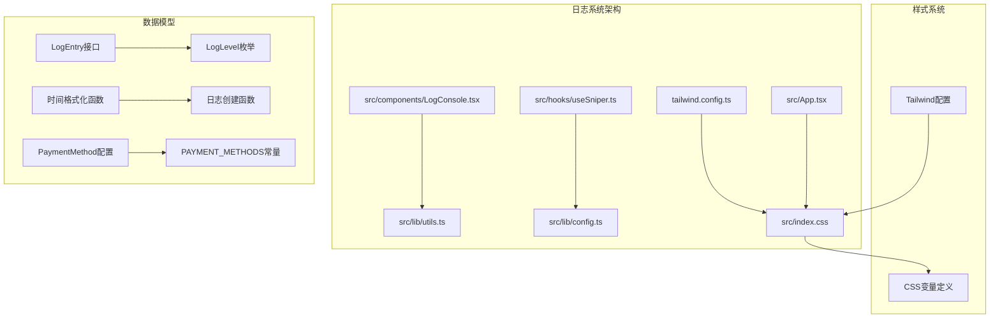
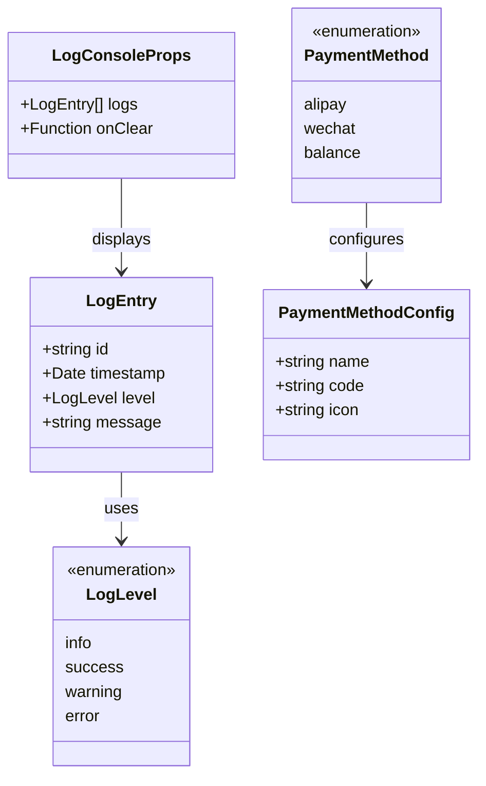
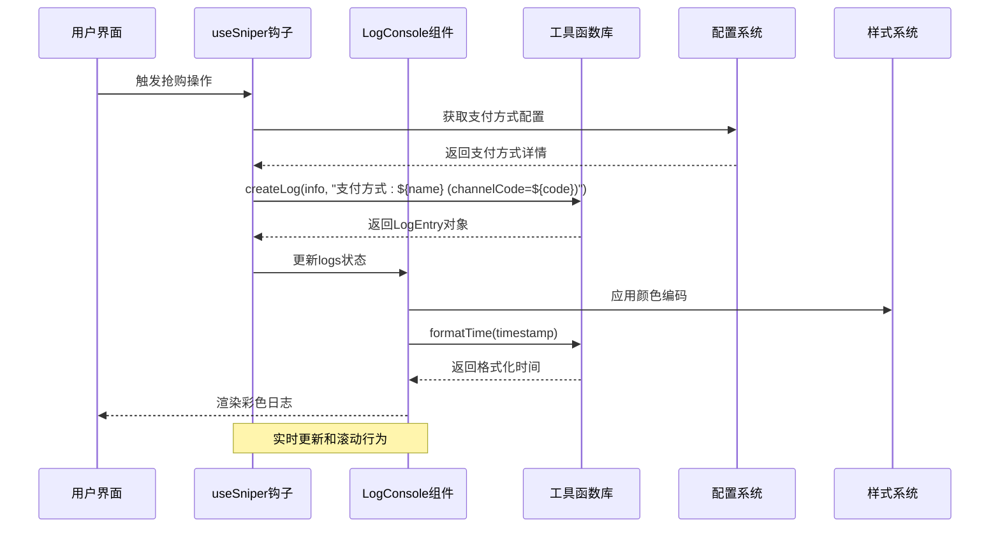
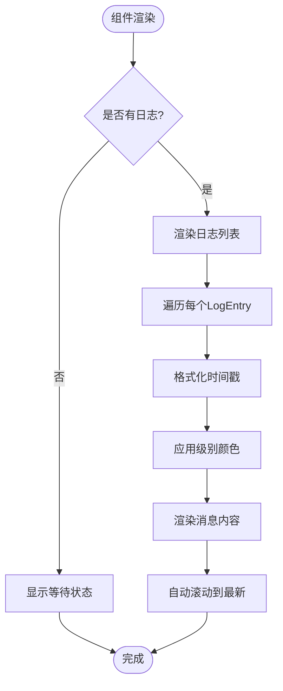
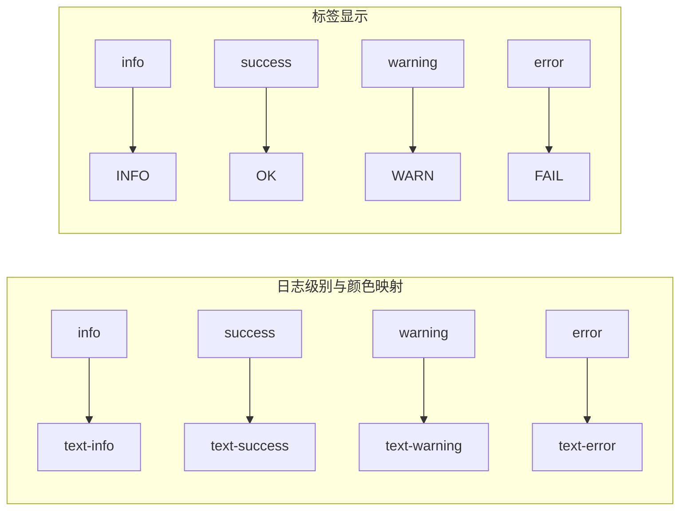
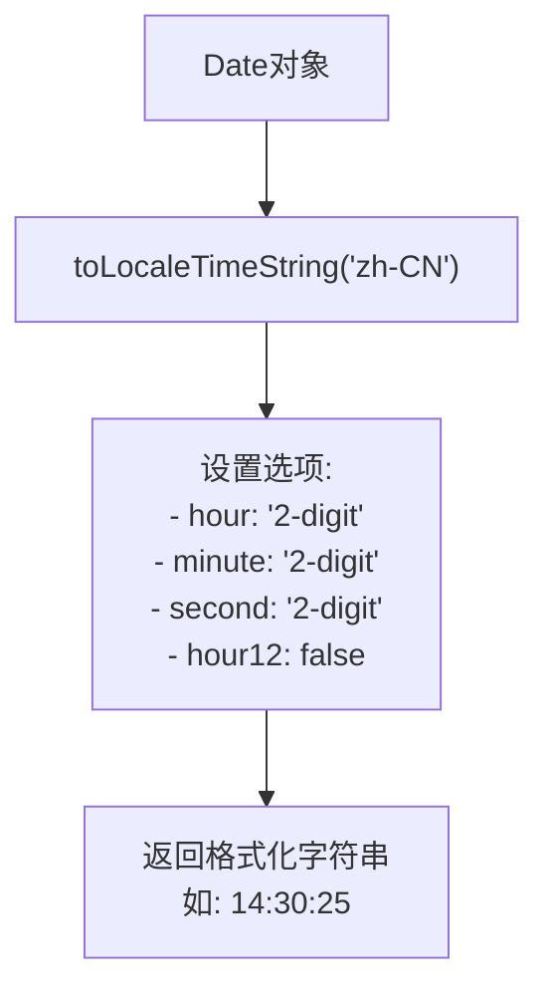
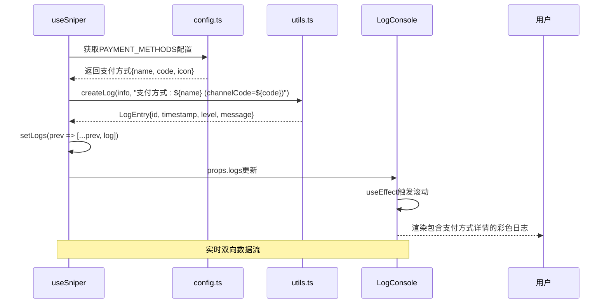
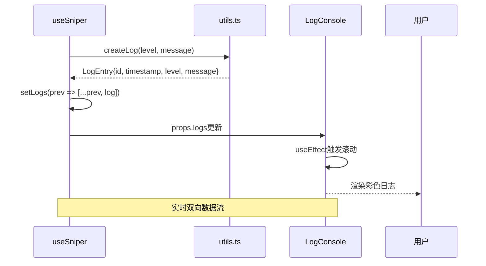
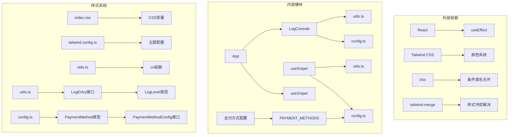

# 实时日志系统

<cite>
**本文档引用的文件**
- [LogConsole.tsx](file://src/components/LogConsole.tsx)
- [utils.ts](file://src/lib/utils.ts)
- [config.ts](file://src/lib/config.ts)
- [useSniper.ts](file://src/hooks/useSniper.ts)
- [App.tsx](file://src/App.tsx)
- [index.css](file://src/index.css)
- [tailwind.config.ts](file://tailwind.config.ts)
- [package.json](file://package.json)
</cite>

## 更新摘要
**变更内容**
- 在 useSniper 钩子的步骤2中增强了支付方式日志记录功能
- 新增了支付方式名称和渠道代码的详细信息输出
- 提供更好的调试和监控能力，支持支付宝、微信支付、账户余额三种支付方式
- 支付方式配置包含名称、代码和图标标识

## 目录
1. [简介](#简介)
2. [项目结构](#项目结构)
3. [核心组件](#核心组件)
4. [架构概览](#架构概览)
5. [详细组件分析](#详细组件分析)
6. [依赖关系分析](#依赖关系分析)
7. [性能考虑](#性能考虑)
8. [故障排除指南](#故障排除指南)
9. [结论](#结论)

## 简介

GLM Sniper实时日志系统是一个专为抢购工具设计的日志记录和显示组件。该系统提供了完整的日志管理功能，包括日志级别分类、格式化规则、时间戳生成、实时渲染和交互功能。日志系统采用终端风格设计，支持四种日志级别（info、warning、error、success），为用户提供清晰的操作追踪和错误诊断能力。

**重要更新**：日志系统现已增强支付方式日志记录功能，在步骤2的日志输出中新增了支付方式名称和渠道代码的详细信息，提供更好的调试和监控能力。

## 项目结构

日志系统主要分布在以下目录结构中：



**图表来源**
- [LogConsole.tsx:1-78](file://src/components/LogConsole.tsx#L1-L78)
- [utils.ts:1-51](file://src/lib/utils.ts#L1-L51)
- [config.ts:1-150](file://src/lib/config.ts#L1-L150)

**章节来源**
- [LogConsole.tsx:1-78](file://src/components/LogConsole.tsx#L1-L78)
- [utils.ts:1-51](file://src/lib/utils.ts#L1-L51)
- [config.ts:1-150](file://src/lib/config.ts#L1-L150)

## 核心组件

### 日志级别分类

日志系统实现了标准化的日志级别分类，每种级别都有特定的颜色编码和语义含义：

| 日志级别 | 颜色编码 | 语义含义 | 标签显示 |
|---------|---------|----------|----------|
| info | info色 (#D9E6F6) | 信息性消息，普通操作提示 | INFO |
| success | success色 (#16A34A) | 成功状态，操作完成 | OK |
| warning | warning色 (#F59E0B) | 警告信息，需要注意的情况 | WARN |
| error | error色 (#EF4444) | 错误信息，操作失败或异常 | FAIL |

### 支付方式配置系统

系统支持三种支付方式，每种支付方式都有详细的配置信息：

| 支付方式 | 名称 | 渠道代码 | 图标 |
|---------|------|----------|------|
| alipay | 支付宝 | ALI | 💰 |
| wechat | 微信支付 | WE_CHAT | 📱 |
| balance | 账户余额 | BALANCE | 🏦 |

### 数据模型设计

日志系统的核心数据结构由以下接口定义：



**图表来源**
- [utils.ts:7-12](file://src/lib/utils.ts#L7-L12)
- [utils.ts:5](file://src/lib/utils.ts#L5)
- [config.ts:85-90](file://src/lib/config.ts#L85-L90)

**章节来源**
- [utils.ts:5-12](file://src/lib/utils.ts#L5-L12)
- [LogConsole.tsx:10-15](file://src/components/LogConsole.tsx#L10-L15)
- [config.ts:85-90](file://src/lib/config.ts#L85-L90)

## 架构概览

日志系统采用分层架构设计，各组件职责明确：



**图表来源**
- [useSniper.ts:157-165](file://src/hooks/useSniper.ts#L157-L165)
- [LogConsole.tsx:17-24](file://src/components/LogConsole.tsx#L17-L24)
- [utils.ts:29-36](file://src/lib/utils.ts#L29-L36)
- [config.ts:85-90](file://src/lib/config.ts#L85-L90)

## 详细组件分析

### LogConsole组件分析

LogConsole是日志系统的核心UI组件，负责日志的渲染和用户交互。

#### 组件特性

1. **自动滚动行为**：每次新日志添加时自动滚动到底部
2. **实时渲染**：使用React状态管理实现响应式更新
3. **清空功能**：提供一键清空所有日志的按钮
4. **终端风格**：采用等宽字体和深色背景设计

#### 渲染逻辑



**图表来源**
- [LogConsole.tsx:44-72](file://src/components/LogConsole.tsx#L44-L72)
- [LogConsole.tsx:20-24](file://src/components/LogConsole.tsx#L20-L24)

#### 颜色编码系统

组件使用Tailwind CSS类名实现动态颜色编码：



**图表来源**
- [LogConsole.tsx:54-69](file://src/components/LogConsole.tsx#L54-L69)
- [LogConsole.tsx:10-15](file://src/components/LogConsole.tsx#L10-L15)

**章节来源**
- [LogConsole.tsx:1-78](file://src/components/LogConsole.tsx#L1-L78)

### 日志工具函数库分析

utils.ts提供了日志系统所需的核心工具函数。

#### 核心函数功能

1. **createLog函数**：创建标准化的日志条目
2. **formatTime函数**：格式化本地时间显示
3. **formatCountdown函数**：格式化倒计时显示
4. **getTargetDateTime函数**：解析目标日期时间

#### 时间格式化规则



**图表来源**
- [utils.ts:29-36](file://src/lib/utils.ts#L29-L36)

**章节来源**
- [utils.ts:1-51](file://src/lib/utils.ts#L1-L51)

### useSniper钩子集成

useSniper钩子作为日志系统的协调中心，负责：

1. **日志状态管理**：维护日志数组状态
2. **日志创建**：提供统一的日志创建接口
3. **日志清理**：支持批量清空日志
4. **抢购流程集成**：在抢购过程中自动产生日志

#### 增强的支付方式日志记录机制

**重要更新**：日志系统现已增强支付方式日志记录功能，在步骤2中新增了详细的支付方式信息输出：



**图表来源**
- [useSniper.ts:157-165](file://src/hooks/useSniper.ts#L157-L165)
- [config.ts:85-90](file://src/lib/config.ts#L85-L90)

#### 支付方式日志输出格式

在步骤2的预订单创建过程中，系统会输出以下格式的支付方式信息：

```
[步骤2] 支付方式: 支付宝 (channelCode=ALI)
[步骤2] 支付方式: 微信支付 (channelCode=WE_CHAT)
[步骤2] 支付方式: 账户余额 (channelCode=BALANCE)
```

#### 日志创建流程



**图表来源**
- [useSniper.ts:78-84](file://src/hooks/useSniper.ts#L78-L84)
- [utils.ts:20-27](file://src/lib/utils.ts#L20-L27)

**章节来源**
- [useSniper.ts:19-44](file://src/hooks/useSniper.ts#L19-L44)

## 依赖关系分析

日志系统各组件之间的依赖关系如下：



**图表来源**
- [package.json:14-26](file://package.json#L14-L26)
- [LogConsole.tsx:1-3](file://src/components/LogConsole.tsx#L1-L3)
- [useSniper.ts:8-9](file://src/hooks/useSniper.ts#L8-L9)
- [config.ts:85-90](file://src/lib/config.ts#L85-L90)

**章节来源**
- [package.json:1-48](file://package.json#L1-L48)

## 性能考虑

### 内存管理

1. **日志数量限制**：当前实现未设置日志数量上限，大量日志可能导致内存占用增加
2. **状态更新优化**：使用React的useState和useCallback优化状态更新性能
3. **滚动性能**：自动滚动使用原生DOM操作，性能开销较小

### 渲染优化

1. **虚拟滚动**：当前实现为完整渲染，对于大量日志可考虑虚拟滚动
2. **样式缓存**：Tailwind CSS类名在编译时确定，运行时性能良好
3. **动画性能**：使用CSS动画而非JavaScript动画，性能更优

### 建议的性能改进

1. **日志上限控制**：实现最大日志数量限制，默认1000条
2. **分页加载**：实现日志分页显示，减少DOM节点数量
3. **防抖机制**：对高频日志输出添加防抖处理

## 故障排除指南

### 常见问题及解决方案

#### 日志不显示问题

**症状**：LogConsole显示"等待指令..."状态
**原因**：
- 日志数组为空
- 状态更新未正确触发

**解决方案**：
1. 确认useSniper钩子正确调用addLog函数
2. 检查日志数组状态是否正常更新
3. 验证LogConsole组件props传递

#### 颜色显示异常

**症状**：日志颜色不正确或显示为默认颜色
**原因**：
- Tailwind CSS变量未正确配置
- CSS类名拼写错误

**解决方案**：
1. 检查tailwind.config.ts中的颜色配置
2. 验证index.css中的CSS变量定义
3. 确认Tailwind CSS编译是否正确

#### 滚动行为异常

**症状**：新日志添加后不自动滚动
**原因**：
- useEffect依赖项缺失
- DOM引用未正确设置

**解决方案**：
1. 确保useEffect监听logs状态变化
2. 检查containerRef是否正确赋值
3. 验证容器元素是否存在

#### 时间格式化问题

**症状**：时间显示格式不符合预期
**原因**：
- 时区设置错误
- 本地化配置问题

**解决方案**：
1. 检查formatTime函数的locale参数
2. 验证浏览器时区设置
3. 确认Date对象创建方式

#### 支付方式日志显示问题

**症状**：支付方式信息显示不完整或格式异常
**原因**：
- PAYMENT_METHODS配置缺失
- 渠道代码获取失败
- JSON序列化问题

**解决方案**：
1. 检查config.ts中的PAYMENT_METHODS配置
2. 确认paymentMethod状态正确传递
3. 验证渠道代码字段是否存在
4. 检查浏览器控制台是否有配置错误

#### API响应显示问题

**症状**：API响应信息显示不完整或格式异常
**原因**：
- JSON.stringify序列化失败
- 大型响应对象导致渲染性能问题

**解决方案**：
1. 检查响应对象是否可序列化
2. 对大型响应对象考虑分页显示
3. 验证浏览器控制台是否有序列化错误

**章节来源**
- [LogConsole.tsx:20-24](file://src/components/LogConsole.tsx#L20-L24)
- [utils.ts:29-36](file://src/lib/utils.ts#L29-L36)
- [config.ts:85-90](file://src/lib/config.ts#L85-L90)

## 结论

GLM Sniper实时日志系统通过精心设计的架构和实现，为抢购工具提供了强大而直观的日志管理功能。系统的主要优势包括：

1. **清晰的视觉层次**：通过颜色编码和标签系统，用户可以快速识别日志级别
2. **实时反馈**：自动滚动和即时渲染确保用户能够及时看到操作状态
3. **增强的可观测性**：新增的支付方式详细日志功能，能够完整显示支付方式名称和渠道代码
4. **易于扩展**：模块化的架构设计便于添加新的日志功能
5. **性能友好**：基于React和Tailwind CSS的实现具有良好的性能表现

**重要更新总结**：
- **详细的支付方式记录**：在步骤2中新增了支付方式名称和渠道代码的完整输出
- **多支付方式支持**：支持支付宝(ALI)、微信支付(WE_CHAT)、账户余额(BALANCE)三种支付方式
- **增强调试能力**：开发者和用户现在可以看到精确的支付方式配置信息
- **提升系统透明度**：所有支付相关的配置细节都可在日志中查看
- **改善用户体验**：更丰富的日志信息帮助用户更好地理解支付流程状态

未来可以考虑的功能增强包括日志过滤、导出功能、持久化存储、支付方式统计分析等，这些改进将进一步提升系统的实用性和用户体验。