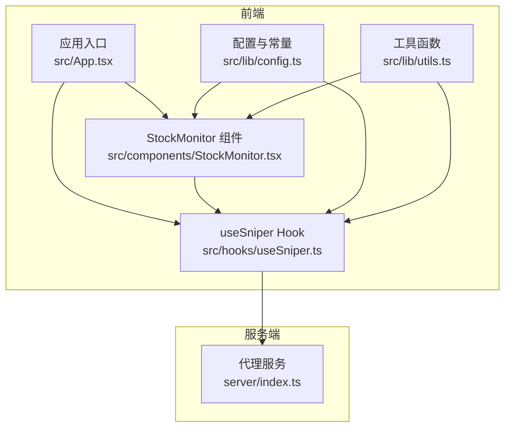
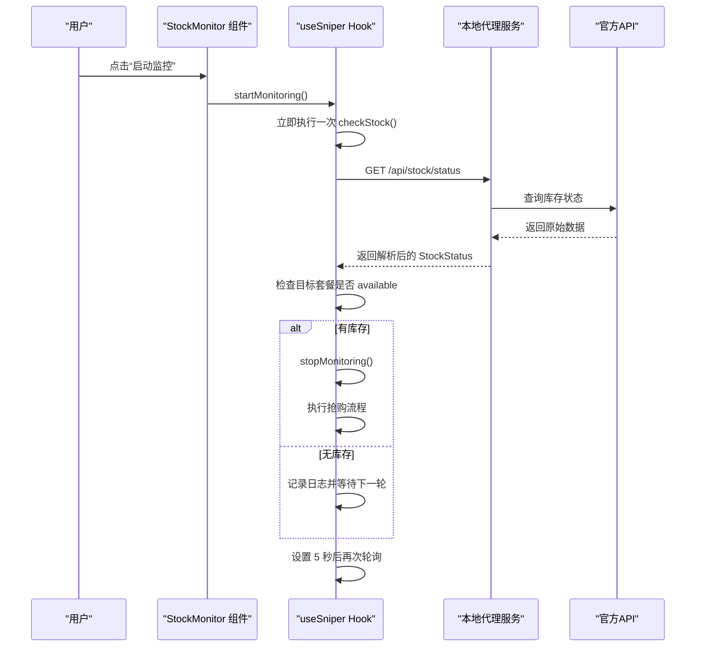
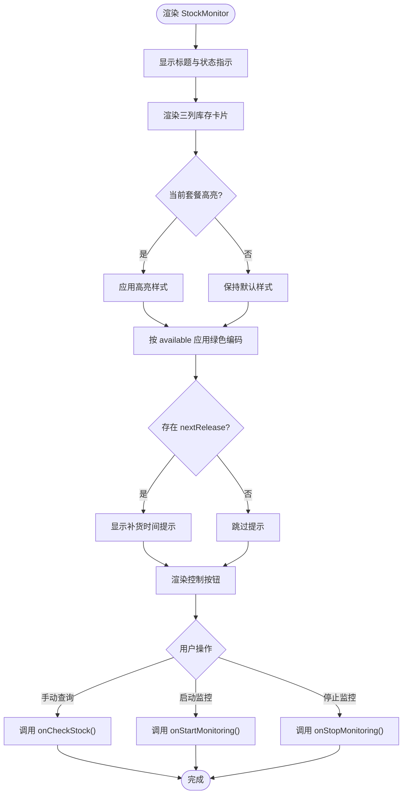
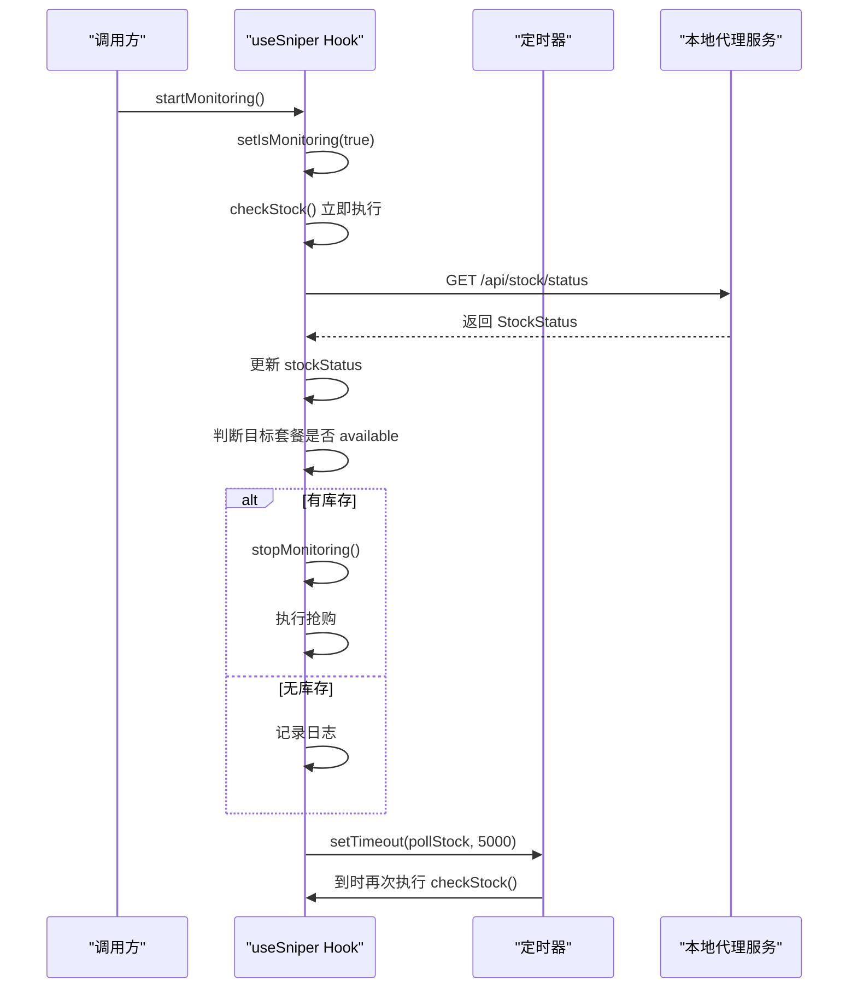
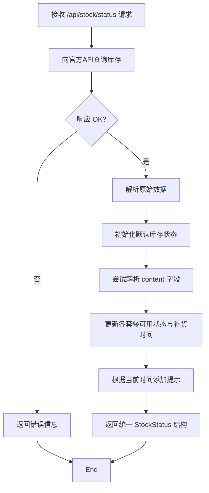
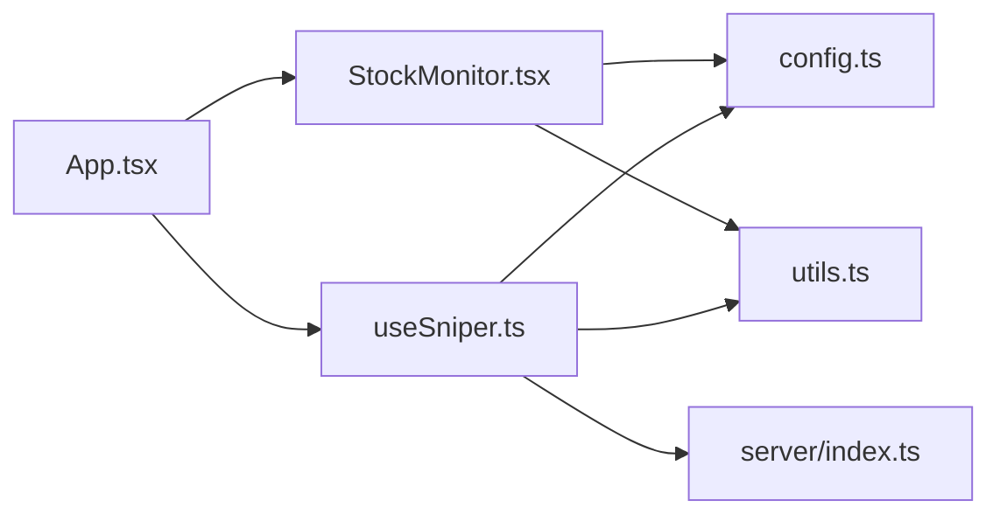

# 库存监控

<cite>
**本文引用的文件**
- [StockMonitor.tsx](file://src/components/StockMonitor.tsx)
- [useSniper.ts](file://src/hooks/useSniper.ts)
- [config.ts](file://src/lib/config.ts)
- [utils.ts](file://src/lib/utils.ts)
- [App.tsx](file://src/App.tsx)
- [index.ts](file://server/index.ts)
</cite>

## 目录
1. [简介](#简介)
2. [项目结构](#项目结构)
3. [核心组件](#核心组件)
4. [架构总览](#架构总览)
5. [详细组件分析](#详细组件分析)
6. [依赖关系分析](#依赖关系分析)
7. [性能考量](#性能考量)
8. [故障排查指南](#故障排查指南)
9. [结论](#结论)
10. [附录](#附录)

## 简介
本文件面向GLM Sniper的库存监控功能，系统性阐述其工作机制与实现细节。重点包括：
- 定时轮询策略：每5秒检查一次库存状态
- 库存状态查询API调用：通过本地代理服务访问后端接口
- 状态转换逻辑：从“待命”到“监控中”，再到“有库存时自动触发抢购”
- StockMonitor组件：库存状态展示、颜色编码、动画指示器
- 数据模型：StockStatus接口字段说明（available、message、nextRelease）
- 启动/停止逻辑、手动查询、与useSniper Hook的状态同步
- 配置选项、性能优化建议与常见问题解决方案

## 项目结构
本项目采用前端React + TypeScript + Vite架构，库存监控功能由以下模块协同实现：
- 前端组件层：StockMonitor.tsx负责UI展示与交互
- 前端Hook层：useSniper.ts集中管理状态、定时器、日志与业务逻辑
- 配置与工具：config.ts定义计划类型、产品ID映射；utils.ts提供通用工具函数
- 服务端代理：server/index.ts提供库存状态查询代理接口

图表来源
- [StockMonitor.tsx:1-140](file://src/components/StockMonitor.tsx#L1-L140)
- [useSniper.ts:1-407](file://src/hooks/useSniper.ts#L1-L407)
- [config.ts:1-104](file://src/lib/config.ts#L1-L104)
- [utils.ts:1-51](file://src/lib/utils.ts#L1-L51)
- [App.tsx:1-197](file://src/App.tsx#L1-L197)
- [index.ts:250-370](file://server/index.ts#L250-L370)

章节来源
- [App.tsx:103-114](file://src/App.tsx#L103-L114)
- [StockMonitor.tsx:1-140](file://src/components/StockMonitor.tsx#L1-L140)
- [useSniper.ts:305-372](file://src/hooks/useSniper.ts#L305-L372)
- [index.ts:252-355](file://server/index.ts#L252-L355)

## 核心组件
- StockMonitor组件：渲染库存状态卡片、补货时间提示、监控控制按钮，并提供手动查询入口。支持颜色编码与动画指示器，直观反映当前状态。
- useSniper Hook：封装库存监控的启动/停止、定时轮询、手动查询、状态同步与日志记录。内部维护isMonitoring、stockStatus等状态，并通过ref管理定时器。
- 服务端代理：提供/api/stock/status接口，转发并解析来自官方API的库存状态，补充补货时间信息。

章节来源
- [StockMonitor.tsx:17-25](file://src/components/StockMonitor.tsx#L17-L25)
- [useSniper.ts:11-44](file://src/hooks/useSniper.ts#L11-L44)
- [index.ts:252-355](file://server/index.ts#L252-L355)

## 架构总览
库存监控的端到端流程如下：
- 用户在StockMonitor中点击“启动监控”，useSniper启动定时器，每5秒调用本地代理服务的/api/stock/status接口
- 代理服务向官方API查询库存状态，解析返回内容，生成统一的StockStatus结构
- 前端收到响应后更新stockStatus，并根据目标套餐是否available决定是否自动触发抢购
- 若处于监控状态且检测到目标套餐有库存，useSniper会停止监控、清空日志并执行抢购流程

图表来源
- [StockMonitor.tsx:87-132](file://src/components/StockMonitor.tsx#L87-L132)
- [useSniper.ts:318-372](file://src/hooks/useSniper.ts#L318-L372)
- [index.ts:252-355](file://server/index.ts#L252-L355)

## 详细组件分析

### StockMonitor 组件
- 职责与布局
  - 展示“库存监控”标题与“监控中/待命”的状态指示（含脉冲动画）
  - 三列库存卡片分别显示lite/pro/max的可用状态与消息
  - 显示“下次补货时间”提示区域
  - 提供“手动查询”“启动监控/停止监控”按钮
- 颜色编码系统
  - 当前选中套餐卡片高亮边框与背景
  - 若某套餐available为true，则卡片边框与背景使用绿色系强调
  - 文字颜色随available切换，增强可读性
- 动画指示器
  - 监控中状态下显示脉冲小圆点，直观提示轮询进行中
- 交互行为
  - disabled属性根据isMonitoring或整体忙碌状态动态禁用按钮
  - 点击“手动查询”直接调用onCheckStock
  - 点击“启动监控/停止监控”分别调用对应回调

图表来源
- [StockMonitor.tsx:38-132](file://src/components/StockMonitor.tsx#L38-L132)

章节来源
- [StockMonitor.tsx:17-25](file://src/components/StockMonitor.tsx#L17-L25)
- [StockMonitor.tsx:38-132](file://src/components/StockMonitor.tsx#L38-L132)

### useSniper Hook 的库存监控实现
- 数据模型与状态
  - StockStatus接口包含lite/pro/max的可用状态与消息，以及nextRelease补货时间
  - isMonitoring用于标识监控状态；stockStatus存储最新查询结果
- 启动/停止逻辑
  - startMonitoring：设置isMonitoring为true，立即执行一次checkStock，然后每5秒重复调用
  - stopMonitoring：设置isMonitoring为false，清理定时器，记录日志
- 手动查询
  - checkStock：调用本地代理服务的/api/stock/status接口，解析响应并更新stockStatus
  - 若目标套餐available为true且处于监控状态且已配置authToken，则自动停止监控并执行抢购
- 日志与调试
  - 使用createLog记录每次查询结果、补货时间提示与异常信息
- 定时器管理
  - 使用ref保存定时器句柄，避免内存泄漏；组件卸载时统一清理

图表来源
- [useSniper.ts:305-372](file://src/hooks/useSniper.ts#L305-L372)
- [useSniper.ts:318-352](file://src/hooks/useSniper.ts#L318-L352)

章节来源
- [useSniper.ts:11-17](file://src/hooks/useSniper.ts#L11-L17)
- [useSniper.ts:305-372](file://src/hooks/useSniper.ts#L305-L372)
- [useSniper.ts:318-352](file://src/hooks/useSniper.ts#L318-L352)

### 服务端代理与库存状态解析
- 接口定义
  - GET /api/stock/status：代理官方API的库存查询，返回统一格式的StockStatus
- 解析逻辑
  - 默认库存状态为“已售罄”，并设置nextRelease为“每日 10:00 补货”
  - 从原始响应中查找operationId为1111的条目，解析content中的liteStock/proStock/maxStock字段
  - 若存在nextReleaseTime或replenishTime，覆盖nextRelease
  - 时间智能提示：在10:00前后特定时间段内，提示“即将补货”或标记为“检查中”
- 错误处理
  - 对HTTP非OK状态与解析异常进行容错，返回标准结构便于前端处理

图表来源
- [index.ts:252-355](file://server/index.ts#L252-L355)

章节来源
- [index.ts:252-355](file://server/index.ts#L252-L355)

### 数据模型：StockStatus 接口
- 字段说明
  - lite/pro/max：每个套餐包含available布尔值与message文本描述
  - nextRelease：字符串或null，表示下次补货时间或提示
- 设计意图
  - 统一前端展示与逻辑判断，简化组件与Hook之间的数据传递
  - 通过message提供更友好的用户提示，如“有库存”“已售罄”“检查中…”

章节来源
- [StockMonitor.tsx:10-15](file://src/components/StockMonitor.tsx#L10-L15)
- [useSniper.ts:12-17](file://src/hooks/useSniper.ts#L12-L17)

### 与useSniper Hook的状态同步机制
- 组件到Hook
  - StockMonitor通过props接收stockStatus、isMonitoring、plan等状态，并传入回调函数
- Hook到组件
  - useSniper通过useState维护stockStatus与isMonitoring，作为状态源驱动组件重渲染
- 事件链路
  - 用户操作触发回调，Hook内部更新状态并执行副作用（定时器、fetch、日志）
  - 组件通过props读取最新状态，实现双向同步

章节来源
- [App.tsx:103-114](file://src/App.tsx#L103-L114)
- [StockMonitor.tsx:17-25](file://src/components/StockMonitor.tsx#L17-L25)
- [useSniper.ts:386-406](file://src/hooks/useSniper.ts#L386-L406)

## 依赖关系分析
- 组件依赖
  - StockMonitor依赖PLANS配置与工具函数cn，用于样式合并与文案展示
  - useSniper依赖PLANS、getDefaultProductId与工具函数getTargetDateTime、createLog
- 外部依赖
  - 本地代理服务提供/api/stock/status接口，作为前端与官方API的桥梁
  - 官方API返回的库存状态需在代理服务中解析与标准化

图表来源
- [StockMonitor.tsx:1-3](file://src/components/StockMonitor.tsx#L1-L3)
- [useSniper.ts:1-9](file://src/hooks/useSniper.ts#L1-L9)
- [config.ts:1-104](file://src/lib/config.ts#L1-L104)
- [utils.ts:1-51](file://src/lib/utils.ts#L1-L51)
- [App.tsx:1-11](file://src/App.tsx#L1-L11)
- [index.ts:252-355](file://server/index.ts#L252-L355)

章节来源
- [config.ts:28-49](file://src/lib/config.ts#L28-L49)
- [utils.ts:20-27](file://src/lib/utils.ts#L20-L27)
- [index.ts:252-355](file://server/index.ts#L252-L355)

## 性能考量
- 轮询频率权衡
  - 每5秒一次的轮询频率在保证及时性的前提下，尽量降低对官方API的压力
  - 可根据实际需求调整轮询间隔，但需平衡“及时性 vs 资源消耗”
- 定时器管理
  - 使用ref保存定时器句柄并在组件卸载时清理，避免内存泄漏与重复定时器
- 网络与解析开销
  - 代理服务负责解析与标准化，前端仅做简单展示，减少前端复杂度
- 日志与渲染
  - 日志按需记录，避免频繁重渲染；组件内部通过条件渲染减少DOM更新

## 故障排查指南
- 无法获取库存状态
  - 检查本地代理服务是否正常运行（默认端口3100）
  - 确认网络连通性与跨域代理配置
- 响应解析失败
  - 代理服务对content进行JSON解析，若格式异常则回退默认状态
  - 查看代理服务返回的raw数据，定位字段差异
- 监控不生效
  - 确认isMonitoring状态正确切换，检查定时器是否被清理
  - 确保目标套餐available为true时，authToken已配置
- 补货时间提示异常
  - 代理服务在10:00前后特定时间段内添加提示，检查当前时间是否符合逻辑
- 抢购未触发
  - 检查useSniper中checkStock逻辑与自动触发条件
  - 确认stopMonitoring与executeApiSniper调用顺序

章节来源
- [index.ts:252-355](file://server/index.ts#L252-L355)
- [useSniper.ts:318-352](file://src/hooks/useSniper.ts#L318-L352)
- [useSniper.ts:354-372](file://src/hooks/useSniper.ts#L354-L372)

## 结论
GLM Sniper的库存监控功能通过清晰的组件分层与Hook状态管理，实现了稳定可靠的定时轮询与状态同步。StockMonitor提供直观的可视化反馈，useSniper负责复杂的业务逻辑与定时器管理，服务端代理承担了库存解析与补货时间提示的关键职责。整体设计兼顾易用性与可维护性，适合在实际使用场景中持续演进。

## 附录
- 配置选项
  - 轮询间隔：固定为5秒（可在useSniper中调整）
  - 目标套餐：通过plan选择（lite/pro/max）
  - 认证方式：API模式需配置authToken，浏览器模式需配置cookies
- 最佳实践
  - 在补货窗口期（如10:00前后）适当缩短轮询间隔以提升命中率
  - 合理使用“手动查询”快速确认状态，避免不必要的轮询
  - 关注日志输出，及时发现异常并定位问题