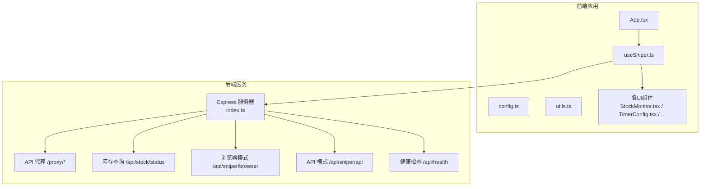
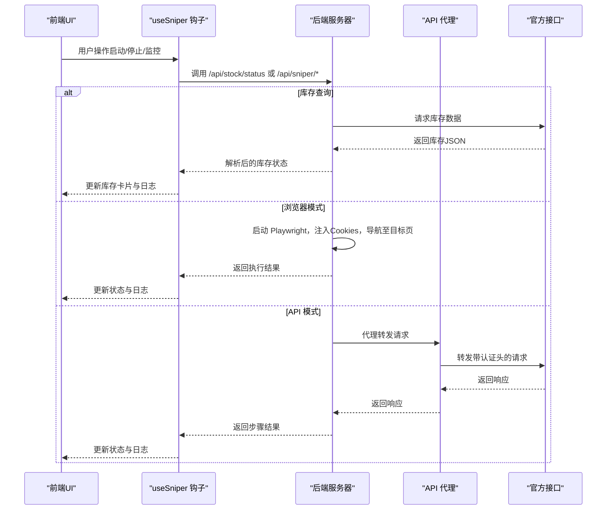
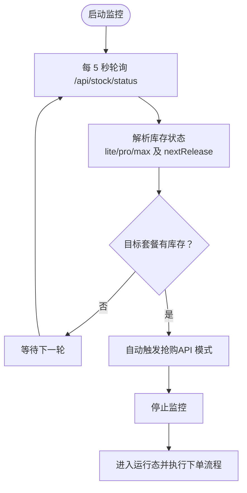
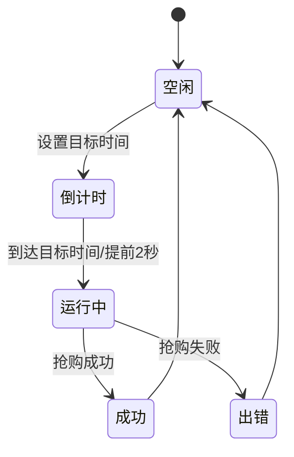
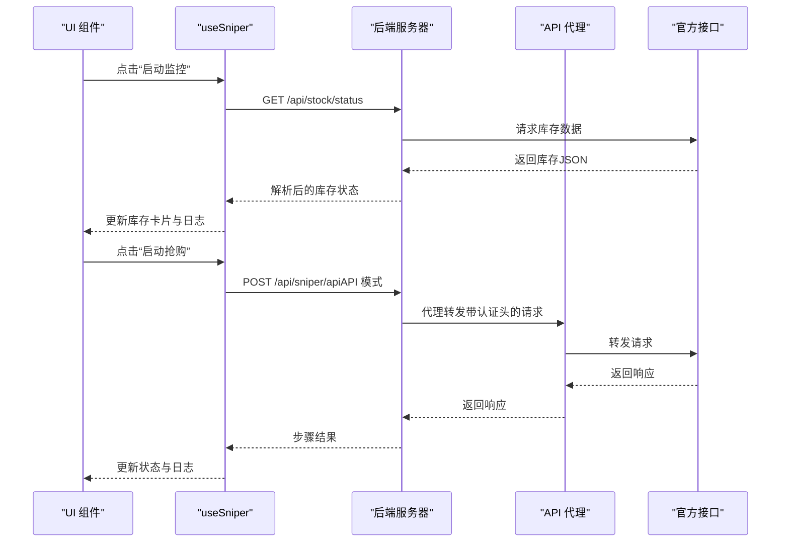
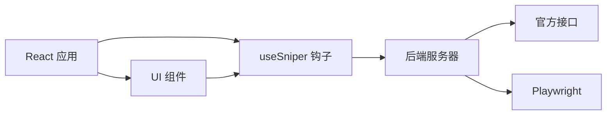

# 监控系统

<cite>
**本文引用的文件**
- [README.md](file://README.md)
- [package.json](file://package.json)
- [server/index.ts](file://server/index.ts)
- [src/App.tsx](file://src/App.tsx)
- [src/hooks/useSniper.ts](file://src/hooks/useSniper.ts)
- [src/lib/config.ts](file://src/lib/config.ts)
- [src/lib/utils.ts](file://src/lib/utils.ts)
- [src/components/StockMonitor.tsx](file://src/components/StockMonitor.tsx)
- [src/components/TimerConfig.tsx](file://src/components/TimerConfig.tsx)
- [src/components/AuthPanel.tsx](file://src/components/AuthPanel.tsx)
- [src/components/LogConsole.tsx](file://src/components/LogConsole.tsx)
- [src/components/ModeSwitcher.tsx](file://src/components/ModeSwitcher.tsx)
- [src/components/PlanSelector.tsx](file://src/components/PlanSelector.tsx)
- [src/components/ControlBar.tsx](file://src/components/ControlBar.tsx)
- [src/components/QuickGuide.tsx](file://src/components/QuickGuide.tsx)
</cite>

## 目录
1. [简介](#简介)
2. [项目结构](#项目结构)
3. [核心组件](#核心组件)
4. [架构总览](#架构总览)
5. [详细组件分析](#详细组件分析)
6. [依赖关系分析](#依赖关系分析)
7. [性能考虑](#性能考虑)
8. [故障排查指南](#故障排查指南)
9. [结论](#结论)
10. [附录](#附录)

## 简介
本项目为 GLM Sniper 监控系统，提供库存状态查询与自动触发抢购的能力。系统由前端 React 应用与后端 Express 服务组成，支持两种模式：
- 浏览器自动化模式：通过 Playwright 控制 Chromium 自动完成购买流程。
- API 高速模式：通过代理直连官方接口完成下单流程。

监控系统的核心能力包括：
- 定时轮询库存状态（默认每 5 秒一次）。
- 前端状态管理与可视化反馈。
- 后端服务协调与健康检查。
- 数据模型与状态转换逻辑。
- 错误处理与异常恢复机制。
- 配置项与性能优化建议。
- 监控界面使用方法与状态指示器含义。

## 项目结构
项目采用前端与后端分离的组织方式：
- 前端位于 src/，包含页面组件、业务钩子、配置与工具函数。
- 后端位于 server/，提供 API 代理、库存查询、浏览器自动化与 API 模式抢购等服务。
- 根目录包含构建脚本、依赖与配置文件。

图表来源
- [src/App.tsx:12-194](file://src/App.tsx#L12-L194)
- [src/hooks/useSniper.ts:46-406](file://src/hooks/useSniper.ts#L46-L406)
- [server/index.ts:10-370](file://server/index.ts#L10-L370)

章节来源
- [package.json:1-48](file://package.json#L1-L48)
- [README.md:1-74](file://README.md#L1-L74)

## 核心组件
- 前端状态与逻辑中心：useSniper 钩子负责模式切换、目标时间、认证信息、日志、状态机、库存监控与抢购执行。
- 库存监控组件：StockMonitor 展示库存状态、下次补货时间，并提供手动查询、启动/停止监控的交互。
- 定时配置组件：TimerConfig 展示倒计时并限制日期范围。
- 认证面板：AuthPanel 提供 Token/Cookies 的输入与验证。
- 日志控制台：LogConsole 实时滚动显示日志。
- 控制条：ControlBar 展示运行状态与启动/停止按钮。
- 快速指南：QuickGuide 提供不同模式的操作指引。

章节来源
- [src/hooks/useSniper.ts:46-406](file://src/hooks/useSniper.ts#L46-L406)
- [src/components/StockMonitor.tsx:27-140](file://src/components/StockMonitor.tsx#L27-L140)
- [src/components/TimerConfig.tsx:13-99](file://src/components/TimerConfig.tsx#L13-L99)
- [src/components/AuthPanel.tsx:14-120](file://src/components/AuthPanel.tsx#L14-L120)
- [src/components/LogConsole.tsx:17-78](file://src/components/LogConsole.tsx#L17-L78)
- [src/components/ControlBar.tsx:11-76](file://src/components/ControlBar.tsx#L11-L76)
- [src/components/QuickGuide.tsx:8-56](file://src/components/QuickGuide.tsx#L8-L56)

## 架构总览
系统采用“前端 UI + 前端业务逻辑 + 后端服务”的分层架构：
- 前端通过 useSniper 统一调度，调用后端接口或执行浏览器自动化。
- 后端提供 API 代理绕过跨域限制，统一暴露库存查询、浏览器自动化与 API 模式抢购接口。
- 健康检查接口用于服务可用性探测。

图表来源
- [src/hooks/useSniper.ts:77-106](file://src/hooks/useSniper.ts#L77-L106)
- [src/hooks/useSniper.ts:111-248](file://src/hooks/useSniper.ts#L111-L248)
- [server/index.ts:12-40](file://server/index.ts#L12-L40)
- [server/index.ts:252-355](file://server/index.ts#L252-L355)

## 详细组件分析

### 库存监控机制与自动触发逻辑
- 定时轮询策略：启动监控后每 5 秒调用后端库存查询接口，解析返回的库存状态。
- 自动触发逻辑：当目标套餐库存变为可用且满足条件（如已配置认证），则自动停止监控并进入“运行中”状态，随后执行 API 模式抢购。
- 状态提示：在 9:55-10:05 期间会提示“即将补货（约 10:00）”，并在 10:00 前后标记为“检查中”。

图表来源
- [src/hooks/useSniper.ts:318-372](file://src/hooks/useSniper.ts#L318-L372)
- [src/hooks/useSniper.ts:319-352](file://src/hooks/useSniper.ts#L319-L352)
- [server/index.ts:252-355](file://server/index.ts#L252-L355)

章节来源
- [src/hooks/useSniper.ts:305-372](file://src/hooks/useSniper.ts#L305-L372)
- [src/components/StockMonitor.tsx:27-140](file://src/components/StockMonitor.tsx#L27-L140)
- [server/index.ts:252-355](file://server/index.ts#L252-L355)

### 库存状态数据模型与状态转换
- 数据模型（StockStatus）：
  - lite/pro/max：每个套餐包含 available（是否可购）与 message（状态描述）。
  - nextRelease：下次补货时间或提示。
- 状态转换：
  - idle → countdown（设置目标时间后进入倒计时）。
  - countdown → running（到达目标时间或提前 2 秒执行）。
  - running → success/error（根据抢购结果更新）。
  - success/error → idle（手动停止或完成）。

图表来源
- [src/lib/config.ts:8](file://src/lib/config.ts#L8)
- [src/hooks/useSniper.ts:57](file://src/hooks/useSniper.ts#L57)
- [src/hooks/useSniper.ts:250-293](file://src/hooks/useSniper.ts#L250-L293)

章节来源
- [src/lib/config.ts:8](file://src/lib/config.ts#L8)
- [src/hooks/useSniper.ts:57](file://src/hooks/useSniper.ts#L57)

### 前端状态管理与后端服务协调
- 前端状态管理：useSniper 统一维护 mode、plan、targetDate/targetTime、authToken、cookies、status、logs、stockStatus、isMonitoring 等状态，并通过回调函数与组件交互。
- 后端服务协调：
  - API 代理：/proxy/* 转发请求并携带 Authorization 与 Cookie。
  - 库存查询：/api/stock/status 返回解析后的库存状态与原始数据。
  - 浏览器模式：/api/sniper/browser 使用 Playwright 自动化完成购买。
  - API 模式：/api/sniper/api 通过官方接口完成下单流程。
  - 健康检查：/api/health 返回服务状态。

图表来源
- [src/hooks/useSniper.ts:318-352](file://src/hooks/useSniper.ts#L318-L352)
- [src/hooks/useSniper.ts:111-248](file://src/hooks/useSniper.ts#L111-L248)
- [server/index.ts:12-40](file://server/index.ts#L12-L40)
- [server/index.ts:252-355](file://server/index.ts#L252-L355)

章节来源
- [src/hooks/useSniper.ts:46-406](file://src/hooks/useSniper.ts#L46-L406)
- [server/index.ts:10-370](file://server/index.ts#L10-L370)

### 库存状态查询 API
- 接口路径：/api/stock/status
- 功能：查询库存状态，解析返回内容中的套餐库存字段，补充“下次补货时间”提示。
- 时间智能提示：在 9:55-10:05 期间提示“即将补货（约 10:00）”，在 10:00 前后标记为“检查中”。

章节来源
- [server/index.ts:252-355](file://server/index.ts#L252-L355)

### 浏览器自动化模式
- 接口路径：/api/sniper/browser
- 功能：启动 Chromium，注入 Cookies，导航至目标页面，在目标时间附近刷新并点击订阅按钮，最后检测是否进入成功页面。
- 适用场景：无需认证 Token，但需提供 Cookies；适合验证码弹窗场景。

章节来源
- [server/index.ts:42-159](file://server/index.ts#L42-L159)

### API 高速模式
- 接口路径：/api/sniper/api
- 功能：按步骤调用官方接口完成限购检查、创建预订单、支付预览、创建签名、检查支付状态。
- 适用场景：需要认证 Token，适合无验证码或可快速处理验证码的场景。

章节来源
- [server/index.ts:161-250](file://server/index.ts#L161-L250)

### 前端组件与状态指示器
- StockMonitor：展示三个套餐的库存状态卡片、下次补货提示、手动查询与启动/停止监控按钮。
- TimerConfig：展示倒计时，限制日期范围，提示是否已过目标时间。
- ControlBar：展示状态指示器（空闲/倒计时/运行中/成功/出错）与启动/停止按钮。
- LogConsole：实时滚动日志，支持清空。
- ModeSwitcher/PlanSelector/AuthPanel/QuickGuide：提供模式切换、套餐选择、认证配置与使用指南。

章节来源
- [src/components/StockMonitor.tsx:27-140](file://src/components/StockMonitor.tsx#L27-L140)
- [src/components/TimerConfig.tsx:13-99](file://src/components/TimerConfig.tsx#L13-L99)
- [src/components/ControlBar.tsx:11-76](file://src/components/ControlBar.tsx#L11-L76)
- [src/components/LogConsole.tsx:17-78](file://src/components/LogConsole.tsx#L17-L78)
- [src/components/ModeSwitcher.tsx:10-62](file://src/components/ModeSwitcher.tsx#L10-L62)
- [src/components/PlanSelector.tsx:11-61](file://src/components/PlanSelector.tsx#L11-L61)
- [src/components/AuthPanel.tsx:14-120](file://src/components/AuthPanel.tsx#L14-L120)
- [src/components/QuickGuide.tsx:8-56](file://src/components/QuickGuide.tsx#L8-L56)

## 依赖关系分析
- 前端依赖：React、React Router、TailwindCSS、Lucide Icons、Playwright（用于浏览器自动化）、Express（后端服务）。
- 关键模块耦合：
  - useSniper 与 server/index.ts 的接口耦合度高，承担主要业务编排。
  - 组件间通过 props 与回调解耦，便于扩展与测试。
- 外部依赖点：官方接口、Playwright 浏览器、CORS 代理。

图表来源
- [package.json:14-26](file://package.json#L14-L26)
- [src/hooks/useSniper.ts:46-406](file://src/hooks/useSniper.ts#L46-L406)
- [server/index.ts:10-370](file://server/index.ts#L10-L370)

章节来源
- [package.json:14-26](file://package.json#L14-L26)

## 性能考虑
- 轮询频率：默认 5 秒一次，可在业务允许范围内适当降低以减少请求压力。
- 前端渲染：日志列表使用自动滚动，避免大量节点导致卡顿；库存卡片仅在状态变化时更新。
- 后端并发：浏览器自动化模式建议串行执行，避免多实例竞争；API 模式请求链路短，注意官方接口限流。
- 网络与延迟：倒计时提前 2 秒执行以补偿网络延迟，减少误差。
- 缓存与降级：库存查询结果可短期缓存，失败时回退默认“已售罄”状态并提示重试。

## 故障排查指南
- 后端服务未启动：前端调用后端接口会报错，检查后端服务是否监听本地端口。
- 认证无效：API 模式下若 Token 失效，验证接口会返回错误；请重新获取并粘贴。
- 验证码拦截：API 模式遇到验证码时会提示“验证码拦截”，需在官网完成验证后再重试；浏览器模式会弹窗暂停，需手动完成拼图验证。
- 轮询无变化：检查库存查询接口返回内容格式，必要时调整解析逻辑。
- 浏览器自动化失败：确认 Cookies 是否正确、目标时间是否合理、浏览器窗口是否可见。

章节来源
- [src/hooks/useSniper.ts:157-177](file://src/hooks/useSniper.ts#L157-L177)
- [src/components/AuthPanel.tsx:18-41](file://src/components/AuthPanel.tsx#L18-L41)
- [src/components/QuickGuide.tsx:42-52](file://src/components/QuickGuide.tsx#L42-L52)

## 结论
本监控系统通过前端状态管理与后端服务协调，实现了稳定的库存监控与自动触发抢购能力。系统具备清晰的状态机、直观的 UI 指示与完善的日志输出，能够适应浏览器自动化与 API 高速两种模式的需求。建议在生产环境中结合实际业务需求调整轮询频率、增强错误恢复与告警机制，并持续关注官方接口变更与验证码策略。

## 附录

### 配置选项与最佳实践
- 抢购模式：browser（浏览器自动化）或 api（API 高速）。
- 目标套餐：lite、pro、max。
- 目标时间：YYYY-MM-DD 与 HH:mm，限制在 1 天至 30 天内。
- 自动重试：API 模式在特定错误时最多重试若干次，间隔 1 秒。
- 库存检查：默认每 5 秒一次，可根据网络状况调整。

章节来源
- [src/lib/config.ts:18-26](file://src/lib/config.ts#L18-L26)
- [src/components/TimerConfig.tsx:34-40](file://src/components/TimerConfig.tsx#L34-L40)
- [src/hooks/useSniper.ts:169-177](file://src/hooks/useSniper.ts#L169-L177)

### 监控界面使用方法
- 在左侧配置区设置模式、套餐、目标时间与认证信息。
- 点击“启动监控”后，库存卡片会每 5 秒更新一次；当目标套餐有库存时自动触发抢购。
- 在右侧日志区查看实时日志，必要时点击“清空”清理历史记录。
- 如遇验证码拦截，请根据提示在官网完成验证后重试。

章节来源
- [src/App.tsx:74-184](file://src/App.tsx#L74-L184)
- [src/components/StockMonitor.tsx:87-138](file://src/components/StockMonitor.tsx#L87-L138)
- [src/components/LogConsole.tsx:26-78](file://src/components/LogConsole.tsx#L26-L78)