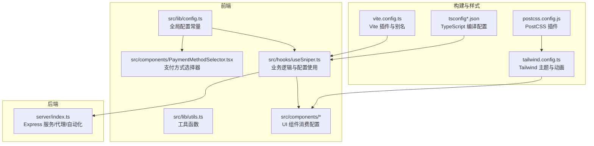
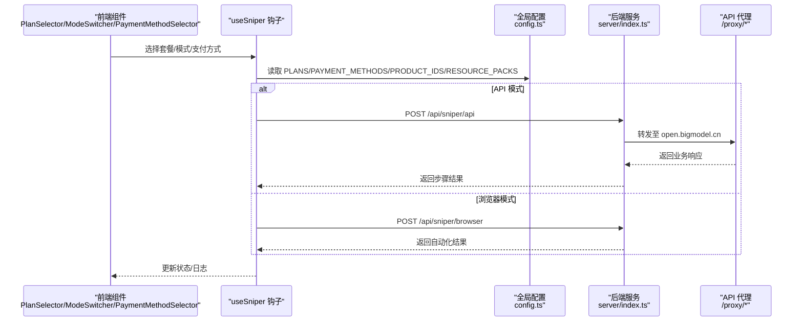
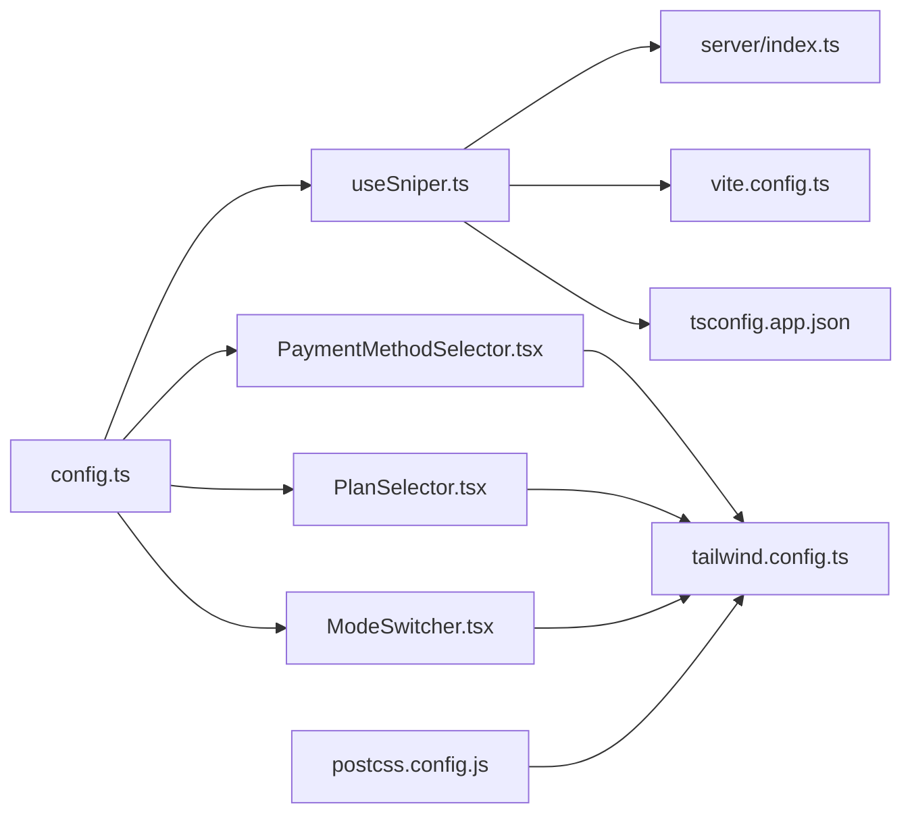

# 配置管理

<cite>
**本文引用的文件**
- [src/lib/config.ts](file://src/lib/config.ts)
- [src/components/PaymentMethodSelector.tsx](file://src/components/PaymentMethodSelector.tsx)
- [src/hooks/useSniper.ts](file://src/hooks/useSniper.ts)
- [vite.config.ts](file://vite.config.ts)
- [tailwind.config.ts](file://tailwind.config.ts)
- [postcss.config.js](file://postcss.config.js)
- [package.json](file://package.json)
- [tsconfig.json](file://tsconfig.json)
- [tsconfig.app.json](file://tsconfig.app.json)
- [tsconfig.node.json](file://tsconfig.node.json)
- [tsconfig.server.json](file://tsconfig.server.json)
- [server/index.ts](file://server/index.ts)
- [src/components/PlanSelector.tsx](file://src/components/PlanSelector.tsx)
- [src/components/ModeSwitcher.tsx](file://src/components/ModeSwitcher.tsx)
- [src/lib/utils.ts](file://src/lib/utils.ts)
</cite>

## 更新摘要
**变更内容**
- 支付系统配置标准化：channelCode从字符串改为标准支付方式代码（ALIPAY、WECHAT、BALANCE）
- 产品ID映射全面更新：所有产品ID已更新为真实的智谱AI产品代码格式（product-XXXXXX）
- API端点配置维护：保持稳定的API端点结构，与新的产品ID映射配合使用
- 资源包映射系统：RESOURCE_PACKS记录每个产品对应的资源包列表，支持自动关联

## 目录
1. [简介](#简介)
2. [项目结构](#项目结构)
3. [核心组件](#核心组件)
4. [架构总览](#架构总览)
5. [详细组件分析](#详细组件分析)
6. [依赖关系分析](#依赖关系分析)
7. [性能考量](#性能考量)
8. [故障排查指南](#故障排查指南)
9. [结论](#结论)
10. [附录](#附录)

## 简介
本文件系统性梳理 GLM Sniper 的配置管理体系，涵盖全局配置常量（API 端点、产品配置、默认参数、支付方法配置、资源包配置）、TypeScript/构建与样式配置、以及运行时配置的加载与使用方式。文档同时提供配置项说明、修改指南、环境变量使用与安全注意事项，以及配置优先级与覆盖规则。

## 项目结构
本项目采用前端 React + TypeScript + Vite 架构，配合 Tailwind CSS 样式框架与 PostCSS 处理管线；后端使用 Express 提供代理与自动化脚本执行能力。配置主要分布在以下位置：
- 全局配置常量：src/lib/config.ts
- 支付方法组件：src/components/PaymentMethodSelector.tsx
- 构建配置：vite.config.ts、tsconfig.*.json
- 样式配置：tailwind.config.ts、postcss.config.js
- 服务器配置：server/index.ts（监听端口、路由与代理）
- 组件与钩子：src/components/*、src/hooks/useSniper.ts（消费配置）

**图表来源**
- [src/lib/config.ts:1-166](file://src/lib/config.ts#L1-L166)
- [src/components/PaymentMethodSelector.tsx:1-55](file://src/components/PaymentMethodSelector.tsx#L1-L55)
- [src/hooks/useSniper.ts:1-489](file://src/hooks/useSniper.ts#L1-L489)
- [vite.config.ts:1-13](file://vite.config.ts#L1-L13)
- [tsconfig.app.json:1-35](file://tsconfig.app.json#L1-L35)
- [tailwind.config.ts:1-104](file://tailwind.config.ts#L1-L104)
- [postcss.config.js:1-7](file://postcss.config.js#L1-L7)
- [server/index.ts:1-419](file://server/index.ts#L1-L419)

**章节来源**
- [vite.config.ts:1-13](file://vite.config.ts#L1-L13)
- [tsconfig.json:1-8](file://tsconfig.json#L1-L8)
- [tsconfig.app.json:1-35](file://tsconfig.app.json#L1-L35)
- [tsconfig.node.json:1-25](file://tsconfig.node.json#L1-L25)
- [tsconfig.server.json:1-15](file://tsconfig.server.json#L1-L15)
- [tailwind.config.ts:1-104](file://tailwind.config.ts#L1-L104)
- [postcss.config.js:1-7](file://postcss.config.js#L1-L7)
- [package.json:1-49](file://package.json#L1-L49)

## 核心组件
本节聚焦全局配置常量与关键配置对象，说明其用途、结构与默认值。

### 支付方法配置系统
- 支付方式类型定义
  - PaymentMethod：定义支持的支付方式类型（alipay、wechat、balance）
  - 支付方式配置：PAYMENT_METHODS 常量包含每种支付方式的标准代码、显示名称和图标
  - **更新**：channelCode已标准化为标准支付方式代码（ALIPAY、WECHAT、BALANCE）
  - 默认支付方式：DEFAULT_PAYMENT_METHOD 设置为支付宝

- 资源包映射配置系统
  - 资源包映射：RESOURCE_PACKS 记录每个产品ID对应的资源包列表
  - 自动关联：在预订单创建时自动关联相应的资源包
  - 套餐覆盖：包含Lite、Pro、Max三个套餐的所有产品ID

- 套餐配置与默认产品
  - PLANS：定义各套餐的基础信息（名称、价格、产品ID），并可选徽标展示
  - PRODUCT_IDS：按套餐类型与支付周期（月付/季付/年付）映射具体产品ID
  - getDefaultProductId：提供默认产品ID（季付）的便捷查询
  - **更新**：PRODUCT_IDS中的产品ID已更新为真实的智谱AI产品代码格式（如product-02434c）

- 库存检查与产品ID映射
  - STOCK_CHECK_IDS：库存状态与各套餐配置的标识ID集合
  - 示例路径：[src/lib/config.ts:141-146](file://src/lib/config.ts#L141-L146)

- API 端点配置
  - API_ENDPOINTS：聚合所有业务相关端点（产品、库存、支付、用户等），统一前缀与路径
  - 示例路径：[src/lib/config.ts:148-166](file://src/lib/config.ts#L148-L166)

- 加密与安全
  - AES_KEY：用于示例场景的对称加密密钥（仅演示用途）
  - 示例路径：[src/lib/config.ts:103-104](file://src/lib/config.ts#L103-L104)

- 类型与接口
  - SniperMode、PlanType、SniperStatus、PlanConfig、SniperConfig：定义应用状态与配置的数据契约
  - 示例路径：[src/lib/config.ts:6-17](file://src/lib/config.ts#L6-L17)

**章节来源**
- [src/lib/config.ts:1-166](file://src/lib/config.ts#L1-L166)

## 架构总览
下图展示配置在系统中的流向：前端通过 useSniper 钩子消费全局配置，发起 API 调用或浏览器自动化；后端提供代理与健康检查；构建与样式配置贯穿开发与生产阶段。

**图表来源**
- [src/hooks/useSniper.ts:1-489](file://src/hooks/useSniper.ts#L1-L489)
- [server/index.ts:12-40](file://server/index.ts#L12-L40)
- [server/index.ts:162-250](file://server/index.ts#L162-L250)
- [src/lib/config.ts:85-166](file://src/lib/config.ts#L85-L166)

## 详细组件分析

### 全局配置常量（config.ts）
- 角色定位
  - 作为前端与后端共同的"事实来源"，集中管理产品、库存、API 端点与默认参数。
  - 通过类型导出保证跨模块一致的契约。

- 关键要点
  - 支付方法配置系统提供完整的支付方式管理，包括类型定义、配置映射和默认设置。
  - **更新**：channelCode已标准化为标准支付方式代码（ALIPAY、WECHAT、BALANCE），确保与后端接口的兼容性。
  - 资源包映射系统为每个产品ID自动关联相应的资源包列表。
  - 套餐与产品ID映射清晰，便于扩展新套餐或支付周期。
  - API_ENDPOINTS 将域名与路径分离，便于切换环境或代理。
  - 默认产品ID提供兜底策略，减少调用方的分支判断。

- 修改指南
  - 新增支付方式：在 PAYMENT_METHODS 中添加新的支付方式配置，确保code为标准支付方式代码。
  - 新增资源包：在 RESOURCE_PACKS 中为新产品ID添加对应的资源包列表。
  - 新增套餐：在 PLANS 与 PRODUCT_IDS 中同步添加条目。
  - 变更端点：更新 API_ENDPOINTS 对应键值。
  - 调整默认产品：修改 getDefaultProductId 的回退策略。

- 安全注意事项
  - AES_KEY 仅作演示用途，不应在生产暴露敏感密钥。
  - 若涉及真实密钥，建议通过环境变量注入并在编译期替换。

**章节来源**
- [src/lib/config.ts:1-166](file://src/lib/config.ts#L1-L166)

### 支付方法选择器组件（PaymentMethodSelector.tsx）
- 功能特性
  - 提供直观的支付方式选择界面，支持支付宝、微信支付和账户余额三种方式。
  - 实时显示所选支付方式的状态和视觉反馈。
  - 对账户余额支付提供额外的安全提醒。

- 使用方式
  - 通过 props 接收当前支付方式和变更回调函数。
  - 支持禁用状态，防止在抢购过程中更改支付方式。
  - 集成 PAYMENT_METHODS 配置，确保显示信息与配置保持一致。

- 设计特点
  - 使用表情符号作为支付方式的视觉标识。
  - 选中状态具有高亮效果和边框变化。
  - 响应式布局，适配不同屏幕尺寸。

**章节来源**
- [src/components/PaymentMethodSelector.tsx:1-55](file://src/components/PaymentMethodSelector.tsx#L1-L55)

### Vite 配置（vite.config.ts）
- 插件与别名
  - 使用 @vitejs/plugin-react，启用 React HMR。
  - 设置路径别名 @ 指向 src，简化导入路径。

- 构建与开发
  - dev/build/preview 脚本由 package.json 管理。
  - 与 TypeScript 配置配合，实现类型感知与路径解析。

**章节来源**
- [vite.config.ts:1-13](file://vite.config.ts#L1-L13)
- [package.json:6-12](file://package.json#L6-L12)

### TypeScript 配置（tsconfig.*.json）
- 顶层 tsconfig.json
  - 通过 references 引用 app 与 node 两套配置，实现分层编译。

- tsconfig.app.json
  - 面向浏览器应用，启用 JSX、路径别名与严格未使用检测。
  - 集成 Vite 客户端类型，支持 bundler 模式。

- tsconfig.node.json
  - 面向 Node 工具链（如 Vite 配置），启用 bundler 模式与严格未使用检测。

- tsconfig.server.json
  - 面向后端服务编译，设置 ESNext 模块与严格模式输出目录。

**章节来源**
- [tsconfig.json:1-8](file://tsconfig.json#L1-L8)
- [tsconfig.app.json:1-35](file://tsconfig.app.json#L1-L35)
- [tsconfig.node.json:1-25](file://tsconfig.node.json#L1-L25)
- [tsconfig.server.json:1-15](file://tsconfig.server.json#L1-L15)

### Tailwind CSS 配置（tailwind.config.ts）
- 内容扫描
  - 扫描 index.html 与 src 下的 TS/TSX 文件，确保按需生成样式。

- 深色模式
  - 使用 class 驱动的深色模式开关，便于主题切换。

- 主题扩展
  - 定义容器、圆角、字体族、颜色系统（含主色光晕/淡化变体）。
  - 注入动画 keyframes 与预设动画类，提升交互表现力。

- 插件
  - tailwindcss-animate 提供开箱即用的动画插件。

**章节来源**
- [tailwind.config.ts:1-104](file://tailwind.config.ts#L1-L104)

### PostCSS 配置（postcss.config.js）
- 插件链
  - tailwindcss：解析 Tailwind 指令。
  - autoprefixer：自动添加厂商前缀。

**章节来源**
- [postcss.config.js:1-7](file://postcss.config.js#L1-L7)

### 后端服务配置（server/index.ts）
- 代理与 CORS
  - /proxy 路由转发至 open.bigmodel.cn，携带 Authorization 与 Cookie。
  - 全局启用 CORS，支持跨域访问。

- 路由与端口
  - /api/sniper/browser：浏览器自动化模式。
  - /api/sniper/api：API 高速模式。
  - /api/stock/status：库存状态查询。
  - /api/health：健康检查。
  - 监听端口 3100，默认打印可用路由。

- 安全与错误处理
  - 对代理请求进行错误捕获并返回 500。
  - 浏览器自动化模式对页面内容进行成功判定。

**章节来源**
- [server/index.ts:1-419](file://server/index.ts#L1-L419)

### 组件与钩子中的配置使用
- useSniper 钩子
  - 读取 PLANS 与 getDefaultProductId，构造产品ID。
  - 通过 PROXY_BASE 与 API_ENDPOINTS 组装请求路径。
  - 在 API 模式下使用 Authorization 头与 Bearer Token。
  - 管理支付方式状态，支持动态切换支付方式。
  - **更新**：使用标准化的支付方式代码（ALIPAY、WECHAT、BALANCE）。
  - **新增**：自动关联资源包，通过RESOURCE_PACKS映射获取对应资源包列表。

- 组件
  - PlanSelector/ModeSwitcher 直接消费 PLANS 与类型，渲染套餐卡片与模式切换按钮。
  - PaymentMethodSelector 消费 PAYMENT_METHODS 配置，提供支付方式选择界面。

**章节来源**
- [src/hooks/useSniper.ts:1-489](file://src/hooks/useSniper.ts#L1-L489)
- [src/components/PlanSelector.tsx:1-112](file://src/components/PlanSelector.tsx#L1-L112)
- [src/components/ModeSwitcher.tsx:1-62](file://src/components/ModeSwitcher.tsx#L1-L62)

## 依赖关系分析
- 前端依赖
  - React 生态与 Tailwind CSS 生态，构建工具链由 Vite + TypeScript 提供。
  - 服务器依赖 Express、CORS、Playwright（浏览器自动化）。

- 配置耦合
  - useSniper 与 config.ts 强耦合，确保产品与端点变更时统一维护。
  - server/index.ts 与 config.ts 的 API_ENDPOINTS 保持一致，避免硬编码差异。
  - PaymentMethodSelector 组件直接依赖 PAYMENT_METHODS 配置。
  - **新增**：useSniper 钩子依赖 RESOURCE_PACKS 配置，确保资源包正确关联。

**图表来源**
- [src/lib/config.ts:1-166](file://src/lib/config.ts#L1-L166)
- [src/hooks/useSniper.ts:1-489](file://src/hooks/useSniper.ts#L1-L489)
- [src/components/PlanSelector.tsx:1-112](file://src/components/PlanSelector.tsx#L1-L112)
- [src/components/ModeSwitcher.tsx:1-62](file://src/components/ModeSwitcher.tsx#L1-L62)
- [src/components/PaymentMethodSelector.tsx:1-55](file://src/components/PaymentMethodSelector.tsx#L1-L55)
- [server/index.ts:1-419](file://server/index.ts#L1-L419)
- [vite.config.ts:1-13](file://vite.config.ts#L1-L13)
- [tsconfig.app.json:1-35](file://tsconfig.app.json#L1-L35)
- [tailwind.config.ts:1-104](file://tailwind.config.ts#L1-L104)
- [postcss.config.js:1-7](file://postcss.config.js#L1-L7)

## 性能考量
- 构建性能
  - 使用 React 插件与 bundler 模式，减少打包体积与编译时间。
  - 分离 app 与 node 配置，避免不必要的类型扫描。

- 运行时性能
  - API 模式通过代理直连后端，减少中间层开销。
  - 浏览器自动化模式在目标时间前 2 秒提前唤醒，降低网络抖动影响。

- 样式性能
  - Tailwind 按需扫描与动画插件，避免生成冗余样式。

## 故障排查指南
- 后端服务未启动
  - 现象：前端调用 /api/sniper/* 或 /api/stock/status 返回连接失败。
  - 排查：确认 npm run server 已启动，监听端口 3100。

- CORS 错误
  - 现象：代理 /proxy/* 返回跨域错误。
  - 排查：确认后端已启用 CORS，且请求头包含 Authorization/Cookie。

- 认证失败
  - 现象：API 模式下单创建失败或被拦截。
  - 排查：检查 Authorization 头是否正确传递；若出现验证码拦截，按日志提示在官网完成验证后重试。

- 库存状态异常
  - 现象：库存查询返回默认"已售罄"。
  - 排查：确认 /api/stock/status 能正常访问 open.bigmodel.cn；关注补货窗口期的特殊提示。

- 支付方式问题
  - 现象：支付方式选择无效或支付失败。
  - 排查：确认 PAYMENT_METHODS 配置正确，检查支付方式代码与后端接口兼容性。

- **新增**：资源包关联问题
  - 现象：预订单创建成功但缺少资源包或资源包关联错误。
  - 排查：确认 RESOURCE_PACKS 中对应产品ID的资源包列表存在且有效。

**章节来源**
- [src/hooks/useSniper.ts:1-489](file://src/hooks/useSniper.ts#L1-L489)
- [server/index.ts:12-40](file://server/index.ts#L12-L40)
- [server/index.ts:252-355](file://server/index.ts#L252-L355)

## 结论
本项目的配置管理以集中式常量为核心，结合 Vite/TypeScript/Tailwind 的现代工具链，形成清晰、可维护、可扩展的配置体系。通过明确的类型约束与统一的端点管理，降低了跨模块耦合风险；通过代理与自动化脚本，兼顾了易用性与性能。新增的支付方法配置系统进一步增强了用户体验，提供了灵活的支付方式选择。**更新**：支付系统已完成标准化，channelCode已改为标准支付方式代码（ALIPAY、WECHAT、BALANCE），确保了与后端接口的兼容性和一致性。**新增**：资源包映射系统为每个产品自动关联相应的资源包，提升了购买流程的完整性。**最新更新**：PRODUCT_IDS中的产品ID已更新为真实的智谱AI产品代码格式（如product-02434c、product-1df3e1等），包括Lite、Pro、Max套餐的月付、季付、年付产品ID均已更新为实际的product-xxxxxx格式，为后续的支付流程提供了准确的产品标识。建议在生产环境中进一步完善环境变量注入与密钥管理策略。

## 附录

### 配置项清单与修改指南
- 支付方法配置
  - 新增支付方式：在 PAYMENT_METHODS 中添加新的支付方式配置，确保code为标准支付方式代码。
  - 调整默认支付方式：修改 DEFAULT_PAYMENT_METHOD 的默认值。
  - **更新**：channelCode已标准化为标准支付方式代码（ALIPAY、WECHAT、BALANCE）。
  - 参考路径：[src/lib/config.ts:85-93](file://src/lib/config.ts#L85-L93)

- 资源包映射配置
  - 新增资源包：在 RESOURCE_PACKS 中为新产品ID添加对应的资源包列表。
  - 调整资源包：修改现有产品的资源包列表。
  - **新增**：RESOURCE_PACKS 记录每个产品ID对应的资源包列表，自动关联到预订单创建流程。
  - 参考路径：[src/lib/config.ts:117-131](file://src/lib/config.ts#L117-L131)

- 套餐与产品ID
  - 新增套餐：在 PLANS 与 PRODUCT_IDS 中添加对应键值。
  - 调整默认产品：修改 getDefaultProductId 的映射。
  - **更新**：PRODUCT_IDS中的产品ID已更新为真实的智谱AI产品代码格式（如product-02434c、product-1df3e1等），包括Lite、Pro、Max套餐的月付、季付、年付产品ID均已更新为实际的product-xxxxxx格式。
  - 参考路径：[src/lib/config.ts:95-131](file://src/lib/config.ts#L95-L131)

- API 端点
  - 修改端点：更新 API_ENDPOINTS 对应键值。
  - 参考路径：[src/lib/config.ts:148-166](file://src/lib/config.ts#L148-L166)

- 默认参数
  - 目标时间格式：YYYY-MM-DD 与 HH:mm。
  - 重试策略：最大重试次数与间隔（在 useSniper 中体现）。
  - 参考路径：[src/hooks/useSniper.ts:1-489](file://src/hooks/useSniper.ts#L1-L489)

### 环境变量使用与安全注意事项
- 当前仓库未使用环境变量，建议新增以下场景：
  - 后端端口：通过环境变量控制（例如 PORT）。
  - API 基础地址：通过环境变量控制（例如 BIGMODEL_API_BASE）。
  - 安全密钥：通过环境变量注入，避免提交到版本库。
- 安全建议：
  - 不在客户端暴露任何密钥或敏感令牌。
  - 使用 HTTPS 与最小权限原则管理访问。
  - 对外暴露的代理接口增加鉴权与速率限制。

### 配置优先级与覆盖规则
- 前端优先级
  - 组件层：局部状态（如计划、时间、Token、支付方式）优先于全局配置。
  - 全局配置：config.ts 提供默认值，组件/钩子可覆盖。
- 后端优先级
  - 代理层：/proxy/* 直接转发请求头（Authorization/Cookie），不篡改。
  - 路由层：/api/sniper/* 与 /api/stock/status 优先于代理。
- 覆盖规则
  - 组件/钩子可通过 props 或状态覆盖默认配置。
  - 构建配置（Vite/TS）通过命令行与环境变量间接影响（如引入 dotenv 插件）。