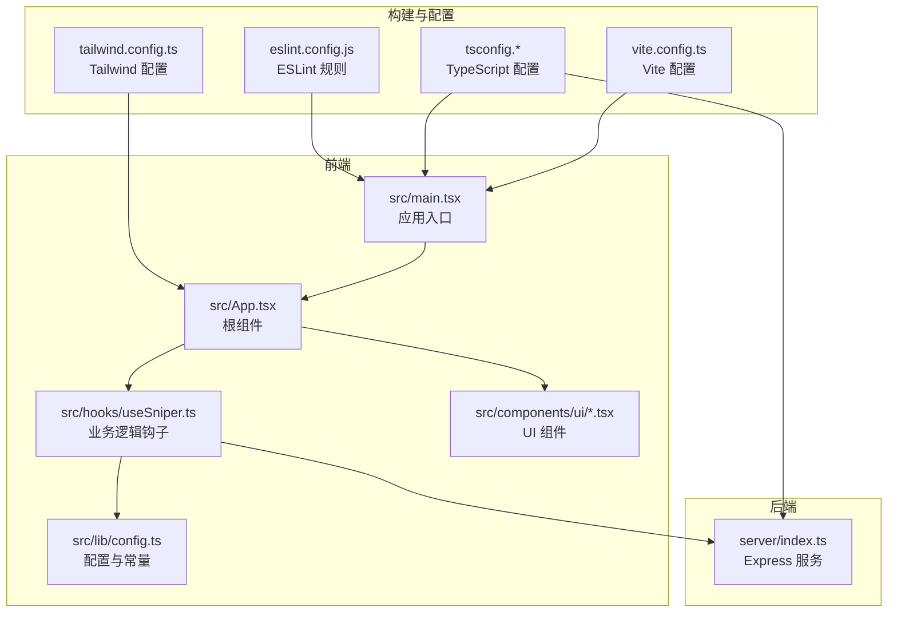
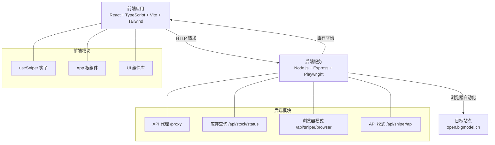
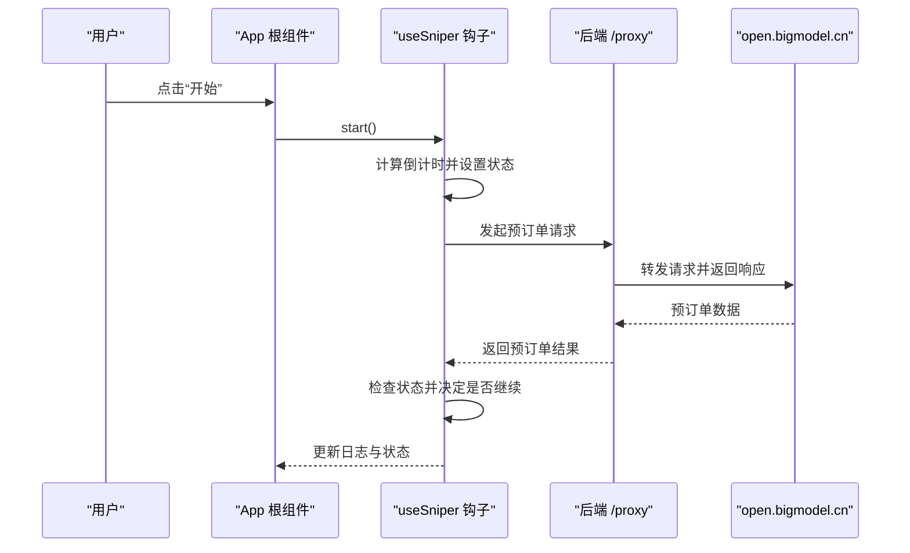
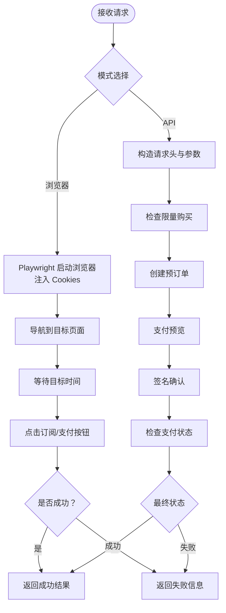
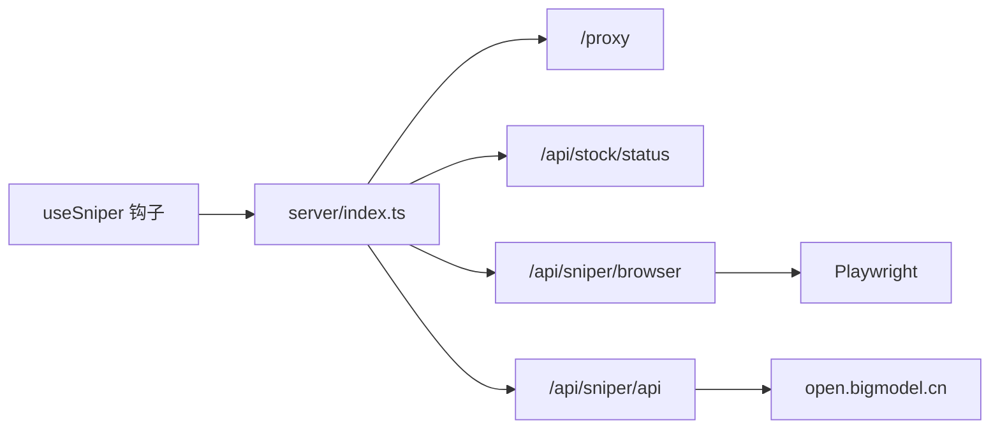

# 技术栈概览

<cite>
**本文档引用的文件**
- [package.json](file://package.json)
- [vite.config.ts](file://vite.config.ts)
- [tailwind.config.ts](file://tailwind.config.ts)
- [tsconfig.json](file://tsconfig.json)
- [tsconfig.app.json](file://tsconfig.app.json)
- [tsconfig.node.json](file://tsconfig.node.json)
- [eslint.config.js](file://eslint.config.js)
- [src/main.tsx](file://src/main.tsx)
- [src/App.tsx](file://src/App.tsx)
- [src/hooks/useSniper.ts](file://src/hooks/useSniper.ts)
- [src/lib/config.ts](file://src/lib/config.ts)
- [src/components/ui/button.tsx](file://src/components/ui/button.tsx)
- [src/components/ui/card.tsx](file://src/components/ui/card.tsx)
- [server/index.ts](file://server/index.ts)
</cite>

## 目录
1. [简介](#简介)
2. [项目结构](#项目结构)
3. [核心组件](#核心组件)
4. [架构总览](#架构总览)
5. [详细组件分析](#详细组件分析)
6. [依赖关系分析](#依赖关系分析)
7. [性能考虑](#性能考虑)
8. [故障排除指南](#故障排除指南)
9. [结论](#结论)

## 简介
本项目采用“前端 React 19.2.5 + TypeScript + Vite + Tailwind CSS”与“后端 Node.js + Express.js + Playwright”的混合架构，围绕 GLM Coding Plan 的限时抢购场景构建。前端负责交互界面与业务逻辑编排，后端提供 API 代理、库存查询以及浏览器自动化抢购能力，并通过 Playwright 实现对目标站点的自动化操作。

- 前端技术栈优势
  - React 19.2.5：现代化组件模型，支持并发特性与更优的渲染性能。
  - TypeScript：强类型保障开发体验与可维护性。
  - Vite：快速冷启动与热更新，优化开发体验。
  - Tailwind CSS：原子化样式与主题变量，提升设计一致性与开发效率。
- 后端技术栈优势
  - Node.js + Express.js：轻量、高性能的 Web 框架，适合快速实现 API 与自动化流程。
  - Playwright：跨浏览器自动化，稳定可靠地模拟用户行为，适配复杂的页面交互。
- 关键依赖作用
  - React Hooks：集中管理状态与副作用，简化组件逻辑。
  - Lucide React：提供一致的矢量图标库，统一视觉语言。
  - CORS 处理：解决前端跨域问题，保证代理与自动化流程顺畅。
  - class-variance-authority、clsx、tailwind-merge：统一组件变体与类名合并，减少样式冲突。
  - eslint-plugin-react-hooks：规范 Hook 使用，降低误用风险。

## 项目结构
项目采用按功能分层的组织方式：
- 前端
  - src/main.tsx：应用入口，挂载根组件。
  - src/App.tsx：应用根组件，组织页面布局与功能模块。
  - src/hooks/useSniper.ts：核心业务逻辑钩子，封装抢购、库存监控、日志记录等。
  - src/lib/config.ts：全局配置与常量定义。
  - src/components/ui/button.tsx、src/components/ui/card.tsx：基础 UI 组件。
- 后端
  - server/index.ts：Express 服务器，提供 API 代理、库存查询与浏览器自动化接口。
- 构建与配置
  - vite.config.ts：Vite 配置，启用 React 插件与路径别名。
  - tailwind.config.ts：Tailwind 主题与动画扩展。
  - tsconfig.*：双 tsconfig 配置，分别面向应用与 Node 环境。
  - eslint.config.js：ESLint 规则，集成 React Hooks 与 React Refresh。

**图表来源**
- [src/main.tsx:1-11](file://src/main.tsx#L1-L11)
- [src/App.tsx:1-197](file://src/App.tsx#L1-L197)
- [src/hooks/useSniper.ts:1-407](file://src/hooks/useSniper.ts#L1-L407)
- [src/lib/config.ts:1-104](file://src/lib/config.ts#L1-L104)
- [src/components/ui/button.tsx:1-49](file://src/components/ui/button.tsx#L1-L49)
- [src/components/ui/card.tsx:1-47](file://src/components/ui/card.tsx#L1-L47)
- [server/index.ts:1-370](file://server/index.ts#L1-L370)
- [vite.config.ts:1-13](file://vite.config.ts#L1-L13)
- [tailwind.config.ts:1-104](file://tailwind.config.ts#L1-L104)
- [tsconfig.json:1-8](file://tsconfig.json#L1-L8)
- [eslint.config.js:1-23](file://eslint.config.js#L1-L23)

**章节来源**
- [src/main.tsx:1-11](file://src/main.tsx#L1-L11)
- [src/App.tsx:1-197](file://src/App.tsx#L1-L197)
- [vite.config.ts:1-13](file://vite.config.ts#L1-L13)
- [tailwind.config.ts:1-104](file://tailwind.config.ts#L1-L104)
- [tsconfig.json:1-8](file://tsconfig.json#L1-L8)
- [eslint.config.js:1-23](file://eslint.config.js#L1-L23)

## 核心组件
- useSniper 钩子：集中管理抢购模式、套餐、目标时间、认证信息、日志与状态；提供倒计时、API 模式与浏览器模式两种执行路径；内置库存监控与自动触发机制。
- App 根组件：基于 Tailwind 类名组织页面网格布局，承载模式切换、套餐选择、定时器配置、库存监控、认证面板、日志控制台与操作栏。
- UI 组件：Button 与 Card 通过 class-variance-authority 提供变体与尺寸，结合 clsx 与 tailwind-merge 统一类名合并策略。
- 服务器：提供 /proxy 代理、/api/stock/status 库存查询、/api/sniper/browser 与 /api/sniper/api 两种抢购接口，并输出健康检查信息。

**章节来源**
- [src/hooks/useSniper.ts:1-407](file://src/hooks/useSniper.ts#L1-L407)
- [src/App.tsx:1-197](file://src/App.tsx#L1-L197)
- [src/components/ui/button.tsx:1-49](file://src/components/ui/button.tsx#L1-L49)
- [src/components/ui/card.tsx:1-47](file://src/components/ui/card.tsx#L1-L47)
- [server/index.ts:1-370](file://server/index.ts#L1-L370)

## 架构总览
系统分为前端与后端两部分，前端通过 useSniper 钩子协调业务流程，后端提供代理与自动化能力，二者通过本地 HTTP 接口通信。

**图表来源**
- [src/hooks/useSniper.ts:1-407](file://src/hooks/useSniper.ts#L1-L407)
- [src/App.tsx:1-197](file://src/App.tsx#L1-L197)
- [server/index.ts:1-370](file://server/index.ts#L1-L370)

## 详细组件分析

### 前端组件与状态流
- useSniper 钩子
  - 负责状态管理：模式、套餐、目标时间、认证信息、日志与状态。
  - 提供倒计时与执行逻辑：提前 2 秒补偿网络延迟，区分浏览器与 API 两种模式。
  - API 模式：通过 /proxy 代理访问 open.bigmodel.cn 的接口，包含预订单创建、支付预览、签名确认与支付状态检查。
  - 浏览器模式：调用后端 /api/sniper/browser，由 Playwright 自动打开目标页面并点击订阅/支付按钮。
  - 库存监控：周期性轮询 /api/stock/status，检测目标套餐库存变化，必要时自动触发 API 模式抢购。
- App 根组件
  - 使用 Tailwind 类名组织网格布局，左侧配置区，右侧日志与引导区。
  - 通过组件组合实现模式切换、套餐选择、定时器配置、库存监控、认证面板与控制栏。
- UI 组件
  - Button 与 Card 通过变体与尺寸统一风格，结合主题变量实现深浅色模式与动效。

**图表来源**
- [src/hooks/useSniper.ts:111-248](file://src/hooks/useSniper.ts#L111-L248)
- [server/index.ts:12-40](file://server/index.ts#L12-L40)

**章节来源**
- [src/hooks/useSniper.ts:1-407](file://src/hooks/useSniper.ts#L1-L407)
- [src/App.tsx:1-197](file://src/App.tsx#L1-L197)
- [src/components/ui/button.tsx:1-49](file://src/components/ui/button.tsx#L1-L49)
- [src/components/ui/card.tsx:1-47](file://src/components/ui/card.tsx#L1-L47)

### 后端服务与自动化流程
- API 代理
  - 将前端请求转发至 open.bigmodel.cn，保留 Authorization 与 Cookie 头，解决跨域限制。
- 库存查询
  - 调用公开接口查询库存状态，解析返回数据，标注补货时间与各套餐可用性。
- 浏览器自动化
  - 使用 Chromium 启动新上下文，注入 Cookies，导航至目标页面，在指定时间点触发订阅与支付流程。
- API 模式
  - 依次执行“检查限量购买”、“创建预订单”、“支付预览”、“签名确认”、“支付状态检查”，并在成功时返回结果。

**图表来源**
- [server/index.ts:43-159](file://server/index.ts#L43-L159)
- [server/index.ts:162-250](file://server/index.ts#L162-L250)
- [server/index.ts:253-355](file://server/index.ts#L253-L355)

**章节来源**
- [server/index.ts:1-370](file://server/index.ts#L1-L370)

### 关键依赖与配置
- 前端依赖
  - React 19.2.5、react-dom：组件框架与渲染。
  - lucide-react：图标库，统一视觉元素。
  - class-variance-authority、clsx、tailwind-merge：组件变体与类名合并。
  - @vitejs/plugin-react：Vite React 插件。
  - tailwindcss、tailwindcss-animate：原子化样式与动效。
  - @types/*：类型声明。
- 后端依赖
  - express：Web 框架。
  - cors：跨域处理。
  - playwright：浏览器自动化。
  - cookie-parse：解析 Cookie。
- 构建与开发工具
  - Vite：开发服务器与打包。
  - TypeScript：类型系统。
  - ESLint：代码质量与规范。

**章节来源**
- [package.json:1-48](file://package.json#L1-L48)
- [vite.config.ts:1-13](file://vite.config.ts#L1-L13)
- [tailwind.config.ts:1-104](file://tailwind.config.ts#L1-L104)
- [tsconfig.app.json:1-34](file://tsconfig.app.json#L1-L34)
- [tsconfig.node.json:1-25](file://tsconfig.node.json#L1-L25)
- [eslint.config.js:1-23](file://eslint.config.js#L1-L23)

## 依赖关系分析
- 前端对后端的依赖
  - useSniper 通过本地 HTTP 接口调用后端服务，包括 /proxy、/api/stock/status、/api/sniper/browser、/api/sniper/api。
- 组件间耦合
  - App 根组件聚合多个功能组件，通过 useSniper 提供的状态与方法进行交互。
  - UI 组件通过主题变量与工具函数保持一致的外观与行为。
- 外部依赖
  - open.bigmodel.cn 的公开接口用于库存查询与抢购流程。
  - Playwright 作为外部自动化引擎，受浏览器驱动与网络环境影响。

**图表来源**
- [src/hooks/useSniper.ts:108-248](file://src/hooks/useSniper.ts#L108-L248)
- [server/index.ts:1-370](file://server/index.ts#L1-L370)

**章节来源**
- [src/hooks/useSniper.ts:1-407](file://src/hooks/useSniper.ts#L1-L407)
- [server/index.ts:1-370](file://server/index.ts#L1-L370)

## 性能考虑
- 前端性能
  - Vite 提供快速冷启动与热更新，减少开发等待时间。
  - React 19 的并发特性有助于提升复杂界面的渲染性能。
  - Tailwind 原子化样式减少 CSS 文件体积，提高构建效率。
- 后端性能
  - Express 轻量高效，适合短时任务与自动化流程。
  - Playwright 启动成本较高，建议在需要时才启动浏览器实例，并合理复用上下文。
- 网络与稳定性
  - 使用 /proxy 统一转发请求，避免跨域导致的额外握手开销。
  - API 模式在失败时具备有限重试机制，减少瞬时错误的影响。

## 故障排除指南
- 启动顺序
  - 先启动后端服务（npm run server），再启动前端（npm run dev）。前端会向本地 3100 端口发起请求。
- 跨域问题
  - 后端已启用 CORS 中间件，若仍出现跨域错误，检查请求头与代理路径是否正确。
- 浏览器自动化失败
  - 确保本地安装了 Chromium 或对应驱动；检查 Cookies 是否有效；关注页面结构变化导致的选择器失效。
- 抢购失败
  - API 模式可能触发验证码拦截，需在官网完成验证后再重试；检查认证 Token 与产品 ID 是否匹配。
- 库存监控无效
  - 确认后端 /api/stock/status 可正常访问；检查目标套餐 ID 与返回数据格式。

**章节来源**
- [server/index.ts:357-370](file://server/index.ts#L357-L370)
- [src/hooks/useSniper.ts:157-177](file://src/hooks/useSniper.ts#L157-L177)

## 结论
本项目以 React 19 + TypeScript + Vite + Tailwind 构建现代前端体验，配合 Node.js + Express + Playwright 的后端能力，形成一套完整的抢购解决方案。通过 useSniper 钩子统一编排业务流程，结合 /proxy 代理与库存监控，既满足初学者的易用性需求，也为有经验的开发者提供了清晰的扩展点与优化空间。