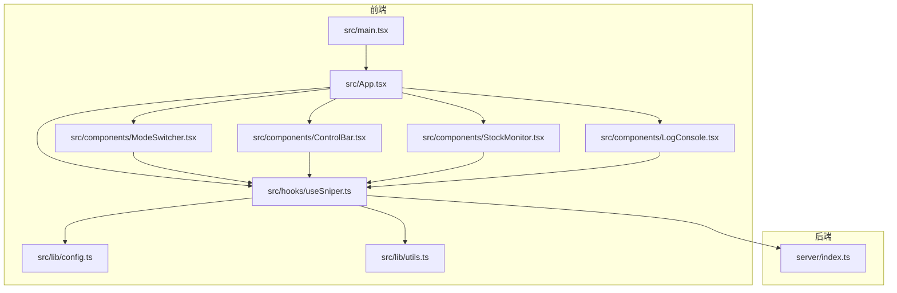
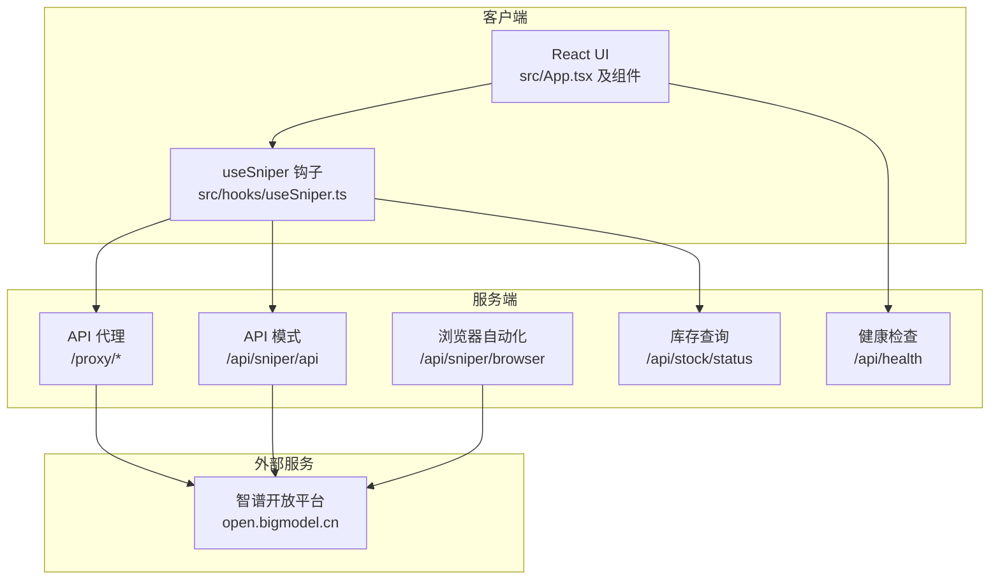
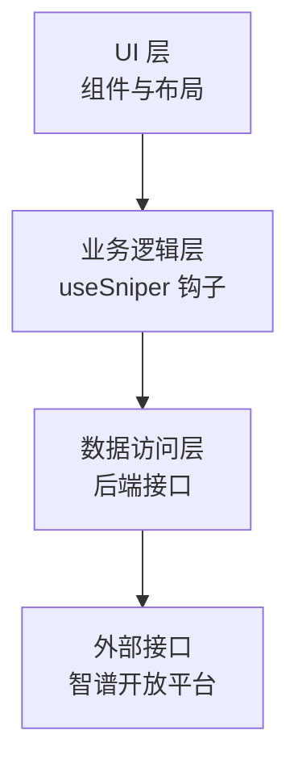
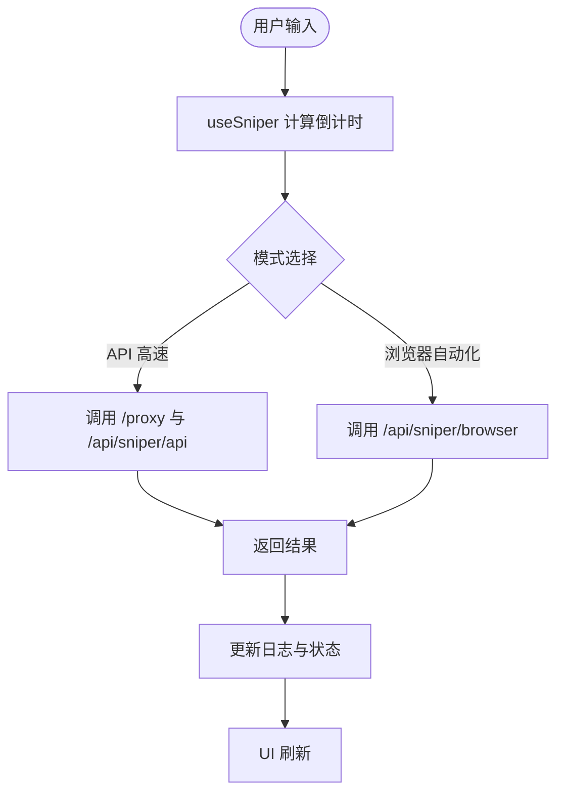
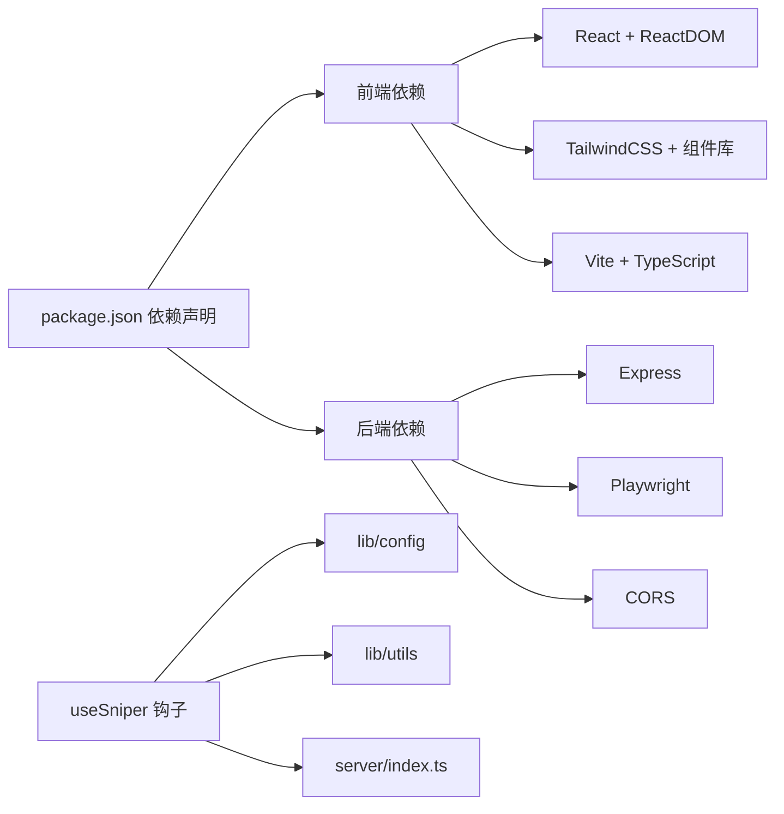

# 架构设计概览

<cite>
**本文档引用的文件**
- [README.md](file://README.md)
- [package.json](file://package.json)
- [vite.config.ts](file://vite.config.ts)
- [tsconfig.json](file://tsconfig.json)
- [tailwind.config.ts](file://tailwind.config.ts)
- [src/main.tsx](file://src/main.tsx)
- [src/App.tsx](file://src/App.tsx)
- [src/hooks/useSniper.ts](file://src/hooks/useSniper.ts)
- [src/lib/config.ts](file://src/lib/config.ts)
- [src/lib/utils.ts](file://src/lib/utils.ts)
- [src/components/ControlBar.tsx](file://src/components/ControlBar.tsx)
- [src/components/ModeSwitcher.tsx](file://src/components/ModeSwitcher.tsx)
- [src/components/StockMonitor.tsx](file://src/components/StockMonitor.tsx)
- [src/components/LogConsole.tsx](file://src/components/LogConsole.tsx)
- [server/index.ts](file://server/index.ts)
</cite>

## 目录
1. [引言](#引言)
2. [项目结构](#项目结构)
3. [核心组件](#核心组件)
4. [架构总览](#架构总览)
5. [详细组件分析](#详细组件分析)
6. [依赖关系分析](#依赖关系分析)
7. [性能考虑](#性能考虑)
8. [故障排查指南](#故障排查指南)
9. [结论](#结论)
10. [附录](#附录)

## 引言
本项目是一个基于 React + TypeScript 的前端应用与 Express 后端服务协同工作的“GLM Sniper”抢购辅助工具。其核心目标是在特定时间点自动完成“GLM Coding Plan”的订阅流程，支持两种模式：
- API 高速模式：通过代理后端直连官方接口，减少网络往返与浏览器渲染开销。
- 浏览器自动化模式：由后端使用 Playwright 控制 Chromium，模拟真实用户操作完成订阅。

系统采用分层架构设计：UI 层负责交互与可视化；业务逻辑层封装抢购流程与状态管理；数据访问层通过后端代理或直接 HTTP 调用实现对官方接口的访问。同时，系统具备库存监控、日志记录、倒计时与重试等能力，满足高并发场景下的稳定性需求。

## 项目结构
项目采用“前端单页应用 + 后端代理/自动化服务”的双栈架构。前端使用 Vite + React + TypeScript + TailwindCSS，后端使用 Express + Playwright。核心目录与职责如下：
- 前端
  - src/main.tsx：应用入口，挂载根组件
  - src/App.tsx：主界面容器，组合各功能面板
  - src/hooks/useSniper.ts：业务逻辑钩子，封装抢购流程、状态管理与后端通信
  - src/lib/config.ts 与 src/lib/utils.ts：全局配置与通用工具
  - src/components/*：可复用 UI 组件（控制条、模式切换、库存监控、日志面板等）
- 后端
  - server/index.ts：Express 服务，提供 API 代理、库存查询、浏览器自动化抢购等接口

图表来源
- [src/main.tsx:1-11](file://src/main.tsx#L1-L11)
- [src/App.tsx:1-197](file://src/App.tsx#L1-L197)
- [src/hooks/useSniper.ts:1-407](file://src/hooks/useSniper.ts#L1-L407)
- [src/lib/config.ts:1-104](file://src/lib/config.ts#L1-L104)
- [src/lib/utils.ts:1-51](file://src/lib/utils.ts#L1-L51)
- [src/components/ModeSwitcher.tsx:1-62](file://src/components/ModeSwitcher.tsx#L1-L62)
- [src/components/ControlBar.tsx:1-76](file://src/components/ControlBar.tsx#L1-L76)
- [src/components/StockMonitor.tsx:1-140](file://src/components/StockMonitor.tsx#L1-L140)
- [src/components/LogConsole.tsx:1-78](file://src/components/LogConsole.tsx#L1-L78)
- [server/index.ts:1-370](file://server/index.ts#L1-L370)

章节来源
- [vite.config.ts:1-13](file://vite.config.ts#L1-L13)
- [tsconfig.json:1-8](file://tsconfig.json#L1-L8)
- [tailwind.config.ts:1-104](file://tailwind.config.ts#L1-L104)
- [package.json:1-48](file://package.json#L1-L48)

## 核心组件
- useSniper 钩子：集中管理抢购状态、计划、认证信息、日志与定时器，并封装两种模式的执行流程与重试策略。
- ModeSwitcher：在“浏览器自动化”和“API 高速”模式间切换。
- ControlBar：显示当前状态并提供启动/停止按钮。
- StockMonitor：展示各套餐库存状态，支持手动查询与自动轮询监控。
- LogConsole：实时滚动输出日志，支持清空。
- 后端 server/index.ts：提供 /proxy、/api/sniper/browser、/api/sniper/api、/api/stock/status 等接口，支撑前端功能。

章节来源
- [src/hooks/useSniper.ts:1-407](file://src/hooks/useSniper.ts#L1-L407)
- [src/components/ModeSwitcher.tsx:1-62](file://src/components/ModeSwitcher.tsx#L1-L62)
- [src/components/ControlBar.tsx:1-76](file://src/components/ControlBar.tsx#L1-L76)
- [src/components/StockMonitor.tsx:1-140](file://src/components/StockMonitor.tsx#L1-L140)
- [src/components/LogConsole.tsx:1-78](file://src/components/LogConsole.tsx#L1-L78)
- [server/index.ts:1-370](file://server/index.ts#L1-L370)

## 架构总览
系统采用“前端 UI + 后端服务”的双栈协作模式：
- 前端 React 应用负责用户交互与状态展示，通过 useSniper 钩子统一调度业务逻辑。
- 后端 Express 服务提供两类能力：
  - API 代理：转发请求至官方域名，绕过浏览器 CORS 限制。
  - 浏览器自动化：在受控环境下驱动 Chromium 完成订阅流程。
- 数据流：前端通过 fetch 调用后端接口，后端再调用官方接口或启动 Playwright 浏览器，最终将结果回传给前端。

图表来源
- [src/App.tsx:1-197](file://src/App.tsx#L1-L197)
- [src/hooks/useSniper.ts:1-407](file://src/hooks/useSniper.ts#L1-L407)
- [server/index.ts:1-370](file://server/index.ts#L1-L370)

## 详细组件分析

### 分层架构设计
- UI 层
  - 职责：呈现配置面板、状态指示、日志输出与用户交互。
  - 组件：ModeSwitcher、ControlBar、StockMonitor、LogConsole。
- 业务逻辑层
  - 职责：封装抢购流程、倒计时、重试、库存监控与日志管理。
  - 关键实现：useSniper 钩子，统一处理两种模式的请求与状态转换。
- 数据访问层
  - 职责：对接后端接口，间接访问官方接口。
  - 实现：后端 server/index.ts 提供代理与自动化接口。

图表来源
- [src/App.tsx:1-197](file://src/App.tsx#L1-L197)
- [src/hooks/useSniper.ts:1-407](file://src/hooks/useSniper.ts#L1-L407)
- [server/index.ts:1-370](file://server/index.ts#L1-L370)

章节来源
- [src/App.tsx:1-197](file://src/App.tsx#L1-L197)
- [src/hooks/useSniper.ts:1-407](file://src/hooks/useSniper.ts#L1-L407)

### 组件化开发与模块化设计
- 组件化：每个功能面板独立封装为组件，通过 props 传递状态与回调，降低耦合度。
- 模块化：配置与工具函数集中于 lib 目录，避免重复逻辑；路由与入口集中在 src 目录。
- 设计原则：单一职责、可复用、可测试；通过 TypeScript 类型约束保证参数与返回值一致性。

章节来源
- [src/lib/config.ts:1-104](file://src/lib/config.ts#L1-L104)
- [src/lib/utils.ts:1-51](file://src/lib/utils.ts#L1-L51)
- [src/components/ModeSwitcher.tsx:1-62](file://src/components/ModeSwitcher.tsx#L1-L62)
- [src/components/ControlBar.tsx:1-76](file://src/components/ControlBar.tsx#L1-L76)
- [src/components/StockMonitor.tsx:1-140](file://src/components/StockMonitor.tsx#L1-L140)
- [src/components/LogConsole.tsx:1-78](file://src/components/LogConsole.tsx#L1-L78)

### 状态管理模式与数据流向
- 状态来源
  - useSniper：集中维护模式、计划、目标时间、认证信息、日志、库存状态与运行状态。
  - 组件：根据状态渲染 UI，触发回调更新状态。
- 数据流向
  - 输入：用户在 UI 中选择模式、计划、时间与凭据。
  - 处理：useSniper 根据输入计算倒计时，按模式调用后端接口或 Playwright。
  - 输出：后端返回结果，useSniper 更新日志与状态，UI 实时刷新。

图表来源
- [src/hooks/useSniper.ts:1-407](file://src/hooks/useSniper.ts#L1-L407)
- [server/index.ts:1-370](file://server/index.ts#L1-L370)

章节来源
- [src/hooks/useSniper.ts:1-407](file://src/hooks/useSniper.ts#L1-L407)

### 前后端通信机制与 API 设计原则
- 通信方式
  - 前端通过 fetch 调用后端接口，后端以 JSON 响应。
  - API 代理用于绕过跨域限制，转发 Authorization 与 Cookie。
- 接口设计
  - 统一性：路径前缀清晰（/proxy、/api/sniper/*、/api/stock/*）。
  - 可读性：响应包含 success 字段与必要上下文（如 parsed、steps）。
  - 错误处理：捕获异常并返回结构化错误信息。
- 安全与鉴权
  - API 模式依赖 Authorization Bearer Token。
  - 代理转发 Cookie 以维持登录态。

章节来源
- [server/index.ts:1-370](file://server/index.ts#L1-L370)
- [src/hooks/useSniper.ts:1-407](file://src/hooks/useSniper.ts#L1-L407)

### 技术选型的架构考量与设计权衡
- 前端
  - React + TypeScript：强类型保障与组件化开发体验。
  - Vite：快速冷启与热更新，提升开发效率。
  - TailwindCSS：原子类样式，便于主题扩展与一致性。
- 后端
  - Express：轻量易用，适配代理与自动化场景。
  - Playwright：稳定跨平台浏览器自动化，适合复杂页面交互。
- 权衡
  - API 模式更快但受限于接口可用性；浏览器模式更稳健但资源占用更高。
  - 代理层解耦前端与官方接口，便于未来扩展与迁移。

章节来源
- [package.json:1-48](file://package.json#L1-L48)
- [server/index.ts:1-370](file://server/index.ts#L1-L370)

## 依赖关系分析
- 前端依赖
  - React 生态与 UI 组件库，TailwindCSS 样式框架。
  - Vite 构建工具链，TypeScript 类型系统。
- 后端依赖
  - Express Web 框架，CORS 支持，Playwright 浏览器自动化。
- 内部依赖
  - useSniper 依赖 lib/config 与 lib/utils，组件依赖 useSniper 与 lib/utils。

图表来源
- [package.json:1-48](file://package.json#L1-L48)
- [src/hooks/useSniper.ts:1-407](file://src/hooks/useSniper.ts#L1-L407)
- [src/lib/config.ts:1-104](file://src/lib/config.ts#L1-L104)
- [src/lib/utils.ts:1-51](file://src/lib/utils.ts#L1-L51)
- [server/index.ts:1-370](file://server/index.ts#L1-L370)

章节来源
- [package.json:1-48](file://package.json#L1-L48)

## 性能考虑
- 前端
  - 使用 React.memo 与 useCallback 减少重渲染；合理拆分组件，避免不必要的状态提升。
  - Tailwind 原子类减少样式体积，保持一致的主题变量。
- 后端
  - 代理层仅转发必要头部，避免冗余数据传输。
  - 浏览器自动化模式在非目标时间不启动实例，降低资源消耗。
- 通用
  - 日志与轮询频率需平衡可观测性与性能；库存监控默认 5 秒轮询，可根据场景调整。

## 故障排查指南
- 后端未启动
  - 现象：前端调用失败或超时。
  - 处理：确保后端服务已启动（npm run server），检查端口占用与健康检查接口。
- CORS 或鉴权错误
  - 现象：代理请求返回 403 或鉴权失败。
  - 处理：确认 Authorization 与 Cookie 设置正确；检查代理是否转发相应头部。
- 浏览器自动化失败
  - 现象：页面加载缓慢或元素定位失败。
  - 处理：检查目标时间设置与页面结构变化；适当增加等待时间或调整选择器。
- 库存状态异常
  - 现象：库存查询失败或解析异常。
  - 处理：查看后端返回原始数据，确认字段结构；必要时更新解析逻辑。

章节来源
- [src/hooks/useSniper.ts:1-407](file://src/hooks/useSniper.ts#L1-L407)
- [server/index.ts:1-370](file://server/index.ts#L1-L370)

## 结论
本项目通过清晰的分层架构与组件化设计，实现了“前端交互 + 后端代理/自动化”的高效协作。useSniper 钩子作为业务中枢，统一调度两种抢购模式与状态管理；后端接口提供稳定的代理与自动化能力。该架构既适合初学者理解前端与后端的协作方式，也为有经验的开发者提供了可扩展的设计模式与最佳实践参考。

## 附录
- 快速启动
  - 启动后端：npm run server
  - 启动前端：npm run dev
  - 同时启动：npm run start
- 关键接口
  - GET /api/health：健康检查
  - GET /api/stock/status：库存状态查询
  - POST /api/sniper/browser：浏览器自动化抢购
  - POST /api/sniper/api：API 高速抢购
  - GET/POST /proxy/*：代理转发请求

章节来源
- [server/index.ts:1-370](file://server/index.ts#L1-L370)
- [package.json:1-48](file://package.json#L1-L48)