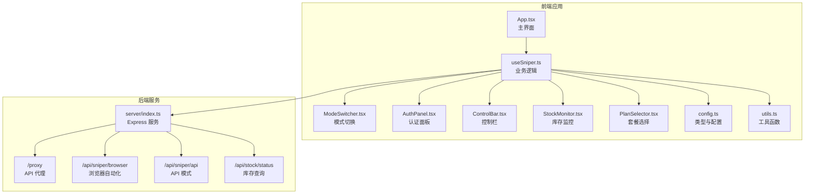
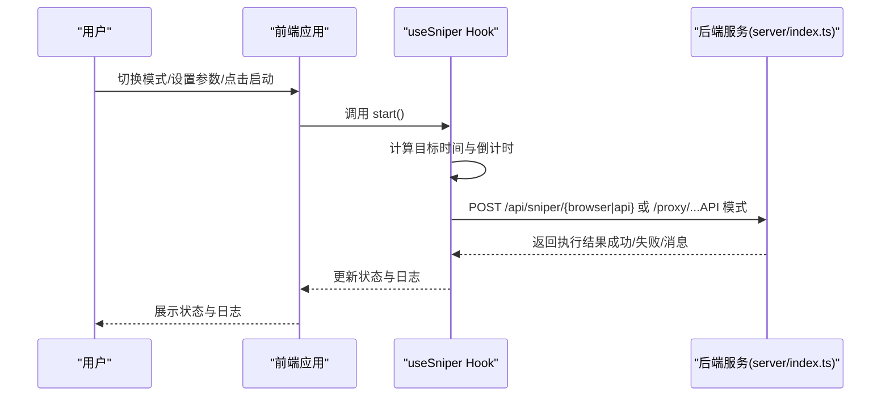
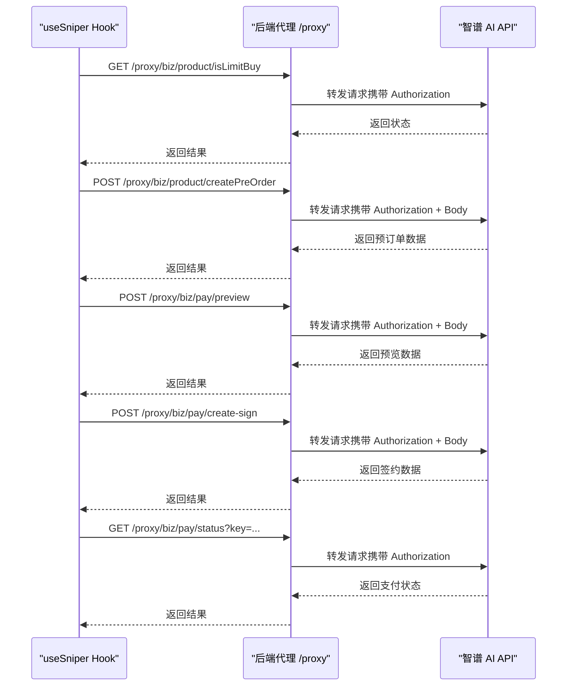
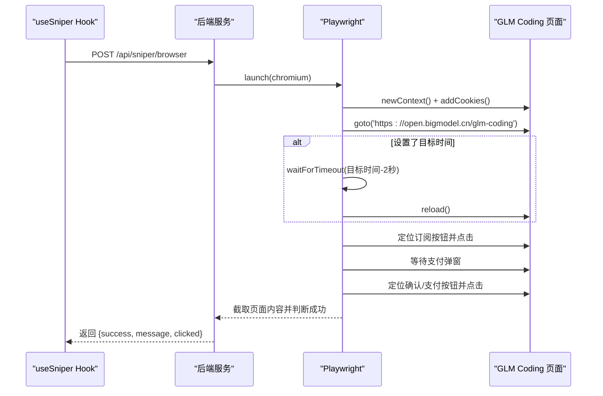
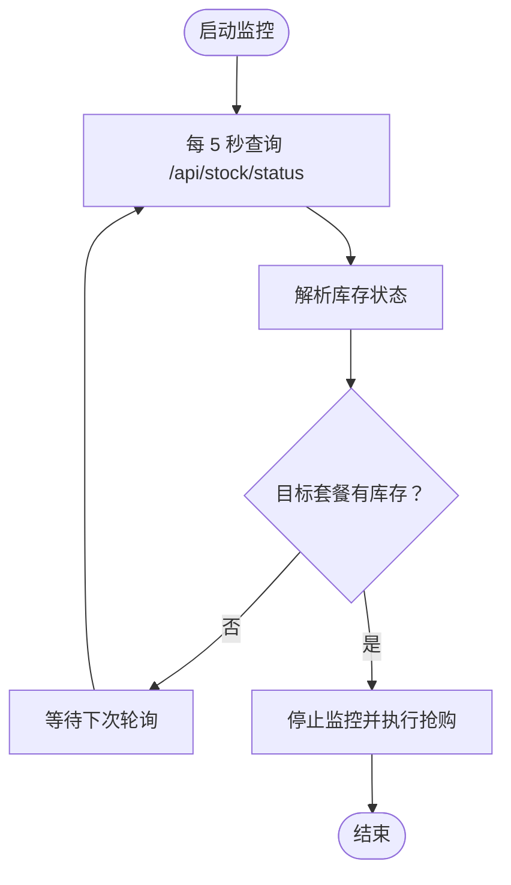
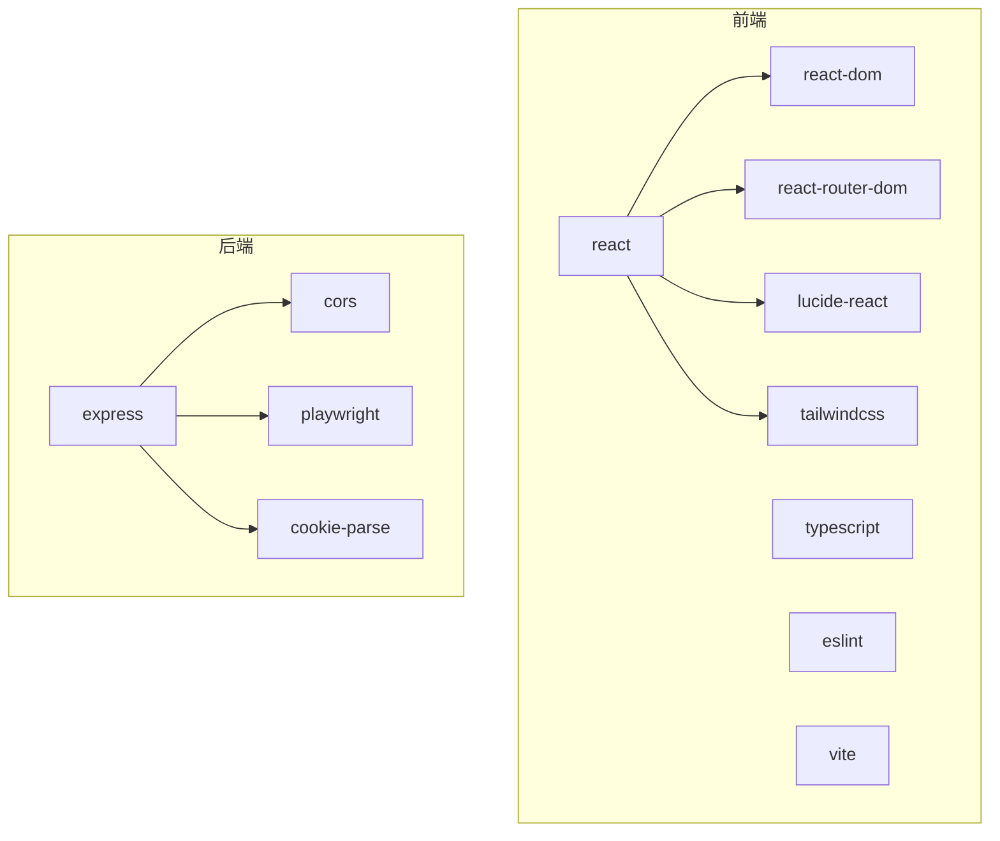

# 双模式抢购系统

<cite>
**本文档引用的文件**
- [README.md](file://README.md)
- [package.json](file://package.json)
- [vite.config.ts](file://vite.config.ts)
- [server/index.ts](file://server/index.ts)
- [src/App.tsx](file://src/App.tsx)
- [src/hooks/useSniper.ts](file://src/hooks/useSniper.ts)
- [src/lib/config.ts](file://src/lib/config.ts)
- [src/lib/utils.ts](file://src/lib/utils.ts)
- [src/components/ModeSwitcher.tsx](file://src/components/ModeSwitcher.tsx)
- [src/components/AuthPanel.tsx](file://src/components/AuthPanel.tsx)
- [src/components/ControlBar.tsx](file://src/components/ControlBar.tsx)
- [src/components/StockMonitor.tsx](file://src/components/StockMonitor.tsx)
- [src/components/PlanSelector.tsx](file://src/components/PlanSelector.tsx)
</cite>

## 目录
1. [简介](#简介)
2. [项目结构](#项目结构)
3. [核心组件](#核心组件)
4. [架构总览](#架构总览)
5. [详细组件分析](#详细组件分析)
6. [依赖关系分析](#依赖关系分析)
7. [性能考量](#性能考量)
8. [故障排查指南](#故障排查指南)
9. [结论](#结论)
10. [附录](#附录)

## 简介
本项目是一个基于 React + TypeScript + Vite 的双模式抢购工具，用于在特定时间点对智谱 AI 的 GLM Coding Plan 进行快速购买。系统提供两种工作模式：
- API 模式：通过代理服务器直接调用智谱 AI 的后端 API，无需浏览器参与，适合高并发与低延迟场景。
- 浏览器模式：使用 Playwright 自动化浏览器，模拟真实用户操作，适合需要绕过复杂风控或验证码的场景。

系统包含完整的用户界面、日志记录、倒计时启动、库存监控与自动触发等功能，支持在目标时间前 2 秒提前发起请求以补偿网络延迟。

## 项目结构
前端采用模块化组件设计，核心逻辑集中在自定义 Hook 中；后端提供 Express 服务，负责：
- API 代理：转发请求并携带认证与 Cookie，绕过浏览器 CORS 限制
- 浏览器自动化：启动 Chromium，注入 Cookie，定位并点击订阅/支付按钮
- 库存查询：查询运营配置中的库存状态并解析为可用性信息

图表来源
- [src/App.tsx:12-194](file://src/App.tsx#L12-L194)
- [src/hooks/useSniper.ts:46-406](file://src/hooks/useSniper.ts#L46-L406)
- [server/index.ts:10-370](file://server/index.ts#L10-L370)

章节来源
- [src/App.tsx:12-194](file://src/App.tsx#L12-L194)
- [server/index.ts:10-370](file://server/index.ts#L10-L370)

## 核心组件
- useSniper Hook：集中管理模式、套餐、目标时间、认证信息、日志、状态以及启动/停止逻辑；封装 API 模式与浏览器模式的完整流程；提供库存监控与自动触发能力。
- ModeSwitcher：提供“浏览器自动化”和“API 高速模式”的切换入口。
- AuthPanel：输入与验证 Auth Token，支持显示/隐藏密文；提供验证按钮以检查令牌有效性。
- ControlBar：显示当前状态（待命/倒计时/抢购中/成功/出错），提供启动与停止按钮。
- StockMonitor：展示各套餐库存状态与下次补货时间，支持手动查询与自动监控。
- PlanSelector：选择目标套餐（Lite/Pro/Max）。
- config.ts：定义类型、套餐配置、产品 ID 映射、API 端点等。
- utils.ts：日志条目生成、时间格式化、倒计时格式化、目标时间计算等。

章节来源
- [src/hooks/useSniper.ts:46-406](file://src/hooks/useSniper.ts#L46-L406)
- [src/components/ModeSwitcher.tsx:10-61](file://src/components/ModeSwitcher.tsx#L10-L61)
- [src/components/AuthPanel.tsx:14-119](file://src/components/AuthPanel.tsx#L14-L119)
- [src/components/ControlBar.tsx:11-75](file://src/components/ControlBar.tsx#L11-L75)
- [src/components/StockMonitor.tsx:27-139](file://src/components/StockMonitor.tsx#L27-L139)
- [src/components/PlanSelector.tsx:11-60](file://src/components/PlanSelector.tsx#L11-L60)
- [src/lib/config.ts:6-104](file://src/lib/config.ts#L6-L104)
- [src/lib/utils.ts:20-50](file://src/lib/utils.ts#L20-L50)

## 架构总览
系统采用“前端调度 + 后端代理/自动化”的分层架构：
- 前端负责用户交互、状态管理、倒计时与日志展示
- 后端提供代理服务、浏览器自动化与库存查询
- 两种模式共享统一的配置与日志体系，但请求路径与实现方式不同

图表来源
- [src/hooks/useSniper.ts:250-293](file://src/hooks/useSniper.ts#L250-L293)
- [server/index.ts:42-159](file://server/index.ts#L42-L159)
- [server/index.ts:161-250](file://server/index.ts#L161-L250)

## 详细组件分析

### API 模式工作原理与实现
API 模式通过后端代理服务器直接调用智谱 AI 的 API，绕过浏览器 CORS 限制。核心流程如下：
- 认证：使用 Bearer Token 作为 Authorization 头
- 步骤一：检查是否限购
- 步骤二：创建预订单（指定产品 ID 与支付方式）
- 步骤三：支付预览（可选）
- 步骤四：创建签约（发送确认订阅请求）
- 步骤五：检查支付状态（若存在 key）

图表来源
- [src/hooks/useSniper.ts:111-248](file://src/hooks/useSniper.ts#L111-L248)
- [server/index.ts:12-40](file://server/index.ts#L12-L40)

实现要点
- 代理转发：后端将 Authorization 与 Cookie 透传至智谱 AI，保证请求合法性
- 错误检测：对包含验证码关键词的响应进行识别，提示用户手动完成验证码
- 重试机制：在预订单创建失败时进行有限次数的重试，间隔 1 秒
- 成功判定：若支付状态为 SUCCESS，则标记为成功；否则提示需人工确认

章节来源
- [src/hooks/useSniper.ts:111-248](file://src/hooks/useSniper.ts#L111-L248)
- [server/index.ts:12-40](file://server/index.ts#L12-L40)

### 浏览器模式工作原理与实现
浏览器模式使用 Playwright 启动 Chromium，注入 Cookie，自动导航到智谱 AI 的 GLM Coding 页面，在目标时间点自动点击订阅按钮并尝试完成支付确认。流程如下：
- 启动浏览器：Chromium 无头模式启动
- 注入 Cookie：解析用户提供的 Cookie 字符串并写入上下文
- 导航页面：访问 GLM Coding 页面并等待网络空闲
- 倒计时等待：根据目标时间提前 2 秒刷新页面
- 定位元素：尝试多种选择器点击“特惠订阅”或“订阅”按钮
- 确认支付：寻找“确认/支付/立即”等按钮并点击
- 结果判定：检查页面内容是否包含“成功/订阅”字样

图表来源
- [src/hooks/useSniper.ts:76-106](file://src/hooks/useSniper.ts#L76-L106)
- [server/index.ts:42-159](file://server/index.ts#L42-L159)

实现要点
- Cookie 管理：解析字符串形式的 Cookie 并注入到上下文
- 元素定位：针对页面结构变化提供多套选择器策略，提升鲁棒性
- 成功判定：通过页面文本匹配判断是否成功

章节来源
- [src/hooks/useSniper.ts:76-106](file://src/hooks/useSniper.ts#L76-L106)
- [server/index.ts:42-159](file://server/index.ts#L42-L159)

### 库存监控与自动触发
系统提供库存监控功能，定期查询运营配置中的库存状态，并在目标套餐有库存时自动触发 API 模式的抢购流程。监控逻辑：
- 定时轮询：每 5 秒查询一次
- 状态解析：尝试解析返回数据中的库存字段，若解析失败则使用默认“已售罄”
- 时间感知：在 9:59-10:01 期间提示“即将补货”，10:00 前后标记为“检查中”
- 自动触发：当 isMonitoring 且 authToken 存在时，检测到目标套餐有库存即停止监控并立即执行抢购

图表来源
- [src/hooks/useSniper.ts:318-372](file://src/hooks/useSniper.ts#L318-L372)
- [server/index.ts:252-355](file://server/index.ts#L252-L355)

章节来源
- [src/hooks/useSniper.ts:318-372](file://src/hooks/useSniper.ts#L318-L372)
- [server/index.ts:252-355](file://server/index.ts#L252-L355)

### 用户界面与交互
- 主界面布局：左侧配置区（模式/套餐/定时器/库存监控/认证），右侧日志与引导，顶部状态指示与目标信息
- 控制栏：根据状态动态显示“启动/停止”，成功后禁用启动按钮
- 模式切换：按钮高亮表示当前模式，禁用状态下不可切换
- 认证面板：支持显示/隐藏 Token，提供验证按钮检查有效性
- 库存监控：展示各套餐状态与下次补货时间，支持手动查询与启动/停止监控

章节来源
- [src/App.tsx:12-194](file://src/App.tsx#L12-L194)
- [src/components/ControlBar.tsx:11-75](file://src/components/ControlBar.tsx#L11-L75)
- [src/components/ModeSwitcher.tsx:10-61](file://src/components/ModeSwitcher.tsx#L10-L61)
- [src/components/AuthPanel.tsx:14-119](file://src/components/AuthPanel.tsx#L14-L119)
- [src/components/StockMonitor.tsx:27-139](file://src/components/StockMonitor.tsx#L27-L139)

## 依赖关系分析
- 前端依赖
  - React 生态：React、React DOM、React Router
  - UI 框架：Tailwind CSS、Lucide React
  - 工具库：clsx、tailwind-merge
  - 类型与开发：TypeScript、ESLint、Vite 插件
- 后端依赖
  - Web 框架：Express
  - CORS：允许跨域访问
  - 自动化：Playwright（Chromium）
  - Cookie 解析：cookie-parse

图表来源
- [package.json:14-46](file://package.json#L14-L46)

章节来源
- [package.json:14-46](file://package.json#L14-L46)

## 性能考量
- API 模式
  - 优势：无需浏览器启动与页面渲染，请求更轻量，延迟更低
  - 劣势：对风控敏感，可能出现验证码拦截；需正确的产品 ID 与支付方式
- 浏览器模式
  - 优势：模拟真实用户行为，更易绕过复杂风控；可自动处理部分交互
  - 劣势：启动浏览器与页面加载带来额外开销；页面结构变化影响元素定位
- 倒计时补偿：在目标时间前 2 秒提前发起请求，减少网络往返带来的误差
- 重试策略：预订单创建失败时进行有限次数重试，提高成功率
- 日志与监控：实时输出关键步骤与状态，便于调试与优化

章节来源
- [src/hooks/useSniper.ts:271-283](file://src/hooks/useSniper.ts#L271-L283)
- [src/hooks/useSniper.ts:169-176](file://src/hooks/useSniper.ts#L169-L176)

## 故障排查指南
常见问题与解决方案
- 后端服务未启动
  - 现象：浏览器模式报连接失败，API 模式报“请确保后端服务已启动”
  - 处理：运行后端服务脚本并确认端口 3100 可访问
- 认证失败
  - 现象：验证 Token 失败或预订单创建失败
  - 处理：确认 Authorization 头格式正确；必要时在官网完成验证码后重试
- 验证码拦截
  - 现象：响应包含验证码相关关键词
  - 处理：在官网手动完成验证码后重试
- 浏览器自动化失败
  - 现象：页面元素定位失败或点击无效
  - 处理：检查 Cookie 格式；页面结构变化时更新选择器策略
- 库存监控无结果
  - 现象：库存状态解析失败或始终为“已售罄”
  - 处理：确认后端库存查询接口可用；关注补货时间窗口

章节来源
- [src/hooks/useSniper.ts:101-105](file://src/hooks/useSniper.ts#L101-L105)
- [src/hooks/useSniper.ts:157-167](file://src/hooks/useSniper.ts#L157-L167)
- [src/components/AuthPanel.tsx:18-41](file://src/components/AuthPanel.tsx#L18-L41)
- [server/index.ts:155-158](file://server/index.ts#L155-L158)

## 结论
本项目通过“前端调度 + 后端代理/自动化”的架构，提供了灵活高效的双模式抢购方案。API 模式适合追求低延迟与稳定性的场景，浏览器模式适合需要绕过复杂风控的场景。配合库存监控与自动触发、完善的日志与状态管理，能够在目标时间点高效完成订阅流程。建议在实际使用中结合自身网络环境与风控策略选择合适模式，并持续优化元素定位与重试策略以提升成功率。

## 附录
- 启动与运行
  - 前端开发：npm run dev
  - 后端服务：npm run server
  - 同时启动：npm run start
- 关键端点
  - 代理：/proxy
  - 浏览器自动化：POST /api/sniper/browser
  - API 模式：POST /api/sniper/api
  - 库存查询：GET /api/stock/status
  - 健康检查：GET /api/health

章节来源
- [package.json:6-12](file://package.json#L6-L12)
- [server/index.ts:357-369](file://server/index.ts#L357-L369)