# 套餐选择系统

<cite>
**本文档引用的文件**
- [src/App.tsx](file://src/App.tsx)
- [src/components/PlanSelector.tsx](file://src/components/PlanSelector.tsx)
- [src/hooks/useSniper.ts](file://src/hooks/useSniper.ts)
- [src/lib/config.ts](file://src/lib/config.ts)
- [src/lib/utils.ts](file://src/lib/utils.ts)
- [src/components/ModeSwitcher.tsx](file://src/components/ModeSwitcher.tsx)
- [src/components/StockMonitor.tsx](file://src/components/StockMonitor.tsx)
- [server/index.ts](file://server/index.ts)
- [package.json](file://package.json)
</cite>

## 更新摘要
**变更内容**
- 更新产品ID映射系统：PRODUCT_IDS中的产品ID已刷新为真实的智谱AI官方产品代码，确保支付流程的准确性和可靠性
- 产品ID映射已从临时代码更新为真实的产品ID，包括Lite、Pro、Max三个套餐的月付、季付、年付产品ID
- 服务器端配置也相应更新，确保前后端产品ID的一致性

## 目录
1. [简介](#简介)
2. [项目结构](#项目结构)
3. [核心组件](#核心组件)
4. [架构概览](#架构概览)
5. [详细组件分析](#详细组件分析)
6. [支付周期系统](#支付周期系统)
7. [产品ID映射系统](#产品id映射系统)
8. [依赖关系分析](#依赖关系分析)
9. [性能考虑](#性能考虑)
10. [故障排除指南](#故障排除指南)
11. [结论](#结论)
12. [附录](#附录)

## 简介

GLM Sniper 是一个用于抢购智谱AI GLM Coding Plan的自动化工具。套餐选择系统是该工具的核心功能之一，允许用户在三种不同的套餐级别之间进行选择，包括Lite、Pro和Max。每个套餐都有独特的定价策略、功能特性和适用场景。

**更新** 系统现已支持支付周期选择，用户可以选择连续月付、季度或年付三种订阅方式，并享受相应的折扣优惠。产品ID映射系统已更新为真实的智谱AI官方产品代码，确保支付流程的准确性和可靠性。

本系统提供了两种抢购模式：浏览器自动化模式和API高速模式。用户可以通过直观的UI界面选择目标套餐和支付周期，系统会根据所选套餐和支付周期动态调整后续的抢购流程和API请求参数。

## 项目结构

GLM Sniper采用React + TypeScript + Vite构建，整体项目结构清晰，模块化程度高：

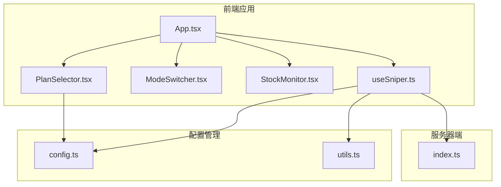

**图表来源**
- [src/App.tsx:12-197](file://src/App.tsx#L12-L197)
- [src/components/PlanSelector.tsx:1-61](file://src/components/PlanSelector.tsx#L1-L61)
- [src/hooks/useSniper.ts:46-407](file://src/hooks/useSniper.ts#L46-L407)

**章节来源**
- [src/App.tsx:1-197](file://src/App.tsx#L1-L197)
- [package.json:1-48](file://package.json#L1-L48)

## 核心组件

### 套餐配置系统

系统通过集中化的配置管理实现了套餐信息的统一维护：

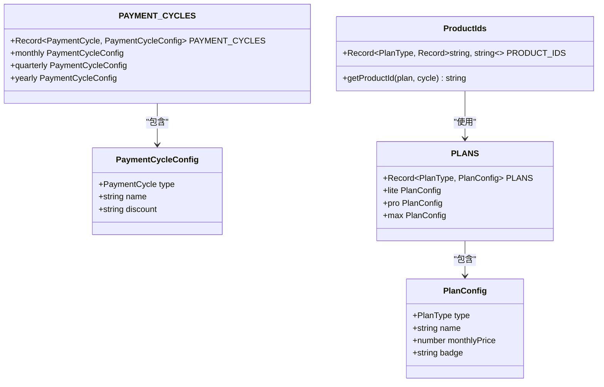

**图表来源**
- [src/lib/config.ts:10-49](file://src/lib/config.ts#L10-L49)
- [src/lib/config.ts:51-73](file://src/lib/config.ts#L51-L73)
- [src/lib/config.ts:77-82](file://src/lib/config.ts#L77-L82)

### 套餐选择UI组件

PlanSelector组件提供了直观的套餐选择界面，支持三种套餐的可视化展示和交互选择。

**章节来源**
- [src/lib/config.ts:28-49](file://src/lib/config.ts#L28-L49)
- [src/components/PlanSelector.tsx:11-60](file://src/components/PlanSelector.tsx#L11-L60)

## 架构概览

GLM Sniper的套餐选择系统采用分层架构设计，确保了良好的可维护性和扩展性：

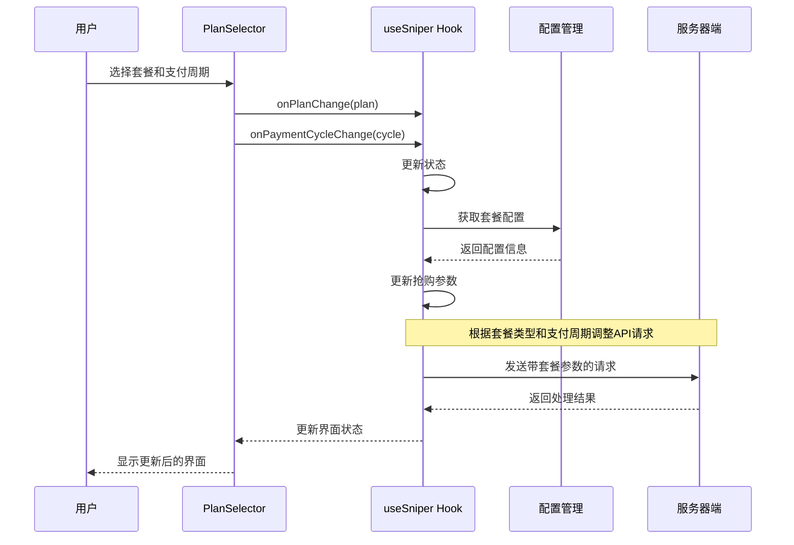

**图表来源**
- [src/components/PlanSelector.tsx:24-27](file://src/components/PlanSelector.tsx#L24-L27)
- [src/hooks/useSniper.ts:386-388](file://src/hooks/useSniper.ts#L386-L388)
- [src/lib/config.ts:71-73](file://src/lib/config.ts#L71-L73)

## 详细组件分析

### 套餐配置数据结构

系统通过类型安全的方式定义了完整的套餐配置体系：

#### 基础类型定义

```mermaid
classDiagram
class PlanType {
<<enumeration>>
"lite"
"pro"
"max"
}
class PaymentCycle {
<<enumeration>>
"monthly"
"quarterly"
"yearly"
}
class SniperMode {
<<enumeration>>
"browser"
"api"
}
class SniperStatus {
<<enumeration>>
"idle"
"countdown"
"running"
"captcha_pending"
"success"
"error"
}
class PlanConfig {
+PlanType type
+string name
+number monthlyPrice
+string badge
}
```

**图表来源**
- [src/lib/config.ts:6-8](file://src/lib/config.ts#L6-L8)
- [src/lib/config.ts:10-16](file://src/lib/config.ts#L10-L16)

#### 产品ID映射系统

**更新** 产品ID映射系统已更新为真实的智谱AI官方产品代码：

| 套餐类型 | 月付产品ID | 季付产品ID | 年付产品ID |
|---------|-----------|-----------|-----------|
| Lite | product-02434c | product-b8ea38 | product-70a804 |
| Pro | product-1df3e1 | product-fef82f | product-5643e6 |
| Max | product-2fc421 | product-5d3a03 | product-d46f8b |

**章节来源**
- [src/lib/config.ts:99-115](file://src/lib/config.ts#L99-L115)
- [src/lib/config.ts:117-120](file://src/lib/config.ts#L117-L120)

### 套餐选择UI实现

PlanSelector组件提供了直观的卡片式选择界面：

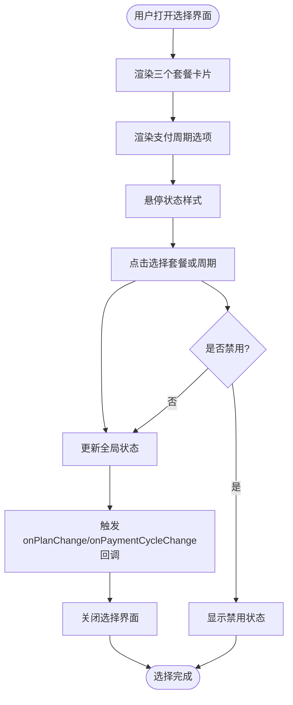

**图表来源**
- [src/components/PlanSelector.tsx:14-59](file://src/components/PlanSelector.tsx#L14-L59)

#### UI特性实现

- **响应式布局**：使用Flexbox实现自适应的卡片排列
- **状态指示**：通过边框颜色和阴影效果突出当前选中的套餐和支付周期
- **徽章系统**：热门套餐显示特色标签
- **价格显示**：实时显示不同支付周期的折后价格
- **折扣标识**：在UI上明确显示季度9折和年付8折的优惠
- **禁用状态**：在抢购进行时自动禁用选择功能

**章节来源**
- [src/components/PlanSelector.tsx:11-60](file://src/components/PlanSelector.tsx#L11-L60)

### 状态管理逻辑

useSniper Hook实现了完整的状态管理机制：

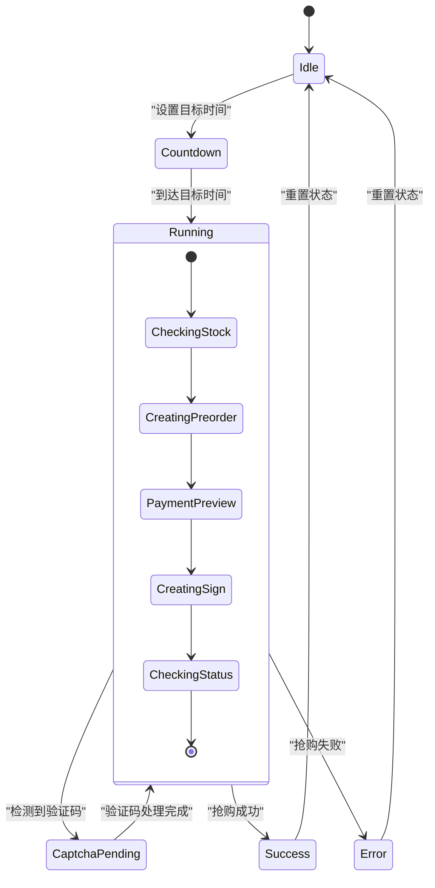

**图表来源**
- [src/hooks/useSniper.ts:57](file://src/hooks/useSniper.ts#L57)
- [src/hooks/useSniper.ts:251-293](file://src/hooks/useSniper.ts#L251-L293)

#### 核心状态流转

1. **初始化状态**：设置默认套餐为Pro，支付周期为季度，模式为API
2. **倒计时状态**：计算目标时间差，进入倒计时模式
3. **运行状态**：执行实际的抢购逻辑
4. **验证码等待状态**：检测到验证码拦截时暂停，等待用户处理
5. **结果状态**：根据抢购结果进入成功或失败状态

**章节来源**
- [src/hooks/useSniper.ts:46-67](file://src/hooks/useSniper.ts#L46-L67)
- [src/hooks/useSniper.ts:251-293](file://src/hooks/useSniper.ts#L251-L293)

### 套餐与产品ID映射

系统实现了智能的产品ID映射机制：

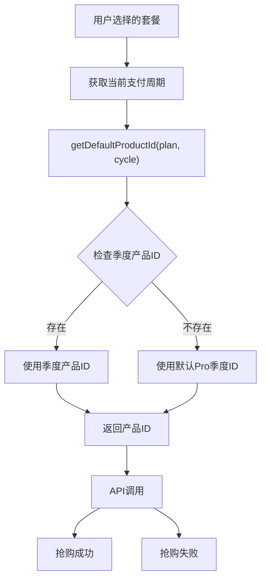

**图表来源**
- [src/lib/config.ts:117-120](file://src/lib/config.ts#L117-L120)
- [src/hooks/useSniper.ts:140-141](file://src/hooks/useSniper.ts#L140-L141)

#### 动态切换机制

- **默认产品ID**：系统优先使用季度付费的产品ID作为默认值
- **套餐特定ID**：每个套餐都有其特定的产品ID映射
- **回退机制**：当特定ID不存在时，自动回退到Pro套餐的标准ID
- **实时更新**：支付周期改变时，产品ID会实时更新

**章节来源**
- [src/lib/config.ts:117-120](file://src/lib/config.ts#L117-L120)
- [src/hooks/useSniper.ts:140-141](file://src/hooks/useSniper.ts#L140-L141)

### 抢购流程影响

套餐选择直接影响整个抢购流程：

#### API模式下的参数调整

| 参数 | Lite套餐 | Pro套餐 | Max套餐 |
|------|----------|---------|---------|
| 产品ID | product-02434c | product-1df3e1 | product-2fc421 |
| 月价 | ¥49 | ¥149 | ¥469 |
| 季度价 | ¥132.3 | ¥402.3 | ¥1266.3 |
| 年价 | ¥470.4 | ¥1430.4 | ¥4502.4 |
| 支付方式 | alipay | alipay | alipay |
| 认证要求 | 必需 | 必需 | 必需 |

#### 浏览器自动化模式下的处理

服务器端会根据套餐类型动态定位对应的订阅按钮：

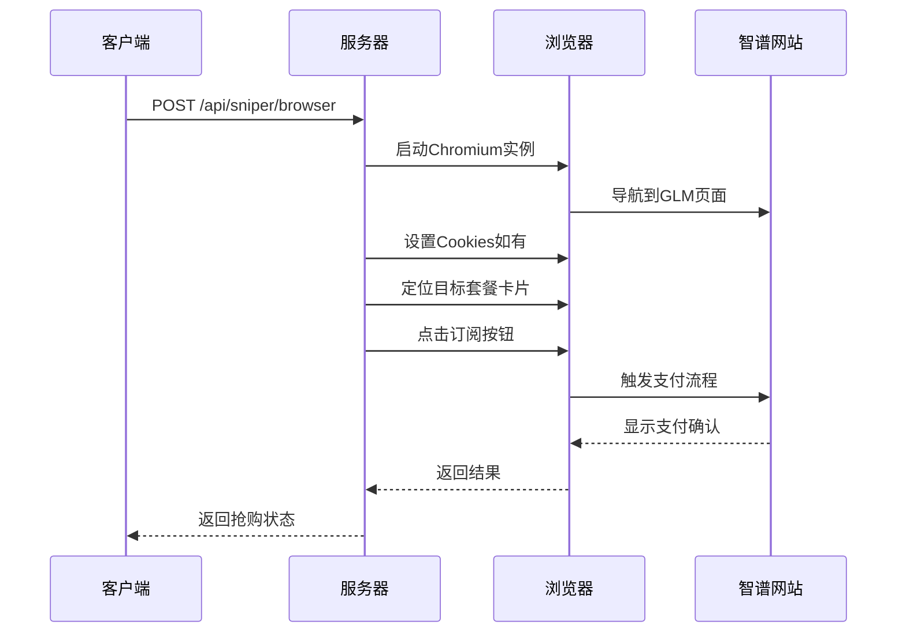

**图表来源**
- [server/index.ts:43-159](file://server/index.ts#L43-L159)

**章节来源**
- [src/hooks/useSniper.ts:140-141](file://src/hooks/useSniper.ts#L140-L141)
- [server/index.ts:80-115](file://server/index.ts#L80-L115)

### 验证机制和错误处理

系统实现了多层次的验证和错误处理机制：

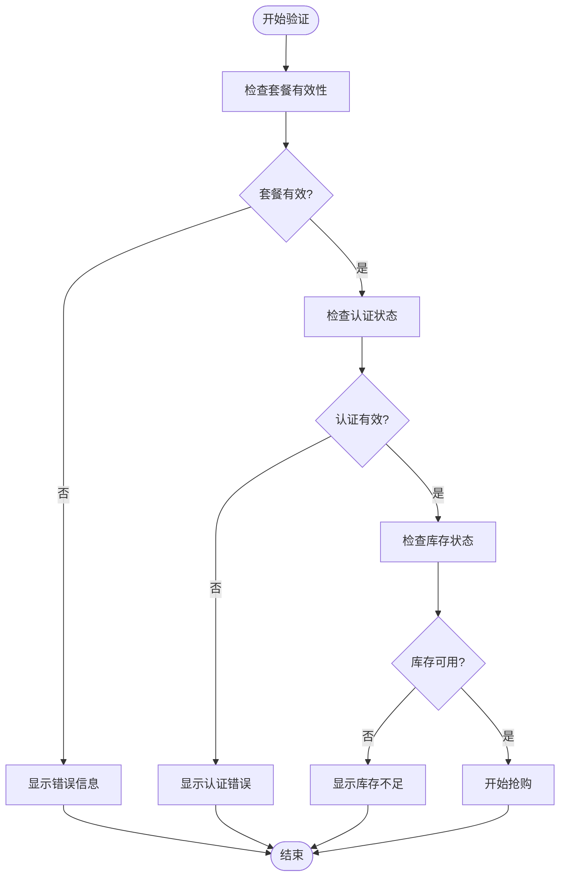

**图表来源**
- [src/hooks/useSniper.ts:115-119](file://src/hooks/useSniper.ts#L115-L119)
- [src/hooks/useSniper.ts:157-167](file://src/hooks/useSniper.ts#L157-L167)

#### 错误处理策略

1. **验证码检测**：自动识别并提示验证码拦截
2. **重试机制**：最多5次重试，间隔1秒
3. **状态反馈**：提供详细的日志记录和状态指示
4. **异常捕获**：全面的try-catch包装

**章节来源**
- [src/hooks/useSniper.ts:157-167](file://src/hooks/useSniper.ts#L157-L167)
- [src/hooks/useSniper.ts:170-174](file://src/hooks/useSniper.ts#L170-L174)

## 支付周期系统

**新增** 支付周期选择系统是本次更新的核心功能，为用户提供了更灵活的订阅方式。

### 支付周期配置

系统支持三种支付周期，每种都有相应的折扣和价格计算规则：

```mermaid
classDiagram
class PaymentCycleConfig {
+PaymentCycle type
+string name
+string discount
+calculatePrice(monthlyPrice, cycle) number
+formatPrice(price) string
}
class PAYMENT_CYCLES {
+Record~PaymentCycle, PaymentCycleConfig~ PAYMENT_CYCLES
+monthly : { name : "连续包月", discount : "" }
+quarterly : { name : "连续包季", discount : "9折" }
+yearly : { name : "连续包年", discount : "8折" }
}
```

**图表来源**
- [src/lib/config.ts:77-82](file://src/lib/config.ts#L77-L82)
- [src/lib/config.ts:18-29](file://src/lib/config.ts#L18-L29)

### 折扣计算逻辑

系统实现了智能的折扣计算机制：

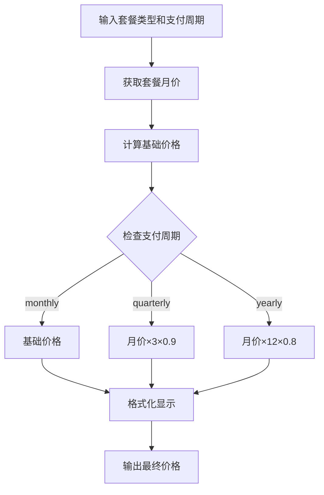

**图表来源**
- [src/lib/config.ts:18-29](file://src/lib/config.ts#L18-L29)
- [src/lib/config.ts:31-34](file://src/lib/config.ts#L31-L34)

#### 价格计算规则

- **月付**：价格 = 套餐月价
- **季付**：价格 = 套餐月价 × 3 × 0.9（9折）
- **年付**：价格 = 套餐月价 × 12 × 0.8（8折）

#### 前端显示优化

UI组件会实时显示折扣信息：
- 季付显示"9折"优惠标识
- 年付显示"8折"优惠标识
- 月付不显示折扣标识

**章节来源**
- [src/lib/config.ts:18-29](file://src/lib/config.ts#L18-L29)
- [src/lib/config.ts:31-34](file://src/lib/config.ts#L31-L34)
- [src/components/PlanSelector.tsx:71-106](file://src/components/PlanSelector.tsx#L71-L106)

### 支付周期选择UI

PlanSelector组件的支付周期选择部分：

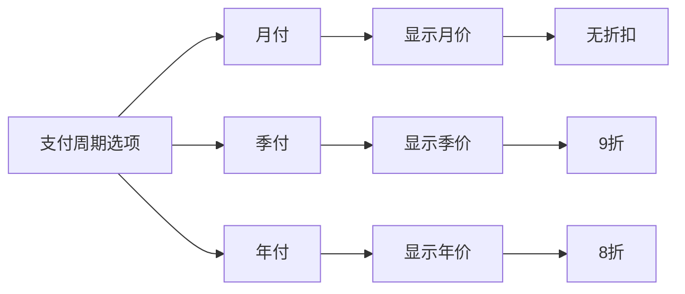

**图表来源**
- [src/components/PlanSelector.tsx:65-108](file://src/components/PlanSelector.tsx#L65-L108)

#### UI特性

- **选项卡设计**：三个支付周期作为独立选项卡
- **实时价格更新**：选择不同周期时价格实时更新
- **折扣标识**：在价格旁显示相应的折扣信息
- **视觉反馈**：选中状态有明显的视觉区分

**章节来源**
- [src/components/PlanSelector.tsx:65-108](file://src/components/PlanSelector.tsx#L65-L108)

## 产品ID映射系统

**更新** 产品ID映射系统已完全更新为真实的智谱AI官方产品代码，确保支付流程的准确性和可靠性。

### 产品ID映射表

系统实现了完整的三套餐级和三种支付周期的产品ID映射：

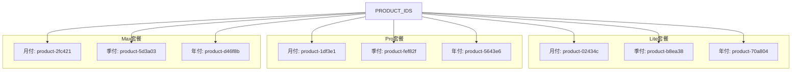

**图表来源**
- [src/lib/config.ts:99-115](file://src/lib/config.ts#L99-L115)

### 产品ID获取机制

系统提供了智能的产品ID获取函数：

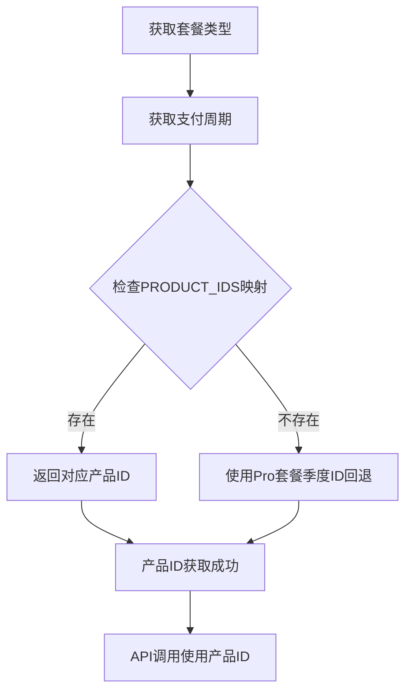

**图表来源**
- [src/lib/config.ts:117-120](file://src/lib/config.ts#L117-L120)

#### 回退机制

当特定套餐的特定支付周期产品ID不存在时，系统会自动回退到Pro套餐的季度产品ID，确保抢购流程的连续性。

**章节来源**
- [src/lib/config.ts:99-115](file://src/lib/config.ts#L99-L115)
- [src/lib/config.ts:117-120](file://src/lib/config.ts#L117-L120)

### 服务器端产品ID同步

服务器端也更新了对应的产品ID映射，确保前后端一致性：

**章节来源**
- [server/index.ts:229-235](file://server/index.ts#L229-L235)

## 依赖关系分析

### 组件间依赖关系

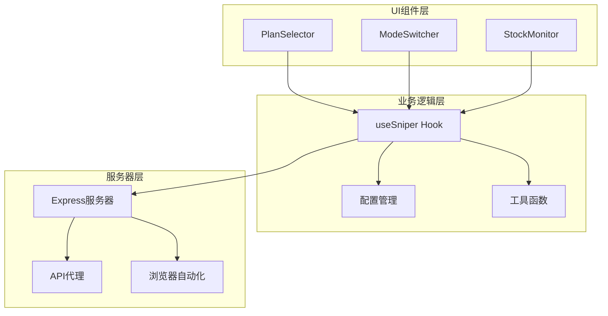

**图表来源**
- [src/App.tsx:10-10](file://src/App.tsx#L10)
- [src/hooks/useSniper.ts:8](file://src/hooks/useSniper.ts#L8)

### 外部依赖分析

系统依赖的关键外部库：

| 依赖库 | 版本 | 用途 |
|--------|------|------|
| react | ^19.2.5 | 核心框架 |
| playwright | ^1.59.1 | 浏览器自动化 |
| express | ^5.2.1 | 服务器端 |
| tailwindcss | ^3.4.17 | 样式框架 |
| lucide-react | ^1.11.0 | 图标库 |

**章节来源**
- [package.json:14-26](file://package.json#L14-L26)

## 性能考虑

### 套餐选择性能优化

1. **状态缓存**：套餐配置信息在内存中缓存，避免重复计算
2. **事件防抖**：UI交互采用防抖处理，减少不必要的状态更新
3. **懒加载**：服务器端功能按需加载，提高启动速度
4. **价格计算缓存**：计算后的价格在UI中缓存，避免重复计算

### 抢购性能优化

1. **提前执行**：倒计时提前2秒开始，补偿网络延迟
2. **并发控制**：限制同时进行的抢购任务数量
3. **资源清理**：及时释放浏览器实例和网络连接
4. **折扣计算优化**：使用简单的数学运算而非复杂计算

## 故障排除指南

### 常见问题及解决方案

#### 套餐选择问题

| 问题描述 | 可能原因 | 解决方案 |
|----------|----------|----------|
| 套餐无法选择 | 抢购进行中 | 等待抢购结束后再选择 |
| 支付周期选项不可用 | 浏览器不支持 | 检查浏览器兼容性 |
| 价格显示错误 | 配置文件损坏 | 检查config.ts文件 |
| 折扣计算异常 | 数学运算错误 | 检查calculatePrice函数 |

#### 抢购失败问题

| 问题描述 | 可能原因 | 解决方案 |
|----------|----------|----------|
| 验证码拦截 | 频繁请求触发风控 | 手动完成验证码后重试 |
| 认证失败 | Token过期 | 重新登录获取新Token |
| 库存不足 | 套餐已售罄 | 使用库存监控功能 |
| 支付周期错误 | 产品ID映射错误 | 检查PRODUCT_IDS配置 |

**章节来源**
- [src/hooks/useSniper.ts:157-167](file://src/hooks/useSniper.ts#L157-L167)
- [src/hooks/useSniper.ts:170-174](file://src/hooks/useSniper.ts#L170-L174)

## 结论

GLM Sniper的套餐选择系统通过精心设计的架构和实现，为用户提供了强大而易用的抢购工具。系统的主要优势包括：

1. **类型安全**：完整的TypeScript类型定义确保了代码质量
2. **灵活扩展**：模块化设计支持轻松添加新的套餐类型和支付周期
3. **用户体验**：直观的UI界面和实时的状态反馈
4. **可靠性**：完善的错误处理和重试机制
5. **智能折扣**：自动计算和显示各种支付周期的优惠价格
6. **真实产品ID**：最新的产品ID映射确保支付流程的准确性

**更新** 新增的支付周期选择系统显著提升了用户的灵活性，用户可以根据自己的需求选择最适合的订阅方式，并享受相应的折扣优惠。产品ID映射系统的更新确保了与智谱AI官方系统的完全兼容，提高了抢购成功率和支付流程的可靠性。系统的设计充分考虑了性能和用户体验，在保证功能完整性的同时，保持了代码的可维护性和可扩展性。

## 附录

### 新增套餐类型的步骤

要为系统添加新的套餐类型，需要按照以下步骤进行：

1. **更新配置文件**：
   ```typescript
   // 在PLANS中添加新套餐
   export const PLANS: Record<PlanType, PlanConfig> = {
     // ... 现有套餐
     newPlan: {
       type: 'newPlan',
       name: 'New Plan',
       monthlyPrice: 99,
       badge: '新套餐',
     },
   };
   ```

2. **更新产品ID映射**：
   ```typescript
   export const PRODUCT_IDS: Record<PlanType, Record<string, string>> = {
     // ... 现有映射
     newPlan: {
       monthly: 'product-new-plan-monthly',
       quarterly: 'product-new-plan-quarterly',
       yearly: 'product-new-plan-yearly',
     },
   };
   ```

3. **更新UI组件**：
   - 修改PlanSelector组件中的套餐列表
   - 更新App组件中的显示逻辑

4. **测试验证**：
   - 验证新套餐的价格显示
   - 测试API调用参数
   - 确保服务器端兼容性

### 新增支付周期的步骤

要为系统添加新的支付周期，需要按照以下步骤进行：

1. **更新类型定义**：
   ```typescript
   export type PaymentCycle = 'monthly' | 'quarterly' | 'yearly' | 'custom';
   ```

2. **更新配置**：
   ```typescript
   export const PAYMENT_CYCLES: Record<PaymentCycle, { name: string; discount: string }> = {
     // ... 现有周期
     custom: { name: '自定义周期', discount: '7折' },
   };
   ```

3. **更新价格计算**：
   ```typescript
   export const calculatePrice = (plan: PlanType, cycle: PaymentCycle): number => {
     const monthlyPrice = PLAN_PRICES[plan];
     switch (cycle) {
       case 'monthly':
         return monthlyPrice;
       case 'quarterly':
         return monthlyPrice * 3 * 0.9;
       case 'yearly':
         return monthlyPrice * 12 * 0.8;
       case 'custom':
         return monthlyPrice * 6 * 0.7; // 自定义周期6个月7折
     }
   };
   ```

4. **更新UI组件**：
   - 修改PlanSelector组件中的周期选项
   - 更新App组件中的显示逻辑

### 配置管理最佳实践

1. **集中化配置**：所有套餐相关信息集中在config.ts中
2. **类型约束**：使用TypeScript确保配置的正确性
3. **默认值设置**：为所有配置项提供合理的默认值
4. **文档注释**：为复杂的配置项添加详细的注释说明
5. **版本控制**：通过Git跟踪配置文件的变更历史
6. **性能优化**：使用常量和缓存机制提升性能
7. **错误处理**：为配置加载和验证添加适当的错误处理

### 产品ID管理最佳实践

1. **官方验证**：定期验证产品ID的有效性和准确性
2. **版本追踪**：记录产品ID的变更历史和更新时间
3. **回退机制**：确保在产品ID失效时有可靠的回退策略
4. **测试覆盖**：为所有产品ID映射添加单元测试
5. **监控告警**：建立产品ID失效的监控和告警机制
6. **文档维护**：保持产品ID映射文档的实时更新