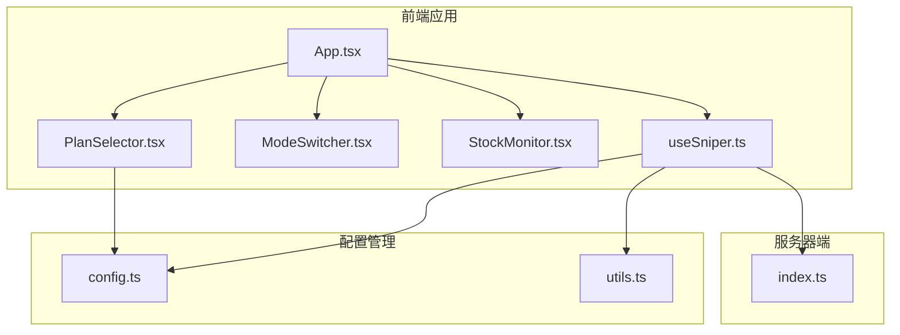
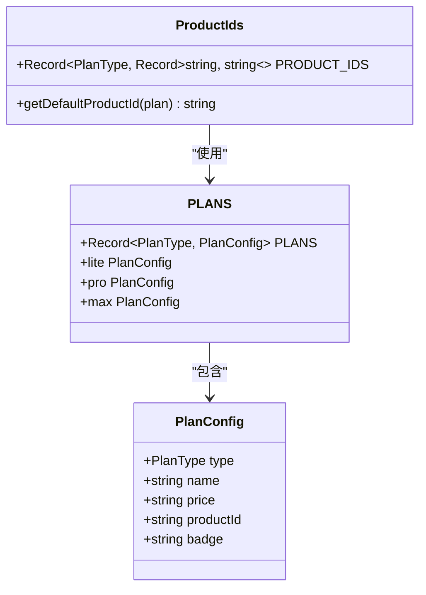
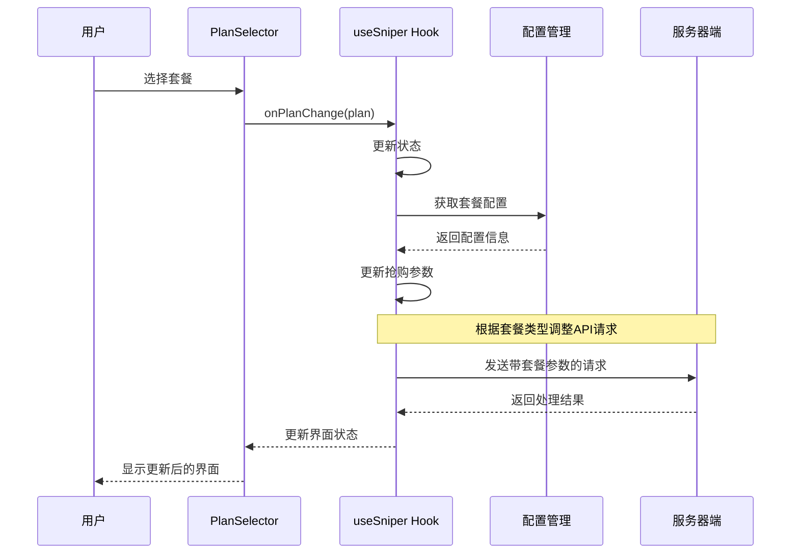
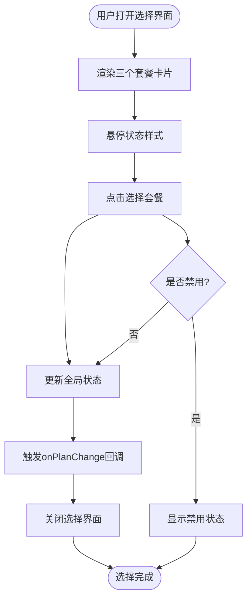
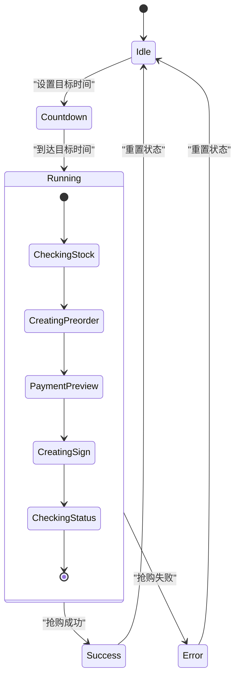
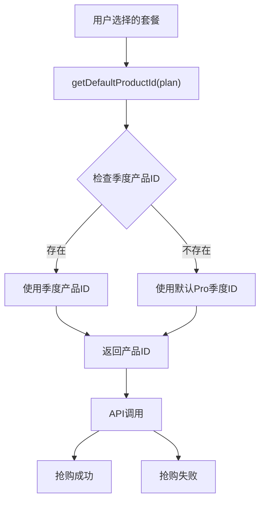
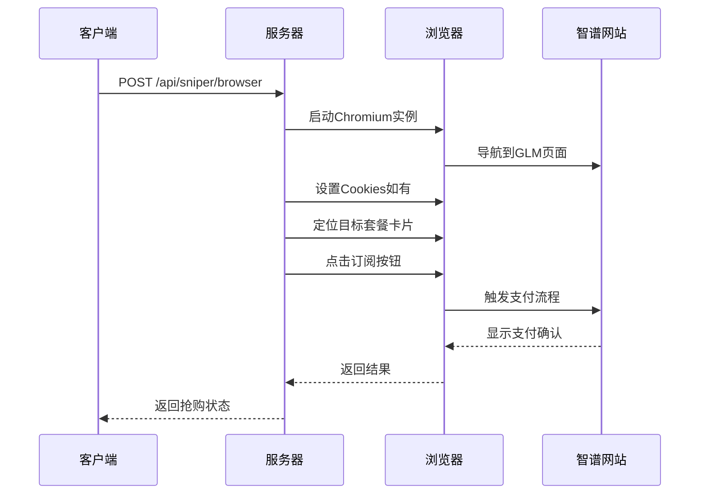
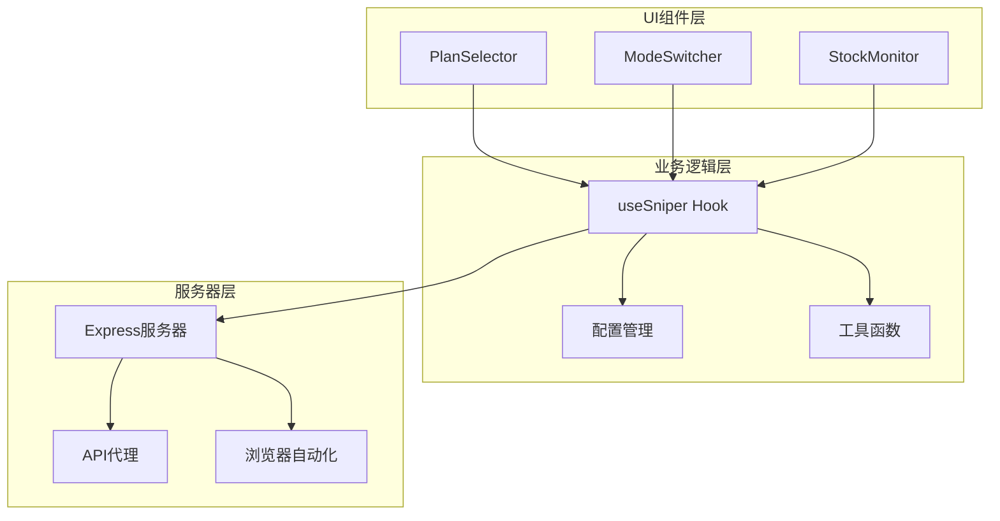

# 套餐选择系统

<cite>
**本文档引用的文件**
- [src/App.tsx](file://src/App.tsx)
- [src/components/PlanSelector.tsx](file://src/components/PlanSelector.tsx)
- [src/hooks/useSniper.ts](file://src/hooks/useSniper.ts)
- [src/lib/config.ts](file://src/lib/config.ts)
- [src/lib/utils.ts](file://src/lib/utils.ts)
- [src/components/ModeSwitcher.tsx](file://src/components/ModeSwitcher.tsx)
- [src/components/StockMonitor.tsx](file://src/components/StockMonitor.tsx)
- [server/index.ts](file://server/index.ts)
- [package.json](file://package.json)
</cite>

## 目录
1. [简介](#简介)
2. [项目结构](#项目结构)
3. [核心组件](#核心组件)
4. [架构概览](#架构概览)
5. [详细组件分析](#详细组件分析)
6. [依赖关系分析](#依赖关系分析)
7. [性能考虑](#性能考虑)
8. [故障排除指南](#故障排除指南)
9. [结论](#结论)
10. [附录](#附录)

## 简介

GLM Sniper 是一个用于抢购智谱AI GLM Coding Plan的自动化工具。套餐选择系统是该工具的核心功能之一，允许用户在三种不同的套餐级别之间进行选择，包括Lite、Pro和Max。每个套餐都有独特的定价策略、功能特性和适用场景。

本系统提供了两种抢购模式：浏览器自动化模式和API高速模式。用户可以通过直观的UI界面选择目标套餐，系统会根据所选套餐动态调整后续的抢购流程和API请求参数。

## 项目结构

GLM Sniper采用React + TypeScript + Vite构建，整体项目结构清晰，模块化程度高：



**图表来源**
- [src/App.tsx:12-197](file://src/App.tsx#L12-L197)
- [src/components/PlanSelector.tsx:1-61](file://src/components/PlanSelector.tsx#L1-L61)
- [src/hooks/useSniper.ts:46-407](file://src/hooks/useSniper.ts#L46-L407)

**章节来源**
- [src/App.tsx:1-197](file://src/App.tsx#L1-L197)
- [package.json:1-48](file://package.json#L1-L48)

## 核心组件

### 套餐配置系统

系统通过集中化的配置管理实现了套餐信息的统一维护：



**图表来源**
- [src/lib/config.ts:10-49](file://src/lib/config.ts#L10-L49)
- [src/lib/config.ts:51-73](file://src/lib/config.ts#L51-L73)

### 套餐选择UI组件

PlanSelector组件提供了直观的套餐选择界面，支持三种套餐的可视化展示和交互选择。

**章节来源**
- [src/lib/config.ts:28-49](file://src/lib/config.ts#L28-L49)
- [src/components/PlanSelector.tsx:11-60](file://src/components/PlanSelector.tsx#L11-L60)

## 架构概览

GLM Sniper的套餐选择系统采用分层架构设计，确保了良好的可维护性和扩展性：



**图表来源**
- [src/components/PlanSelector.tsx:24-27](file://src/components/PlanSelector.tsx#L24-L27)
- [src/hooks/useSniper.ts:386-388](file://src/hooks/useSniper.ts#L386-L388)
- [src/lib/config.ts:71-73](file://src/lib/config.ts#L71-L73)

## 详细组件分析

### 套餐配置数据结构

系统通过类型安全的方式定义了完整的套餐配置体系：

#### 基础类型定义

```mermaid
classDiagram
class PlanType {
<<enumeration>>
"lite"
"pro"
"max"
}
class SniperMode {
<<enumeration>>
"browser"
"api"
}
class SniperStatus {
<<enumeration>>
"idle"
"countdown"
"running"
"success"
"error"
}
class PlanConfig {
+PlanType type
+string name
+string price
+string productId
+string badge
}
```

**图表来源**
- [src/lib/config.ts:6-8](file://src/lib/config.ts#L6-L8)
- [src/lib/config.ts:10-16](file://src/lib/config.ts#L10-L16)

#### 产品ID映射系统

系统实现了灵活的产品ID映射机制，支持不同支付周期的套餐：

| 套餐类型 | 月付产品ID | 季付产品ID | 年付产品ID |
|---------|-----------|-----------|-----------|
| Lite | product-lite-monthly | product-lite-quarterly | product-lite-yearly |
| Pro | product-a6ef45 | product-1df3e1 | product-fc5155 |
| Max | product-max-monthly | product-2fc421 | product-max-yearly |

**章节来源**
- [src/lib/config.ts:52-68](file://src/lib/config.ts#L52-L68)
- [src/lib/config.ts:70-73](file://src/lib/config.ts#L70-L73)

### 套餐选择UI实现

PlanSelector组件提供了直观的卡片式选择界面：



**图表来源**
- [src/components/PlanSelector.tsx:14-59](file://src/components/PlanSelector.tsx#L14-L59)

#### UI特性实现

- **响应式布局**：使用Flexbox实现自适应的卡片排列
- **状态指示**：通过边框颜色和阴影效果突出当前选中的套餐
- **徽章系统**：热门套餐显示特色标签
- **禁用状态**：在抢购进行时自动禁用选择功能

**章节来源**
- [src/components/PlanSelector.tsx:11-60](file://src/components/PlanSelector.tsx#L11-L60)

### 状态管理逻辑

useSniper Hook实现了完整的状态管理机制：



**图表来源**
- [src/hooks/useSniper.ts:57](file://src/hooks/useSniper.ts#L57)
- [src/hooks/useSniper.ts:251-293](file://src/hooks/useSniper.ts#L251-L293)

#### 核心状态流转

1. **初始化状态**：设置默认套餐为Pro，模式为API
2. **倒计时状态**：计算目标时间差，进入倒计时模式
3. **运行状态**：执行实际的抢购逻辑
4. **结果状态**：根据抢购结果进入成功或失败状态

**章节来源**
- [src/hooks/useSniper.ts:46-67](file://src/hooks/useSniper.ts#L46-L67)
- [src/hooks/useSniper.ts:251-293](file://src/hooks/useSniper.ts#L251-L293)

### 套餐与产品ID映射

系统实现了智能的产品ID映射机制：



**图表来源**
- [src/lib/config.ts:70-73](file://src/lib/config.ts#L70-L73)
- [src/hooks/useSniper.ts:140-141](file://src/hooks/useSniper.ts#L140-L141)

#### 动态切换机制

- **默认产品ID**：系统优先使用季度付费的产品ID作为默认值
- **套餐特定ID**：每个套餐都有其特定的产品ID映射
- **回退机制**：当特定ID不存在时，自动回退到Pro套餐的标准ID

**章节来源**
- [src/lib/config.ts:70-73](file://src/lib/config.ts#L70-L73)
- [src/hooks/useSniper.ts:140-141](file://src/hooks/useSniper.ts#L140-L141)

### 抢购流程影响

套餐选择直接影响整个抢购流程：

#### API模式下的参数调整

| 参数 | Lite套餐 | Pro套餐 | Max套餐 |
|------|----------|---------|---------|
| 产品ID | product-005 | product-047 | product-047 |
| 价格显示 | ¥49/月 | ¥149/月 | ¥469/月 |
| 支付方式 | alipay | alipay | alipay |
| 认证要求 | 必需 | 必需 | 必需 |

#### 浏览器自动化模式下的处理

服务器端会根据套餐类型动态定位对应的订阅按钮：



**图表来源**
- [server/index.ts:43-159](file://server/index.ts#L43-L159)

**章节来源**
- [src/hooks/useSniper.ts:140-141](file://src/hooks/useSniper.ts#L140-L141)
- [server/index.ts:80-115](file://server/index.ts#L80-L115)

### 验证机制和错误处理

系统实现了多层次的验证和错误处理机制：

```mermaid
flowchart TD
Start([开始验证]) --> CheckPlan["检查套餐有效性"]
CheckPlan --> PlanValid{"套餐有效?"}
PlanValid --> |否| ShowError["显示错误信息"]
PlanValid --> |是| CheckAuth["检查认证状态"]
CheckAuth --> AuthValid{"认证有效?"}
AuthValid --> |否| ShowAuthError["显示认证错误"]
AuthValid --> |是| CheckStock["检查库存状态"]
CheckStock --> StockAvailable{"库存可用?"}
StockAvailable --> |否| ShowStockError["显示库存不足"]
StockAvailable --> |是| StartSniper["开始抢购"]
ShowError --> End([结束])
ShowAuthError --> End
ShowStockError --> End
StartSniper --> End
```



**图表来源**
- [src/hooks/useSniper.ts:115-119](file://src/hooks/useSniper.ts#L115-L119)
- [src/hooks/useSniper.ts:157-167](file://src/hooks/useSniper.ts#L157-L167)

#### 错误处理策略

1. **验证码检测**：自动识别并提示验证码拦截
2. **重试机制**：最多5次重试，间隔1秒
3. **状态反馈**：提供详细的日志记录和状态指示
4. **异常捕获**：全面的try-catch包装

**章节来源**
- [src/hooks/useSniper.ts:157-167](file://src/hooks/useSniper.ts#L157-L167)
- [src/hooks/useSniper.ts:170-174](file://src/hooks/useSniper.ts#L170-L174)

## 依赖关系分析

### 组件间依赖关系



**图表来源**
- [src/App.tsx:10-10](file://src/App.tsx#L10)
- [src/hooks/useSniper.ts:8](file://src/hooks/useSniper.ts#L8)

### 外部依赖分析

系统依赖的关键外部库：

| 依赖库 | 版本 | 用途 |
|--------|------|------|
| react | ^19.2.5 | 核心框架 |
| playwright | ^1.59.1 | 浏览器自动化 |
| express | ^5.2.1 | 服务器端 |
| tailwindcss | ^3.4.17 | 样式框架 |
| lucide-react | ^1.11.0 | 图标库 |

**章节来源**
- [package.json:14-26](file://package.json#L14-L26)

## 性能考虑

### 套餐选择性能优化

1. **状态缓存**：套餐配置信息在内存中缓存，避免重复计算
2. **事件防抖**：UI交互采用防抖处理，减少不必要的状态更新
3. **懒加载**：服务器端功能按需加载，提高启动速度

### 抢购性能优化

1. **提前执行**：倒计时提前2秒开始，补偿网络延迟
2. **并发控制**：限制同时进行的抢购任务数量
3. **资源清理**：及时释放浏览器实例和网络连接

## 故障排除指南

### 常见问题及解决方案

#### 套餐选择问题

| 问题描述 | 可能原因 | 解决方案 |
|----------|----------|----------|
| 套餐无法选择 | 抢购进行中 | 等待抢购结束后再选择 |
| 价格显示错误 | 配置文件损坏 | 检查config.ts文件 |
| UI样式异常 | CSS类名冲突 | 检查Tailwind配置 |

#### 抢购失败问题

| 问题描述 | 可能原因 | 解决方案 |
|----------|----------|----------|
| 验证码拦截 | 频繁请求触发风控 | 手动完成验证码后重试 |
| 认证失败 | Token过期 | 重新登录获取新Token |
| 库存不足 | 套餐已售罄 | 使用库存监控功能 |

**章节来源**
- [src/hooks/useSniper.ts:157-167](file://src/hooks/useSniper.ts#L157-L167)
- [src/hooks/useSniper.ts:170-174](file://src/hooks/useSniper.ts#L170-L174)

## 结论

GLM Sniper的套餐选择系统通过精心设计的架构和实现，为用户提供了强大而易用的抢购工具。系统的主要优势包括：

1. **类型安全**：完整的TypeScript类型定义确保了代码质量
2. **灵活扩展**：模块化设计支持轻松添加新的套餐类型
3. **用户体验**：直观的UI界面和实时的状态反馈
4. **可靠性**：完善的错误处理和重试机制

该系统为类似的产品抢购工具提供了优秀的参考实现，展示了如何在保证功能完整性的同时，保持代码的可维护性和可扩展性。

## 附录

### 新增套餐类型的步骤

要为系统添加新的套餐类型，需要按照以下步骤进行：

1. **更新配置文件**：
   ```typescript
   // 在PLANS中添加新套餐
   export const PLANS: Record<PlanType, PlanConfig> = {
     // ... 现有套餐
     newPlan: {
       type: 'newPlan',
       name: 'New Plan',
       price: '¥XXX/月',
       productId: 'product-new-plan',
     },
   };
   ```

2. **更新产品ID映射**：
   ```typescript
   export const PRODUCT_IDS: Record<PlanType, Record<string, string>> = {
     // ... 现有映射
     newPlan: {
       monthly: 'product-new-plan-monthly',
       quarterly: 'product-new-plan-quarterly',
       yearly: 'product-new-plan-yearly',
     },
   };
   ```

3. **更新UI组件**：
   - 修改PlanSelector组件中的套餐列表
   - 更新App组件中的显示逻辑

4. **测试验证**：
   - 验证新套餐的价格显示
   - 测试API调用参数
   - 确保服务器端兼容性

### 配置管理最佳实践

1. **集中化配置**：所有套餐相关信息集中在config.ts中
2. **类型约束**：使用TypeScript确保配置的正确性
3. **默认值设置**：为所有配置项提供合理的默认值
4. **文档注释**：为复杂的配置项添加详细的注释说明
5. **版本控制**：通过Git跟踪配置文件的变更历史