# 实时日志系统

<cite>
**本文档引用的文件**
- [LogConsole.tsx](file://src/components/LogConsole.tsx)
- [useSniper.ts](file://src/hooks/useSniper.ts)
- [utils.ts](file://src/lib/utils.ts)
- [config.ts](file://src/lib/config.ts)
- [App.tsx](file://src/App.tsx)
- [index.css](file://src/index.css)
- [server/index.ts](file://server/index.ts)
- [package.json](file://package.json)
</cite>

## 目录
1. [简介](#简介)
2. [项目结构](#项目结构)
3. [核心组件](#核心组件)
4. [架构概览](#架构概览)
5. [详细组件分析](#详细组件分析)
6. [依赖关系分析](#依赖关系分析)
7. [性能考量](#性能考量)
8. [故障排除指南](#故障排除指南)
9. [结论](#结论)
10. [附录](#附录)

## 简介

GLM Sniper 的实时日志系统是一个完整的日志记录、显示和管理解决方案，专为抢购场景设计。该系统提供了多级别的日志记录能力，包括信息、成功、警告和错误四个级别，支持实时滚动显示、时间戳格式化、颜色编码和用户交互功能。

日志系统在抢购的不同阶段发挥着关键作用：
- **倒计时阶段**：显示目标时间、剩余时间和状态变化
- **请求发送阶段**：记录每个API调用的详细信息和响应状态
- **响应处理阶段**：显示数据解析结果和业务逻辑处理过程
- **结果反馈阶段**：提供最终状态报告和用户指导

## 项目结构

日志系统采用模块化设计，主要分布在以下文件中：

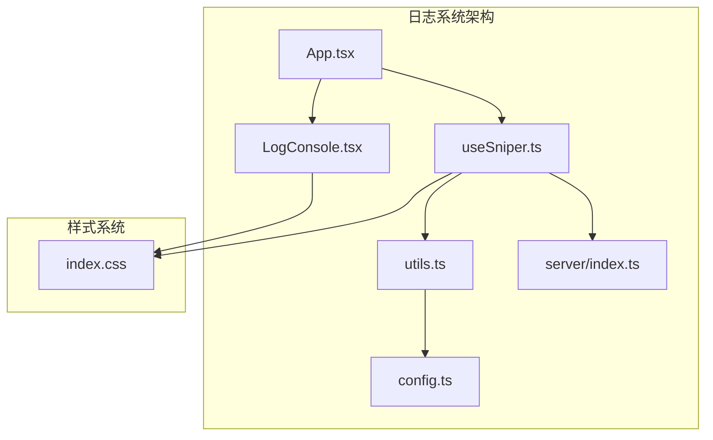

**图表来源**
- [App.tsx:12-197](file://src/App.tsx#L12-L197)
- [LogConsole.tsx:1-78](file://src/components/LogConsole.tsx#L1-L78)
- [useSniper.ts:1-407](file://src/hooks/useSniper.ts#L1-L407)

**章节来源**
- [App.tsx:12-197](file://src/App.tsx#L12-L197)
- [package.json:1-48](file://package.json#L1-L48)

## 核心组件

### 日志数据结构

日志系统的核心数据结构由三个文件定义：

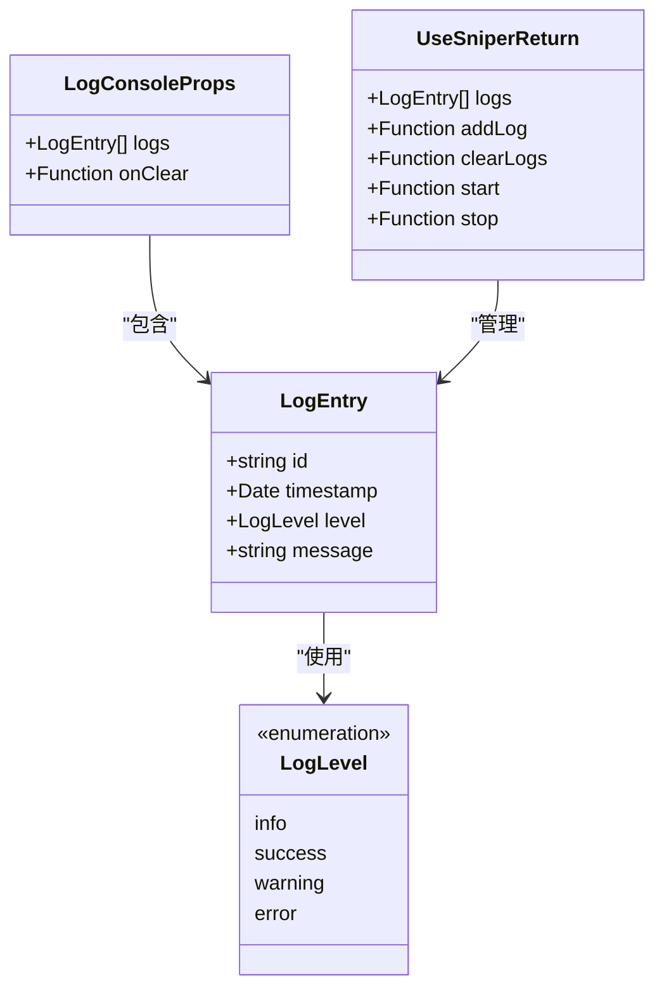

**图表来源**
- [utils.ts:7-12](file://src/lib/utils.ts#L7-L12)
- [utils.ts:5](file://src/lib/utils.ts#L5)
- [LogConsole.tsx:5-8](file://src/components/LogConsole.tsx#L5-L8)
- [useSniper.ts:19-44](file://src/hooks/useSniper.ts#L19-L44)

### 日志级别分类

系统支持四种日志级别，每种级别都有特定的颜色编码和语义含义：

| 级别 | 颜色编码 | 用途 | 示例消息 |
|------|----------|------|----------|
| info | 灰色 | 一般信息、状态更新 | "启动抢购流程"、"库存检查结果" |
| success | 绿色 | 成功操作、积极结果 | "抢购成功"、"预订单创建成功" |
| warning | 黄色 | 警告信息、需要注意的情况 | "检测到验证码拦截"、"请求失败" |
| error | 红色 | 错误信息、异常情况 | "连接失败"、"认证失败" |

**章节来源**
- [LogConsole.tsx:10-15](file://src/components/LogConsole.tsx#L10-L15)
- [utils.ts:5](file://src/lib/utils.ts#L5)

## 架构概览

日志系统采用分层架构设计，实现了清晰的关注点分离：

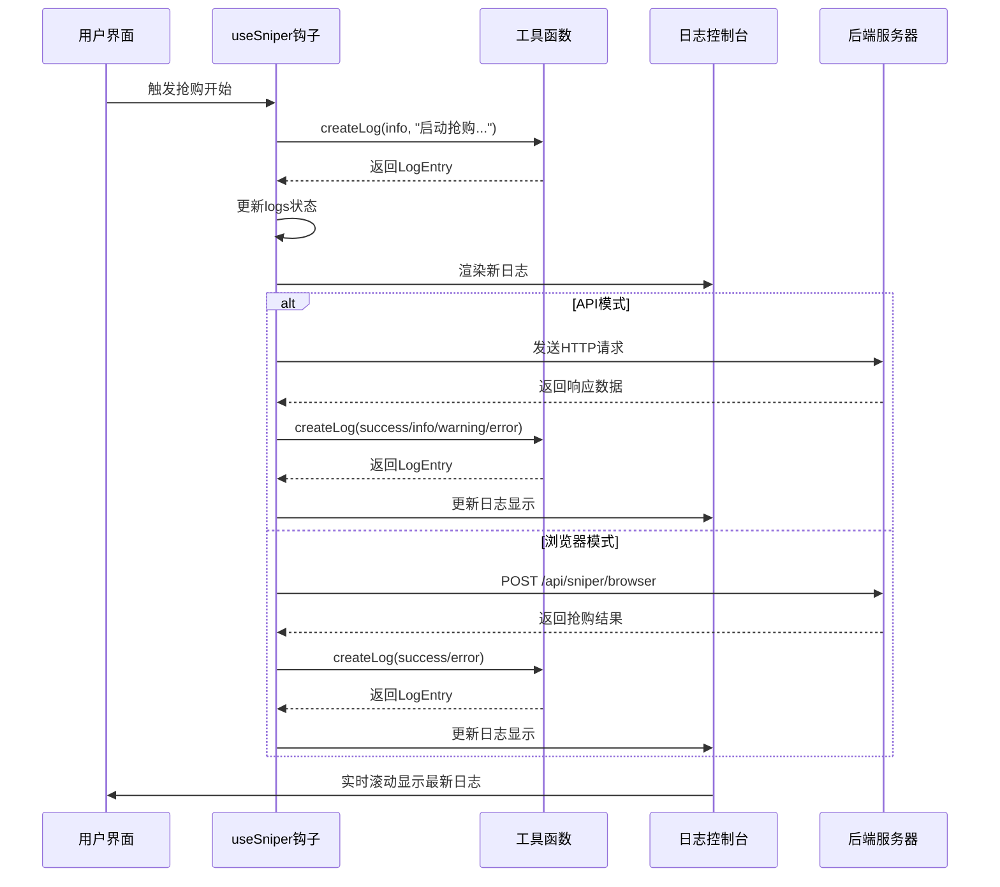

**图表来源**
- [useSniper.ts:251-293](file://src/hooks/useSniper.ts#L251-L293)
- [useSniper.ts:77-106](file://src/hooks/useSniper.ts#L77-L106)
- [useSniper.ts:111-248](file://src/hooks/useSniper.ts#L111-L248)
- [server/index.ts:43-159](file://server/index.ts#L43-L159)

## 详细组件分析

### LogConsole 组件

LogConsole 是日志系统的UI组件，负责日志的渲染和用户交互：

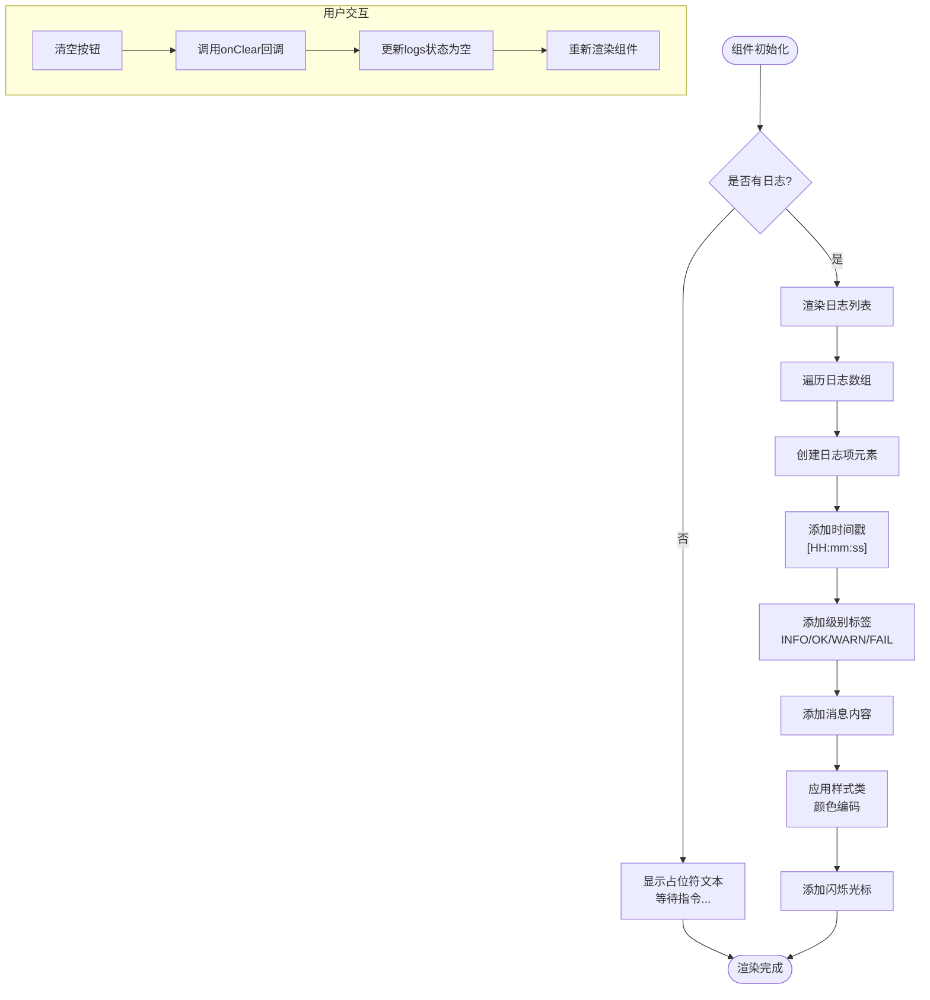

**图表来源**
- [LogConsole.tsx:17-77](file://src/components/LogConsole.tsx#L17-L77)

#### 实时滚动机制

组件实现了智能的自动滚动功能：

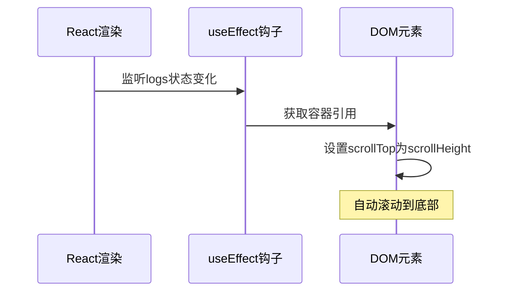

**图表来源**
- [LogConsole.tsx:20-24](file://src/components/LogConsole.tsx#L20-L24)

**章节来源**
- [LogConsole.tsx:17-77](file://src/components/LogConsole.tsx#L17-L77)

### useSniper 钩子

useSniper 是日志系统的核心逻辑控制器，管理整个抢购流程中的日志记录：

#### 日志创建函数

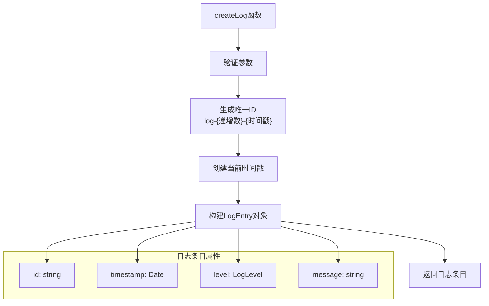

**图表来源**
- [utils.ts:20-27](file://src/lib/utils.ts#L20-L27)

#### 抢购阶段的日志记录

系统在不同抢购阶段记录详细的操作日志：

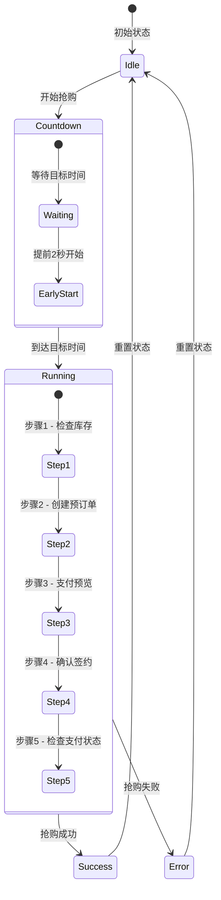

**图表来源**
- [useSniper.ts:251-293](file://src/hooks/useSniper.ts#L251-L293)
- [useSniper.ts:111-248](file://src/hooks/useSniper.ts#L111-L248)

**章节来源**
- [useSniper.ts:68-74](file://src/hooks/useSniper.ts#L68-L74)
- [useSniper.ts:251-293](file://src/hooks/useSniper.ts#L251-L293)

### 时间戳生成和格式化

系统提供了专门的时间戳处理功能：

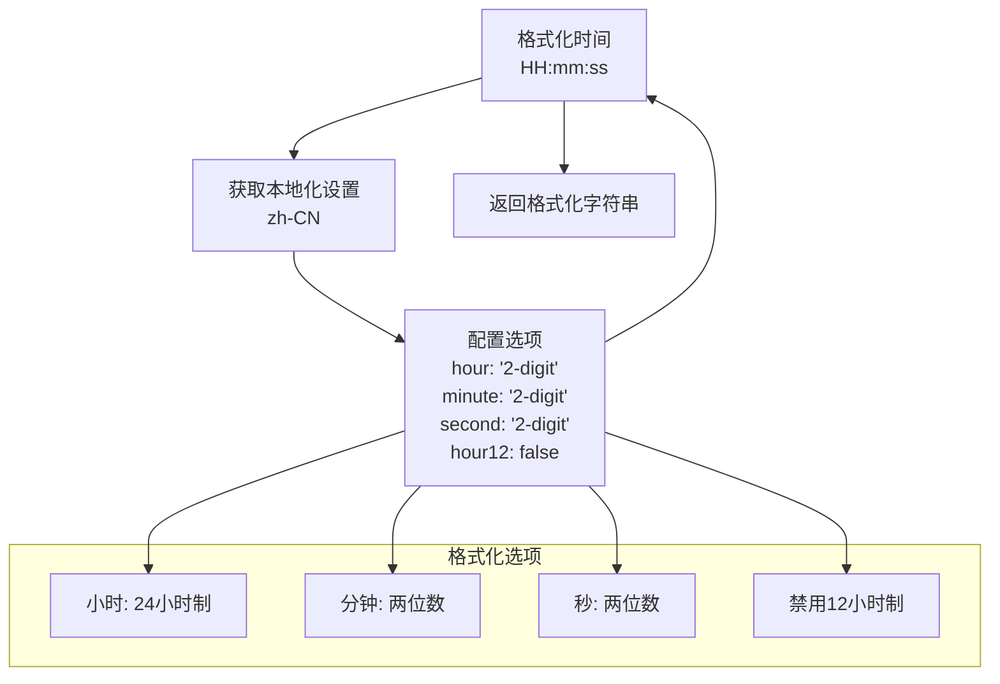

**图表来源**
- [utils.ts:29-36](file://src/lib/utils.ts#L29-L36)

**章节来源**
- [utils.ts:29-36](file://src/lib/utils.ts#L29-L36)

### 样式系统

日志系统采用了完整的CSS样式体系：

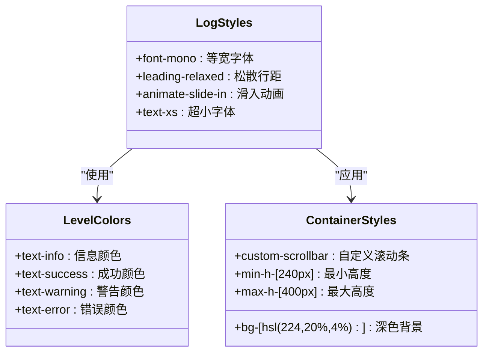

**图表来源**
- [LogConsole.tsx:40-74](file://src/components/LogConsole.tsx#L40-L74)
- [index.css:72-131](file://src/index.css#L72-L131)

**章节来源**
- [index.css:72-131](file://src/index.css#L72-L131)

## 依赖关系分析

日志系统各组件之间的依赖关系如下：

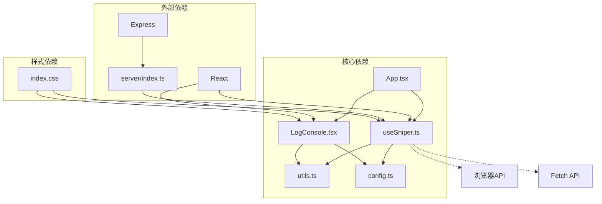

**图表来源**
- [useSniper.ts:1-10](file://src/hooks/useSniper.ts#L1-L10)
- [LogConsole.tsx:1-4](file://src/components/LogConsole.tsx#L1-L4)
- [App.tsx:1-11](file://src/App.tsx#L1-L11)

**章节来源**
- [useSniper.ts:1-10](file://src/hooks/useSniper.ts#L1-L10)
- [LogConsole.tsx:1-4](file://src/components/LogConsole.tsx#L1-L4)

## 性能考量

### 内存管理

日志系统在内存管理方面采用了多项优化策略：

1. **状态更新优化**：使用不可变数据结构，每次只更新必要的状态
2. **组件渲染优化**：通过React.memo减少不必要的重新渲染
3. **滚动性能**：使用原生DOM操作而非React状态更新来控制滚动位置

### 渲染性能

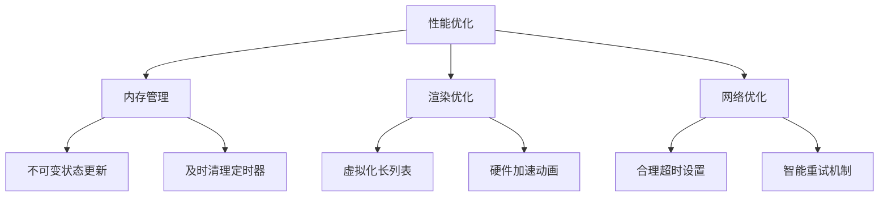

### 扩展性考虑

系统设计具有良好的扩展性：

1. **日志级别扩展**：可通过修改LEVEL_LABELS常量轻松添加新的日志级别
2. **样式定制**：通过CSS变量和Tailwind类名实现样式定制
3. **功能扩展**：日志过滤、搜索和导出功能可作为后续扩展点

## 故障排除指南

### 常见问题及解决方案

#### 日志不显示问题

**症状**：日志控制台空白或不更新
**可能原因**：
1. logs状态未正确更新
2. useEffect依赖项配置错误
3. 样式冲突导致内容不可见

**解决方法**：
1. 检查useSniper钩子中的addLog函数
2. 验证LogConsole组件的props传递
3. 确认CSS样式类名正确应用

#### 滚动问题

**症状**：日志无法自动滚动到底部
**可能原因**：
1. DOM引用未正确获取
2. 异步更新时机问题
3. 容器高度计算错误

**解决方法**：
1. 确保useRef正确初始化
2. 检查useEffect的依赖数组
3. 验证容器的CSS样式

#### 时间戳格式问题

**症状**：时间显示格式不正确
**可能原因**：
1. 本地化设置问题
2. 时区处理错误
3. 格式化函数调用错误

**解决方法**：
1. 检查formatTime函数的locale参数
2. 验证Date对象的创建
3. 确认格式化选项的正确性

**章节来源**
- [LogConsole.tsx:20-24](file://src/components/LogConsole.tsx#L20-L24)
- [utils.ts:29-36](file://src/lib/utils.ts#L29-L36)

## 结论

GLM Sniper 的实时日志系统是一个设计精良、功能完整的日志记录解决方案。系统通过清晰的架构设计、合理的数据结构和丰富的用户交互功能，为抢购场景提供了全面的日志支持。

### 主要优势

1. **多级别日志支持**：完整的信息层次结构，便于用户快速识别重要信息
2. **实时显示功能**：智能滚动和动画效果，提供良好的用户体验
3. **完整的生命周期管理**：从创建到清理的完整日志管理
4. **可扩展的设计**：模块化的架构便于功能扩展和维护

### 技术亮点

- **React Hooks集成**：充分利用React的状态管理和副作用处理
- **类型安全**：完整的TypeScript类型定义确保代码质量
- **性能优化**：合理的渲染策略和内存管理
- **样式系统**：基于Tailwind CSS的现代化样式设计

## 附录

### API参考

#### 日志创建函数

```typescript
function createLog(level: LogLevel, message: string): LogEntry
```

**参数**：
- `level`: 日志级别（info/success/warning/error）
- `message`: 日志消息内容

**返回值**：LogEntry对象

#### 时间格式化函数

```typescript
function formatTime(date: Date): string
```

**参数**：
- `date`: Date对象

**返回值**：格式化后的字符串（HH:mm:ss）

### 配置选项

系统支持的配置选项包括：

- **日志级别标签**：自定义各级别的显示标签
- **样式主题**：通过CSS变量定制颜色方案
- **滚动行为**：控制自动滚动的触发条件
- **最大日志数量**：限制日志条目数量以控制内存使用

### 维护建议

1. **定期清理**：建议设置日志上限，避免无限增长
2. **性能监控**：关注大量日志时的渲染性能
3. **样式维护**：保持CSS类名的一致性和可维护性
4. **功能扩展**：预留扩展点以支持未来的功能需求