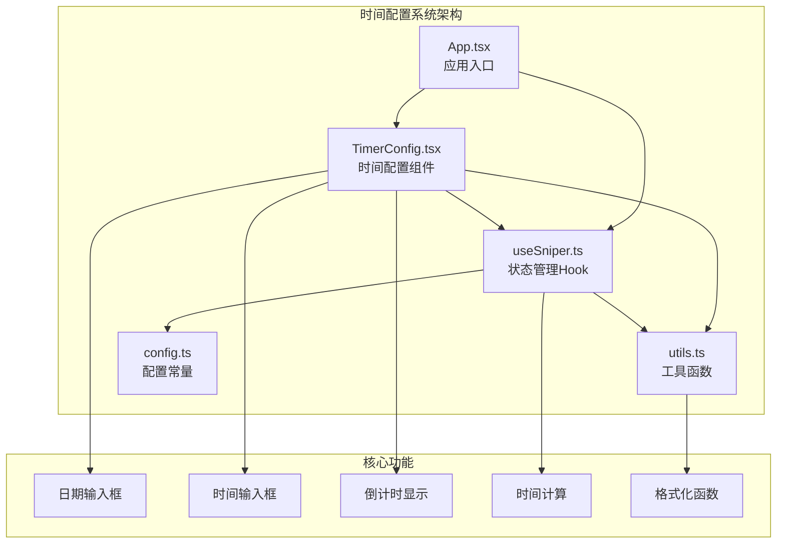
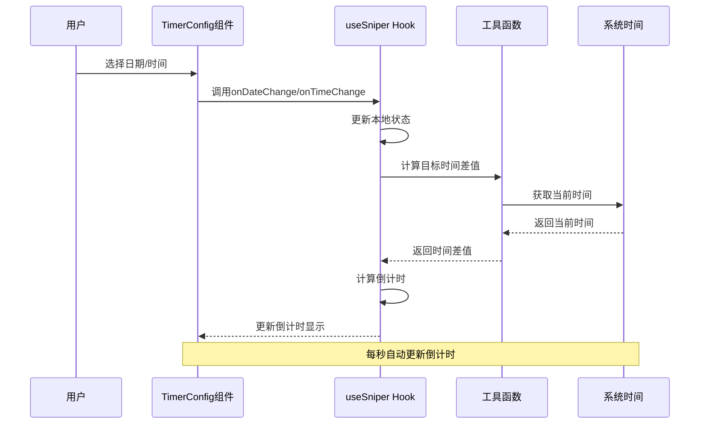
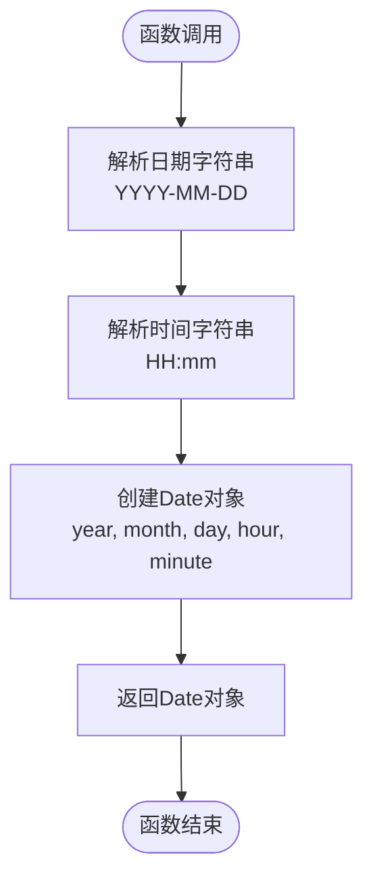
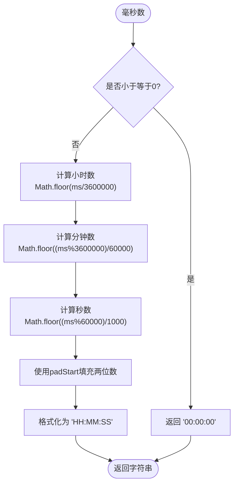
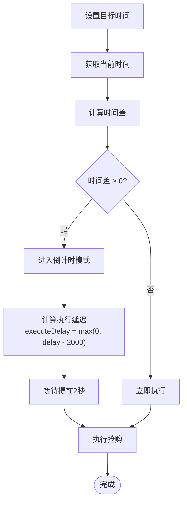
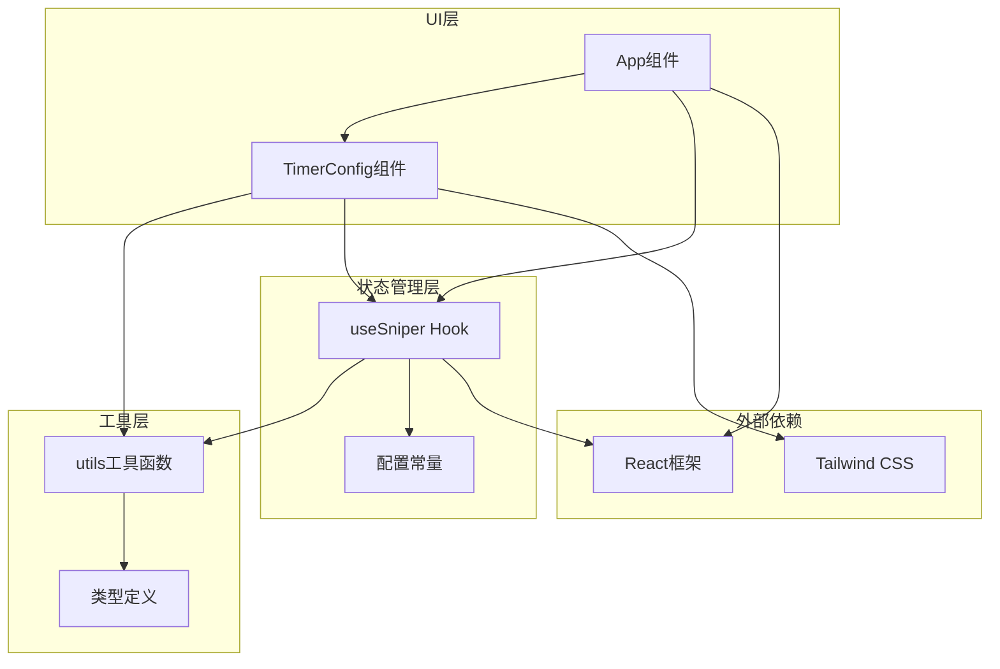

# 时间配置系统

<cite>
**本文档引用的文件**
- [TimerConfig.tsx](file://src/components/TimerConfig.tsx)
- [utils.ts](file://src/lib/utils.ts)
- [useSniper.ts](file://src/hooks/useSniper.ts)
- [App.tsx](file://src/App.tsx)
- [config.ts](file://src/lib/config.ts)
</cite>

## 目录
1. [简介](#简介)
2. [项目结构](#项目结构)
3. [核心组件](#核心组件)
4. [架构概览](#架构概览)
5. [详细组件分析](#详细组件分析)
6. [依赖关系分析](#依赖关系分析)
7. [性能考虑](#性能考虑)
8. [故障排除指南](#故障排除指南)
9. [结论](#结论)

## 简介

GLM Sniper的时间配置系统是整个抢购工具的核心功能模块，负责管理用户设定的目标抢购时间、实时倒计时显示以及时间计算逻辑。该系统通过React组件和自定义Hook实现了完整的日期时间选择、格式化和倒计时功能，为用户提供直观的时间配置体验。

系统的主要特点包括：
- 实时倒计时显示（时:分:秒格式）
- 日期选择器（支持未来30天范围）
- 时间选择器（24小时制）
- 提前2秒执行机制（补偿网络延迟）
- 错误处理和边界情况管理
- 国际化支持（中文界面）

## 项目结构

时间配置系统主要分布在以下文件中：

**图表来源**
- [App.tsx:74-101](file://src/App.tsx#L74-L101)
- [TimerConfig.tsx:1-99](file://src/components/TimerConfig.tsx#L1-L99)
- [useSniper.ts:46-406](file://src/hooks/useSniper.ts#L46-L406)

**章节来源**
- [App.tsx:12-197](file://src/App.tsx#L12-L197)
- [TimerConfig.tsx:1-99](file://src/components/TimerConfig.tsx#L1-L99)
- [useSniper.ts:46-406](file://src/hooks/useSniper.ts#L46-L406)

## 核心组件

### TimerConfig 组件

TimerConfig是时间配置系统的核心UI组件，提供了完整的日期和时间选择功能：

**主要功能特性：**
- 日期选择器：限制用户只能选择未来30天内的日期
- 时间选择器：支持24小时制时间输入
- 实时倒计时显示：以"时:分:秒"格式显示剩余时间
- 状态指示：过期时间和正常状态的不同视觉反馈
- 响应式设计：适配不同屏幕尺寸

**组件属性：**
- `targetDate`: 当前选中的日期（YYYY-MM-DD格式）
- `targetTime`: 当前选中的时间（HH:mm格式）
- `onDateChange`: 日期变更回调函数
- `onTimeChange`: 时间变更回调函数
- `disabled`: 控制组件禁用状态

**章节来源**
- [TimerConfig.tsx:5-11](file://src/components/TimerConfig.tsx#L5-L11)
- [TimerConfig.tsx:13-32](file://src/components/TimerConfig.tsx#L13-L32)

### useSniper Hook

useSniper Hook管理整个应用的状态，包括时间配置的全局状态：

**状态管理：**
- `targetDate`: 目标日期状态
- `targetTime`: 目标时间状态
- `status`: 抢购状态（idle/countdown/running/success/error）
- `logs`: 日志记录数组

**核心方法：**
- `setTargetDate`: 更新目标日期
- `setTargetTime`: 更新目标时间
- `start`: 启动抢购流程
- `stop`: 停止抢购流程

**章节来源**
- [useSniper.ts:46-67](file://src/hooks/useSniper.ts#L46-L67)
- [useSniper.ts:386-406](file://src/hooks/useSniper.ts#L386-L406)

## 架构概览

时间配置系统采用分层架构设计，确保了清晰的职责分离和良好的可维护性：

**图表来源**
- [TimerConfig.tsx:17-32](file://src/components/TimerConfig.tsx#L17-L32)
- [useSniper.ts:251-293](file://src/hooks/useSniper.ts#L251-L293)
- [utils.ts:38-50](file://src/lib/utils.ts#L38-L50)

## 详细组件分析

### 时间选择器实现

时间选择器由两个独立的HTML输入元素组成，分别处理日期和时间：

#### 日期选择器（Date Input）
- **类型**: `type="date"`
- **范围限制**: 从明天到30天后的日期
- **格式**: ISO 8601标准（YYYY-MM-DD）
- **验证**: 内置浏览器验证，确保有效日期

#### 时间选择器（Time Input）
- **类型**: `type="time"`
- **格式**: 24小时制（HH:mm）
- **验证**: 内置浏览器验证，确保有效时间
- **精度**: 分钟级精度

**章节来源**
- [TimerConfig.tsx:50-74](file://src/components/TimerConfig.tsx#L50-L74)

### 时间计算和格式化

系统提供了三个核心的工具函数来处理时间相关的操作：

#### getTargetDateTime 函数
将日期和时间字符串组合成JavaScript Date对象：

**图表来源**
- [utils.ts:46-50](file://src/lib/utils.ts#L46-L50)

#### formatCountdown 函数
将毫秒数转换为"时:分:秒"格式：

**图表来源**
- [utils.ts:38-44](file://src/lib/utils.ts#L38-L44)

#### formatTime 函数
格式化单个时间点为本地化时间字符串：

**章节来源**
- [utils.ts:29-36](file://src/lib/utils.ts#L29-L36)
- [utils.ts:38-44](file://src/lib/utils.ts#L38-L44)
- [utils.ts:46-50](file://src/lib/utils.ts#L46-L50)

### 倒计时逻辑

倒计时系统实现了精确的时间计算和实时更新机制：

#### 实时更新机制
- **更新频率**: 每秒更新一次
- **计算方式**: 目标时间 - 当前时间
- **状态管理**: 自动检测过期状态

#### 提前执行机制
系统实现了智能的提前2秒执行策略来补偿网络延迟：

**图表来源**
- [useSniper.ts:263-292](file://src/hooks/useSniper.ts#L263-L292)

**章节来源**
- [TimerConfig.tsx:17-32](file://src/components/TimerConfig.tsx#L17-L32)
- [useSniper.ts:263-292](file://src/hooks/useSniper.ts#L263-L292)

### 状态管理

时间配置系统采用了React的状态管理模式，确保数据的一致性和响应性：

#### 本地状态更新
- **TimerConfig组件**: 维护本地倒计时状态
- **useSniper Hook**: 维护全局时间配置状态
- **双向绑定**: 确保UI与状态的同步

#### 全局状态同步
- **App组件**: 作为状态的单一事实来源
- **Props传递**: 将状态传递给子组件
- **回调函数**: 处理用户交互事件

**章节来源**
- [TimerConfig.tsx:13-32](file://src/components/TimerConfig.tsx#L13-L32)
- [useSniper.ts:46-67](file://src/hooks/useSniper.ts#L46-L67)
- [App.tsx:94-100](file://src/App.tsx#L94-L100)

## 依赖关系分析

时间配置系统各组件之间的依赖关系如下：

**图表来源**
- [App.tsx:1-11](file://src/App.tsx#L1-L11)
- [TimerConfig.tsx:1-4](file://src/components/TimerConfig.tsx#L1-L4)
- [useSniper.ts:1-9](file://src/hooks/useSniper.ts#L1-L9)

**章节来源**
- [App.tsx:1-11](file://src/App.tsx#L1-L11)
- [TimerConfig.tsx:1-4](file://src/components/TimerConfig.tsx#L1-L4)
- [useSniper.ts:1-9](file://src/hooks/useSniper.ts#L1-L9)

## 性能考虑

时间配置系统在性能方面采用了多项优化策略：

### 内存管理
- **定时器清理**: 组件卸载时自动清理定时器
- **状态优化**: 使用useState和useEffect避免不必要的重渲染
- **引用缓存**: 使用useRef存储定时器引用

### 计算优化
- **精确计算**: 使用整数运算避免浮点数精度问题
- **缓存策略**: 避免重复计算相同的时间差值
- **批量更新**: 合并状态更新减少渲染次数

### 渲染优化
- **条件渲染**: 根据状态动态切换UI元素
- **样式类合并**: 使用clsx和tailwind-merge优化CSS类
- **响应式设计**: 适配不同设备和屏幕尺寸

**章节来源**
- [TimerConfig.tsx:29-32](file://src/components/TimerConfig.tsx#L29-L32)
- [useSniper.ts:375-384](file://src/hooks/useSniper.ts#L375-L384)

## 故障排除指南

### 常见问题及解决方案

#### 时间显示异常
**问题**: 倒计时显示不正确或出现负数
**原因**: 时间计算错误或系统时间不准确
**解决方案**: 
- 检查系统时间设置
- 验证日期时间格式
- 确认时区设置正确

#### 组件无法交互
**问题**: 日期时间选择器无法点击或输入
**原因**: 组件被禁用或存在冲突
**解决方案**:
- 检查disabled属性状态
- 确认父组件状态更新
- 验证事件处理器绑定

#### 倒计时停止更新
**问题**: 倒计时不再更新
**原因**: 定时器被清理或组件卸载
**解决方案**:
- 检查组件生命周期
- 确认定时器引用
- 验证状态更新逻辑

### 错误处理机制

系统内置了多种错误处理机制：

#### 输入验证
- **格式验证**: 确保日期时间格式正确
- **范围验证**: 限制日期在合理范围内
- **类型验证**: 防止非预期的数据类型

#### 边界情况处理
- **过期时间**: 自动检测并处理已过期的时间
- **系统时间**: 处理系统时间变化的情况
- **网络延迟**: 通过提前2秒机制补偿网络延迟

**章节来源**
- [TimerConfig.tsx:21-27](file://src/components/TimerConfig.tsx#L21-L27)
- [useSniper.ts:271-272](file://src/hooks/useSniper.ts#L271-L272)

## 结论

GLM Sniper的时间配置系统是一个设计精良、功能完整的模块化组件。它通过清晰的架构设计、完善的错误处理机制和优化的性能策略，为用户提供了可靠的抢购时机管理功能。

系统的主要优势包括：
- **直观的用户界面**: 清晰的日期时间选择器
- **精确的时间计算**: 基于毫秒级的倒计时精度
- **智能的执行策略**: 提前2秒执行补偿网络延迟
- **健壮的错误处理**: 完善的边界情况处理
- **良好的扩展性**: 模块化的架构设计便于功能扩展

未来可以考虑的改进方向：
- 添加时区支持和国际化选项
- 实现更灵活的时间格式配置
- 增加时间配置的导入导出功能
- 提供时间配置的历史记录功能