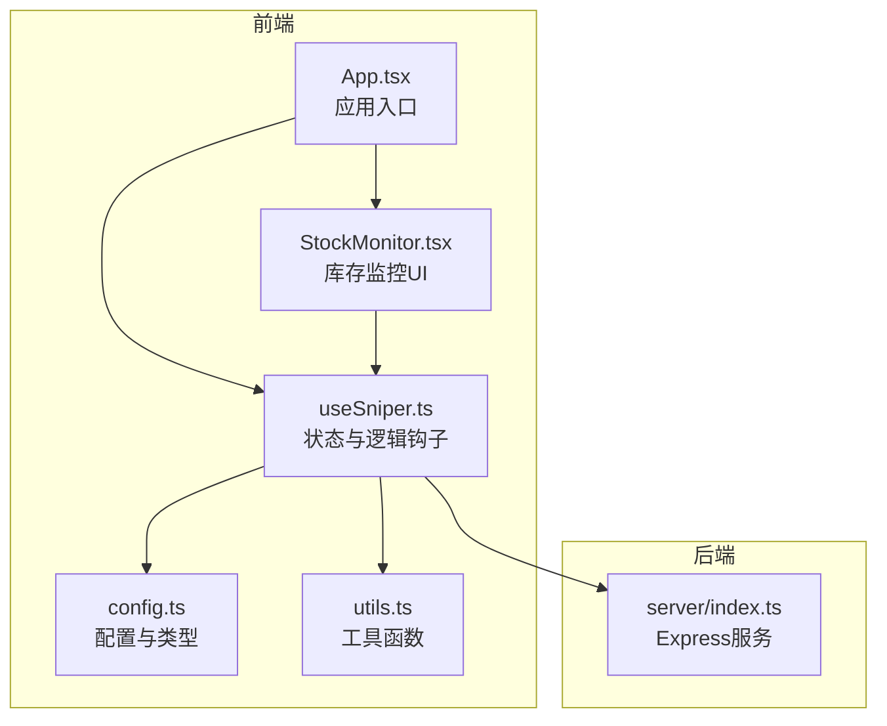
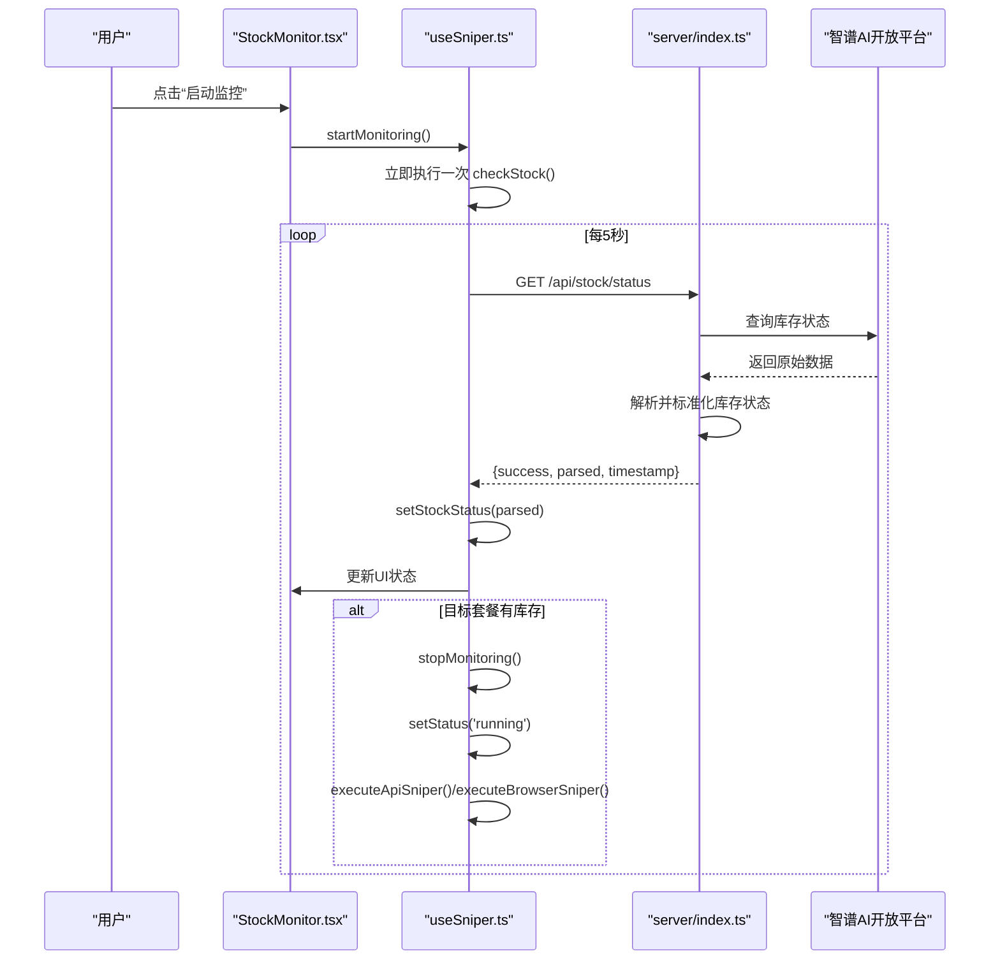
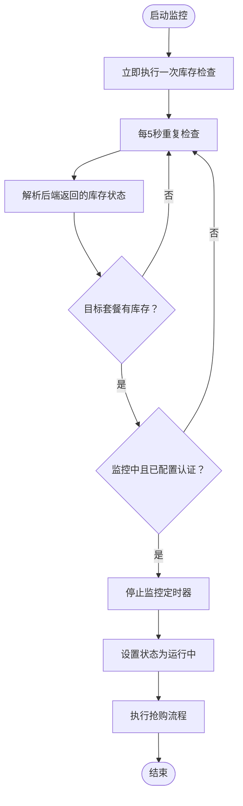
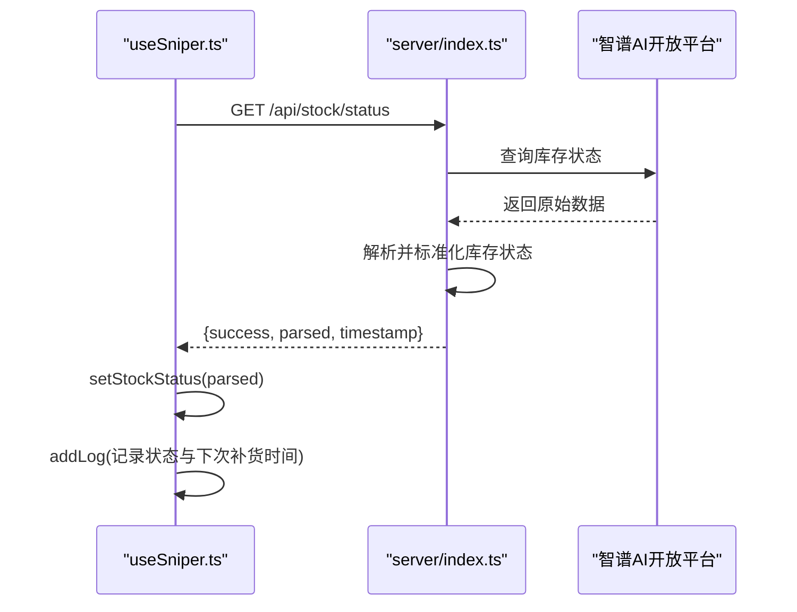
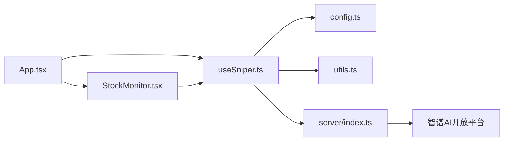

# 智能库存监控

<cite>
**本文引用的文件列表**
- [StockMonitor.tsx](file://src/components/StockMonitor.tsx)
- [useSniper.ts](file://src/hooks/useSniper.ts)
- [config.ts](file://src/lib/config.ts)
- [index.ts](file://server/index.ts)
- [App.tsx](file://src/App.tsx)
- [utils.ts](file://src/lib/utils.ts)
- [LogConsole.tsx](file://src/components/LogConsole.tsx)
- [ControlBar.tsx](file://src/components/ControlBar.tsx)
- [package.json](file://package.json)
</cite>

## 目录
1. [简介](#简介)
2. [项目结构](#项目结构)
3. [核心组件](#核心组件)
4. [架构总览](#架构总览)
5. [详细组件分析](#详细组件分析)
6. [依赖关系分析](#依赖关系分析)
7. [性能考量](#性能考量)
8. [故障排查指南](#故障排查指南)
9. [结论](#结论)
10. [附录](#附录)

## 简介
本文件面向GLM Sniper的“智能库存监控”子系统，系统性阐述库存监控的实现机制，包括轮询策略、状态更新与自动触发功能；解释库存状态的数据结构（Lite/Pro/Max三种套餐的可用性与提示信息）；说明监控轮询的时间间隔（5秒）与触发条件；介绍库存监控与抢购流程的集成方式（自动触发抢购的逻辑与条件判断）；提供具体代码示例路径以展示库存检查API调用、状态解析与UI更新机制；说明监控状态的生命周期管理（启动、停止与清理）；并给出常见问题排查方法与性能优化建议。

## 项目结构
该仓库采用前端React + 后端Express的双端架构：
- 前端负责用户界面与交互，库存监控UI由组件驱动，状态通过自定义Hook集中管理。
- 后端提供API代理与库存状态查询服务，统一处理跨域与业务流程。



图表来源
- [App.tsx:12-194](file://src/App.tsx#L12-L194)
- [StockMonitor.tsx:27-140](file://src/components/StockMonitor.tsx#L27-L140)
- [useSniper.ts:46-406](file://src/hooks/useSniper.ts#L46-L406)
- [config.ts:1-104](file://src/lib/config.ts#L1-L104)
- [utils.ts:1-51](file://src/lib/utils.ts#L1-L51)
- [index.ts:1-370](file://server/index.ts#L1-L370)

章节来源
- [App.tsx:12-194](file://src/App.tsx#L12-L194)
- [package.json:1-48](file://package.json#L1-L48)

## 核心组件
- 库存监控UI组件：负责渲染Lite/Pro/Max三个套餐的库存状态卡片、显示“下次补货时间”、提供手动查询与启停监控按钮，并实时显示监控状态指示。
- 状态与逻辑钩子：集中管理抢购模式、目标套餐、时间、认证信息、日志、以及库存监控的启动/停止/单次检查等逻辑。
- 配置与类型：定义套餐类型、计划配置、API端点、产品ID映射、库存检查相关常量等。
- 后端服务：提供库存状态查询API，解析远端返回的库存数据并标准化输出；同时提供浏览器自动化与API高速抢购的后端接口。

章节来源
- [StockMonitor.tsx:5-25](file://src/components/StockMonitor.tsx#L5-L25)
- [useSniper.ts:11-44](file://src/hooks/useSniper.ts#L11-L44)
- [config.ts:6-16](file://src/lib/config.ts#L6-L16)
- [index.ts:252-355](file://server/index.ts#L252-L355)

## 架构总览
库存监控的端到端流程如下：
- 前端UI触发“启动监控”，进入定时轮询（5秒间隔）。
- 轮询期间，前端调用后端库存查询API，解析返回的库存状态并更新UI。
- 当目标套餐出现“有库存”时，若满足条件（处于监控且已配置认证），则自动停止监控并触发抢购流程。
- 日志系统记录每次检查与触发事件，便于调试与追踪。



图表来源
- [useSniper.ts:318-372](file://src/hooks/useSniper.ts#L318-L372)
- [useSniper.ts:319-352](file://src/hooks/useSniper.ts#L319-L352)
- [index.ts:252-355](file://server/index.ts#L252-L355)

## 详细组件分析

### 数据结构与状态模型
库存状态采用统一的数据结构，包含三个套餐的可用性与提示信息，以及“下次补货时间”。

```mermaid
classDiagram
class StockStatus {
+lite : StockItem
+pro : StockItem
+max : StockItem
+nextRelease : string|null
}
class StockItem {
+available : boolean
+message : string
}
class PlanType {
<<enumeration>>
"lite"
"pro"
"max"
}
StockStatus --> StockItem : "包含"
PlanType <.. StockMonitorProps : "plan参数"
```

图表来源
- [StockMonitor.tsx:5-15](file://src/components/StockMonitor.tsx#L5-L15)
- [useSniper.ts:12-17](file://src/hooks/useSniper.ts#L12-L17)
- [config.ts:7](file://src/lib/config.ts#L7)

章节来源
- [StockMonitor.tsx:5-15](file://src/components/StockMonitor.tsx#L5-L15)
- [useSniper.ts:12-17](file://src/hooks/useSniper.ts#L12-L17)
- [config.ts:7](file://src/lib/config.ts#L7)

### 轮询策略与触发条件
- 轮询间隔：5秒。
- 触发条件：目标套餐库存变为“有库存”，且当前处于监控状态，且已配置认证信息（API模式）或Cookies（浏览器模式）。
- 自动触发：一旦满足上述条件，立即停止监控定时器，设置状态为“运行中”，并执行对应的抢购流程。



图表来源
- [useSniper.ts:354-372](file://src/hooks/useSniper.ts#L354-L372)
- [useSniper.ts:318-352](file://src/hooks/useSniper.ts#L318-L352)

章节来源
- [useSniper.ts:354-372](file://src/hooks/useSniper.ts#L354-L372)
- [useSniper.ts:318-352](file://src/hooks/useSniper.ts#L318-L352)

### 库存检查API调用与状态解析
- 前端调用：通过fetch向后端的库存查询接口发起请求。
- 后端解析：从远端返回的JSON中提取库存状态字段，标准化为统一格式；在特定时间段内对提示语进行动态调整。
- 前端更新：将解析后的状态写入全局状态，触发UI重绘。



图表来源
- [useSniper.ts:319-352](file://src/hooks/useSniper.ts#L319-L352)
- [index.ts:252-355](file://server/index.ts#L252-L355)

章节来源
- [useSniper.ts:319-352](file://src/hooks/useSniper.ts#L319-L352)
- [index.ts:252-355](file://server/index.ts#L252-L355)

### UI更新机制
- UI组件接收来自Hook的状态与回调，渲染三个套餐的库存卡片、监控状态指示、下次补货时间与控制按钮。
- 当库存状态变化时，UI自动高亮目标套餐卡片并改变文字颜色，直观反映“有库存/无库存”。

章节来源
- [StockMonitor.tsx:27-140](file://src/components/StockMonitor.tsx#L27-L140)
- [App.tsx:103-114](file://src/App.tsx#L103-L114)

### 生命周期管理（启动/停止/清理）
- 启动监控：设置监控标志位，立即执行一次检查，然后以5秒为间隔持续轮询。
- 停止监控：设置停止标志位，清除定时器，清空日志中的“监控已停止”提示。
- 清理：组件卸载时，确保所有定时器被清理，避免内存泄漏。

章节来源
- [useSniper.ts:307-316](file://src/hooks/useSniper.ts#L307-L316)
- [useSniper.ts:354-372](file://src/hooks/useSniper.ts#L354-L372)
- [useSniper.ts:374-384](file://src/hooks/useSniper.ts#L374-L384)

### 与抢购流程的集成
- 条件判断：仅当监控中且已配置认证（API模式）或Cookies（浏览器模式）时，才自动触发抢购。
- 触发逻辑：停止监控定时器，设置状态为“运行中”，随后执行对应模式的抢购流程。
- 日志记录：每次触发都会在日志中记录“目标套餐有库存”与“准备抢购”的提示，便于回溯。

章节来源
- [useSniper.ts:327-339](file://src/hooks/useSniper.ts#L327-L339)
- [useSniper.ts:332-336](file://src/hooks/useSniper.ts#L332-L336)

## 依赖关系分析
- 前端依赖：React、TailwindCSS、Playwright（用于浏览器自动化）、Express（后端服务）。
- 组件耦合：StockMonitor与useSniper高度耦合，通过props与回调传递状态与行为；App作为容器组件协调各子组件。
- 外部依赖：后端服务依赖智谱AI开放平台的库存查询接口；浏览器模式依赖Playwright驱动页面交互。



图表来源
- [App.tsx:12-194](file://src/App.tsx#L12-L194)
- [StockMonitor.tsx:27-140](file://src/components/StockMonitor.tsx#L27-L140)
- [useSniper.ts:46-406](file://src/hooks/useSniper.ts#L46-L406)
- [config.ts:1-104](file://src/lib/config.ts#L1-L104)
- [utils.ts:1-51](file://src/lib/utils.ts#L1-L51)
- [index.ts:1-370](file://server/index.ts#L1-L370)

章节来源
- [package.json:14-26](file://package.json#L14-L26)
- [App.tsx:12-194](file://src/App.tsx#L12-L194)

## 性能考量
- 轮询频率：5秒间隔在保证及时性的前提下，尽量降低对远端接口的压力；可根据实际需求调整。
- 并发控制：监控定时器与主抢购定时器独立，避免相互干扰；停止监控时需确保定时器被正确清理。
- 日志开销：日志组件自动滚动至底部，大量日志可能影响渲染性能；可考虑分页或限制日志数量。
- 网络延迟补偿：主抢购流程在目标时间前2秒提前发起请求，减少网络抖动带来的影响；库存监控无需额外补偿。

章节来源
- [useSniper.ts:354-372](file://src/hooks/useSniper.ts#L354-L372)
- [useSniper.ts:271-283](file://src/hooks/useSniper.ts#L271-L283)
- [LogConsole.tsx:20-24](file://src/components/LogConsole.tsx#L20-L24)

## 故障排查指南
- 后端服务未启动：前端调用库存查询API会失败，日志中会出现连接失败提示。请确认后端服务已启动（脚本命令见package.json）。
- 认证信息缺失：API模式下若未配置Auth Token，将无法执行后续抢购流程；浏览器模式下若Cookies无效，可能导致页面交互失败。
- 验证码拦截：API模式在创建预订单阶段检测到验证码相关关键词时，会提示验证码拦截并建议前往官网手动完成验证。
- 轮询无响应：检查后端库存查询接口是否正常返回数据；若返回格式异常，后端会使用默认值填充，UI可能显示“已售罄”。

章节来源
- [useSniper.ts:101-106](file://src/hooks/useSniper.ts#L101-L106)
- [useSniper.ts:115-119](file://src/hooks/useSniper.ts#L115-L119)
- [useSniper.ts:157-167](file://src/hooks/useSniper.ts#L157-L167)
- [index.ts:252-355](file://server/index.ts#L252-L355)

## 结论
智能库存监控系统通过5秒轮询与条件触发，实现了对Lite/Pro/Max三种套餐库存的实时跟踪，并在满足条件时自动触发抢购流程。其设计清晰、职责分离明确：前端负责UI与交互，后端负责数据聚合与解析，日志系统贯穿始终，便于问题定位与性能优化。建议在生产环境中结合业务场景适当调整轮询频率，并关注验证码拦截与网络波动等外部因素的影响。

## 附录
- 代码示例路径（不直接展示代码内容）：
  - 库存检查API调用：[useSniper.ts:319-352](file://src/hooks/useSniper.ts#L319-L352)
  - 状态解析与UI更新：[index.ts:252-355](file://server/index.ts#L252-L355)
  - 监控生命周期管理：[useSniper.ts:307-316](file://src/hooks/useSniper.ts#L307-L316)、[useSniper.ts:354-372](file://src/hooks/useSniper.ts#L354-L372)
  - 抢购触发逻辑：[useSniper.ts:327-339](file://src/hooks/useSniper.ts#L327-L339)、[useSniper.ts:332-336](file://src/hooks/useSniper.ts#L332-L336)
  - UI渲染与高亮：[StockMonitor.tsx:27-140](file://src/components/StockMonitor.tsx#L27-L140)
  - 日志记录与展示：[useSniper.ts:68-74](file://src/hooks/useSniper.ts#L68-L74)、[LogConsole.tsx:17-77](file://src/components/LogConsole.tsx#L17-L77)