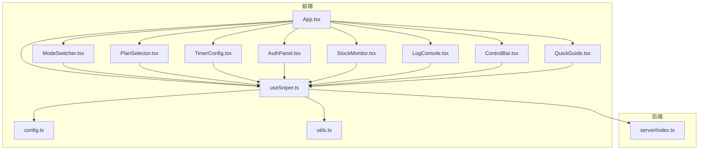
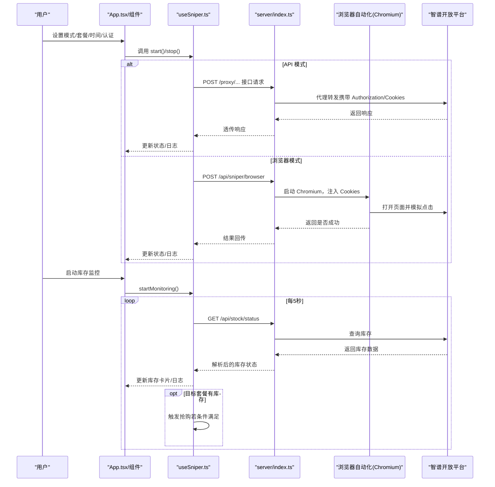
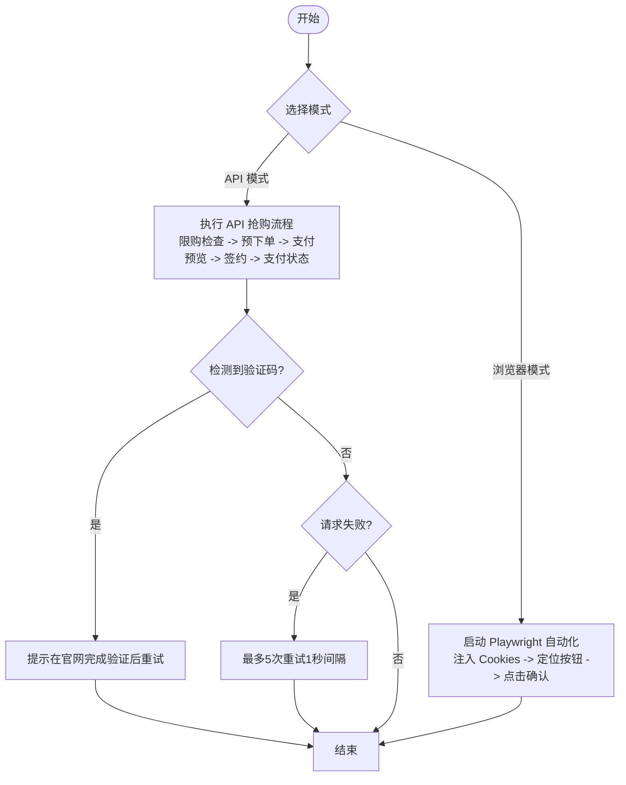
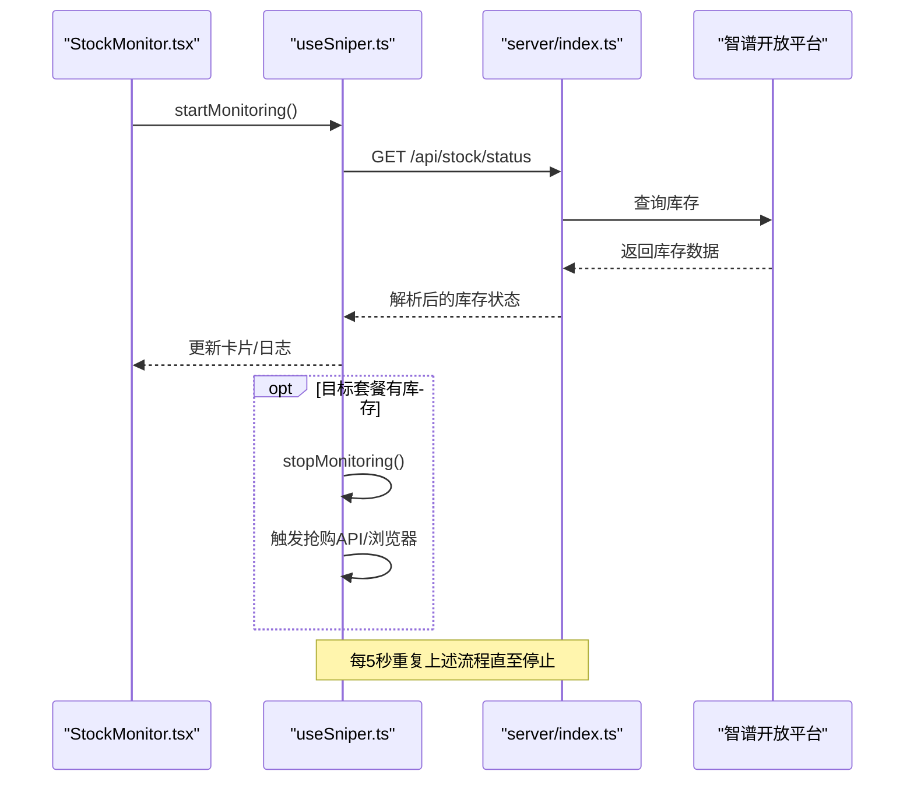
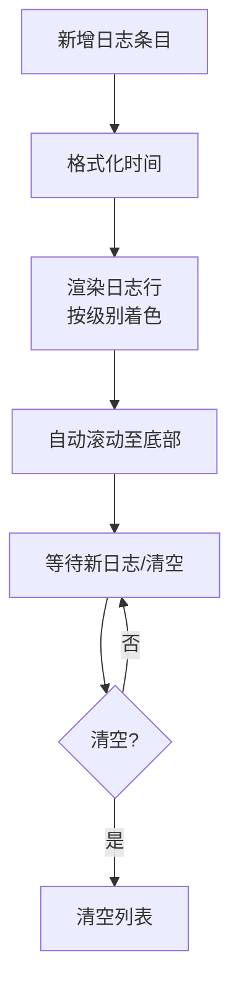
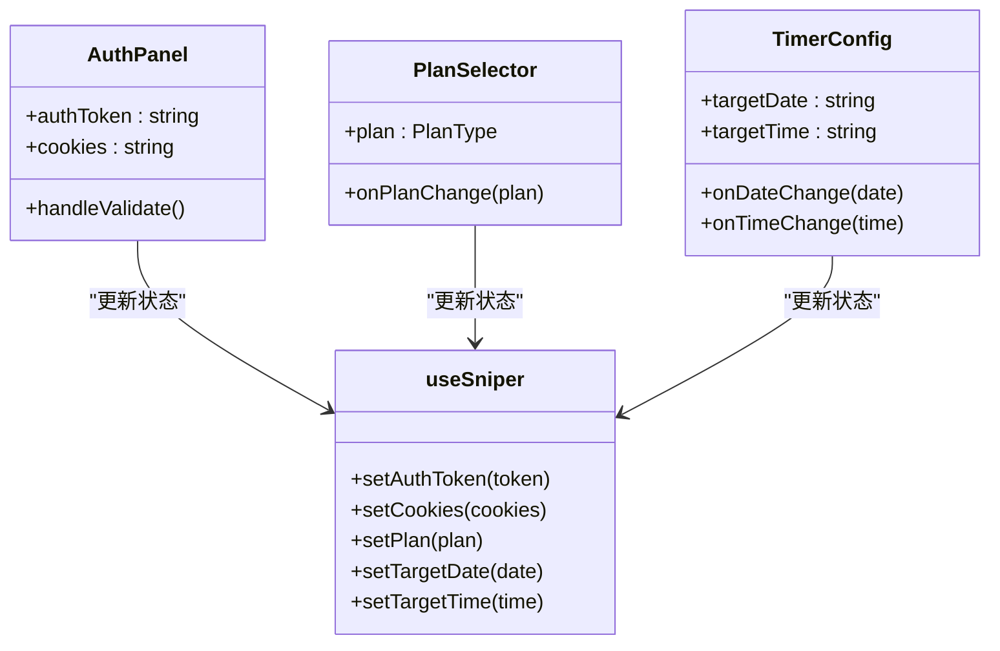
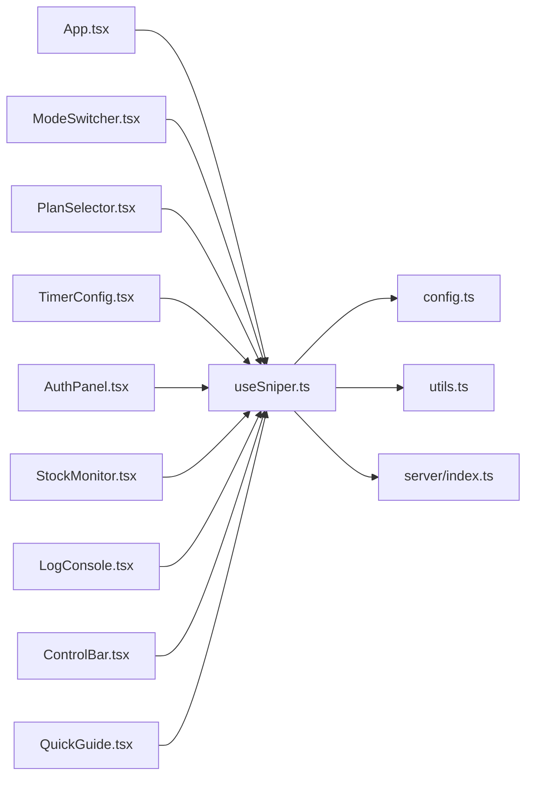

# 核心功能特性

<cite>
**本文引用的文件**
- [src/App.tsx](file://src/App.tsx)
- [src/hooks/useSniper.ts](file://src/hooks/useSniper.ts)
- [src/lib/config.ts](file://src/lib/config.ts)
- [src/lib/utils.ts](file://src/lib/utils.ts)
- [src/components/ModeSwitcher.tsx](file://src/components/ModeSwitcher.tsx)
- [src/components/PlanSelector.tsx](file://src/components/PlanSelector.tsx)
- [src/components/TimerConfig.tsx](file://src/components/TimerConfig.tsx)
- [src/components/AuthPanel.tsx](file://src/components/AuthPanel.tsx)
- [src/components/StockMonitor.tsx](file://src/components/StockMonitor.tsx)
- [src/components/LogConsole.tsx](file://src/components/LogConsole.tsx)
- [src/components/ControlBar.tsx](file://src/components/ControlBar.tsx)
- [src/components/QuickGuide.tsx](file://src/components/QuickGuide.tsx)
- [server/index.ts](file://server/index.ts)
</cite>

## 目录
1. [简介](#简介)
2. [项目结构](#项目结构)
3. [核心组件](#核心组件)
4. [架构总览](#架构总览)
5. [详细组件分析](#详细组件分析)
6. [依赖关系分析](#依赖关系分析)
7. [性能考量](#性能考量)
8. [故障排查指南](#故障排查指南)
9. [结论](#结论)

## 简介
本文件聚焦 GLM Sniper 的核心功能特性，围绕“双模式抢购系统（API 模式与浏览器模式）”、“智能库存监控机制”、“实时日志系统”以及“用户认证管理、套餐选择、时间配置”等辅助功能展开，提供面向开发者的实现原理说明与使用场景价值阐述，并通过“代码片段路径”指引定位到具体实现位置。

## 项目结构
- 前端采用 React + TypeScript + Vite 架构，核心逻辑集中在自定义 Hook 中，UI 组件按功能拆分，便于复用与维护。
- 后端使用 Express 提供代理与自动化服务，负责绕过 CORS、浏览器自动化、库存查询与抢购流程的后端支持。
- 配置与工具函数集中于 lib 目录，统一类型定义、套餐映射、产品 ID、日志格式化与时间计算等。

图表来源
- [src/App.tsx:12-194](file://src/App.tsx#L12-L194)
- [src/hooks/useSniper.ts:46-406](file://src/hooks/useSniper.ts#L46-L406)
- [src/lib/config.ts:6-104](file://src/lib/config.ts#L6-L104)
- [src/lib/utils.ts:1-51](file://src/lib/utils.ts#L1-L51)
- [server/index.ts:1-370](file://server/index.ts#L1-L370)

章节来源
- [src/App.tsx:12-194](file://src/App.tsx#L12-L194)
- [src/hooks/useSniper.ts:46-406](file://src/hooks/useSniper.ts#L46-L406)
- [server/index.ts:1-370](file://server/index.ts#L1-L370)

## 核心组件
- 双模式抢购系统
  - API 模式：通过代理直连智谱开放平台接口，完成限购校验、预下单、支付预览、签约与支付状态检查。
  - 浏览器模式：由后端使用 Playwright 自动化打开页面，在目标时刻自动点击订阅与支付确认。
- 智能库存监控：定时轮询库存状态，解析可用性与下次补货时间；当目标套餐有库存且满足条件时自动触发抢购。
- 实时日志系统：统一日志条目结构，按级别渲染，自动滚动至最新日志，支持清空。
- 用户认证管理：支持 Bearer Token 与 Cookies，提供认证有效性验证入口。
- 套餐选择与时间配置：直观切换套餐与设置目标日期/时间，倒计时可视化展示。
- 控制面板：统一的状态指示与启停控制，配合引导说明提升易用性。

章节来源
- [src/hooks/useSniper.ts:76-248](file://src/hooks/useSniper.ts#L76-L248)
- [src/hooks/useSniper.ts:318-372](file://src/hooks/useSniper.ts#L318-L372)
- [src/components/LogConsole.tsx:17-77](file://src/components/LogConsole.tsx#L17-L77)
- [src/components/AuthPanel.tsx:14-119](file://src/components/AuthPanel.tsx#L14-L119)
- [src/components/PlanSelector.tsx:11-60](file://src/components/PlanSelector.tsx#L11-L60)
- [src/components/TimerConfig.tsx:13-98](file://src/components/TimerConfig.tsx#L13-L98)
- [src/components/ControlBar.tsx:11-75](file://src/components/ControlBar.tsx#L11-L75)
- [src/components/QuickGuide.tsx:8-55](file://src/components/QuickGuide.tsx#L8-L55)

## 架构总览
下图展示了从前端到后端的关键交互路径，涵盖两种模式的执行链路与库存监控的触发机制。

图表来源
- [src/hooks/useSniper.ts:250-293](file://src/hooks/useSniper.ts#L250-L293)
- [src/hooks/useSniper.ts:354-372](file://src/hooks/useSniper.ts#L354-L372)
- [server/index.ts:42-159](file://server/index.ts#L42-L159)
- [server/index.ts:252-355](file://server/index.ts#L252-L355)

## 详细组件分析

### 双模式抢购系统（API 模式与浏览器模式）
- API 模式工作原理
  - 通过代理接口访问智谱开放平台，依次执行限购检查、预下单、支付预览、签约与支付状态检查。
  - 对验证码拦截进行识别与提示，必要时建议用户在官网完成验证后再重试。
  - 内置最多 5 次重试与 1 秒间隔，补偿网络抖动。
- 浏览器模式工作原理
  - 后端启动 Chromium，注入用户提供的 Cookies，打开 GLM Coding 页面。
  - 在目标时刻前 2 秒刷新页面，随后尝试多种选择器定位“订阅/确认”按钮并自动点击。
  - 返回是否进入成功页面的判定结果。
- 适用场景
  - API 模式：适合稳定网络与较少验证码干扰的环境，自动化程度高。
  - 浏览器模式：适合验证码复杂或需人工干预的场景，具备更强的页面适配能力。

图表来源
- [src/hooks/useSniper.ts:110-248](file://src/hooks/useSniper.ts#L110-L248)
- [src/hooks/useSniper.ts:76-106](file://src/hooks/useSniper.ts#L76-L106)
- [server/index.ts:42-159](file://server/index.ts#L42-L159)

章节来源
- [src/hooks/useSniper.ts:76-248](file://src/hooks/useSniper.ts#L76-L248)
- [server/index.ts:42-159](file://server/index.ts#L42-L159)

### 智能库存监控机制
- 轮询策略
  - 启动监控后立即查询一次，随后每 5 秒轮询一次库存状态。
  - 当目标套餐处于“有库存”且满足前置条件（如已配置认证），自动停止监控并触发抢购。
- 状态更新与自动触发
  - 解析库存数据中的可用性与下次补货时间，更新 UI 卡片与日志。
  - 在 10:00 前后窗口期对库存消息进行动态提示，增强用户体验。
- 代码实现要点
  - 使用定时器与中止标志避免重复轮询与内存泄漏。
  - 通过统一的日志接口输出每次查询结果与触发行为。

图表来源
- [src/hooks/useSniper.ts:318-372](file://src/hooks/useSniper.ts#L318-L372)
- [src/components/StockMonitor.tsx:27-139](file://src/components/StockMonitor.tsx#L27-L139)
- [server/index.ts:252-355](file://server/index.ts#L252-L355)

章节来源
- [src/hooks/useSniper.ts:318-372](file://src/hooks/useSniper.ts#L318-L372)
- [src/components/StockMonitor.tsx:27-139](file://src/components/StockMonitor.tsx#L27-L139)
- [server/index.ts:252-355](file://server/index.ts#L252-L355)

### 实时日志系统
- 日志记录与格式化
  - 统一日志条目结构，包含时间戳、级别与消息。
  - 格式化函数将时间转换为本地格式字符串，便于阅读。
- 显示机制
  - 每新增一条日志自动滚动到底部，保证最新日志可见。
  - 支持清空日志，便于调试与重新开始。
- 使用场景
  - 抢购全流程追踪、错误定位、验证码拦截提示与成功/失败状态反馈。

图表来源
- [src/lib/utils.ts:20-44](file://src/lib/utils.ts#L20-L44)
- [src/components/LogConsole.tsx:17-77](file://src/components/LogConsole.tsx#L17-L77)

章节来源
- [src/lib/utils.ts:20-44](file://src/lib/utils.ts#L20-L44)
- [src/components/LogConsole.tsx:17-77](file://src/components/LogConsole.tsx#L17-L77)

### 用户认证管理、套餐选择、时间配置
- 认证管理
  - 支持 Bearer Token 与 Cookies 两种认证方式。
  - 提供“验证 Token”按钮，调用后端代理接口验证用户有效性并输出日志。
- 套餐选择
  - 支持 Lite/Pro/Max 三档套餐，展示价格与徽标，便于快速切换。
- 时间配置
  - 设置目标日期与时间，倒计时实时更新，超过目标时间则提示“已过目标时间”。

图表来源
- [src/components/AuthPanel.tsx:14-119](file://src/components/AuthPanel.tsx#L14-L119)
- [src/components/PlanSelector.tsx:11-60](file://src/components/PlanSelector.tsx#L11-L60)
- [src/components/TimerConfig.tsx:13-98](file://src/components/TimerConfig.tsx#L13-L98)
- [src/hooks/useSniper.ts:46-67](file://src/hooks/useSniper.ts#L46-L67)

章节来源
- [src/components/AuthPanel.tsx:14-119](file://src/components/AuthPanel.tsx#L14-L119)
- [src/components/PlanSelector.tsx:11-60](file://src/components/PlanSelector.tsx#L11-L60)
- [src/components/TimerConfig.tsx:13-98](file://src/components/TimerConfig.tsx#L13-L98)
- [src/hooks/useSniper.ts:46-67](file://src/hooks/useSniper.ts#L46-L67)

### 控制面板与快速指南
- 控制面板
  - 展示当前状态（就绪/倒计时/抢购中/成功/出错），提供启动/停止按钮。
- 快速指南
  - 针对两种模式提供操作步骤与注意事项，包括验证码处理建议与最佳实践。

章节来源
- [src/components/ControlBar.tsx:11-75](file://src/components/ControlBar.tsx#L11-L75)
- [src/components/QuickGuide.tsx:8-55](file://src/components/QuickGuide.tsx#L8-L55)

## 依赖关系分析
- 组件耦合
  - App 作为容器，聚合各功能组件并通过 useSniper 提供的状态与方法驱动 UI。
  - useSniper 作为核心状态机，封装两种模式的执行逻辑、库存监控与日志管理。
- 外部依赖
  - 后端 server/index.ts 提供代理、自动化与库存查询服务。
  - 智谱开放平台接口用于真实业务流程与库存状态查询。

图表来源
- [src/App.tsx:12-194](file://src/App.tsx#L12-L194)
- [src/hooks/useSniper.ts:46-406](file://src/hooks/useSniper.ts#L46-L406)
- [server/index.ts:1-370](file://server/index.ts#L1-L370)

章节来源
- [src/App.tsx:12-194](file://src/App.tsx#L12-L194)
- [src/hooks/useSniper.ts:46-406](file://src/hooks/useSniper.ts#L46-L406)
- [server/index.ts:1-370](file://server/index.ts#L1-L370)

## 性能考量
- 轮询频率与资源占用
  - 库存监控每 5 秒一次，建议在不需要时及时停止，避免不必要的网络与 CPU 开销。
- 网络与延迟补偿
  - API 模式在目标时刻前 2 秒提前发起请求，减少网络延迟影响。
- 自动化稳定性
  - 浏览器模式对页面结构变化采用多选择器容错，但页面改版仍可能导致定位失败，建议定期验证。

## 故障排查指南
- 后端服务未启动
  - 现象：浏览器模式报连接失败或库存查询异常。
  - 处理：确保后端服务已启动（端口 3100），查看日志输出。
- 认证无效
  - 现象：API 模式下单失败或验证码拦截。
  - 处理：使用“验证 Token”按钮确认有效性；若出现验证码，按提示在官网完成验证后重试。
- 库存监控无响应
  - 现象：库存卡片长时间显示“未查询”或无更新。
  - 处理：检查后端健康状态与网络连通性；确认库存查询接口返回格式。
- 浏览器自动化失败
  - 现象：页面结构变化导致按钮无法点击。
  - 处理：手动在浏览器中完成订阅与支付流程，观察页面元素变化并调整选择器策略。

章节来源
- [src/hooks/useSniper.ts:101-106](file://src/hooks/useSniper.ts#L101-L106)
- [src/hooks/useSniper.ts:157-167](file://src/hooks/useSniper.ts#L157-L167)
- [src/components/AuthPanel.tsx:18-41](file://src/components/AuthPanel.tsx#L18-L41)
- [server/index.ts:357-369](file://server/index.ts#L357-L369)

## 结论
GLM Sniper 通过“双模式抢购系统”覆盖不同网络与验证码场景，“智能库存监控机制”降低等待成本并提升成功率，“实时日志系统”提供清晰可观测性，辅以认证管理、套餐选择与时间配置等实用功能，形成完整的自动化抢购解决方案。开发者可基于本文档的“代码片段路径”快速定位实现细节，结合故障排查指南高效定位问题并优化使用体验。