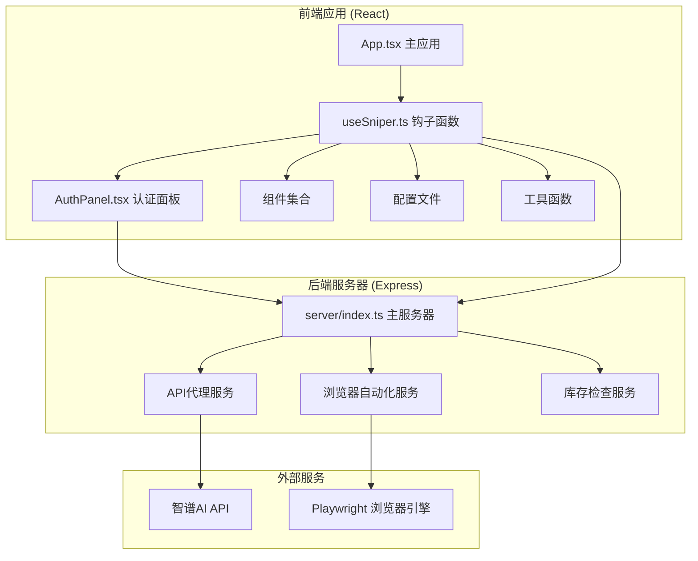
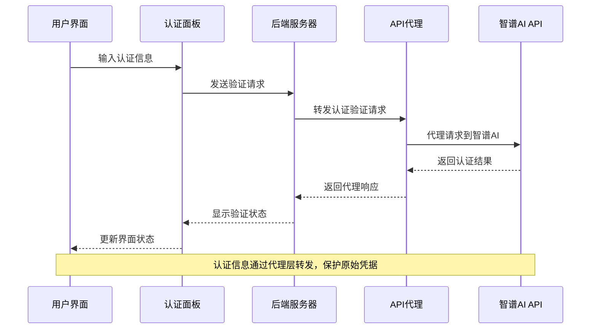
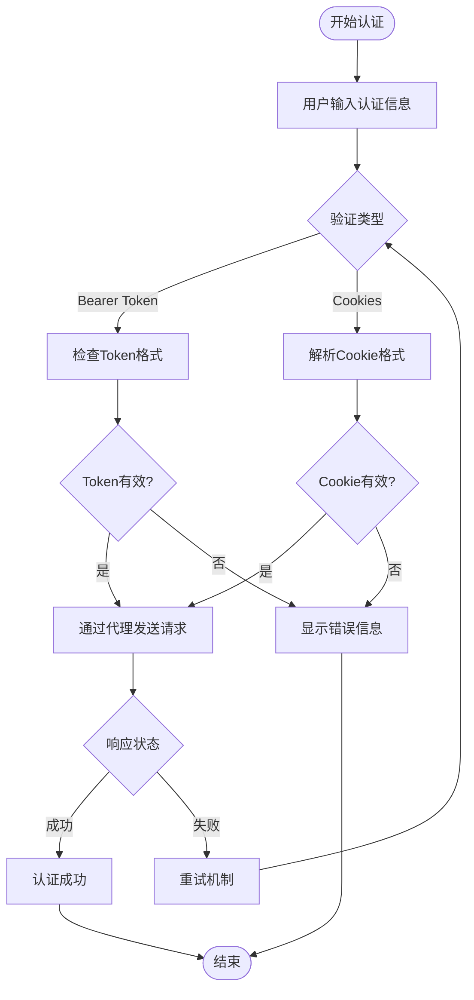
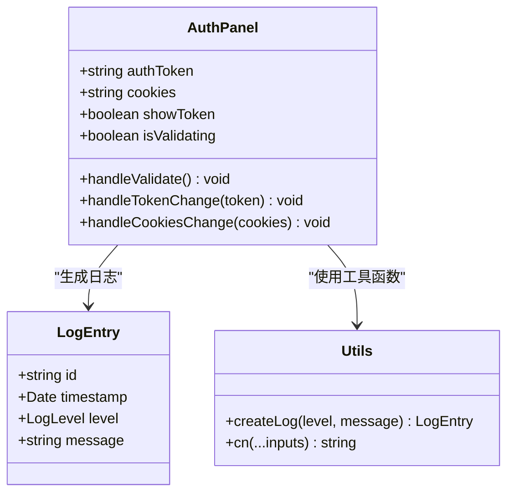
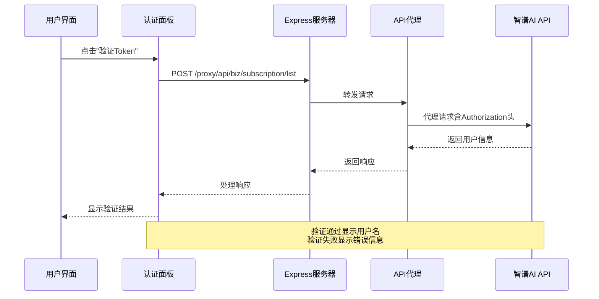
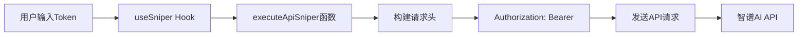
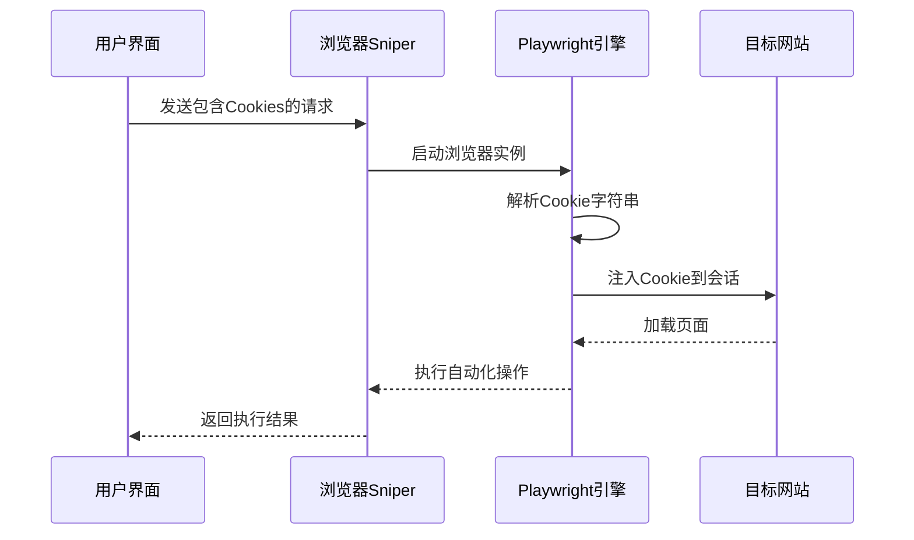
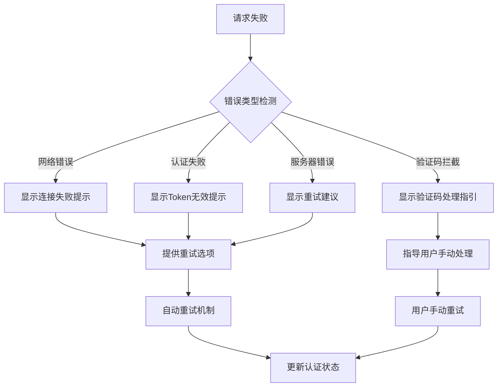
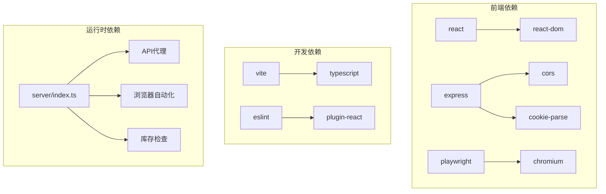
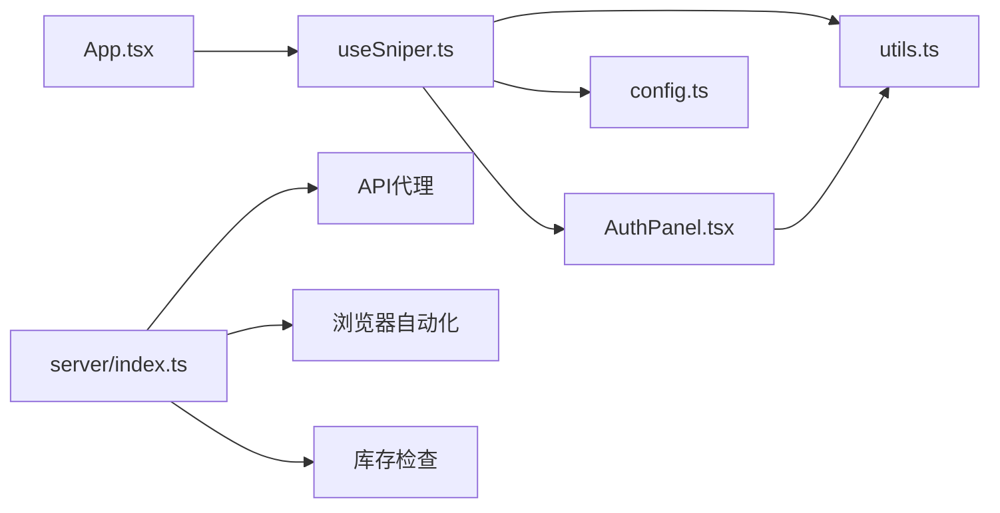

# 用户认证管理

<cite>
**本文档引用的文件**
- [src/App.tsx](file://src/App.tsx)
- [src/hooks/useSniper.ts](file://src/hooks/useSniper.ts)
- [src/components/AuthPanel.tsx](file://src/components/AuthPanel.tsx)
- [src/lib/config.ts](file://src/lib/config.ts)
- [src/lib/utils.ts](file://src/lib/utils.ts)
- [server/index.ts](file://server/index.ts)
- [package.json](file://package.json)
</cite>

## 目录
1. [简介](#简介)
2. [项目结构](#项目结构)
3. [核心组件](#核心组件)
4. [架构概览](#架构概览)
5. [详细组件分析](#详细组件分析)
6. [依赖关系分析](#依赖关系分析)
7. [性能考虑](#性能考虑)
8. [故障排除指南](#故障排除指南)
9. [结论](#结论)

## 简介

GLM Sniper是一个用于智谱AI GLM Coding计划抢购的自动化工具。该系统实现了完整的用户认证管理机制，支持两种认证方式：Bearer Token认证和Cookie认证。系统通过前端React应用与后端Express服务器的协作，提供了安全、高效的认证状态管理功能。

## 项目结构

GLM Sniper采用前后端分离的架构设计，主要分为以下模块：

**图表来源**
- [src/App.tsx:12-194](file://src/App.tsx#L12-L194)
- [src/hooks/useSniper.ts:46-406](file://src/hooks/useSniper.ts#L46-L406)
- [server/index.ts:1-370](file://server/index.ts#L1-L370)

**章节来源**
- [src/App.tsx:1-197](file://src/App.tsx#L1-L197)
- [src/hooks/useSniper.ts:1-407](file://src/hooks/useSniper.ts#L1-L407)
- [server/index.ts:1-370](file://server/index.ts#L1-L370)

## 核心组件

### 认证状态管理

系统通过React Hook实现了集中式的认证状态管理，包括：

- **Bearer Token管理**：支持Token的输入、显示/隐藏切换和验证
- **Cookie管理**：支持浏览器Cookie的输入和解析
- **认证状态验证**：实时验证Token的有效性
- **错误处理**：完善的错误捕获和用户提示机制

### 认证模式支持

系统支持两种认证模式：

1. **API模式**：直接通过HTTP请求访问智谱AI API
2. **浏览器模式**：使用Playwright自动化浏览器进行抢购

**章节来源**
- [src/components/AuthPanel.tsx:14-119](file://src/components/AuthPanel.tsx#L14-L119)
- [src/hooks/useSniper.ts:51-66](file://src/hooks/useSniper.ts#L51-L66)

## 架构概览

GLM Sniper的认证系统采用分层架构设计，确保了安全性、可维护性和扩展性：

**图表来源**
- [src/components/AuthPanel.tsx:18-41](file://src/components/AuthPanel.tsx#L18-L41)
- [server/index.ts:12-40](file://server/index.ts#L12-L40)

### 认证流程

系统实现了完整的认证生命周期管理：

**图表来源**
- [src/components/AuthPanel.tsx:18-41](file://src/components/AuthPanel.tsx#L18-L41)
- [src/hooks/useSniper.ts:115-177](file://src/hooks/useSniper.ts#L115-L177)

**章节来源**
- [src/hooks/useSniper.ts:111-248](file://src/hooks/useSniper.ts#L111-L248)
- [server/index.ts:12-40](file://server/index.ts#L12-L40)

## 详细组件分析

### 认证面板组件

认证面板是用户交互的核心界面，提供了完整的认证管理功能：

#### 组件架构

**图表来源**
- [src/components/AuthPanel.tsx:5-12](file://src/components/AuthPanel.tsx#L5-L12)
- [src/lib/utils.ts:20-27](file://src/lib/utils.ts#L20-L27)

#### 认证信息输入

组件支持两种认证信息的输入方式：

1. **Bearer Token输入**：
   - 密码输入框，支持显示/隐藏切换
   - 实时验证功能
   - 格式化显示用户名信息

2. **Cookies输入**：
   - 多行文本区域
   - 支持从浏览器复制粘贴
   - 自动解析格式

**章节来源**
- [src/components/AuthPanel.tsx:54-95](file://src/components/AuthPanel.tsx#L54-L95)

### 认证状态验证机制

系统实现了多层次的认证状态验证机制：

#### Token验证流程

**图表来源**
- [src/components/AuthPanel.tsx:18-41](file://src/components/AuthPanel.tsx#L18-L41)
- [server/index.ts:12-40](file://server/index.ts#L12-L40)

#### 验证结果处理

验证过程包含以下关键步骤：

1. **请求构建**：自动添加`Authorization: Bearer <token>`头部
2. **代理转发**：通过本地代理服务器转发请求
3. **响应处理**：解析响应并更新UI状态
4. **错误处理**：捕获网络错误和认证失败情况

**章节来源**
- [src/components/AuthPanel.tsx:22-41](file://src/components/AuthPanel.tsx#L22-L41)
- [server/index.ts:19-27](file://server/index.ts#L19-L27)

### 认证信息在不同模式中的使用

#### API模式中的认证

在API模式下，认证信息通过HTTP头部传递：

**图表来源**
- [src/hooks/useSniper.ts:121-124](file://src/hooks/useSniper.ts#L121-L124)
- [src/hooks/useSniper.ts:111-119](file://src/hooks/useSniper.ts#L111-L119)

#### 浏览器模式中的Cookie管理

在浏览器模式下，系统通过Playwright自动化引擎注入Cookie：

**图表来源**
- [src/hooks/useSniper.ts:77-106](file://src/hooks/useSniper.ts#L77-L106)
- [server/index.ts:51-61](file://server/index.ts#L51-L61)

**章节来源**
- [src/hooks/useSniper.ts:77-106](file://src/hooks/useSniper.ts#L77-L106)
- [server/index.ts:43-159](file://server/index.ts#L43-L159)

### 认证失败处理机制

系统实现了完善的认证失败处理机制：

#### 错误检测与分类

**图表来源**
- [src/hooks/useSniper.ts:157-177](file://src/hooks/useSniper.ts#L157-L177)
- [src/hooks/useSniper.ts:101-105](file://src/hooks/useSniper.ts#L101-L105)

#### 重试逻辑

系统实现了智能的重试机制：

1. **最大重试次数**：限制重试次数防止无限循环
2. **指数退避**：每次重试增加等待时间
3. **条件判断**：仅在特定错误情况下触发重试
4. **用户中断**：支持用户手动停止重试

**章节来源**
- [src/hooks/useSniper.ts:169-177](file://src/hooks/useSniper.ts#L169-L177)
- [src/hooks/useSniper.ts:295-303](file://src/hooks/useSniper.ts#L295-L303)

## 依赖关系分析

### 外部依赖

系统的关键依赖关系如下：

**图表来源**
- [package.json:14-26](file://package.json#L14-L26)
- [server/index.ts:1-4](file://server/index.ts#L1-L4)

### 内部模块依赖

**图表来源**
- [src/App.tsx:1-10](file://src/App.tsx#L1-L10)
- [src/hooks/useSniper.ts:1-9](file://src/hooks/useSniper.ts#L1-L9)

**章节来源**
- [package.json:1-48](file://package.json#L1-L48)
- [src/App.tsx:1-10](file://src/App.tsx#L1-L10)

## 性能考虑

### 认证性能优化

系统在认证性能方面采用了多项优化策略：

1. **代理缓存**：通过本地代理减少跨域请求开销
2. **异步处理**：所有认证操作都是异步执行
3. **防抖机制**：避免频繁的重复验证请求
4. **资源清理**：及时清理浏览器实例和网络连接

### 安全性能平衡

系统在保证安全性的同时优化了性能表现：

- **最小权限原则**：仅转发必要的认证信息
- **请求压缩**：减少传输数据量
- **连接复用**：复用代理连接提高效率

## 故障排除指南

### 常见认证问题

#### Token验证失败

**症状**：点击"验证Token"后显示认证失效

**解决方案**：
1. 检查Token格式是否正确
2. 确认Token未过期
3. 验证网络连接正常
4. 确保本地代理服务运行正常

#### 浏览器模式Cookie注入失败

**症状**：浏览器自动化无法正常工作

**解决方案**：
1. 检查Cookie格式是否正确
2. 确认域名匹配（.bigmodel.cn）
3. 验证Cookie有效期
4. 确保Playwright浏览器引擎正常

#### 代理服务连接失败

**症状**：无法连接到本地代理服务

**解决方案**：
1. 检查本地服务器是否启动
2. 验证端口3100是否被占用
3. 检查防火墙设置
4. 重启本地服务器

**章节来源**
- [src/components/AuthPanel.tsx:34-38](file://src/components/AuthPanel.tsx#L34-L38)
- [src/hooks/useSniper.ts:101-105](file://src/hooks/useSniper.ts#L101-L105)

### 调试技巧

1. **查看日志输出**：通过控制台查看详细的错误信息
2. **网络监控**：使用浏览器开发者工具监控请求响应
3. **服务器状态**：检查本地服务器的健康状态
4. **认证测试**：使用curl命令单独测试认证接口

## 结论

GLM Sniper的用户认证管理系统实现了以下关键特性：

### 安全性保障

- **代理层保护**：所有认证信息通过本地代理转发，避免直接暴露
- **最小权限原则**：仅转发必要的认证头部和Cookie
- **输入验证**：对用户输入进行格式验证和清理
- **错误隔离**：认证失败不影响其他系统功能

### 用户体验优化

- **直观界面**：简洁明了的认证面板设计
- **实时反馈**：即时显示认证状态和结果
- **智能重试**：自动处理临时性错误
- **详细日志**：完整的操作记录和错误追踪

### 可扩展性设计

- **模块化架构**：清晰的组件分离和职责划分
- **配置驱动**：通过配置文件管理API端点和参数
- **错误处理**：完善的异常处理和恢复机制
- **监控集成**：内置的日志系统便于问题诊断

该认证系统为GLM Sniper提供了可靠、安全、易用的用户认证基础，支持多种使用场景和认证方式，满足了抢购工具对高可用性和安全性的严格要求。