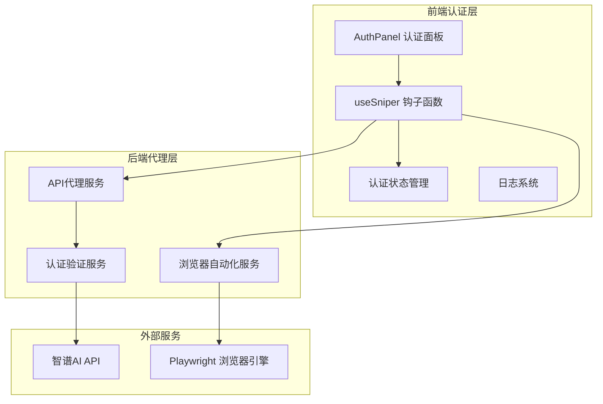
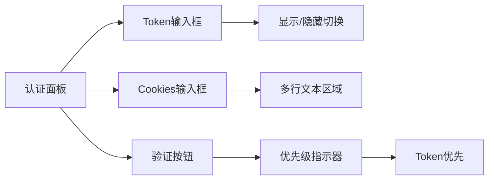
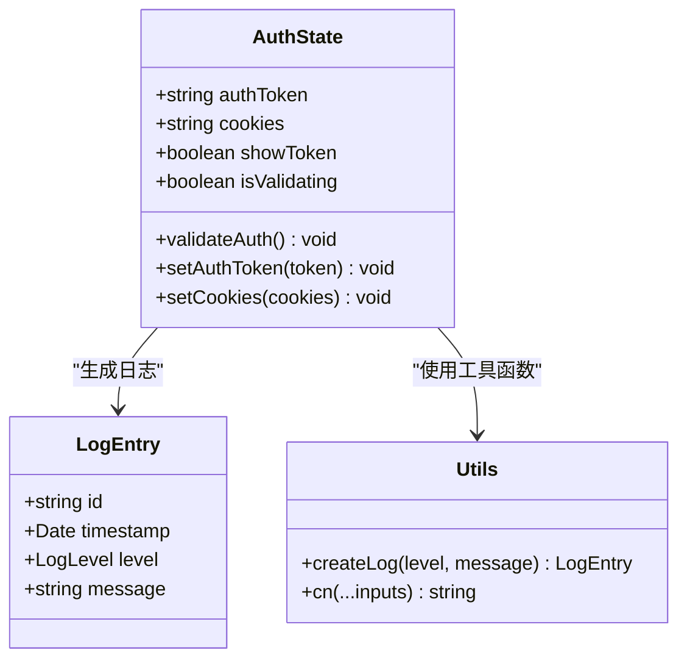
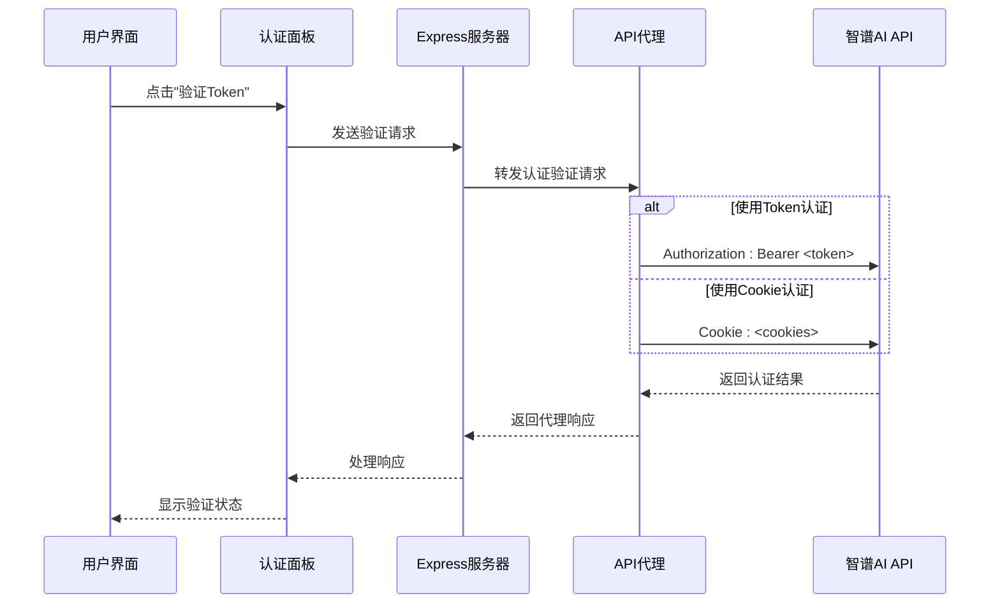
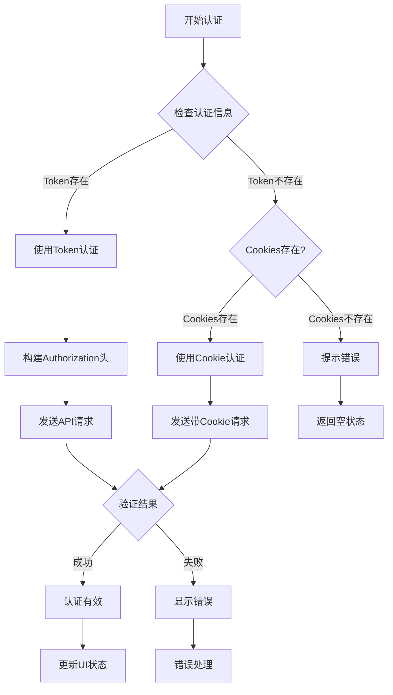
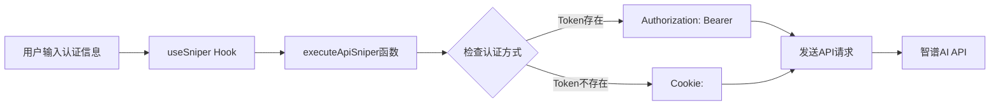
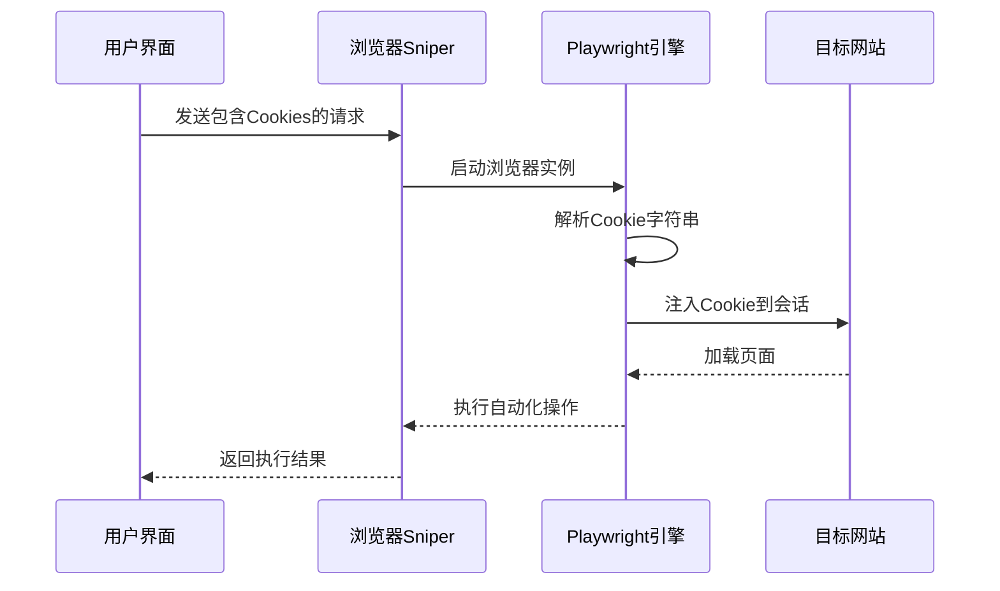
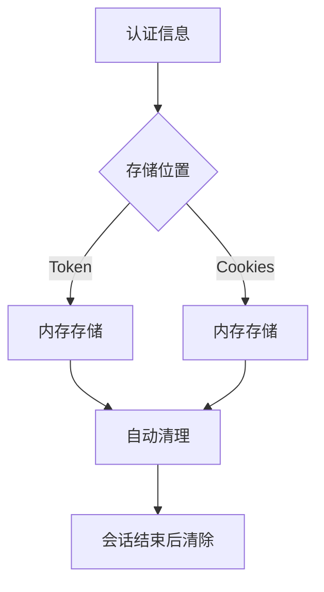

# 用户认证管理

<cite>
**本文档引用的文件**
- [src/App.tsx](file://src/App.tsx)
- [src/hooks/useSniper.ts](file://src/hooks/useSniper.ts)
- [src/components/AuthPanel.tsx](file://src/components/AuthPanel.tsx)
- [src/lib/config.ts](file://src/lib/config.ts)
- [src/lib/utils.ts](file://src/lib/utils.ts)
- [server/index.ts](file://server/index.ts)
- [package.json](file://package.json)
</cite>

## 更新摘要
**变更内容**
- 新增双认证模式支持：Bearer Token和Cookie认证并存
- 实现认证优先级逻辑：Token优先于Cookie
- 增强认证状态独立验证机制
- 完善认证失败处理和重试逻辑
- 优化浏览器自动化中的Cookie注入流程

## 目录
1. [简介](#简介)
2. [认证系统架构](#认证系统架构)
3. [双认证模式详解](#双认证模式详解)
4. [认证状态管理](#认证状态管理)
5. [认证优先级与验证机制](#认证优先级与验证机制)
6. [不同模式下的认证使用](#不同模式下的认证使用)
7. [安全考虑与最佳实践](#安全考虑与最佳实践)
8. [故障排除指南](#故障排除指南)
9. [总结](#总结)

## 简介

GLM Sniper的用户认证管理系统实现了先进的双认证机制，支持Bearer Token和Cookie两种认证方式，并具备智能的优先级逻辑和独立验证能力。系统通过前端React应用与后端Express服务器的协作，提供了安全、高效且灵活的认证状态管理功能。

**更新** 系统现已支持双重认证模式，用户可以选择使用Bearer Token或Cookie进行身份验证，系统会根据配置自动选择最优的认证方式。

## 认证系统架构

GLM Sniper采用分层架构设计，实现了完整的认证生命周期管理：

**图表来源**
- [src/components/AuthPanel.tsx:15-137](file://src/components/AuthPanel.tsx#L15-L137)
- [src/hooks/useSniper.ts:51-473](file://src/hooks/useSniper.ts#L51-L473)
- [server/index.ts:12-40](file://server/index.ts#L12-L40)

## 双认证模式详解

### 认证方式对比

系统支持两种独立的认证方式：

#### Bearer Token认证
- **特点**：基于Authorization头部的Bearer Token
- **优势**：安全性高，易于管理，支持API模式
- **适用场景**：API模式抢购、自动化脚本

#### Cookie认证
- **特点**：基于浏览器会话的Cookie字符串
- **优势**：模拟真实用户行为，支持浏览器模式
- **适用场景**：浏览器自动化抢购、验证码处理

### 认证配置界面

**图表来源**
- [src/components/AuthPanel.tsx:67-132](file://src/components/AuthPanel.tsx#L67-L132)

**章节来源**
- [src/components/AuthPanel.tsx:19-59](file://src/components/AuthPanel.tsx#L19-L59)
- [src/hooks/useSniper.ts:121-139](file://src/hooks/useSniper.ts#L121-L139)

## 认证状态管理

### 状态数据结构

系统通过React Hook实现了完整的认证状态管理：

**图表来源**
- [src/components/AuthPanel.tsx:15-17](file://src/components/AuthPanel.tsx#L15-L17)
- [src/lib/utils.ts:20-27](file://src/lib/utils.ts#L20-L27)

### 认证状态验证流程

**图表来源**
- [src/components/AuthPanel.tsx:19-59](file://src/components/AuthPanel.tsx#L19-L59)
- [server/index.ts:12-40](file://server/index.ts#L12-L40)

**章节来源**
- [src/components/AuthPanel.tsx:19-59](file://src/components/AuthPanel.tsx#L19-L59)
- [server/index.ts:12-40](file://server/index.ts#L12-L40)

## 认证优先级与验证机制

### 优先级逻辑

系统实现了智能的认证优先级机制：

**图表来源**
- [src/components/AuthPanel.tsx:31-42](file://src/components/AuthPanel.tsx#L31-L42)
- [src/hooks/useSniper.ts:128-139](file://src/hooks/useSniper.ts#L128-L139)

### 独立验证机制

系统支持独立的认证验证功能：

1. **Token验证**：通过`/proxy/api/biz/subscription/list`接口验证Bearer Token
2. **Cookie验证**：通过相同的接口验证Cookie有效性
3. **实时反馈**：验证过程中提供详细的日志信息
4. **错误分类**：区分网络错误、认证失败、格式错误等不同类型

**章节来源**
- [src/components/AuthPanel.tsx:19-59](file://src/components/AuthPanel.tsx#L19-L59)
- [src/hooks/useSniper.ts:121-139](file://src/hooks/useSniper.ts#L121-L139)

## 不同模式下的认证使用

### API模式中的认证

在API模式下，系统通过HTTP头部传递认证信息：

**图表来源**
- [src/hooks/useSniper.ts:128-139](file://src/hooks/useSniper.ts#L128-L139)
- [src/hooks/useSniper.ts:117-294](file://src/hooks/useSniper.ts#L117-L294)

### 浏览器模式中的Cookie管理

在浏览器模式下，系统通过Playwright自动化引擎注入Cookie：

**图表来源**
- [src/hooks/useSniper.ts:83-112](file://src/hooks/useSniper.ts#L83-L112)
- [server/index.ts:43-159](file://server/index.ts#L43-L159)

**章节来源**
- [src/hooks/useSniper.ts:83-112](file://src/hooks/useSniper.ts#L83-L112)
- [server/index.ts:43-159](file://server/index.ts#L43-L159)

## 安全考虑与最佳实践

### 安全防护措施

系统实现了多层次的安全防护：

1. **代理层保护**：所有认证信息通过本地代理转发，避免直接暴露
2. **最小权限原则**：仅转发必要的认证头部和Cookie
3. **输入验证**：对用户输入进行格式验证和清理
4. **错误隔离**：认证失败不影响其他系统功能

### 认证信息存储策略

**图表来源**
- [src/hooks/useSniper.ts:61-62](file://src/hooks/useSniper.ts#L61-L62)

### 安全最佳实践

1. **Token管理**：定期更新Bearer Token，避免长期使用同一Token
2. **Cookie安全**：妥善保管Cookie，避免泄露给第三方
3. **网络传输**：确保本地代理服务的安全连接
4. **日志保护**：避免在日志中记录敏感认证信息

**章节来源**
- [src/components/AuthPanel.tsx:19-59](file://src/components/AuthPanel.tsx#L19-L59)
- [src/hooks/useSniper.ts:128-139](file://src/hooks/useSniper.ts#L128-L139)

## 故障排除指南

### 常见认证问题

#### Token验证失败

**症状**：点击"验证Token"后显示认证失效

**解决方案**：
1. 检查Token格式是否正确（必须以Bearer开头）
2. 确认Token未过期
3. 验证网络连接正常
4. 确保本地代理服务运行正常

#### 浏览器模式Cookie注入失败

**症状**：浏览器自动化无法正常工作

**解决方案**：
1. 检查Cookie格式是否正确（键值对格式）
2. 确认域名匹配（.bigmodel.cn）
3. 验证Cookie有效期
4. 确保Playwright浏览器引擎正常

#### 代理服务连接失败

**症状**：无法连接到本地代理服务

**解决方案**：
1. 检查本地服务器是否启动
2. 验证端口3100是否被占用
3. 检查防火墙设置
4. 重启本地服务器

### 调试技巧

1. **查看日志输出**：通过控制台查看详细的错误信息
2. **网络监控**：使用浏览器开发者工具监控请求响应
3. **服务器状态**：检查本地服务器的健康状态
4. **认证测试**：使用curl命令单独测试认证接口

**章节来源**
- [src/components/AuthPanel.tsx:24-28](file://src/components/AuthPanel.tsx#L24-L28)
- [src/hooks/useSniper.ts:157-177](file://src/hooks/useSniper.ts#L157-L177)

## 总结

GLM Sniper的用户认证管理系统实现了以下关键特性：

### 双重认证优势

- **灵活性**：支持Bearer Token和Cookie两种认证方式
- **智能优先级**：Token优先于Cookie的认证策略
- **独立验证**：每种认证方式都可以独立验证
- **无缝切换**：根据使用场景自动选择最优认证方式

### 安全性保障

- **代理层保护**：所有认证信息通过本地代理转发
- **最小权限原则**：仅转发必要的认证信息
- **输入验证**：对用户输入进行严格验证
- **错误隔离**：认证失败不影响系统其他功能

### 用户体验优化

- **直观界面**：简洁明了的认证面板设计
- **实时反馈**：即时显示认证状态和结果
- **智能重试**：自动处理临时性错误
- **详细日志**：完整的操作记录和错误追踪

### 可扩展性设计

- **模块化架构**：清晰的组件分离和职责划分
- **配置驱动**：通过配置文件管理认证参数
- **错误处理**：完善的异常处理和恢复机制
- **监控集成**：内置的日志系统便于问题诊断

该认证系统为GLM Sniper提供了可靠、安全、易用的用户认证基础，支持多种使用场景和认证方式，满足了抢购工具对高可用性和安全性的严格要求。通过双认证模式和智能优先级机制，系统为用户提供了更加灵活和强大的认证解决方案。