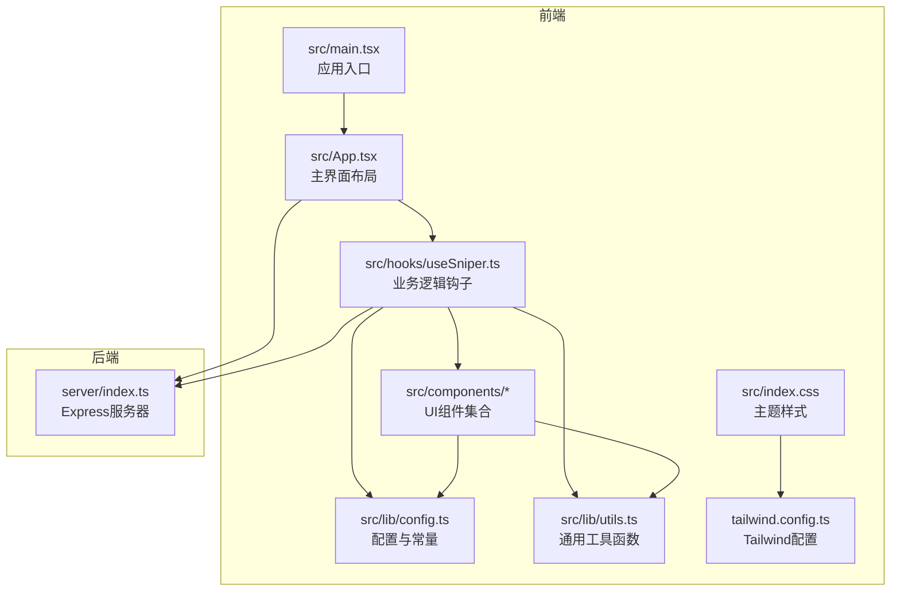
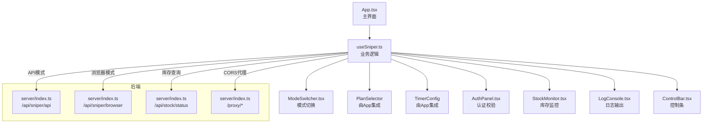
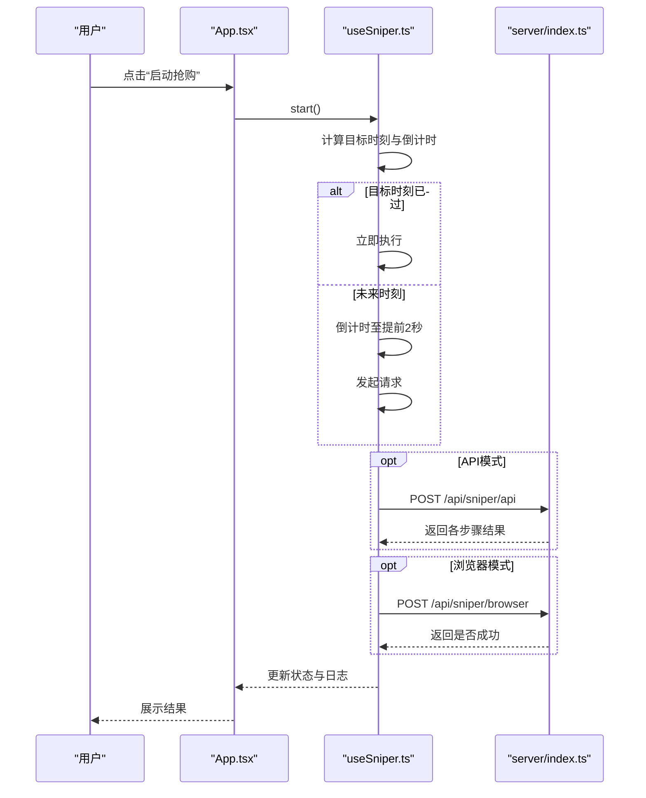
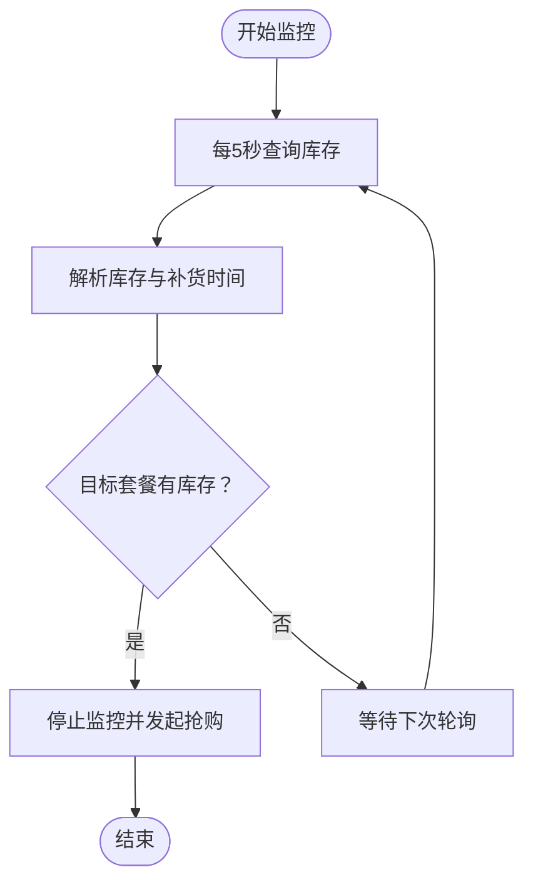
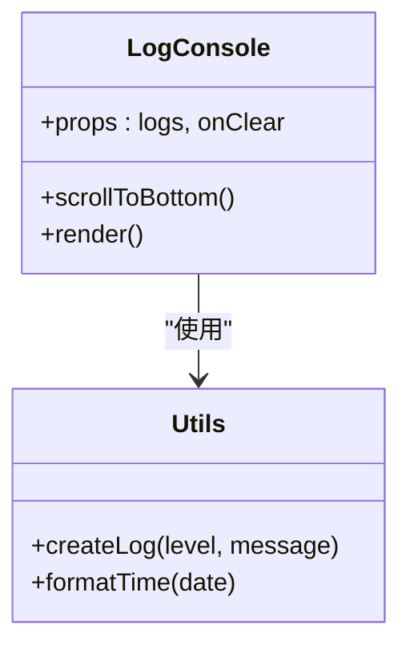
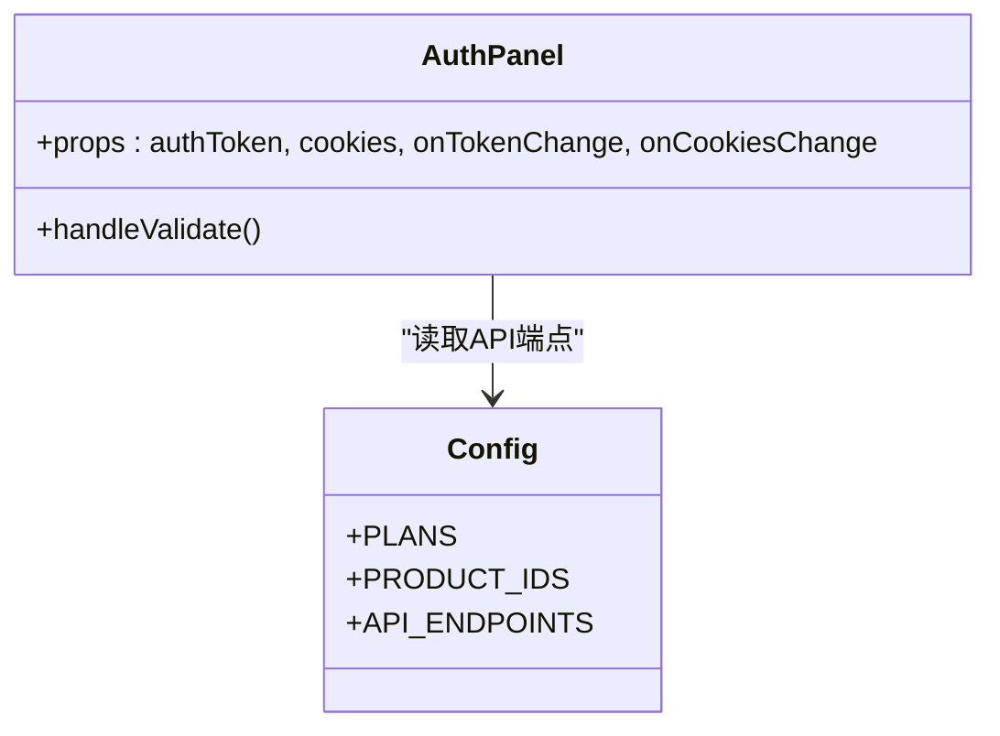
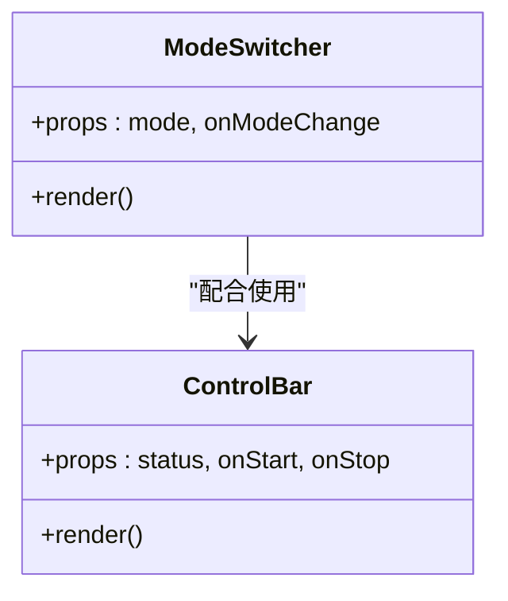
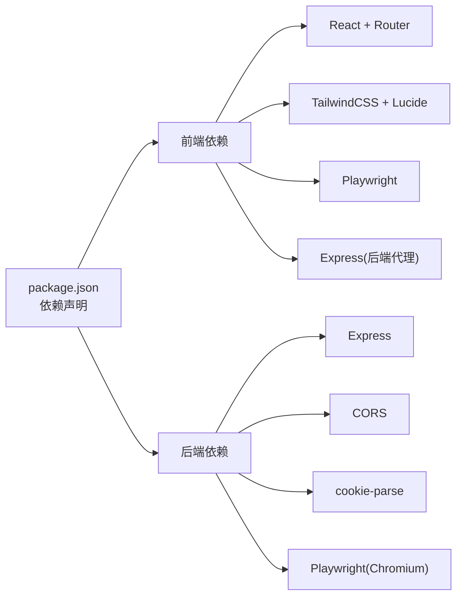

# 项目介绍

<cite>
**本文引用的文件**
- [README.md](file://README.md)
- [package.json](file://package.json)
- [src/main.tsx](file://src/main.tsx)
- [src/App.tsx](file://src/App.tsx)
- [src/hooks/useSniper.ts](file://src/hooks/useSniper.ts)
- [src/lib/config.ts](file://src/lib/config.ts)
- [src/lib/utils.ts](file://src/lib/utils.ts)
- [src/components/ModeSwitcher.tsx](file://src/components/ModeSwitcher.tsx)
- [src/components/StockMonitor.tsx](file://src/components/StockMonitor.tsx)
- [src/components/LogConsole.tsx](file://src/components/LogConsole.tsx)
- [src/components/ControlBar.tsx](file://src/components/ControlBar.tsx)
- [src/components/QuickGuide.tsx](file://src/components/QuickGuide.tsx)
- [src/components/AuthPanel.tsx](file://src/components/AuthPanel.tsx)
- [server/index.ts](file://server/index.ts)
- [src/index.css](file://src/index.css)
- [tailwind.config.ts](file://tailwind.config.ts)
</cite>

## 目录
1. [引言](#引言)
2. [项目结构](#项目结构)
3. [核心组件](#核心组件)
4. [架构总览](#架构总览)
5. [详细组件分析](#详细组件分析)
6. [依赖关系分析](#依赖关系分析)
7. [性能考虑](#性能考虑)
8. [故障排查指南](#故障排查指南)
9. [结论](#结论)
10. [附录](#附录)

## 引言
GLM Sniper 是一款专为智谱AI GLM Coding计划设计的智能抢购工具，旨在帮助用户在限时抢购中获得稳定与高效的优势。它通过“双模式抢购系统”（浏览器自动化模式与API高速模式）、“智能库存监控”以及“实时日志显示”等功能，降低用户参与抢购的技术门槛，并提升成功率。

- 核心价值
  - 降低参与门槛：无需手动频繁刷新页面或编写复杂脚本，即可在目标时刻自动发起抢购。
  - 提升成功率：通过倒计时补偿机制、自动重试与验证码识别提示，减少网络延迟与风控干扰带来的失败。
  - 增强可控性：提供可视化日志、库存监控与一键停止功能，便于用户掌握抢购过程。

- 目标用户
  - 初学者：希望以图形界面快速上手，无需编程基础也能参与抢购。
  - 进阶用户：追求高效率与稳定性，需要API直连模式与自动化能力。
  - 抢购爱好者：关注库存动态与补货节奏，需要持续监控与自动触发。

- 解决的实际问题
  - 限时抢购竞争激烈：通过提前倒计时与补偿机制，尽可能缩短从目标时刻到下单请求发出的时间差。
  - 验证码拦截：在日志中明确提示验证码拦截，并给出应对建议，避免长时间卡死。
  - 信息不透明：提供库存状态与补货时间提示，帮助用户把握最佳时机。

- 主要功能特性
  - 双模式抢购系统：浏览器自动化模式（基于Playwright）与API高速模式（直连智谱AI接口）。
  - 智能库存监控：定时轮询库存状态，目标套餐有货时自动触发抢购。
  - 实时日志显示：终端风格日志记录关键步骤与状态变化，支持清空与滚动跟随。
  - 快速指南与认证校验：提供分步操作指引与Token/Cookies有效性验证。

- 应用场景与使用价值
  - 场景：智谱AI限时特惠活动、季度/月度套餐补货等。
  - 价值：在高并发环境下提升成功率，减少人工值守成本，增强用户体验与可重复性。

## 项目结构
该项目采用前端React + TypeScript + Vite + TailwindCSS构建，后端使用Express + Playwright提供API代理与浏览器自动化能力。整体结构清晰，按功能模块划分组件与逻辑钩子，便于扩展与维护。

**图表来源**
- [src/main.tsx:1-11](file://src/main.tsx#L1-L11)
- [src/App.tsx:1-197](file://src/App.tsx#L1-L197)
- [src/hooks/useSniper.ts:1-407](file://src/hooks/useSniper.ts#L1-L407)
- [src/lib/config.ts:1-104](file://src/lib/config.ts#L1-L104)
- [src/lib/utils.ts:1-51](file://src/lib/utils.ts#L1-L51)
- [server/index.ts:1-370](file://server/index.ts#L1-L370)
- [src/index.css:1-132](file://src/index.css#L1-L132)
- [tailwind.config.ts:1-104](file://tailwind.config.ts#L1-L104)

**章节来源**
- [src/main.tsx:1-11](file://src/main.tsx#L1-L11)
- [src/App.tsx:12-197](file://src/App.tsx#L12-L197)
- [server/index.ts:1-370](file://server/index.ts#L1-L370)

## 核心组件
- useSniper 钩子：统一管理抢购状态、目标时间、认证信息、日志与库存监控；封装浏览器自动化与API两种模式的执行流程。
- ModeSwitcher：切换“浏览器自动化”与“API高速”两种模式。
- StockMonitor：展示库存状态卡片与补货提示，支持手动查询与定时轮询。
- LogConsole：实时日志输出，支持清空与自动滚动。
- ControlBar：启动/停止抢购与状态指示。
- QuickGuide：针对不同模式的操作指南与验证码注意事项。
- AuthPanel：Token/Cookies输入与有效性验证。
- 后端服务：提供API代理、库存查询、浏览器自动化抢购与健康检查。

**章节来源**
- [src/hooks/useSniper.ts:46-407](file://src/hooks/useSniper.ts#L46-L407)
- [src/components/ModeSwitcher.tsx:10-62](file://src/components/ModeSwitcher.tsx#L10-L62)
- [src/components/StockMonitor.tsx:27-140](file://src/components/StockMonitor.tsx#L27-L140)
- [src/components/LogConsole.tsx:17-78](file://src/components/LogConsole.tsx#L17-L78)
- [src/components/ControlBar.tsx:11-76](file://src/components/ControlBar.tsx#L11-L76)
- [src/components/QuickGuide.tsx:8-56](file://src/components/QuickGuide.tsx#L8-L56)
- [src/components/AuthPanel.tsx:14-120](file://src/components/AuthPanel.tsx#L14-L120)
- [server/index.ts:10-370](file://server/index.ts#L10-L370)

## 架构总览
前端通过useSniper协调各组件，根据模式调用后端接口或Playwright自动化。后端提供API代理绕过CORS限制、库存查询、浏览器自动化执行与健康检查。

**图表来源**
- [src/App.tsx:12-197](file://src/App.tsx#L12-L197)
- [src/hooks/useSniper.ts:46-407](file://src/hooks/useSniper.ts#L46-L407)
- [src/components/ModeSwitcher.tsx:10-62](file://src/components/ModeSwitcher.tsx#L10-L62)
- [src/components/StockMonitor.tsx:27-140](file://src/components/StockMonitor.tsx#L27-L140)
- [src/components/LogConsole.tsx:17-78](file://src/components/LogConsole.tsx#L17-L78)
- [src/components/ControlBar.tsx:11-76](file://src/components/ControlBar.tsx#L11-L76)
- [src/components/AuthPanel.tsx:14-120](file://src/components/AuthPanel.tsx#L14-L120)
- [server/index.ts:10-370](file://server/index.ts#L10-L370)

## 详细组件分析

### 组件A：双模式抢购系统
- 浏览器自动化模式
  - 通过Playwright启动Chromium，注入Cookies，访问GLM Coding页面，在目标时刻自动点击订阅按钮并尝试确认支付。
  - 优点：更贴近真实用户行为，适合应对复杂的页面交互与验证码。
  - 适用：对页面结构敏感、验证码拦截多的场景。
- API高速模式
  - 通过后端代理转发请求，依次执行“检查限量”“创建预订单”“支付预览”“创建签名”“检查支付状态”，并在成功时标记状态。
  - 优点：速度快、可编程性强，适合高并发与自动化。
  - 适用：页面结构稳定、验证码较少的场景。

**图表来源**
- [src/App.tsx:170-184](file://src/App.tsx#L170-L184)
- [src/hooks/useSniper.ts:250-293](file://src/hooks/useSniper.ts#L250-L293)
- [server/index.ts:161-250](file://server/index.ts#L161-L250)

**章节来源**
- [src/hooks/useSniper.ts:76-106](file://src/hooks/useSniper.ts#L76-L106)
- [src/hooks/useSniper.ts:110-248](file://src/hooks/useSniper.ts#L110-L248)
- [server/index.ts:161-250](file://server/index.ts#L161-L250)

### 组件B：智能库存监控
- 轮询策略：每5秒向后端查询库存状态，解析响应中的Lite/Pro/Max库存与下次补货时间。
- 自动触发：当目标套餐有库存且处于监控状态时，自动停止监控并发起API模式抢购。
- 状态提示：在UI中以卡片形式展示库存可用性与补货提示。

**图表来源**
- [src/hooks/useSniper.ts:318-372](file://src/hooks/useSniper.ts#L318-L372)
- [server/index.ts:252-355](file://server/index.ts#L252-L355)

**章节来源**
- [src/hooks/useSniper.ts:305-372](file://src/hooks/useSniper.ts#L305-L372)
- [src/components/StockMonitor.tsx:27-140](file://src/components/StockMonitor.tsx#L27-L140)
- [server/index.ts:252-355](file://server/index.ts#L252-L355)

### 组件C：实时日志显示
- 日志级别：info/success/warning/error，分别对应不同颜色与标签。
- 自动滚动：新增日志时自动滚动到底部，便于观察最新状态。
- 清空功能：一键清空历史日志，便于重新开始。

**图表来源**
- [src/components/LogConsole.tsx:17-78](file://src/components/LogConsole.tsx#L17-L78)
- [src/lib/utils.ts:20-36](file://src/lib/utils.ts#L20-L36)

**章节来源**
- [src/components/LogConsole.tsx:17-78](file://src/components/LogConsole.tsx#L17-L78)
- [src/lib/utils.ts:20-36](file://src/lib/utils.ts#L20-L36)

### 组件D：认证与配置
- 认证面板：支持输入Bearer Token与Cookies，提供“验证Token”按钮，调用后端代理接口进行有效性检查。
- 配置中心：集中管理套餐类型、产品ID映射、API端点与AES密钥等。

**图表来源**
- [src/components/AuthPanel.tsx:14-120](file://src/components/AuthPanel.tsx#L14-L120)
- [src/lib/config.ts:28-101](file://src/lib/config.ts#L28-L101)

**章节来源**
- [src/components/AuthPanel.tsx:14-120](file://src/components/AuthPanel.tsx#L14-L120)
- [src/lib/config.ts:28-101](file://src/lib/config.ts#L28-L101)

### 组件E：模式切换与控制
- 模式切换：在“浏览器自动化”与“API高速”之间切换，影响后续请求路径与参数。
- 控制条：根据状态显示“就绪/倒计时中/抢购中/成功/出错”，支持一键停止。

**图表来源**
- [src/components/ModeSwitcher.tsx:10-62](file://src/components/ModeSwitcher.tsx#L10-L62)
- [src/components/ControlBar.tsx:11-76](file://src/components/ControlBar.tsx#L11-L76)

**章节来源**
- [src/components/ModeSwitcher.tsx:10-62](file://src/components/ModeSwitcher.tsx#L10-L62)
- [src/components/ControlBar.tsx:11-76](file://src/components/ControlBar.tsx#L11-L76)

## 依赖关系分析
- 前端依赖
  - React 19、React Router、TailwindCSS、Lucide图标、Playwright（用于浏览器模式）、Express（用于后端代理）。
- 后端依赖
  - Express、CORS、Playwright（Chromium）、cookie-parse（解析Cookies）。
- 关键耦合点
  - useSniper与server/index.ts通过HTTP通信，前者负责调度，后者负责执行具体动作。
  - UI组件通过useSniper暴露的状态与回调进行交互，保持高内聚低耦合。

**图表来源**
- [package.json:14-46](file://package.json#L14-L46)
- [server/index.ts:1-9](file://server/index.ts#L1-L9)

**章节来源**
- [package.json:14-46](file://package.json#L14-L46)
- [server/index.ts:1-9](file://server/index.ts#L1-L9)

## 性能考虑
- 倒计时补偿：在目标时刻前2秒提前发起请求，补偿网络延迟，提高命中率。
- 轮询节流：库存监控每5秒一次，避免过于频繁的请求导致风控或资源浪费。
- 日志优化：仅保留必要字段，避免大对象序列化开销；自动滚动减少DOM更新频率。
- 浏览器模式：Headless关闭时可观察页面交互，但会增加资源消耗；建议在需要验证码处理时开启可见模式。
- API模式：通过后端代理绕过CORS，减少前端跨域问题；注意代理端点的稳定性与超时设置。

## 故障排查指南
- 后端服务未启动
  - 现象：浏览器模式或API模式报连接失败。
  - 处理：确保后端服务已启动，查看控制台输出的端口与路由信息。
- 认证信息无效
  - 现象：验证Token失败或下单接口返回401/403。
  - 处理：在浏览器Network中复制Authorization头，粘贴到Token输入框；若出现验证码拦截，按提示完成验证后再试。
- 验证码拦截
  - 现象：下单流程中断，页面弹出验证码。
  - 处理：API模式需在官网手动完成验证码；浏览器模式会暂停，需手动完成拼图验证。
- 库存查询失败
  - 现象：库存监控显示失败或无数据。
  - 处理：检查后端代理与目标API可达性；确认Cookies或Token正确。
- 页面结构变化
  - 现象：点击订阅按钮失败或找不到元素。
  - 处理：后端已内置多种选择器回退策略，若仍失败，需更新选择器或切换到API模式。

**章节来源**
- [src/hooks/useSniper.ts:157-177](file://src/hooks/useSniper.ts#L157-L177)
- [src/components/AuthPanel.tsx:18-41](file://src/components/AuthPanel.tsx#L18-L41)
- [server/index.ts:86-115](file://server/index.ts#L86-L115)
- [server/index.ts:252-355](file://server/index.ts#L252-L355)

## 结论
GLM Sniper通过“双模式抢购系统”“智能库存监控”“实时日志显示”等能力，为用户提供了稳定、高效且易用的抢购体验。对于初学者，图形界面与快速指南降低了上手难度；对于进阶用户，API直连与自动化能力提升了可控性与成功率。结合倒计时补偿、验证码提示与库存轮询，项目在实际场景中具备良好的实用价值与扩展空间。

## 附录
- 快速开始
  - 启动后端服务：npm run server
  - 启动前端开发：npm run dev
  - 启动双端：npm run start
- 常用端点
  - /api/sniper/api：API模式抢购
  - /api/sniper/browser：浏览器自动化抢购
  - /api/stock/status：库存状态查询
  - /proxy/*：CORS代理
  - /api/health：健康检查

**章节来源**
- [server/index.ts:357-370](file://server/index.ts#L357-L370)
- [package.json:6-12](file://package.json#L6-L12)