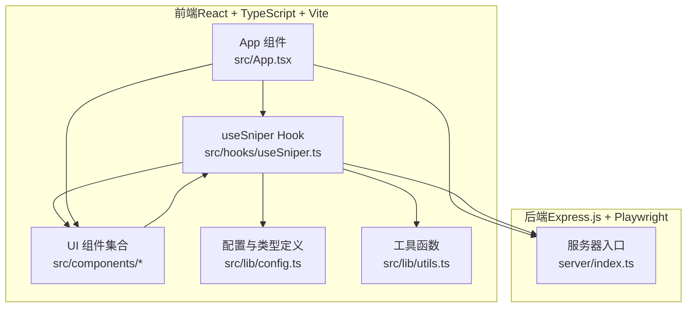
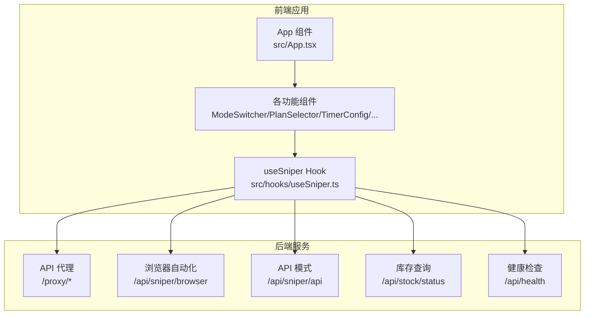
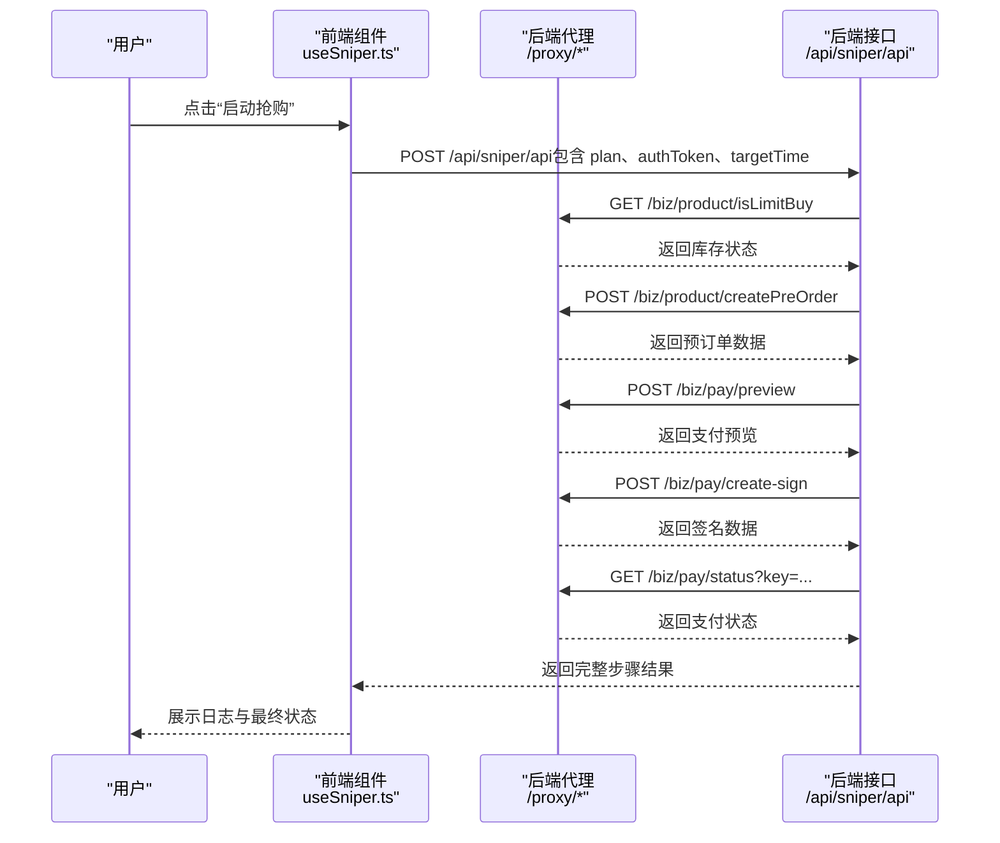
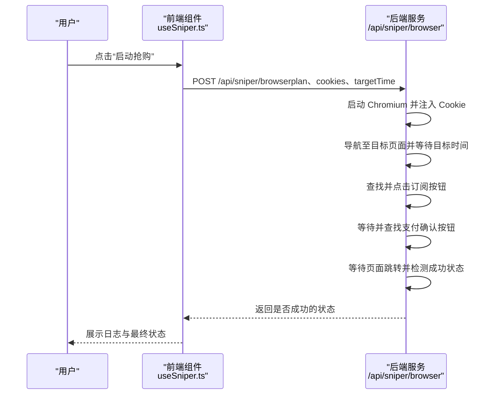
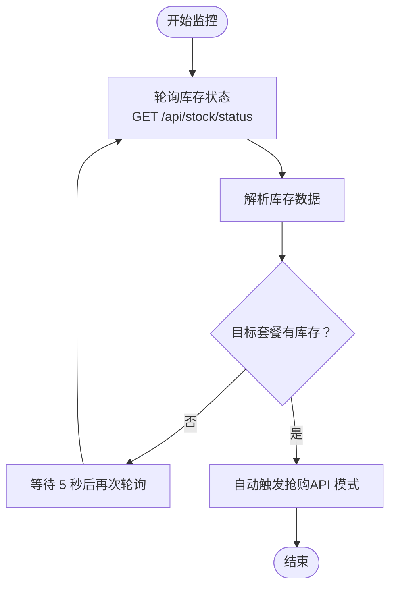
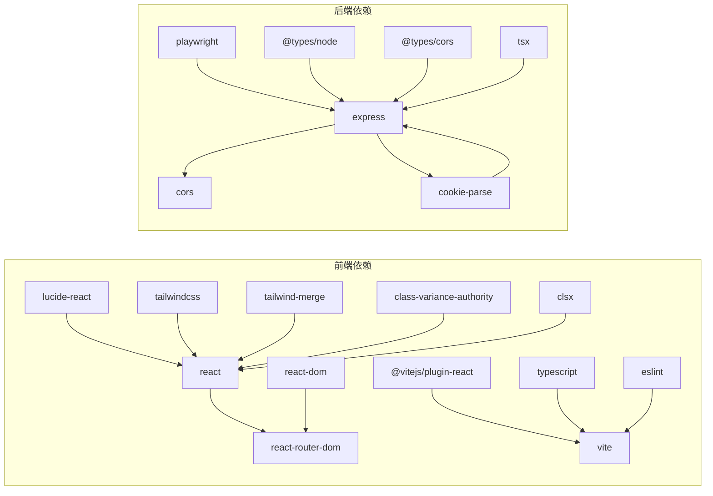

# 项目概述

<cite>
**本文档引用的文件**
- [README.md](file://README.md)
- [package.json](file://package.json)
- [src/App.tsx](file://src/App.tsx)
- [src/hooks/useSniper.ts](file://src/hooks/useSniper.ts)
- [src/lib/config.ts](file://src/lib/config.ts)
- [src/lib/utils.ts](file://src/lib/utils.ts)
- [src/components/ModeSwitcher.tsx](file://src/components/ModeSwitcher.tsx)
- [src/components/PlanSelector.tsx](file://src/components/PlanSelector.tsx)
- [src/components/TimerConfig.tsx](file://src/components/TimerConfig.tsx)
- [src/components/AuthPanel.tsx](file://src/components/AuthPanel.tsx)
- [src/components/StockMonitor.tsx](file://src/components/StockMonitor.tsx)
- [src/components/LogConsole.tsx](file://src/components/LogConsole.tsx)
- [src/components/ControlBar.tsx](file://src/components/ControlBar.tsx)
- [src/components/QuickGuide.tsx](file://src/components/QuickGuide.tsx)
- [server/index.ts](file://server/index.ts)
</cite>

## 目录
1. [引言](#引言)
2. [项目结构](#项目结构)
3. [核心组件](#核心组件)
4. [架构总览](#架构总览)
5. [详细组件分析](#详细组件分析)
6. [依赖分析](#依赖分析)
7. [性能考虑](#性能考虑)
8. [故障排除指南](#故障排除指南)
9. [结论](#结论)

## 引言
GLM Sniper 是一个基于 React + Node.js 的全栈抢购工具，专为智谱清言（GLM Coding Plan）限时抢购场景设计。项目提供双模式抢购系统：浏览器自动化模式与 API 高速模式，并集成智能库存监控与实时日志系统，帮助用户在高并发环境下提升抢购成功率。

- 核心价值
  - 双模式抢购：浏览器模式通过 Playwright 自动化模拟用户操作；API 模式通过直连后端接口实现更快速的下单流程。
  - 智能库存监控：定时轮询库存状态，支持在目标套餐有库存时自动触发抢购。
  - 实时日志系统：可视化记录抢购全流程，便于调试与追踪。
  - 跨域代理：内置 Express 代理，绕过浏览器 CORS 限制，保障 API 模式稳定运行。

- 目标用户
  - 需要参与限时抢购活动的个人用户与团队成员。
  - 对自动化脚本有一定了解，希望以最小成本获得最佳体验的开发者或技术爱好者。

- 解决的问题
  - 高并发场景下的网络延迟与验证码拦截导致的人工抢购失败。
  - 手动重复操作带来的效率低下与易错风险。
  - 缺乏统一的日志与监控机制，难以定位问题与优化策略。

## 项目结构
项目采用前后端分离架构，前端使用 React + TypeScript + Vite 构建，后端使用 Express.js + Playwright 提供代理与自动化能力。



**图表来源**
- [src/App.tsx:12-194](file://src/App.tsx#L12-L194)
- [src/hooks/useSniper.ts:46-406](file://src/hooks/useSniper.ts#L46-L406)
- [server/index.ts:1-370](file://server/index.ts#L1-L370)

**章节来源**
- [package.json:1-48](file://package.json#L1-L48)
- [src/App.tsx:12-194](file://src/App.tsx#L12-L194)
- [server/index.ts:1-370](file://server/index.ts#L1-L370)

## 核心组件
- 双模式抢购系统
  - 浏览器自动化模式：通过 Playwright 启动 Chromium，注入 Cookie，导航至目标页面，在指定时间自动点击订阅按钮并处理支付确认弹窗。
  - API 高速模式：通过后端代理转发请求，绕过 CORS 限制，按步骤调用接口完成库存检查、创建预订单、支付预览、签名确认与支付状态查询。
- 智能库存监控
  - 定时轮询库存状态，解析返回数据中的库存字段，动态更新界面状态与日志输出；在补货窗口期给出提示。
- 实时日志系统
  - 统一的日志格式与级别（info/success/warning/error），自动滚动至最新日志，支持清空与时间戳显示。
- 认证与配置
  - 支持两种认证方式：API 模式使用 Bearer Token；浏览器模式使用 Cookie 字符串；提供认证有效性验证与展示切换。
- 用户交互
  - 套餐选择、定时配置、模式切换、控制面板与快速指南，界面简洁直观，适合不同技术背景的用户。

**章节来源**
- [src/hooks/useSniper.ts:76-106](file://src/hooks/useSniper.ts#L76-L106)
- [src/hooks/useSniper.ts:110-248](file://src/hooks/useSniper.ts#L110-L248)
- [server/index.ts:42-159](file://server/index.ts#L42-L159)
- [server/index.ts:161-250](file://server/index.ts#L161-L250)
- [server/index.ts:252-355](file://server/index.ts#L252-L355)
- [src/components/LogConsole.tsx:17-77](file://src/components/LogConsole.tsx#L17-L77)
- [src/components/AuthPanel.tsx:14-119](file://src/components/AuthPanel.tsx#L14-L119)

## 架构总览
下图展示了前端应用与后端服务之间的交互关系，以及后端内部的三大核心能力：API 代理、浏览器自动化抢购与库存状态查询。



**图表来源**
- [src/App.tsx:12-194](file://src/App.tsx#L12-L194)
- [src/hooks/useSniper.ts:82-106](file://src/hooks/useSniper.ts#L82-L106)
- [src/hooks/useSniper.ts:129-248](file://src/hooks/useSniper.ts#L129-L248)
- [server/index.ts:10-40](file://server/index.ts#L10-L40)
- [server/index.ts:42-159](file://server/index.ts#L42-L159)
- [server/index.ts:161-250](file://server/index.ts#L161-L250)
- [server/index.ts:252-355](file://server/index.ts#L252-L355)
- [server/index.ts:357-369](file://server/index.ts#L357-L369)

## 详细组件分析

### 双模式抢购流程（API 模式）
该流程展示了 API 模式从启动到完成的关键步骤，包括库存检查、创建预订单、支付预览、签名确认与支付状态查询。



**图表来源**
- [src/hooks/useSniper.ts:110-248](file://src/hooks/useSniper.ts#L110-L248)
- [server/index.ts:161-250](file://server/index.ts#L161-L250)

**章节来源**
- [src/hooks/useSniper.ts:110-248](file://src/hooks/useSniper.ts#L110-L248)
- [server/index.ts:161-250](file://server/index.ts#L161-L250)

### 浏览器自动化抢购流程
该流程展示了浏览器模式如何在指定时间自动完成订阅与支付确认。



**图表来源**
- [src/hooks/useSniper.ts:76-106](file://src/hooks/useSniper.ts#L76-L106)
- [server/index.ts:42-159](file://server/index.ts#L42-L159)

**章节来源**
- [src/hooks/useSniper.ts:76-106](file://src/hooks/useSniper.ts#L76-L106)
- [server/index.ts:42-159](file://server/index.ts#L42-L159)

### 库存监控与自动触发
该流程展示了库存监控的轮询逻辑与在目标套餐有库存时的自动触发机制。



**图表来源**
- [src/hooks/useSniper.ts:318-352](file://src/hooks/useSniper.ts#L318-L352)
- [server/index.ts:252-355](file://server/index.ts#L252-L355)

**章节来源**
- [src/hooks/useSniper.ts:305-372](file://src/hooks/useSniper.ts#L305-L372)
- [server/index.ts:252-355](file://server/index.ts#L252-L355)

### 类型与配置关系
以下类图展示了前端核心类型与配置的关系，帮助理解数据结构与职责划分。

```mermaid
classDiagram
class SniperMode {
<<enum>>
"browser"
"api"
}
class PlanType {
<<enum>>
"lite"
"pro"
"max"
}
class SniperStatus {
<<enum>>
"idle"
"countdown"
"running"
"success"
"error"
}
class PlanConfig {
+type : PlanType
+name : string
+price : string
+productId : string
+badge : string
}
class SniperConfig {
+mode : SniperMode
+plan : PlanType
+targetTime : string
+targetDate : string
+autoRetry : boolean
+maxRetries : number
+retryInterval : number
}
class StockStatus {
+lite : Item
+pro : Item
+max : Item
+nextRelease : string
}
class Item {
+available : boolean
+message : string
}
SniperConfig --> PlanType
SniperConfig --> SniperMode
PlanConfig --> PlanType
StockStatus --> Item
```

**图表来源**
- [src/lib/config.ts:6-26](file://src/lib/config.ts#L6-L26)
- [src/lib/config.ts:10-16](file://src/lib/config.ts#L10-L16)
- [src/lib/config.ts:11-17](file://src/lib/config.ts#L11-L17)

**章节来源**
- [src/lib/config.ts:6-26](file://src/lib/config.ts#L6-L26)
- [src/lib/config.ts:10-16](file://src/lib/config.ts#L10-L16)
- [src/lib/config.ts:11-17](file://src/lib/config.ts#L11-L17)

## 依赖分析
- 前端依赖
  - React 生态：react、react-dom、react-router-dom
  - UI 与样式：lucide-react、tailwindcss、tailwind-merge、class-variance-authority、clsx
  - 构建与开发：@vitejs/plugin-react、typescript、vite、eslint
- 后端依赖
  - Web 框架：express、cors
  - 自动化与网络：playwright、cookie-parse
  - 类型与工具：@types/node、@types/cors、tsx



**图表来源**
- [package.json:14-26](file://package.json#L14-L26)
- [package.json:27-46](file://package.json#L27-L46)

**章节来源**
- [package.json:14-26](file://package.json#L14-L26)
- [package.json:27-46](file://package.json#L27-L46)

## 性能考虑
- 网络延迟补偿
  - 倒计时在目标时间前 2 秒触发，以补偿网络往返时间，提高命中精度。
- 轮询策略
  - 库存监控采用 5 秒间隔轮询，平衡实时性与资源消耗；在补货窗口期动态提示，减少无效请求。
- 日志与渲染
  - 日志容器自动滚动至最新条目，避免长列表渲染压力；日志级别与格式统一，便于过滤与分析。
- 自动化稳定性
  - 浏览器模式在目标时间前 2 秒刷新页面，确保页面状态最新；对多种选择器进行回退匹配，增强鲁棒性。
- 错误处理与重试
  - API 模式在创建预订单失败时进行有限次数的重试，避免瞬时错误导致整体失败；对验证码相关错误进行明确提示与引导。

[本节为通用性能建议，无需特定文件引用]

## 故障排除指南
- 后端服务未启动
  - 现象：API 模式或浏览器模式调用失败，日志提示连接失败。
  - 排查：确认已执行后端命令并监听本地端口；检查健康检查接口是否可用。
  - 参考路径：[server/index.ts:357-369](file://server/index.ts#L357-L369)
- 认证信息无效
  - 现象：验证 Token 或 Cookies 失败，无法发起抢购。
  - 排查：确保 Authorization 头或 Cookie 内容正确；在浏览器 DevTools 中复制最新凭据。
  - 参考路径：[src/components/AuthPanel.tsx:18-41](file://src/components/AuthPanel.tsx#L18-L41)
- 验证码拦截
  - 现象：请求被拦截，出现验证码页面。
  - 排查：API 模式需在官网完成验证码后重试；浏览器模式需手动完成拼图验证。
  - 参考路径：[src/hooks/useSniper.ts:157-167](file://src/hooks/useSniper.ts#L157-L167)
- 库存状态异常
  - 现象：库存查询失败或解析异常。
  - 排查：检查后端库存接口返回格式；关注补货窗口期的特殊提示。
  - 参考路径：[server/index.ts:252-355](file://server/index.ts#L252-L355)
- 浏览器模式无法点击
  - 现象：页面元素变化导致点击失败。
  - 排查：确认选择器回退逻辑生效；检查页面结构变化与网络加载状态。
  - 参考路径：[server/index.ts:86-115](file://server/index.ts#L86-L115)

**章节来源**
- [server/index.ts:357-369](file://server/index.ts#L357-L369)
- [src/components/AuthPanel.tsx:18-41](file://src/components/AuthPanel.tsx#L18-L41)
- [src/hooks/useSniper.ts:157-167](file://src/hooks/useSniper.ts#L157-L167)
- [server/index.ts:252-355](file://server/index.ts#L252-L355)
- [server/index.ts:86-115](file://server/index.ts#L86-L115)

## 结论
GLM Sniper 通过双模式抢购、智能库存监控与实时日志系统，为用户提供了高效、稳定的抢购解决方案。前端采用现代化 React + TypeScript + Vite 技术栈，后端结合 Express.js 与 Playwright 实现跨域代理与浏览器自动化，整体架构清晰、职责分明。对于初学者，项目提供了直观的 UI 与快速指南；对于有经验的开发者，项目具备良好的扩展性与可维护性，便于进一步定制与优化。